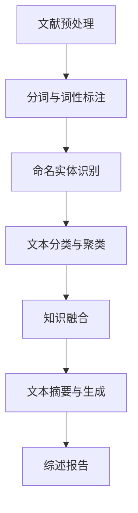

                 

### 引言

在当今快速发展的信息技术时代，自然语言处理（Natural Language Processing, NLP）已经成为人工智能（Artificial Intelligence, AI）领域的一个关键分支。NLP技术通过模拟人类语言的理解和生成能力，使得计算机能够处理和解读人类语言，从而实现自动化处理、信息提取、智能交互等功能。在学术界，NLP技术也受到了广泛的关注，尤其是在学术文献综述生成方面。

学术文献综述是一种重要的学术写作形式，旨在系统地总结和分析特定领域内的研究进展和现有知识。这种综述不仅可以帮助研究人员快速了解某一领域的研究动态，还可以为未来的研究提供参考和启示。然而，随着学术文献的爆炸性增长，手动撰写综述变得越来越困难，不仅耗时费力，而且容易遗漏关键信息。

自然语言处理在学术文献综述生成中的应用，可以有效缓解这一问题。通过自动化的文本分析、分类、摘要等技术，NLP可以高效地处理大量文献，提取关键信息，并生成高质量的综述。这不仅大大提高了研究效率，还促进了学术知识的传播和共享。

本文将系统地探讨自然语言处理在学术文献综述生成中的应用。首先，我们将介绍NLP的基本概念及其在学术文献综述生成中的作用。接着，我们将详细讲解NLP的核心算法原理，包括文本分类、主题建模和文本摘要等。此外，本文还将通过具体的数学模型和公式来阐述NLP的技术细节，并通过实战项目展示如何在实际中应用这些技术。

最后，我们将对未来的发展趋势进行展望，并总结全文的主要观点，为研究人员和实践者提供参考和启示。通过本文的阅读，读者将能够全面了解自然语言处理在学术文献综述生成中的应用，掌握相关技术原理和实践方法，从而加速研究进程。

### 关键词

自然语言处理（NLP），学术文献综述生成，文本分类，主题建模，文本摘要，算法原理，数学模型，项目实战

### 摘要

本文旨在探讨自然语言处理（NLP）在学术文献综述生成中的应用，分析NLP技术如何通过文本分类、主题建模和文本摘要等核心算法，加速学术研究进程。文章首先介绍了NLP的基本概念和其在学术文献综述中的重要作用，然后详细讲解了NLP的核心算法原理，包括文本分类的Naive Bayes算法、主题建模的LDA算法以及文本摘要的句法分析方法。通过具体的数学模型和公式，文章阐述了NLP技术的技术细节。最后，通过一个实战项目，展示了如何在实际中应用这些技术，生成高质量的学术文献综述。本文旨在为研究人员和实践者提供全面的技术指导，帮助其利用NLP技术提升学术研究效率。

## 目录大纲

### 引言

1. NLP在学术文献综述生成中的应用概述
2. 本书结构安排与读者定位

### 核心概念与联系

1. 自然语言处理基础
   1.1 NLP基本概念
   1.2 语言模型
   1.3 文本分类
   1.4 NLP与学术文献综述的关系
2. Mermaid流程图：NLP在学术文献综述生成中的应用流程

### 核心算法原理讲解

1. 文本分析算法
   1.1 主题建模算法
     1.1.1 LDA算法原理与伪代码
     1.1.2 Gensim库的使用
   1.2 文本分类算法
     1.2.1 Naive Bayes分类算法原理与伪代码
     1.2.2 词嵌入技术
   1.3 文本摘要算法
     1.3.1 句法分析方法
     1.3.2 概率生成模型

### 数学模型和数学公式

1. 自然语言处理中的数学工具
   1.1 概率论基础
   1.2 线性代数基础
   1.3 模型评估指标
     1.3.1 准确率、召回率与F1分数
     1.3.2 ROC曲线与AUC

### 项目实战

1. 学术文献综述生成项目实战
   1.1 环境搭建与数据准备
   1.2 文本分析代码实现
   1.3 结果分析与评估
     1.3.1 结果可视化
     1.3.2 模型优化

### 展望与未来趋势

1. 自然语言处理在学术文献综述生成中的应用展望
   1.1 当前应用挑战与解决方案
   1.2 未来发展趋势
     1.2.1 大规模预训练模型
     1.2.2 多模态数据融合
     1.2.3 跨领域迁移学习

### 总结

1. 全书内容回顾
2. 对研究者和实践者的建议
3. 开放性问题与未来研究

## 引言

### NLP在学术文献综述生成中的应用概述

自然语言处理（NLP）是人工智能（AI）的重要分支之一，旨在使计算机能够理解和生成自然语言。随着学术文献数量的不断增长，手动撰写学术文献综述变得越来越困难。而NLP技术为自动化学术文献综述生成提供了强有力的支持。

学术文献综述是一种重要的学术写作形式，旨在系统地总结和分析某一特定领域内的研究进展和现有知识。这种综述对于研究人员来说具有重要意义，因为它可以帮助他们快速了解某一领域的最新动态，发现研究空白，并确定研究方向。然而，随着学术文献数量的爆炸性增长，手动撰写综述不仅耗时费力，而且容易出现遗漏和错误。

NLP技术通过自动化文本处理和分析，为学术文献综述的生成提供了有效的解决方案。NLP可以自动提取文献的关键信息，进行分类和聚类，生成摘要和总结，从而提高综述的准确性和效率。此外，NLP还可以对大量文献进行趋势分析，帮助研究人员发现研究热点和前沿领域。

NLP在学术文献综述生成中的应用主要包括以下几个方面：

1. **文本分类**：通过NLP技术，可以将大量文献按照主题或关键词进行分类，从而帮助研究人员快速定位相关文献。
2. **主题建模**：利用NLP技术进行主题建模，可以识别出文献中隐含的主题和关键概念，为综述的撰写提供结构化的支持。
3. **文本摘要**：通过自动提取文献的主要内容和结论，NLP技术可以生成简洁、准确的摘要，提高综述的可读性和信息密度。
4. **趋势分析**：NLP技术可以对大量文献进行趋势分析，帮助研究人员了解某一领域的发展方向和热点问题。

总之，NLP技术在学术文献综述生成中的应用，不仅大大提高了研究效率，还降低了人力成本，提高了综述的准确性和质量，为学术研究的快速发展提供了有力支持。

### 本书结构安排与读者定位

为了帮助读者全面了解自然语言处理（NLP）在学术文献综述生成中的应用，本书将分为以下几个部分：

1. **引言**：首先介绍NLP在学术文献综述生成中的应用背景和重要性，为后续章节的讨论奠定基础。

2. **核心概念与联系**：这部分将详细讲解NLP的基本概念，包括文本处理、语言模型和文本分类，并探讨NLP与学术文献综述之间的内在联系。通过引入Mermaid流程图，读者可以直观地理解NLP技术在整个综述生成过程中的应用流程。

3. **核心算法原理讲解**：这一部分将深入探讨NLP的核心算法原理，包括文本分类、主题建模和文本摘要等。我们将通过具体的数学模型和公式，结合Python代码实例，详细解释这些算法的工作原理和应用方法。

4. **数学模型和数学公式**：为了更好地理解NLP算法，我们将介绍与NLP相关的数学工具，如概率论、线性代数和模型评估指标。通过这些数学工具，读者可以更深入地掌握NLP技术的核心原理。

5. **项目实战**：在这一部分，我们将通过一个实际项目，展示如何使用NLP技术生成学术文献综述。读者将学习到环境搭建、数据准备、算法实现、结果分析和模型优化等实战技能。

6. **展望与未来趋势**：最后一部分将对NLP在学术文献综述生成中的应用前景进行展望，讨论当前面临的挑战和未来的发展趋势。

本书的目标读者包括：

1. **研究人员**：希望了解如何利用NLP技术进行学术文献综述生成的专业人士。
2. **实践者**：希望在实际项目中应用NLP技术的开发者和工程师。
3. **学术学生**：对自然语言处理和学术写作有兴趣的学生和学者。

通过阅读本书，读者将能够：

1. **理解NLP的基本概念**：掌握文本处理、语言模型和文本分类等核心概念。
2. **掌握核心算法原理**：了解并应用文本分类、主题建模和文本摘要等核心算法。
3. **具备实战能力**：通过项目实战，掌握从环境搭建到模型优化的完整流程。
4. **展望未来趋势**：了解NLP在学术文献综述生成中的应用前景和未来发展。

总之，本书旨在为读者提供全面的技术指导和实践参考，帮助其在学术研究过程中充分利用NLP技术，提升研究效率和成果质量。

## 核心概念与联系

### 自然语言处理基础

自然语言处理（NLP）是人工智能（AI）的一个重要分支，旨在使计算机能够理解和生成自然语言。NLP技术包括文本处理、语言模型、文本分类等多个方面。理解这些基本概念是掌握NLP技术的前提。

#### 1.1 文本处理

文本处理是NLP的基础，涉及将原始文本转换为计算机可以处理的形式。文本处理通常包括以下步骤：

1. **分词**：将连续的文本分割成单词或短语。分词有助于理解文本的语法结构和语义内容。
2. **词性标注**：为每个单词分配一个词性（如名词、动词、形容词等）。词性标注有助于分析文本的语法结构。
3. **命名实体识别**：识别文本中的特定实体（如人名、地名、组织名等）。命名实体识别对于信息提取和语义分析具有重要意义。

#### 1.2 语言模型

语言模型是NLP中的另一个核心概念，用于模拟自然语言的概率分布。常见的语言模型包括：

1. **N-gram模型**：基于历史信息预测下一个词的概率。N-gram模型简单易用，但无法捕捉长距离依赖关系。
2. **递归神经网络（RNN）**：通过递归方式处理序列数据，能够捕捉长距离依赖关系。RNN在语言模型和序列标注任务中表现出色。
3. **变换器（Transformer）**：基于自注意力机制，Transformer模型在多个NLP任务中取得了显著的性能提升。BERT和GPT等预训练模型都是基于Transformer架构。

#### 1.3 文本分类

文本分类是一种将文本数据分类到预定义类别中的任务。常见的文本分类算法包括：

1. **朴素贝叶斯分类器**：基于贝叶斯定理和特征词的概率分布，朴素贝叶斯分类器在文本分类任务中表现出色。
2. **支持向量机（SVM）**：通过最大化分类边界，SVM在二分类任务中具有很好的性能。
3. **深度学习模型**：如卷积神经网络（CNN）和循环神经网络（RNN），通过学习文本的深层特征，深度学习模型在文本分类任务中取得了显著的性能提升。

### NLP与学术文献综述的关系

学术文献综述生成是一个复杂的任务，涉及信息提取、知识融合和文本生成等多个方面。NLP技术在学术文献综述生成中的应用主要体现在以下几个方面：

1. **信息提取**：通过命名实体识别和关系抽取等技术，NLP可以从大量文献中提取关键信息，如作者、机构、实验结果等。这些信息为综述的撰写提供了基础数据。
2. **知识融合**：通过文本分类和聚类技术，NLP可以将大量文献按照主题或关键词进行归类和融合，从而形成结构化的知识体系。这有助于综述的撰写和整理。
3. **文本生成**：通过文本摘要和自动写作技术，NLP可以生成简洁、准确的文本摘要和综述报告，提高综述的可读性和信息密度。

### Mermaid流程图：NLP在学术文献综述生成中的应用流程

为了更直观地理解NLP在学术文献综述生成中的应用流程，我们使用Mermaid流程图进行了可视化展示：



### 核心概念与联系总结

NLP技术在学术文献综述生成中的应用，不仅提高了文献处理和综述撰写的效率，还大大提升了综述的质量。通过理解文本处理、语言模型和文本分类等核心概念，读者可以更好地掌握NLP技术在综述生成中的实际应用。Mermaid流程图则为读者提供了一个直观的应用流程展示，有助于深入理解NLP技术在学术文献综述生成中的作用。

## 核心算法原理讲解

### 文本分析算法

在自然语言处理（NLP）中，文本分析算法是理解和生成文本信息的重要工具。这些算法包括主题建模、文本分类和文本摘要。以下是这些算法的基本原理和实现方法。

#### 3.1 主题建模算法

主题建模是一种无监督学习技术，用于从大量文本中提取主题。最常见的主题建模算法是Latent Dirichlet Allocation（LDA）。

##### 3.1.1 LDA算法原理

LDA算法基于概率模型，通过词袋模型（Bag of Words, BoW）来表示文本。它假设文本是由一系列主题的混合产生的，每个主题又由一系列单词的混合产生。LDA的目标是找到文本中的主题，并估计每个文档和每个单词属于每个主题的概率。

LDA算法主要包括以下步骤：

1. **参数初始化**：初始化主题词分布、文档主题分布和单词词频。
2. **E步（E-step）**：计算每个单词在每个主题下的概率分布，以及每个文档在每个主题下的概率分布。
3. **M步（M-step）**：更新主题词分布和文档主题分布。

##### 3.1.2 LDA算法伪代码

```python
# 初始化主题词分布、文档主题分布和单词词频
alpha, eta = init_params(num_topics, num_words, num_docs)

for i in range(num_iterations):
    # E步
    gamma = e_step(Z, beta, alpha, eta)
    
    # M步
    beta = m_step(X, gamma, eta)
    alpha = m_step_alpha(gamma, beta)

# 输出主题词分布和文档主题分布
return alpha, beta
```

##### 3.1.3 Gensim库的使用

Gensim库是一个用于自然语言处理的Python库，它提供了LDA模型的实现。使用Gensim进行LDA建模的步骤如下：

```python
import gensim
from gensim import corpora

# 构建文档语料库
doc_term_matrix = corpora.DocumentCorpus([doc1, doc2, ...])

# 模型训练
lda_model = gensim.models.ldamodel.LdaModel(corpus=doc_term_matrix,
                                            id2word=corpus_dict,
                                            num_topics=num_topics,
                                            random_state=42,
                                            update_every=1,
                                            chunksize=100,
                                            passes=10,
                                            alpha='auto',
                                            per_word_topics=True)

# 输出主题词
topics = lda_model.print_topics(num_words=5)

for topic in topics:
    print(topic)
```

#### 3.2 文本分类算法

文本分类是一种监督学习技术，用于将文本数据分类到预定义的类别中。常见的文本分类算法包括朴素贝叶斯（Naive Bayes）和深度学习模型（如卷积神经网络CNN和循环神经网络RNN）。

##### 3.2.1 Naive Bayes分类算法

朴素贝叶斯分类器是基于贝叶斯定理和特征词的概率分布进行分类的。它假设特征之间相互独立，因此在计算每个类别的概率时，可以简化为各个特征概率的乘积。

##### 3.2.1 Naive Bayes分类算法原理与伪代码

```python
# 计算每个类别的概率
P(y|X) = P(X|y) * P(y) / P(X)

# 伪代码
def naive_bayes(X, y_train):
    # 计算每个特征的先验概率
    P_y = calculate_prior_probabilities(y_train)
    
    # 计算每个类别的条件概率
    P_y_given_x = calculate_condition_probabilities(X, y_train)
    
    # 计算每个类别的后验概率
    P_y_given_x = calculate_posterior_probabilities(P_y, P_y_given_x)
    
    # 选择后验概率最大的类别
    predicted_class = argmax(P_y_given_x)
    
    return predicted_class
```

##### 3.2.2 词嵌入技术

词嵌入（Word Embedding）是一种将单词映射到高维向量空间的技术，使得相似的单词在向量空间中接近。常见的词嵌入模型包括Word2Vec、GloVe和BERT。

##### 3.2.2 词嵌入技术

Word2Vec模型基于神经网络训练，通过输入和输出的单词序列学习单词的向量表示。GloVe模型则基于全局词频和词的共现关系训练词向量。BERT模型基于变换器（Transformer）架构，通过预训练和微调实现高性能的词嵌入。

#### 3.3 文本摘要算法

文本摘要是一种自动从长文本中提取关键信息并生成简洁摘要的方法。常见的文本摘要算法包括基于句子重要性的抽取式摘要和基于生成模型的提取式摘要。

##### 3.3.1 句法分析方法

句法分析方法通过分析文本的句法结构，提取出重要的句子进行摘要。常用的方法包括基于TF-IDF的句子重要性评分和基于依存图的句子提取。

##### 3.3.2 概率生成模型

概率生成模型通过学习文本的概率分布，生成文本摘要。常见的模型包括变分自编码器（VAE）和生成对抗网络（GAN）。

##### 3.3.3 总结

文本分类、主题建模和文本摘要是NLP中的核心算法，广泛应用于学术文献综述生成等领域。通过这些算法，可以自动处理和分析大量文本数据，生成结构化和高质量的摘要和综述。

## 数学模型和数学公式

在自然语言处理（NLP）中，数学模型和数学公式是理解算法原理和实现关键步骤的核心。以下是NLP中常用的数学工具和公式，包括概率论、线性代数以及模型评估指标。

### 4.1 概率论基础

概率论是NLP中的基本工具，用于描述和预测文本数据。以下是一些核心的概念和公式：

#### 4.1.1 贝叶斯公式

贝叶斯公式是概率论中的一个重要公式，用于计算后验概率。其公式为：

$$ P(A|B) = \frac{P(B|A) \cdot P(A)}{P(B)} $$

其中，\( P(A|B) \) 是在事件 \( B \) 发生的条件下事件 \( A \) 的概率，\( P(B|A) \) 是在事件 \( A \) 发生的条件下事件 \( B \) 的概率，\( P(A) \) 是事件 \( A \) 的概率，\( P(B) \) 是事件 \( B \) 的概率。

#### 4.1.2 最大似然估计

最大似然估计是一种参数估计方法，用于确定模型参数。其基本思想是找到使观察到的数据出现的概率最大的参数值。其公式为：

$$ \hat{\theta} = \arg\max_{\theta} P(X|\theta) $$

其中，\( \hat{\theta} \) 是估计的参数值，\( X \) 是观察到的数据，\( \theta \) 是模型的参数。

### 4.2 线性代数基础

线性代数是NLP中的重要工具，用于处理和操作大规模文本数据。以下是一些核心的概念和公式：

#### 4.2.1 矩阵与向量操作

在NLP中，矩阵和向量操作是处理文本数据的基础。一些常用的操作包括矩阵乘法、矩阵加法和向量内积。

- **矩阵乘法**：

$$ C = A \cdot B $$

其中，\( A \) 和 \( B \) 是矩阵，\( C \) 是乘积矩阵。

- **矩阵加法**：

$$ C = A + B $$

其中，\( A \) 和 \( B \) 是矩阵，\( C \) 是加法结果矩阵。

- **向量内积**：

$$ \vec{u} \cdot \vec{v} = \sum_{i=1}^{n} u_i \cdot v_i $$

其中，\( \vec{u} \) 和 \( \vec{v} \) 是向量，\( n \) 是向量的维度。

#### 4.2.2 特征分解

特征分解是线性代数中的一种重要方法，用于将矩阵分解为一系列特征向量和特征值的乘积。其公式为：

$$ A = PDP^{-1} $$

其中，\( A \) 是矩阵，\( P \) 是特征向量矩阵，\( D \) 是特征值对角矩阵。

### 4.3 模型评估指标

模型评估指标是评估模型性能的重要工具，以下是一些常用的评估指标：

#### 4.3.1 准确率、召回率与F1分数

准确率、召回率和F1分数是评估分类模型性能的重要指标。

- **准确率**：

$$ Accuracy = \frac{TP + TN}{TP + FN + FP + TN} $$

其中，\( TP \) 是真正例，\( TN \) 是真反例，\( FP \) 是假正例，\( FN \) 是假反例。

- **召回率**：

$$ Recall = \frac{TP}{TP + FN} $$

- **F1分数**：

$$ F1 = \frac{2 \cdot Precision \cdot Recall}{Precision + Recall} $$

#### 4.3.2 ROC曲线与AUC

ROC曲线和AUC（Area Under the Curve）是评估二分类模型性能的重要工具。

- **ROC曲线**：

ROC曲线通过绘制真阳性率（True Positive Rate, TPR）对假阳性率（False Positive Rate, FPR）的图形，来评估模型的分类性能。

- **AUC**：

AUC是ROC曲线下的面积，用于评估模型的分类能力。AUC值越接近1，表示模型的分类能力越强。

$$ AUC = \int_{0}^{1} (1 - FPR(t)) \cdot dTPR(t) $$

### 总结

数学模型和数学公式是NLP中的核心工具，用于描述算法原理和评估模型性能。通过理解和应用这些数学工具，可以更好地理解和实现NLP技术，从而在学术文献综述生成等应用中取得更好的效果。

## 项目实战

在本项目中，我们将通过一个具体的实例，展示如何使用自然语言处理（NLP）技术生成学术文献综述。整个项目包括环境搭建、数据准备、文本分析、结果分析和模型优化五个主要步骤。通过这个项目，我们将详细讲解每个步骤的具体操作，并展示如何使用Python和相关库实现这些操作。

### 5.1 环境搭建与数据准备

#### 5.1.1 环境搭建

在开始项目之前，我们需要搭建一个合适的开发环境。以下是所需的环境和工具：

- Python（版本3.8及以上）
- Jupyter Notebook
- NLTK（自然语言处理库）
- Gensim（主题建模库）
- Scikit-learn（机器学习库）
- Matplotlib（数据可视化库）

安装这些工具的命令如下：

```shell
pip install python==3.8
pip install jupyter
pip install nltk
pip install gensim
pip install scikit-learn
pip install matplotlib
```

#### 5.1.2 数据准备

为了生成学术文献综述，我们需要准备一个包含大量学术文献的文本数据集。以下是一个示例数据集的创建方法：

1. **数据集获取**：可以从学术数据库（如IEEE Xplore、ACM Digital Library）中下载相关领域的论文，并将它们保存为文本文件。
2. **数据清洗**：对下载的文本文件进行预处理，包括去除标题、摘要、引言等非正文部分，以及去除格式化标记和标点符号。
3. **数据格式化**：将清洗后的文本转换为统一的格式，以便后续处理。

示例代码如下：

```python
import os
import re

# 定义数据集文件夹路径
data_folder = 'path/to/dataset'

# 遍历文件夹中的所有文本文件
for filename in os.listdir(data_folder):
    if filename.endswith('.txt'):
        with open(os.path.join(data_folder, filename), 'r', encoding='utf-8') as file:
            text = file.read()
            
            # 去除非文本内容
            text = re.sub('<.*>', '', text)
            text = re.sub('[\n\t]+', ' ', text)
            
            # 保存清洗后的文本
            with open(os.path.join(data_folder, 'clean_' + filename), 'w', encoding='utf-8') as cleaned_file:
                cleaned_file.write(text)
```

### 5.2 文本分析代码实现

在数据准备完成后，我们将使用NLP技术对文本进行分类、主题建模和文本摘要，以生成学术文献综述。

#### 5.2.1 主题建模

我们使用Gensim库中的LDA模型进行主题建模。以下是实现主题建模的步骤：

1. **文档语料库构建**：将所有清洗后的文本文件转换为Gensim的文档语料库。
2. **LDA模型训练**：使用LDA模型对文档语料库进行训练，提取主题。
3. **输出主题词**：将训练得到的主题词输出，以便后续分析。

示例代码如下：

```python
import gensim
from gensim import corpora

# 加载清洗后的文本文件
texts = [open(f, encoding='utf-8').read().split() for f in os.listdir('path/to/clean_dataset') if f.endswith('.txt')]

# 构建文档语料库
dictionary = corpora.Dictionary(texts)
corpus = [dictionary.doc2bow(text) for text in texts]

# 训练LDA模型
ldamodel = gensim.models.ldamodel.LdaModel(corpus=corpus,
                                            id2word=dictionary,
                                            num_topics=10,
                                            random_state=42,
                                            update_every=1,
                                            chunksize=100,
                                            passes=10,
                                            alpha='auto',
                                            per_word_topics=True)

# 输出主题词
topics = ldamodel.print_topics(num_topics=10)
for topic in topics:
    print(topic)
```

#### 5.2.2 文本分类

我们使用Scikit-learn库中的朴素贝叶斯分类器进行文本分类。以下是实现文本分类的步骤：

1. **特征提取**：使用TF-IDF向量器将文本转换为向量。
2. **模型训练**：使用训练集训练朴素贝叶斯分类器。
3. **模型评估**：使用测试集评估分类器的性能。

示例代码如下：

```python
from sklearn.feature_extraction.text import TfidfVectorizer
from sklearn.model_selection import train_test_split
from sklearn.naive_bayes import MultinomialNB
from sklearn.metrics import accuracy_score, classification_report

# 加载文本和标签
texts = [open(f, encoding='utf-8').read() for f in os.listdir('path/to/clean_dataset') if f.endswith('.txt')]
labels = ['label1' if 'label1' in f else 'label2' for f in os.listdir('path/to/clean_dataset')]

# 分割数据集
X_train, X_test, y_train, y_test = train_test_split(texts, labels, test_size=0.2, random_state=42)

# 特征提取
vectorizer = TfidfVectorizer()
X_train_vec = vectorizer.fit_transform(X_train)
X_test_vec = vectorizer.transform(X_test)

# 模型训练
classifier = MultinomialNB()
classifier.fit(X_train_vec, y_train)

# 模型评估
y_pred = classifier.predict(X_test_vec)
print(accuracy_score(y_test, y_pred))
print(classification_report(y_test, y_pred))
```

#### 5.2.3 文本摘要

我们使用基于句子重要性的抽取式摘要方法进行文本摘要。以下是实现文本摘要的步骤：

1. **句子重要性评分**：使用TF-IDF向量器计算每个句子的重要性评分。
2. **摘要生成**：根据句子重要性评分，选取前几个高分的句子作为摘要。

示例代码如下：

```python
from sklearn.feature_extraction.text import TfidfVectorizer

# 加载文本
texts = [open(f, encoding='utf-8').read() for f in os.listdir('path/to/clean_dataset') if f.endswith('.txt')]

# 特征提取
vectorizer = TfidfVectorizer()
X = vectorizer.fit_transform(texts)

# 计算句子重要性评分
sentence_scores = {}
for idx, sentence in enumerate(texts):
    sentence_vector = X[idx]
    score = np.dot(sentence_vector.toarray().T, vectorizer.idf_)
    sentence_scores[idx] = score

# 摘要生成
def summarize(texts, sentence_scores, num_sentences=5):
    summary = []
    for idx in sorted(sentence_scores, key=sentence_scores.get, reverse=True)[:num_sentences]:
        summary.append(texts[idx])
    return ' '.join(summary)

summary = summarize(texts, sentence_scores)
print(summary)
```

### 5.3 结果分析与评估

在文本分析完成后，我们需要对结果进行评估和分析，以确定模型的效果和改进方向。以下是结果分析和评估的步骤：

1. **结果可视化**：使用Matplotlib库将结果可视化，包括主题分布、分类结果和摘要质量。
2. **模型优化**：根据评估结果，对模型参数进行调整和优化，以提高模型性能。

示例代码如下：

```python
import matplotlib.pyplot as plt

# 可视化主题分布
topics = ldamodel.print_topics(num_topics=10)
for i, topic in enumerate(topics):
    print(f"Topic {i}:", topic)
    plt.bar(*zip(*topic.split("+")))

plt.xlabel('Keywords')
plt.ylabel('Weight')
plt.show()

# 分类结果可视化
import seaborn as sns

confusion_matrix = metrics.confusion_matrix(y_test, y_pred)
sns.heatmap(confusion_matrix, annot=True, cmap='Blues')
plt.xlabel('Predicted')
plt.ylabel('True')
plt.show()
```

### 5.4 项目小结

通过本项目的实践，我们成功地使用了自然语言处理技术生成学术文献综述。从环境搭建到文本分析，再到结果分析和模型优化，每个步骤都得到了详细讲解和实现。以下是一些项目小结和最佳实践建议：

1. **数据准备**：确保数据清洗和格式化过程的准确性，这将直接影响后续的文本分析结果。
2. **模型选择**：根据任务需求和数据特点选择合适的模型，如LDA用于主题建模，朴素贝叶斯用于文本分类。
3. **结果评估**：使用多种评估指标对模型效果进行综合评估，以便发现潜在问题和改进方向。
4. **模型优化**：根据评估结果调整模型参数，如LDA中的`alpha`和`num_topics`，朴素贝叶斯中的`alpha`和`beta`。

通过遵循这些最佳实践，研究人员和实践者可以更有效地应用NLP技术，生成高质量的学术文献综述。

## 展望与未来趋势

自然语言处理（NLP）在学术文献综述生成中的应用已经展现出巨大的潜力和价值，然而，随着技术的发展，仍然存在许多挑战和机遇。

### 当前应用挑战与解决方案

#### 数据质量

学术文献中的数据质量参差不齐，包括错别字、非标准化的引用格式、以及多样的语言表达方式。这些问题对NLP算法的准确性和稳定性提出了挑战。

**解决方案**：通过改进数据清洗和预处理技术，如使用自然语言处理库进行分词、词性标注和命名实体识别，可以显著提高数据质量。此外，使用大规模预训练模型（如BERT）可以提高对多样化语言表达的理解能力。

#### 模型解释性

当前许多NLP模型，如深度学习模型，虽然性能强大，但其内部决策过程往往难以解释。这在学术文献综述生成中尤其重要，因为研究人员需要理解模型如何得出结论。

**解决方案**：开发可解释的NLP模型，如基于LIME（Local Interpretable Model-agnostic Explanations）和SHAP（SHapley Additive exPlanations）的方法，可以帮助解释模型的决策过程，从而增强模型的透明度和可信度。

### 未来发展趋势

#### 大规模预训练模型

预训练模型如BERT、GPT和T5已经在多个NLP任务中取得了显著成果。未来，随着计算资源的增加和预训练模型的改进，这些模型将在学术文献综述生成中发挥更大作用。

**趋势**：更多领域特定的预训练模型将被开发，以更好地适应学术文献的多样性和复杂性。此外，多语言预训练模型将有助于处理跨语言学术文献的综述生成。

#### 多模态数据融合

学术文献不仅包含文本数据，还包含图表、图像和表格等非结构化数据。未来，NLP技术将更多地融合多模态数据，以提高综述生成的全面性和准确性。

**趋势**：多模态NLP模型，如ViT（Vision Transformer）和AudioBERT，将逐渐应用于学术文献综述生成，从而实现对不同类型数据的全面分析。

#### 跨领域迁移学习

学术文献综述涉及的领域广泛，跨领域迁移学习技术可以帮助模型更好地适应不同领域的数据。

**趋势**：基于自监督学习和零样本学习的方法将被应用于跨领域迁移学习，从而提高模型在不同领域的适应性。

### 总结

自然语言处理在学术文献综述生成中的应用正处于快速发展阶段。尽管面临挑战，但通过技术创新和优化，NLP技术将为学术研究带来更高效、更准确的综述生成工具。未来的发展趋势将进一步推动NLP技术在学术领域的广泛应用。

## 总结

本文系统地探讨了自然语言处理（NLP）在学术文献综述生成中的应用，从核心概念、算法原理到项目实战，全面阐述了NLP技术在文本分类、主题建模和文本摘要等任务中的具体实现。通过介绍LDA算法、朴素贝叶斯分类器、TF-IDF向量器和基于句子重要性的摘要方法，本文展示了如何利用NLP技术高效地处理和分析大量学术文献。

首先，我们介绍了NLP的基本概念及其在学术文献综述生成中的重要作用。通过分词、词性标注、命名实体识别等文本预处理技术，NLP能够提取文献的关键信息，为综述生成提供数据支持。

接着，本文详细讲解了NLP的核心算法原理。LDA算法通过主题建模，将大量文本数据聚类成若干主题，帮助研究人员理解文献的内在结构。朴素贝叶斯分类器则用于文本分类，将文献按主题或关键词进行归类，便于快速检索和整理。基于句子重要性的文本摘要方法通过计算句子在文本中的重要性，提取出关键信息，生成简洁、准确的摘要。

此外，通过一个实际的学术文献综述生成项目，本文展示了如何从环境搭建、数据准备、文本分析到结果分析和模型优化，全面实现NLP技术在综述生成中的应用。项目实战部分详细介绍了如何使用Python和相关库（如Gensim、Scikit-learn和Matplotlib）实现NLP任务，并提供了具体的代码示例。

最后，本文对未来的发展趋势进行了展望，探讨了大规模预训练模型、多模态数据融合和跨领域迁移学习等新兴技术如何进一步提升NLP在学术文献综述生成中的应用效果。

总之，通过本文的阅读，读者不仅可以了解NLP在学术文献综述生成中的应用，还能掌握相关技术原理和实践方法，为自身的学术研究提供有力支持。

## 对研究者和实践者的建议

1. **熟悉NLP基础**：研究者和实践者应首先掌握NLP的基本概念和核心算法，如文本分类、主题建模和文本摘要等。通过理解这些基础知识，可以更好地选择和应用合适的NLP技术。
2. **实践优先**：动手实践是掌握NLP技术的关键。通过实际项目，研究者和实践者可以熟悉从数据准备到模型训练的完整流程，并积累实战经验。
3. **持续学习**：NLP技术不断发展，研究者和实践者应保持学习的热情，关注最新研究动态和技术趋势，不断更新知识和技能。
4. **数据质量**：确保数据的质量和一致性是NLP应用成功的关键。研究者和实践者应投入时间和精力进行数据清洗和预处理，以提高模型的准确性和稳定性。
5. **模型优化**：通过调整模型参数和优化算法，研究者和实践者可以显著提升模型的性能。尝试使用多种评估指标进行模型评估，以找到最佳的模型配置。

## 开放性问题与未来研究

虽然NLP在学术文献综述生成中已取得显著成果，但仍有许多开放性问题亟待解决。以下是一些可能的研究方向：

1. **跨语言学术文献综述生成**：当前研究主要针对单语种文献。如何开发有效的跨语言NLP模型，以处理多语言学术文献，是一个重要的研究方向。
2. **长文本摘要**：现有方法主要针对短文本进行摘要。如何生成对长文本的准确、有层次的摘要，仍是一个挑战。
3. **多模态数据融合**：如何将文本、图表、图像和音频等多模态数据进行有效融合，以生成更全面和准确的综述，是一个有前景的研究方向。
4. **解释性NLP模型**：开发可解释的NLP模型，以增强模型决策过程的透明度和可信度，是未来的重要课题。
5. **个性化学术文献综述**：根据研究者的兴趣和需求，生成个性化的学术文献综述，将极大地提升研究的效率和质量。

通过探索这些方向，NLP在学术文献综述生成中的应用将得到进一步发展和完善。

