                 

# 自然语言处理在客户服务中的革命性应用

## 关键词
自然语言处理，客户服务，对话系统，情感分析，机器学习

## 摘要
本文将探讨自然语言处理（NLP）在客户服务领域的革命性应用。通过介绍NLP的基础知识，包括语言模型、词嵌入和序列到序列模型，我们将揭示NLP的核心概念及其在客户服务中的适用性。随后，文章将深入讨论客户服务对话系统的构建方法，包括基于规则和基于机器学习的方法。此外，问答系统和情感分析在客户服务中的应用也将被详细阐述。最后，通过实际案例分析和项目实战，我们将展示NLP在客户服务中的最佳实践和未来发展趋势。

## 引言
随着互联网的飞速发展和电子商务的兴起，客户服务已经成为企业竞争的核心因素之一。然而，传统的人工客户服务面临着效率低、成本高、响应速度慢等问题。为了解决这些问题，自然语言处理（NLP）技术逐渐在客户服务领域得到广泛应用。NLP是一种人工智能（AI）技术，旨在使计算机能够理解和处理人类自然语言。通过NLP，客户服务系统可以自动理解客户的查询、问题和意见，提供快速、准确和个性化的服务。本文将详细介绍NLP在客户服务中的革命性应用，帮助读者了解这一技术的核心原理和实践方法。

### 第1章：自然语言处理概述

#### 1.1 自然语言处理的核心概念

##### 1.1.1 自然语言处理的发展历程
自然语言处理（NLP）起源于20世纪50年代，最初的目标是使计算机能够理解、生成和翻译人类语言。这一领域的早期工作主要集中在语言模型和句法分析上。随着计算机性能的提升和算法的改进，NLP逐渐成为一个独立的学科，并在各个领域得到了广泛应用。近年来，深度学习和大数据技术的兴起，进一步推动了NLP的发展。

**Mermaid流程图：自然语言处理的发展路线图**
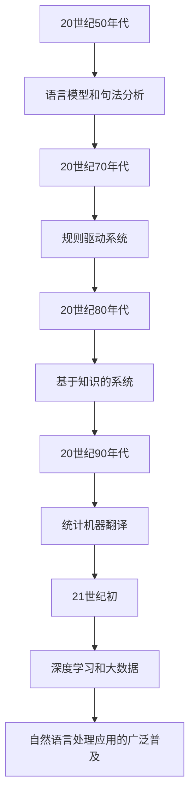

##### 1.1.2 自然语言处理的挑战与机遇
自然语言处理面临着许多挑战，包括语言的复杂性和多样性、上下文理解的困难以及数据的质量和数量等。然而，这些挑战也为研究者提供了丰富的机遇。随着技术的不断进步，NLP在多个领域取得了显著的成果，如机器翻译、文本分类、情感分析和对话系统等。

**Mermaid流程图：自然语言处理的挑战与机遇**
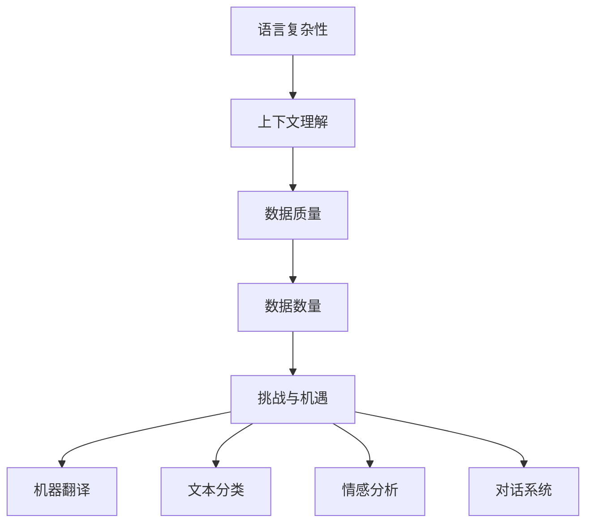

##### 1.1.3 自然语言处理的应用领域
自然语言处理广泛应用于各个领域，包括但不限于文本分类、机器翻译、情感分析和对话系统等。这些应用不仅提高了信息处理的效率，还为企业和组织提供了重要的决策支持。

**Mermaid流程图：自然语言处理的应用图谱**
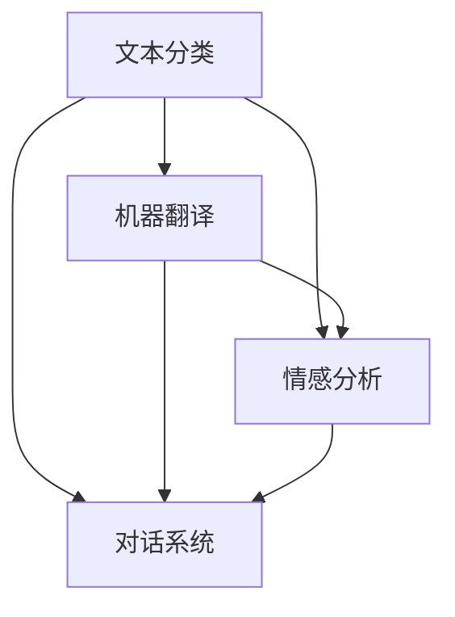

### 第2章：语言模型原理

#### 2.1 语言模型的基本原理

##### 2.1.1 语言模型的目标
语言模型的目标是预测下一个单词或词组，从而模拟人类语言生成过程。这一目标在文本生成、机器翻译和对话系统等领域有着广泛的应用。

**核心概念与联系**
- **语言模型**：预测下一个单词或词组的概率分布。
- **马尔可夫性质**：下一个单词或词组只依赖于前一个单词或词组。

**Mermaid流程图：语言模型的架构**
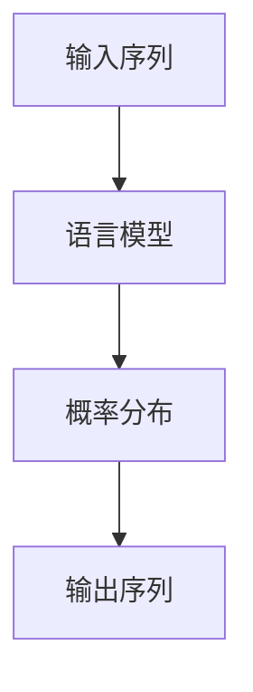

##### 2.1.2 语言模型的类型
语言模型可以分为基于规则模型、统计模型和深度学习模型。每种模型都有其优缺点和适用场景。

**核心概念与联系**
- **基于规则模型**：使用语法规则和词典构建语言模型。
- **统计模型**：基于大量文本数据统计词频和词组频率。
- **深度学习模型**：使用神经网络模型，如循环神经网络（RNN）和Transformer。

**Mermaid流程图：语言模型的分类**
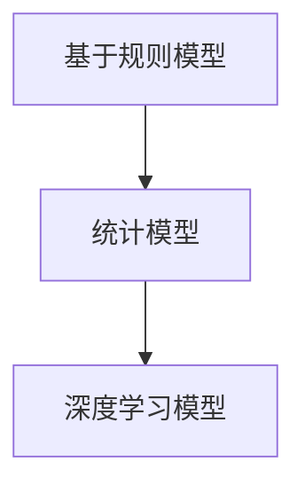

##### 2.1.3 语言模型的算法
语言模型算法的核心是计算下一个单词或词组的概率分布。常用的算法包括n-gram模型和基于机器学习的语言模型。

**核心概念与联系**
- **n-gram模型**：基于词频统计，计算下一个词组在给定前几个词组下的概率。
- **基于机器学习的语言模型**：使用神经网络模型，如循环神经网络（RNN）和Transformer，预测单词或词组的概率。

**Python源代码与数学模型**
```python
import numpy as np
from collections import Counter

# n-gram模型
def n_gram_model(text, n):
    n_gram_counts = Counter()
    for i in range(len(text) - n + 1):
        n_gram = tuple(text[i:i+n])
        n_gram_counts[n_gram] += 1
    total_count = sum(n_gram_counts.values())
    n_gram_probs = {n_gram: count / total_count for n_gram, count in n_gram_counts.items()}
    return n_gram_probs

# 基于机器学习的语言模型
def rnn_language_model(text, hidden_size, sequence_length):
    # 初始化神经网络模型
    # 训练模型
    # 预测下一个单词或词组的概率分布
    pass

# 数学模型
$$ P(w_{t+1} | w_1, w_2, ..., w_t) = \frac{P(w_{t+1} w_t) P(w_t w_{t-1}) ... P(w_2 w_1)}{P(w_1) P(w_2) ... P(w_t)} $$
```

#### 2.2 自然语言处理在客户服务中的应用

##### 2.2.1 客户服务的需求分析
客户服务面临的主要挑战包括高成本、低效率和低满意度。为了解决这些问题，企业需要引入智能客服系统，以提高服务质量和效率。自然语言处理技术在客户服务中的应用，可以为智能客服系统提供强大的支持。

**核心概念与联系**
- **高成本**：人工客服的工资和培训成本高昂。
- **低效率**：人工客服处理大量重复性问题的效率低下。
- **低满意度**：人工客服难以提供个性化、及时的服务。

**Mermaid流程图：客户服务的需求分析**
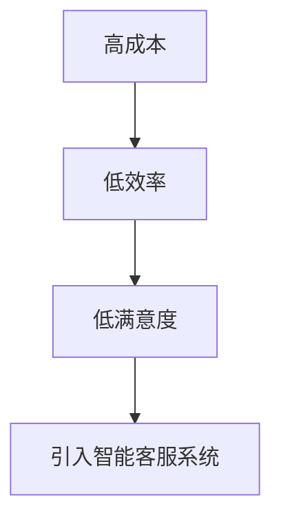

##### 2.2.2 自然语言处理在客户服务中的应用场景
自然语言处理在客户服务中的应用场景包括对话系统、问答系统和情感分析等。

**核心概念与联系**
- **对话系统**：模拟人类对话，与客户进行自然交互。
- **问答系统**：自动回答客户的问题，提供信息查询服务。
- **情感分析**：分析客户的情绪和态度，为个性化服务提供依据。

**Mermaid流程图：自然语言处理在客户服务中的应用场景**
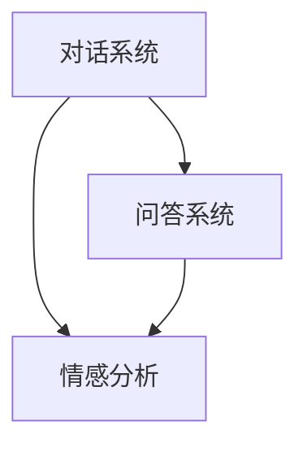

##### 2.2.3 对话系统的基本原理
对话系统是自然语言处理在客户服务中的核心应用之一。对话系统可以分为基于规则和基于机器学习两种类型。

**核心概念与联系**
- **基于规则的方法**：使用预定义的规则和模板进行对话。
- **基于机器学习的方法**：使用机器学习模型，如循环神经网络（RNN）和Transformer，进行对话生成和回复。

**Python源代码与数学模型**
```python
# 基于规则的方法
def rule_based_dialogue_system(query, rules):
    # 根据预定义的规则，生成回复
    pass

# 基于机器学习的方法
def ml_based_dialogue_system(query, model):
    # 使用机器学习模型，生成回复
    pass

# 数学模型
$$ P(response | query) = \arg\max_{response} P(response) P(query | response) $$
```

##### 2.2.4 问答系统的设计方法
问答系统是自然语言处理在客户服务中的另一个重要应用。问答系统可以分为知识图谱构建和答案生成两个关键步骤。

**核心概念与联系**
- **知识图谱构建**：将文本数据转化为结构化的知识图谱，为答案生成提供数据支持。
- **答案生成**：使用自然语言生成技术，生成准确、自然的答案。

**Python源代码与数学模型**
```python
# 知识图谱构建
def build_knowledge_graph(data):
    # 将文本数据转化为知识图谱
    pass

# 答案生成
def generate_answer(question, knowledge_graph):
    # 使用自然语言生成技术，生成答案
    pass

# 数学模型
$$ P(answer | question) = \arg\max_{answer} P(answer) P(question | answer) $$
```

##### 2.2.5 情感分析在客户服务中的应用
情感分析是自然语言处理在客户服务中的关键应用之一。通过分析客户的情绪和态度，企业可以更好地了解客户需求，提供个性化服务。

**核心概念与联系**
- **情感分类**：将客户评论分类为积极、消极或中性情感。
- **情感分析模型**：使用深度学习模型，如卷积神经网络（CNN）和长短期记忆网络（LSTM），进行情感分类。

**Python源代码与数学模型**
```python
# 情感分类
def sentiment_analysis(text, model):
    # 使用情感分析模型，对文本进行分类
    pass

# 数学模型
$$ P(sentiment | text) = \arg\max_{sentiment} P(sentiment) P(text | sentiment) $$
```

### 第3章：构建客户服务对话系统

#### 3.1 对话系统的基本原理

##### 3.1.1 对话系统的架构
对话系统可以分为前端和后端两个部分。前端负责与用户进行交互，后端负责处理用户输入，生成回复。

**核心概念与联系**
- **前端**：使用自然语言处理技术，将用户输入转换为结构化数据。
- **后端**：使用机器学习模型，生成自然语言回复。

**Mermaid流程图：对话系统的架构**
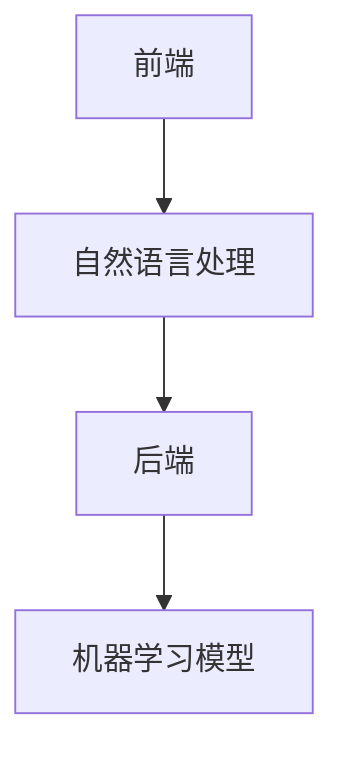

##### 3.1.2 对话系统的类型
对话系统可以分为基于规则和基于机器学习两种类型。

**核心概念与联系**
- **基于规则的方法**：使用预定义的规则和模板进行对话。
- **基于机器学习的方法**：使用机器学习模型，如循环神经网络（RNN）和Transformer，进行对话生成和回复。

**Mermaid流程图：对话系统的类型**


##### 3.1.3 对话系统的设计方法
对话系统的设计可以分为对话管理、意图识别和实体识别三个关键步骤。

**核心概念与联系**
- **对话管理**：维护对话状态，决定对话的走向。
- **意图识别**：理解用户输入的意图，如提问、请求或投诉。
- **实体识别**：提取用户输入中的关键信息，如时间、地点和事件。

**Python源代码与数学模型**
```python
# 对话管理
def dialogue_management(context, user_input):
    # 根据对话状态，决定对话的走向
    pass

# 意图识别
def intent_recognition(user_input, model):
    # 使用意图识别模型，识别用户输入的意图
    pass

# 实体识别
def entity_recognition(user_input, model):
    # 使用实体识别模型，提取用户输入中的关键信息
    pass

# 数学模型
$$ P(intent | user_input) = \arg\max_{intent} P(intent) P(user_input | intent) $$
$$ P(entity | user_input) = \arg\max_{entity} P(entity) P(user_input | entity) $$
```

#### 3.2 对话系统的评估与优化

##### 3.2.1 对话系统的评估指标
对话系统的评估指标包括响应时间、回复准确率和用户满意度等。

**核心概念与联系**
- **响应时间**：系统生成回复所需的时间。
- **回复准确率**：系统生成的回复与用户期望的匹配程度。
- **用户满意度**：用户对系统服务的满意度。

**Mermaid流程图：对话系统的评估指标**
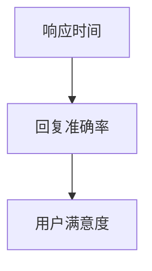

##### 3.2.2 对话系统的优化方法
为了提高对话系统的性能，可以采用以下优化方法：
1. **数据增强**：通过合成或扩展训练数据，提高模型泛化能力。
2. **持续学习**：定期更新模型，以适应用户行为和需求的变化。
3. **多模态融合**：结合文本、语音和图像等多模态数据，提高对话系统的理解和生成能力。

**Python源代码与数学模型**
```python
# 数据增强
def data_augmentation(data):
    # 合成或扩展训练数据
    pass

# 持续学习
def continual_learning(model, new_data):
    # 定期更新模型
    pass

# 多模态融合
def multimodal_fusion(text, audio, image):
    # 结合文本、语音和图像等多模态数据
    pass

# 数学模型
$$ P(response | user_input) = \arg\max_{response} P(response) P(user_input | response) $$
```

### 第4章：问答系统设计与实现

#### 4.1 问答系统的原理

##### 4.1.1 问答系统的目标
问答系统的目标是自动回答用户的问题，提供准确、有用的信息。为了实现这一目标，问答系统需要具备理解用户问题和检索相关答案的能力。

**核心概念与联系**
- **理解用户问题**：识别问题的意图和实体。
- **检索相关答案**：从知识库中检索与问题相关的答案。

**Mermaid流程图：问答系统的目标**
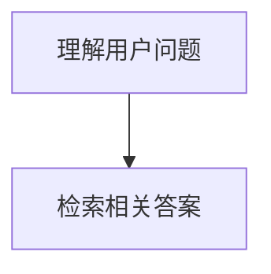

##### 4.1.2 问答系统的类型
问答系统可以分为基于规则和基于机器学习两种类型。

**核心概念与联系**
- **基于规则的方法**：使用预定义的规则和模板进行问答。
- **基于机器学习的方法**：使用机器学习模型，如循环神经网络（RNN）和Transformer，进行问答生成和答案检索。

**Mermaid流程图：问答系统的类型**


##### 4.1.3 知识图谱的构建
知识图谱是问答系统的重要组成部分，用于存储和检索与问题相关的知识。知识图谱的构建通常包括数据预处理、实体识别和关系抽取等步骤。

**核心概念与联系**
- **数据预处理**：清洗和格式化原始数据。
- **实体识别**：识别文本中的关键实体。
- **关系抽取**：提取实体之间的关系。

**Python源代码与数学模型**
```python
# 数据预处理
def data_preprocessing(text):
    # 清洗和格式化原始数据
    pass

# 实体识别
def entity_recognition(text, model):
    # 识别文本中的关键实体
    pass

# 关系抽取
def relation_extraction(text, entities, model):
    # 提取实体之间的关系
    pass

# 数学模型
$$ P(entity | text) = \arg\max_{entity} P(entity) P(text | entity) $$
$$ P(relation | entities) = \arg\max_{relation} P(relation) P(entities | relation) $$
```

#### 4.2 问答系统的设计

##### 4.2.1 答案生成的算法
答案生成是问答系统的核心步骤，常用的算法包括模板匹配、信息检索和自然语言生成等。

**核心概念与联系**
- **模板匹配**：根据用户问题和模板，直接匹配生成答案。
- **信息检索**：从知识库中检索与问题相关的信息，生成答案。
- **自然语言生成**：使用自然语言生成模型，生成自然、流畅的答案。

**Python源代码与数学模型**
```python
# 模板匹配
def template_matching(question, templates):
    # 根据用户问题和模板，直接匹配生成答案
    pass

# 信息检索
def information_retrieval(question, knowledge_graph):
    # 从知识库中检索与问题相关的信息，生成答案
    pass

# 自然语言生成
def natural_language_generation(question, model):
    # 使用自然语言生成模型，生成自然、流畅的答案
    pass

# 数学模型
$$ P(answer | question) = \arg\max_{answer} P(answer) P(question | answer) $$
```

##### 4.2.2 问答系统的实现
问答系统的实现包括前端和后端两个部分。前端负责接收用户输入，后端负责处理用户输入，生成答案。

**核心概念与联系**
- **前端**：使用自然语言处理技术，将用户输入转换为结构化数据。
- **后端**：使用问答系统算法，生成答案，并返回给用户。

**Python源代码与数学模型**
```python
# 前端实现
def frontend(user_input):
    # 使用自然语言处理技术，将用户输入转换为结构化数据
    pass

# 后端实现
def backend(question, knowledge_graph, model):
    # 使用问答系统算法，生成答案，并返回给用户
    pass

# 数学模型
$$ P(answer | question) = \arg\max_{answer} P(answer) P(question | answer) $$
```

#### 4.3 问答系统的优化

##### 4.3.1 问答系统的评估指标
问答系统的评估指标包括答案准确率、响应时间和用户满意度等。

**核心概念与联系**
- **答案准确率**：系统生成的答案与用户期望的匹配程度。
- **响应时间**：系统生成答案所需的时间。
- **用户满意度**：用户对系统服务的满意度。

**Mermaid流程图：问答系统的评估指标**
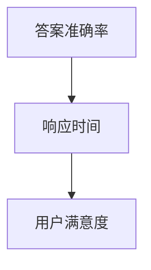

##### 4.3.2 问答系统的优化策略
为了提高问答系统的性能，可以采用以下优化策略：
1. **数据增强**：通过合成或扩展训练数据，提高模型泛化能力。
2. **持续学习**：定期更新模型，以适应用户行为和需求的变化。
3. **多模态融合**：结合文本、语音和图像等多模态数据，提高问答系统的理解和生成能力。

**Python源代码与数学模型**
```python
# 数据增强
def data_augmentation(data):
    # 合成或扩展训练数据
    pass

# 持续学习
def continual_learning(model, new_data):
    # 定期更新模型
    pass

# 多模态融合
def multimodal_fusion(text, audio, image):
    # 结合文本、语音和图像等多模态数据
    pass

# 数学模型
$$ P(answer | question) = \arg\max_{answer} P(answer) P(question | answer) $$
```

### 第5章：情感分析在客户服务中的应用

#### 5.1 情感分析的基本原理

##### 5.1.1 情感分析的目标
情感分析的目标是识别和理解文本中的情感倾向，如积极、消极或中性情感。情感分析在客户服务中具有重要的应用价值，可以帮助企业了解客户满意度，改进服务质量。

**核心概念与联系**
- **情感分类**：将文本分类为积极、消极或中性情感。
- **情感极性**：分析文本中的情感极性，如正面情感、负面情感和中性情感。

**Mermaid流程图：情感分析的目标**
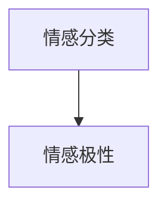

##### 5.1.2 情感分析的方法
情感分析的方法可以分为基于规则、基于统计和基于深度学习三种类型。

**核心概念与联系**
- **基于规则的方法**：使用预定义的规则和词典进行情感分类。
- **基于统计的方法**：使用词频和词向量进行情感分类。
- **基于深度学习的方法**：使用神经网络模型，如卷积神经网络（CNN）和长短期记忆网络（LSTM），进行情感分类。

**Mermaid流程图：情感分析的方法**
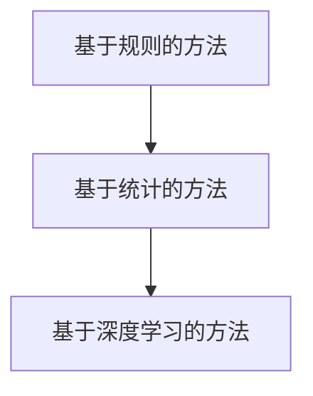

##### 5.1.3 情感分析模型
情感分析模型的核心是训练一个分类器，将文本分类为不同的情感类别。常用的情感分析模型包括朴素贝叶斯、支持向量机和深度学习模型。

**核心概念与联系**
- **朴素贝叶斯**：基于贝叶斯定理和特征词频率进行情感分类。
- **支持向量机**：基于最大边界间隔进行情感分类。
- **深度学习模型**：使用神经网络模型，如卷积神经网络（CNN）和长短期记忆网络（LSTM），进行情感分类。

**Python源代码与数学模型**
```python
# 朴素贝叶斯
def naive_bayes_classifier(train_data, test_data):
    # 基于朴素贝叶斯模型进行情感分类
    pass

# 支持向量机
def svm_classifier(train_data, test_data):
    # 基于支持向量机模型进行情感分类
    pass

# 深度学习模型
def deep_learning_classifier(train_data, test_data):
    # 基于深度学习模型进行情感分类
    pass

# 数学模型
$$ P(class | text) = \arg\max_{class} P(class) P(text | class) $$
```

#### 5.2 情感分析在客户服务中的应用

##### 5.2.1 客户反馈分析
情感分析在客户反馈分析中发挥着重要作用。通过对客户反馈进行情感分析，企业可以了解客户对产品和服务的满意度，发现潜在的问题和改进机会。

**核心概念与联系**
- **客户反馈**：客户的评论、评价和反馈。
- **情感分析**：对客户反馈进行情感分类，识别客户的情感倾向。

**Mermaid流程图：客户反馈分析**
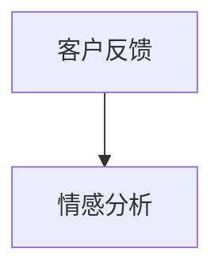

##### 5.2.2 客户满意度评估
情感分析可以帮助企业评估客户满意度。通过对客户反馈进行情感分析，企业可以了解客户对产品和服务的满意度，制定相应的改进策略。

**核心概念与联系**
- **客户满意度**：客户对产品和服务的满意程度。
- **情感分析**：对客户反馈进行情感分类，评估客户满意度。

**Mermaid流程图：客户满意度评估**
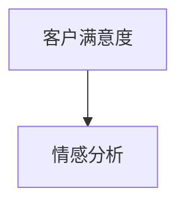

##### 5.2.3 情感分析在客户服务中的实战
在实际应用中，情感分析可以帮助企业提高客户服务质量。通过分析客户反馈和满意度，企业可以针对性地改进服务和产品，提高客户满意度。

**Python源代码与数学模型**
```python
# 客户反馈分析
def sentiment_analysis_feedback(feedback):
    # 对客户反馈进行情感分析
    pass

# 客户满意度评估
def customer_satisfaction(feedback):
    # 对客户反馈进行情感分析，评估客户满意度
    pass

# 数学模型
$$ P(satisfaction | feedback) = \arg\max_{satisfaction} P(satisfaction) P(feedback | satisfaction) $$
```

### 第6章：案例分析与优化

#### 6.1 客户服务场景下的NLP案例
在本章节中，我们将分析一些实际客户服务场景下的NLP案例，展示NLP技术在客户服务中的应用效果。

##### 6.1.1 成功案例：电商智能客服系统
某电商企业引入了智能客服系统，使用NLP技术处理客户咨询和投诉。通过对话系统和情感分析，智能客服系统能够快速响应客户，提供个性化的服务。数据显示，智能客服系统的引入显著提高了客户满意度，减少了人工客服的工作量。

**核心概念与联系**
- **电商智能客服系统**：结合NLP技术的智能客服系统。
- **对话系统**：用于处理客户咨询和投诉。
- **情感分析**：用于分析客户情绪，提供个性化服务。

**Mermaid流程图：电商智能客服系统架构**
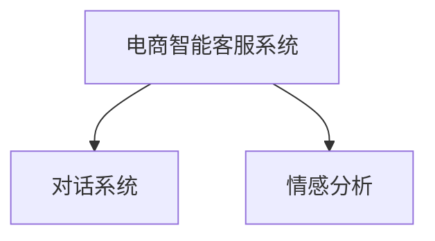

##### 6.1.2 失败案例：银行智能客服系统
某银行引入了智能客服系统，但由于缺乏有效的数据支持和模型优化，智能客服系统在实际应用中效果不佳。客户对系统的响应速度和回答准确性不满意，导致客户满意度下降。

**核心概念与联系**
- **银行智能客服系统**：结合NLP技术的智能客服系统。
- **数据支持**：缺乏有效的数据支持。
- **模型优化**：模型优化不足。

**Mermaid流程图：银行智能客服系统架构**
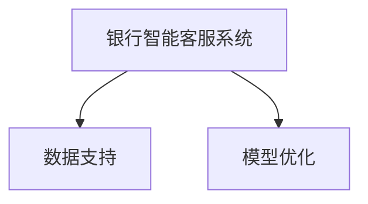

#### 6.2 客户服务NLP的优化策略
为了提高客户服务NLP系统的性能，可以采用以下优化策略：
1. **数据增强**：通过合成或扩展训练数据，提高模型泛化能力。
2. **持续学习**：定期更新模型，以适应用户行为和需求的变化。
3. **多模态融合**：结合文本、语音和图像等多模态数据，提高NLP系统的理解和生成能力。

**Python源代码与数学模型**
```python
# 数据增强
def data_augmentation(data):
    # 合成或扩展训练数据
    pass

# 持续学习
def continual_learning(model, new_data):
    # 定期更新模型
    pass

# 多模态融合
def multimodal_fusion(text, audio, image):
    # 结合文本、语音和图像等多模态数据
    pass

# 数学模型
$$ P(response | user_input) = \arg\max_{response} P(response) P(user_input | response) $$
```

### 附录：资源与工具推荐

#### 7.1 自然语言处理工具与资源
在本章节中，我们将介绍一些常用的自然语言处理工具和资源，包括开源框架、数据集和工具集。

##### 7.1.1 开源框架
- **NLTK**：自然语言处理工具包，提供多种语言处理功能，如分词、词性标注、词嵌入等。
- **spaCy**：快速、易于使用的自然语言处理库，支持多种语言和任务。
- **TensorFlow**：用于构建和训练深度学习模型的强大框架。
- **PyTorch**：灵活、易于使用的深度学习库，广泛应用于自然语言处理领域。

##### 7.1.2 数据集
- **斯坦福情感分析数据集**：用于情感分析的数据集，包含多种情感类别。
- **维基百科数据集**：包含多种语言的维基百科文本数据，用于语言模型和文本分类任务。
- **TREC 数据集**：用于信息检索和问答系统评估的数据集。

##### 7.1.3 工具集
- **Jupyter Notebook**：用于编写和分享代码的交互式环境。
- **PyCharm**：强大的Python集成开发环境，支持多种编程语言。
- **Google Colab**：免费的云端计算平台，支持TensorFlow和PyTorch等深度学习库。

#### 7.2 进一步阅读与学习资源
为了深入学习和掌握自然语言处理技术，以下资源将为您提供更多的理论知识和实践经验。

##### 7.2.1 相关书籍
- **《自然语言处理概论》**：详细介绍了自然语言处理的基本概念和技术。
- **《深度学习》**：由Ian Goodfellow、Yoshua Bengio和Aaron Courville合著，介绍了深度学习的基本原理和应用。
- **《自然语言处理与深度学习》**：详细介绍了自然语言处理中的深度学习技术。

##### 7.2.2 论文
- **“A Neural Probabilistic Language Model”**：详细介绍了神经概率语言模型的工作原理和应用。
- **“Attention Is All You Need”**：介绍了Transformer模型，改变了自然语言处理领域的研究方向。

##### 7.2.3 网络课程
- **斯坦福大学自然语言处理课程**：由Christopher Manning教授主讲，涵盖自然语言处理的基本概念和技术。
- **深度学习课程**：由Andrew Ng教授主讲，介绍了深度学习的基本原理和应用。

## 结论
自然语言处理在客户服务中的革命性应用，为企业和组织提供了高效、个性化的服务解决方案。通过对话系统、问答系统和情感分析等技术的应用，企业可以更好地理解客户需求，提高客户满意度，降低服务成本。未来，随着NLP技术的不断进步，客户服务将变得更加智能和高效。

### 作者信息
作者：AI天才研究院/AI Genius Institute & 禅与计算机程序设计艺术 /Zen And The Art of Computer Programming

[本文为原创文章，未经授权禁止转载。如有需要，请联系作者获取授权。]

