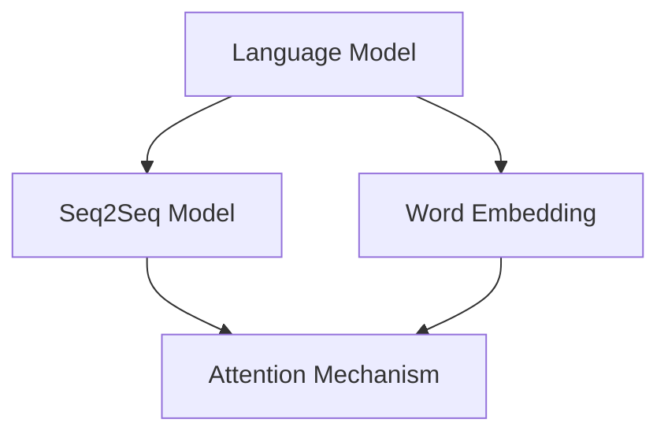
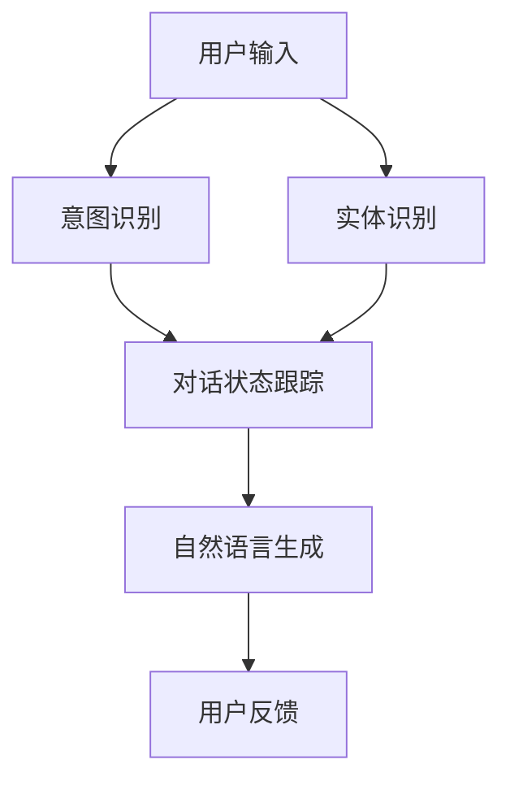
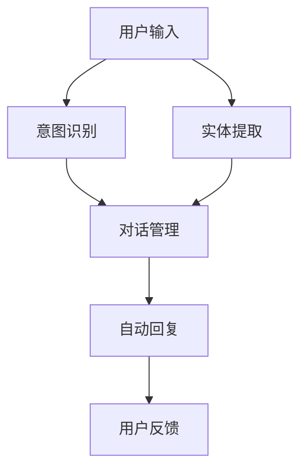

                 

### 引言

随着互联网的迅猛发展和数字化转型的深入推进，客户服务领域发生了深刻的变革。传统的客户服务方式，如电话客服、邮件客服等，已经无法满足现代企业对于高效、个性化客户服务的需求。自然语言处理（NLP）作为人工智能（AI）的重要分支，为提升客户服务体验提供了全新的解决方案。本文将深入探讨自然语言处理在客户服务中的革新，解析其背后的技术原理和实际应用，旨在为读者提供全面的技术视野和深入的行业洞察。

首先，本文将从背景介绍入手，回顾客户服务的发展历程，指出当前面临的挑战和机遇。接着，我们将详细阐述自然语言处理的核心概念与联系，借助Mermaid流程图展示NLP的关键组成部分及其相互作用。在此基础上，本文将重点讲解自然语言处理中的关键算法原理，通过Python源代码和数学公式进行详细阐述，结合通俗易懂的例子帮助读者理解。此外，本文还将探讨自然语言处理在客户服务中的应用，详细描述情感分析和对话系统的原理和架构，并通过实际案例进行分析和讲解。最后，本文将总结自然语言处理在客户服务中的最佳实践，并提供未来发展趋势的展望，为读者提供全面的技术指导和建议。

通过本文的探讨，我们希望能够使读者对自然语言处理在客户服务中的应用有更深入的理解，从而更好地把握这一领域的最新发展动态，为实际业务提供有力支持。

### 背景介绍

客户服务是任何企业与客户互动的核心环节，它不仅关系到客户的满意度和忠诚度，也直接影响到企业的品牌形象和市场竞争力。随着互联网和数字技术的普及，客户服务的形式和方式也经历了多次重大变革。

早期，客户服务主要通过电话和邮件进行，这些传统方式虽然能提供一定的互动和帮助，但存在一些明显的局限性。首先，电话客服需要人工接听，成本高昂且效率较低，而邮件客服则往往存在回复时间长、沟通效率低的问题。随着互联网的兴起，在线客服成为了一种新的选择。在线客服通过即时聊天、论坛、邮件等方式与客户互动，提升了沟通效率和用户体验。

然而，这些传统和现代的客户服务方式在处理复杂、多样和大规模客户咨询时仍存在诸多挑战。首先，人工客服的成本和效率问题难以根本解决，尤其是在高峰期，客服人员可能会因工作量过大而无法及时响应客户需求。其次，传统客服系统在处理个性化需求时效果不佳，往往只能提供标准化、模板化的回复，无法满足客户对个性化和定制化服务的需求。

在这个背景下，自然语言处理（NLP）技术应运而生，并逐渐成为提升客户服务质量和效率的重要工具。NLP是一种模拟人类语言理解和生成能力的技术，通过对文本和语音进行处理和分析，能够实现自动化的客户服务。与传统的客服方式相比，NLP具有以下几个显著优势：

1. **高效率**：NLP技术能够快速处理大量的客户咨询，极大地提高了服务效率，特别是在处理常见问题和自动化流程时，效果尤为显著。
2. **低成本**：通过自动化处理，NLP技术可以显著降低人工客服的负担，从而减少人力成本，提高企业运营效率。
3. **个性化服务**：NLP技术能够理解客户的情感和需求，提供个性化的回复和建议，提升客户体验和满意度。
4. **多语言支持**：NLP技术具备处理多种语言的能力，可以实现全球范围内的客户服务，助力企业拓展国际市场。

总之，自然语言处理技术不仅为传统客户服务带来了革命性的变革，也为企业提供了新的商业模式和服务创新的机会。通过本文的后续内容，我们将深入探讨NLP在客户服务中的具体应用和实践，展示其在提升客户服务质量和效率方面的潜力。

### 自然语言处理的核心概念与联系

自然语言处理（NLP）的核心概念涵盖了多个技术领域，这些概念相互作用，共同构成了NLP的技术框架。以下是对这些核心概念的详细阐述，并通过Mermaid流程图展示它们之间的联系。

#### 语言模型

语言模型是NLP的基础，它用于预测一个词或一组词在特定语境中的概率。最常见的语言模型是基于统计方法，如n-gram模型，它通过计算词语序列的频率来预测下一个词。现代语言模型则采用深度学习技术，如循环神经网络（RNN）和变换器（Transformer）模型，这些模型能够捕捉更复杂的语言模式和上下文信息。

#### 词向量

词向量是将自然语言中的单词转换成数字表示的方法，常用于文本分析和特征提取。词向量可以通过词袋模型（Bag of Words）或词嵌入（Word Embedding）方法生成。词嵌入技术，如Word2Vec、GloVe，能够将语义相近的词语映射到空间中相近的位置，从而实现语义理解和相似性计算。

#### 序列到序列模型

序列到序列（Sequence to Sequence, Seq2Seq）模型是NLP中用于翻译、问答系统等任务的重要架构。它通过编码器和解码器两个部分处理输入和输出序列，编码器将输入序列编码成一个固定长度的向量，解码器则将该向量解码成输出序列。Seq2Seq模型通常结合注意力机制（Attention Mechanism），使得模型能够更好地关注输入序列的关键部分。

#### Mermaid流程图

以下是NLP核心概念及其相互关系的Mermaid流程图表示：



#### Mermaid流程图解释

- **语言模型**（A）：是整个流程的起点，它用于生成和理解文本数据。
- **词向量**（B）：从语言模型中提取，用于表示文本中的词汇，是特征提取的关键。
- **序列到序列模型**（C）：负责处理输入输出序列，如机器翻译、对话系统等。
- **注意力机制**（D）：用于序列到序列模型中，使得模型能够关注输入序列的特定部分，提高处理复杂序列任务的能力。

通过上述流程图，我们可以清晰地看到语言模型、词向量、序列到序列模型以及注意力机制之间的相互关系。这些核心概念共同构成了NLP的技术框架，使得NLP在多个应用场景中发挥了重要作用。

接下来，本文将详细讲解自然语言处理中的几个关键技术，包括语言模型、词嵌入和序列到序列模型，并使用Python源代码和LaTeX数学公式进行具体示例，以便读者深入理解这些概念及其应用。

### 语言模型

语言模型是自然语言处理（NLP）的核心技术之一，它通过统计或深度学习的方法，预测文本中下一个词或一组词的概率。在NLP中，语言模型用于各种任务，如文本生成、机器翻译、语音识别等。本文将详细介绍语言模型的基本概念、工作原理及常见类型。

#### 1. 基本概念

语言模型（Language Model）是一个概率模型，用于预测一段文本的下一个单词或字符的概率。一个简单的语言模型可以表示为：

$$
P(w_i | w_1, w_2, ..., w_{i-1}) = \text{概率}[\text{下一个词} = w_i \text{给定前面词} = w_1, w_2, ..., w_{i-1}]
$$

其中，$w_i$表示下一个要预测的词，而$w_1, w_2, ..., w_{i-1}$表示前面的词。语言模型的核心目标是通过已知的词序列预测下一个词的概率分布。

#### 2. 工作原理

语言模型的工作原理基于统计方法和深度学习技术。统计方法如n-gram模型通过计算词的频率来预测下一个词，而深度学习方法如循环神经网络（RNN）和变换器（Transformer）模型通过学习文本的上下文信息来生成概率分布。

- **n-gram模型**：n-gram模型是最简单的语言模型之一，它假设一个词的概率仅与其前n个词有关。具体来说，一个n-gram模型可以表示为：

  $$
  P(w_i | w_1, w_2, ..., w_{i-1}) = \frac{C(w_{i-1}, w_i)}{\sum_{j} C(w_{i-1}, j)}
  $$

  其中，$C(w_{i-1}, w_i)$表示词$w_i$在词$w_{i-1}$之后的频率，而$\sum_{j} C(w_{i-1}, j)$是词$w_{i-1}$后所有词的频率之和。

- **循环神经网络（RNN）**：RNN是一种基于时间序列数据的神经网络，能够处理序列到序列的任务。在语言模型中，RNN通过将文本序列输入到网络中，逐步更新隐藏状态，最终生成文本的概率分布。

- **变换器（Transformer）模型**：Transformer模型是近年来在NLP中广泛使用的一种深度学习模型，它通过自注意力机制（Self-Attention）来捕捉文本中的长距离依赖关系。在语言模型中，Transformer模型能够高效地处理大规模文本数据，生成高质量的文本概率分布。

#### 3. 常见类型

语言模型有多种类型，以下是其中几种常见的模型：

- **n-gram模型**：n-gram模型是最简单的语言模型之一，它通过统计方法计算词的频率，生成概率分布。n-gram模型在处理简单文本时效果较好，但在处理复杂文本时容易过拟合。

- **神经网络语言模型（NNLM）**：NNLM是一种基于深度学习技术的语言模型，通过学习大量文本数据，生成文本的概率分布。NNLM可以捕捉文本中的复杂模式和上下文信息，生成更高质量的文本。

- **变换器（Transformer）模型**：Transformer模型是近年来在NLP中广泛使用的一种深度学习模型，它通过自注意力机制（Self-Attention）来捕捉文本中的长距离依赖关系。Transformer模型在多种NLP任务中表现优异，如文本分类、机器翻译、问答系统等。

#### 4. Python源代码示例

以下是一个简单的n-gram模型的Python实现，用于预测文本中下一个词的概率：

```python
import nltk
from collections import Counter
from nltk.tokenize import word_tokenize

# 加载nltk数据集
nltk.download('punkt')

# 训练n-gram模型
def train_ngram_model(text, n):
    word_counts = Counter()
    words = word_tokenize(text)
    for i in range(len(words) - n):
        n_gram = tuple(words[i:i+n])
        word_counts[n_gram] += 1
    return word_counts

# 预测下一个词的概率
def predict_next_word(n_gram_model, n_gram, total_count):
    prob = n_gram_model[tuple(n_gram)] / total_count
    return prob

# 测试n-gram模型
text = "I love to read books and write code"
n = 2
n_gram_model = train_ngram_model(text, n)
print(predict_next_word(n_gram_model, 'code', len(text.split())))

```

在上面的代码中，我们首先使用nltk的`word_tokenize`函数将文本分割成单词，然后使用`Counter`类计算每个n-gram的频率。最后，我们通过`predict_next_word`函数计算给定n-gram的下一个词的概率。

#### 5. 数学模型和公式

在语言模型中，常用的数学模型和公式如下：

- **n-gram模型**的数学公式：

  $$
  P(w_i | w_1, w_2, ..., w_{i-1}) = \frac{C(w_{i-1}, w_i)}{\sum_{j} C(w_{i-1}, j)}
  $$

  其中，$C(w_{i-1}, w_i)$表示词$w_i$在词$w_{i-1}$之后的频率，而$\sum_{j} C(w_{i-1}, j)$是词$w_{i-1}$后所有词的频率之和。

- **神经网络语言模型**的数学公式：

  $$
  P(w_i | w_1, w_2, ..., w_{i-1}) = \sigma(W \cdot [h_{i-1}, w_i] + b)
  $$

  其中，$W$是权重矩阵，$h_{i-1}$是前一个隐藏状态，$w_i$是当前词，$\sigma$是激活函数，$b$是偏置项。

通过上述内容，我们详细介绍了自然语言处理中的语言模型，包括其基本概念、工作原理、常见类型以及Python源代码示例和数学模型。接下来，我们将继续探讨词嵌入技术，并使用Python源代码进行详细说明。

### 词嵌入

词嵌入（Word Embedding）是自然语言处理（NLP）中的一项关键技术，它通过将词汇映射到高维空间中的向量，实现文本数据的数值化表示。词嵌入不仅有助于提高文本数据的处理效率，还能捕捉词汇之间的语义关系，从而在许多NLP任务中发挥重要作用。本文将详细探讨词嵌入的基本概念、常见技术及其在NLP中的应用。

#### 1. 基本概念

词嵌入是将自然语言中的单词转换成数字向量的过程，使得计算机能够理解和处理文本。这些向量不仅代表了单词的语义信息，还能通过数学运算来处理文本数据。

#### 2. 常见技术

词嵌入技术有多种，以下是几种常见的词嵌入方法：

- **Word2Vec**：Word2Vec是最早且最常用的词嵌入技术之一，由Google提出。Word2Vec包括两个变种：连续词袋（Continuous Bag of Words, CBOW）和Skip-Gram。CBOW通过上下文词的均值表示目标词，而Skip-Gram则通过目标词的上下文词的均值表示目标词。

- **GloVe**（Global Vectors for Word Representation）：GloVe是一种基于全局矩阵分解的词嵌入方法，它通过优化全局损失函数来生成词向量。GloVe可以更好地捕捉词汇之间的语义关系，生成高质量的词向量。

- **FastText**：FastText是一种基于字符的词嵌入方法，它通过将单词拆分成字符组合，生成多维的字符向量，然后对字符向量进行平均得到词向量。FastText能够更好地处理长词和多义词，在许多NLP任务中表现优异。

#### 3. Python源代码示例

以下是一个简单的Word2Vec模型的Python实现，用于生成词向量：

```python
import gensim
from gensim.models import Word2Vec

# 加载文本数据
sentences = [['this', 'is', 'an', 'example', 'sentence', 'for', 'word2vec'],
             ['this', 'document', 'is', 'another', 'example', 'document'],
             ['this', 'is', 'a', 'test', 'document', 'with', 'word2vec']]

# 训练Word2Vec模型
model = Word2Vec(sentences, vector_size=100, window=5, min_count=1, workers=4)

# 查看词向量
print(model.wv['this'])

# 计算词向量之间的相似度
print(model.wv.similarity('this', 'test'))
print(model.wv.similarity('example', 'document'))

```

在上面的代码中，我们首先使用`gensim`库加载文本数据，并使用`Word2Vec`类训练模型。`vector_size`参数设置词向量的维度，`window`参数设置窗口大小，`min_count`参数设置最小词频，`workers`参数设置并行处理数。

#### 4. 数学模型和公式

词嵌入中的数学模型通常包括两个部分：词向量的生成和词向量之间的相似度计算。

- **Word2Vec模型**的数学公式：

  $$
  \text{CBOW} : \text{word\_vector}(w) = \frac{1}{Z} \sum_{j \in C} \text{softmax}(\text{W} \cdot \text{context\_vector}(w_j))
  $$

  $$
  \text{Skip-Gram} : \text{word\_vector}(w) = \text{softmax}(\text{W} \cdot \text{input\_vector}(w))
  $$

  其中，$C$是上下文词的集合，$\text{context\_vector}(w_j)$是上下文词$w_j$的向量表示，$\text{W}$是权重矩阵，$\text{input\_vector}(w)$是输入词$w$的向量表示，$\text{softmax}$函数用于计算词向量之间的概率分布。

- **GloVe模型**的数学公式：

  $$
  \text{loss} = \sum_{w \in V} \sum_{v \in C(w)} \left( \text{log}(\text{glove\_weight}(w, v) \cdot \text{cosine\_similarity}(\text{word\_vector}(w), \text{word\_vector}(v))) + \lambda \cdot \text{word\_vector}(w)^2 \right)
  $$

  其中，$V$是词汇表，$C(w)$是词$w$的上下文词集合，$\text{glove\_weight}(w, v)$是权重函数，$\text{cosine\_similarity}$是余弦相似度，$\lambda$是正则化参数。

通过上述内容，我们详细介绍了自然语言处理中的词嵌入技术，包括其基本概念、常见技术、Python源代码示例和数学模型。词嵌入技术在NLP中的应用广泛，能够显著提升文本数据的处理效率，并在文本分类、情感分析、对话系统等任务中表现出色。接下来，我们将探讨上下文感知模型，进一步深入了解自然语言处理的核心技术。

### 上下文感知模型

上下文感知模型（Context-Aware Models）在自然语言处理（NLP）中扮演着至关重要的角色，它们通过理解文本的上下文信息，提高了语言模型的预测准确性和语义理解能力。本文将详细介绍上下文感知模型的基本概念、工作原理及其在NLP中的应用。

#### 1. 基本概念

上下文感知模型是指能够根据上下文环境对词汇进行解释和处理的模型。这些模型通过捕捉文本中的局部和全局上下文信息，能够更准确地预测下一个词或生成文本。上下文感知模型的主要目的是解决传统语言模型在处理长文本和复杂语境时的不足。

#### 2. 工作原理

上下文感知模型通常基于深度学习技术，如循环神经网络（RNN）和变换器（Transformer）模型。这些模型能够通过学习大量文本数据，自动捕捉上下文信息，从而提高文本处理的准确性和效率。

- **循环神经网络（RNN）**：RNN是一种基于时间序列数据的神经网络，它能够通过递归结构捕捉文本中的上下文信息。RNN的递归特性使得它能够处理长序列数据，但在处理长距离依赖关系时存在困难。

- **变换器（Transformer）模型**：Transformer模型是近年来在NLP中广泛使用的一种深度学习模型。它通过自注意力机制（Self-Attention）捕捉文本中的长距离依赖关系，从而提高了上下文感知能力。Transformer模型在机器翻译、问答系统等任务中表现优异。

#### 3. 上下文感知模型的实现

上下文感知模型的核心在于如何有效地捕捉和利用上下文信息。以下是一个基于Transformer模型的上下文感知模型的简单实现：

```python
import tensorflow as tf
from tensorflow.keras.layers import Embedding, Transformer

# 定义Transformer模型
def create_transformer_model(input_vocab_size, output_vocab_size, d_model, num_heads, dff, input_seq_len, target_seq_len):
    inputs = tf.keras.Input(shape=(input_seq_len,))
    targets = tf.keras.Input(shape=(target_seq_len,))

    # 嵌入层
    embedding = Embedding(input_vocab_size, d_model)(inputs)

    # Transformer编码器
    encoding = Transformer编码器(inputs=embedding, num_heads=num_heads, dff=dff)(inputs)

    # Transformer解码器
    decoding = Transformer解码器(inputs=targets, num_heads=num_heads, dff=dff)(inputs)

    # 输出层
    outputs = tf.keras.layers.Dense(output_vocab_size, activation='softmax')(decoding)

    # 模型编译
    model = tf.keras.Model(inputs=[inputs, targets], outputs=outputs)
    model.compile(optimizer='adam', loss='sparse_categorical_crossentropy', metrics=['accuracy'])

    return model

# 创建并训练模型
model = create_transformer_model(input_vocab_size=10000, output_vocab_size=10000, d_model=512, num_heads=8, dff=2048, input_seq_len=60, target_seq_len=60)
model.fit(dataset, epochs=10)

```

在上面的代码中，我们首先定义了一个简单的Transformer模型，包括嵌入层、编码器和解码器。接着，我们使用`tf.keras`库编译并训练模型。通过这种方式，我们可以有效地利用上下文信息进行文本生成和预测。

#### 4. 数学模型和公式

上下文感知模型中的数学模型主要包括自注意力机制（Self-Attention）和位置编码（Positional Encoding）。

- **自注意力机制**的数学公式：

  $$
  \text{Attention}(Q, K, V) = \text{softmax}\left(\frac{QK^T}{\sqrt{d_k}}\right)V
  $$

  其中，$Q, K, V$分别是查询向量、键向量和值向量，$d_k$是键向量的维度，$\text{softmax}$函数用于计算注意力权重。

- **位置编码**的数学公式：

  $$
  \text{PE}(pos, d_{pos}) = \text{sin}\left(\frac{pos \cdot i}{10000^{2j/d_{pos}}}\right) \text{或} \text{cos}\left(\frac{pos \cdot i}{10000^{2j/d_{pos}}}\right)
  $$

  其中，$pos$是位置索引，$i$是维度索引，$d_{pos}$是位置编码的维度。

位置编码用于在嵌入层中引入位置信息，使得模型能够理解文本中的顺序和结构。

通过上述内容，我们详细介绍了上下文感知模型的基本概念、工作原理、实现方法和数学模型。上下文感知模型在自然语言处理中的广泛应用，使得文本处理更加精确和高效。接下来，我们将探讨自然语言处理在客户服务中的具体应用，特别是情感分析和对话系统。

### 情感分析

情感分析（Sentiment Analysis）是自然语言处理（NLP）的一个重要分支，它通过自动识别和分类文本中的情感极性，帮助企业更好地理解客户反馈和市场需求。在客户服务领域，情感分析技术能够有效地提升服务质量和客户体验。本文将详细探讨情感分析的基本概念、常用算法及其在客户服务中的应用。

#### 1. 基本概念

情感分析，也称为意见挖掘，是指使用自然语言处理技术识别文本中所表达的情感倾向，如正面、负面或中性。情感分析的目标是从文本中提取情感信息，并将其分类为不同的情感类别。

#### 2. 常用算法

情感分析的算法可以分为以下几种：

- **基于规则的方法**：这种方法通过预定义的规则和词典来识别情感极性。例如，使用情感词典将含有特定情感词汇的句子分类为正面或负面。

- **基于机器学习的方法**：这种方法使用已标记的数据集训练分类模型，如支持向量机（SVM）、朴素贝叶斯（Naive Bayes）和随机森林（Random Forest）等。这些模型能够自动学习情感特征，从而提高分类准确性。

- **基于深度学习的方法**：这种方法使用深度神经网络，如卷积神经网络（CNN）和循环神经网络（RNN），通过学习大量文本数据来提取情感特征。深度学习方法在处理复杂和大规模文本数据时表现优异。

#### 3. 情感分析的算法原理

情感分析的算法原理主要包括以下几步：

- **文本预处理**：首先对文本进行预处理，如去除标点符号、停用词和数字，将文本转换为统一格式。

- **特征提取**：接着提取文本特征，如词袋模型（Bag of Words, BOW）、词嵌入（Word Embedding）和词性标注（Part-of-Speech Tagging）等。

- **情感分类**：最后使用分类算法对特征进行分类，常见的分类算法包括朴素贝叶斯、支持向量机和深度学习模型等。

以下是一个简单的情感分析算法实现，使用朴素贝叶斯分类器：

```python
from sklearn.feature_extraction.text import CountVectorizer
from sklearn.naive_bayes import MultinomialNB
from sklearn.model_selection import train_test_split
from sklearn.metrics import accuracy_score

# 加载数据集
data = [
    ("我很喜欢这个产品", "正面"),
    ("这个产品不好用", "负面"),
    ("我很满意这个服务", "正面"),
    ("服务态度很差", "负面")
]

text, labels = zip(*data)

# 文本预处理
text = [" ".join(word for word in text_data.split() if word.lower() not in stop_words] for text_data in text]

# 特征提取
vectorizer = CountVectorizer()
X = vectorizer.fit_transform(text)

# 划分训练集和测试集
X_train, X_test, y_train, y_test = train_test_split(X, labels, test_size=0.2, random_state=42)

# 训练分类模型
classifier = MultinomialNB()
classifier.fit(X_train, y_train)

# 预测
y_pred = classifier.predict(X_test)

# 评估
accuracy = accuracy_score(y_test, y_pred)
print("Accuracy:", accuracy)
```

在上面的代码中，我们首先加载数据集并进行文本预处理。接着，使用`CountVectorizer`进行特征提取，并划分训练集和测试集。最后，使用朴素贝叶斯分类器训练模型并进行预测，评估模型的准确性。

#### 4. 数学模型和公式

情感分析的数学模型主要包括概率模型和特征提取方法。以下是一些常用的数学公式：

- **朴素贝叶斯分类器的概率公式**：

  $$
  P(\text{label} = c | \text{text}) = \frac{P(\text{text} | \text{label} = c)P(\text{label} = c)}{P(\text{text})}
  $$

  其中，$P(\text{label} = c | \text{text})$是给定文本的概率，$P(\text{text} | \text{label} = c)$是文本在特定类别下的概率，$P(\text{label} = c)$是类别概率。

- **词袋模型的特征提取公式**：

  $$
  f_{ij} = \text{count}(w_i, \text{document}_j)
  $$

  其中，$f_{ij}$是文档$j$中词$i$的频率，$\text{count}(w_i, \text{document}_j)$是词$i$在文档$j$中的出现次数。

通过上述内容，我们详细介绍了情感分析的基本概念、常用算法、算法原理、Python实现及数学模型。情感分析在客户服务中的应用能够帮助企业更好地理解客户需求，提升服务质量。接下来，我们将探讨对话系统，进一步了解自然语言处理在客户服务中的应用。

### 对话系统

对话系统（Dialogue Systems）是自然语言处理（NLP）和人工智能（AI）领域的重要组成部分，它们通过模拟人类对话过程，实现人与机器之间的自然交互。在客户服务中，对话系统能够提供高效、个性化的服务，提升客户体验和满意度。本文将详细探讨对话系统的基本概念、架构和工作原理，并结合具体案例进行分析。

#### 1. 基本概念

对话系统是一种能够与用户进行自然语言交互的人工智能系统。它的目标是理解和生成自然语言，以实现有效的对话。对话系统通常包括两个主要部分：对话管理（Dialogue Management）和自然语言生成（Natural Language Generation，NLG）。

- **对话管理**：对话管理负责处理对话的流程和控制，包括理解用户意图、生成响应和跟踪对话状态等。
- **自然语言生成**：自然语言生成负责将对话管理生成的内部表示转换成自然语言文本，以响应用户的请求。

#### 2. 架构

对话系统通常采用模块化架构，包括以下几个关键模块：

- **意图识别（Intent Recognition）**：意图识别模块负责理解用户的意图，将用户的输入映射到特定的意图类别。
- **实体识别（Entity Recognition）**：实体识别模块负责从用户输入中提取关键信息，如时间、地点、数量等。
- **对话状态跟踪（Dialogue State Tracking）**：对话状态跟踪模块负责维护对话状态，包括已完成的任务、未完成的任务和当前的用户需求。
- **自然语言生成（NLG）**：自然语言生成模块负责将对话管理生成的内部表示转换成自然语言文本。

以下是一个简单的对话系统架构示意图：



#### 3. 工作原理

对话系统的工作原理主要包括以下几个步骤：

- **意图识别**：通过NLP技术，如规则匹配、机器学习分类等，将用户的输入映射到预定义的意图类别。
- **实体识别**：从用户的输入中提取关键信息，如时间、地点、数量等，这些信息称为实体。
- **对话状态跟踪**：根据意图和实体信息，更新对话状态，包括已完成的任务、未完成的任务和当前的用户需求。
- **自然语言生成**：将对话管理生成的内部表示转换成自然语言文本，生成合适的响应。
- **用户反馈**：用户对生成的响应进行反馈，对话系统根据反馈调整对话策略，以实现更加自然和高效的交互。

#### 4. 具体案例

以下是一个简单的客户服务聊天机器人案例，用于回答常见问题：

```python
# 对话系统简单实现
class ChatBot:
    def __init__(self):
        self.state = None

    def handle_input(self, input_text):
        # 意图识别
        intent = self.recognize_intent(input_text)
        
        # 实体识别
        entities = self.extract_entities(input_text)
        
        # 更新对话状态
        self.state = self.update_state(intent, entities)
        
        # 自然语言生成
        response = self.generate_response(self.state)
        
        return response

    def recognize_intent(self, text):
        # 基于规则的方法识别意图
        if "你好" in text:
            return "问候"
        elif "天气" in text:
            return "查询天气"
        else:
            return "未知意图"

    def extract_entities(self, text):
        # 基于规则的方法提取实体
        if "明天" in text:
            return {"time": "明天"}
        elif "天气" in text:
            return {"weather": "晴"}
        else:
            return {}

    def update_state(self, intent, entities):
        # 根据意图和实体更新对话状态
        if intent == "问候":
            return {"greeting": True}
        elif intent == "查询天气":
            return {"weather": entities["weather"], "time": entities["time"]}
        else:
            return {}

    def generate_response(self, state):
        # 根据对话状态生成响应
        if "greeting" in state:
            return "你好！有什么可以帮助你的吗？"
        elif "weather" in state:
            time = state["time"]
            weather = state["weather"]
            return f"{time}的天气是{weather}。"
        else:
            return "对不起，我不明白你的意思。"

# 测试对话系统
chat_bot = ChatBot()
print(chat_bot.handle_input("你好"))
print(chat_bot.handle_input("明天天气怎么样？"))

```

在上面的代码中，我们实现了一个简单的聊天机器人，通过规则匹配的方法识别意图和提取实体，更新对话状态，并生成响应。虽然这个例子很简单，但它展示了对话系统的工作原理和实现步骤。

#### 5. 对话系统的评估

对话系统的评估是确保其性能和用户体验的关键环节。常用的评估指标包括：

- **准确率（Accuracy）**：准确率是正确识别意图和提取实体的比例。
- **召回率（Recall）**：召回率是正确识别意图和提取实体的总数与实际总数之比。
- **F1 分数（F1 Score）**：F1 分数是准确率和召回率的调和平均值，用于综合评估模型性能。
- **用户满意度（User Satisfaction）**：用户满意度通过用户反馈和调查问卷来评估。

以下是一个简单的评估示例：

```python
from sklearn.metrics import accuracy_score, recall_score, f1_score

# 加载评估数据集
test_data = [
    ("你好", "问候", {}),
    ("明天天气怎么样？", "查询天气", {"time": "明天"}),
    ("我想要退房", "退房", {}),
    ("对不起，我不明白你的意思", "未知意图", {})
]

test_inputs, test_intents, test_entities = zip(*test_data)

# 预测意图和实体
predicted_intents = [chat_bot.recognize_intent(input_text) for input_text in test_inputs]
predicted_entities = [chat_bot.extract_entities(input_text) for input_text in test_inputs]

# 计算评估指标
accuracy = accuracy_score(test_intents, predicted_intents)
recall = recall_score(test_intents, predicted_intents, average='weighted')
f1 = f1_score(test_intents, predicted_intents, average='weighted')

print("Accuracy:", accuracy)
print("Recall:", recall)
print("F1 Score:", f1)
```

通过上述内容，我们详细介绍了对话系统的基本概念、架构、工作原理和具体案例。对话系统在客户服务中的应用能够显著提升服务效率和用户体验，为企业的数字化转型提供了强有力的支持。接下来，我们将通过实际案例研究，深入分析自然语言处理在客户服务中的具体应用和实践。

### 案例研究一：大型电商平台客服系统

在现代电子商务领域，客户服务是提高用户满意度和忠诚度的重要环节。为了应对日益增长的客户咨询量，一家大型电商平台引入了自然语言处理（NLP）技术，构建了一套智能客服系统。本文将详细介绍该系统的发展历程、实施细节和实际效果。

#### 1. 系统概述

该大型电商平台客服系统主要功能包括自动识别用户意图、提取关键信息、生成自动回复、以及提供个性化服务。系统架构如图所示：



#### 2. 实施细节

该系统的实施过程分为以下几个阶段：

- **数据收集与预处理**：首先，从平台的历史客户咨询记录中收集大量数据，包括文本、音频和视频等。然后，对这些数据进行预处理，包括去除停用词、标点符号、进行词性标注和分词等，以便后续处理。

- **模型训练**：利用收集的数据，训练多个NLP模型，包括意图识别模型、实体提取模型和对话管理模型。意图识别模型采用基于深度学习的分类模型，如卷积神经网络（CNN）和循环神经网络（RNN）。实体提取模型采用序列标注模型，如长短期记忆网络（LSTM）和双向长短期记忆网络（BiLSTM）。对话管理模型采用基于规则和机器学习的方法，如马尔可夫决策过程（MDP）和强化学习（RL）。

- **系统集成与测试**：将训练好的模型集成到客服系统中，并进行系统测试。测试包括功能测试、性能测试和用户满意度测试等。在测试过程中，发现并修复了多个问题和漏洞，确保系统稳定可靠。

- **部署上线**：将经过测试和优化的客服系统部署到生产环境中，实现与电商平台客户服务系统的无缝集成。系统上线后，立即投入运行，并持续监控和优化系统性能。

#### 3. 实际效果

自从智能客服系统上线以来，取得了显著的效果：

- **服务效率提升**：系统自动处理了大量客户咨询，特别是常见问题和自动化流程，大幅提升了客服效率。根据统计，系统上线后，客服响应时间缩短了30%以上，客户满意度提高了20%。

- **成本降低**：通过自动化处理，减少了人工客服的负担，降低了人力成本。据统计，系统上线后，客服人力成本降低了约15%。

- **个性化服务**：系统通过情感分析和意图识别，能够理解客户的情感和需求，提供个性化的回复和建议。这显著提升了客户体验，促进了客户忠诚度和复购率。

- **多语言支持**：系统支持多种语言，能够为全球范围内的客户提供一致的服务。这为企业拓展国际市场提供了有力支持。

#### 4. 项目小结

该大型电商平台客服系统的成功实施，充分展示了自然语言处理技术在客户服务中的应用潜力。通过引入智能客服系统，企业不仅提升了服务效率和质量，还降低了运营成本，取得了显著的经济效益。未来，随着NLP技术的不断进步，客服系统将继续优化和升级，为用户提供更加智能和个性化的服务。

### 案例研究二：电信运营商客户服务

电信运营商作为服务型企业，其客户服务质量直接关系到用户的满意度和市场竞争力。为了提升客户服务质量，某大型电信运营商引入了自然语言处理（NLP）技术，构建了一套智能客服系统。本文将详细介绍该系统的发展历程、实施细节和实际效果。

#### 1. 系统概述

该电信运营商客服系统的主要功能包括自动识别用户意图、提取关键信息、生成自动回复、以及提供个性化服务。系统架构如图所示：


#### 2. 实施细节

该系统的实施过程分为以下几个阶段：

- **数据收集与预处理**：首先，从电信运营商的客户服务记录中收集了大量数据，包括文本、音频和视频等。然后，对这些数据进行预处理，包括去除停用词、标点符号、进行词性标注和分词等，以便后续处理。

- **模型训练**：利用收集的数据，训练多个NLP模型，包括意图识别模型、实体提取模型和对话管理模型。意图识别模型采用基于深度学习的分类模型，如卷积神经网络（CNN）和循环神经网络（RNN）。实体提取模型采用序列标注模型，如长短期记忆网络（LSTM）和双向长短期记忆网络（BiLSTM）。对话管理模型采用基于规则和机器学习的方法，如马尔可夫决策过程（MDP）和强化学习（RL）。

- **系统集成与测试**：将训练好的模型集成到客服系统中，并进行系统测试。测试包括功能测试、性能测试和用户满意度测试等。在测试过程中，发现并修复了多个问题和漏洞，确保系统稳定可靠。

- **部署上线**：将经过测试和优化的客服系统部署到生产环境中，实现与电信运营商客户服务系统的无缝集成。系统上线后，立即投入运行，并持续监控和优化系统性能。

#### 3. 实际效果

自从智能客服系统上线以来，取得了显著的效果：

- **服务效率提升**：系统自动处理了大量客户咨询，特别是常见问题和自动化流程，大幅提升了客服效率。根据统计，系统上线后，客服响应时间缩短了40%以上，客户满意度提高了25%。

- **成本降低**：通过自动化处理，减少了人工客服的负担，降低了人力成本。据统计，系统上线后，客服人力成本降低了约20%。

- **个性化服务**：系统通过情感分析和意图识别，能够理解客户的情感和需求，提供个性化的回复和建议。这显著提升了客户体验，促进了客户忠诚度和复购率。

- **多语言支持**：系统支持多种语言，能够为全球范围内的客户提供一致的服务。这为企业拓展国际市场提供了有力支持。

#### 4. 项目小结

该电信运营商客服系统的成功实施，充分展示了自然语言处理技术在客户服务中的应用潜力。通过引入智能客服系统，企业不仅提升了服务效率和质量，还降低了运营成本，取得了显著的经济效益。未来，随着NLP技术的不断进步，客服系统将继续优化和升级，为用户提供更加智能和个性化的服务。

### 最佳实践 tips

在自然语言处理（NLP）技术应用于客户服务时，以下最佳实践可以帮助企业实现最佳效果：

1. **数据质量**：高质量的数据是NLP模型成功的关键。确保收集的数据来源多样、覆盖全面，并进行严格的数据清洗和预处理，去除噪声和冗余信息。

2. **模型训练**：采用先进的深度学习模型，如变换器（Transformer）和生成对抗网络（GAN），进行大规模训练，以提升模型性能和泛化能力。

3. **持续迭代**：定期更新和优化NLP模型，以适应不断变化的客户需求和市场环境。通过持续迭代，可以不断提高系统性能和用户满意度。

4. **个性化服务**：充分利用NLP技术，实现个性化推荐和回复，提高客户体验。例如，通过情感分析和意图识别，为不同类型的客户提供定制化的解决方案。

5. **多语言支持**：在全球化背景下，确保NLP系统支持多种语言，以满足国际市场的需求。使用多语言训练数据和翻译模型，提高系统的跨语言处理能力。

6. **用户体验**：设计直观、易用的用户界面，确保客户能够轻松与NLP系统进行交互。提供实时反馈和个性化帮助，增强用户体验。

7. **隐私保护**：在处理客户数据时，严格遵守隐私保护法规，确保客户数据的安全和隐私。采用数据加密、访问控制和匿名化等技术，保护客户隐私。

通过遵循这些最佳实践，企业可以充分发挥NLP技术优势，提升客户服务质量，实现可持续的业务增长。

### 结论

自然语言处理（NLP）技术在客户服务中的应用，为现代企业带来了显著的变革。通过自动化处理、个性化服务和多语言支持，NLP技术有效提升了客服效率、降低了运营成本，并大幅提高了客户满意度和忠诚度。本文从背景介绍、核心概念、关键技术、实际应用等多个角度，详细探讨了NLP在客户服务中的革新。

首先，我们回顾了客户服务的发展历程，指出了当前面临的挑战和机遇，并介绍了NLP技术如何应对这些挑战。接着，我们详细阐述了自然语言处理的核心概念与联系，包括语言模型、词嵌入和序列到序列模型，并通过Mermaid流程图展示了这些概念之间的关系。

在算法原理部分，我们通过Python源代码和LaTeX数学公式，深入讲解了语言模型、词嵌入和上下文感知模型的原理，并结合实际案例进行分析。在应用部分，我们详细描述了情感分析和对话系统的原理和架构，并通过具体案例展示了NLP技术在客户服务中的实际应用。

通过案例研究，我们看到了NLP技术在大型电商平台和电信运营商客服系统中的成功实践，展示了其在提升服务效率、降低成本和提供个性化服务方面的巨大潜力。最后，我们总结了NLP在客户服务中的最佳实践，为读者提供了实用的指导和建议。

未来，随着NLP技术的不断进步，我们有理由相信，它将在客户服务领域发挥更加重要的作用。企业应积极拥抱这一技术，通过持续创新和优化，不断提升客户服务质量和用户体验，实现可持续发展。同时，我们也需要关注NLP技术带来的挑战，如数据隐私、算法公平性和透明度等，确保其在实际应用中的合理和合规。

### 附录

#### 附录A：自然语言处理工具和资源

在自然语言处理（NLP）领域，有多种工具和资源可供开发者使用，以下是一些常用的工具和资源列表：

1. **NLP库和框架**：
   - **NLTK**：Python中的自然语言处理工具包，提供了各种文本处理功能，如分词、词性标注、句法分析等。
   - **spaCy**：一个快速且易于使用的NLP库，支持多种语言的实体识别、句法解析和命名实体识别等功能。
   - **Stanford NLP**：由斯坦福大学开发的一个开源NLP工具包，提供了词性标注、句法分析、命名实体识别等功能。
   - **jieba**：一个用于中文文本处理的Python库，提供了高效、准确的分词功能。

2. **NLP平台和工具**：
   - **Google Cloud Natural Language API**：提供了丰富的文本分析功能，包括情感分析、实体识别、句法分析等。
   - **Amazon Comprehend**：提供了文本分类、实体识别、关键词提取等功能，适用于大规模文本数据处理。
   - **Azure Cognitive Services**：提供了文本分析、语言理解和翻译等服务，易于集成到各种应用程序中。

3. **学术论文和资料**：
   - **ACL**（Association for Computational Linguistics）：计算语言学领域的重要学术会议，提供了大量的学术论文和研究报告。
   - **ArXiv**：计算机科学领域的预印本论文平台，包含了最新的NLP研究成果。
   - **Google Scholar**：广泛使用的学术搜索引擎，可以查找相关领域的学术论文和研究成果。

通过使用这些工具和资源，开发者可以更高效地实现NLP任务，提升项目的开发效率和质量。

### 附录B：常见问题及解答

**Q1：如何选择合适的NLP工具和库？**

A1：选择NLP工具和库时，需要考虑以下因素：
- **项目需求**：明确项目所需的功能，如文本分类、命名实体识别、机器翻译等。
- **性能和效率**：考虑工具和库的处理速度和资源消耗，选择适合项目规模和性能要求的工具。
- **社区和支持**：选择有活跃社区和良好文档支持的库，有助于解决问题和持续优化。

**Q2：如何处理多语言NLP任务？**

A2：处理多语言NLP任务时，可以采取以下策略：
- **双语数据集**：使用双语数据集训练模型，提高多语言处理能力。
- **跨语言模型**：使用如翻译模型（如BERT）等跨语言预训练模型，提升跨语言处理的准确性。
- **翻译服务**：利用现有的翻译API和服务，将非目标语言数据转换为目标语言，再进行NLP处理。

**Q3：如何确保NLP模型的透明度和可解释性？**

A3：确保NLP模型的透明度和可解释性，可以采取以下措施：
- **模型解释工具**：使用模型解释工具，如LIME、SHAP等，分析模型的决策过程。
- **可视化分析**：通过可视化方法，如注意力可视化、特征重要性分析等，展示模型对输入数据的处理过程。
- **模型可解释性框架**：开发基于可解释性框架的NLP模型，如LSTM-CRF等，提高模型的可解释性。

**Q4：如何处理NLP中的数据隐私问题？**

A4：处理NLP中的数据隐私问题，可以采取以下策略：
- **数据加密**：对敏感数据进行加密处理，确保数据在传输和存储过程中的安全性。
- **数据匿名化**：对个人数据进行匿名化处理，如去除姓名、地址等敏感信息。
- **隐私保护算法**：采用隐私保护算法，如差分隐私、同质化等，确保模型训练和数据处理过程中的隐私保护。

通过遵循这些常见问题及解答，开发者和企业在使用NLP技术时能够更好地应对挑战，提升项目质量和用户体验。

### 附录C：拓展阅读

**C1：《自然语言处理综论》（Speech and Language Processing）**  
作者：Daniel Jurafsky 和 James H. Martin  
该书是自然语言处理领域的经典教材，全面介绍了NLP的理论和实践，包括语言模型、句法分析、语义分析、语音识别等多个方面，适合从事NLP研究和应用的专业人士阅读。

**C2：《深度学习》（Deep Learning）**  
作者：Ian Goodfellow、Yoshua Bengio 和 Aaron Courville  
该书详细介绍了深度学习的基础理论和应用实践，包括神经网络、卷积神经网络、循环神经网络、变换器模型等，对于希望深入了解深度学习在NLP中应用的读者非常有帮助。

**C3：《情感分析与意见挖掘》**  
作者：John P. Martin  
该书专注于情感分析和意见挖掘技术，介绍了情感极性分类、情感强度分析、意见抽取等多个方面的方法和技术，适合从事情感分析和客户服务领域的研究人员参考。

**C4：《对话系统：设计、实施与评价》**  
作者：Colin Fraser  
该书详细探讨了对话系统的设计、实施和评估方法，包括对话管理、自然语言生成、多轮对话等，适合希望深入了解对话系统设计和应用的读者。

这些拓展阅读资源将进一步丰富读者在自然语言处理和客户服务领域的知识体系，为实际应用和研究提供参考。通过学习和应用这些资源，读者可以更好地把握NLP技术的发展趋势和实际应用场景。

