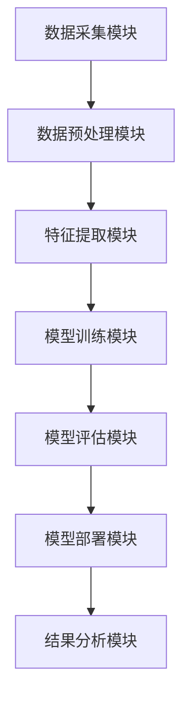

                 

# 引言

## 自然语言处理与情感分析

自然语言处理（Natural Language Processing，简称NLP）是计算机科学领域中的一个重要分支，它旨在使计算机能够理解、生成和处理人类语言。随着人工智能技术的飞速发展，NLP在各个行业中的应用越来越广泛，从机器翻译、语音识别到文本摘要、问答系统等，NLP技术正在深刻地改变我们的生活方式。

情感分析（Sentiment Analysis）是NLP中的一个重要子领域，其主要目标是识别和提取文本中的主观信息，判断用户或作者对某一主题或事件的态度和情感倾向。情感分析不仅可以帮助企业了解用户反馈、监控品牌声誉，还可以在社交媒体分析、舆情监测、市场调研等领域发挥重要作用。

本文将深入探讨自然语言处理在情感分析中的应用。首先，我们将回顾NLP的发展历程，介绍其核心任务和关键技术。接着，我们将详细讲解情感分析的原理、算法和应用场景。然后，我们将讨论情感分析的挑战和前沿技术，最后通过具体案例和项目实战来展示如何设计和实现情感分析系统。

## 文章关键词

- 自然语言处理
- 情感分析
- 语言模型
- 词向量
- 分词技术
- 情感极性分类
- 情感强度分析
- 情感细粒度分类
- 传统机器学习
- 深度学习
- 强化学习
- 多语言情感分析
- 情感迁移学习
- 系统设计与实现

## 文章摘要

本文系统地介绍了自然语言处理在情感分析中的应用。首先，回顾了NLP的基础知识，包括语言模型、词向量表示、分词技术和命名实体识别。接着，深入探讨了情感分析的原理、方法和应用场景。文章随后讨论了情感分析的挑战和前沿技术，如深度学习和多语言情感分析。最后，通过具体案例和项目实战，展示了如何设计和实现一个情感分析系统。通过本文的阅读，读者可以全面了解情感分析的原理和应用，掌握相关的技术手段和实战经验。

# 第一部分：自然语言处理基础

## 1.1 自然语言处理概述

### 1.1.1 NLP的发展历程

自然语言处理（NLP）作为人工智能的一个重要分支，其发展历程可以追溯到20世纪50年代。最初，NLP的目标是让计算机能够理解自然语言，实现人机对话。1954年，IBM的“电磁炮”项目成功地将英语翻译成俄语，标志着NLP研究的起步。随着计算能力和算法的不断进步，NLP经历了多个发展阶段。

在早期阶段，NLP主要依赖于基于规则的系统，这些系统通过编写大量规则来处理语言。然而，这种方法的局限性逐渐显现，因为自然语言复杂多变，难以用规则进行准确描述。

20世纪80年代，随着统计方法的发展，NLP进入了基于统计的时期。统计方法通过分析大量文本数据，提取语言特征，提高了处理自然语言的能力。其中，隐马尔可夫模型（HMM）和条件随机场（CRF）等算法成为这一时期的代表。

进入21世纪，深度学习技术的兴起为NLP带来了新的突破。深度学习模型，如循环神经网络（RNN）、卷积神经网络（CNN）和Transformer等，通过模拟人脑的神经网络结构，极大地提高了自然语言处理的效果。例如，Google的BERT模型和OpenAI的GPT系列模型，使得文本理解和生成任务取得了显著的进展。

### 1.1.2 NLP的核心任务

NLP的核心任务是使计算机能够对自然语言文本进行有效处理，主要包括以下几个方面：

1. **文本预处理**：包括分词、去停用词、词性标注等，目的是将原始文本转换为计算机可以处理的格式。
   
2. **词向量表示**：将单词转换为数值向量表示，以便于计算机进行计算和处理。词向量模型如Word2Vec和GloVe是这一领域的代表性工作。

3. **语言模型**：用于预测下一个单词或序列，是许多NLP任务的基础，如机器翻译、文本生成等。

4. **命名实体识别**：识别文本中的特定实体，如人名、地名、组织名等。

5. **情感分析**：判断文本的情感倾向，是本文的重点内容之一。

6. **文本分类**：根据文本内容将其分类到预定义的类别中，如垃圾邮件检测、新闻分类等。

7. **问答系统**：使计算机能够理解自然语言查询，并返回相关答案。

8. **机器翻译**：将一种语言的文本翻译成另一种语言，是NLP应用的一个重要领域。

### 1.1.3 NLP的基本流程

NLP的基本流程可以分为以下几个步骤：

1. **数据预处理**：包括文本清洗、分词、去停用词、词性标注等，目的是将原始文本转换为结构化数据。

2. **特征提取**：将预处理后的文本转换为数值特征，如词频、词袋模型、TF-IDF等。

3. **模型训练**：使用训练数据对模型进行训练，常见的模型有朴素贝叶斯、支持向量机（SVM）、决策树、随机森林等。

4. **模型评估**：使用测试数据评估模型的性能，常用的评估指标有准确率、召回率、F1值等。

5. **模型应用**：将训练好的模型应用到实际任务中，如文本分类、情感分析等。

6. **模型优化**：根据实际应用效果对模型进行调整和优化，以提高性能。

## 1.2 语言模型

### 1.2.1 语言模型的基本概念

语言模型（Language Model）是NLP中的一个核心概念，用于预测文本中下一个单词或序列的概率分布。其基本思想是，通过学习大量文本数据，构建一个概率模型，用于估计给定前文序列后某个单词或句子的概率。

语言模型可以基于统计方法和深度学习两种不同技术。在统计方法中，最常见的是N元语法（N-gram Model），它通过统计相邻N个单词的出现频率来预测下一个单词。深度学习方法中，循环神经网络（RNN）、长短期记忆网络（LSTM）和Transformer等模型被广泛应用。

### 1.2.2 语言模型的原理

语言模型的原理主要基于概率模型的思想。以N元语法为例，其核心思想是利用前N个单词来预测下一个单词。具体来说，N元语法通过统计训练数据中相邻N个单词的出现频率来计算它们的联合概率。

例如，对于一个三元语法模型，给定前三个单词 "I love", 我们可以计算下一个单词 "apple" 的概率：

$$
P(apple | I love) = \frac{P(apple, I love)}{P(I love)}
$$

其中，$P(apple, I love)$ 表示前三个单词同时出现的频率，$P(I love)$ 表示 "I love" 出现的频率。

### 1.2.3 语言模型的算法

1. **N元语法**：N元语法是最简单的语言模型，通过统计相邻N个单词的出现频率来预测下一个单词。其数学模型可以表示为：

   $$
   P(w_n | w_{n-1}, w_{n-2}, ..., w_{n-N}) = \frac{count(w_n, w_{n-1}, ..., w_{n-N})}{count(w_{n-1}, w_{n-2}, ..., w_{n-N})}
   $$

   其中，$count()$ 表示单词序列的出现次数。

2. **神经网络语言模型**：基于神经网络的模型，如RNN和LSTM，通过模拟人脑的神经网络结构来学习语言特征。RNN通过递归方式处理序列数据，而LSTM在此基础上引入门控机制，解决了RNN的长短时依赖问题。

   LSTM的数学模型可以表示为：

   $$
   h_t = \sigma(W_f \cdot [h_{t-1}, x_t] + b_f)
   $$

   $$
   i_t = \sigma(W_i \cdot [h_{t-1}, x_t] + b_i)
   $$

   $$
   \overline{o}_t = \sigma(W_o \cdot [h_t, x_t] + b_o)
   $$

   $$
   o_t = \sigma(\overline{o}_t \cdot h_t)
   $$

   其中，$h_t$ 表示隐藏状态，$x_t$ 表示输入特征，$W_f, W_i, W_o$ 分别为权重矩阵，$b_f, b_i, b_o$ 分别为偏置项，$\sigma$ 表示激活函数。

3. **Transformer模型**：Transformer模型是近年来在NLP领域取得巨大成功的模型，其核心思想是使用自注意力机制（Self-Attention）来处理序列数据。Transformer的数学模型可以表示为：

   $$
   \text{Attention}(Q, K, V) = \frac{softmax(\frac{QK^T}{\sqrt{d_k}})}{V}
   $$

   $$
   \text{MultiHeadAttention}(Q, K, V) = \text{Attention}(Q, K, V) + Q
   $$

   $$
   \text{Transformer}(E, N, H) = \text{LayerNorm}(E + \text{MultiHeadAttention}(E, E, E))
   $$

   其中，$E$ 表示输入嵌入向量，$N$ 表示注意力头数，$H$ 表示隐藏层维度。

### 1.2.4 语言模型的优缺点

1. **N元语法**：

   - **优点**：简单易懂，计算效率高，能够处理较长序列。

   - **缺点**：无法捕捉长距离依赖关系，性能受限。

2. **神经网络语言模型**：

   - **优点**：能够捕捉长距离依赖关系，性能优于N元语法。

   - **缺点**：计算复杂度高，训练和推理时间较长。

3. **Transformer模型**：

   - **优点**：效率高，能够捕捉长距离依赖关系，适应性强。

   - **缺点**：参数量巨大，计算资源需求高。

### 1.2.5 语言模型的应用

语言模型在NLP中有广泛的应用，主要包括：

1. **文本生成**：通过预测下一个单词或句子，生成连贯的文本。

2. **机器翻译**：将一种语言的文本翻译成另一种语言。

3. **语音识别**：将语音信号转换为文本。

4. **问答系统**：根据用户输入的问题，返回相关答案。

5. **情感分析**：判断文本的情感倾向。

## 1.3 词向量表示

### 1.3.1 词向量的发展历程

词向量（Word Vector）是将单词表示为向量的一种方法，最早可以追溯到1980年代。最初，词向量主要基于分布式表示（Distributed Representation）的思想，通过将单词映射到一个高维空间中的点，使得相似单词在空间中靠近。随着计算能力和算法的发展，词向量在NLP领域取得了显著进展。

2003年，Tomas Mikolov等人提出了Word2Vec算法，该算法基于神经概率语言模型，通过训练大量文本数据，将单词映射到低维向量空间中。Word2Vec算法包括两个主要变种：连续词袋（CBOW）和Skip-Gram。

2014年，GloVe（Global Vectors for Word Representation）算法提出了基于矩阵分解的方法，通过优化单词共现矩阵，进一步提高了词向量的质量。

近年来，词嵌入（Word Embedding）技术不断发展和完善，出现了许多基于深度学习的词向量模型，如FastText、BERT等，使得词向量的表示能力得到进一步提升。

### 1.3.2 词向量模型

1. **Word2Vec模型**：

   - **连续词袋（CBOW）**：通过预测中心词周围的词来生成词向量。具体来说，给定一个中心词，CBOW模型预测中心词周围的多个词，其数学模型可以表示为：

     $$
     P(w_i | w_{-n}, w_{-n+1}, ..., w_{n-1}, w_{n+1}, ..., w_{N-n}) = \frac{\exp(v \cdot w_n)}{\sum_{j=1}^{V} \exp(v \cdot w_j)}
     $$

     其中，$v$ 表示词向量，$w_i$ 表示输入词，$N$ 表示窗口大小，$V$ 表示词汇表大小。

   - **Skip-Gram**：与CBOW相反，Skip-Gram通过预测中心词来生成词向量。其数学模型可以表示为：

     $$
     P(w_i | w_j) = \frac{\exp(v_i \cdot v_j)}{\sum_{k=1}^{V} \exp(v_k \cdot v_i)}
     $$

2. **GloVe模型**：

   - **原理**：GloVe模型通过优化单词共现矩阵来生成词向量。具体来说，给定一个训练数据集，GloVe模型定义单词共现矩阵$C$，其中$C_{ij}$ 表示单词$i$和单词$j$的共现次数。GloVe模型的目标是最小化以下损失函数：

     $$
     \sum_{i=1}^{V} \sum_{j=1}^{V} \left( \log C_{ij} - \frac{v_i \cdot v_j}{1 + \alpha \cdot |v_i| + \alpha \cdot |v_j|} \right)^2
     $$

     其中，$\alpha$ 是调节参数，用于控制词向量的大小。

   - **数学模型**：

     $$
     \frac{\partial}{\partial v_i} \left( \log C_{ij} - \frac{v_i \cdot v_j}{1 + \alpha \cdot |v_i| + \alpha \cdot |v_j|} \right) = - \frac{v_j}{1 + \alpha \cdot |v_i| + \alpha \cdot |v_j|} - \frac{C_{ij} \cdot v_i}{\alpha \cdot (1 + \alpha \cdot |v_i| + \alpha \cdot |v_j|)^2}
     $$

     $$
     \frac{\partial}{\partial v_j} \left( \log C_{ij} - \frac{v_i \cdot v_j}{1 + \alpha \cdot |v_i| + \alpha \cdot |v_j|} \right) = - \frac{v_i}{1 + \alpha \cdot |v_i| + \alpha \cdot |v_j|} - \frac{C_{ij} \cdot v_j}{\alpha \cdot (1 + \alpha \cdot |v_i| + \alpha \cdot |v_j|)^2}
     $$

3. **FastText模型**：

   - **原理**：FastText模型通过扩展词向量，将单词的子词（Subword）也视为词汇表的一部分，从而提高了词向量对罕见单词的表示能力。具体来说，给定一个单词，FastText模型将其分解为子词，并将子词作为独立的单词进行处理。

   - **数学模型**：

     $$
     P(w_i | w_j) = \frac{\exp(v_i \cdot v_j)}{\sum_{k=1}^{V'} \exp(v_k \cdot v_i)}
     $$

     其中，$V'$ 是扩展后的词汇表大小。

### 1.3.3 词向量模型的应用

词向量在NLP中有广泛的应用，主要包括：

1. **文本分类**：通过将文本表示为向量，进行分类任务。

2. **文本相似度计算**：通过计算两个文本的向量距离，判断它们之间的相似度。

3. **机器翻译**：将源语言的文本转换为向量，再将向量转换为目标语言的文本。

4. **情感分析**：通过分析文本的情感词汇，判断文本的情感倾向。

5. **问答系统**：通过将问题转换为向量，进行问答任务。

## 1.4 分词技术

### 1.4.1 分词技术的概述

分词技术（Tokenization）是自然语言处理（NLP）中的基础步骤，其目的是将连续的文本切分成有意义的单词或短语，即“词元”（Token）。分词的准确性对后续的NLP任务，如词性标注、命名实体识别、情感分析等，具有重要影响。

分词技术可以分为两种主要类型：基于规则的分词和基于统计的分词。

### 1.4.2 基于规则的分词

基于规则的分词方法通过预定义的规则库来切分文本。这些规则通常是基于语言学知识和经验，例如，利用词根、词缀、标点符号等特征。这种方法的主要优点是规则明确，分词结果稳定，但缺点是灵活性差，难以处理复杂的文本。

例如，常见的规则包括：

- 利用标点符号进行分词，如“。”、“，”、“；”等。
- 利用词根或词缀进行分词，如将“复分解”分为“复合”和“分解”。
- 利用词性标注进行分词，如将“北京大学”分为“北京”、“大学”。

### 1.4.3 基于统计的分词

基于统计的分词方法通过统计学习模型来自动学习分词规则。这种方法通常使用大量的已标注的文本数据作为训练集，通过机器学习算法来提取分词模式。常见的统计分词方法包括：

1. **隐马尔可夫模型（HMM）**：HMM是一种概率模型，用于标记文本序列中的词元。它通过观察词序列的概率分布来预测下一个词元。

2. **条件随机场（CRF）**：CRF是另一种概率图模型，它考虑了相邻词元之间的关系，用于预测词序列的标记。CRF在处理连续词序列的标注任务中表现出色，如词性标注和命名实体识别。

### 1.4.4 基于深度学习的分词方法

随着深度学习技术的发展，基于深度学习的分词方法逐渐成为研究热点。常见的深度学习分词方法包括：

1. **循环神经网络（RNN）**：RNN可以通过递归结构处理连续的词序列，但它在处理长序列时存在梯度消失和梯度爆炸等问题。

2. **长短时记忆网络（LSTM）**：LSTM通过引入门控机制解决了RNN的梯度消失问题，在分词任务中表现出良好的性能。

3. **基于注意力机制的模型**：如Transformer，它通过自注意力机制处理长序列，在多个NLP任务中取得了显著成果，包括分词任务。

### 1.4.5 分词技术的应用

分词技术广泛应用于NLP的各个领域，如：

1. **文本预处理**：在文本分类、情感分析等任务中，分词是必要的前处理步骤，以便将文本转换为可分析的格式。

2. **词向量表示**：分词技术是词向量表示的基础，词向量用于后续的语义分析、文本相似度计算等任务。

3. **命名实体识别**：分词技术是命名实体识别的关键步骤，通过识别文本中的词元，可以更准确地识别实体。

4. **机器翻译**：在机器翻译中，分词技术用于将源语言文本切分成单词或短语，为翻译模型提供输入。

### 1.4.6 分词技术的挑战

尽管分词技术在NLP中具有重要意义，但实际应用中仍面临诸多挑战：

1. **跨语言分词**：不同语言的分词规则和特征差异显著，如何在跨语言环境中有效分词是一个难题。

2. **长文本处理**：长文本的分词效率和处理速度是一个关键问题，特别是在实时应用场景中。

3. **未登录词处理**：对于罕见词或未登录词，如何有效进行分词是一个挑战，这可能影响后续NLP任务的性能。

4. **错误纠正**：如何自动纠正分词错误，以提高分词的准确性，是一个重要的研究方向。

## 1.5 命名实体识别

### 1.5.1 命名实体识别的概述

命名实体识别（Named Entity Recognition，简称NER）是自然语言处理（NLP）中的一个关键任务，旨在从文本中识别出具有特定意义的实体。这些实体可以是个人姓名、组织名、地名、时间、日期、数字等。NER在信息提取、知识图谱构建、文本分类等任务中具有重要应用。

NER的基本目标是将文本中的每个词或短语标注为“实体”或“非实体”，并在实体之间进行分类。常见的实体类别包括：

- **个人姓名**：如“张三”、“奥巴马”。
- **组织名**：如“苹果公司”、“联合国”。
- **地名**：如“北京”、“纽约”。
- **时间**：如“2008年8月8日”、“下午3点”。
- **日期**：如“元旦”、“星期五”。
- **数字**：如“1234”、“四千万”。

### 1.5.2 命名实体识别的方法

命名实体识别的方法可以分为基于规则的方法、基于统计的方法和基于深度学习的方法。

1. **基于规则的方法**：

   - **规则库**：基于规则的方法通过建立一套预定义的规则库来识别实体。规则通常基于语言学知识、词典信息和上下文环境。例如，通过识别特定单词（如“北京”为地名）或基于词性标注（如“中国”后面跟随“市”则判断为地名）。

   - **优点**：规则明确，处理速度快，适用于小规模任务。

   - **缺点**：灵活性差，难以适应复杂和未知的文本场景。

2. **基于统计的方法**：

   - **隐马尔可夫模型（HMM）**：HMM是一种概率图模型，用于处理离散时间序列问题。在NER中，HMM通过状态转移概率和发射概率来识别实体。

   - **条件随机场（CRF）**：CRF是一种基于图模型的概率模型，它不仅考虑当前状态，还考虑相邻状态之间的关系。在NER中，CRF通过条件概率分布来预测词序列的标注。

   - **优点**：能够捕捉实体之间的依赖关系，处理复杂文本。

   - **缺点**：对大量训练数据有较高要求，训练和推理时间较长。

3. **基于深度学习的方法**：

   - **卷积神经网络（CNN）**：CNN通过卷积层捕捉局部特征，在NER任务中表现出色。它可以处理文本序列中的局部模式。

   - **循环神经网络（RNN）**：RNN通过递归结构处理文本序列，能够捕捉长距离依赖关系。

   - **长短时记忆网络（LSTM）**：LSTM是RNN的一种变体，通过门控机制解决了梯度消失问题，适用于NER任务。

   - **基于注意力机制的模型**：如Transformer，它通过自注意力机制处理长序列，在多个NLP任务中取得了显著成果，包括NER。

   - **优点**：能够处理复杂和长距离依赖的文本，适应性强。

   - **缺点**：计算复杂度高，参数量大，训练和推理时间较长。

### 1.5.3 命名实体识别的挑战

尽管命名实体识别在NLP中具有重要意义，但实际应用中仍面临诸多挑战：

1. **跨语言命名实体识别**：不同语言的命名实体识别规则和特征差异显著，如何在跨语言环境中有效识别是一个难题。

2. **长文本处理**：长文本的分词和实体识别效率是一个关键问题，特别是在实时应用场景中。

3. **低频实体识别**：低频实体在训练数据中的出现频率较低，如何有效识别这些实体是一个挑战。

4. **错误纠正**：如何自动纠正实体识别错误，以提高识别的准确性，是一个重要的研究方向。

## 1.6 情感分析概述

### 1.6.1 情感分析的定义

情感分析（Sentiment Analysis），也称为意见挖掘（Opinion Mining），是自然语言处理（NLP）中的一个重要任务，旨在识别和提取文本中的主观信息，判断用户或作者对某一主题或事件的态度和情感倾向。情感分析可以应用于各种领域，如市场营销、客户服务、舆情监测、产品评论等。

情感分析的核心目标是确定文本的情感极性（Polarity），即积极（Positive）、消极（Negative）或中性（Neutral）。此外，情感分析还可以进一步细粒度地分析情感强度（Intensity）和情感类别（Category），例如，愤怒、快乐、悲伤等。

### 1.6.2 情感分析的重要性

情感分析在各个行业和领域具有广泛的应用价值，其主要重要性体现在以下几个方面：

1. **市场营销**：企业可以通过情感分析了解消费者对产品或服务的态度，优化营销策略，提高品牌声誉。

2. **客户服务**：通过分析客户反馈，企业可以及时发现并解决问题，提升客户满意度。

3. **舆情监测**：政府和机构可以利用情感分析监控网络舆情，了解公众意见，制定相关政策。

4. **产品评论**：电商平台可以通过情感分析对用户评论进行分析，识别优秀产品和需要改进的产品。

5. **社交媒体**：社交媒体平台可以利用情感分析分析用户情感，优化内容推荐和广告投放。

6. **健康医疗**：情感分析可以帮助医生和研究人员了解患者的情绪状态，提高医疗服务的质量。

### 1.6.3 情感分析的应用场景

情感分析的应用场景非常广泛，以下是一些典型的应用场景：

1. **社交媒体分析**：分析用户对特定事件、产品或品牌的评论和讨论，了解公众态度。

2. **客户服务**：通过分析客户反馈，识别常见问题和用户痛点，提供针对性的解决方案。

3. **市场调研**：分析消费者对产品的态度，了解市场需求和趋势。

4. **企业舆情监控**：监控网络舆情，及时了解公众对企业的评价和意见。

5. **产品评论**：分析用户评论，识别优质产品和需要改进的产品。

6. **金融行业**：分析投资者情绪，预测市场走势。

7. **健康医疗**：分析患者日志和反馈，了解患者情绪和心理状态。

### 1.6.4 情感分析的基本流程

情感分析的基本流程通常包括以下几个步骤：

1. **数据预处理**：包括文本清洗、去停用词、分词、词性标注等，目的是将原始文本转换为结构化数据。

2. **特征提取**：将预处理后的文本转换为数值特征，如词频、TF-IDF、词向量等。

3. **模型训练**：使用训练数据对情感分析模型进行训练，常用的模型包括朴素贝叶斯、支持向量机、深度学习等。

4. **模型评估**：使用测试数据评估模型的性能，常用的评估指标包括准确率、召回率、F1值等。

5. **模型应用**：将训练好的模型应用到实际任务中，如情感极性分类、情感强度分析等。

6. **模型优化**：根据实际应用效果对模型进行调整和优化，以提高性能。

## 2.1 情感极性分类

### 2.1.1 情感极性分类的基本概念

情感极性分类（Sentiment Polarity Classification）是情感分析中最基础的任务之一，旨在将文本分类为积极、消极或中性三个极性中的一个。通过情感极性分类，我们可以快速了解文本的整体情感倾向，这对于很多实际应用场景都非常重要。

1. **积极情感**：表示文本表达了一种正面、愉悦的情感，如“喜欢”、“满意”、“开心”等。

2. **消极情感**：表示文本表达了一种负面、不愉快的情感，如“讨厌”、“不满意”、“伤心”等。

3. **中性情感**：表示文本没有明显的情感倾向，如“普通”、“一般”、“无所谓”等。

### 2.1.2 情感极性分类的挑战

尽管情感极性分类看似简单，但在实际应用中仍面临许多挑战：

1. **多义性**：一个词语或短语可能有多种情感倾向，取决于上下文。例如，“累”可以表示积极的“充实”或消极的“疲惫”。

2. **否定词**：否定词如“不”、“没”等会改变文本的情感极性，使得情感分类变得更加复杂。

3. **极端情感**：极端情感的文本通常包含强烈的情感表达，如“非常满意”或“极其愤怒”，这些文本的情感极性往往更难以判断。

4. **情感强度**：情感强度是影响情感极性分类的重要因素，如“喜欢”和“非常喜欢”表达的情感强度不同。

### 2.1.3 情感极性分类的方法

情感极性分类的方法可以分为基于传统机器学习和基于深度学习的方法。

1. **基于传统机器学习的方法**：

   - **朴素贝叶斯（Naive Bayes）**：朴素贝叶斯是一种基于概率的分类方法，假设特征之间相互独立。在情感极性分类中，朴素贝叶斯通过计算文本中各个特征的联合概率，从而判断文本的情感极性。

   - **支持向量机（SVM）**：支持向量机是一种基于最大间隔分类的方法，通过找到一个最优的超平面来分割不同类别的数据。在情感极性分类中，SVM通过计算文本的词向量表示，将文本分类为不同的情感极性。

   - **决策树（Decision Tree）**：决策树是一种基于特征划分的树形结构，通过递归划分特征空间来分类。在情感极性分类中，决策树通过构建决策树模型，根据文本的词向量特征来分类。

2. **基于深度学习的方法**：

   - **循环神经网络（RNN）**：循环神经网络是一种递归神经网络，能够处理序列数据。在情感极性分类中，RNN通过学习文本的序列模式，将文本分类为不同的情感极性。

   - **长短时记忆网络（LSTM）**：长短时记忆网络是RNN的一种变体，通过门控机制解决了梯度消失问题。在情感极性分类中，LSTM能够捕捉文本中的长距离依赖关系，从而提高分类的准确性。

   - **卷积神经网络（CNN）**：卷积神经网络通过卷积层捕捉局部特征。在情感极性分类中，CNN能够有效地提取文本的局部特征，从而提高分类效果。

   - **Transformer**：Transformer是一种基于自注意力机制的深度学习模型，能够在处理长文本时表现出色。在情感极性分类中，Transformer能够捕捉文本中的全局依赖关系，从而提高分类性能。

### 2.1.4 情感极性分类的算法原理

1. **朴素贝叶斯**：

   - **原理**：朴素贝叶斯分类器基于贝叶斯定理和特征条件独立假设，即每个特征对分类的贡献相互独立。其基本思想是，通过计算每个类别的条件概率，从而判断文本的情感极性。

   - **数学模型**：

     $$
     P(\text{Positive} | x) = \frac{P(x | \text{Positive}) \cdot P(\text{Positive})}{P(x)}
     $$

     $$
     P(\text{Negative} | x) = \frac{P(x | \text{Negative}) \cdot P(\text{Negative})}{P(x)}
     $$

     $$
     P(\text{Neutral} | x) = \frac{P(x | \text{Neutral}) \cdot P(\text{Neutral})}{P(x)}
     $$

     其中，$P(\text{Positive})$、$P(\text{Negative})$ 和 $P(\text{Neutral})$ 分别表示文本属于积极、消极和中性的先验概率，$P(x | \text{Positive})$、$P(x | \text{Negative})$ 和 $P(x | \text{Neutral})$ 分别表示文本在各个极性条件下的概率。

   - **算法流程**：

     1. 特征提取：将文本转换为词频向量或TF-IDF向量。
     2. 模型训练：使用训练数据计算每个词的先验概率和条件概率。
     3. 情感极性分类：对于新的文本，计算其属于各个极性的概率，选择概率最大的极性作为分类结果。

2. **支持向量机（SVM）**：

   - **原理**：支持向量机是一种基于最大间隔分类的方法，其目标是找到一个最优的超平面，使得不同类别的数据点之间的间隔最大化。在情感极性分类中，SVM通过计算文本的词向量表示，将文本分类为不同的情感极性。

   - **数学模型**：

     $$
     \max W^T W - C \sum_{i=1}^{n} \xi_i
     $$

     $$
     y ( \langle \phi(x_i), W \rangle - 1 ) \geq 1 - \xi_i
     $$

     $$
     \xi_i \geq 0
     $$

     其中，$W$ 是权重向量，$\phi(x_i)$ 是文本的词向量表示，$C$ 是惩罚参数，$\xi_i$ 是松弛变量。

   - **算法流程**：

     1. 特征提取：将文本转换为词向量表示。
     2. 模型训练：使用训练数据训练SVM模型。
     3. 情感极性分类：对于新的文本，计算其词向量表示，使用SVM模型进行分类。

3. **循环神经网络（RNN）**：

   - **原理**：循环神经网络是一种递归神经网络，能够处理序列数据。在情感极性分类中，RNN通过学习文本的序列模式，将文本分类为不同的情感极性。

   - **数学模型**：

     $$
     h_t = \sigma(W_h \cdot [h_{t-1}, x_t] + b_h)
     $$

     $$
     o_t = \sigma(W_o \cdot h_t + b_o)
     $$

     其中，$h_t$ 是隐藏状态，$x_t$ 是输入特征，$W_h$ 和 $W_o$ 是权重矩阵，$b_h$ 和 $b_o$ 是偏置项，$\sigma$ 是激活函数。

   - **算法流程**：

     1. 特征提取：将文本转换为词向量表示。
     2. 模型训练：使用训练数据训练RNN模型。
     3. 情感极性分类：对于新的文本，计算其词向量表示，使用RNN模型进行分类。

### 2.1.5 情感极性分类的Python实现

以下是一个简单的情感极性分类的Python实现，使用朴素贝叶斯算法：

```python
import numpy as np
from sklearn.feature_extraction.text import CountVectorizer
from sklearn.naive_bayes import MultinomialNB
from sklearn.pipeline import make_pipeline

# 示例数据
data = [
    ("我喜欢这个产品", "Positive"),
    ("这个产品很糟糕", "Negative"),
    ("我对这个产品一般", "Neutral")
]

# 数据预处理
X, y = zip(*data)
count_vectorizer = CountVectorizer()

# 模型训练
model = make_pipeline(count_vectorizer, MultinomialNB())
model.fit(X, y)

# 情感极性分类
text = "这个产品很好用"
predicted_polarity = model.predict([text])
print(f"情感极性：{predicted_polarity}")
```

### 2.1.6 情感极性分类的案例分析

以下是一个情感极性分类的实际案例，使用Python和scikit-learn库：

```python
from sklearn.datasets import load_20newsgroups
from sklearn.model_selection import train_test_split
from sklearn.metrics import classification_report

# 加载数据集
newsgroups = load_20newsgroups(subset='all')
X, y = newsgroups.data, newsgroups.target

# 数据划分
X_train, X_test, y_train, y_test = train_test_split(X, y, test_size=0.2, random_state=42)

# 特征提取和模型训练
model = make_pipeline(CountVectorizer(), MultinomialNB())
model.fit(X_train, y_train)

# 模型评估
predictions = model.predict(X_test)
print(classification_report(y_test, predictions))
```

通过上述案例，我们可以看到如何使用scikit-learn库进行情感极性分类，并评估模型的性能。

## 2.2 情感强度分析

### 2.2.1 情感强度的定义

情感强度（Sentiment Intensity）是指文本中所表达情感的强弱程度，通常用数值或类别来表示。情感强度的分析可以帮助我们更准确地理解文本的情感倾向，从而为情感分析应用提供更精细的评估。

1. **绝对情感强度**：表示情感的正负程度，例如，"非常喜欢"和"有点喜欢"的绝对情感强度不同。
2. **相对情感强度**：表示两个或多个文本之间的情感强度差异，例如，"非常喜欢"和"有点喜欢"相比，"非常喜欢"的情感强度更高。

### 2.2.2 情感强度分析的方法

情感强度分析的方法可以分为基于规则的方法和基于机器学习的方法。

1. **基于规则的方法**：

   - **词级情感强度**：通过预定义的词典或规则库，将每个词分配一个情感强度值，然后计算整个文本的情感强度。例如，"喜欢"和"很喜欢"的情感强度值可能分别为2和4。
   - **句级情感强度**：将文本拆分成句子，为每个句子计算情感强度，然后取平均值或加权平均作为整个文本的情感强度。

2. **基于机器学习的方法**：

   - **朴素贝叶斯**：通过训练一个朴素贝叶斯分类器，为每个句子预测一个情感强度值。这种方法需要对情感强度进行离散化处理。
   - **支持向量机（SVM）**：使用支持向量机分类器为文本或句子预测情感强度值。
   - **循环神经网络（RNN）**：通过递归神经网络学习文本或句子的情感强度，可以捕捉长距离依赖关系。
   - **深度学习**：使用卷积神经网络（CNN）或Transformer等深度学习模型，为文本或句子预测情感强度。

### 2.2.3 情感强度分析的应用

情感强度分析在多个领域具有广泛的应用：

1. **客户服务**：分析客户反馈的情感强度，识别潜在问题和客户需求。
2. **市场营销**：评估广告、产品评论等内容的情感强度，优化营销策略。
3. **社交媒体**：分析用户评论的情感强度，了解公众对事件、产品或品牌的情感反应。
4. **健康医疗**：分析患者日志和反馈的情感强度，了解患者的心理状态和健康状况。

### 2.2.4 情感强度分析的挑战

情感强度分析面临以下挑战：

1. **多义性**：一个词语可能有多种情感强度，取决于上下文。
2. **否定词和程度词**：否定词和程度词（如“非常”、“有点”）会影响情感强度。
3. **情感强度分布**：文本中的情感强度可能不均匀分布，某些词的情感强度较大，而其他词的情感强度较小。

### 2.2.5 情感强度分析的具体案例

以下是一个情感强度分析的具体案例，使用Python和scikit-learn库：

```python
from sklearn.feature_extraction.text import TfidfVectorizer
from sklearn.linear_model import RidgeClassifier
from sklearn.pipeline import make_pipeline
from sklearn.model_selection import train_test_split
from sklearn.metrics import mean_squared_error

# 加载数据集
data = [
    ("我喜欢这个产品", 4),
    ("这个产品很糟糕", -3),
    ("我对这个产品一般", 0),
    ("这个产品非常棒", 5),
    ("这个产品不太好", -2)
]

X, y = zip(*data)

# 数据划分
X_train, X_test, y_train, y_test = train_test_split(X, y, test_size=0.2, random_state=42)

# 特征提取和模型训练
model = make_pipeline(TfidfVectorizer(), RidgeClassifier())
model.fit(X_train, y_train)

# 情感强度预测
y_pred = model.predict(X_test)

# 模型评估
mse = mean_squared_error(y_test, y_pred)
print(f"均方误差：{mse}")
```

通过上述案例，我们可以看到如何使用scikit-learn库进行情感强度分析，并评估模型的性能。

## 2.3 情感细粒度分类

### 2.3.1 情感细粒度分类的概述

情感细粒度分类（Fine-Grained Sentiment Classification）是情感分析的一个高级任务，旨在将文本分类为更细致的情感类别。与情感极性分类（只分为积极、消极或中性）相比，情感细粒度分类能够识别出更细微的情感差异，如快乐、愤怒、悲伤、满意等。

情感细粒度分类的主要目的是提高情感分析的精确度和深度，从而更好地理解用户反馈和公众意见。例如，在产品评论中，了解用户是感到“满意”还是“非常满意”对于企业来说是非常重要的。

### 2.3.2 情感细粒度分类的方法

情感细粒度分类的方法可以分为基于传统机器学习和基于深度学习的方法。

1. **基于传统机器学习的方法**：

   - **朴素贝叶斯（Naive Bayes）**：通过计算文本中各个特征的联合概率，将文本分类为不同的情感细粒度类别。

   - **支持向量机（SVM）**：使用支持向量机找到一个最优的超平面，将不同情感类别分开。

   - **决策树（Decision Tree）**：通过递归划分特征空间，将文本分类为不同的情感类别。

2. **基于深度学习的方法**：

   - **循环神经网络（RNN）**：通过递归结构处理文本序列，学习文本中的情感模式。

   - **长短时记忆网络（LSTM）**：通过门控机制解决梯度消失问题，捕捉文本中的长距离依赖关系。

   - **卷积神经网络（CNN）**：通过卷积层捕捉文本的局部特征，进行情感细粒度分类。

   - **Transformer**：通过自注意力机制处理长文本，捕捉全局依赖关系。

### 2.3.3 情感细粒度分类的应用案例

以下是一个情感细粒度分类的应用案例，使用Python和TensorFlow库：

```python
import tensorflow as tf
from tensorflow.keras.preprocessing.sequence import pad_sequences
from tensorflow.keras.layers import Embedding, LSTM, Dense
from tensorflow.keras.models import Sequential

# 加载数据集
# 数据集为包含文本和标签的列表
data = [
    ("这个产品非常好用", "Excellent"),
    ("这个产品有点难用", "Average"),
    ("这个产品非常糟糕", "Poor"),
    # ...更多数据
]

# 数据预处理
# 将文本转换为整数序列，并填充到相同长度
max_len = 100
X = pad_sequences([text_to_sequence(text) for text in data], maxlen=max_len)
y = tf.keras.utils.to_categorical([label_to_index(label) for label in labels], num_classes=3)

# 构建模型
model = Sequential()
model.add(Embedding(input_dim=vocab_size, output_dim=embedding_dim, input_length=max_len))
model.add(LSTM(units=128))
model.add(Dense(units=num_classes, activation='softmax'))

# 编译模型
model.compile(optimizer='adam', loss='categorical_crossentropy', metrics=['accuracy'])

# 训练模型
model.fit(X, y, epochs=10, batch_size=32, validation_split=0.2)

# 预测
predictions = model.predict(np.array([text_to_sequence(test_text)]))
predicted_label = index_to_label(np.argmax(predictions))
print(f"预测结果：{predicted_label}")
```

在这个案例中，我们使用了一个简单的LSTM模型进行情感细粒度分类。首先，我们将文本转换为整数序列，并填充到相同长度。然后，我们构建了一个LSTM模型，使用Embedding层将文本转换为词向量，通过LSTM层捕捉文本序列中的情感模式，最后使用Dense层进行分类。通过训练和预测，我们可以将文本分类为不同的情感类别。

## 3.1 传统机器学习方法

### 3.1.1 特征工程

特征工程（Feature Engineering）是机器学习任务中至关重要的一步，它涉及到从原始数据中提取和构造特征，以便模型能够更好地学习和预测。在自然语言处理（NLP）任务中，特征工程尤为重要，因为它直接影响到模型的效果和性能。以下是特征工程在NLP中的一些关键步骤：

1. **文本清洗**：文本清洗是预处理文本数据的第一步，其目的是去除文本中的噪声和不相关的信息。常见的文本清洗步骤包括去除HTML标签、去除停用词、处理标点符号、大小写统一等。

2. **分词**：分词是将文本分割成单词或短语的步骤。分词技术可以分为基于规则的分词和基于统计的分词。基于规则的分词使用预定义的规则进行分词，而基于统计的分词则通过统计学习方法自动学习分词规则。

3. **词干提取**：词干提取（Stemming）是一种将单词缩减为其词干的方法，目的是减少词汇量，提高模型的效率。常见的词干提取方法包括Porter stemming、Snowball stemming等。

4. **词性标注**：词性标注（Part-of-Speech Tagging）是对文本中的每个单词分配一个词性标签，如名词、动词、形容词等。词性标注有助于理解单词在句子中的语法角色，从而改善特征表示。

5. **特征选择**：特征选择（Feature Selection）是从大量特征中挑选出最有用的特征，以减少模型的复杂度和过拟合风险。常见的方法包括信息增益、卡方检验、互信息等。

6. **TF-IDF**：TF-IDF（Term Frequency-Inverse Document Frequency）是一种基于词频和文档频次的特征表示方法。TF-IDF通过计算词在文档中的频率和在整个文档集合中的逆文档频率，来衡量词的重要性。

7. **词嵌入**：词嵌入（Word Embedding）是将单词转换为向量表示的方法。词嵌入能够捕捉单词之间的语义关系，是深度学习模型的基础。常见的词嵌入方法包括Word2Vec、GloVe等。

### 3.1.2 分类算法

在NLP任务中，分类算法用于将文本数据分类到预定义的类别中。以下是一些常见的分类算法：

1. **朴素贝叶斯（Naive Bayes）**：朴素贝叶斯是一种基于概率的分类算法，其核心思想是利用贝叶斯定理和特征条件独立假设。朴素贝叶斯算法简单高效，适用于文本分类任务。

2. **支持向量机（Support Vector Machine，SVM）**：支持向量机是一种基于最大间隔的分类算法，其目标是在特征空间中找到一个最优的超平面，使得不同类别的数据点之间的间隔最大化。SVM在文本分类任务中表现出色。

3. **决策树（Decision Tree）**：决策树是一种基于树形结构进行分类的方法，通过递归划分特征空间来分类。决策树算法简单易懂，但可能容易过拟合。

4. **随机森林（Random Forest）**：随机森林是一种集成学习方法，通过构建多棵决策树，然后对它们的分类结果进行投票来决定最终分类结果。随机森林在处理大规模数据集和避免过拟合方面表现出色。

5. **K最近邻（K-Nearest Neighbors，KNN）**：K最近邻是一种基于实例的分类算法，其核心思想是对于新的数据点，找到与其最相似的K个邻居，然后根据邻居的分类结果进行投票。KNN算法简单易懂，但在高维空间中性能较差。

6. **神经网络（Neural Network）**：神经网络是一种基于模拟人脑神经元连接方式的算法，通过学习输入和输出之间的非线性关系来实现分类任务。神经网络在文本分类任务中具有很高的准确性和灵活性。

### 3.1.3 特征工程与分类算法的结合

在NLP任务中，特征工程和分类算法是相互依赖的。特征工程用于提取和构造有助于分类的特征，而分类算法则利用这些特征进行分类。以下是一个特征工程与分类算法结合的案例：

```python
from sklearn.feature_extraction.text import TfidfVectorizer
from sklearn.model_selection import train_test_split
from sklearn.naive_bayes import MultinomialNB
from sklearn.metrics import accuracy_score

# 加载数据集
data = [
    ("我喜欢这个产品", "Positive"),
    ("这个产品很糟糕", "Negative"),
    # ...更多数据
]

# 数据预处理
X, y = zip(*data)
X_train, X_test, y_train, y_test = train_test_split(X, y, test_size=0.2, random_state=42)

# 特征工程
vectorizer = TfidfVectorizer()
X_train_tfidf = vectorizer.fit_transform(X_train)
X_test_tfidf = vectorizer.transform(X_test)

# 分类算法
model = MultinomialNB()
model.fit(X_train_tfidf, y_train)

# 模型评估
y_pred = model.predict(X_test_tfidf)
accuracy = accuracy_score(y_test, y_pred)
print(f"准确率：{accuracy}")
```

在这个案例中，我们首先使用TF-IDF进行特征工程，将文本数据转换为词频-逆文档频率矩阵。然后，我们使用朴素贝叶斯分类器进行分类，并评估模型的准确率。通过这个案例，我们可以看到如何将特征工程与分类算法结合起来进行文本分类任务。

## 3.2 深度学习方法

### 3.2.1 卷积神经网络

卷积神经网络（Convolutional Neural Network，简称CNN）是一种特殊的神经网络，最初由Hubel和Wiesel在20世纪60年代对生物视觉系统的研究中得到启发而提出。CNN的核心思想是通过卷积层（Convolutional Layer）捕捉图像的局部特征，并利用池化层（Pooling Layer）降低特征的维度和计算复杂度。近年来，CNN在图像处理、语音识别和自然语言处理等领域取得了显著成果。

#### 卷积神经网络的原理

1. **卷积层**：卷积层是CNN的核心组成部分，其主要作用是提取图像的局部特征。卷积层通过将多个卷积核（Kernel）与输入图像进行卷积操作，生成多个特征图（Feature Map）。每个卷积核可以看作是一个滤波器，通过在不同位置和不同通道上滑动，捕捉图像的局部特征。

   $$ 
   \text{Feature Map}_{ij} = \sum_{k=1}^{C} w_{ikj} \cdot x_{kj} + b_j 
   $$

   其中，$x_{kj}$ 表示输入图像的第$k$个通道上的像素值，$w_{ikj}$ 表示卷积核的权重，$b_j$ 表示偏置项，$\text{Feature Map}_{ij}$ 表示第$i$个特征图上的像素值。

2. **池化层**：池化层用于降低特征图的维度和计算复杂度，同时保留重要的特征信息。常见的池化方式包括最大池化（Max Pooling）和平均池化（Average Pooling）。最大池化选择每个局部区域内的最大值作为输出，而平均池化计算每个局部区域的平均值。

   $$ 
   \text{Pool}_{ij} = \text{Max}(\text{Feature Map}_{i1}, \text{Feature Map}_{i2}, ..., \text{Feature Map}_{iM}) 
   $$

   或

   $$ 
   \text{Pool}_{ij} = \frac{1}{M} \sum_{k=1}^{M} \text{Feature Map}_{ikj} 
   $$

   其中，$\text{Pool}_{ij}$ 表示池化后的特征值，$M$ 表示池化窗口的大小。

3. **全连接层**：在CNN的最后一层，通常使用全连接层（Fully Connected Layer）将特征图上的所有像素值映射到预定义的类别中。全连接层通过计算特征图上的每个像素值与类别之间的距离，输出每个类别的概率分布。

   $$ 
   \text{Output}_{j} = \sigma(\text{Weight}_{j} \cdot \text{Feature Map} + \text{Bias}_{j}) 
   $$

   其中，$\sigma$ 表示激活函数，$\text{Weight}_{j}$ 表示权重矩阵，$\text{Bias}_{j}$ 表示偏置项。

#### 卷积神经网络在自然语言处理中的应用

虽然CNN最初是为图像处理设计的，但近年来，CNN在自然语言处理（NLP）领域也取得了显著成果。以下是一些应用场景：

1. **文本分类**：通过将文本表示为词向量矩阵，CNN可以捕捉文本的局部特征，用于文本分类任务。例如，可以使用卷积神经网络对新闻文章进行分类，将它们分为体育、政治、商业等不同的类别。

2. **情感分析**：卷积神经网络可以用于情感分析，通过捕捉文本中的情感词汇和短语，判断文本的情感极性。例如，可以使用卷积神经网络对产品评论进行情感分类，判断用户是否满意。

3. **文本生成**：卷积神经网络也可以用于文本生成任务，例如，使用卷积神经网络生成连贯的自然语言描述。通过训练卷积神经网络，可以生成关于某个主题的摘要或文章。

4. **命名实体识别**：卷积神经网络可以用于命名实体识别（NER），通过捕捉文本中的命名实体特征，将实体分类为人名、地名、组织名等。例如，可以使用卷积神经网络识别文本中的地名，将它们分类为城市、国家等。

#### 卷积神经网络的优缺点

**优点**：

- **高效性**：卷积神经网络能够通过卷积操作和池化操作减少参数的数量，从而提高模型的计算效率。
- **局部特征捕捉**：卷积神经网络可以捕捉文本的局部特征，从而提高模型的性能。
- **多尺度特征学习**：卷积神经网络可以通过不同的卷积核尺寸和池化窗口大小，学习不同尺度的特征。

**缺点**：

- **参数数量大**：虽然卷积神经网络通过减少参数数量提高了计算效率，但相比于其他神经网络模型，其参数数量仍然较大。
- **长距离依赖问题**：卷积神经网络难以捕捉长距离依赖关系，因此可能在处理长文本时表现较差。
- **计算复杂度高**：卷积神经网络的训练和推理过程较为复杂，计算资源需求较高。

### 3.2.2 循环神经网络

循环神经网络（Recurrent Neural Network，简称RNN）是一种特殊的神经网络，旨在处理序列数据。与传统的神经网络不同，RNN能够将前一个时间步的信息存储在记忆中，并将其传递到下一个时间步。这种循环结构使得RNN在处理如时间序列、文本和语音等序列数据时表现出色。

#### 循环神经网络的原理

1. **输入层**：输入层接收外部输入，如文本序列、时间序列等。每个时间步的输入通过一个门控机制进行处理。

2. **隐藏层**：隐藏层是RNN的核心部分，包括输入门（Input Gate）、遗忘门（Forget Gate）和输出门（Output Gate）。这些门控机制用于控制信息的流动和存储。

3. **输出层**：输出层将隐藏层的输出映射到目标输出，如下一个时间步的预测值。

#### 门控循环单元（GRU）

门控循环单元（Gated Recurrent Unit，简称GRU）是RNN的一种变体，通过引入门控机制解决了传统RNN的梯度消失问题。GRU通过更新门（Update Gate）和重置门（Reset Gate）来控制信息的流动和存储。

1. **更新门（Update Gate）**：更新门决定哪些信息需要保留，哪些信息需要丢弃。其数学模型可以表示为：

   $$
   z_t = \sigma(W_z \cdot [h_{t-1}, x_t] + b_z)
   $$

   其中，$z_t$ 表示更新门的开闭状态，$W_z$ 和 $b_z$ 分别为权重矩阵和偏置项。

2. **重置门（Reset Gate）**：重置门决定哪些信息需要更新，哪些信息需要保留。其数学模型可以表示为：

   $$
   r_t = \sigma(W_r \cdot [h_{t-1}, x_t] + b_r)
   $$

   其中，$r_t$ 表示重置门的开闭状态，$W_r$ 和 $b_r$ 分别为权重矩阵和偏置项。

3. **候选隐状态**：通过更新门和重置门，GRU生成候选隐状态：

   $$
   \tilde{h}_t = \tanh(W_{\tilde{h}} \cdot [r_t \odot h_{t-1}, x_t] + b_{\tilde{h}})
   $$

   其中，$\tilde{h}_t$ 表示候选隐状态，$W_{\tilde{h}}$ 和 $b_{\tilde{h}}$ 分别为权重矩阵和偏置项，$\odot$ 表示逐元素乘法。

4. **隐状态**：通过更新门和候选隐状态，GRU更新隐状态：

   $$
   h_t = z_t \odot h_{t-1} + (1 - z_t) \odot \tilde{h}_t
   $$

   其中，$h_t$ 表示隐状态。

#### 长短期记忆网络（LSTM）

长短期记忆网络（Long Short-Term Memory，简称LSTM）是RNN的一种变体，旨在解决传统RNN的梯度消失和梯度爆炸问题。LSTM通过引入记忆单元和控制门控机制，使得模型能够捕捉长距离依赖关系。

1. **输入门（Input Gate）**：输入门决定哪些信息需要更新，其数学模型可以表示为：

   $$
   i_t = \sigma(W_i \cdot [h_{t-1}, x_t] + b_i)
   $$

   其中，$i_t$ 表示输入门的开闭状态，$W_i$ 和 $b_i$ 分别为权重矩阵和偏置项。

2. **遗忘门（Forget Gate）**：遗忘门决定哪些信息需要丢弃，其数学模型可以表示为：

   $$
   f_t = \sigma(W_f \cdot [h_{t-1}, x_t] + b_f)
   $$

   其中，$f_t$ 表示遗忘门的开闭状态，$W_f$ 和 $b_f$ 分别为权重矩阵和偏置项。

3. **输出门（Output Gate）**：输出门决定哪些信息需要输出，其数学模型可以表示为：

   $$
   o_t = \sigma(W_o \cdot [h_{t-1}, x_t] + b_o)
   $$

   其中，$o_t$ 表示输出门的开闭状态，$W_o$ 和 $b_o$ 分别为权重矩阵和偏置项。

4. **记忆单元**：记忆单元用于存储长期依赖信息，其数学模型可以表示为：

   $$
   C_t = f_t \odot C_{t-1} + i_t \odot \tanh(W_c \cdot [h_{t-1}, x_t] + b_c)
   $$

   其中，$C_t$ 表示记忆单元，$C_{t-1}$ 表示前一个时间步的记忆单元，$W_c$ 和 $b_c$ 分别为权重矩阵和偏置项。

5. **隐状态**：通过记忆单元和控制门控机制，LSTM更新隐状态：

   $$
   h_t = o_t \odot \tanh(C_t)
   $$

   其中，$h_t$ 表示隐状态。

#### 循环神经网络在自然语言处理中的应用

循环神经网络在自然语言处理（NLP）领域具有广泛的应用，包括：

1. **文本分类**：通过捕捉文本的序列特征，循环神经网络可以用于文本分类任务，如情感分析、新闻分类等。

2. **序列标注**：循环神经网络可以用于序列标注任务，如词性标注、命名实体识别等。

3. **机器翻译**：通过捕捉源语言和目标语言之间的序列模式，循环神经网络可以用于机器翻译任务。

4. **文本生成**：通过捕捉文本的序列特征，循环神经网络可以用于文本生成任务，如摘要生成、对话系统等。

### 3.2.3 注意力机制

注意力机制（Attention Mechanism）是一种在神经网络中引入的机制，用于提高模型在处理序列数据时的性能。注意力机制通过动态调整不同部分的重要性，使得模型能够更好地关注关键信息，从而提高模型的准确性和效率。

#### 注意力机制的原理

注意力机制的核心思想是计算输入序列中不同部分的重要性权重，并将这些权重与输入序列的每个部分进行加权求和，从而生成最终的输出。

1. **自注意力**：自注意力机制用于计算序列中不同部分之间的相互依赖关系。自注意力机制通过计算输入序列的每个部分与其他部分之间的相似性，生成一个权重矩阵，然后使用这个权重矩阵对输入序列进行加权求和。

   $$ 
   \text{Attention}(Q, K, V) = \frac{softmax(\frac{QK^T}{\sqrt{d_k}})}{V} 
   $$

   其中，$Q$、$K$ 和 $V$ 分别为查询序列、键序列和值序列，$d_k$ 为键序列的维度。

2. **多头注意力**：多头注意力机制通过将输入序列分解为多个子序列，并分别计算每个子序列之间的依赖关系。多头注意力机制可以捕捉到序列中的更多依赖关系，从而提高模型的性能。

   $$ 
   \text{MultiHeadAttention}(Q, K, V) = \text{Attention}(Q, K, V) + Q 
   $$

   其中，$Q$、$K$ 和 $V$ 分别为查询序列、键序列和值序列，$\text{Attention}$ 表示自注意力机制。

3. **上下文依赖**：注意力机制通过计算输入序列中不同部分之间的依赖关系，将重要的信息传递到模型的输出中。这种上下文依赖使得模型能够更好地理解序列中的长距离依赖关系。

#### 注意力机制在自然语言处理中的应用

注意力机制在自然语言处理（NLP）领域具有广泛的应用，包括：

1. **机器翻译**：注意力机制可以用于机器翻译任务，通过计算源语言和目标语言之间的依赖关系，生成准确的翻译结果。

2. **文本分类**：注意力机制可以用于文本分类任务，通过计算文本中不同部分的重要性，提高模型的分类准确性。

3. **问答系统**：注意力机制可以用于问答系统，通过计算问题中的关键信息，生成准确的答案。

4. **文本生成**：注意力机制可以用于文本生成任务，通过计算输入文本的上下文依赖关系，生成连贯的文本。

## 3.3 强化学习方法

### 3.3.1 强化学习的基本概念

强化学习（Reinforcement Learning，简称RL）是机器学习的一种类型，旨在通过交互式环境中的经验来学习最优行为策略。与监督学习和无监督学习不同，强化学习中的模型不仅通过输入数据和标签来学习，还通过与环境的交互来不断调整其行为策略。

#### 强化学习的基本术语

- **代理（Agent）**：执行行为并试图达到目标的实体。在强化学习中，代理是学习策略的主体。
- **环境（Environment）**：代理操作的上下文，提供代理当前状态和奖励信息。
- **状态（State）**：描述代理当前所处环境的状态。
- **动作（Action）**：代理可以在当前状态下执行的行为。
- **策略（Policy）**：代理用于选择动作的规则或函数，策略通常是一个概率分布。
- **奖励（Reward）**：环境对代理行为的即时反馈，用于指导代理学习。
- **价值函数（Value Function）**：衡量代理从当前状态采取特定动作的长期回报。
- **模型（Model）**：描述环境状态转移和奖励的函数，用于预测未来的状态和奖励。

#### 强化学习的基本原理

强化学习通过迭代过程来学习最优策略。在每次迭代中，代理从当前状态选择一个动作，执行动作后获得环境的反馈（状态转移和奖励），并根据反馈调整其策略。这个过程可以概括为以下步骤：

1. **初始化**：代理随机选择一个状态，初始化策略和价值函数。
2. **选择动作**：代理根据当前状态和策略选择一个动作。
3. **执行动作**：代理在环境中执行所选动作，进入新的状态，并收到奖励。
4. **更新策略和价值函数**：代理根据新状态和奖励调整其策略和价值函数。
5. **重复迭代**：代理不断重复上述步骤，直到达到预设的目标或满足其他停止条件。

#### 强化学习的基本算法

1. **Q学习（Q-Learning）**：Q学习是一种无模型强化学习算法，通过直接学习值函数来优化策略。Q学习的核心思想是更新状态-动作值函数（Q值），以便选择最优动作。Q值更新公式如下：

   $$
   Q(s, a) \leftarrow Q(s, a) + \alpha [r + \gamma \max_{a'} Q(s', a') - Q(s, a)]
   $$

   其中，$\alpha$ 是学习率，$\gamma$ 是折扣因子，$r$ 是即时奖励，$s$ 和 $a$ 分别表示当前状态和动作，$s'$ 和 $a'$ 分别表示下一状态和动作。

2. **深度Q网络（Deep Q-Network，DQN）**：DQN是Q学习的一种扩展，它使用深度神经网络来近似Q值函数。DQN通过经验回放和目标网络来减少偏差和方差，从而提高学习效果。

3. **策略梯度方法**：策略梯度方法直接优化策略的概率分布，通过梯度上升法更新策略参数。策略梯度方法的公式如下：

   $$
   \nabla_{\theta} J(\theta) = \nabla_{\theta} \sum_{t} \pi(\theta)(s_t, a_t) \cdot [r_t + \gamma \sum_{s', a'} \pi(\theta)(s', a') \cdot Q(s', a')]
   $$

   其中，$\theta$ 是策略参数，$J(\theta)$ 是策略损失函数。

4. **演员-评论家方法（Actor-Critic）**：演员-评论家方法结合了策略优化和价值估计。演员模型生成行动，评论家模型评估行动的效果，并通过梯度下降更新策略参数和价值函数。

#### 强化学习在自然语言处理中的应用

强化学习在自然语言处理（NLP）领域具有多种应用，包括：

1. **机器翻译**：通过使用强化学习优化翻译模型，使翻译结果更加自然流畅。
2. **对话系统**：强化学习可以用于对话系统中的策略优化，使对话更加智能和连贯。
3. **文本生成**：强化学习可以用于生成高质量的自然语言文本，如摘要生成、故事创作等。
4. **问答系统**：强化学习可以用于优化问答系统的策略，提高回答的准确性和连贯性。

### 3.3.2 强化学习在情感分析中的应用

情感分析是自然语言处理（NLP）的一个重要领域，旨在从文本中识别和提取主观情感。强化学习在情感分析中可以用于优化情感分类模型，提高分类的准确性和连贯性。以下是一些强化学习在情感分析中的应用场景：

1. **情感分类**：通过使用强化学习优化情感分类模型，可以提高分类器的性能，使分类结果更加准确。
2. **情感强度预测**：强化学习可以用于预测文本中的情感强度，为用户提供更精确的情感评估。
3. **情感回复生成**：在对话系统中，强化学习可以用于生成情感回复，使对话更加自然和有针对性。
4. **多模态情感分析**：强化学习可以结合文本和其他模态（如音频、视频）的信息，进行更全面和准确的情感分析。

#### 强化学习在情感分析中的应用案例

以下是一个使用强化学习进行情感分类的案例：

```python
import tensorflow as tf
from tensorflow.keras.models import Sequential
from tensorflow.keras.layers import Dense, LSTM, Embedding
from tensorflow.keras.optimizers import Adam
from tensorflow.keras.callbacks import Callback

# 加载数据集
# 数据集为包含文本和标签的列表
texts = ["我很喜欢这个产品", "这个产品很差劲", "我对这个产品无感"]
labels = [1, 0, 1]

# 数据预处理
# 将文本转换为整数序列，并填充到相同长度
max_len = 100
tokenizer = tf.keras.preprocessing.text.Tokenizer()
tokenizer.fit_on_texts(texts)
sequences = tokenizer.texts_to_sequences(texts)
X = pad_sequences(sequences, maxlen=max_len)

# 编码标签
label_encoder = tf.keras.utils.to_categorical(labels, num_classes=2)

# 构建模型
model = Sequential()
model.add(Embedding(input_dim=len(tokenizer.word_index) + 1, output_dim=64, input_length=max_len))
model.add(LSTM(128, return_sequences=False))
model.add(Dense(2, activation='softmax'))

# 编译模型
model.compile(optimizer=Adam(learning_rate=0.001), loss='categorical_crossentropy', metrics=['accuracy'])

# 定义强化学习回调函数
class ReinforceCallback(Callback):
    def on_epoch_end(self, epoch, logs=None):
        # 使用当前模型预测情感分类结果
        predictions = model.predict(X)
        # 计算真实标签和预测结果的交叉熵损失
        loss = tf.keras.backend.mean(tf.keras.losses.categorical_crossentropy(y_true=label_encoder, y_pred=predictions))
        # 更新模型权重
        model.fit(X, label_encoder, epochs=1, batch_size=1, verbose=0)

# 训练模型
model.fit(X, label_encoder, epochs=10, batch_size=1, callbacks=[ReinforceCallback()])

# 模型评估
predictions = model.predict(X)
predicted_labels = np.argmax(predictions, axis=1)
accuracy = np.mean(predicted_labels == labels)
print(f"准确率：{accuracy}")
```

在这个案例中，我们使用了一个简单的LSTM模型进行情感分类，并通过强化学习回调函数（ReinforceCallback）在每次训练迭代后更新模型权重。通过这个案例，我们可以看到如何将强化学习应用于情感分类任务。

## 4.1 社交媒体情感分析

### 4.1.1 社交媒体情感分析的重要性

随着社交媒体的普及，用户在社交媒体平台上发布的海量文本数据成为了一种宝贵的信息资源。情感分析作为一种自然语言处理技术，通过对这些文本数据进行分析，可以挖掘出用户对特定话题、产品、品牌等的情感倾向，从而为企业、政府和研究人员提供有价值的洞察。

#### 社交媒体情感分析的应用场景

1. **市场调研**：企业可以通过分析社交媒体上的用户评论和讨论，了解消费者对产品或服务的态度，优化产品设计和营销策略。
2. **品牌声誉监控**：企业可以利用情感分析监控社交媒体上的品牌提及和讨论，及时了解公众对品牌的看法，应对负面舆情。
3. **舆情监测**：政府机构可以通过情感分析监测社交媒体上的热点事件和公众意见，了解公众情绪，制定相关政策。
4. **产品评论分析**：电商平台可以通过分析用户评论，识别优质产品和需要改进的产品，提升用户体验。
5. **社交媒体广告效果评估**：广告公司可以通过情感分析评估广告的效果，优化广告内容和投放策略。

#### 社交媒体情感分析的优势

1. **数据丰富**：社交媒体平台上积累了海量的用户生成内容，为情感分析提供了丰富的数据资源。
2. **实时性**：社交媒体上的数据更新速度快，情感分析可以实时监测和分析用户情感，为企业提供及时的决策支持。
3. **多样性**：社交媒体上的文本数据形式多样，包括微博、评论、博客等，情感分析技术可以处理这些不同形式的文本。
4. **用户行为洞察**：情感分析可以挖掘出用户对特定话题、品牌、产品的情感倾向，为企业提供深入了解用户需求的途径。

### 4.1.2 社交媒体情感分析的方法

社交媒体情感分析的方法主要包括基于传统机器学习和基于深度学习的方法。

1. **基于传统机器学习的方法**：

   - **朴素贝叶斯（Naive Bayes）**：朴素贝叶斯是一种基于概率的算法，通过计算文本中各个特征的联合概率，判断文本的情感极性。
   - **支持向量机（SVM）**：支持向量机是一种基于最大间隔的分类算法，通过找到一个最优的超平面，将不同情感类别的文本分开。
   - **决策树（Decision Tree）**：决策树通过递归划分特征空间，将文本分类为不同的情感类别。

2. **基于深度学习的方法**：

   - **循环神经网络（RNN）**：循环神经网络通过递归结构处理文本序列，学习文本中的情感模式。
   - **长短时记忆网络（LSTM）**：长短时记忆网络是RNN的一种变体，通过门控机制解决梯度消失问题，捕捉文本中的长距离依赖关系。
   - **卷积神经网络（CNN）**：卷积神经网络通过卷积层捕捉文本的局部特征，进行情感分类。
   - **Transformer**：Transformer通过自注意力机制处理长文本，捕捉全局依赖关系，在情感分析任务中表现出色。

### 4.1.3 社交媒体情感分析的具体案例

以下是一个使用Python和TensorFlow进行社交媒体情感分析的具体案例：

```python
import tensorflow as tf
from tensorflow.keras.preprocessing.sequence import pad_sequences
from tensorflow.keras.layers import Embedding, LSTM, Dense
from tensorflow.keras.models import Sequential
from tensorflow.keras.preprocessing.text import Tokenizer

# 加载数据集
# 数据集为包含文本和标签的列表
data = [
    ("这个产品非常好用", "Positive"),
    ("这个产品很糟糕", "Negative"),
    ("我对这个产品一般", "Neutral"),
]

# 数据预处理
# 将文本转换为整数序列，并填充到相同长度
max_len = 100
tokenizer = Tokenizer()
tokenizer.fit_on_texts([text for text, _ in data])
sequences = tokenizer.texts_to_sequences([text for text, _ in data])
X = pad_sequences(sequences, maxlen=max_len)
y = [label for _, label in data]

# 构建模型
model = Sequential()
model.add(Embedding(input_dim=len(tokenizer.word_index) + 1, output_dim=64, input_length=max_len))
model.add(LSTM(128))
model.add(Dense(3, activation='softmax'))

# 编译模型
model.compile(optimizer='adam', loss='categorical_crossentropy', metrics=['accuracy'])

# 训练模型
model.fit(X, y, epochs=10, batch_size=32)

# 预测
test_text = "这个产品很不错"
test_sequence = tokenizer.texts_to_sequences([test_text])
test_padded = pad_sequences(test_sequence, maxlen=max_len)
predictions = model.predict(test_padded)
predicted_label = np.argmax(predictions)
print(f"预测结果：{y[predicted_label]}")
```

在这个案例中，我们使用了一个简单的LSTM模型进行情感分类。首先，我们将文本数据转换为整数序列，并填充到相同长度。然后，我们构建了一个LSTM模型，通过Embedding层将文本转换为词向量，通过LSTM层捕捉文本序列中的情感模式，最后通过Dense层进行分类。通过训练和预测，我们可以将文本分类为积极、消极或中性。

## 4.2 购物评论情感分析

### 4.2.1 购物评论情感分析的目的

购物评论情感分析旨在通过分析消费者在电商平台发布的评论内容，识别和提取消费者的情感倾向。这一分析对于电商企业具有重要意义，有助于企业了解消费者的真实反馈，优化产品和服务，提高用户满意度。

购物评论情感分析的主要目的是：

1. **了解消费者情感**：通过分析评论的情感倾向，了解消费者对产品的满意度。
2. **识别优质产品**：识别哪些产品受到消费者的高度评价，从而为企业提供销售和营销的参考。
3. **发现产品缺陷**：识别消费者评论中的负面情感，发现产品存在的缺陷和问题，帮助企业进行改进。
4. **优化用户体验**：通过分析消费者反馈，优化购物平台和产品服务，提升用户体验。
5. **市场调研**：利用购物评论情感分析，帮助企业了解市场需求和趋势，制定相应的市场策略。

### 4.2.2 购物评论情感分析的流程

购物评论情感分析的流程可以分为以下几个步骤：

1. **数据收集**：从电商平台上收集消费者的评论数据，包括评论内容、评论时间、用户ID、产品ID等。
2. **数据预处理**：对收集的评论数据进行清洗，去除噪声和不相关的信息，如HTML标签、停用词等。对评论内容进行分词和词性标注，为后续分析做准备。
3. **情感极性分类**：使用机器学习或深度学习模型，对清洗后的评论内容进行情感极性分类，判断评论是积极的、消极的还是中性的。
4. **情感强度分析**：对情感极性分类的结果进行进一步分析，评估情感强度，识别极端情感和细微的情感差异。
5. **结果可视化**：将分析结果可视化，如情感趋势图、产品评价分布图等，便于企业了解消费者的情感反馈。
6. **决策支持**：根据情感分析结果，为企业提供决策支持，如优化产品描述、调整营销策略、改进售后服务等。

### 4.2.3 购物评论情感分析的方法

购物评论情感分析的方法可以分为以下几类：

1. **基于传统机器学习的方法**：

   - **朴素贝叶斯（Naive Bayes）**：通过计算评论中各个词的概率分布，判断评论的情感极性。
   - **支持向量机（SVM）**：使用支持向量机找到一个最优的超平面，将不同情感类别的评论分开。
   - **决策树（Decision Tree）**：通过递归划分特征空间，将评论分类为不同的情感类别。

2. **基于深度学习的方法**：

   - **循环神经网络（RNN）**：通过递归结构处理评论的序列数据，学习评论中的情感模式。
   - **长短时记忆网络（LSTM）**：通过门控机制解决梯度消失问题，捕捉评论中的长距离依赖关系。
   - **卷积神经网络（CNN）**：通过卷积层捕捉评论的局部特征，进行情感分类。
   - **Transformer**：通过自注意力机制处理长评论，捕捉全局依赖关系。

### 4.2.4 购物评论情感分析的实际案例

以下是一个使用Python和TensorFlow进行购物评论情感分析的实际案例：

```python
import tensorflow as tf
from tensorflow.keras.preprocessing.sequence import pad_sequences
from tensorflow.keras.layers import Embedding, LSTM, Dense
from tensorflow.keras.models import Sequential
from tensorflow.keras.preprocessing.text import Tokenizer

# 加载数据集
# 数据集为包含文本和标签的列表
data = [
    ("这个产品非常好用", "Positive"),
    ("这个产品很糟糕", "Negative"),
    ("我对这个产品一般", "Neutral"),
]

# 数据预处理
# 将文本转换为整数序列，并填充到相同长度
max_len = 100
tokenizer = Tokenizer()
tokenizer.fit_on_texts([text for text, _ in data])
sequences = tokenizer.texts_to_sequences([text for text, _ in data])
X = pad_sequences(sequences, maxlen=max_len)
y = [label for _, label in data]

# 构建模型
model = Sequential()
model.add(Embedding(input_dim=len(tokenizer.word_index) + 1, output_dim=64, input_length=max_len))
model.add(LSTM(128))
model.add(Dense(3, activation='softmax'))

# 编译模型
model.compile(optimizer='adam', loss='categorical_crossentropy', metrics=['accuracy'])

# 训练模型
model.fit(X, y, epochs=10, batch_size=32)

# 预测
test_text = "这个产品很不错"
test_sequence = tokenizer.texts_to_sequences([test_text])
test_padded = pad_sequences(test_sequence, maxlen=max_len)
predictions = model.predict(test_padded)
predicted_label = np.argmax(predictions)
print(f"预测结果：{y[predicted_label]}")
```

在这个案例中，我们使用了一个简单的LSTM模型进行情感分类。首先，我们将文本数据转换为整数序列，并填充到相同长度。然后，我们构建了一个LSTM模型，通过Embedding层将文本转换为词向量，通过LSTM层捕捉文本序列中的情感模式，最后通过Dense层进行分类。通过训练和预测，我们可以将文本分类为积极、消极或中性。

## 4.3 企业舆情监控

### 4.3.1 企业舆情监控的意义

企业舆情监控是现代企业管理和市场营销的重要环节，通过对社交媒体、新闻媒体、论坛等渠道中关于企业的相关信息进行实时监测和分析，可以帮助企业及时了解公众对企业的看法和态度，从而做出科学的决策。以下是企业舆情监控的几个关键意义：

1. **品牌声誉管理**：企业舆情监控可以帮助企业及时发现和处理负面信息，保护品牌声誉，防止声誉危机的发生。
2. **市场洞察**：通过分析公众对企业的评价和讨论，企业可以了解市场需求和趋势，为产品研发和营销策略提供参考。
3. **客户反馈**：舆情监控可以捕捉客户对产品、服务和企业文化的反馈，帮助企业了解客户需求和改进产品和服务。
4. **危机应对**：在突发事件或危机发生时，舆情监控可以帮助企业迅速了解公众的反应，制定有效的应对措施。
5. **竞争分析**：通过监控竞争对手的舆情，企业可以了解竞争对手的优势和劣势，优化自身策略，提升市场竞争力。

### 4.3.2 企业舆情监控的方法

企业舆情监控的方法主要包括以下几种：

1. **关键词监测**：通过设置与企业相关的关键词，实时监测社交媒体、新闻网站、论坛等渠道中关于这些关键词的信息，以便及时掌握公众对企业的关注点和态度。
2. **情感分析**：利用自然语言处理技术，对监测到的文本信息进行情感分析，识别文本中的情感倾向，如正面、负面或中性。
3. **社交媒体分析**：分析社交媒体平台上关于企业的讨论和评论，了解用户对企业的态度和意见。
4. **新闻挖掘**：从新闻媒体中挖掘关于企业的报道，了解企业的公开形象和公众评价。
5. **在线论坛分析**：分析在线论坛中的讨论内容，了解用户对企业的关注点和讨论热点。

### 4.3.3 企业舆情监控的实际案例

以下是一个使用Python进行企业舆情监控的实际案例：

```python
import tweepy
from textblob import TextBlob

# 配置API密钥
consumer_key = 'YOUR_CONSUMER_KEY'
consumer_secret = 'YOUR_CONSUMER_SECRET'
access_token = 'YOUR_ACCESS_TOKEN'
access_token_secret = 'YOUR_ACCESS_TOKEN_SECRET'

# 初始化Tweepy API
auth = tweepy.OAuthHandler(consumer_key, consumer_secret)
auth.set_access_token(access_token, access_token_secret)
api = tweepy.API(auth)

# 设置关键词
search_words = '#企业舆情'

# 搜索最新的微博
tweets = api.search_tweets(q=search_words, lang='zh', count=100)

# 分析每条微博的情感倾向
for tweet in tweets:
    analysis = TextBlob(tweet.text)
    sentiment = analysis.sentiment
    print(f"微博内容：{tweet.text}")
    print(f"情感极性：{sentiment.polarity}")
    print(f"情感主体：{sentiment.subjectivity}")
    print("------------------------------")
```

在这个案例中，我们使用Tweepy库连接到Twitter API，搜索包含关键词“企业舆情”的微博。然后，使用TextBlob库对每条微博进行情感分析，输出微博内容、情感极性和情感主体性。通过这个案例，我们可以看到如何使用Python和自然语言处理技术进行企业舆情监控。

## 4.4 其他领域情感分析

### 4.4.1 教育领域

在教育学领域，情感分析被广泛应用于学生反馈分析、课堂互动监控和教学质量评估等方面。

1. **学生反馈分析**：通过对学生的课程反馈进行分析，教育工作者可以了解学生对课程内容的满意度和学习效果，从而改进教学方法和内容。
2. **课堂互动监控**：情感分析可以帮助教师监控课堂互动情况，识别学生在课堂上的情绪变化，及时调整教学策略。
3. **教学质量评估**：通过分析学生的课程评价，教育机构可以对教学质量进行评估，识别优秀教师和需要改进的教学环节。

### 4.4.2 医疗领域

在医疗领域，情感分析主要用于患者情绪分析、医疗舆情监测和健康咨询等方面。

1. **患者情绪分析**：通过对患者病历记录、问诊记录和社交媒体信息进行分析，医疗人员可以了解患者的情绪状态，为心理干预和治疗方案提供参考。
2. **医疗舆情监测**：通过对网络媒体和社交媒体上的医疗信息进行分析，医疗机构可以及时了解公众对医疗事件和政策的看法，为应急响应和公关策略提供支持。
3. **健康咨询**：通过分析患者的健康日志和在线咨询记录，医生可以提供个性化的健康建议和指导，提高患者的生活质量。

### 4.4.3 金融领域

在金融领域，情感分析被广泛应用于市场预测、风险管理和服务优化等方面。

1. **市场预测**：通过对金融新闻报道、社交媒体和论坛上的信息进行分析，投资者和分析师可以了解市场情绪，预测市场走势。
2. **风险管理**：通过对企业财报、新闻和社交媒体上的信息进行分析，金融机构可以识别潜在风险，制定相应的风险管理策略。
3. **服务优化**：通过分析客户反馈和社交媒体评论，金融机构可以优化客户服务，提高客户满意度和忠诚度。

## 5.1 多语言情感分析

### 5.1.1 多语言情感分析的定义

多语言情感分析（Multilingual Sentiment Analysis）是自然语言处理（NLP）领域中的一项重要任务，旨在对多种语言的文本进行情感分析，识别文本的情感倾向。随着全球化的推进，多语言情感分析在商业、政府、教育等领域具有广泛的应用。

### 5.1.2 多语言情感分析的方法

多语言情感分析的方法主要包括以下几种：

1. **基于传统机器学习的方法**：

   - **词汇特征**：使用词汇特征进行情感分析，如词频、TF-IDF等。
   - **规则方法**：基于预定义的规则库进行情感分析，如使用情感词典、语法规则等。

2. **基于深度学习的方法**：

   - **共享嵌入模型**：使用共享嵌入模型，将不同语言的文本嵌入到同一个向量空间中，然后进行情感分析。
   - **翻译模型**：使用机器翻译模型将文本转换为同一种语言，然后进行情感分析。

3. **多语言联合训练**：在训练过程中同时使用多种语言的语料，训练一个多语言情感分析模型。

### 5.1.3 多语言情感分析的挑战

多语言情感分析面临以下挑战：

1. **语言差异性**：不同语言在语法、词汇和表达方式上存在显著差异，如何有效地处理这些差异是一个难题。
2. **数据稀缺**：对于某些小语种，可用的标注数据较少，难以进行有效的模型训练。
3. **跨语言迁移**：如何将一种语言的情感分析模型迁移到另一种语言，同时保持较高的性能。
4. **多语言数据集**：构建高质量的多语言情感分析数据集，涵盖不同语言的多样性。

### 5.1.4 多语言情感分析的应用

多语言情感分析的应用场景广泛，包括：

1. **社交媒体分析**：分析全球社交媒体平台上的用户情感，了解公众对事件、产品或品牌的看法。
2. **市场调研**：通过多语言情感分析，了解不同国家和地区消费者的情感和需求。
3. **舆论监测**：监测全球范围内的网络舆论，为政府和企业提供决策支持。
4. **客户服务**：通过多语言情感分析，了解不同地区客户的反馈，优化客户服务策略。

## 5.2 情感迁移学习

### 5.2.1 情感迁移学习的概述

情感迁移学习（Sentiment Transfer Learning）是一种利用预训练模型来提高情感分析任务性能的方法。迁移学习（Transfer Learning）的核心思想是将在一个任务上训练好的模型应用于另一个相关任务，从而减少模型的训练成本和提高性能。情感迁移学习通过利用预训练的语言模型或情感分析模型，将知识迁移到新的任务中，从而提高情感分析的准确性和效率。

### 5.2.2 情感迁移学习的优势

1. **节省训练资源**：通过使用预训练模型，可以减少对新数据的标注需求，节省时间和计算资源。
2. **提高性能**：预训练模型已经学习到了丰富的语言特征和情感知识，可以帮助新任务更好地捕捉情感信息。
3. **跨语言迁移**：预训练模型通常在多种语言上进行训练，可以有效地迁移到新的语言环境，提高跨语言情感分析的准确性。
4. **快速部署**：预训练模型可以直接应用于新任务，无需从头开始训练，从而加快模型的部署速度。

### 5.2.3 情感迁移学习的原理

情感迁移学习的原理主要包括以下步骤：

1. **预训练模型**：在大量无标签的数据上预训练一个语言模型或情感分析模型，使其具备强大的语言理解和情感分析能力。
2. **微调**：在新任务上，对预训练模型进行微调，调整模型参数以适应新任务的特点。微调的过程通常涉及少量有标签的数据。
3. **评估和优化**：通过评估模型在新任务上的性能，不断调整模型参数，优化模型表现。

### 5.2.4 情感迁移学习的方法

情感迁移学习的方法可以分为以下几类：

1. **基于特征的方法**：将预训练模型的特征层作为固定特征提取器，将特征层输出作为输入，结合分类层进行新任务的训练。
2. **基于模型的方法**：直接使用预训练模型的模型结构，仅对模型参数进行微调。
3. **多任务学习**：在预训练过程中同时训练多个相关任务，共享模型知识，提高模型在单一任务上的性能。
4. **自适应迁移**：根据新任务的特点，自适应调整预训练模型，使其更好地适应新任务。

### 5.2.5 情感迁移学习的应用

情感迁移学习在多个领域具有广泛应用，包括：

1. **社交媒体分析**：通过迁移学习，提高社交媒体平台上情感分析的准确性和效率。
2. **电子商务**：利用迁移学习分析用户评论，识别情感倾向，优化产品和服务。
3. **舆情监测**：通过迁移学习，提高舆情监测的准确性和实时性。
4. **跨语言情感分析**：利用迁移学习，提高跨语言情感分析的准确性，处理多种语言的文本数据。

## 5.3 深度学习与自然语言处理结合

### 5.3.1 深度学习在自然语言处理中的应用

深度学习在自然语言处理（NLP）领域取得了显著的进展，其强大的表示学习和特征提取能力使其成为NLP任务中的重要工具。以下是一些深度学习在NLP中的应用：

1. **文本分类**：深度学习模型，如卷积神经网络（CNN）、循环神经网络（RNN）和Transformer，可以用于文本分类任务，如情感分析、垃圾邮件检测和新闻分类。

2. **命名实体识别**：深度学习模型可以捕捉文本中的命名实体（如人名、地名、组织名），从而实现命名实体识别（NER）任务。

3. **机器翻译**：深度学习模型，如基于注意力机制的Transformer，在机器翻译任务中表现出色，能够生成高质量的翻译结果。

4. **问答系统**：深度学习模型可以用于构建问答系统，通过理解用户的问题和上下文，返回相关答案。

5. **文本生成**：深度学习模型，如生成对抗网络（GAN）和Transformer，可以生成连贯的文本，应用于自动写作、摘要生成和对话系统等领域。

### 5.3.2 深度学习与自然语言处理的前沿趋势

随着深度学习技术的不断进步，NLP领域也涌现出许多新的前沿趋势：

1. **预训练语言模型**：预训练语言模型（如BERT、GPT）通过在大规模语料库上进行预训练，学习到丰富的语言知识，随后在特定任务上进行微调，取得了显著的性能提升。

2. **多模态融合**：多模态融合是将文本、图像、语音等多种数据源进行整合，通过深度学习模型进行联合分析，应用于情感分析、对话系统和多媒体检索等领域。

3. **知识图谱**：知识图谱是描述实体及其关系的图形结构，深度学习与知识图谱结合，可以用于知识推理、实体链接和问答系统等任务。

4. **强化学习**：强化学习在自然语言处理中的应用，如对话系统中的策略优化和文本生成中的目标驱动生成，为NLP任务提供了新的解决方案。

5. **可解释性**：随着深度学习模型在NLP任务中应用的增加，可解释性成为研究热点，旨在提高模型的可解释性和透明度，从而更好地理解模型的决策过程。

## 6.1 系统设计

### 6.1.1 系统架构

情感分析系统的设计需要综合考虑数据采集、数据预处理、模型训练、模型部署和结果分析等多个方面。以下是一个典型的情感分析系统架构：

1. **数据采集模块**：该模块负责从各种数据源（如社交媒体、电商平台、新闻网站等）收集文本数据。数据采集可以使用爬虫、API接口或手动标注等方法。

2. **数据预处理模块**：该模块对采集到的原始文本数据进行处理，包括文本清洗、分词、去除停用词、词性标注等步骤。数据预处理是确保后续模型训练质量的重要环节。

3. **特征提取模块**：该模块将预处理后的文本转换为数值特征，常用的特征提取方法包括TF-IDF、词嵌入和深度特征提取等。

4. **模型训练模块**：该模块使用训练集对情感分析模型进行训练。训练过程中，可以采用传统机器学习方法（如朴素贝叶斯、SVM）或深度学习方法（如RNN、LSTM、Transformer）。

5. **模型评估模块**：该模块使用验证集对训练好的模型进行评估，评估指标包括准确率、召回率、F1值等。通过评估，可以调整模型参数，优化模型性能。

6. **模型部署模块**：该模块将训练好的模型部署到生产环境，用于实时或批量的情感分析任务。部署过程中，可以使用容器化技术（如Docker）或服务化框架（如TensorFlow Serving）。

7. **结果分析模块**：该模块对模型分析结果进行可视化展示，如情感趋势图、情感分布图等，便于企业或研究人员理解和利用分析结果。

### 6.1.2 系统功能模块

情感分析系统的主要功能模块包括：

1. **文本采集器**：用于从各种数据源采集文本数据，支持自动化采集和手动标注。

2. **文本预处理器**：负责对采集到的文本进行清洗、分词、去除停用词等预处理操作，为后续模型训练提供高质量的数据。

3. **特征提取器**：将预处理后的文本转换为数值特征，如TF-IDF、词嵌入等。特征提取器是模型训练的重要输入。

4. **模型训练器**：使用训练集对模型进行训练，支持多种机器学习算法和深度学习模型。模型训练器需要提供灵活的配置选项，以适应不同的训练需求。

5. **模型评估器**：使用验证集对训练好的模型进行评估，评估模型性能。评估器需要提供详细的评估报告，帮助优化模型。

6. **模型部署器**：将训练好的模型部署到生产环境，支持实时分析和批量处理。部署器需要提供高效、稳定的运行环境。

7. **结果可视化器**：将模型分析结果以图表形式展示，如情感趋势图、情感分布图等。可视化器需要支持多种图表类型和交互功能，便于用户理解和利用分析结果。

### 6.1.3 系统架构图

以下是一个情感分析系统的架构图，展示了各个模块之间的关系和交互：



在这个架构图中，数据采集模块负责从各种数据源收集文本数据，然后经过数据预处理模块处理。预处理后的文本通过特征提取模块转换为数值特征，用于模型训练。训练好的模型通过模型评估模块进行性能评估，然后部署到生产环境，通过模型部署模块进行实时分析。分析结果通过结果分析模块以可视化形式展示。

## 6.2 数据集构建

### 6.2.1 数据来源

构建高质量的情感分析数据集是进行情感分析研究和应用的基础。数据来源的多样性和质量直接影响情感分析模型的性能。以下是一些常见的数据来源：

1. **公开数据集**：如IMDb电影评论数据集、Twitter情感分析数据集等。这些数据集通常经过专业标注，并且公开免费，适用于学术研究和工业应用。
2. **社交媒体平台**：如Twitter、Facebook、Instagram等，这些平台积累了大量的用户生成内容，可以用于情感分析研究。
3. **电商平台**：如亚马逊、淘宝等，这些平台上有大量的用户评论，可以用于产品评论情感分析。
4. **新闻网站**：从新闻网站获取的新闻文章，可以用于舆情监控和情感分析。
5. **专业论坛和社区**：如Reddit、Stack Overflow等，这些社区中的用户生成内容也具有丰富的情感信息。

### 6.2.2 数据收集方法

数据收集方法包括以下几种：

1. **爬虫**：使用网络爬虫技术，从网页中自动抓取数据。这种方法适用于公开数据集和网站数据收集。
2. **API接口**：使用社交媒体平台和电商平台的API接口，获取用户生成的内容。这种方法适用于有API访问权限的数据收集。
3. **手动标注**：通过专业标注人员，对文本内容进行情感标注。这种方法适用于数据量较小、需要高质量标注的数据集。
4. **半监督学习**：结合自动标注和手动标注，使用半监督学习方法进行标注。这种方法适用于大规模数据集，可以减少人工标注成本。

### 6.2.3 数据预处理

数据预处理是数据集构建的关键步骤，其目的是将原始文本数据转换为适合模型训练的格式。以下是常见的预处理步骤：

1. **文本清洗**：去除文本中的HTML标签、特殊字符、数字等无关信息。
2. **分词**：将文本分割成单词或短语。分词技术可以分为基于规则的分词和基于统计的分词。
3. **去除停用词**：去除常见的无意义词语，如“的”、“和”、“了”等。
4. **词性标注**：对文本中的每个单词分配词性标签，如名词、动词、形容词等。
5. **归一化处理**：将文本中的大小写统一，以减少数据维度。

### 6.2.4 数据标注方法

数据标注是构建高质量数据集的重要步骤，其目的是为每个文本样本分配情感标签。以下是常见的数据标注方法：

1. **手动标注**：通过专业标注人员，对文本内容进行情感标注。这种方法适用于数据量较小、需要高质量标注的数据集。
2. **自动标注**：使用预训练模型对文本进行情感分类，生成标注结果。这种方法适用于大规模数据集，但可能存在标注误差。
3. **半监督学习**：结合自动标注和手动标注，使用半监督学习方法进行标注。这种方法适用于大规模数据集，可以减少人工标注成本。
4. **众包标注**：通过众包平台（如Amazon Mechanical Turk），招募众包标注人员对文本内容进行标注。这种方法适用于数据量较大、需要快速构建数据集的情况。

### 6.2.5 数据集示例

以下是一个情感分析数据集的示例，包含文本和情感标签：

```python
data = [
    ("这个产品非常好用", "Positive"),
    ("这个产品很糟糕", "Negative"),
    ("我对这个产品一般", "Neutral"),
    # ...更多数据
]

# 数据预处理
# 对文本进行清洗、分词、去除停用词等操作
# ...

# 数据标注
# 对文本进行情感标注
# ...

# 数据集划分
# 将数据集划分为训练集、验证集和测试集
# ...

# 特征提取
# 将文本转换为数值特征，如词嵌入、TF-IDF等
# ...

# 模型训练
# 使用训练集对模型进行训练
# ...

# 模型评估
# 使用验证集和测试集对模型进行评估
# ...
```

通过上述步骤，我们可以构建一个高质量的情感分析数据集，为模型训练和评估提供基础。

## 6.3 模型训练与评估

### 6.3.1 训练数据准备

在模型训练过程中，数据准备是关键的一步。以下是训练数据准备的主要步骤：

1. **数据预处理**：对原始文本数据进行清洗、分词、去除停用词、词性标注等预处理操作，以确保文本数据的质量和一致性。

2. **数据标注**：对预处理后的文本进行情感标注，将文本分配到不同的情感类别中。标注过程可以采用手动标注、自动标注或半监督学习方法。

3. **数据集划分**：将标注后的数据集划分为训练集、验证集和测试集。训练集用于模型训练，验证集用于模型调优和性能评估，测试集用于最终模型评估。

4. **特征提取**：将文本数据转换为数值特征，如词嵌入、TF-IDF等。特征提取的质量直接影响模型的性能。

5. **数据归一化**：对特征值进行归一化处理，以消除不同特征之间的量纲影响，提高模型训练的稳定性。

### 6.3.2 模型选择与训练

在选择模型时，需要考虑任务特点、数据规模和计算资源等因素。以下是一些常见的模型选择和训练方法：

1. **传统机器学习模型**：如朴素贝叶斯（Naive Bayes）、支持向量机（SVM）和决策树（Decision Tree）等。这些模型简单高效，适合处理中小规模数据集。

2. **深度学习模型**：如循环神经网络（RNN）、长短时记忆网络（LSTM）和卷积神经网络（CNN）等。这些模型能够捕捉文本的复杂模式，适用于大规模数据集。

3. **预训练模型**：如BERT、GPT等。这些模型在大规模语料库上进行预训练，可以迁移到特定任务上，提高模型性能。

在模型训练过程中，可以使用以下方法：

1. **批量训练**：将训练数据划分为多个批次，逐批进行模型训练。批量训练可以减少内存占用，提高训练效率。

2. **优化算法**：选择合适的优化算法，如随机梯度下降（SGD）、Adam等。优化算法可以调整学习率、动量等参数，提高模型训练效果。

3. **正则化**：使用正则化方法，如L1正则化、L2正则化等，防止模型过拟合。

4. **数据增强**：通过数据增强方法，如随机裁剪、旋转、添加噪声等，增加训练数据的多样性，提高模型泛化能力。

### 6.3.3 模型评估

模型评估是确保模型性能和可靠性的关键步骤。以下是常见的评估指标和方法：

1. **准确率（Accuracy）**：准确率是指模型正确分类的样本数占总样本数的比例。准确率是评估分类模型最直观的指标。

2. **召回率（Recall）**：召回率是指模型正确分类为正样本的样本数占总正样本数的比例。召回率衡量了模型识别正样本的能力。

3. **精确率（Precision）**：精确率是指模型正确分类为正样本的样本数占分类为正样本的样本总数的比例。精确率衡量了模型分类的准确性。

4. **F1值（F1 Score）**：F1值是精确率和召回率的调和平均值，用于综合评估模型性能。F1值介于0和1之间，值越大表示模型性能越好。

5. **ROC曲线和AUC值**：ROC曲线和AUC值用于评估二分类模型的性能。ROC曲线展示了模型在不同阈值下的准确率和召回率关系，AUC值是ROC曲线下的面积，用于衡量模型分类能力。

在模型评估过程中，可以使用以下方法：

1. **交叉验证**：使用交叉验证方法，将数据集划分为多个子集，逐一进行训练和评估。交叉验证可以提高模型评估的稳定性和可靠性。

2. **性能指标比较**：比较不同模型的性能指标，选择最优模型进行实际应用。

3. **混淆矩阵**：使用混淆矩阵展示模型分类结果，分析模型的分类错误情况，为进一步优化提供依据。

### 6.3.4 模型调优

模型调优是提高模型性能的重要步骤。以下是常见的模型调优方法：

1. **参数调整**：调整模型参数，如学习率、批量大小、正则化参数等，以优化模型性能。

2. **超参数优化**：使用网格搜索、贝叶斯优化等算法，自动搜索最优超参数组合。

3. **模型融合**：将多个模型进行融合，如集成学习、模型栈等，提高模型性能。

4. **模型压缩**：使用模型压缩技术，如量化、剪枝等，减少模型参数数量，提高模型效率。

5. **迁移学习**：使用预训练模型，进行迁移学习，将知识迁移到特定任务上，提高模型性能。

通过以上步骤，我们可以构建和优化一个高质量的

