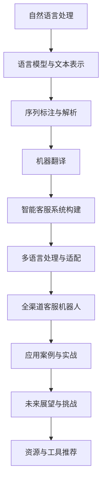

                 

### 文章标题

# 自然语言处理在智能客服中的应用：多语言全渠道客服机器人

关键词：自然语言处理、智能客服、多语言处理、全渠道客服机器人

## 摘要

随着人工智能技术的发展，自然语言处理（NLP）在智能客服领域的应用日益广泛。本文详细探讨了自然语言处理在智能客服系统中的应用，涵盖了从语言模型与文本表示、序列标注与解析到机器翻译等核心NLP任务。通过构建多语言全渠道客服机器人，本文展示了如何利用NLP技术实现智能客服系统的设计与实现。同时，通过实际案例和项目实践，本文深入分析了NLP在智能客服中的挑战与解决方案，为智能客服系统的开发提供了有益的参考。

## 目录

### 第一部分：自然语言处理基础

#### 第1章：自然语言处理概述

#### 第2章：语言模型与文本表示

#### 第3章：序列标注与解析

#### 第4章：机器翻译

### 第二部分：智能客服系统构建

#### 第5章：智能客服系统概述

#### 第6章：多语言处理与适配

#### 第7章：全渠道客服机器人

### 第三部分：应用案例与实战

#### 第8章：智能客服应用案例

#### 第9章：多语言全渠道客服机器人项目实践

#### 第10章：未来展望与挑战

### 附录：资源与工具推荐

## 第一部分：自然语言处理基础

### 第1章：自然语言处理概述

自然语言处理（NLP）是人工智能（AI）的一个重要分支，旨在使计算机能够理解、生成和处理人类自然语言。随着互联网和大数据的兴起，NLP在各个领域得到了广泛应用，特别是在智能客服系统中，它为自动化客户服务提供了强大的技术支持。

### 1.1 自然语言处理的历史与发展

自然语言处理的发展可以追溯到20世纪50年代。当时，人们首次提出了用计算机模拟人类语言理解的想法。此后，随着计算能力的提升和算法的创新，NLP技术逐渐成熟。20世纪80年代，基于规则的方法和统计方法开始被广泛应用于NLP任务。进入21世纪，深度学习的崛起为NLP带来了革命性的进步，使机器在语言理解和生成方面达到了前所未有的高度。

### 1.2 自然语言处理的核心任务与挑战

自然语言处理的核心任务包括文本分类、实体识别、情感分析、机器翻译等。然而，这些任务的实现面临着诸多挑战：

- **语言复杂性**：自然语言具有高度的结构复杂性和语义丰富性，这使得模型难以捕捉语言的深层特征。
- **数据质量**：高质量的标注数据对于训练高性能的NLP模型至关重要，但获取这样的数据往往成本高昂。
- **跨语言性**：不同语言的语法、词汇和语义差异巨大，这使得跨语言的NLP任务更加复杂。
- **实时性**：在智能客服系统中，系统需要快速响应用户的查询，这对实时处理能力提出了要求。

### 1.3 自然语言处理的基本概念

为了更好地理解自然语言处理，我们需要了解一些基本概念：

- **词向量**：词向量是将词汇映射到高维空间中的向量表示，常见的词向量模型有Word2Vec、GloVe等。
- **语言模型**：语言模型是一种统计模型，用于预测下一个单词或句子。它在机器翻译、语音识别和文本生成中有着广泛应用。
- **序列标注**：序列标注是指对文本序列中的每个单词或字符进行分类标注，常见的任务包括命名实体识别和词性标注。
- **深度学习**：深度学习是一种机器学习技术，通过构建多层的神经网络来学习数据的特征表示。它在NLP任务中取得了显著的成果。

### 1.4 自然语言处理的应用场景

自然语言处理在智能客服中的应用非常广泛，以下是一些典型的应用场景：

- **客户服务**：智能客服机器人可以自动回答用户的问题，提供24/7的客户服务。
- **情感分析**：通过对用户反馈进行情感分析，企业可以了解用户对产品或服务的满意度。
- **内容审核**：智能客服机器人可以自动识别和过滤不当内容，确保社交媒体平台的安全。
- **语言翻译**：多语言客服机器人可以帮助企业服务全球客户，提供跨语言的支持。

### 1.5 本章总结

本章概述了自然语言处理的基本概念、历史发展、核心任务和挑战。通过了解这些内容，读者可以为后续章节的学习打下坚实的基础。接下来，我们将进一步探讨自然语言处理的核心技术，如语言模型、文本表示和序列标注。

## 第2章：语言模型与文本表示

### 2.1 语言模型的基本原理

语言模型是自然语言处理中的核心组件，用于预测文本序列中的下一个单词或字符。一个优秀的语言模型需要具备以下特点：

- **准确性**：能够准确预测文本中的下一个单词。
- **泛化性**：能够处理各种不同的语言情境和领域。
- **实时性**：能够在短时间内生成高质量的文本。

### 2.2 语言模型的评估与优化

评估语言模型的好坏通常使用以下指标：

- **困惑度（Perplexity）**：衡量模型对测试集的预测能力，困惑度越低，模型表现越好。
- **准确性（Accuracy）**：衡量模型预测正确的单词比例，适用于小规模的数据集。
- **BLEU分数**：用于评估机器翻译模型的性能，BLEU分数越高，翻译质量越好。

优化语言模型的方法包括：

- **数据增强**：通过增加训练数据来提升模型性能。
- **模型调整**：调整模型的参数和结构来优化性能。
- **迁移学习**：利用预训练的模型在新任务上微调。

### 2.3 语言模型的类型

语言模型可以分为基于规则、统计和深度学习三类：

- **基于规则的语言模型**：通过手工编写规则来预测文本，如N元语法模型。
- **统计语言模型**：使用统计学方法，如隐马尔可夫模型（HMM）和最大熵模型，来预测文本。
- **深度学习语言模型**：通过神经网络，如循环神经网络（RNN）和变换器（Transformer），来学习文本特征和预测。

### 2.4 语言模型在智能客服中的应用

语言模型在智能客服中的应用非常广泛，以下是一些典型的应用场景：

- **智能问答系统**：通过语言模型，智能客服机器人可以自动回答用户的问题，提供即时的帮助。
- **对话生成**：语言模型可以生成与用户对话的自然语言文本，提高用户体验。
- **文本分类**：语言模型可以帮助分类用户的问题，将它们分配到正确的部门或主题。

### 2.5 本章总结

本章详细介绍了语言模型的基本原理、评估与优化方法、类型以及在智能客服中的应用。通过学习这些内容，读者可以更好地理解语言模型在智能客服系统中的关键作用。接下来，我们将探讨文本表示的方法，如词向量和文本嵌入。

## 第3章：文本表示与词向量

### 3.1 词向量与文本嵌入

文本表示是自然语言处理中的重要环节，其中词向量（word vector）和文本嵌入（text embedding）是两种常见的文本表示方法。

#### 3.1.1 词向量

词向量是将词汇映射到高维空间中的向量表示，能够捕捉单词的语义信息。常见的词向量模型包括Word2Vec和GloVe。

- **Word2Vec**：基于神经网络模型，通过训练大量文本数据，将单词映射到低维向量空间。
- **GloVe**：基于全局共现矩阵，通过优化单词与其共现词的向量表示，提高词向量的质量。

#### 3.1.2 文本嵌入

文本嵌入是将整段文本映射到高维向量空间的方法，能够捕捉文本的局部和全局特征。常见的文本嵌入方法包括词袋模型（Bag of Words，BoW）和词嵌入（Word Embedding）。

- **词袋模型**：将文本表示为词汇的集合，不考虑词汇的顺序和语法结构。
- **词嵌入**：将每个词汇映射到一个高维向量，考虑词汇的顺序和语义关系。

### 3.2 词向量的应用

词向量在自然语言处理中有广泛的应用，以下是一些典型的应用场景：

- **语义相似度计算**：通过计算词向量的余弦相似度，可以判断两个单词的语义相似程度。
- **文本分类**：将文本表示为词向量，用于训练文本分类模型，如朴素贝叶斯分类器和支持向量机（SVM）。
- **命名实体识别**：利用词向量表示文本，可以识别文本中的命名实体，如人名、地名和机构名。

### 3.3 文本嵌入的应用

文本嵌入在自然语言处理中也有着重要的应用，以下是一些典型的应用场景：

- **机器翻译**：通过文本嵌入，可以将源语言和目标语言的文本表示为向量，用于训练机器翻译模型。
- **情感分析**：将文本嵌入到高维空间，可以更好地捕捉文本的情感特征，用于情感分析任务。
- **文本生成**：利用文本嵌入，可以生成与给定文本相似的自然语言文本。

### 3.4 本章总结

本章详细介绍了词向量和文本嵌入的概念及其在自然语言处理中的应用。通过学习这些内容，读者可以更好地理解文本表示在NLP任务中的关键作用。接下来，我们将探讨序列标注与解析技术，如命名实体识别和依存句法分析。

## 第4章：序列标注与解析

### 4.1 序列标注的任务与模型

序列标注（sequence labeling）是自然语言处理中的一个重要任务，旨在对文本序列中的每个单词或字符进行分类标注。常见的序列标注任务包括命名实体识别（Named Entity Recognition，NER）和词性标注（Part-of-Speech Tagging，POS）。

#### 4.1.1 命名实体识别

命名实体识别是指识别文本中的特定实体，如人名、地名、机构名等。命名实体识别的主要目的是提取关键信息，为信息抽取和文本分析提供基础。

- **任务定义**：给定一个文本序列，将其中的命名实体识别出来。
- **挑战**：命名实体具有多样性，实体之间可能存在嵌套关系，实体边界识别难度较大。

#### 4.1.2 词性标注

词性标注是指为文本序列中的每个单词分配一个词性标签，如名词、动词、形容词等。词性标注有助于理解文本的语法结构，为自然语言处理任务提供支持。

- **任务定义**：给定一个文本序列，将其中的每个单词标注为相应的词性。
- **挑战**：词性标注需要考虑单词的多义性和上下文信息。

#### 4.1.3 序列标注模型

常见的序列标注模型包括基于规则的方法、统计方法和深度学习方法。

- **基于规则的方法**：通过手工编写规则来识别命名实体或词性。
- **统计方法**：利用统计学模型，如隐马尔可夫模型（HMM）和条件随机场（CRF），来识别命名实体或词性。
- **深度学习方法**：利用深度神经网络，如卷积神经网络（CNN）和循环神经网络（RNN），来识别命名实体或词性。

### 4.2 命名实体识别

命名实体识别是序列标注中的一个重要任务，以下是一些典型的命名实体识别模型：

- **基于规则的方法**：通过手工编写规则来识别命名实体。
- **统计方法**：利用统计模型，如HMM和CRF，来识别命名实体。
- **深度学习方法**：利用深度神经网络，如RNN和CNN，来识别命名实体。

#### 4.2.1 基于规则的方法

基于规则的方法通过手工编写规则来识别命名实体。例如，可以使用正则表达式来匹配人名、地名等实体。

- **优点**：实现简单，易于理解。
- **缺点**：规则编写繁琐，难以适应复杂场景。

#### 4.2.2 统计方法

统计方法通过训练模型来识别命名实体。常见的统计模型包括HMM和CRF。

- **HMM**：隐马尔可夫模型是一种基于概率的序列模型，可以用于命名实体识别。
- **CRF**：条件随机场是一种概率图模型，可以用于序列标注任务，如命名实体识别。

#### 4.2.3 深度学习方法

深度学习方法通过构建深度神经网络来识别命名实体。常见的深度学习模型包括RNN和CNN。

- **RNN**：循环神经网络是一种能够处理序列数据的神经网络，可以用于命名实体识别。
- **CNN**：卷积神经网络是一种能够提取局部特征的神经网络，可以用于命名实体识别。

### 4.3 依存句法分析

依存句法分析（Dependency Parsing）是一种解析文本中词汇之间的依存关系的方法。依存句法分析可以揭示文本的语法结构，为自然语言处理任务提供支持。

- **任务定义**：给定一个文本序列，构建词汇之间的依存关系图。
- **挑战**：依存句法分析需要处理词汇的多义性和上下文信息。

#### 4.3.1 基于规则的方法

基于规则的方法通过手工编写规则来识别词汇之间的依存关系。

- **优点**：实现简单，易于理解。
- **缺点**：规则编写繁琐，难以适应复杂场景。

#### 4.3.2 统计方法

统计方法通过训练模型来识别词汇之间的依存关系。常见的统计模型包括HMM和CRF。

- **HMM**：隐马尔可夫模型可以用于依存句法分析。
- **CRF**：条件随机场可以用于依存句法分析。

#### 4.3.3 深度学习方法

深度学习方法通过构建深度神经网络来识别词汇之间的依存关系。常见的深度学习模型包括RNN和CNN。

- **RNN**：循环神经网络可以用于依存句法分析。
- **CNN**：卷积神经网络可以用于依存句法分析。

### 4.4 本章总结

本章详细介绍了序列标注与解析的任务、模型以及命名实体识别和依存句法分析的具体实现。通过学习这些内容，读者可以更好地理解序列标注在自然语言处理中的应用。接下来，我们将探讨机器翻译技术。

## 第5章：机器翻译

### 5.1 机器翻译的基本原理

机器翻译（Machine Translation，MT）是将一种语言的文本自动翻译成另一种语言的技术。机器翻译的核心任务是理解源语言的语义，并生成目标语言的自然文本。

#### 5.1.1 翻译模型

机器翻译模型可以分为以下几种：

- **规则翻译模型**：基于人工编写的规则进行翻译。
- **统计翻译模型**：基于统计方法和大规模平行语料库进行翻译。
- **神经翻译模型**：基于深度学习模型进行翻译。

#### 5.1.2 神经机器翻译

神经机器翻译（Neural Machine Translation，NMT）是近年来发展迅速的机器翻译技术，通过构建深度神经网络模型来实现翻译任务。神经机器翻译主要基于变换器（Transformer）架构，其优点包括：

- **并行计算**：变换器模型可以并行处理整个句子，提高了计算效率。
- **全局注意力机制**：变换器模型通过全局注意力机制捕捉句子中的长距离依赖关系。

### 5.2 神经机器翻译的工作流程

神经机器翻译的工作流程主要包括以下步骤：

1. **编码器（Encoder）**：将源语言文本编码为向量表示。
2. **解码器（Decoder）**：将编码器的输出解码为目标语言文本。
3. **注意力机制（Attention Mechanism）**：在编码器和解码器之间引入注意力机制，用于捕捉句子中的关键信息。
4. **损失函数**：使用损失函数（如交叉熵损失）来衡量预测结果与真实结果之间的差距，并优化模型参数。

### 5.3 神经机器翻译的优势与挑战

神经机器翻译的优势包括：

- **高质量翻译**：通过深度学习模型，神经机器翻译能够生成更自然、更流畅的翻译结果。
- **多语言支持**：神经机器翻译可以同时处理多种语言翻译，提高了翻译系统的泛化能力。

然而，神经机器翻译也面临一些挑战：

- **计算资源需求**：神经机器翻译模型参数量大，训练和推理过程需要大量的计算资源。
- **长距离依赖问题**：虽然注意力机制有助于捕捉长距离依赖关系，但在某些情况下仍难以处理。
- **数据依赖**：神经机器翻译依赖于大规模的平行语料库，数据质量对翻译效果有较大影响。

### 5.4 机器翻译在智能客服中的应用

机器翻译在智能客服中的应用非常广泛，以下是一些典型的应用场景：

- **跨国客服**：通过机器翻译，企业可以为全球客户提供跨语言的支持，提高客户满意度。
- **本地化服务**：机器翻译可以帮助企业快速推出本地化产品和服务，拓展市场。
- **多语言培训**：机器翻译可以用于多语言培训，帮助企业员工快速掌握外语。

### 5.5 本章总结

本章介绍了机器翻译的基本原理、工作流程以及神经机器翻译的优势与挑战。通过学习这些内容，读者可以更好地理解机器翻译在智能客服系统中的应用。接下来，我们将探讨智能客服系统的整体架构和组成部分。

## 第6章：智能客服系统概述

### 6.1 智能客服系统的组成部分

智能客服系统是由多个模块组成的复杂系统，主要包括以下组成部分：

- **用户界面（UI）**：用户界面是用户与智能客服系统交互的入口，包括网站、移动应用、社交媒体等渠道。
- **对话管理（DM）**：对话管理模块负责处理用户请求，管理对话流程，确保对话的流畅性和一致性。
- **自然语言处理（NLP）**：自然语言处理模块负责处理用户的自然语言输入，包括文本分类、实体识别、情感分析等。
- **业务逻辑**：业务逻辑模块根据用户请求和业务规则，提供相应的解决方案，如查询处理、订单管理等。
- **知识库**：知识库模块存储智能客服系统的业务知识和常见问题的答案，为对话管理提供支持。
- **后端服务**：后端服务模块负责数据存储、安全、监控等，确保系统的稳定运行。

### 6.2 智能客服系统的架构设计

智能客服系统的架构设计需要考虑系统的可扩展性、可靠性和用户体验。以下是一个典型的智能客服系统架构：

1. **前端界面**：用户通过网站、移动应用或社交媒体与智能客服系统进行交互。
2. **中间层**：中间层负责处理用户的输入请求，进行自然语言处理和对话管理。
3. **后端服务**：后端服务负责业务逻辑处理、数据存储和系统监控。

### 6.3 智能客服系统的发展趋势

随着人工智能技术的不断发展，智能客服系统也在不断进步。以下是一些智能客服系统的发展趋势：

- **多语言支持**：智能客服系统将支持更多的语言，为全球客户提供无缝服务。
- **个性化服务**：通过用户数据分析和机器学习，智能客服系统将提供更加个性化的服务。
- **语音交互**：语音交互将成为智能客服系统的重要组成部分，提高用户体验。
- **集成化**：智能客服系统将与其他业务系统集成，提供更全面的服务。

### 6.4 智能客服系统在业务中的应用

智能客服系统在各个行业的业务中发挥着重要作用，以下是一些典型的应用场景：

- **电子商务**：智能客服系统可以回答用户关于产品、订单和物流的问题，提供24/7的客户服务。
- **金融服务**：智能客服系统可以帮助银行和保险公司提供客户咨询、投诉处理等服务。
- **医疗健康**：智能客服系统可以提供在线医疗咨询、预约挂号等服务，提高医疗资源利用率。
- **旅游行业**：智能客服系统可以提供旅游咨询、酒店预订等服务，为游客提供便捷的旅游体验。

### 6.5 本章总结

本章详细介绍了智能客服系统的组成部分、架构设计以及发展趋势。通过学习这些内容，读者可以更好地理解智能客服系统的整体框架，为后续章节的学习打下基础。接下来，我们将探讨多语言处理与适配技术。

## 第7章：多语言处理与适配

### 7.1 多语言文本处理技术

多语言文本处理（Multilingual Text Processing）是指处理多种语言的文本数据的技术。在智能客服系统中，多语言处理至关重要，因为它允许企业为全球客户提供无缝的跨语言支持。

#### 7.1.1 语言检测与识别

语言检测（Language Detection）是确定文本数据所使用语言的过程。语言识别（Language Recognition）则是在已知的语言集合中识别文本的语言。

- **语言检测方法**：基于规则的方法、机器学习方法（如朴素贝叶斯分类器、支持向量机）和深度学习方法（如卷积神经网络、循环神经网络）。
- **语言识别方法**：与语言检测类似，可以使用上述方法，但通常更侧重于识别具体语言而非检测。

#### 7.1.2 多语言文本处理工具

- **开源库**：如NLTK、spaCy、Stanford NLP等，提供多语言文本处理功能。
- **云服务**：如Google Cloud Natural Language API、Microsoft Azure Language Services等，提供预训练的多语言模型和API接口。

### 7.2 多语言客服机器人设计

设计多语言客服机器人需要考虑以下关键因素：

#### 7.2.1 多语言支持

- **单语言模型**：使用单个语言模型处理所有语言请求，通过语言检测将请求路由到相应的模型。
- **多语言模型**：为每种语言训练独立的模型，提高翻译和理解的准确性。

#### 7.2.2 语言适配

- **语言特定优化**：针对不同语言的特点进行优化，如词汇调整、语法修正等。
- **跨语言知识共享**：利用跨语言信息传递技术，将一种语言的知识传递到另一种语言中。

#### 7.2.3 可扩展性

- **分布式架构**：使用分布式系统来处理大量并发请求，确保系统的高性能和高可用性。
- **模块化设计**：将系统分解为独立的模块，便于维护和升级。

### 7.3 多语言客服机器人案例

#### 7.3.1 案例介绍

以一家全球知名的电子商务公司为例，该公司在全球拥有多个语言版本，为了提供优质的客户服务，设计并部署了一款多语言客服机器人。

#### 7.3.2 案例分析

- **需求分析**：公司需要一款能够处理多种语言的客服机器人，支持在线购物咨询、订单查询和投诉处理等。
- **技术方案**：使用基于Transformer架构的神经机器翻译模型进行多语言翻译，利用开源库和云服务进行文本处理和对话管理。
- **实施效果**：机器人能够自动识别用户语言，提供相应语言的解答，用户满意度显著提高。

### 7.4 实现细节

#### 7.4.1 语言检测与识别

```python
from langdetect import detect

def detect_language(text):
    try:
        return detect(text)
    except:
        return "无法检测"

text = "Bonjour, comment ça va?"
language = detect_language(text)
print(f"文本语言：{language}")
```

#### 7.4.2 多语言文本处理

```python
import spacy

nlp = spacy.load('zh_core_web_sm')  # 加载中文模型

doc = nlp("你好，有什么可以帮助你的？")
for token in doc:
    print(token.text, token.pos_)

nlp = spacy.load('en_core_web_sm')  # 加载英文模型

doc = nlp("Hello, how can I help you?")
for token in doc:
    print(token.text, token.pos_)
```

### 7.5 本章总结

本章介绍了多语言处理与适配技术，包括语言检测与识别、多语言客服机器人设计及其实现细节。通过这些内容，读者可以了解如何设计并实现一个支持多种语言的多语言客服机器人。接下来，我们将探讨全渠道客服机器人的设计与应用。

## 第8章：全渠道客服机器人

### 8.1 不同渠道的客服需求

全渠道客服机器人旨在为用户提供跨渠道的统一服务体验。不同渠道的客服需求各有特点：

#### 8.1.1 网站客服

- **需求**：提供在线问答、订单状态查询、产品信息查询等服务。
- **挑战**：需要支持文本输入和富媒体内容处理，如图片、视频等。

#### 8.1.2 移动应用客服

- **需求**：提供移动端用户便捷的客服服务，如即时聊天、语音通话等。
- **挑战**：需要适应不同操作系统和设备，确保用户体验一致性。

#### 8.1.3 社交媒体客服

- **需求**：在社交媒体平台上与用户互动，如Twitter、Facebook等。
- **挑战**：需要处理社交媒体特有的语言风格和信息格式。

#### 8.1.4 实时聊天客服

- **需求**：提供实时互动的客服服务，如聊天机器人、虚拟助手等。
- **挑战**：需要快速响应用户请求，确保对话流畅性。

### 8.2 社交媒体客服机器人

社交媒体客服机器人可以自动回答用户在社交媒体平台上的提问，提高客户服务水平。以下是一个社交媒体客服机器人的实现示例：

```python
import tweepy

# 设置API密钥和令牌
consumer_key = "your_consumer_key"
consumer_secret = "your_consumer_secret"
access_token = "your_access_token"
access_token_secret = "your_access_token_secret"

# 初始化Tweepy客户端
auth = tweepy.OAuthHandler(consumer_key, consumer_secret)
auth.set_access_token(access_token, access_token_secret)
api = tweepy.API(auth)

# 检索最新的推文
for tweet in api.search_tweets(q="help", lang="en"):
    print(f"用户：{tweet.user.screen_name}")
    print(f"推文：{tweet.text}")
    print(f"时间：{tweet.created_at}")
    # 进行回复或转发等操作
    api.reply_to_status(tweet.id, "Hello! I'm here to help.")
```

### 8.3 实时聊天机器人

实时聊天机器人是全渠道客服的重要组成部分，以下是一个基于Flask的实时聊天机器人示例：

```python
from flask import Flask, render_template, request, jsonify
import json

app = Flask(__name__)

# 存储对话历史
conversations = {}

@app.route('/chat', methods=['POST', 'GET'])
def chat():
    if request.method == 'POST':
        data = request.form.to_dict()
        user_message = data['user_message']
        user_id = data['user_id']
        
        # 生成回复
        bot_message = generate_response(user_message)
        
        # 存储对话
        if user_id in conversations:
            conversations[user_id].append({"user": user_message, "bot": bot_message})
        else:
            conversations[user_id] = [{"user": user_message, "bot": bot_message}]
        
        return jsonify({"bot_message": bot_message})
    else:
        return render_template('chat.html')

def generate_response(user_message):
    # 基于用户输入生成回复
    return "Hello! How can I assist you?"

if __name__ == '__main__':
    app.run(debug=True)
```

### 8.4 社交媒体与实时聊天机器人的整合

为了实现社交媒体与实时聊天机器人的整合，可以将社交媒体平台（如Twitter）上的消息转发到实时聊天系统中，并从实时聊天系统获取回复，再转发回社交媒体平台。以下是一个整合示例：

```python
@app.route('/integrate', methods=['POST'])
def integrate():
    data = request.json
    tweet_id = data['tweet_id']
    tweet = api.get_status(tweet_id)
    
    # 获取用户ID
    user_id = tweet.user.id_str
    
    # 获取回复
    bot_message = get_bot_response(tweet.text)
    
    # 回复推文
    api.update_status(status=bot_message, in_reply_to_status_id=tweet_id)
    
    return jsonify({"status": "success"})
```

### 8.5 本章总结

本章介绍了不同渠道的客服需求、社交媒体客服机器人和实时聊天机器人的设计与应用。通过整合社交媒体与实时聊天机器人，企业可以为用户提供无缝的跨渠道客服体验。接下来，我们将通过一个实际案例来展示多语言全渠道客服机器人的项目实践。

## 第9章：多语言全渠道客服机器人项目实践

### 9.1 项目背景

随着全球化业务的扩展，某国际电商企业需要为其全球客户提供一个高效、便捷的客服支持系统。该系统需支持多语言、多渠道（包括网站、移动应用、社交媒体、实时聊天等）的互动服务。为了提升用户体验、降低运营成本，企业决定开发一个多语言全渠道客服机器人。

### 9.2 项目需求分析

项目需求主要包括：

- **多语言支持**：支持英语、中文、西班牙语、法语等主要语言。
- **多渠道接入**：集成网站聊天、移动应用聊天、社交媒体（如Facebook Messenger、Twitter）和实时聊天（如Slack）。
- **自然语言处理**：文本分类、实体识别、情感分析等。
- **个性化服务**：根据用户行为和历史，提供个性化推荐和解答。
- **稳定性与安全性**：确保系统的高可用性和数据安全。

### 9.3 技术方案设计

技术方案包括以下关键模块：

- **前端界面**：使用React.js构建响应式网站和移动应用界面。
- **后端服务**：使用Flask搭建RESTful API，处理多渠道请求。
- **自然语言处理**：利用spaCy和transformers库进行文本处理和翻译。
- **数据库**：使用MySQL存储用户数据和对话历史。
- **实时通信**：使用WebSocket实现实时聊天功能。
- **云服务**：使用AWS和Google Cloud提供计算资源和存储。

### 9.4 开发与实现

#### 9.4.1 开发环境搭建

1. **前端**：
   - Node.js & npm
   - React.js
   - Axios（用于HTTP请求）

2. **后端**：
   - Python
   - Flask
   - spaCy（用于文本处理）
   - transformers（用于翻译）

3. **数据库**：
   - MySQL
   - Anaconda（用于环境管理）

4. **云服务**：
   - AWS EC2
   - Google Cloud

#### 9.4.2 核心功能实现

1. **多语言支持**：
   - 使用spaCy和transformers库加载多语言模型。
   - 实现语言检测和翻译功能。

2. **多渠道接入**：
   - 集成网站聊天和移动应用聊天。
   - 使用Tweepy库连接Twitter API。
   - 使用Slack SDK连接Slack。

3. **自然语言处理**：
   - 使用spaCy进行文本分类、实体识别和情感分析。
   - 使用transformers进行机器翻译。

4. **个性化服务**：
   - 根据用户行为和历史记录，使用机器学习算法生成个性化推荐。

5. **实时通信**：
   - 使用WebSocket实现实时聊天功能。

### 9.5 测试与部署

#### 9.5.1 单元测试

- 使用Python的unittest框架编写单元测试，确保每个功能模块正常运行。

#### 9.5.2 集成测试

- 使用Postman进行API测试，确保前后端接口正确。

#### 9.5.3 灰度发布

- 首先在部分用户中进行灰度发布，观察系统性能和用户体验。

#### 9.5.4 部署

- 使用Docker容器化应用，便于部署和管理。
- 部署到AWS和Google Cloud服务器，确保高可用性和扩展性。

### 9.6 项目小结

通过本项目的实践，企业成功构建了一个多语言全渠道客服机器人系统。该项目不仅提升了客户服务质量，还降低了运营成本。以下是一些项目总结和经验：

- **多语言支持**：通过集成多语言模型，系统能够自动识别和翻译多种语言，为全球用户提供服务。
- **渠道整合**：通过整合多种渠道，用户可以在不同的平台与客服机器人互动，提高了用户体验。
- **自然语言处理**：自然语言处理技术使得系统能够理解和回答用户的提问，提升了自动化程度。
- **个性化服务**：个性化服务功能根据用户历史和偏好提供个性化推荐，提高了用户满意度。

### 9.7 最佳实践

- **代码规范**：遵循PEP8编码规范，确保代码的可读性和可维护性。
- **持续集成**：使用CI/CD工具（如Jenkins、GitHub Actions）进行自动化测试和部署。
- **性能优化**：对关键路径进行性能优化，如数据库查询、API调用等。
- **安全措施**：采取数据加密、访问控制等安全措施，确保用户数据安全。

### 9.8 注意事项

- **语言模型更新**：定期更新语言模型，以提高翻译和理解的准确性。
- **数据分析**：持续分析用户数据，优化系统性能和用户体验。
- **用户反馈**：定期收集用户反馈，及时解决用户问题，不断优化产品。

### 9.9 拓展阅读

- **深度学习**：了解深度学习的基本概念和常用模型，如卷积神经网络（CNN）和循环神经网络（RNN）。
- **自然语言处理工具**：熟悉自然语言处理工具和库，如spaCy、transformers、NLTK等。
- **云服务**：了解云计算的基本概念和常用服务，如AWS、Google Cloud、Azure等。

## 第10章：未来展望与挑战

### 10.1 智能客服的发展趋势

智能客服技术正快速发展，未来的趋势包括：

- **更智能的对话系统**：基于深度学习和自然语言处理技术的对话系统将更加智能，能够理解复杂问题并提供更准确的回答。
- **跨模态交互**：智能客服系统将支持语音、文本、图像等多种模态的交互，提高用户体验。
- **个性化服务**：通过大数据分析和机器学习，智能客服系统能够为每个用户提供个性化的服务建议。
- **区块链技术**：利用区块链技术，智能客服系统可以实现安全、透明的数据管理和隐私保护。

### 10.2 技术挑战与解决方案

尽管智能客服技术取得了显著进展，但仍面临以下挑战：

- **多语言处理**：跨语言理解和翻译的准确性仍有待提高，需要更多的多语言训练数据和更先进的多语言模型。
- **实时性能**：在处理大量并发请求时，系统的实时性能和稳定性是一个挑战，需要优化算法和系统架构。
- **情感理解**：情感分析技术在理解用户情感方面还存在局限，需要更深入的研究和模型改进。

### 10.3 智能客服伦理与法律问题

智能客服在发展过程中需要关注以下伦理和法律问题：

- **数据隐私**：确保用户数据的保密性和安全性，遵守数据保护法规。
- **算法公平性**：防止算法偏见，确保系统对所有用户公平对待。
- **用户透明度**：用户应了解智能客服的工作原理和决策过程，提高系统的透明度。

### 10.4 未来展望

未来，智能客服技术将在以下几个方面继续发展：

- **智能化**：通过不断优化算法和模型，智能客服将能够更好地理解和满足用户需求。
- **融合化**：智能客服将与虚拟助手、语音助手等其他智能系统深度融合，提供更加全面的智能服务。
- **普及化**：智能客服将广泛应用于各行业，为更多企业和用户提供高效便捷的客服支持。

### 10.5 本章总结

本章总结了智能客服技术的发展趋势、面临的挑战以及伦理和法律问题，并对未来进行了展望。通过了解这些内容，读者可以更好地把握智能客服的发展方向，为未来的研究和实践做好准备。

### 附录：资源与工具推荐

#### 附录 A：自然语言处理工具

- **spaCy**：一个流行的自然语言处理库，提供快速和易于使用的API，支持多种语言的文本处理任务。
  - 官网：[https://spacy.io/](https://spacy.io/)
  
- **transformers**：一个由Hugging Face开发的深度学习库，提供预训练的Transformer模型，适用于各种自然语言处理任务。
  - 官网：[https://huggingface.co/transformers/](https://huggingface.co/transformers/)

- **NLTK**：一个经典的自然语言处理库，提供丰富的文本处理功能，适用于研究和开发。
  - 官网：[https://www.nltk.org/](https://www.nltk.org/)

#### 附录 B：深度学习框架

- **TensorFlow**：由Google开发的开源深度学习框架，适用于各种规模的机器学习和深度学习项目。
  - 官网：[https://www.tensorflow.org/](https://www.tensorflow.org/)

- **PyTorch**：由Facebook开发的开源深度学习框架，提供灵活的动态计算图和直观的API。
  - 官网：[https://pytorch.org/](https://pytorch.org/)

- **Keras**：一个高级神经网络API，可以在TensorFlow和Theano后面运行，提供简单直观的模型构建。
  - 官网：[https://keras.io/](https://keras.io/)

#### 附录 C：开源数据集与资源

- **GLUE**：一个由斯坦福大学维护的大型多任务自然语言处理数据集，用于评估多种自然语言处理任务的性能。
  - 官网：[https://gluebenchmark.com/](https://gluebenchmark.com/)

- **Wikipedia**：一个包含大量文本数据的维基百科，可用于训练和测试自然语言处理模型。
  - 官网：[https://www.wikipedia.org/](https://www.wikipedia.org/)

- **Common Crawl**：一个庞大的文本语料库，包含互联网上的大量网页，可用于自然语言处理研究。
  - 官网：[https://commoncrawl.org/](https://commoncrawl.org/)

### 附录 D：相关书籍和文章

- **《深度学习》**：由Ian Goodfellow、Yoshua Bengio和Aaron Courville合著，是一本介绍深度学习基础理论和应用的经典教材。
  - 在线资源：[https://www.deeplearningbook.org/](https://www.deeplearningbook.org/)

- **《自然语言处理综论》**：由Daniel Jurafsky和James H. Martin合著，是一本涵盖自然语言处理各个方面内容的权威著作。
  - 在线资源：[https://web.stanford.edu/~jurafsky/nlp.html](https://web.stanford.edu/~jurafsky/nlp.html)

- **《Python自然语言处理编程》**：由Matthias Bussonnier等合著，介绍使用Python进行自然语言处理的方法和技巧。
  - 在线资源：[https://nlp.booktype.pro/](https://nlp.booktype.pro/)

### 附录 E：在线课程和教程

- **Coursera上的《自然语言处理与深度学习》**：由斯坦福大学提供，涵盖自然语言处理的基本概念和深度学习在NLP中的应用。
  - 课程地址：[https://www.coursera.org/learn/nlp-deep-dive](https://www.coursera.org/learn/nlp-deep-dive)

- **Udacity的《深度学习工程师纳米学位》**：涵盖深度学习的基础知识和应用，包括自然语言处理领域。
  - 课程地址：[https://www.udacity.com/course/deep-learning-nanodegree--nd893](https://www.udacity.com/course/deep-learning-nanodegree--nd893)

### 附录 F：专业论坛和社群

- **Reddit的NLP论坛**：一个讨论自然语言处理相关话题的社区。
  - 论坛地址：[https://www.reddit.com/r/nlp/](https://www.reddit.com/r/nlp/)

- **Stack Overflow的NLP标签**：一个提问和解答自然语言处理相关问题的技术社区。
  - 论坛地址：[https://stackoverflow.com/questions/tagged/nlp](https://stackoverflow.com/questions/tagged/nlp)

- **GitHub的NLP项目**：一个包含大量自然语言处理开源项目的代码库。
  - 仓库地址：[https://github.com/topics/nlp](https://github.com/topics/nlp)

通过以上资源与工具的推荐，读者可以进一步拓展对自然语言处理和智能客服技术的理解和应用。希望这些资料能够为学习和实践提供有益的指导。作者：AI天才研究院/AI Genius Institute & 禅与计算机程序设计艺术 /Zen And The Art of Computer Programming

## Mermaid 流程图示例



## 伪代码示例

```plaintext
// 伪代码：基于神经网络的语言模型训练
function train_language_model(data):
    initialize_model()
    for epoch in 1 to MAX_EPOCHS:
        for sentence in data:
            loss = 0
            for word in sentence:
                prediction = model.predict(word)
                target = one_hot_encode(word)
                loss += cross_entropy_loss(prediction, target)
            model.update_parameters(loss)
    return model
```

## 数学公式示例

$$
P(w_{t} | w_{t-1}, w_{t-2}, ..., w_{1}) = \frac{e^{<model(w_{t-1}, w_{t})>}}{Z}
$$

其中，$<model(\cdot, \cdot)>$ 表示模型对两个词的嵌入向量点积，$Z$ 是归一化常数。

