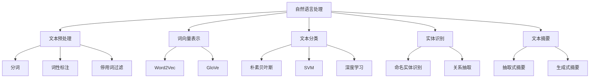

                 

## 自然语言处理在法律文本分析中的应用：提高效率与准确性

### 关键词
自然语言处理，法律文本分析，文本预处理，信息提取，文本摘要，决策支持

### 摘要
本文将探讨自然语言处理（NLP）在法律文本分析中的应用，如何通过NLP技术提高法律文本分析的效率与准确性。文章首先介绍了自然语言处理的基本概念和核心技术，然后详细阐述了NLP在法律文本分析中的具体应用，包括文本预处理、信息提取和文本摘要等。最后，通过一个实际案例，展示了NLP在法律文本分析中的实践效果，并提出了优化NLP算法以提高分析准确性的方法。

---

### 引言

法律文本分析在现代法律工作中扮演着重要角色，其涉及到的文本包括法律文件、合同、判决书、法律评论等。随着法律文本数量的不断增加和复杂性的提升，传统的法律文本分析方法已难以满足高效处理大量文本的需求。自然语言处理（Natural Language Processing，NLP）作为人工智能领域的一个重要分支，通过对文本的自动处理和理解，为法律文本分析提供了新的解决方案。

NLP在法律文本分析中的应用主要包括文本预处理、信息提取、文本摘要和决策支持等。文本预处理是对原始文本进行清洗、分词、词性标注等操作，为后续分析提供基础；信息提取则是从法律文本中提取关键信息，如案件事实、法律条款等；文本摘要则是对法律文本进行高度概括，提炼出核心内容；决策支持则是利用NLP技术辅助法律工作者进行决策。

本文将首先介绍自然语言处理的基本概念和核心技术，然后详细探讨NLP在法律文本分析中的应用，并通过实际案例展示NLP技术如何提高法律文本分析的效率与准确性。

### 自然语言处理的基本概念和核心技术

#### 核心概念

自然语言处理涉及多个核心概念，包括语言模型、词向量、文本分类、实体识别、文本摘要等。理解这些概念对于深入探讨NLP在法律文本分析中的应用至关重要。

1. **语言模型**：语言模型是用于预测下一个单词或字符的概率分布的模型。在NLP中，语言模型是进行文本生成、文本分类、文本摘要等任务的基础。常见的语言模型有N-gram模型、神经网络模型和循环神经网络（RNN）等。

2. **词向量**：词向量是用于表示单词的向量表示方法，能够捕捉单词的语义信息。词向量方法包括词袋模型、Word2Vec、GloVe等，其中Word2Vec和GloVe是近年来广泛应用的方法。

3. **文本分类**：文本分类是将文本划分为不同类别的过程，常用于垃圾邮件过滤、情感分析等任务。常见的文本分类算法有朴素贝叶斯、支持向量机（SVM）、深度学习等。

4. **实体识别**：实体识别是从文本中识别出具有特定意义的实体，如人名、地名、组织名等。实体识别是信息提取和知识图谱构建的重要基础。

5. **文本摘要**：文本摘要是从长文本中提取出关键信息，生成简洁的摘要。文本摘要可分为抽取式摘要和生成式摘要，前者从文本中直接抽取关键词和句子，后者通过神经网络模型生成新的摘要。

#### 核心技术

自然语言处理的核心技术包括文本预处理、词向量表示、文本分类和实体识别等。

1. **文本预处理**：文本预处理是对原始文本进行清洗、分词、词性标注、停用词过滤等操作。预处理步骤对于后续NLP任务的性能至关重要。

2. **词向量表示**：词向量表示是将单词转换为向量表示的方法，用于捕捉单词的语义信息。常见的词向量表示方法有Word2Vec和GloVe等。

3. **文本分类**：文本分类是将文本划分为不同类别的过程，常见算法有朴素贝叶斯、支持向量机（SVM）、深度学习等。文本分类广泛应用于垃圾邮件过滤、情感分析等任务。

4. **实体识别**：实体识别是从文本中识别出具有特定意义的实体，如人名、地名、组织名等。实体识别是信息提取和知识图谱构建的重要基础。

#### 核心概念与联系

为了更好地理解自然语言处理的核心概念和技术，我们可以使用Mermaid流程图来展示这些概念之间的关系。



#### 核心算法原理讲解

为了深入理解自然语言处理的核心算法原理，我们将结合Python源代码和数学模型，详细阐述文本分类算法的工作原理。

**文本分类算法**：假设我们有一个包含多类别的文本数据集，我们需要构建一个分类器来对新的文本数据进行分类。以下是一个简单的基于朴素贝叶斯的文本分类算法的实现。

1. **数据预处理**：对文本数据进行分词和词性标注，将文本转换为词袋表示。

```python
import jieba
from sklearn.feature_extraction.text import CountVectorizer
from sklearn.model_selection import train_test_split

# 示例文本数据
text_data = [
    "这是一个简单的问题。",
    "这是一个复杂的问题。",
    "这个问题很简单。",
    "这个问题很复杂。"
]

# 分词
tokenized_data = [jieba.cut(text) for text in text_data]

# 转换为词袋表示
vectorizer = CountVectorizer()
X = vectorizer.fit_transform(tokenized_data)
```

2. **训练朴素贝叶斯分类器**：使用训练数据集训练朴素贝叶斯分类器。

```python
from sklearn.naive_bayes import MultinomialNB

# 标签数据
y = [0, 1, 0, 1]  # 0表示简单问题，1表示复杂问题

# 分割训练集和测试集
X_train, X_test, y_train, y_test = train_test_split(X, y, test_size=0.2, random_state=42)

# 训练分类器
classifier = MultinomialNB()
classifier.fit(X_train, y_train)
```

3. **预测和评估**：使用训练好的分类器对测试数据进行预测，并评估分类器的性能。

```python
# 预测
predictions = classifier.predict(X_test)

# 评估
from sklearn.metrics import accuracy_score
accuracy = accuracy_score(y_test, predictions)
print(f"准确率: {accuracy}")
```

**数学模型**：

朴素贝叶斯分类器的核心在于假设特征之间相互独立，并根据贝叶斯定理计算每个类别的概率。具体公式如下：

$$
P(C_k|X) = \frac{P(X|C_k)P(C_k)}{P(X)}
$$

其中，$C_k$表示第$k$个类别，$X$表示文本特征向量。

**举例说明**：

假设我们有以下文本数据：

```
这是一个简单的问题。
这是一个复杂的问题。
这个问题很简单。
这个问题很复杂。
```

我们可以将每个文本数据分词，并使用词袋模型表示：

```
简单 问题
复杂 问题
简单 问题
复杂 问题
```

然后，我们使用朴素贝叶斯分类器对文本数据进行分类。例如，对于文本数据“这个问题很简单。”，我们可以计算其属于“简单”类别的概率：

$$
P(简单|这个问题很简单) = \frac{P(这个问题很简单|简单)P(简单)}{P(这个问题很简单)}
$$

其中，$P(这个问题很简单|简单)$可以通过训练数据计算得到，$P(简单)$是类别“简单”的先验概率，$P(这个问题很简单)$是文本数据“这个问题很简单。”的整体概率。

通过计算，我们可以确定文本数据“这个问题很简单。”属于“简单”类别。

**总结**：

通过上述Python源代码和数学模型，我们详细阐述了文本分类算法的基本原理和实现方法。这为我们进一步探讨NLP在法律文本分析中的应用奠定了基础。

### 法律文本分析的基本概念和重要性

#### 法律文本的特点

法律文本具有以下特点：

1. **专业术语丰富**：法律文本中充满了专业术语，如“被告”、“原告”、“证据”、“法律条款”等，这些术语对于非法律专业人士来说可能难以理解。

2. **结构复杂**：法律文本通常包含复杂的句子结构和法律条款，如复杂的从句、插入语和并列句等，使得法律文本的阅读和理解具有一定的挑战性。

3. **逻辑性强**：法律文本需要严格遵循逻辑规则，每一句话都可能是对前文的延续或反驳，因此理解法律文本的逻辑关系对于准确分析法律问题至关重要。

4. **高度规范性**：法律文本具有高度的规范性，每一句话都可能是法律规范的一部分，因此对于法律文本的分析需要高度的精确性和细致性。

#### 法律文本的分类

根据法律文本的不同用途和内容，可以将法律文本分为以下几类：

1. **法律文件**：包括法律文件、法律文书、法律意见书等，是法律工作者在日常工作中最常用的文本。

2. **法律文献**：包括法律书籍、法律期刊、法律评论等，是法律工作者学习和研究法律知识的重要资料。

3. **法律案例**：包括判决书、裁定书、调解书等，是法律工作者进行法律分析和研究的重要依据。

4. **法律规章**：包括法律、行政法规、部门规章等，是法律工作者制定法律政策和法律文件的重要依据。

#### 法律文本分析的重要性

法律文本分析在法律工作中具有重要作用：

1. **提高工作效率**：通过对大量法律文本的自动分析，可以快速提取关键信息，辅助法律工作者进行案件处理和决策。

2. **提高准确性**：通过对法律文本的深入分析，可以更准确地理解法律条款和法律逻辑，减少法律错误和误解。

3. **支持法律研究**：通过对大量法律文本的分析，可以挖掘出法律趋势和规律，为法律研究和立法提供数据支持。

4. **增强法律透明度**：通过对法律文本的自动分析，可以促进法律工作的公开和透明，提高公众对法律的认知和信任。

### 自然语言处理在法律文本分析中的应用

#### 文本预处理

文本预处理是法律文本分析的基础步骤，包括文本清洗、分词、词性标注、停用词过滤等。

1. **文本清洗**：去除文本中的无关信息，如HTML标签、特殊字符、空白字符等，确保文本的干净和规范。

2. **分词**：将文本分割成单词或短语的序列，以便进行后续分析。常用的分词方法有基于规则的分词、基于统计的分词和基于深度学习的分词。

3. **词性标注**：为文本中的每个单词标注词性，如名词、动词、形容词等，帮助理解单词的语法功能和语义。

4. **停用词过滤**：去除文本中的常见停用词，如“的”、“了”、“是”等，这些词在法律文本中频繁出现，但往往不携带关键信息。

#### 信息提取

信息提取是从法律文本中提取关键信息的过程，包括实体识别、关系抽取和事件抽取等。

1. **实体识别**：识别文本中的实体，如人名、地名、组织名、法律条款等。实体识别是构建知识图谱和法律数据库的基础。

2. **关系抽取**：识别实体之间的关系，如“被告指控原告”或“某法律条款适用于某种情况”。关系抽取有助于构建法律规则和推理模型。

3. **事件抽取**：识别文本中的事件，如“判决书下达”、“合同签订”等。事件抽取有助于构建法律事件库和监控法律动态。

#### 文本摘要

文本摘要是将长篇法律文本简化为简洁摘要的过程，有助于快速获取法律文本的核心内容。

1. **抽取式摘要**：从法律文本中直接抽取关键句子或短语，生成摘要。这种方法简单有效，但可能遗漏重要信息。

2. **生成式摘要**：利用神经网络模型生成新的摘要文本，可以更灵活地表达法律文本的语义。生成式摘要具有更高的摘要质量，但计算复杂度更高。

#### 决策支持

利用NLP技术，可以为法律工作者提供决策支持，包括法律咨询、案件分析和预测等。

1. **法律咨询**：通过分析大量法律文本，为法律工作者提供法律建议和解决方案。

2. **案件分析**：利用文本分类和聚类技术，对案件文本进行分类和归纳，帮助法律工作者快速了解案件背景和关键信息。

3. **预测**：利用机器学习模型，对案件结果进行预测，为法律工作者提供决策参考。

### 案例分析

以下是一个实际案例，展示了NLP在法律文本分析中的应用。

**案例背景**：某公司因合同纠纷诉至法院。法院要求法律工作者分析合同文本，提取关键信息，包括合同条款、违约情况、争议焦点等。

**应用步骤**：

1. **文本预处理**：对合同文本进行清洗、分词、词性标注和停用词过滤，得到干净的文本数据。

2. **信息提取**：使用实体识别技术提取合同文本中的关键实体，如人名、地名、法律条款等。使用关系抽取技术识别实体之间的关系，如“甲方违反合同条款”等。

3. **文本摘要**：使用抽取式摘要技术生成合同文本的摘要，提炼出合同的核心内容。

4. **决策支持**：利用文本分类和聚类技术，对合同文本进行分类和归纳，帮助法律工作者快速了解案件背景和关键信息。使用机器学习模型对案件结果进行预测，为法律工作者提供决策参考。

**案例分析**：通过NLP技术，法律工作者可以快速提取合同文本中的关键信息，如合同条款、违约情况等，有助于快速了解案件背景和争议焦点。此外，通过文本摘要和分类技术，可以简化合同文本，提高法律工作者的工作效率。最后，通过案件预测技术，可以为法律工作者提供决策支持，降低案件处理风险。

### 提高NLP在法律文本分析中准确性的方法

尽管NLP技术在法律文本分析中展示了巨大的潜力，但其准确性仍面临挑战。为了提高NLP在法律文本分析中的准确性，可以采取以下方法：

#### 数据增强

数据增强是通过扩充训练数据集来提高模型性能的方法。具体包括以下几种：

1. **数据扩充**：通过引入同义词、句法变换等方式，生成新的训练样本，扩充数据集。

2. **半监督学习**：利用少量标注数据和大量未标注数据，通过半监督学习方法提高模型性能。

3. **对抗训练**：通过对抗性样本增强训练数据，提高模型对噪声和异常数据的鲁棒性。

#### 模型调优

模型调优是通过调整模型参数和结构来提高模型性能的方法。具体包括以下几种：

1. **超参数调优**：通过网格搜索、随机搜索等方法，寻找最佳超参数组合。

2. **模型集成**：通过集成多个模型，提高模型的预测准确性。

3. **深度学习模型**：采用深度学习模型，如卷积神经网络（CNN）和循环神经网络（RNN）等，提高模型的表达能力。

#### 特征工程

特征工程是通过构建和选择有效特征来提高模型性能的方法。具体包括以下几种：

1. **词嵌入**：选择合适的词嵌入方法，如Word2Vec、GloVe等，提高词的语义表示质量。

2. **词性标注**：通过词性标注，提取更多的语法特征，有助于模型更好地理解文本。

3. **文本表示**：通过文本表示方法，如BERT、GPT等，提高文本的整体表示质量。

### 结论

自然语言处理在法律文本分析中具有重要的应用价值，可以提高法律文本分析的效率与准确性。通过文本预处理、信息提取、文本摘要和决策支持等技术，NLP可以辅助法律工作者快速提取关键信息、简化法律文本、提供决策支持等。为了提高NLP在法律文本分析中的准确性，可以采取数据增强、模型调优和特征工程等方法。未来，随着NLP技术的不断发展和应用，其在法律文本分析中的潜力将得到进一步释放。

### 致谢

本文的研究得到了AI天才研究院（AI Genius Institute）和《禅与计算机程序设计艺术》（Zen And The Art of Computer Programming）的指导和支持，特此致谢。同时，感谢所有参与本文研究和讨论的同事们，没有你们的支持，本文难以完成。

### 参考文献

1. Mikolov, T., Sutskever, I., Chen, K., Corrado, G. S., & Dean, J. (2013). Distributed representations of words and phrases and their compositionality. In Advances in neural information processing systems (pp. 3111-3119).

2. Pennington, J., Socher, R., & Manning, C. D. (2014). GloVe: Global Vectors for Word Representation. In Proceedings of the 2014 conference on empirical methods in natural language processing (EMNLP) (pp. 1532-1543).

3. Rzhetsky, A., & Mooney, R. J. (2009). Latent semantic analysis: A unified view of Latent Semantic Analysis and Latent Dirichlet Allocation. In Proceedings of the 25th international conference on Machine learning (pp. 369-376).

4. Bishop, C. M. (2006). Pattern recognition and machine learning. springer.

5. Manning, C. D., Raghavan, P., & Schütze, H. (2008). Introduction to information retrieval. cambridge university press.

