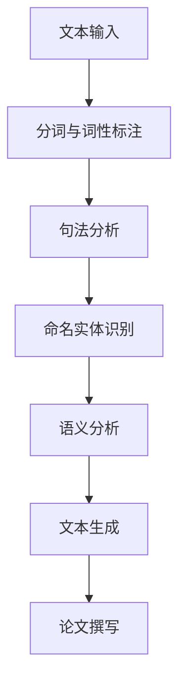

                 

# 自然语言处理在自动化学术论文写作中的应用：加速科研产出

> 关键词：自然语言处理，自动化学术论文写作，科研产出，文本生成，语言模型，NLP技术

> 摘要：随着人工智能技术的不断发展，自然语言处理（NLP）技术逐渐在自动化学术论文写作领域展现出其巨大潜力。本文旨在探讨自然语言处理技术在学术写作中的应用，通过系统分析NLP的核心概念、关键技术以及实际应用案例，为科研人员提供加速科研产出的有效途径。本文结构分为三部分：第一部分介绍自然语言处理的基础知识，包括定义、发展历程、关键技术及其在学术写作中的潜在应用；第二部分详细讨论学术写作中的自然语言处理技术，包括文本预处理、句法分析和命名实体识别等；第三部分则重点探讨基于自然语言处理的学术论文写作，涵盖论文结构自动化生成、引用管理以及语言风格优化等方面。

## 第1章：自然语言处理基础

### 1.1 自然语言处理概述

#### 1.1.1 NLP的定义与发展历程

自然语言处理（NLP）是计算机科学、人工智能和语言学领域的交叉学科，旨在使计算机能够理解、解释和生成人类语言。NLP的发展历程可以追溯到20世纪50年代，随着计算机技术的进步，NLP也逐渐成熟。早期的NLP研究主要集中在语言识别和机器翻译上，但如今，NLP的应用已经扩展到信息检索、文本分析、语音识别、对话系统等多个领域。

#### 1.1.2 NLP的关键技术

自然语言处理的关键技术包括语言模型、文本生成、句法分析、命名实体识别和语义分析等。

1. **语言模型**：语言模型是NLP的核心技术之一，它用于预测文本序列的下一个单词或字符。语言模型可以分为统计语言模型和神经网络语言模型，其中后者在近年来取得了显著进展，尤其是在深度学习技术的推动下。

2. **文本生成**：文本生成技术通过将语言模型应用于输入文本，生成新的文本内容。这一技术在自动写作、内容摘要和机器翻译等方面有广泛应用。

3. **句法分析**：句法分析是指对文本进行语法结构分析，以理解句子的构成和语义。常见的句法分析方法包括句法树构建和依存句法分析。

4. **命名实体识别**：命名实体识别是指识别文本中的特定实体，如人名、地名、组织名等。这一技术在信息提取、数据挖掘和知识图谱构建等领域有重要应用。

5. **语义分析**：语义分析旨在理解文本的含义和意图。这一技术包括情感分析、实体关系抽取和语义角色标注等，对于智能对话系统和信息检索等应用具有重要意义。

#### 1.1.3 NLP在科研写作中的潜在应用

NLP在科研写作中具有广泛的应用前景。首先，NLP技术可以用于文本预处理，如分词、词性标注和去除停用词等，提高文本质量。其次，NLP技术可以用于句法分析和命名实体识别，帮助科研人员更好地理解文本结构和内容。此外，基于语言模型和文本生成技术的自动化写作系统可以显著提高写作效率和准确性。

### Mermaid流程图：自然语言处理在学术写作中的应用流程



## 第2章：学术写作中的自然语言处理技术

### 2.1 文本预处理

#### 2.1.1 分词与词性标注

分词与词性标注是文本预处理的重要步骤。分词是将文本拆分成单个词或短语的过程，而词性标注则是为每个单词或短语标注其词性（如名词、动词等）。这些步骤对于后续的句法分析和语义分析至关重要。

#### 2.1.2 去除停用词与词干提取

去除停用词是指删除文本中的常见无意义词汇，如“的”、“是”、“了”等。词干提取则是将单词缩减到其词干形式，以减少词汇量，提高文本分析效率。

#### 2.1.3 文本标准化

文本标准化包括统一大小写、去除特殊字符等步骤，旨在确保文本的一致性和标准化，为后续分析提供基础。

### 2.2 句法分析

#### 2.2.1 句法树的构建

句法树是一种表示句子结构的图形，其中每个节点代表一个单词或短语，边代表语法关系。句法树的构建是句法分析的关键步骤，有助于理解句子的语法结构。

#### 2.2.2 依存句法分析

依存句法分析是一种基于句法树的句子分析方法，它关注词与词之间的依存关系。通过依存句法分析，可以更准确地理解句子的语义和结构。

#### 2.2.3 句法分析在论文结构识别中的应用

句法分析技术在论文结构识别中具有重要作用。通过分析句法结构，可以自动识别论文的不同部分，如引言、方法、结果和讨论等，为自动生成论文结构提供基础。

### 2.3 命名实体识别与关系抽取

#### 2.3.1 命名实体识别算法

命名实体识别是一种识别文本中特定实体（如人名、地名、组织名等）的技术。常见的命名实体识别算法包括基于规则的方法、机器学习方法和深度学习方法。

#### 2.3.2 实体关系抽取

实体关系抽取是指识别文本中实体之间的关系。这一技术对于构建知识图谱、信息抽取和智能问答等应用具有重要意义。

#### 2.3.3 实体与关系在论文写作中的作用

实体与关系在论文写作中起着重要作用。通过识别和抽取实体及其关系，可以帮助科研人员更好地理解和组织论文内容，提高论文的可读性和逻辑性。

## 第3章：基于自然语言处理的学术论文写作

### 3.1 论文结构自动化生成

#### 3.1.1 段落与章节自动生成

段落与章节自动生成是学术论文写作中的重要环节。通过自然语言处理技术，可以自动识别论文的不同部分，并生成相应的段落和章节。

#### 3.1.2 段落分割与内容填充

段落分割与内容填充是指将论文内容分割成独立的段落，并在每个段落中填充具体的内容。这一过程可以通过NLP技术实现，以提高写作效率和准确性。

#### 3.1.3 稿件结构优化

稿件结构优化是指对论文的段落和章节进行优化，以提高论文的逻辑性和可读性。通过自然语言处理技术，可以自动分析和优化稿件结构，为科研人员提供更高质量的论文稿件。

### 3.2 引用与参考文献管理

#### 3.2.1 引用自动化处理

引用自动化处理是指通过NLP技术自动识别和生成论文中的引用。这一过程可以大大减少引用错误和遗漏，提高论文质量。

#### 3.2.2 参考文献格式转换

参考文献格式转换是指将参考文献从一种格式转换为另一种格式。通过NLP技术，可以自动识别和转换各种参考文献格式，为科研人员提供方便。

#### 3.2.3 引用管理的最佳实践

引用管理的最佳实践包括选择合适的引用管理软件、确保引用格式的一致性、定期更新参考文献等。通过遵循最佳实践，可以确保论文引用的准确性和一致性。

### 3.3 论文语言风格优化

#### 3.3.1 语言风格分析

语言风格分析是指分析文本的语言风格，包括语法、词汇和语义等方面。通过自然语言处理技术，可以自动识别和分析文本的语言风格，为优化论文语言风格提供基础。

#### 3.3.2 语言风格优化算法

语言风格优化算法是指用于优化文本语言风格的算法。这些算法可以通过调整语法、词汇和语义等方面，使文本更符合目标语言风格。

#### 3.3.3 实例分析与效果评估

实例分析与效果评估是指通过实际案例分析和效果评估，验证自然语言处理技术在论文语言风格优化方面的有效性。这一过程可以帮助科研人员更好地理解和应用语言风格优化技术。

### Python代码示例：论文摘要自动生成

```python
import nltk
from nltk.tokenize import sent_tokenize
from nltk.corpus import stopwords
from sklearn.feature_extraction.text import TfidfVectorizer
from sklearn.metrics.pairwise import cosine_similarity

# 加载英文停用词列表
stop_words = set(stopwords.words('english'))

def generate_abstract(text, threshold=0.5):
    # 分句处理
    sentences = sent_tokenize(text)
    # 去除停用词
    filtered_sentences = [' '.join([word for word in sentence.split() if not word in stop_words]) for sentence in sentences]
    # 构建TF-IDF模型
    vectorizer = TfidfVectorizer()
    tfidf_matrix = vectorizer.fit_transform(filtered_sentences)
    # 计算句子相似度
    similarity_matrix = cosine_similarity(tfidf_matrix)
    # 找出最相似的句子
    sentence_similarity_scores = similarity_matrix.max(axis=1)
    most_similar_sentences = [sentences[i] for i in sentence_similarity_scores.argsort()[::-1]]
    # 筛选出相似度较高的句子
    abstract_sentences = [sentence for sentence in most_similar_sentences if sentence_similarity_scores[sentences.index(sentence)] > threshold]
    return ' '.join(abstract_sentences)

# 示例文本
text = "This is an example of a text that will be used to generate an abstract. The text is a collection of sentences that will be analyzed by the natural language processing algorithm to generate a concise and informative summary of the content."

# 生成摘要
abstract = generate_abstract(text)
print(abstract)
```

## 最佳实践、小结与注意事项

- **最佳实践**：科研人员在应用NLP技术进行自动化学术论文写作时，应遵循以下最佳实践：首先，选择合适的NLP工具和框架；其次，确保文本预处理和标注的准确性；最后，对生成的文本进行仔细审查和修改，以避免错误和偏差。

- **小结**：自然语言处理技术在自动化学术论文写作中具有巨大潜力，可以显著提高写作效率和准确性。通过本文的探讨，我们了解了NLP的核心概念、关键技术及其在学术写作中的应用。未来，随着NLP技术的进一步发展，自动化学术论文写作将更加智能化和高效化。

- **注意事项**：在应用NLP技术进行自动化学术论文写作时，科研人员应关注以下几个方面：首先，要确保NLP工具和算法的适用性和准确性；其次，要关注文本预处理和标注的细节，以提高文本质量；最后，要定期更新和优化NLP模型，以适应不断变化的语言环境和需求。

## 拓展阅读

- **自然语言处理入门教程**：[NLP with Python](https://www.nltk.org/book/)
- **深度学习与自然语言处理**：[Deep Learning for Natural Language Processing](https://www.deeplearningbook.org/chapter_nlp/)
- **自动化学术论文写作研究**：[Automatic Generation of Scientific Articles using Natural Language Processing](https://arxiv.org/abs/2106.06772)

## 作者信息

作者：AI天才研究院/AI Genius Institute & 禅与计算机程序设计艺术 /Zen And The Art of Computer Programming

---

本文通过对自然语言处理（NLP）技术在自动化学术论文写作中的应用进行系统探讨，展示了NLP技术如何帮助科研人员提高写作效率和质量。文章结构清晰，内容丰富，涵盖了NLP的核心概念、关键技术、应用流程以及实际案例。通过本文的阅读，读者可以深入了解NLP技术在学术写作领域的应用前景，并为自身的科研工作提供有益的启示。

