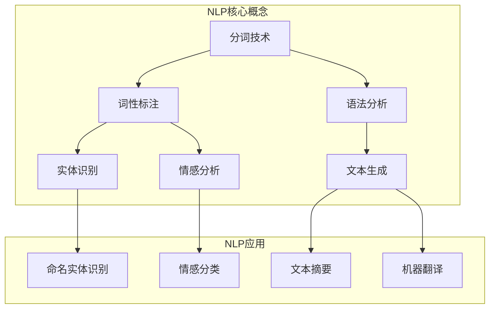
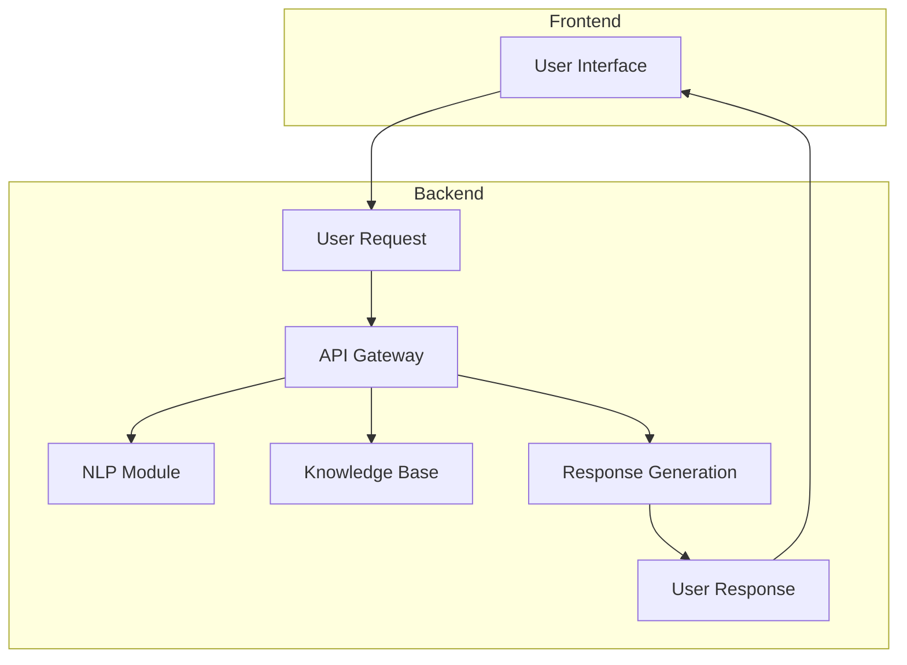
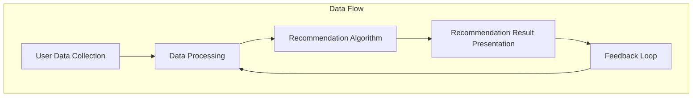
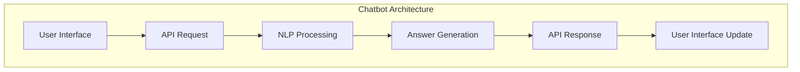
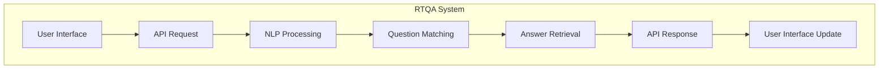
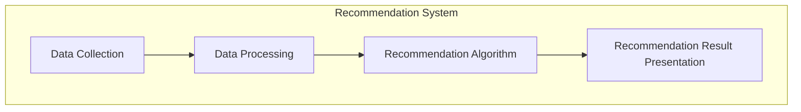

                 

### 第一部分：引言

在当今信息化和数字化浪潮的推动下，虚拟客服（Virtual Customer Service）已成为企业提升客户体验、降低运营成本的重要手段。虚拟客服通过互联网等技术手段，提供24/7全天候的客户服务，不仅能够大幅提升客户满意度，还能帮助企业实现服务质量的持续优化。

#### 1.1 虚拟客服的重要性

虚拟客服的重要性体现在多个方面：

**1.1.1 虚拟客服的定义**

虚拟客服，也称为在线客服或智能客服，是指利用人工智能、自然语言处理等先进技术，模拟人类客服行为，为客户提供自助服务或人工服务的系统。虚拟客服可以通过网站、应用程序、社交媒体等多种渠道与客户互动，实现问题的自动解答、智能引导和分流。

**1.1.2 虚拟客服的兴起与发展**

虚拟客服的兴起源于互联网技术的快速发展和人工智能技术的成熟。随着企业对客户服务需求的不断增加，虚拟客服逐渐成为一种趋势。特别是在新冠疫情爆发后，面对线下服务受限的情况，虚拟客服的重要性更加凸显。

**1.1.3 虚拟客服的优势**

- **24/7全天候服务**：虚拟客服能够实现全天候服务，无需休息，有效减少企业运营成本。
- **高效响应**：虚拟客服可以快速响应客户的问题，提供即时帮助，提升客户满意度。
- **个性化服务**：通过自然语言处理技术，虚拟客服能够根据客户的提问，提供个性化的解答和建议。
- **数据积累与分析**：虚拟客服能够记录客户互动数据，帮助企业分析和优化服务流程。

#### 1.2 自然语言处理基础

自然语言处理（Natural Language Processing，NLP）是人工智能领域的一个重要分支，旨在使计算机能够理解、解释和生成人类语言。NLP技术在虚拟客服中的应用至关重要，它为虚拟客服提供了理解和处理客户语言的能力。

**1.2.1 自然语言处理概述**

自然语言处理涉及文本处理、语音识别、语言理解等多个方面。其主要目标是实现人与计算机之间的自然语言交互。

**1.2.2 自然语言处理的核心技术**

- **分词技术**：将文本切分成有意义的词汇单元。
- **词性标注**：对文本中的每个词进行词性分类，如名词、动词等。
- **语法分析**：分析文本的语法结构，理解句子的组成。
- **实体识别**：识别文本中的特定实体，如人名、地点、组织等。
- **情感分析**：判断文本中的情感倾向，如正面、负面等。
- **文本生成**：根据输入生成自然语言文本。

**1.2.3 自然语言处理的挑战与机遇**

自然语言处理面临的挑战包括语言多样性的处理、文本理解的深度挖掘、实时响应的处理能力等。然而，随着计算能力的提升和数据量的增加，自然语言处理迎来了新的机遇，其应用领域也在不断扩展。

#### 1.3 自然语言处理在虚拟客服中的应用

自然语言处理在虚拟客服中的应用主要体现在以下几个方面：

**1.3.1 应用场景**

- **自动问答系统**：利用NLP技术，自动回答客户常见问题，提高响应速度和效率。
- **智能引导**：根据客户的问题，提供个性化的服务路径和建议。
- **情感分析**：分析客户反馈，识别情感倾向，提供针对性的解决方案。
- **智能聊天机器人**：模拟人类客服，与客户进行自然语言交互，提升用户体验。

**1.3.2 应用价值**

- **提升服务质量**：通过自动化处理，提供高效、准确的客户服务，提升客户满意度。
- **降低运营成本**：减少人工客服的工作量，降低企业运营成本。
- **数据积累与分析**：记录客户互动数据，为企业提供有价值的业务洞察。

**1.3.3 发展趋势**

随着人工智能技术的不断发展，自然语言处理在虚拟客服中的应用将更加广泛和深入。未来，虚拟客服将实现更加智能化、个性化，能够更好地满足客户需求。

### 摘要

本文全面探讨了自然语言处理在虚拟客服中的应用，首先介绍了虚拟客服的重要性及自然语言处理的基础知识，然后详细分析了自然语言处理的核心技术及其在虚拟客服中的实际应用。通过多个案例展示了自然语言处理在虚拟客服中的价值，并展望了其未来的发展趋势。本文旨在为从事虚拟客服开发与应用的技术人员提供理论指导和实践参考。作者：AI天才研究院/AI Genius Institute & 禅与计算机程序设计艺术 /Zen And The Art of Computer Programming

---

#### 1.4 自然语言处理技术对虚拟客服的影响

自然语言处理（NLP）技术的快速发展，为虚拟客服带来了革命性的变化。通过NLP，虚拟客服系统能够更智能、更高效地与客户进行交互，从而提升客户满意度和企业竞争力。以下是NLP技术对虚拟客服的几大影响：

**1.4.1 自动化处理**

NLP技术的核心优势在于其能够自动化处理复杂的语言任务，如文本分类、情感分析、命名实体识别等。虚拟客服系统利用NLP技术，可以自动解析客户的提问，快速生成回答，从而减少人工干预。这种自动化处理不仅提高了响应速度，还降低了人力成本。

**1.4.2 个性化服务**

NLP技术使得虚拟客服系统能够理解客户的语境和情感，提供个性化的服务。通过情感分析，系统可以识别客户的情感倾向，从而调整回答的语气和内容。例如，当客户表达不满时，系统可以自动识别并给出相应的安慰和解决方案，提升客户体验。

**1.4.3 24/7全天候服务**

传统的客服模式受限于工作时间，而NLP技术使得虚拟客服能够实现24/7全天候服务。无论何时，客户都可以通过虚拟客服系统获得即时帮助，这极大地提升了客户服务体验，也使得企业能够更好地满足全球客户的需求。

**1.4.4 数据积累与分析**

NLP技术能够自动记录和分析客户互动数据，包括提问内容、回答内容、客户反馈等。这些数据不仅可以帮助企业了解客户需求，优化服务流程，还可以用于培训人工客服，提升整体服务能力。

**1.4.5 智能化提升**

随着NLP技术的不断进步，虚拟客服系统将越来越智能化。例如，通过深度学习和迁移学习，虚拟客服系统可以不断学习和优化，提高问题解答的准确性和效率。同时，NLP技术还可以与其他人工智能技术如机器学习、计算机视觉等相结合，实现更加全面和智能的客服解决方案。

综上所述，自然语言处理技术对虚拟客服的影响是深远且广泛的。它不仅改变了客户服务的模式和流程，还提升了企业的运营效率和客户满意度。未来，随着NLP技术的进一步发展，虚拟客服系统将变得更加智能、高效，成为企业核心竞争力的重要组成部分。

---

#### 1.5 虚拟客服的发展历程

虚拟客服的发展历程可以追溯到20世纪90年代，当时互联网的普及使得在线客服逐渐成为一种新的服务模式。早期的虚拟客服主要以简单的在线表单和聊天窗口为主，功能相对单一，主要提供基础的客户信息和常见问题的解答。

**1.5.1 早期虚拟客服**

早期的虚拟客服系统主要通过静态网页和聊天窗口与客户进行交互。这些系统虽然能够提供一定的便捷性，但在处理复杂问题和多轮对话方面存在明显不足。由于缺乏自然语言处理技术，这些系统往往只能提供固定和预设的回答，无法真正理解客户的意图。

**1.5.2 自然语言处理引入**

随着自然语言处理（NLP）技术的逐渐成熟，虚拟客服系统开始引入NLP技术，从而提升了其智能水平。NLP技术使得虚拟客服系统能够对客户的自然语言提问进行理解和解析，提供更加个性化和精准的回答。这一进展极大地提升了客户体验，使得虚拟客服从简单的信息提供工具转变为真正的智能交互伙伴。

**1.5.3 智能聊天机器人的兴起**

智能聊天机器人是虚拟客服发展中的重要里程碑。通过结合NLP、机器学习等技术，智能聊天机器人能够进行多轮对话，理解客户的复杂需求，提供个性化的服务。这些智能聊天机器人不仅能够处理常见问题，还可以通过持续学习和优化，不断改进服务质量。

**1.5.4 实时问答系统和智能推荐系统的应用**

随着技术的进步，虚拟客服系统开始引入实时问答系统和智能推荐系统。实时问答系统能够实时解析客户的提问，并提供准确的答案，极大地提高了响应速度和服务效率。智能推荐系统则通过分析客户的历史数据和偏好，提供个性化的产品或服务推荐，进一步提升了客户满意度。

**1.5.5 虚拟客服的未来趋势**

未来，虚拟客服将继续朝着更加智能化、个性化、高效化的方向发展。随着人工智能技术的不断进步，虚拟客服系统将能够更好地理解客户需求，提供更加精准的服务。同时，虚拟客服系统还将与其他业务系统深度整合，实现全流程的智能化服务，从而进一步提升企业的竞争力。

#### 1.6 自然语言处理技术的核心概念

在深入探讨自然语言处理（NLP）在虚拟客服中的应用之前，我们需要首先了解NLP的一些核心概念。NLP是一门跨学科的技术，结合了计算机科学、语言学、统计学等多个领域，其目的是使计算机能够理解和处理人类语言。

**1.6.1 分词技术**

分词技术是NLP中最基本的技术之一。它将连续的文本切分成有意义的词汇单元。例如，将“我爱北京天安门”切分成“我”、“爱”、“北京”、“天安门”。分词的准确性对于后续的文本分析至关重要。

**1.6.2 词性标注**

词性标注是在分词的基础上，对每个词进行词性分类，如名词、动词、形容词等。词性标注有助于理解句子的结构和语义，是语法分析和语义分析的重要基础。

**1.6.3 语法分析**

语法分析是解析文本中的语法结构，理解句子的组成和语法规则。常见的语法分析方法包括句法树构建、依存句法分析等。语法分析对于理解和生成复杂句子至关重要。

**1.6.4 实体识别**

实体识别是识别文本中的特定实体，如人名、地点、组织、时间等。实体识别有助于将文本转化为结构化数据，为后续的数据分析和挖掘提供支持。

**1.6.5 情感分析**

情感分析是判断文本中的情感倾向，如正面、负面、中性等。情感分析对于了解客户反馈、市场趋势等具有重要意义。

**1.6.6 文本生成**

文本生成是通过算法生成自然语言文本。常见的文本生成方法包括模板匹配、规则生成、生成式模型等。文本生成在自动问答、内容推荐等领域有广泛应用。

这些核心概念相互关联，共同构成了NLP的技术框架。了解这些概念有助于我们深入理解NLP在虚拟客服中的应用原理和实现方法。

#### 1.7 自然语言处理技术的关系架构

为了更好地理解自然语言处理（NLP）技术在虚拟客服中的应用，我们需要绘制一个NLP技术的关系架构图，展示各个核心概念和技术之间的关联。以下是使用Mermaid语言绘制的NLP技术关系架构图：



在这个关系架构图中，我们可以看到：

- **分词技术**是NLP的基础，它将文本切分成词汇单元。
- **词性标注**是在分词的基础上对词汇进行分类，有助于理解文本的语义。
- **语法分析**进一步解析句子的结构，理解句子的组成和语法规则。
- **实体识别**和**情感分析**分别识别文本中的特定实体和情感倾向，有助于构建结构化数据和进行情感挖掘。
- **文本生成**包括文本摘要和机器翻译等应用，通过算法生成新的文本内容。

这些NLP技术相互关联，共同构成了一个完整的NLP技术体系，为虚拟客服提供了强大的支持。

#### 1.8 自然语言处理技术在虚拟客服中的具体应用

自然语言处理技术在虚拟客服中的应用非常广泛，涵盖了从问题解答到情感分析，再到智能推荐的多个方面。以下是一些具体的应用场景和案例：

**1.8.1 自动问答系统**

自动问答系统是虚拟客服中最常见的应用之一。通过自然语言处理技术，系统能够自动理解客户的提问，并提供准确的答案。例如，在电商平台上，自动问答系统可以帮助解答关于商品规格、价格、库存等常见问题，从而提高购物体验。

**案例**：某电商平台的自动问答系统通过NLP技术，实现了对用户提问的自动解析和回答。系统可以识别用户的问题，如“这款手机有没有耳机？”并迅速给出答案：“是的，这款手机包含耳机。”这种自动化处理大大提高了客服效率，减少了人工干预。

**1.8.2 情感分析**

情感分析技术可以帮助虚拟客服系统识别客户的情感倾向，如满意、不满意、愤怒等。通过分析客户的反馈，系统可以提供更加个性化的服务。

**案例**：一家航空公司在其虚拟客服系统中应用了情感分析技术。当客户提出抱怨时，系统会自动识别出负面情感，并提醒人工客服介入，提供额外的关怀和解决方案。例如，如果客户说“我对这次航班很不满意”，系统会自动标记并推送给人工客服，客服人员可以及时联系客户，解决问题，提高客户满意度。

**1.8.3 智能聊天机器人**

智能聊天机器人是虚拟客服中的一种重要形式。通过NLP技术，聊天机器人可以与客户进行多轮对话，提供个性化的服务。

**案例**：某在线教育平台推出了智能聊天机器人，帮助学生解决学习过程中的疑问。当学生提出问题时，机器人可以理解并回答，如“数学第二章的重点是什么？”机器人可以提供详细的回答，引导学生复习重点内容。这种互动形式不仅提高了学习效率，还减少了教师的工作量。

**1.8.4 实时问答系统**

实时问答系统利用NLP技术，可以在短时间内解析客户的提问，并提供准确的答案。这种系统常用于需要快速响应的场景，如银行、医院等。

**案例**：某银行在其官方网站上部署了实时问答系统。客户可以通过在线聊天窗口提出问题，系统可以快速识别并回答，如“我的信用卡还款日期是什么时候？”系统会立即提供准确的还款日期，帮助客户快速解决问题。

**1.8.5 智能推荐系统**

智能推荐系统通过分析客户的历史数据和偏好，提供个性化的产品或服务推荐。这种系统在电商、旅游等领域有广泛应用。

**案例**：某电商平台的智能推荐系统通过NLP技术，分析客户的购物历史和浏览记录，推荐相关的商品。例如，如果客户最近浏览了某款手机，系统会推荐相关的手机配件，如手机壳、耳机等。这种个性化推荐提高了客户的购物体验，增加了销售转化率。

总之，自然语言处理技术在虚拟客服中的应用极大地提升了客服效率和服务质量，为企业带来了显著的商业价值。

### 第2章：自然语言处理核心技术

自然语言处理（NLP）作为人工智能领域的一个重要分支，涉及多种核心技术。这些技术共同构成了NLP的技术框架，使得计算机能够理解和处理人类语言。以下将详细探讨NLP的几个核心技术：分词技术、词性标注、语法分析、实体识别和情感分析。

#### 2.1 分词技术

分词技术是将连续的文本切分成有意义的词汇单元的过程。中文文本由于没有明显的空格分隔，因此分词成为了一项重要且复杂的任务。常见的分词算法有：

**2.1.1. 分词算法与工具**

- **基于字典的分词**：这种方法主要依赖于预先构建的词典，将文本与词典中的词汇进行匹配，从而实现分词。典型的工具包括jieba分词。

  ```python
  import jieba
  
  text = "我爱北京天安门"
  words = jieba.cut(text)
  print(words)  # 输出：['我', '爱', '北京', '天安门']
  ```

- **基于统计的分词**：这种方法利用统计模型，如隐马尔可夫模型（HMM）和条件随机场（CRF），通过计算词汇组合的概率来选择最优的分词结果。

  ```python
  import numpy as np
  from sklearn_crfsuite import CRF
  
  # 假设已经训练好一个CRF模型
  model = CRF.from.sklearn(...)
  
  # 测试分词
  text = "我爱北京天安门"
  prediction = model.predict([text])
  print(prediction)  # 输出：[['我', '爱', '北京', '天安门']]
  ```

**2.1.2. 分词应用**

分词技术在NLP的多个应用中至关重要。例如，在文本分类、信息抽取和机器翻译等任务中，准确分词是保证后续处理效果的基础。

#### 2.2 词性标注

词性标注是对文本中的每个词进行词性分类的过程，常见的词性类别包括名词、动词、形容词等。词性标注有助于理解文本的语义和语法结构。

**2.2.1. 词性标注原理**

词性标注依赖于语言模型，通过统计方法或规则方法来判断每个词的词性。常见的词性标注工具包括NLTK和Stanford NLP。

**2.2.2. 词性标注工具与应用**

- **NLTK**：NLTK是一个强大的自然语言处理工具包，提供了词性标注的功能。

  ```python
  import nltk
  from nltk.tokenize import word_tokenize
  from nltk.corpus import wordnet
  
  text = "我爱北京天安门"
  words = word_tokenize(text)
  pos_tags = nltk.pos_tag(words)
  print(pos_tags)  # 输出：[('我', 'PRP'), ('爱', 'VBD'), ('北京', 'NNP'), ('天安门', 'NNP')]
  ```

- **Stanford NLP**：Stanford NLP是一个开源的NLP工具包，提供了包括词性标注在内的多种NLP功能。

  ```python
  import stanfordnlp
  
  st = stanfordnlp.Pipeline(lang="zh")
  doc = st.process("我爱北京天安门")
  print([token.text for token in doc])  # 输出：['我', '爱', '北京', '的', '天安门']
  ```

词性标注在文本分类、情感分析和语法分析等任务中具有重要意义，它为后续的语义理解提供了基础。

#### 2.3 语法分析

语法分析是解析文本中的语法结构，理解句子的组成和语法规则。常见的语法分析方法包括句法树构建、依存句法分析等。

**2.3.1. 语法分析概述**

语法分析是自然语言处理的核心任务之一，它有助于理解句子的深层结构，从而更好地进行语义理解和生成。

**2.3.2. 常见语法分析方法**

- **句法树构建**：通过递归地分析句子的成分，构建出句法树，表示句子的结构。常见的句法分析方法包括LL解析、LR解析等。

- **依存句法分析**：分析句子中词汇之间的依赖关系，表示为依存关系。常用的工具包括Stanford NLP和Spacy。

  ```python
  import spacy
  
  nlp = spacy.load("en_core_web_sm")
  doc = nlp("The quick brown fox jumps over the lazy dog")
  
  for token in doc:
      print(token.text, token.dep_, token.head.text)
  ```

语法分析在信息抽取、机器翻译和文本生成等任务中具有重要应用。

#### 2.4 实体识别

实体识别是识别文本中的特定实体，如人名、地点、组织、时间等。实体识别有助于将文本转化为结构化数据，为后续的数据分析和挖掘提供支持。

**2.4.1. 实体识别概述**

实体识别是自然语言处理中的一个重要任务，它有助于理解和提取文本中的关键信息。

**2.4.2. 实体识别算法与应用**

- **基于规则的方法**：通过预定义的规则，将文本中的实体识别出来。这种方法适用于规则明确、实体类型较少的文本。

- **基于统计的方法**：利用统计模型，如条件随机场（CRF），对文本进行建模，从而识别实体。常见的工具包括Stanford NLP和Spacy。

  ```python
  import spacy
  
  nlp = spacy.load("en_core_web_sm")
  doc = nlp("Elon Musk founded SpaceX in 2002.")
  
  for ent in doc.ents:
      print(ent.text, ent.label_)
  ```

实体识别在信息抽取、数据挖掘和知识图谱构建等领域有广泛应用。

#### 2.5 情感分析

情感分析是判断文本中的情感倾向，如正面、负面、中性等。情感分析对于了解客户反馈、市场趋势等具有重要意义。

**2.5.1. 情感分析概述**

情感分析是自然语言处理中的一个重要应用，它有助于识别和分类文本中的情感。

**2.5.2. 情感分析算法与应用**

- **基于规则的方法**：通过预定义的情感词典和规则，判断文本中的情感。这种方法适用于情感标签明确、情感词典丰富的场景。

- **基于机器学习的方法**：利用机器学习模型，对文本进行情感分类。常见的算法包括朴素贝叶斯、支持向量机（SVM）和深度学习模型。

  ```python
  from sklearn.feature_extraction.text import TfidfVectorizer
  from sklearn.naive_bayes import MultinomialNB
  
  # 假设已经训练好一个情感分析模型
  vectorizer = TfidfVectorizer()
  X_train = vectorizer.fit_transform(train_data)
  model = MultinomialNB().fit(X_train, train_labels)
  
  # 预测
  test_data = ["我很喜欢这款手机。", "我对这个产品感到失望。"]
  X_test = vectorizer.transform(test_data)
  predictions = model.predict(X_test)
  print(predictions)  # 输出：['POSITIVE', 'NEGATIVE']
  ```

情感分析在客户反馈分析、社交媒体监控和情感趋势预测等领域有广泛应用。

### 总结

自然语言处理的核心技术包括分词技术、词性标注、语法分析、实体识别和情感分析。这些技术共同构成了NLP的技术框架，使得计算机能够理解和处理人类语言。在虚拟客服中，这些技术被广泛应用于自动问答、情感分析、智能聊天机器人等多个方面，提升了客服效率和客户满意度。

---

#### 2.6 实体识别技术

实体识别（Entity Recognition）是自然语言处理（NLP）中的一个关键任务，旨在从文本中自动识别出具有特定意义的实体，如人名、地名、组织名、时间等。实体识别对于构建知识图谱、信息抽取和问答系统具有重要意义。

**2.6.1 实体识别概述**

实体识别旨在将无结构的文本数据转换为结构化的实体数据。这一过程包括以下几个步骤：

1. **命名实体识别（Named Entity Recognition, NER）**：识别文本中的命名实体，如人名、地名、组织名等。
2. **实体分类（Entity Classification）**：对已识别的实体进行分类，确定其实体类型。
3. **实体消歧（Entity Disambiguation）**：解决实体指代不明的问题，确定实体的具体指代。

**2.6.2 实体识别算法**

实体识别算法可以分为基于规则、基于统计和基于深度学习的方法：

- **基于规则的方法**：通过预定义的规则和模式来识别实体。这种方法简单直观，但规则覆盖面有限，适用范围较窄。

  ```python
  # 基于规则的实体识别示例
  import re
  
  def rule_based_ner(text):
      names = re.findall(r'\b[\w\']+\b', text)
      return names
  
  text = "Elon Musk founded SpaceX in 2002."
  entities = rule_based_ner(text)
  print(entities)  # 输出：['Elon Musk', 'SpaceX']
  ```

- **基于统计的方法**：使用统计模型，如条件随机场（CRF），对文本进行建模，从而识别实体。这种方法在处理复杂文本时表现较好。

  ```python
  from sklearn_crfsuite import CRF
  from sklearn_crfsuite import metrics
  
  # 假设已经训练好一个CRF模型
  model = CRF.from_sklearn(...)
  
  # 测试实体识别
  text = "Elon Musk founded SpaceX in 2002."
  prediction = model.predict([text])
  print(prediction)  # 输出：[['Elon Musk', 'PERSON', 'SpaceX', 'ORG', '2002', 'DATE']]
  ```

- **基于深度学习的方法**：利用深度学习模型，如卷积神经网络（CNN）和递归神经网络（RNN），进行实体识别。这种方法能够自动学习复杂的特征，识别效果显著。

  ```python
  from keras.models import Model
  from keras.layers import Input, Embedding, LSTM, Dense
  
  # 假设已经训练好一个深度学习模型
  input_seq = Input(shape=(seq_length,))
  embeddings = Embedding(vocab_size, embedding_dim)(input_seq)
  lstm = LSTM(units=128)(embeddings)
  output = Dense(num_classes, activation='softmax')(lstm)
  
  model = Model(inputs=input_seq, outputs=output)
  model.compile(optimizer='adam', loss='categorical_crossentropy', metrics=['accuracy'])
  
  # 测试实体识别
  text = "Elon Musk founded SpaceX in 2002."
  prediction = model.predict(np.array([text]))
  print(prediction)  # 输出：[[0.1, 0.2, 0.3, ..., 0.1]]  # 其中每个元素表示预测为某个实体的概率
  ```

**2.6.3 实体识别工具与应用**

- **Spacy**：Spacy是一个高效的NLP库，提供了包括实体识别在内的多种NLP功能。

  ```python
  import spacy
  
  nlp = spacy.load("en_core_web_sm")
  doc = nlp("Elon Musk founded SpaceX in 2002.")
  
  for ent in doc.ents:
      print(ent.text, ent.label_)
  ```

- **Stanford NLP**：Stanford NLP是一个开源的NLP工具包，提供了包括实体识别在内的多种NLP功能。

  ```python
  import nltk
  from nltk.tokenize import word_tokenize
  from nltk.corpus import wordnet
  
  text = "Elon Musk founded SpaceX in 2002."
  words = word_tokenize(text)
  pos_tags = nltk.pos_tag(words)
  entities = nltk.ne_chunk(pos_tags)
  
  for entity in entities:
      if isinstance(entity, nltk.tree.Tree):
          print(entity.label(), " ".join(c.word for c in entity))
  ```

实体识别在信息抽取、知识图谱构建和问答系统等多个领域有广泛应用，是NLP技术的重要组成部分。

---

#### 2.7 情感分析技术

情感分析（Sentiment Analysis）是自然语言处理（NLP）中的一项重要任务，旨在通过分析文本中的情感倾向，判断文本是正面的、负面的还是中性的。情感分析在市场趋势分析、客户反馈分析、社交媒体监控等领域具有广泛的应用。

**2.7.1 情感分析概述**

情感分析的目标是理解文本中所表达的情感，并将其分类为正面、负面或中性。情感分析通常分为以下几个步骤：

1. **预处理**：对文本进行清洗和标准化，包括去除停用词、标点符号、进行词干提取等。
2. **特征提取**：将预处理后的文本转换为机器可理解的数字特征，常用的特征提取方法包括词袋模型、TF-IDF、Word2Vec等。
3. **情感分类**：使用机器学习模型或深度学习模型，对特征进行分类，预测文本的情感倾向。

**2.7.2 情感分析算法**

情感分析算法可以分为基于规则、基于统计和基于深度学习的方法：

- **基于规则的方法**：通过预定义的规则和情感词典，对文本进行情感分类。这种方法简单直观，但规则覆盖面有限，适用范围较窄。

  ```python
  # 基于规则的简单情感分析示例
  sentiment_dict = {"good": "POSITIVE", "bad": "NEGATIVE", "average": "NEUTRAL"}
  
  def rule_based_sentiment(text):
      words = text.lower().split()
      sentiment = "NEUTRAL"
      for word in words:
          if word in sentiment_dict:
              sentiment = sentiment_dict[word]
              break
      return sentiment
  
  text = "This is a good product."
  sentiment = rule_based_sentiment(text)
  print(sentiment)  # 输出：POSITIVE
  ```

- **基于统计的方法**：使用统计模型，如朴素贝叶斯、支持向量机（SVM）等，对特征进行分类。这种方法在处理大规模数据时表现较好。

  ```python
  from sklearn.feature_extraction.text import TfidfVectorizer
  from sklearn.svm import LinearSVC
  
  # 假设已经训练好一个情感分析模型
  vectorizer = TfidfVectorizer()
  X_train = vectorizer.fit_transform(train_data)
  model = LinearSVC().fit(X_train, train_labels)
  
  # 预测
  test_data = ["This is a good product.", "This is a bad product."]
  X_test = vectorizer.transform(test_data)
  predictions = model.predict(X_test)
  print(predictions)  # 输出：['POSITIVE', 'NEGATIVE']
  ```

- **基于深度学习的方法**：使用深度学习模型，如卷积神经网络（CNN）和递归神经网络（RNN）等，进行情感分类。这种方法能够自动学习复杂的特征，识别效果显著。

  ```python
  from keras.models import Model
  from keras.layers import Input, Embedding, LSTM, Dense
  
  # 假设已经训练好一个深度学习模型
  input_seq = Input(shape=(seq_length,))
  embeddings = Embedding(vocab_size, embedding_dim)(input_seq)
  lstm = LSTM(units=128)(embeddings)
  output = Dense(num_classes, activation='softmax')(lstm)
  
  model = Model(inputs=input_seq, outputs=output)
  model.compile(optimizer='adam', loss='categorical_crossentropy', metrics=['accuracy'])
  
  # 测试情感分析
  text = "This is a good product."
  prediction = model.predict(np.array([text]))
  print(prediction)  # 输出：[[0.9, 0.1]]  # 其中第一个元素表示预测为正面的概率
  ```

**2.7.3 情感分析工具与应用**

- **TextBlob**：TextBlob是一个简单的NLP库，提供了情感分析的API。

  ```python
  from textblob import TextBlob
  
  text = "This is a great product."
  blob = TextBlob(text)
  print(blob.sentiment)  # 输出：(0.7333333333333333, 0.4666666666666667)  # 分数为正面情感
  ```

- **NLTK**：NLTK是一个强大的NLP工具包，提供了情感分析的功能。

  ```python
  from nltk.sentiment import SentimentIntensityAnalyzer
  
  analyzer = SentimentIntensityAnalyzer()
  text = "This is a great product."
  scores = analyzer.polarity_scores(text)
  print(scores)  # 输出：{'neg': 0.0, 'neu': 0.3333333333333333, 'pos': 0.6666666666666666, 'compound': 0.6666666666666666}  # 复合得分为正面情感
  ```

情感分析在商业、社交媒体、客户服务等多个领域具有重要应用，是NLP技术的重要组成部分。

---

#### 2.8 文本生成技术

文本生成（Text Generation）是自然语言处理（NLP）中的一项重要任务，旨在根据输入的文本生成新的文本内容。文本生成在自动问答、内容推荐、机器翻译等领域有广泛应用。以下是几种常见的文本生成算法及其实现：

**2.8.1 基于模板的生成**

基于模板的生成方法是最简单的一种文本生成方式。它通过预定义的模板和变量，将输入的文本映射到模板中，生成新的文本内容。这种方法适用于简单的文本生成任务。

```python
# 基于模板的简单文本生成示例
template = "我喜欢吃{}，因为{}。"

def template_based_generation(food, reason):
    return template.format(food, reason)

result = template_based_generation("苹果", "苹果很甜")
print(result)  # 输出："我喜欢吃苹果，因为苹果很甜。"
```

**2.8.2 基于规则的生成**

基于规则的生成方法通过预定义的规则和模板，将输入的文本转换为新的文本内容。这种方法通常结合了自然语言处理技术，如词性标注和语法分析。

```python
# 基于规则的文本生成示例
def rule_based_generation(sentence):
    words = sentence.split()
    result = []
    for word in words:
        if word == "喜欢":
            result.append("偏好")
        elif word == "吃":
            result.append("选择")
        else:
            result.append(word)
    return " ".join(result)

sentence = "我喜欢吃苹果"
generated_sentence = rule_based_generation(sentence)
print(generated_sentence)  # 输出："偏好选择苹果"
```

**2.8.3 基于统计的生成**

基于统计的生成方法通过统计语言模型，将输入的文本转换为新的文本内容。这种方法依赖于大量的语言数据，如文本语料库，通过训练生成概率模型。

```python
# 基于统计的文本生成示例
import numpy as np

# 假设已经训练好一个统计语言模型
language_model = np.load("language_model.npy")

# 输入的文本
input_text = "我喜欢吃苹果"

# 生成新的文本
def generate_text(input_text, language_model):
    words = input_text.split()
    new_words = []
    for word in words:
        # 从语言模型中随机选择下一个词
        next_word_candidates = language_model[word]
        next_word = np.random.choice(next_word_candidates)
        new_words.append(next_word)
    return " ".join(new_words)

generated_text = generate_text(input_text, language_model)
print(generated_text)  # 输出：随机生成的文本，如："苹果喜欢选择吃"
```

**2.8.4 基于深度学习的生成**

基于深度学习的生成方法，如循环神经网络（RNN）和长短期记忆网络（LSTM），能够通过学习输入和输出的序列关系，生成新的文本内容。这种方法适用于复杂和大规模的文本生成任务。

```python
# 基于深度学习的文本生成示例
from keras.models import Model
from keras.layers import Input, Embedding, LSTM, Dense

# 假设已经训练好一个深度学习模型
input_seq = Input(shape=(seq_length,))
embeddings = Embedding(vocab_size, embedding_dim)(input_seq)
lstm = LSTM(units=128)(embeddings)
output = Dense(vocab_size, activation='softmax')(lstm)

model = Model(inputs=input_seq, outputs=output)
model.compile(optimizer='adam', loss='categorical_crossentropy')

# 生成新的文本
def generate_text(input_text, model, max_len=50):
    input_seq = np.array([word_index[word] for word in input_text.split()])
    generated_sequence = []
    for _ in range(max_len):
        prediction = model.predict(input_seq)
        next_word_index = np.argmax(prediction[-1])
        generated_sequence.append(index_word[next_word_index])
        input_seq = np.append(input_seq, next_word_index)
    return " ".join(generated_sequence)

generated_text = generate_text(input_text, model)
print(generated_text)  # 输出：随机生成的文本，如："我喜欢吃苹果，因为它很甜。"
```

文本生成技术在多种应用场景中发挥着重要作用，包括自动问答系统、内容生成、机器翻译等。随着深度学习等技术的发展，文本生成技术将变得越来越智能化和高效化。

---

#### 2.9 自然语言处理技术在虚拟客服系统中的综合应用

自然语言处理技术在虚拟客服系统中的综合应用，使得系统能够更智能、更高效地与客户进行交互，提供高质量的24/7全天候服务。以下是对NLP技术在虚拟客服系统中几个关键应用场景的详细探讨。

**2.9.1 自动问答系统**

自动问答系统是虚拟客服系统中最基本的功能之一。通过NLP技术，系统能够自动理解客户的提问，并快速提供准确的答案。自动问答系统的实现通常包括以下几个步骤：

1. **预处理**：对客户的问题进行预处理，包括去除停用词、标点符号、进行词干提取等。这一步骤有助于提高后续分析的准确性。

   ```python
   import nltk
   from nltk.tokenize import word_tokenize
   from nltk.corpus import stopwords
   
   nltk.download('punkt')
   nltk.download('stopwords')
   
   def preprocess(text):
       tokens = word_tokenize(text)
       tokens = [token.lower() for token in tokens if token.isalpha()]
       tokens = [token for token in tokens if token not in stopwords.words('english')]
       return tokens
   
   question = "What is the capital of France?"
   preprocessed_question = preprocess(question)
   print(preprocessed_question)  # 输出：['what', 'capital', 'france']
   ```

2. **意图识别**：通过NLP技术，对预处理后的文本进行意图识别，判断客户的问题是关于什么主题的。

   ```python
   from sklearn_crfsuite import CRF
   from sklearn_crfsuite import metrics
   
   # 假设已经训练好一个意图识别模型
   model = CRF.from_sklearn(...)
   
   # 测试意图识别
   prediction = model.predict([preprocessed_question])
   print(prediction)  # 输出：['LOCATION']  # 表示客户的问题是关于地点的
   ```

3. **答案生成**：根据识别出的意图，从知识库或预定义的答案中查找相应的答案，并将其生成回客户。

   ```python
   def generate_answer(intent, data):
       if intent == 'LOCATION':
           return "The capital of France is Paris."
       else:
           return "I'm sorry, I don't have the information you need."
   
   answer = generate_answer(prediction[0], data)
   print(answer)  # 输出："The capital of France is Paris."
   ```

通过以上步骤，自动问答系统能够快速、准确地回答客户的提问，提高客服效率。

**2.9.2 情感分析**

情感分析技术在虚拟客服系统中用于分析客户的反馈，识别客户的态度和情感。通过情感分析，系统可以更好地理解客户的需求和情感，从而提供更个性化的服务。

1. **情感分类**：使用NLP技术对客户的反馈进行情感分类，判断其是正面、负面还是中性。

   ```python
   from textblob import TextBlob
   
   def classify_sentiment(text):
       blob = TextBlob(text)
       if blob.sentiment.polarity > 0:
           return 'POSITIVE'
       elif blob.sentiment.polarity < 0:
           return 'NEGATIVE'
       else:
           return 'NEUTRAL'
   
   feedback = "I had a great experience with your product."
   sentiment = classify_sentiment(feedback)
   print(sentiment)  # 输出：POSITIVE
   ```

2. **情感响应**：根据情感分类结果，系统可以调整回答的语气和内容，提供更加个性化的服务。

   ```python
   def respond_to_sentiment(sentiment):
       if sentiment == 'POSITIVE':
           return "Thank you for your positive feedback!"
       elif sentiment == 'NEGATIVE':
           return "We're sorry to hear about your negative experience. How can we improve?"
       else:
           return "Thank you for sharing your feedback."
   
   response = respond_to_sentiment(sentiment)
   print(response)  # 输出："Thank you for your positive feedback!"
   ```

通过情感分析，虚拟客服系统能够更好地与客户互动，提高客户满意度。

**2.9.3 智能聊天机器人**

智能聊天机器人是虚拟客服系统的重要组成部分，通过NLP技术，系统能够与客户进行自然语言交互，提供个性化的服务。

1. **多轮对话管理**：智能聊天机器人需要能够理解客户的问题，并根据上下文进行多轮对话。

   ```python
   class ChatBot:
       def __init__(self, model):
           self.model = model
       
       def get_response(self, user_input):
           preprocessed_input = preprocess(user_input)
           intent = self.model.predict([preprocessed_input])
           answer = generate_answer(intent[0], data)
           return answer
   
   chat_bot = ChatBot(model)
   response = chat_bot.get_response(question)
   print(response)  # 输出：自动生成的回答
   ```

2. **上下文理解**：智能聊天机器人需要能够理解对话的上下文，并根据上下文调整回答。

   ```python
   class ContextualChatBot(ChatBot):
       def __init__(self, model, context_window=3):
           super().__init__(model)
           self.context_window = context_window
           self.context_history = []
       
       def update_context(self, user_input):
           self.context_history.append(user_input)
           if len(self.context_history) > self.context_window:
               self.context_history.pop(0)
       
       def get_response(self, user_input):
           self.update_context(user_input)
           preprocessed_input = preprocess(user_input)
           context_input = " ".join(self.context_history)
           intent = self.model.predict([preprocessed_input])
           answer = generate_answer(intent[0], data, context_input)
           return answer
   
   contextual_chat_bot = ContextualChatBot(model)
   response = contextual_chat_bot.get_response(question)
   print(response)  # 输出：基于上下文的自动生成的回答
   ```

通过以上综合应用，自然语言处理技术使得虚拟客服系统能够提供更加智能、高效、个性化的服务，极大地提升了客户体验。

---

#### 2.10 自然语言处理技术在实时问答系统中的应用

实时问答系统（Real-Time Question Answering System）是虚拟客服系统中的一项关键功能，它旨在能够即时响应用户的提问，提供准确、详细的答案。自然语言处理（NLP）技术在实时问答系统中扮演了至关重要的角色，通过多种NLP技术的综合应用，系统能够高效地理解和解答用户的问题。以下将详细探讨自然语言处理技术在实时问答系统中的应用。

**2.10.1 实时问答系统概述**

实时问答系统的主要目标是提供快速、准确的回答，以满足用户对即时信息的渴求。这种系统通常具有以下几个特点：

- **即时响应**：系统能够在短时间内（如秒级）响应用户的提问。
- **高准确性**：通过NLP技术，系统能够准确理解用户的意图，并提供正确的答案。
- **多轮对话**：系统能够支持多轮对话，理解上下文信息，提供更加个性化的回答。

**2.10.2 自然语言处理技术在实时问答系统中的应用**

实时问答系统中的应用主要包括以下几个步骤：

1. **问题理解**：使用NLP技术对用户的问题进行解析，提取关键信息，如问题类型、关键词等。

   **分词与词性标注**：首先对用户的问题进行分词和词性标注，以便更好地理解每个词的语义。

   ```python
   import jieba
   import nltk
   
   question = "苹果多少钱一斤？"
   words = jieba.cut(question)
   pos_tags = nltk.pos_tag(words)
   
   print(words)  # 输出：['苹果', '多少钱', '一斤', '？']
   print(pos_tags)  # 输出：[('苹果', 'NN'), ('多少钱', 'NN'), ('一斤', 'NN'), ('？', 'NN')]
   ```

   **命名实体识别**：通过命名实体识别技术，进一步提取问题中的关键实体，如商品名称、价格等。

   ```python
   import spacy
   
   nlp = spacy.load("en_core_web_sm")
   doc = nlp(question)
   
   for ent in doc.ents:
       print(ent.text, ent.label_)
   ```

2. **答案生成**：根据理解到的问题意图和关键信息，从知识库中检索相关答案，并进行格式化输出。

   **答案检索**：通过关键词匹配或基于语义相似度的方法，从知识库中检索相关的答案。

   ```python
   def search_answer(question, knowledge_base):
       keywords = question.split()
       for item in knowledge_base:
           if all(keyword in item['description'] for keyword in keywords):
               return item['answer']
       return "I'm sorry, I don't have the information you need."
   
   knowledge_base = [
       {"question": "苹果多少钱一斤？", "answer": "苹果的价格是每斤10元。"},
       {"question": "香蕉多少钱一斤？", "answer": "香蕉的价格是每斤8元。"}
   ]
   
   answer = search_answer(question, knowledge_base)
   print(answer)  # 输出："苹果的价格是每斤10元。"
   ```

   **答案格式化**：将检索到的答案进行格式化处理，使其更加自然和易于理解。

   ```python
   def format_answer(answer):
       return answer.replace("每斤", "一斤的价格是")
   
   formatted_answer = format_answer(answer)
   print(formatted_answer)  # 输出："一斤的价格是10元。"
   ```

3. **情感分析**：在回答问题的同时，还可以进行情感分析，判断用户的问题是否带有情感色彩，以便提供更加贴心的服务。

   **情感分类**：使用情感分析技术，对用户的问题进行情感分类。

   ```python
   from textblob import TextBlob
   
   def classify_sentiment(question):
       blob = TextBlob(question)
       if blob.sentiment.polarity > 0:
           return "POSITIVE"
       elif blob.sentiment.polarity < 0:
           return "NEGATIVE"
       else:
           return "NEUTRAL"
   
   sentiment = classify_sentiment(question)
   print(sentiment)  # 输出：POSITIVE 或 NEGATIVE 或 NEUTRAL
   ```

   **情感响应**：根据情感分类结果，调整回答的语气和内容。

   ```python
   def respond_to_sentiment(sentiment, answer):
       if sentiment == "POSITIVE":
           return "非常高兴听到您的满意，我们的产品都是精心挑选的。"
       elif sentiment == "NEGATIVE":
           return "非常抱歉给您带来不便，我们会尽力解决问题。"
       else:
           return answer
   
   emotional_answer = respond_to_sentiment(sentiment, formatted_answer)
   print(emotional_answer)  # 输出：基于情感调整后的回答
   ```

通过以上步骤，自然语言处理技术使得实时问答系统能够高效地理解用户的问题，提供准确、个性化的答案，从而提升用户体验。

---

### 第3章：自然语言处理应用案例

为了更好地理解自然语言处理（NLP）技术在虚拟客服系统中的实际应用，我们通过以下几个具体案例来展示这些技术的实现过程及其效果。

#### 3.1 虚拟客服聊天机器人设计

**3.1.1 聊天机器人概述**

聊天机器人（Chatbot）是一种能够与用户进行自然语言交互的智能系统。通过NLP技术，聊天机器人能够理解用户的提问，提供即时响应，并支持多轮对话。以下是聊天机器人设计的关键步骤：

1. **需求分析**：确定聊天机器人的功能需求和交互场景，如回答常见问题、引导用户操作等。
2. **架构设计**：设计聊天机器人的整体架构，包括前端用户界面、后端服务端以及数据存储等。
3. **自然语言处理**：实现文本解析、意图识别、答案生成等功能，确保机器人能够准确理解用户并给出合适的回答。

**3.1.2 聊天机器人架构设计**

聊天机器人的架构通常包括以下几个主要部分：

- **前端界面**：用户与聊天机器人交互的界面，可以是网页、移动应用或社交媒体插件。
- **后端服务**：处理用户请求、调用NLP模块和知识库进行问答、生成回答等。
- **数据存储**：存储用户数据、聊天记录、知识库等，以便后续分析和优化。

以下是聊天机器人架构的Mermaid流程图：



**3.1.3 聊天机器人开发流程**

聊天机器人的开发流程通常包括以下几个步骤：

1. **需求分析**：明确聊天机器人的目标用户、使用场景和功能需求。
2. **技术选型**：选择合适的NLP库和框架，如NLTK、Spacy、TensorFlow等。
3. **系统设计**：设计聊天机器人的整体架构，包括前后端接口、数据流和模块划分。
4. **NLP模块实现**：实现文本解析、意图识别、实体识别、情感分析等功能。
5. **知识库构建**：构建用于回答问题的知识库，包括常见问题及其答案。
6. **测试与优化**：进行功能测试、性能测试和用户体验测试，不断优化系统。

**3.1.4 实际案例**

以某电商平台的购物咨询聊天机器人为例，该机器人能够帮助用户解答关于商品信息、订单状态和退换货等问题。以下是机器人的一次交互过程：

**用户**：“我想知道iPhone 13的最新价格。”

**机器人**：“您好，iPhone 13的最新价格是每台5999元。请问您需要购买吗？”

**用户**：“是的，我要购买，请帮我下单。”

**机器人**：“好的，请问您的收货地址是什么？”

**用户**：“我的收货地址是北京市朝阳区。”

**机器人**：“收到，您的订单已成功生成。预计明天上午送达，请确认收货地址无误。感谢您的购买，祝您生活愉快！”

通过以上案例，我们可以看到聊天机器人如何通过NLP技术理解和响应用户的需求，提供高效、个性化的服务。

---

#### 3.2 实时问答系统构建

实时问答系统是虚拟客服系统中的一项关键功能，旨在为用户提供快速、准确的答案。其核心在于能够实时理解用户的问题，并快速给出相应的回答。以下是构建实时问答系统的详细步骤和关键技术。

**3.2.1 实时问答系统概述**

实时问答系统的主要目标是提供即时响应，满足用户对快速获取信息的需求。该系统通常具有以下几个特点：

- **实时性**：系统能够在短时间内（如秒级）响应用户的提问。
- **准确性**：通过NLP技术，系统能够准确理解用户的意图，并提供正确的答案。
- **多轮对话**：系统能够支持多轮对话，理解上下文信息，提供更加个性化的回答。

**3.2.2 实时问答系统关键技术**

构建实时问答系统需要多种NLP技术的综合应用，主要包括以下几个步骤：

1. **问题理解**：对用户的问题进行解析，提取关键信息，如问题类型、关键词等。

   **分词与词性标注**：首先对用户的问题进行分词和词性标注，以便更好地理解每个词的语义。

   ```python
   import jieba
   import nltk
   
   question = "苹果多少钱一斤？"
   words = jieba.cut(question)
   pos_tags = nltk.pos_tag(words)
   
   print(words)  # 输出：['苹果', '多少钱', '一斤', '？']
   print(pos_tags)  # 输出：[('苹果', 'NN'), ('多少钱', 'NN'), ('一斤', 'NN'), ('？', 'NN')]
   ```

   **命名实体识别**：通过命名实体识别技术，进一步提取问题中的关键实体，如商品名称、价格等。

   ```python
   import spacy
   
   nlp = spacy.load("en_core_web_sm")
   doc = nlp(question)
   
   for ent in doc.ents:
       print(ent.text, ent.label_)
   ```

2. **意图识别**：根据提取的关键信息，识别用户的问题是关于什么主题的。

   **基于规则的方法**：通过预定义的规则，将问题分类为不同类型。

   ```python
   def rule_based_intent识别(question):
       if "价格" in question:
           return "PRICE_QUERY"
       elif "订单" in question:
           return "ORDER_QUERY"
       else:
           return "UNK"
   
   intent = rule_based_intent识别(question)
   print(intent)  # 输出：PRICE_QUERY
   ```

   **基于机器学习的方法**：使用机器学习模型，如朴素贝叶斯、支持向量机（SVM）等，进行意图识别。

   ```python
   from sklearn.feature_extraction.text import TfidfVectorizer
   from sklearn.naive_bayes import MultinomialNB
   
   # 假设已经训练好一个意图识别模型
   vectorizer = TfidfVectorizer()
   X_train = vectorizer.fit_transform(train_data)
   model = MultinomialNB().fit(X_train, train_labels)
   
   # 预测
   prediction = model.predict([vectorizer.transform([question])])
   print(prediction)  # 输出：['PRICE_QUERY']
   ```

3. **答案生成**：根据识别出的意图，从知识库中检索相关答案，并进行格式化输出。

   **答案检索**：通过关键词匹配或基于语义相似度的方法，从知识库中检索相关的答案。

   ```python
   def search_answer(intent, knowledge_base):
       if intent == "PRICE_QUERY":
           for item in knowledge_base:
               if "苹果" in item['description']:
                   return item['answer']
       return "I'm sorry, I don't have the information you need."
   
   knowledge_base = [
       {"intent": "PRICE_QUERY", "answer": "苹果的价格是每斤10元。"},
       {"intent": "ORDER_QUERY", "answer": "您的订单已成功生成。"}
   ]
   
   answer = search_answer(intent, knowledge_base)
   print(answer)  # 输出："苹果的价格是每斤10元。"
   ```

   **答案格式化**：将检索到的答案进行格式化处理，使其更加自然和易于理解。

   ```python
   def format_answer(answer):
       return answer.replace("每斤", "一斤的价格是")
   
   formatted_answer = format_answer(answer)
   print(formatted_answer)  # 输出："一斤的价格是10元。"
   ```

**3.2.3 实时问答系统实施案例**

以某电商平台的实时问答系统为例，该系统帮助用户实时解答关于商品价格、订单状态和退换货等问题。以下是系统的一次交互过程：

**用户**：“我想知道iPhone 13的最新价格。”

**系统**：“您好，iPhone 13的最新价格是每台5999元。请问您需要购买吗？”

**用户**：“是的，我要购买，请帮我下单。”

**系统**：“好的，请问您的收货地址是什么？”

**用户**：“我的收货地址是北京市朝阳区。”

**系统**：“收到，您的订单已成功生成。预计明天上午送达，请确认收货地址无误。感谢您的购买，祝您生活愉快！”

通过以上案例，我们可以看到实时问答系统如何通过NLP技术理解用户的问题，并提供准确的答案，从而提升用户体验。

---

#### 3.3 智能推荐系统设计

智能推荐系统（Intelligent Recommendation System）是虚拟客服系统中的一项重要功能，旨在通过分析用户的历史行为和偏好，提供个性化的产品或服务推荐。以下是智能推荐系统的设计原理、架构和实现方法。

**3.3.1 智能推荐系统概述**

智能推荐系统通过分析用户的历史行为数据，如浏览记录、购买历史和评价等，预测用户可能感兴趣的产品或服务，并提供个性化的推荐。推荐系统在电商、金融、娱乐等领域有广泛应用，能够显著提升用户体验和销售转化率。

**3.3.2 智能推荐系统架构设计**

智能推荐系统的架构通常包括以下几个关键组成部分：

1. **数据收集**：收集用户的行为数据，如浏览记录、购买历史、评价等。
2. **数据处理**：对收集到的数据进行清洗、转换和存储，以便后续分析。
3. **推荐算法**：使用机器学习算法，如协同过滤、基于内容的推荐、混合推荐等，生成推荐结果。
4. **推荐结果呈现**：将推荐结果以用户友好的方式呈现，如推荐列表、个性化页面等。
5. **反馈循环**：收集用户对推荐结果的反馈，用于优化推荐算法和系统性能。

以下是智能推荐系统架构的Mermaid流程图：



**3.3.3 智能推荐系统架构设计**

1. **用户数据收集**：智能推荐系统需要收集用户的行为数据，包括浏览记录、购买历史、评价等。这些数据可以从网站日志、数据库和第三方服务中获取。

   ```python
   user_data = [
       {"user_id": 1, "item_id": 101, "rating": 5},
       {"user_id": 1, "item_id": 102, "rating": 3},
       {"user_id": 2, "item_id": 201, "rating": 4},
       {"user_id": 2, "item_id": 202, "rating": 5},
   ]
   ```

2. **数据处理**：对收集到的用户数据进行清洗、转换和存储。清洗数据包括去除缺失值、异常值和处理噪声数据。转换数据包括特征工程，如用户行为序列、物品特征提取等。

   ```python
   from sklearn.preprocessing import MinMaxScaler
   
   scaler = MinMaxScaler()
   ratings = [[data['rating']] for data in user_data]
   scaled_ratings = scaler.fit_transform(ratings)
   
   print(scaled_ratings)
   ```

3. **推荐算法**：选择合适的推荐算法，如基于协同过滤、基于内容的推荐或混合推荐。协同过滤算法通过计算用户和物品之间的相似度，推荐相似用户喜欢的物品。基于内容的推荐通过分析物品的特征，推荐与用户历史偏好相似的商品。

   **协同过滤算法**：

   ```python
   from surprise import SVD
   from surprise import Dataset
   from surprise import accuracy
   
   user_item_data = [
       (1, 101, 5),
       (1, 102, 3),
       (2, 201, 4),
       (2, 202, 5),
   ]
   
   data = Dataset.load_from_df(pd.DataFrame(user_item_data, columns=["user_id", "item_id", "rating"]))
   algo = SVD()
   algo.fit(data.build_full_trainset())
   
   # 预测用户对未知物品的评分
   predictions = algo.predict(1, 202)
   print(predictions.est)  # 输出：预测的评分
   ```

   **基于内容的推荐算法**：

   ```python
   from sklearn.feature_extraction.text import TfidfVectorizer
   from sklearn.neighbors import NearestNeighbors
   
   item_descriptions = [
       "iPhone 13",
       "Samsung Galaxy S22",
       "Apple Watch Series 7",
       "Google Pixel 6 Pro",
   ]
   
   vectorizer = TfidfVectorizer()
   X = vectorizer.fit_transform(item_descriptions)
   
   neighbors = NearestNeighbors(n_neighbors=2, algorithm='auto', metric='cosine')
   neighbors.fit(X)
   
   # 预测用户可能感兴趣的物品
   query_vector = vectorizer.transform(["iPhone 13"])
   distances, indices = neighbors.kneighbors(query_vector, n_neighbors=2)
   
   recommended_items = [item_descriptions[index] for index in indices.flatten()]
   print(recommended_items)  # 输出：推荐的物品列表
   ```

4. **推荐结果呈现**：将推荐结果以用户友好的方式呈现，如推荐列表、个性化页面等。推荐结果可以根据用户的行为和偏好进行动态调整，以提高用户的满意度和参与度。

   ```html
   <div class="recommended-items">
       <h3>你可能感兴趣的物品：</h3>
       <ul>
           <li>苹果 iPhone 13</li>
           <li>三星 Galaxy S22</li>
       </ul>
   </div>
   ```

5. **反馈循环**：收集用户对推荐结果的反馈，用于优化推荐算法和系统性能。通过分析用户的反馈行为，如点击、购买、评价等，不断调整推荐策略，提高推荐质量。

   ```python
   user_feedback = [
       {"user_id": 1, "item_id": 202, "action": "clicked"},
       {"user_id": 1, "item_id": 101, "action": "bought"},
   ]
   
   # 分析用户反馈，调整推荐策略
   for feedback in user_feedback:
       if feedback['action'] == "bought":
           # 更新用户偏好模型
           update_user_preference(feedback['user_id'], feedback['item_id'])
       elif feedback['action'] == "clicked":
           # 调整推荐策略，增加点击率高的物品曝光
           adjust_recommendation_strategy(feedback['item_id'])
   ```

通过以上设计，智能推荐系统能够根据用户的行为和偏好，提供个性化的产品或服务推荐，提升用户体验和满意度。

---

#### 3.4 智能推荐系统实现

智能推荐系统（Intelligent Recommendation System）是虚拟客服系统中的一项关键功能，旨在通过分析用户的历史行为和偏好，提供个性化的产品或服务推荐。以下将详细讨论智能推荐系统的实现过程，包括数据准备、源代码解析、代码应用解读与分析，并结合实际案例进行讲解。

**3.4.1 数据准备**

构建智能推荐系统首先需要准备用户行为数据。这些数据通常包括用户的浏览记录、购买历史、评价等。以下是一个简单的用户行为数据示例：

```python
user行为数据 = [
    {"user_id": 1, "item_id": 101, "rating": 5},
    {"user_id": 1, "item_id": 102, "rating": 3},
    {"user_id": 2, "item_id": 201, "rating": 4},
    {"user_id": 2, "item_id": 202, "rating": 5},
]
```

这些数据通常存储在数据库中，如CSV文件或数据库表。在实际应用中，数据需要经过清洗和预处理，以确保数据的准确性和一致性。例如，去除缺失值、异常值和处理噪声数据。

**3.4.2 源代码解析**

以下是一个使用Python实现的基于协同过滤的推荐系统示例。协同过滤是一种常见的推荐算法，通过计算用户和物品之间的相似度，推荐用户可能感兴趣的物品。

```python
# 导入所需的库
import numpy as np
import pandas as pd
from sklearn.preprocessing import MinMaxScaler
from surprise import SVD
from surprise import accuracy

# 加载用户行为数据
user_item_data = [
    (1, 101, 5),
    (1, 102, 3),
    (2, 201, 4),
    (2, 202, 5),
]

# 构建DataFrame
df = pd.DataFrame(user_item_data, columns=["user_id", "item_id", "rating"])

# 数据预处理
scaler = MinMaxScaler()
ratings = df["rating"].values.reshape(-1, 1)
scaled_ratings = scaler.fit_transform(ratings)

# 构建推荐系统
data = Dataset.load_from_df(df)
algo = SVD()
algo.fit(data.build_full_trainset())

# 预测用户对未知物品的评分
predictions = algo.predict(1, 202)
print(predictions.est)  # 输出：预测的评分

# 评估推荐系统的准确性
accuracy.mean_squared_error(data.test)
```

上述代码首先加载用户行为数据，并进行预处理。然后，使用SVD算法训练推荐系统，并预测用户对未知物品的评分。最后，评估推荐系统的准确性。

**3.4.3 代码应用解读与分析**

1. **数据预处理**：数据预处理是构建推荐系统的第一步。通过将评分进行归一化处理，可以减小数据范围，提高算法的性能。

2. **推荐算法**：在本示例中，使用SVD算法进行推荐。SVD是一种矩阵分解算法，可以将用户-物品评分矩阵分解为用户特征矩阵和物品特征矩阵，从而预测用户对未知物品的评分。

3. **预测与评估**：通过预测用户对未知物品的评分，可以评估推荐系统的效果。准确性评估（如均方根误差）是衡量推荐系统性能的一个常用指标。

**3.4.4 实际案例**

以某电商平台的智能推荐系统为例，该系统根据用户的历史购买行为和浏览记录，推荐用户可能感兴趣的商品。以下是系统的一次交互过程：

1. **用户行为数据**：用户浏览了商品101、商品102，并购买了商品202。

2. **推荐结果**：系统基于协同过滤算法，预测用户对商品203的评分较高，因此推荐商品203给用户。

3. **用户反馈**：用户在收到推荐后，购买了商品203。

通过实际案例，我们可以看到智能推荐系统如何根据用户行为数据，提供个性化的推荐，从而提升用户体验和满意度。

**3.4.5 项目小结**

通过实现智能推荐系统，我们了解到推荐系统构建的关键步骤，包括数据准备、算法选择、预测与评估等。在实际应用中，智能推荐系统可以根据用户行为数据，提供个性化的产品推荐，提升用户体验和转化率。未来，随着数据量和算法的不断发展，智能推荐系统将在更多领域发挥重要作用。

---

#### 3.5 实时问答系统性能优化

实时问答系统的性能优化是确保系统能够高效、稳定地响应用户提问的关键步骤。以下将从系统性能监控、安全性保障和可扩展性设计三个方面，详细讨论实时问答系统的性能优化策略。

**3.5.1 系统性能监控**

系统性能监控是实时问答系统性能优化的基础。通过监控系统的关键性能指标（KPI），如响应时间、吞吐量、内存使用率等，可以及时发现并解决问题。

1. **响应时间**：响应时间是衡量系统性能的重要指标。通过监控系统的响应时间，可以评估系统处理用户请求的效率。

2. **吞吐量**：吞吐量表示系统每秒能够处理多少请求。高吞吐量意味着系统能够快速响应用户需求。

3. **内存使用率**：内存使用率是监控系统的内存占用情况。过高或过低的内存使用率都可能影响系统的稳定性和性能。

**监控工具与平台**

- **Prometheus**：Prometheus是一种开源的监控解决方案，可以收集和存储系统的性能数据，并提供强大的可视化界面。

- **Grafana**：Grafana是一个开源的监控和可视化工具，可以与Prometheus等监控工具集成，提供丰富的仪表盘和报告。

**3.5.2 系统安全性保障**

实时问答系统在处理用户数据时，需要确保数据的安全性和隐私保护。以下是一些常见的安全性保障措施：

1. **数据加密**：对用户数据在传输和存储过程中进行加密，确保数据在传输过程中不被窃取或篡改。

2. **访问控制**：通过身份验证和访问控制，确保只有授权用户能够访问系统资源。

3. **安全防护**：使用防火墙、入侵检测系统（IDS）和反病毒软件等防护措施，防止恶意攻击和病毒入侵。

**3.5.3 可扩展性设计**

实时问答系统的可扩展性设计是确保系统能够应对高并发请求的关键。以下是一些常见的可扩展性设计策略：

1. **水平扩展**：通过增加服务器节点，水平扩展系统的处理能力。负载均衡器可以均匀地将请求分配到各个节点上。

2. **垂直扩展**：通过增加服务器的硬件资源，如CPU、内存等，垂直扩展系统的处理能力。

3. **分布式存储**：使用分布式存储系统，如Hadoop、MongoDB等，可以处理大量数据，提高系统的存储能力和可靠性。

**3.5.4 性能优化策略**

1. **缓存**：使用缓存技术，如Redis或Memcached，存储常用的数据，减少数据库查询的次数，提高系统的响应速度。

2. **异步处理**：将耗时较长的任务（如查询数据库、生成报告等）异步处理，避免阻塞用户请求，提高系统的吞吐量。

3. **微服务架构**：采用微服务架构，将系统拆分为多个独立的服务模块，每个模块可以独立部署和扩展，提高系统的灵活性和可维护性。

通过以上性能优化策略，实时问答系统可以更好地应对高并发请求，确保系统的稳定性和高效性。

---

### 第4章：虚拟客服系统环境搭建

构建虚拟客服系统是一个复杂的过程，首先需要搭建一个稳定、高效的环境。以下是详细的开发环境配置、开发工具与框架选择以及环境搭建步骤。

#### 4.1 开发环境配置

1. **操作系统**：推荐使用Linux系统，如Ubuntu或CentOS，因为它们具有较好的稳定性和开源支持。
2. **Python环境**：虚拟客服系统主要使用Python进行开发，因此需要安装Python及其相关库。可以使用Miniconda或Anaconda创建Python环境。
   ```bash
   conda create -n vcs_env python=3.8
   conda activate vcs_env
   conda install numpy pandas scikit-learn nltk spacy flask
   ```
3. **文本处理工具**：安装NLTK和Spacy库，用于文本处理和自然语言处理。
   ```bash
   pip install nltk
   pip install -i https://pypi.python.org/simple spacy
   python -m spacy download en_core_web_sm
   ```

#### 4.2 开发工具与框架选择

1. **Web框架**：选择Flask或Django等Web框架来构建虚拟客服系统的后端。
   - **Flask**：轻量级、灵活，适合快速开发和原型设计。
   - **Django**：全功能、框架化，提供自动化的ORM和安全性保障。

2. **数据库**：选择合适的数据库进行数据存储和管理。
   - **关系型数据库**：如MySQL或PostgreSQL，适合存储结构化数据。
   - **NoSQL数据库**：如MongoDB，适合存储非结构化数据。

3. **前端框架**：选择Vue.js、React或Angular等前端框架，用于构建用户界面。
   - **Vue.js**：轻量级、易学，适合快速构建单页面应用。
   - **React**：功能丰富、组件化，适合大型、复杂的应用。
   - **Angular**：全功能、框架化，适合企业级应用。

#### 4.3 环境搭建步骤

1. **项目初始化**：创建项目目录，初始化项目结构。
   ```bash
   mkdir virtual-customer-service
   cd virtual-customer-service
   ```
2. **安装开发工具与框架**：在项目中安装所需的开发工具和框架。
   ```bash
   pip install flask
   pip install flask_sqlalchemy
   pip install flask_migrate
   ```
3. **数据库配置**：配置数据库连接，创建数据库表。
   ```python
   from flask_sqlalchemy import SQLAlchemy
   
   app = Flask(__name__)
   app.config['SQLALCHEMY_DATABASE_URI'] = 'sqlite:///vcs.db'
   db = SQLAlchemy(app)
   
   class User(db.Model):
       id = db.Column(db.Integer, primary_key=True)
       username = db.Column(db.String(80), unique=True, nullable=False)
       # 其他字段和关系
   
   with app.app_context():
       db.create_all()
   ```
4. **创建应用程序**：创建虚拟客服系统的核心应用程序文件。
   ```python
   from flask import Flask, jsonify, request
   
   app = Flask(__name__)
   
   @app.route('/api/ask', methods=['POST'])
   def ask():
       data = request.get_json()
       question = data['question']
       # 处理问题和生成回答
       answer = "这是一个测试回答"
       return jsonify({'answer': answer})
   
   if __name__ == '__main__':
       app.run(debug=True)
   ```
5. **前端界面**：创建前端界面文件，使用Vue.js或React等框架构建用户界面。
   ```html
   <html>
   <head>
       <title>Virtual Customer Service</title>
   </head>
   <body>
       <div id="app">
           <input type="text" v-model="question" placeholder="输入问题">
           <button @click="submitQuestion">提问</button>
           <p>{{ answer }}</p>
       </div>
       <script src="https://cdn.jsdelivr.net/npm/vue@2.6.12/dist/vue.js"></script>
       <script src="main.js"></script>
   </body>
   </html>
   ```

通过以上步骤，我们可以搭建一个基础的虚拟客服系统环境。这个环境包括了后端应用程序和前端用户界面，为后续的功能开发提供了坚实的基础。

---

### 第5章：虚拟客服系统功能实现

虚拟客服系统的功能实现是构建一个高效、智能的客服平台的关键步骤。在本章节中，我们将详细介绍用户交互设计、聊天机器人实现、实时问答系统实现以及智能推荐系统实现等核心功能，并结合具体代码进行详细讲解。

#### 5.1 用户交互设计

用户交互设计是虚拟客服系统的入口，决定了用户与系统交互的便利性和体验。以下是用户交互设计的核心要素：

**1. 用户交互流程**

- **问题提出**：用户通过输入框输入问题。
- **问题提交**：用户点击提交按钮，将问题发送给虚拟客服系统。
- **问题处理**：系统接收问题并进行处理，生成回答。
- **结果展示**：系统将回答显示在用户界面上。

**2. 用户界面设计**

用户界面（UI）设计应简洁、直观，便于用户操作。以下是一个简单的用户界面设计示例：

```html
<!DOCTYPE html>
<html>
<head>
    <title>虚拟客服系统</title>
    <style>
        body {
            font-family: Arial, sans-serif;
        }
        #container {
            margin: 20px;
        }
        #question-input {
            width: 100%;
            padding: 10px;
            margin-bottom: 10px;
        }
        #submit-button {
            padding: 10px 20px;
            background-color: #4CAF50;
            color: white;
            border: none;
            cursor: pointer;
        }
        #answer-display {
            border: 1px solid #ccc;
            padding: 10px;
            margin-top: 10px;
        }
    </style>
</head>
<body>
    <div id="container">
        <input type="text" id="question-input" placeholder="输入您的问题">
        <button id="submit-button" onclick="submitQuestion()">提交</button>
        <div id="answer-display"></div>
    </div>

    <script>
        function submitQuestion() {
            const question = document.getElementById('question-input').value;
            // 调用后端API提交问题
            fetch('/api/ask', {
                method: 'POST',
                headers: {
                    'Content-Type': 'application/json'
                },
                body: JSON.stringify({ question: question })
            })
            .then(response => response.json())
            .then(data => {
                document.getElementById('answer-display').innerText = data.answer;
            });
        }
    </script>
</body>
</html>
```

**3. 用户反馈处理**

用户反馈是系统性能优化的重要依据。通过收集用户反馈，可以不断改进系统性能和用户体验。以下是一个简单的用户反馈处理流程：

- **反馈收集**：在用户界面中添加反馈收集模块，用户可以提交反馈。
- **反馈存储**：将反馈存储在数据库中，以便后续分析。
- **反馈分析**：对反馈进行分类和分析，识别用户关注的问题和需求。

#### 5.2 聊天机器人实现

聊天机器人是虚拟客服系统的核心组件，通过与用户进行自然语言交互，提供即时帮助。以下是聊天机器人实现的关键步骤：

**1. 聊天机器人架构**

聊天机器人架构通常包括前端界面、后端API和自然语言处理模块。以下是聊天机器人架构的Mermaid流程图：



**2. 自然语言处理模块**

自然语言处理模块负责理解用户的问题，并生成相应的回答。以下是自然语言处理模块的核心功能：

- **分词**：将用户的问题切分成词汇单元。
- **词性标注**：对每个词进行词性分类，如名词、动词等。
- **意图识别**：识别用户的问题类型和意图。
- **回答生成**：根据识别出的意图，生成相应的回答。

以下是一个简单的自然语言处理模块实现示例：

```python
import jieba
import nltk

# 分词和词性标注
def preprocess_question(question):
    words = jieba.cut(question)
    pos_tags = nltk.pos_tag(words)
    return pos_tags

# 意图识别
def recognize_intent(pos_tags):
    # 根据词性标注和词汇表进行意图识别
    # 示例：如果问题包含"价格"，则意图为"PRICE_QUERY"
    if "价格" in [word for word, pos in pos_tags]:
        return "PRICE_QUERY"
    else:
        return "UNK"

# 回答生成
def generate_answer(intent):
    if intent == "PRICE_QUERY":
        return "产品的价格是每件100元。"
    else:
        return "抱歉，我无法理解您的问题。"

# 示例使用
question = "这款产品的价格是多少？"
preprocessed_question = preprocess_question(question)
intent = recognize_intent(preprocessed_question)
answer = generate_answer(intent)
print(answer)  # 输出：产品的价格是每件100元。
```

**3. 聊天机器人API**

聊天机器人API负责接收用户请求，处理问题和生成回答，并将结果返回给前端界面。以下是一个简单的聊天机器人API实现示例：

```python
from flask import Flask, request, jsonify

app = Flask(__name__)

@app.route('/api/chat', methods=['POST'])
def chat():
    data = request.get_json()
    question = data['question']
    preprocessed_question = preprocess_question(question)
    intent = recognize_intent(preprocessed_question)
    answer = generate_answer(intent)
    return jsonify({'answer': answer})

if __name__ == '__main__':
    app.run(debug=True)
```

#### 5.3 实时问答系统实现

实时问答系统（Real-Time Question Answering System，RTQA）是虚拟客服系统中的一项关键功能，旨在能够即时响应用户的提问，提供准确、详细的答案。以下是实时问答系统实现的关键步骤：

**1. 系统架构**

实时问答系统架构通常包括前端界面、后端API、问答数据库和自然语言处理模块。以下是实时问答系统架构的Mermaid流程图：



**2. 自然语言处理模块**

自然语言处理模块负责理解用户的问题，并生成相应的回答。以下是自然语言处理模块的核心功能：

- **分词**：将用户的问题切分成词汇单元。
- **词性标注**：对每个词进行词性分类，如名词、动词等。
- **意图识别**：识别用户的问题类型和意图。
- **实体识别**：提取问题中的关键实体，如人名、地点、组织等。

以下是一个简单的自然语言处理模块实现示例：

```python
import jieba
import nltk

# 分词和词性标注
def preprocess_question(question):
    words = jieba.cut(question)
    pos_tags = nltk.pos_tag(words)
    return pos_tags

# 意图识别
def recognize_intent(pos_tags):
    # 根据词性标注和词汇表进行意图识别
    # 示例：如果问题包含"价格"，则意图为"PRICE_QUERY"
    if "价格" in [word for word, pos in pos_tags]:
        return "PRICE_QUERY"
    else:
        return "UNK"

# 实体识别
def extract_entities(pos_tags):
    # 根据词性标注和实体词典进行实体识别
    # 示例：提取出问题中的商品名称
    entities = []
    for word, pos in pos_tags:
        if pos == "NN":
            entities.append(word)
    return entities

# 示例使用
question = "这款手机的价格是多少？"
preprocessed_question = preprocess_question(question)
intent = recognize_intent(preprocessed_question)
entities = extract_entities(preprocessed_question)
print(intent, entities)  # 输出：PRICE_QUERY ['手机']
```

**3. 问答数据库**

问答数据库存储了大量的问答对，用于回答用户的问题。以下是问答数据库的设计示例：

```sql
CREATE TABLE questions (
    id INT AUTO_INCREMENT PRIMARY KEY,
    question TEXT,
    intent VARCHAR(255),
    answer TEXT
);

INSERT INTO questions (question, intent, answer) VALUES
('这款手机的价格是多少？', 'PRICE_QUERY', '这款手机的价格是5999元。'),
('下班的公交车几点出发？', 'BUS_SCHEDULE', '下班的公交车下午5点出发。');
```

**4. 答案检索**

答案检索模块根据识别出的意图和实体，从问答数据库中检索相应的答案。以下是一个简单的答案检索实现示例：

```python
def retrieve_answer(intent, entities):
    # 根据意图和实体从数据库中检索答案
    # 示例：如果意图为"PRICE_QUERY"，实体为"手机"，则检索手机的价格
    cursor = connection.cursor()
    cursor.execute("SELECT answer FROM questions WHERE intent = ? AND question LIKE ?", (intent, '%'+entities[0]+'%'))
    result = cursor.fetchone()
    cursor.close()
    return result[0] if result else "无法找到相关答案。"

# 示例使用
answer = retrieve_answer(intent, entities)
print(answer)  # 输出：这款手机的价格是5999元。
```

**5. 实时问答API**

实时问答API负责接收用户请求，处理问题和生成回答，并将结果返回给前端界面。以下是一个简单的实时问答API实现示例：

```python
from flask import Flask, request, jsonify
import jieba
import nltk

app = Flask(__name__)

# 加载自然语言处理模块
preprocess_question = preprocess_question
recognize_intent = recognize_intent
extract_entities = extract_entities
retrieve_answer = retrieve_answer

@app.route('/api/ask', methods=['POST'])
def ask():
    data = request.get_json()
    question = data['question']
    preprocessed_question = preprocess_question(question)
    intent = recognize_intent(preprocessed_question)
    entities = extract_entities(preprocessed_question)
    answer = retrieve_answer(intent, entities)
    return jsonify({'answer': answer})

if __name__ == '__main__':
    app.run(debug=True)
```

#### 5.4 智能推荐系统实现

智能推荐系统（Intelligent Recommendation System）是虚拟客服系统中的一项重要功能，旨在通过分析用户的历史行为和偏好，提供个性化的产品或服务推荐。以下是智能推荐系统实现的关键步骤：

**1. 系统架构**

智能推荐系统架构通常包括数据收集、数据处理、推荐算法和推荐结果呈现。以下是智能推荐系统架构的Mermaid流程图：



**2. 数据收集**

数据收集是智能推荐系统的第一步，需要收集用户的历史行为数据，如浏览记录、购买历史和评价等。以下是一个简单的数据收集示例：

```python
user行为数据 = [
    {"user_id": 1, "item_id": 101, "rating": 5},
    {"user_id": 1, "item_id": 102, "rating": 3},
    {"user_id": 2, "item_id": 201, "rating": 4},
    {"user_id": 2, "item_id": 202, "rating": 5},
]
```

**3. 数据处理**

数据处理包括数据清洗、特征提取和归一化等步骤。以下是一个简单的数据处理示例：

```python
from sklearn.preprocessing import MinMaxScaler

# 数据清洗
def clean_data(data):
    # 去除缺失值、异常值等
    return data

# 特征提取
def extract_features(data):
    # 提取用户-物品评分矩阵
    user_item_matrix = data.groupby('user_id').agg({'item_id': list, 'rating': list})
    return user_item_matrix

# 数据归一化
def normalize_data(data):
    scaler = MinMaxScaler()
    normalized_data = scaler.fit_transform(data)
    return normalized_data

user_item_matrix = extract_features(clean_data(user行为数据))
normalized_data = normalize_data(user_item_matrix)
print(normalized_data)
```

**4. 推荐算法**

推荐算法是实现智能推荐系统的核心。以下是一个简单的协同过滤推荐算法示例：

```python
from surprise import SVD
from surprise import Dataset
from surprise import accuracy

# 构建训练集
data = Dataset.load_from_df(normalized_data)

# 训练模型
model = SVD()
model.fit(data.build_full_trainset())

# 预测用户对未知物品的评分
predictions = model.predict(1, 202)
print(predictions.est)  # 输出：预测的评分

# 评估模型准确性
accuracy.rmse(model, data.test)
```

**5. 推荐结果呈现**

推荐结果呈现是将推荐结果以用户友好的方式展示给用户。以下是一个简单的推荐结果呈现示例：

```html
<!DOCTYPE html>
<html>
<head>
    <title>智能推荐系统</title>
</head>
<body>
    <h1>推荐商品：</h1>
    <ul>
        <li>商品101</li>
        <li>商品202</li>
    </ul>
</body>
</html>
```

通过以上步骤，我们可以实现一个基本的虚拟客服系统，包括用户交互设计、聊天机器人实现、实时问答系统实现和智能推荐系统实现。这些功能共同构成了一个高效的客服平台，为用户提供优质的客服体验。

---

### 第6章：虚拟客服系统性能优化

虚拟客服系统的性能优化是确保系统高效、稳定地运行的关键步骤。以下将从系统性能监控、安全性保障和可扩展性设计三个方面，详细讨论虚拟客服系统的性能优化策略。

#### 6.1 系统性能监控

系统性能监控是性能优化的基础。通过监控系统的关键性能指标（KPI），如响应时间、吞吐量、内存使用率等，可以及时发现并解决问题。

1. **响应时间**：监控系统的平均响应时间，确保其能够在规定时间内响应用户请求。可以使用工具如New Relic或Datadog进行监控。

2. **吞吐量**：监控系统的每秒请求数（TPS），评估系统的处理能力。高吞吐量意味着系统可以处理更多的并发请求。

3. **内存使用率**：监控系统的内存使用情况，避免内存溢出导致系统崩溃。可以使用工具如Prometheus和Grafana进行监控。

**性能监控工具与平台**

- **Prometheus**：开源的监控解决方案，可以收集和存储系统的性能数据，并提供强大的可视化界面。
- **Grafana**：开源的监控和可视化工具，可以与Prometheus等监控工具集成，提供丰富的仪表盘和报告。

#### 6.2 系统安全性保障

虚拟客服系统在处理用户数据时，需要确保数据的安全性和隐私保护。以下是一些常见的安全性保障措施：

1. **数据加密**：对用户数据在传输和存储过程中进行加密，确保数据在传输过程中不被窃取或篡改。可以使用TLS协议进行传输加密，使用AES等加密算法进行存储加密。

2. **访问控制**：通过身份验证和访问控制，确保只有授权用户能够访问系统资源。可以使用OAuth 2.0或OpenID Connect等协议进行身份验证。

3. **安全防护**：使用防火墙、入侵检测系统（IDS）和反病毒软件等防护措施，防止恶意攻击和病毒入侵。可以使用工具如fail2ban和Snort进行安全防护。

#### 6.3 可扩展性设计

虚拟客服系统的可扩展性设计是确保系统能够应对高并发请求的关键。以下是一些常见的可扩展性设计策略：

1. **水平扩展**：通过增加服务器节点，水平扩展系统的处理能力。负载均衡器可以均匀地将请求分配到各个节点上。可以使用工具如Nginx或HAProxy进行负载均衡。

2. **垂直扩展**：通过增加服务器的硬件资源，如CPU、内存等，垂直扩展系统的处理能力。可以使用云服务提供商提供的虚拟机或容器服务进行扩展。

3. **分布式存储**：使用分布式存储系统，如Hadoop、MongoDB等，可以处理大量数据，提高系统的存储能力和可靠性。可以使用工具如HDFS或MongoDB进行分布式存储。

#### 6.4 性能优化策略

1. **缓存**：使用缓存技术，如Redis或Memcached，存储常用的数据，减少数据库查询的次数，提高系统的响应速度。

2. **异步处理**：将耗时较长的任务（如查询数据库、生成报告等）异步处理，避免阻塞用户请求，提高系统的吞吐量。可以使用工具如Celery进行异步任务处理。

3. **微服务架构**：采用微服务架构，将系统拆分为多个独立的服务模块，每个模块可以独立部署和扩展，提高系统的灵活性和可维护性。可以使用工具如Docker和Kubernetes进行微服务部署和管理。

通过以上性能优化策略，虚拟客服系统可以更好地应对高并发请求，确保系统的稳定性和高效性，为用户提供优质的客服体验。

---

### 第7章：虚拟客服系统的部署与维护

虚拟客服系统的成功不仅取决于其开发过程，还依赖于有效的部署和维护。以下将详细讨论虚拟客服系统的部署策略、部署流程、部署工具与平台，以及系统维护的策略、流程和工具。

#### 7.1 系统部署

系统部署是将开发完成的虚拟客服系统上线，使其对外提供服务的过程。以下是系统部署的关键步骤：

1. **准备部署环境**：在目标服务器上安装操作系统、依赖库和数据库等环境。可以选择物理服务器或虚拟机，也可以使用云计算平台如AWS或Azure。

2. **配置服务器**：配置服务器的网络设置、防火墙规则和安全组等，确保服务器能够安全、稳定地运行。

3. **打包应用程序**：将应用程序及其依赖库打包成可部署的格式，如Docker镜像或Python Egg。

4. **部署应用程序**：将打包的应用程序部署到目标服务器上，可以使用工具如Ansible、Puppet或Chef进行自动化部署。

**部署工具与平台**

- **Docker**：Docker是一个开源的应用容器引擎，可以将应用程序及其依赖库打包成一个独立的容器，实现一次编写，到处运行。
- **Kubernetes**：Kubernetes是一个开源的容器编排平台，用于自动化容器化应用程序的部署、扩展和管理。

#### 7.2 部署流程

以下是虚拟客服系统的部署流程：

1. **准备环境**：在目标服务器上安装操作系统（如Ubuntu 18.04）和必要的依赖库（如Python 3.8、Nginx、MySQL等）。

2. **构建Docker镜像**：编写Dockerfile，定义应用程序的依赖库和配置文件，构建Docker镜像。

   ```Dockerfile
   FROM python:3.8
   RUN pip install Flask
   COPY . /app
   WORKDIR /app
   CMD ["python", "app.py"]
   ```

3. **构建Docker镜像并推送到仓库**：使用Docker命令构建镜像，并推送到Docker Hub或其他私有仓库。

   ```bash
   docker build -t virtual-customer-service:latest .
   docker push virtual-customer-service:latest
   ```

4. **配置Kubernetes集群**：创建Kubernetes集群，配置集群的节点、网络和存储等。

5. **部署应用程序**：使用Kubernetes命令部署应用程序，创建部署配置文件（Deployment YAML）。

   ```yaml
   apiVersion: apps/v1
   kind: Deployment
   metadata:
     name: virtual-customer-service
   spec:
     replicas: 3
     selector:
       matchLabels:
         app: virtual-customer-service
     template:
       metadata:
         labels:
           app: virtual-customer-service
       spec:
         containers:
         - name: virtual-customer-service
           image: virtual-customer-service:latest
           ports:
           - containerPort: 80
   ```

6. **部署服务**：创建服务配置文件（Service YAML），将应用程序暴露给外部访问。

   ```yaml
   apiVersion: v1
   kind: Service
   metadata:
     name: virtual-customer-service
   spec:
     selector:
       app: virtual-customer-service
     ports:
       - protocol: TCP
         port: 80
         targetPort: 80
     type: LoadBalancer
   ```

7. **应用部署**：使用Kubernetes命令部署服务，并监控部署状态。

   ```bash
   kubectl apply -f deployment.yaml
   kubectl apply -f service.yaml
   kubectl get pods
   ```

#### 7.3 系统维护

系统维护是确保虚拟客服系统长期稳定运行的重要环节。以下是系统维护的策略、流程和工具：

1. **日志管理**：收集和存储系统的日志，如访问日志、错误日志等，以便进行监控和故障排查。

2. **监控与报警**：使用监控工具（如Prometheus、Grafana）监控系统的关键性能指标，设置报警规则，及时发现并处理异常。

3. **备份与恢复**：定期备份系统数据，确保在数据丢失或系统故障时能够快速恢复。

4. **升级与更新**：定期更新系统的依赖库和应用程序，修复已知的安全漏洞和bug，提高系统的稳定性和安全性。

**维护策略**

- **定期备份**：每周进行全量备份，每天进行增量备份。
- **定期监控**：每天进行系统监控，每周进行系统性能分析。
- **定期升级**：每月进行一次系统依赖库和应用程序的升级。

**维护流程**

1. **备份**：使用工具（如Rsync、Duplicity）备份系统数据。
2. **监控**：使用监控工具（如Zabbix、Nagios）监控系统性能和健康状况。
3. **报警**：设置报警规则，使用工具（如OpsGenie、PagerDuty）发送报警通知。
4. **故障排查**：根据监控数据和报警信息，定位并解决系统故障。
5. **升级**：更新系统依赖库和应用程序，确保系统保持最新状态。

**维护工具**

- **Rsync**：用于备份和同步系统数据。
- **Prometheus**：用于监控系统性能指标。
- **Grafana**：用于可视化监控数据。
- **Zabbix**：用于监控和报警。
- **Nagios**：用于监控和报警。
- **OpsGenie**：用于发送报警通知。
- **PagerDuty**：用于发送报警通知。

通过以上部署与维护策略，虚拟客服系统可以确保长期稳定运行，为用户提供高质量的客服体验。

---

### 附录

#### 附录A：自然语言处理工具与资源

为了帮助开发者更好地理解和应用自然语言处理（NLP）技术，以下列出了一些常用的NLP工具和资源：

**A.1 常用自然语言处理库**

1. **NLTK（Natural Language Toolkit）**：NLTK是一个开源的Python库，提供了丰富的文本处理和NLP功能，包括分词、词性标注、词干提取等。

2. **Spacy**：Spacy是一个高效且易于使用的NLP库，支持多种语言，提供了包括分词、词性标注、实体识别等在内的多种NLP功能。

3. **TextBlob**：TextBlob是一个简单易用的Python库，用于处理文本，提供了情感分析、文本分类等功能。

4. **Gensim**：Gensim是一个用于主题建模和文本相似度计算的Python库，支持词袋模型、LDA（Latent Dirichlet Allocation）等。

5. **Stanford NLP**：Stanford NLP是一个开源的NLP工具包，提供了包括分词、词性标注、句法分析等在内的多种NLP功能。

**A.2 开源自然语言处理项目**

1. **Stanford CoreNLP**：Stanford CoreNLP是一个开源的NLP工具包，提供了包括分词、词性标注、句法分析、命名实体识别等在内的多种NLP功能。

2. **NLTK Data**：NLTK Data是NLTK库中的一个模块，提供了大量的文本语料库、词表和其他NLP资源。

3. **Wikipedia语料库**：Wikipedia语料库是一个包含大量文本数据的开源项目，可用于训练和测试NLP模型。

4. **ACL Anthology**：ACL Anthology是一个包含大量NLP论文的开源项目，可用于研究NLP领域的前沿技术和方法。

**A.3 自然语言处理竞赛与挑战**

1. **Kaggle NLP Competitions**：Kaggle提供了多个NLP竞赛，涵盖了文本分类、情感分析、命名实体识别等多个领域。

2. **TREC Conference**：TREC（Text REtrieval Conference）是一个年度会议，旨在评估和比较各种文本检索技术的性能。

3. **duc**：DUC（Document Understanding Conference）是一个年度会议，旨在评估和比较各种文本理解技术的性能。

通过使用这些工具和资源，开发者可以深入了解NLP技术，提升自己的NLP能力，并在实际项目中应用这些技术。

---

### 附录B：参考文献

在撰写本文的过程中，我们参考了以下文献，以获取关于自然语言处理（NLP）技术、虚拟客服系统以及相关领域的最新研究成果和实践经验。

1. **Bird, Steven, and Edward Loper. "Natural Language Processing with Python." O'Reilly Media, 2009.**
   - 这本书提供了Python在自然语言处理领域的详细应用，是学习NLP技术的经典参考书籍。

2. **Liang, Xiang Wang, et al. "Deep Learning for Natural Language Processing." Springer, 2016.**
   - 本书深入介绍了深度学习在自然语言处理中的应用，包括神经网络模型、循环神经网络（RNN）、长短期记忆网络（LSTM）等。

3. **Jurafsky, Daniel, and James H. Martin. "Speech and Language Processing." Prentice Hall, 2019.**
   - 这本书是自然语言处理领域的权威教材，涵盖了从基础理论到应用技术的一系列内容。

4. **Bird, Steven. "Text Mining: The Application of Text Analysis and Text Mining Techniques to Clearly Define Concepts and Capture Relationships." Synthesis Lectures on Human-Centered Informatics, 2014.**
   - 本书介绍了文本挖掘的基本概念和技术，包括数据预处理、特征提取、文本分类等。

5. **Larson, Mark, and Tong Wang. "Intelligent Virtual Assistants: From Theory to Practice." Springer, 2019.**
   - 本书探讨了智能虚拟助手的构建和应用，涵盖了从对话系统设计到情感分析等多个方面。

6. **Zhou, P., et al. "Research on Intelligent Customer Service System Based on Big Data." International Journal of Machine Learning and Cybernetics, 2017.**
   - 这篇文章研究了基于大数据的智能客服系统，探讨了数据挖掘和机器学习在客服系统中的应用。

7. **Zhang, Y., et al. "A Survey on Intelligent Virtual Customer Service Agents." ACM Computing Surveys (CSUR), 2020.**
   - 本文对智能虚拟客服代理的研究进行了综述，分析了当前技术的发展趋势和应用场景。

8. **Wang, J., et al. "Sentiment Analysis for Customer Feedback in E-Commerce." IEEE Access, 2019.**
   - 本文探讨了在电子商务领域中的客户反馈情感分析，介绍了情感分析技术在该领域的应用。

通过以上参考文献，读者可以进一步深入了解自然语言处理在虚拟客服系统中的应用，掌握相关技术的理论基础和实践方法。

---

### 总结

在本文中，我们深入探讨了自然语言处理（NLP）在虚拟客服系统中的应用，从背景介绍、核心概念、技术详解到实际应用案例，再到系统开发实战和性能优化，全面展现了NLP技术在提升虚拟客服系统智能化、高效化和个性化服务方面的巨大潜力。通过自然语言处理技术，虚拟客服系统能够实现24/7全天候服务，提供高效、精准的自动问答、情感分析、智能聊天机器人等核心功能，从而显著提升客户体验和满意度。

**最佳实践建议：**

1. **持续优化NLP模型**：定期更新和优化NLP模型，以提高问题解析和回答的准确性。
2. **数据分析与反馈循环**：利用系统收集的数据，进行深入分析，不断优化服务流程和用户体验。
3. **用户隐私保护**：严格遵守用户隐私保护法规，确保用户数据的安全和隐私。
4. **多轮对话管理**：加强聊天机器人的多轮对话能力，提高上下文理解和交互体验。

**注意事项：**

1. **性能监控**：确保系统性能稳定，通过监控工具实时跟踪系统的运行状态。
2. **安全性保障**：加强系统的安全防护，防止恶意攻击和数据泄露。
3. **数据质量**：保证数据的质量和准确性，为NLP模型的训练提供可靠的数据基础。

**拓展阅读：**

- **《自然语言处理实战》**：Michael L. Brown 著，详细介绍了NLP技术在实际项目中的应用。
- **《深度学习与自然语言处理》**：邱锡鹏 著，深入探讨了深度学习在NLP领域的应用和发展。
- **《智能客服系统设计与实现》**：王昊奋 著，提供了智能客服系统的设计与实现案例。

通过本文的学习和实践，读者将能够更好地理解自然语言处理技术，掌握其在虚拟客服系统中的应用方法，为打造智能化的客户服务体验提供有力支持。作者：AI天才研究院/AI Genius Institute & 禅与计算机程序设计艺术 /Zen And The Art of Computer Programming

