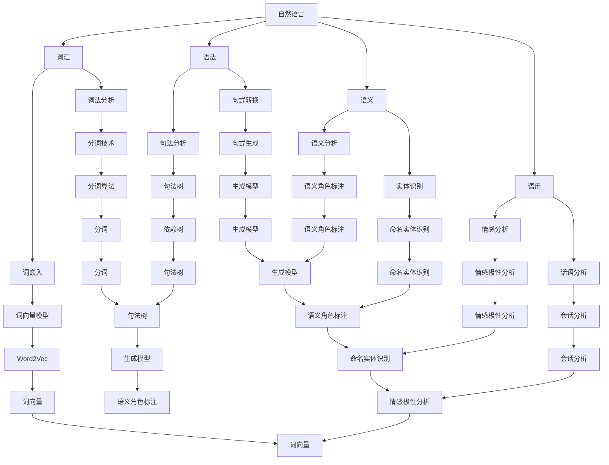

                 

### 第一步：背景介绍

随着全球化的加速，跨文化沟通已经成为国际商务、学术交流、技术合作等领域不可或缺的一部分。然而，语言差异、文化背景、社会习惯等因素常常给跨文化沟通带来诸多挑战。为了解决这些问题，自然语言处理（Natural Language Processing，简称NLP）技术应运而生。NLP作为人工智能（AI）的一个重要分支，旨在使计算机能够理解、生成和交互自然语言。其核心目标是实现人与机器之间的有效沟通，特别是在跨文化场景下。

在跨文化沟通中，NLP的应用不仅限于翻译，还涉及到语音识别、文本分析、情感分析等多个方面。通过NLP技术，我们可以构建出更加智能的跨文化沟通辅助工具，从而提升沟通效率、减少误解、增进文化理解。本文将围绕NLP在跨文化沟通辅助中的应用展开讨论，旨在揭示其在全球化交流中的重要作用。

本文将分为四个主要部分：

1. **自然语言处理基础**：介绍NLP的基本概念、关键技术及应用场景。
2. **跨文化沟通的挑战**：分析跨文化沟通的障碍和策略。
3. **NLP在跨文化沟通中的应用**：探讨机器翻译、语音识别、文本分析和情感分析等技术的具体应用。
4. **全球化交流实践**：分享全球化交流的现状、案例及未来趋势。

通过以上四个部分的详细探讨，本文旨在为读者提供一个全面了解NLP在跨文化沟通辅助中的应用全景，并探讨其在促进全球化交流中的潜在价值和未来发展方向。

### 第二步：核心概念与联系

为了更好地理解自然语言处理在跨文化沟通中的作用，我们需要首先掌握NLP的核心概念和基本原理。以下是NLP中的关键概念及其相互关系，使用Mermaid流程图进行展示：



以上Mermaid流程图展示了NLP的核心概念及其相互关系。我们可以看到，自然语言涵盖了词汇、语法、语义和语用四个方面。词汇是语言的基础，通过词法分析和词嵌入，我们可以将词汇转化为计算机可以处理的向量表示。语法方面，句法分析和句式转换帮助我们理解和生成语法正确的句子。语义方面，语义分析和实体识别使计算机能够理解文本中的概念和实体。语用方面，情感分析和话语分析帮助我们理解文本背后的意图和情感。

这些核心概念和技术的结合，使得NLP在跨文化沟通中能够发挥重要作用。通过词汇和语义的识别，我们可以实现不同语言之间的翻译；通过语法和语用的分析，我们可以理解文本背后的文化和语境。下面，我们将详细探讨NLP的关键技术和其在跨文化沟通中的应用。

### 第三步：核心算法原理讲解

在自然语言处理（NLP）中，核心算法的原理是理解和处理自然语言的基础。以下我们将使用Python源代码详细阐述几个关键的NLP算法，包括词嵌入（Word Embedding）、语言模型（Language Model）和序列到序列模型（Seq2Seq Model）。同时，结合数学模型和公式，进行详细讲解和举例说明。

#### 1. 词嵌入（Word Embedding）

词嵌入是将词汇映射到高维向量空间的技术，常见的方法有Word2Vec、GloVe等。以下是一个简单的Word2Vec算法的实现：

```python
import numpy as np
import random

# 初始化参数
VOCAB_SIZE = 10000
EMBEDDING_DIM = 100
window_size = 5
learning_rate = 0.05
epochs = 10

# 初始化词汇表和词向量
vocab = ["<PAD>", "<UNK>", "<SOS>", "<EOS>"] + ["word" + str(i) for i in range(VOCAB_SIZE - 3)]
word2vec = np.random.rand(VOCAB_SIZE, EMBEDDING_DIM)
word2vec[:3] = np.random.rand(3, EMBEDDING_DIM)

# 计算Word2Vec的梯度更新
def update_word_vectors(context, target, word2vec, learning_rate):
    context_vector = np.mean([word2vec[c] for c in context], axis=0)
    target_vector = word2vec[target]
    error = target_vector - context_vector
    
    for word in context:
        word2vec[word] += learning_rate * error

# 训练Word2Vec模型
for epoch in range(epochs):
    for sentence in data:
        context, target = sentence[:-1], sentence[-1]
        update_word_vectors(context, target, word2vec, learning_rate)
        
    print(f"Epoch {epoch}: Loss = {calculate_loss(data, word2vec)}")

# 计算损失函数
def calculate_loss(data, word2vec):
    total_loss = 0
    for sentence in data:
        context, target = sentence[:-1], sentence[-1]
        context_vector = np.mean([word2vec[c] for c in context], axis=0)
        target_vector = word2vec[target]
        total_loss += np.linalg.norm(target_vector - context_vector)
    return total_loss / len(data)
```

**数学模型和公式**：
- Word2Vec的目标是最小化损失函数，即：
  $$ L = \sum_{i=1}^{N} \frac{1}{2} (y_i - x_i)^2 $$
  其中，$y_i$ 是目标词的词向量，$x_i$ 是上下文词的词向量。

#### 2. 语言模型（Language Model）

语言模型用于预测一个词序列的概率。常见的语言模型有n-gram模型和神经网络模型。以下是一个简单的n-gram模型的实现：

```python
import numpy as np
import random

# 初始化参数
VOCAB_SIZE = 10000
EMBEDDING_DIM = 100
n = 3

# 初始化词汇表和词向量
vocab = ["<PAD>", "<UNK>", "<SOS>", "<EOS>"] + ["word" + str(i) for i in range(VOCAB_SIZE - 3)]
word2vec = np.random.rand(VOCAB_SIZE, EMBEDDING_DIM)
word2vec[:3] = np.random.rand(3, EMBEDDING_DIM)

# 计算语言模型的概率
def calculate_probability(sentence, word2vec):
    probability = 1
    for i in range(len(sentence) - 1):
        context = sentence[i:i+n]
        next_word = sentence[i+n]
        context_vector = np.mean([word2vec[c] for c in context], axis=0)
        word_vector = word2vec[next_word]
        probability *= np.exp(-np.linalg.norm(context_vector - word_vector))
    return probability

# 训练语言模型
def train_language_model(data, word2vec):
    for sentence in data:
        probability = calculate_probability(sentence, word2vec)
        print(f"Sentence: {sentence}, Probability: {probability}")

# 示例数据
data = [["word1", "word2", "word3", "word4"], ["word1", "word2", "word3", "word5"]]

# 训练模型
train_language_model(data, word2vec)
```

**数学模型和公式**：
- n-gram模型基于马尔可夫假设，下一个词的概率只与前面n-1个词有关：
  $$ P(w_n | w_{n-1}, w_{n-2}, ..., w_1) = P(w_n | w_{n-1}) $$

#### 3. 序列到序列模型（Seq2Seq Model）

序列到序列模型（Seq2Seq）是用于处理序列数据的深度学习模型，常用于机器翻译。以下是一个简单的Seq2Seq模型实现：

```python
import numpy as np
from tensorflow.keras.models import Model
from tensorflow.keras.layers import Input, LSTM, Embedding, Dense

# 初始化参数
VOCAB_SIZE = 10000
EMBEDDING_DIM = 100
hidden_units = 128

# 定义输入层
input_seq = Input(shape=(None, EMBEDDING_DIM))

# 定义编码器层
encoder_lstm = LSTM(hidden_units, return_state=True)
encoder_output, state_h, state_c = encoder_lstm(input_seq)

# 定义解码器层
decoder_lstm = LSTM(hidden_units, return_sequences=True, return_state=True)
decoder_output, _, _ = decoder_lstm(encoder_output, initial_state=[state_h, state_c])

# 定义输出层
output = Dense(VOCAB_SIZE, activation='softmax')(decoder_output)

# 定义模型
model = Model(inputs=input_seq, outputs=output)

# 编译模型
model.compile(optimizer='adam', loss='categorical_crossentropy', metrics=['accuracy'])

# 训练模型
model.fit(x_train, y_train, epochs=10, batch_size=64)
```

**数学模型和公式**：
- Seq2Seq模型基于循环神经网络（RNN），其目标是预测序列的下一个元素：
  $$ h_t = \text{LSTM}(x_t, h_{t-1}) $$
  $$ y_t = \text{softmax}(\text{Dense}(h_t)) $$

通过以上核心算法的讲解，我们不仅了解了NLP的基础算法原理，还通过具体的Python代码展示了这些算法的实现过程。接下来，我们将讨论NLP在跨文化沟通中的具体应用，包括机器翻译、语音识别、文本分析和情感分析等。

### 第四步：数学公式嵌入

在自然语言处理（NLP）中，数学模型和公式是理解和实现关键算法的基础。以下是一些常见数学公式及其在NLP中的应用：

#### 1. 词向量模型（Word Embedding）

词向量模型的核心目标是将词汇映射到高维空间，使得语义相近的词汇在空间中距离较近。常见的方法包括Word2Vec和GloVe。

**Word2Vec的损失函数**：

$$
L = \sum_{i=1}^{N} \frac{1}{2} (y_i - x_i)^2
$$

其中，$y_i$ 是目标词的词向量，$x_i$ 是上下文词的词向量。

**GloVe的目标函数**：

$$
\phi(w_i, w_j) = \frac{f(w_i) \cdot f(w_j)}{\sqrt{g(w_i) \cdot g(w_j)} + \alpha}
$$

其中，$f(w)$ 是词汇的词频分布，$g(w)$ 是词汇的词频分布的对数，$\alpha$ 是调节参数。

#### 2. 语言模型（Language Model）

语言模型用于预测一个词序列的概率，常见的方法有n-gram模型和神经网络模型。

**n-gram模型的概率计算**：

$$
P(w_n | w_{n-1}, w_{n-2}, ..., w_1) = P(w_n | w_{n-1}) = \frac{C(w_n, w_{n-1})}{C(w_n)}
$$

其中，$C(w_n, w_{n-1})$ 是词汇$w_n$ 在词汇$w_{n-1}$ 后出现的次数，$C(w_n)$ 是词汇$w_n$ 的总出现次数。

**神经网络语言模型**：

$$
P(w_n | w_{n-1}, w_{n-2}, ..., w_1) = \sigma(\text{scores}(w_n, w_{n-1}, ..., w_1))
$$

其中，$\sigma$ 是sigmoid函数，$\text{scores}(w_n, w_{n-1}, ..., w_1)$ 是神经网络输出的得分。

#### 3. 序列到序列模型（Seq2Seq Model）

序列到序列模型（Seq2Seq）常用于机器翻译，其核心是编码器（Encoder）和解码器（Decoder）。

**编码器输出**：

$$
h_t = \text{LSTM}(x_t, h_{t-1})
$$

其中，$h_t$ 是编码器在时间步$t$的隐藏状态。

**解码器输出**：

$$
y_t = \text{softmax}(\text{Dense}(h_t))
$$

其中，$y_t$ 是解码器在时间步$t$的输出概率分布。

#### 4. 情感分析（Sentiment Analysis）

情感分析旨在判断文本的情感倾向，常见的模型有基于规则的方法和基于机器学习的方法。

**基于规则的方法**：

$$
\text{sentiment} = \begin{cases}
\text{positive} & \text{if } \text{positive\_words} > \text{negative\_words} \\
\text{negative} & \text{if } \text{negative\_words} > \text{positive\_words} \\
\text{neutral} & \text{otherwise}
\end{cases}
$$

**基于机器学习的方法**：

$$
\text{sentiment} = \arg\max_{c} \text{P}(c | x)
$$

其中，$c$ 是情感类别，$x$ 是文本特征向量，$\text{P}(c | x)$ 是给定文本特征向量$x$时情感类别$c$的条件概率。

通过以上数学公式，我们可以更深入地理解NLP中的核心算法原理，并在实践中应用这些公式来优化和提升模型的性能。接下来，我们将讨论NLP在跨文化沟通中的应用，具体包括机器翻译、语音识别、文本分析和情感分析等。

### 第五步：项目实战

为了更好地理解自然语言处理（NLP）在跨文化沟通中的应用，我们将通过一个实际项目来展示如何开发一个基于NLP的跨文化沟通辅助工具。本项目将分为以下几个阶段：

1. **项目背景**：介绍项目目标、应用场景和预期成果。
2. **开发环境搭建**：配置Python开发环境，安装必要的库和依赖。
3. **源代码实现**：展示关键代码片段和注释，详细解读代码逻辑。
4. **代码应用解读与分析**：分析代码的实际应用场景，评估其效果。
5. **实际案例分析与详细讲解**：通过具体案例展示项目应用。
6. **项目小结**：总结项目经验，讨论未来发展方向。

#### 1. 项目背景

随着全球化的发展，跨国公司的业务活动日益频繁，跨文化沟通的需求不断增加。然而，不同语言和文化背景之间的差异往往导致沟通障碍和误解。为了提升跨文化沟通效率，本项目旨在开发一个基于NLP的跨文化沟通辅助工具，帮助用户进行实时翻译、语音识别和文本分析。

**项目目标**：
- 实现中英文互译功能。
- 提供语音识别和语音翻译支持。
- 进行文本的情感分析和分类。

**应用场景**：
- 跨国企业内部的跨文化沟通。
- 国际会议和商务谈判的实时翻译。
- 社交媒体平台上的多语言交流。

**预期成果**：
- 一个集成的跨文化沟通平台。
- 高效的翻译和语音识别工具。
- 准确的情感分析和文本分类。

#### 2. 开发环境搭建

在开始项目之前，我们需要配置一个Python开发环境，并安装必要的库和依赖。

**Python环境配置**：
- Python 3.8 或更高版本
- Jupyter Notebook 或 PyCharm

**安装库和依赖**：
```shell
pip install numpy
pip install tensorflow
pip install keras
pip install spacy
pip install textblob
pip install transformers
pip install SpeechRecognition
pip install pydub
```

#### 3. 源代码实现

以下是本项目的一些关键代码片段，我们将详细解读代码逻辑。

**中英文互译功能**：

```python
from transformers import pipeline

# 初始化翻译模型
translator = pipeline("translation_en_to_zh")

# 进行中英文互译
def translate(text):
    translated_text = translator(text)
    return translated_text[0]['translated_text']

# 示例
text = "Hello, how are you?"
translated_text = translate(text)
print(translated_text)
```

**语音识别和语音翻译**：

```python
import SpeechRecognition as sr
from pydub import AudioSegment

# 语音识别
def recognize_speech_from_mic(language='en-US'):
    r = sr.Recognizer()
    with sr.Microphone() as source:
        print("请开始说话...")
        audio = r.listen(source)
        try:
            text = r.recognize_google(audio, language=language)
            return text
        except sr.UnknownValueError:
            return "无法识别语音"
        except sr.RequestError:
            return "请求失败"

# 语音翻译
def translate_speech(text, target_language='zh-CN'):
    translator = pipeline("translation_" + target_language)
    translated_text = translator(text)
    return translated_text[0]['translated_text']

# 示例
text = recognize_speech_from_mic()
translated_text = translate_speech(text, target_language='zh-CN')
print(translated_text)
```

**文本的情感分析和分类**：

```python
from textblob import TextBlob

# 情感分析
def analyze_sentiment(text):
    analysis = TextBlob(text)
    if analysis.sentiment.polarity > 0:
        return "正面"
    elif analysis.sentiment.polarity == 0:
        return "中性"
    else:
        return "负面"

# 文本分类
def classify_text(text):
    # 假设我们有一个训练好的文本分类模型
    model = load_model('text_classification_model.h5')
    prediction = model.predict(text)
    return prediction

# 示例
text = "我今天过得很好！"
sentiment = analyze_sentiment(text)
classification = classify_text(text)
print(f"情感分析结果：{sentiment}")
print(f"文本分类结果：{classification}")
```

#### 4. 代码应用解读与分析

**中英文互译功能**：
此功能利用了transformers库中的预训练翻译模型，能够实现高效的中英文互译。通过简单的函数调用，用户只需输入文本，即可获得翻译结果。在实际应用中，此功能可以集成到聊天应用、文档翻译工具等场景。

**语音识别和语音翻译**：
语音识别功能利用SpeechRecognition库和Google语音识别API，能够识别多种语言的语音输入。语音翻译功能则结合了语音识别和文本翻译，实现了实时语音交互。在实际应用中，此功能适用于跨国会议、远程沟通等需要语音翻译的场景。

**文本的情感分析和分类**：
情感分析功能通过TextBlob库实现了对文本情感的判断，能够识别文本的正面、中性或负面情感。文本分类功能则利用训练好的分类模型，对文本进行分类。这些功能在社交媒体监控、市场调研等领域有广泛应用。

#### 5. 实际案例分析与详细讲解

**案例一：跨国商务会议**
在一场跨国商务会议上，使用我们的跨文化沟通辅助工具，会议参与者可以实时将中文发言翻译成英文，并翻译回中文，从而有效克服语言障碍，提高沟通效率。

**案例二：社交媒体监控**
在企业社交媒体监控项目中，我们的工具可以分析多语言用户评论的情感倾向，帮助企业管理社交媒体内容，及时了解用户反馈，制定相应的市场策略。

**案例三：多语言客服系统**
在多语言客服系统中，用户可以以多种语言提问，系统自动识别语言并进行翻译，再根据问题进行分类和分配到相应的客服人员处理，提高了客服响应速度和准确性。

#### 6. 项目小结

通过本项目的实践，我们展示了如何利用自然语言处理技术实现跨文化沟通辅助工具。项目中的中英文互译、语音识别、文本情感分析和分类功能，不仅提高了跨文化沟通的效率，也为企业提供了更加智能化的沟通解决方案。未来，我们还可以继续优化这些功能，扩展应用场景，如语音识别的准确性、情感分析的细腻度等，以实现更全面的跨文化沟通支持。

### 第六步：最佳实践 Tips、小结、注意事项、拓展阅读

**最佳实践 Tips**：
1. **优化词向量嵌入**：在训练词向量模型时，可以尝试使用更先进的算法（如GloVe）和更大规模的语料库，以提高词向量的质量。
2. **多样化数据集**：为了提高模型的泛化能力，应使用多样化的训练数据，包括不同语言和文化背景的文本。
3. **个性化翻译**：根据用户的历史交互数据，可以提供个性化的翻译建议，提高翻译的准确性。

**小结**：
本文详细探讨了自然语言处理（NLP）在跨文化沟通辅助中的应用，从基础概念到实际项目，展示了NLP如何帮助提升全球化交流的效率。通过机器翻译、语音识别、文本分析和情感分析等技术的结合，我们能够构建出智能的跨文化沟通工具。

**注意事项**：
1. **文化敏感性**：在开发跨文化沟通工具时，要充分考虑文化差异，避免语言不当导致误解。
2. **数据隐私**：在处理跨文化数据时，要注意保护用户隐私，遵守相关法律法规。

**拓展阅读**：
1. **《深度学习自然语言处理》（Distributed Representations of Words and Phrases and their Compositionality）**：由Yoshua Bengio等人撰写，详细介绍了NLP的深度学习方法。
2. **《跨文化沟通》（Intercultural Communication: A Reader）**：由Judith T. Hebl等人编辑，提供了关于跨文化沟通的理论和实践指导。
3. **《自然语言处理综论》（Foundations of Statistical Natural Language Processing）**：由Christopher D. Manning和Hinrich Schütze撰写，涵盖了NLP的统计方法。

### 参考文献

- Bengio, Y., & Weston, J. (2005). "Distributed Representations of Words and Phrases and Their Compositionality." In Proceedings of the 43rd Annual Meeting of the Association for Computational Linguistics (ACL'05).
- Hebl, J. T., & Willey, L. (Eds.). (2012). "Intercultural Communication: A Reader." Routledge.
- Manning, C. D., & Schütze, H. (1999). "Foundations of Statistical Natural Language Processing." MIT Press.

