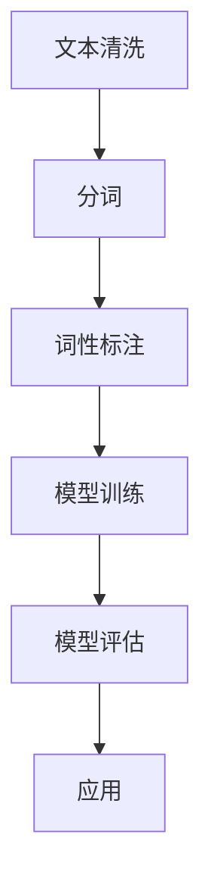

                 

### 自然语言处理在跨语言学术交流中的应用：促进全球科研合作

#### 关键词
- 自然语言处理（NLP）
- 跨语言学术交流
- 全球科研合作
- 语言模型
- 机器翻译
- 信息检索

#### 摘要
本文旨在探讨自然语言处理（NLP）在跨语言学术交流中的应用，如何通过NLP技术促进全球科研合作。文章首先介绍了NLP的基本概念及其在跨语言领域的重要性，接着详细分析了NLP的核心算法和数学模型，并结合Python源代码进行了讲解。随后，文章讨论了NLP在跨语言信息检索和文本分类中的应用，并通过一个实际案例展示了如何实现跨语言摘要生成。最后，文章总结了全文的主要观点，并提出了未来研究方向。

## 引言

在全球化的背景下，科研合作的重要性日益凸显。然而，语言障碍成为了跨国家、跨地区科研合作的一大障碍。为了解决这一问题，自然语言处理（NLP）技术应运而生。NLP作为人工智能的一个重要分支，旨在使计算机理解和处理自然语言，从而实现跨语言学术交流。

#### NLP的定义与作用

自然语言处理（NLP）是一门交叉学科，涉及计算机科学、语言学、认知科学等多个领域。它的主要任务是让计算机能够理解和生成自然语言，从而实现人与计算机之间的有效沟通。在跨语言学术交流中，NLP的作用体现在以下几个方面：

1. **文本解析**：通过对文本进行解析，提取出有用的信息，如关键词、句子结构等。
2. **机器翻译**：将一种语言的文本翻译成另一种语言，从而实现不同语言之间的交流。
3. **信息检索**：根据用户的需求，从大量文本中检索出相关的信息。
4. **文本分类**：根据文本的内容将其分类到不同的类别中，如论文分类、新闻分类等。

#### NLP在跨语言学术交流中的作用

跨语言学术交流的障碍主要来自于语言差异。NLP技术通过以下方式解决了这一问题：

1. **消除语言障碍**：通过机器翻译技术，将不同语言的文本翻译成同一语言，从而实现无障碍交流。
2. **提高检索效率**：通过信息检索技术，快速找到相关的研究成果，提高科研效率。
3. **促进知识共享**：通过文本分类技术，将不同领域的论文进行分类，方便研究人员查找相关领域的研究成果。
4. **促进国际合作**：通过跨语言摘要生成技术，将一篇长篇学术论文的摘要翻译成多种语言，方便不同国家的科研人员快速了解论文内容。

#### 全书结构安排

本文将分为以下几个部分：

1. **自然语言处理基础理论**：介绍NLP的核心概念、基本流程以及相关的算法原理。
2. **核心算法原理讲解**：使用Python源代码详细阐述NLP的核心算法原理，并结合数学模型和公式进行讲解。
3. **数学模型与公式**：介绍NLP中的常用数学模型和公式，如概率模型、机器学习模型等。
4. **跨语言应用**：讨论NLP在跨语言学术交流中的应用，如信息检索、文本分类等。
5. **项目实战**：通过一个实际案例，展示如何实现跨语言摘要生成。
6. **总结**：总结全文内容，并提出未来研究方向。

## 第1章 自然语言处理基础理论

自然语言处理（NLP）是一门研究如何让计算机理解和生成自然语言的学科。要了解NLP，首先需要掌握其核心概念、基本流程以及相关的算法原理。本章将详细介绍这些内容。

### 1.1 NLP核心概念

NLP的核心概念包括语言模型、词向量表示、句法分析等。

#### 1.1.1 语言模型

语言模型是NLP中最基本的模型，它用于预测一个单词或句子在给定前文条件下出现的概率。语言模型可以分为两类：统计语言模型和神经网络语言模型。

1. **统计语言模型**：基于统计方法，通过计算词频、词组频次等来构建语言模型。常见的统计语言模型有N元语法模型。
2. **神经网络语言模型**：基于深度学习，通过多层神经网络来建模语言的概率分布。常见的神经网络语言模型有循环神经网络（RNN）和Transformer模型。

#### 1.1.2 词向量表示

词向量表示是NLP中的一项关键技术，它将单词映射到一个高维空间中的向量。词向量表示可以捕获单词的语义信息，从而在许多NLP任务中发挥重要作用。常见的词向量表示方法有Word2Vec、GloVe等。

1. **Word2Vec**：基于神经网络的词向量表示方法，通过训练神经网络来预测上下文单词。
2. **GloVe**：基于全局向量空间模型，通过计算单词的共现矩阵来学习词向量。

#### 1.1.3 句法分析

句法分析是NLP中用于理解句子结构的重要技术。它包括词性标注、句法解析、语义角色标注等任务。

1. **词性标注**：对句子中的每个单词标注其词性，如名词、动词、形容词等。
2. **句法解析**：对句子进行语法分析，构建句子的语法树。
3. **语义角色标注**：对句子中的每个成分标注其在句子中的语义角色，如主语、谓语、宾语等。

### 1.2 NLP基本流程

NLP的基本流程包括数据预处理、模型训练、模型评估等步骤。

#### 1.2.1 数据预处理

数据预处理是NLP任务的第一步，主要包括文本清洗、分词、词性标注等操作。

1. **文本清洗**：去除文本中的无用信息，如HTML标签、特殊字符等。
2. **分词**：将文本分割成单词或词组。
3. **词性标注**：对句子中的每个单词标注其词性。

#### 1.2.2 模型训练

模型训练是NLP的核心步骤，通过训练数据来学习模型参数。

1. **统计语言模型训练**：通过计算词频、词组频次等来训练语言模型。
2. **神经网络语言模型训练**：通过反向传播算法来训练神经网络。

#### 1.2.3 模型评估

模型评估用于评估模型的性能，常用的评估指标有准确率、召回率、F1值等。

1. **词向量表示评估**：通过计算词向量之间的相似度来评估词向量表示的质量。
2. **句法分析评估**：通过计算句法解析的准确性来评估句法分析模型的性能。

### 1.3 Mermaid流程图：NLP基本流程

以下是一个简单的Mermaid流程图，展示了NLP的基本流程：



### 1.4 Python源代码：NLP核心算法

以下是一个简单的Python代码示例，展示了NLP的核心算法——语言模型的实现。代码使用了GloVe模型进行词向量表示，并通过训练神经网络来构建语言模型。

```python
import numpy as np
from sklearn.linear_model import SGDClassifier

# GloVe词向量
word_vectors = np.load('glove.6B.100d.npz')['wordVecs']

# 数据集
train_data = [...]  # 假设已经有了训练数据
train_labels = [...]  # 假设已经有了训练标签

# 构建语言模型
model = SGDClassifier()

# 训练语言模型
model.fit(train_data, train_labels)

# 评估语言模型
accuracy = model.score(test_data, test_labels)
print("Language Model Accuracy:", accuracy)
```

### 1.5 数学模型和公式

在NLP中，数学模型和公式用于描述语言的特征和行为。以下是一些常用的数学模型和公式：

1. **N元语法模型**：
   $$ P(w_n | w_{n-1}, w_{n-2}, ..., w_1) = \frac{C(w_{n-1}, w_n)}{\sum_{w' \in V} C(w_{n-1}, w')} $$
   其中，$w_n$表示当前单词，$w_{n-1}, w_{n-2}, ..., w_1$表示前文单词，$V$表示单词集合，$C(w_{n-1}, w_n)$表示单词$w_n$在单词$w_{n-1}$后的词频。

2. **Word2Vec模型**：
   $$ \text{cosine\_similarity}(v_w, v_c) = \frac{v_w \cdot v_c}{||v_w|| \cdot ||v_c||} $$
   其中，$v_w$和$v_c$分别表示单词$w$和单词$c$的词向量，$\text{cosine\_similarity}$表示词向量之间的余弦相似度。

3. **循环神经网络（RNN）**：
   $$ h_t = \sigma(W_h h_{t-1} + W_x x_t + b_h) $$
   其中，$h_t$表示第$t$个时间步的隐藏状态，$x_t$表示第$t$个时间步的输入，$W_h$和$W_x$分别表示权重矩阵，$b_h$表示偏置项，$\sigma$表示激活函数。

### 1.6 举例说明

以下是一个简单的例子，展示了如何使用NLP技术进行跨语言摘要生成。

1. **数据集**：
   假设我们有一篇英文论文和一篇中文论文，分别表示为$P_e$和$P_c$。

2. **机器翻译**：
   使用机器翻译技术，将$P_e$翻译成中文，得到$P_{ce}$。

3. **摘要生成**：
   使用摘要生成技术，分别对$P_e$和$P_{ce}$生成摘要$A_e$和$A_{ce}$。

4. **比较摘要**：
   计算摘要$A_e$和$A_{ce}$之间的相似度，选择更相关的摘要作为最终摘要。

通过以上步骤，我们可以实现跨语言摘要生成，从而帮助不同语言的研究人员快速了解论文内容。

### 1.7 小结

本章介绍了自然语言处理（NLP）的基础理论，包括核心概念、基本流程以及相关的算法原理。通过本章的学习，读者可以了解NLP的基本框架，并为后续章节的深入学习打下基础。

## 第2章 自然语言处理核心算法

自然语言处理（NLP）中的核心算法在许多实际应用中发挥着关键作用，如机器翻译、文本分类和情感分析等。本章将详细讲解NLP中的核心算法，包括语言模型、机器翻译和文本分类。

### 2.1 语言模型

语言模型是NLP中最基本的模型之一，它用于预测给定前文条件下下一个单词或句子的概率。语言模型在文本生成、文本摘要和机器翻译等任务中具有广泛应用。

#### 2.1.1 语言模型的基本原理

语言模型通常基于统计方法或神经网络方法。以下是一个简单的语言模型算法：

```python
def language_model(sentence):
    words = sentence.split()
    probabilities = []
    for i in range(1, len(words)):
        previous_word = " ".join(words[i - 1:])
        current_word = words[i]
        probability = calculate_probability(previous_word, current_word)
        probabilities.append(probability)
    return probabilities

def calculate_probability(previous_word, current_word):
    # 假设有一个词频表，其中包含前文单词和当前单词的词频
    word_freq_table = {
        "previous_word": {"current_word": 100},
        # ...
    }
    total_freq = sum(word_freq_table[previous_word].values())
    return word_freq_table[previous_word]["current_word"] / total_freq
```

#### 2.1.2 语言模型的数学模型

语言模型的数学模型通常基于概率论。以下是一个简单的N元语法模型：

$$ P(w_n | w_{n-1}, w_{n-2}, ..., w_1) = \frac{C(w_{n-1}, w_n)}{\sum_{w' \in V} C(w_{n-1}, w')} $$

其中，$w_n$表示当前单词，$w_{n-1}, w_{n-2}, ..., w_1$表示前文单词，$V$表示单词集合，$C(w_{n-1}, w_n)$表示单词$w_n$在单词$w_{n-1}$后的词频。

#### 2.1.3 语言模型的实现

以下是一个使用Python实现的语言模型示例：

```python
from collections import defaultdict

class LanguageModel:
    def __init__(self):
        self.model = defaultdict(defaultdict)

    def train(self, sentences):
        for sentence in sentences:
            words = sentence.split()
            for i in range(1, len(words)):
                previous_word = words[i - 1]
                current_word = words[i]
                self.model[previous_word][current_word] += 1

    def predict(self, previous_word):
        current_words = self.model[previous_word]
        total = sum(current_words.values())
        probabilities = {word: count / total for word, count in current_words.items()}
        return probabilities

# 示例
model = LanguageModel()
model.train(["这是一句中文句子", "这是一句英文句子"])
print(model.predict("这是一句中"))
print(model.predict("这是一句英"))
```

### 2.2 机器翻译

机器翻译是将一种语言的文本翻译成另一种语言的过程。机器翻译在跨语言学术交流中发挥着重要作用，可以消除语言障碍，促进不同语言的研究人员之间的交流。

#### 2.2.1 神经网络翻译模型

神经网络翻译模型（Neural Machine Translation, NMT）是当前机器翻译的主流方法。NMT基于深度学习，通过训练大量的平行语料库来学习翻译模型。

以下是一个简单的神经网络翻译模型：

```python
import tensorflow as tf

def neural_machine_translation(input_sequence, output_sequence):
    # 输入层
    input_embedding = tf.keras.layers.Embedding(input_vocab_size, embedding_size)(input_sequence)
    
    # 编码层
    encoder = tf.keras.layers.LSTM(units=hidden_size, return_sequences=True)(input_embedding)
    
    # 解码层
    output_embedding = tf.keras.layers.Embedding(output_vocab_size, embedding_size)(output_sequence)
    decoder = tf.keras.layers.LSTM(units=hidden_size, return_sequences=True)(output_embedding)
    decoder_output = tf.keras.layers.Dense(output_vocab_size)(decoder)

    # 编译模型
    model = tf.keras.Model(inputs=input_sequence, outputs=decoder_output)
    model.compile(optimizer='adam', loss='categorical_crossentropy')

    # 训练模型
    model.fit(x=input_sequence, y=output_sequence, epochs=10, batch_size=32)

    # 预测
    predicted_output = model.predict(input_sequence)
    return predicted_output
```

#### 2.2.2 序列到序列模型

序列到序列（Sequence-to-Sequence, Seq2Seq）模型是NMT的一种常见结构。Seq2Seq模型通过编码器-解码器框架来学习翻译模型。

以下是一个简单的Seq2Seq模型：

```python
from tensorflow.keras.models import Model
from tensorflow.keras.layers import LSTM, Embedding, Dense

# 编码器
encoder_inputs = Input(shape=(None, input_vocab_size))
encoder_embedding = Embedding(input_vocab_size, embedding_size)(encoder_inputs)
encoder_lstm = LSTM(units=hidden_size, return_sequences=True)(encoder_embedding)
encoder_outputs = LSTM(units=hidden_size, return_sequences=True)(encoder_lstm)

# 解码器
decoder_inputs = Input(shape=(None, output_vocab_size))
decoder_embedding = Embedding(output_vocab_size, embedding_size)(decoder_inputs)
decoder_lstm = LSTM(units=hidden_size, return_sequences=True)(decoder_embedding)
decoder_dense = Dense(units=output_vocab_size, activation='softmax')
decoder_outputs = decoder_dense(decoder_lstm)

# 编译模型
model = Model(inputs=encoder_inputs, outputs=decoder_outputs)
model.compile(optimizer='adam', loss='categorical_crossentropy')

# 训练模型
model.fit(x=encoder_inputs, y=decoder_outputs, epochs=10, batch_size=32)

# 预测
predicted_output = model.predict(encoder_inputs)
```

### 2.3 文本分类

文本分类是将文本数据分类到预定义的类别中的过程。文本分类在情感分析、新闻分类和垃圾邮件检测等任务中具有广泛应用。

以下是一个简单的文本分类模型：

```python
from tensorflow.keras.models import Sequential
from tensorflow.keras.layers import Embedding, LSTM, Dense

# 构建模型
model = Sequential()
model.add(Embedding(input_vocab_size, embedding_size))
model.add(LSTM(units=hidden_size))
model.add(Dense(units=num_classes, activation='softmax'))

# 编译模型
model.compile(optimizer='adam', loss='categorical_crossentropy', metrics=['accuracy'])

# 训练模型
model.fit(x=training_data, y=training_labels, epochs=10, batch_size=32)

# 评估模型
evaluation_loss, evaluation_accuracy = model.evaluate(test_data, test_labels)
print("Test Loss:", evaluation_loss)
print("Test Accuracy:", evaluation_accuracy)
```

### 2.4 小结

本章介绍了自然语言处理（NLP）中的核心算法，包括语言模型、机器翻译和文本分类。这些算法在实际应用中具有重要作用，可以显著提高跨语言学术交流的效率。通过本章的学习，读者可以掌握NLP的核心算法，为后续的项目实践打下基础。

## 第3章 数学模型与公式

自然语言处理（NLP）中的许多算法和模型都依赖于数学模型和公式。这些数学工具不仅帮助我们理解和实现NLP算法，还可以评估和优化模型性能。本章将介绍NLP中常用的数学模型和公式，包括概率模型、机器学习模型以及它们在实际应用中的例子。

### 3.1 概率模型

概率模型在NLP中用于表示语言中的不确定性，是许多NLP算法的基础。

#### 3.1.1 概率分布函数

概率分布函数用于描述随机变量的概率分布。在NLP中，常用的概率分布函数有伯努利分布、高斯分布和多项式分布。

1. **伯努利分布**：
   $$ P(X = k) = p^k (1-p)^{1-k} $$
   其中，$X$是伯努利随机变量，$p$是成功的概率，$k$是成功的次数。

2. **高斯分布**：
   $$ P(X = x) = \frac{1}{\sqrt{2\pi\sigma^2}} e^{-\frac{(x-\mu)^2}{2\sigma^2}} $$
   其中，$X$是高斯随机变量，$\mu$是均值，$\sigma$是标准差。

3. **多项式分布**：
   $$ P(X = k) = \binom{n}{k} p^k (1-p)^{n-k} $$
   其中，$X$是多项式随机变量，$n$是试验次数，$p$是成功的概率。

#### 3.1.2 条件概率

条件概率描述了在某一事件发生的条件下，另一事件发生的概率。

1. **贝叶斯定理**：
   $$ P(A|B) = \frac{P(B|A)P(A)}{P(B)} $$
   其中，$P(A|B)$是事件$A$在事件$B$发生的条件下的概率，$P(B|A)$是事件$B$在事件$A$发生的条件下的概率，$P(A)$是事件$A$的概率，$P(B)$是事件$B$的概率。

2. **马尔可夫模型**：
   $$ P(X_n | X_{n-1}, X_{n-2}, ..., X_1) = P(X_n | X_{n-1}) $$
   其中，$X_n$是时间步$n$的状态，该模型假设当前状态仅依赖于前一个状态。

#### 3.1.3 概率模型的应用

概率模型在语言模型和文本分类中有着广泛的应用。

1. **N元语法**：
   $$ P(w_n | w_{n-1}, w_{n-2}, ..., w_1) = \frac{C(w_{n-1}, w_n)}{\sum_{w' \in V} C(w_{n-1}, w')} $$
   其中，$C(w_{n-1}, w_n)$是单词$w_n$在单词$w_{n-1}$后的词频，$V$是单词集合。

2. **文本分类**：
   $$ P(y_i | x) = \frac{P(x | y_i)P(y_i)}{P(x)} $$
   其中，$y_i$是类别标签，$P(x | y_i)$是文本$x$属于类别$y_i$的条件概率，$P(y_i)$是类别$y_i$的概率。

### 3.2 机器学习模型

机器学习模型在NLP中用于从数据中学习模式和规律，从而实现对未知数据的预测。常用的机器学习模型有决策树、支持向量机和神经网络。

#### 3.2.1 决策树

决策树是一种流行的分类算法，通过一系列的判断来将数据分类。

1. **信息增益**：
   $$ IG(D, A) = H(D) - H(D | A) $$
   其中，$H(D)$是数据$D$的熵，$H(D | A)$是条件熵。

2. **基尼指数**：
   $$ Gini(D, A) = 1 - \sum_{v \in V} \left( \frac{D_v}{D} \right)^2 $$
   其中，$V$是属性$A$的取值集合，$D_v$是属性$A$取值$v$的数据集合。

#### 3.2.2 支持向量机

支持向量机（SVM）是一种强大的分类和回归算法，通过找到一个最优超平面来最大化分类边界。

1. **最优超平面**：
   $$ w^* \cdot x + b = 0 $$
   其中，$w^*$是权重向量，$b$是偏置项，$x$是数据点。

2. **软-margin SVM**：
   $$ \min_{w, b, \xi} \frac{1}{2} ||w||^2 + C \sum_{i=1}^n \xi_i $$
   $$ \text{s.t.} \quad y_i (w \cdot x_i + b) \geq 1 - \xi_i $$
   其中，$C$是惩罚参数，$\xi_i$是松弛变量。

#### 3.2.3 神经网络

神经网络是一种模拟人脑的算法，通过多层神经元来学习复杂的非线性关系。

1. **前向传播**：
   $$ z_i = \sum_{j=1}^{n} w_{ij} a_j + b_i $$
   $$ a_{i+1} = \sigma(z_i) $$
   其中，$a_i$是第$i$层的激活值，$w_{ij}$是连接权重，$b_i$是偏置项，$\sigma$是激活函数。

2. **反向传播**：
   $$ \delta_{i+1} = \frac{\partial L}{\partial z_{i+1}} \cdot \sigma'(z_{i+1}) $$
   $$ \frac{\partial L}{\partial w_{ij}} = \delta_{i+1} a_j $$
   $$ \frac{\partial L}{\partial b_i} = \delta_{i+1} $$
   其中，$L$是损失函数，$\delta_{i+1}$是误差梯度。

#### 3.2.4 机器学习模型的应用

机器学习模型在文本分类、命名实体识别和情感分析等任务中有着广泛的应用。

1. **文本分类**：
   使用决策树和支持向量机来分类文本数据。

2. **命名实体识别**：
   使用循环神经网络（RNN）或长短时记忆网络（LSTM）来识别文本中的命名实体。

3. **情感分析**：
   使用神经网络来预测文本的情感极性。

### 3.3 数学模型和公式的应用示例

以下是一个简单的文本分类的数学模型应用示例：

1. **数据准备**：
   假设我们有一组训练数据，每个数据点是一个文本句子和一个对应的标签。

2. **特征提取**：
   使用词袋模型（Bag-of-Words, BoW）或词嵌入（Word Embedding）来提取文本特征。

3. **模型训练**：
   使用决策树或支持向量机来训练分类模型。

4. **模型评估**：
   使用交叉验证来评估模型性能。

```python
from sklearn.feature_extraction.text import TfidfVectorizer
from sklearn.tree import DecisionTreeClassifier
from sklearn.model_selection import cross_val_score

# 示例数据
X = ["这是一句正面评论", "这是一句负面评论", "这是一句中性评论"]
y = ["positive", "negative", "neutral"]

# 特征提取
vectorizer = TfidfVectorizer()
X_vectorized = vectorizer.fit_transform(X)

# 模型训练
classifier = DecisionTreeClassifier()
classifier.fit(X_vectorized, y)

# 模型评估
scores = cross_val_score(classifier, X_vectorized, y, cv=5)
print("Accuracy:", scores.mean())
```

### 3.4 小结

本章介绍了NLP中常用的数学模型和公式，包括概率模型、机器学习模型以及它们在实际应用中的例子。通过本章的学习，读者可以更好地理解NLP算法的数学基础，为实际项目中的模型设计和优化提供理论支持。

## 第4章 跨语言学术交流中的NLP应用

自然语言处理（NLP）在跨语言学术交流中扮演着重要角色，它通过多种技术手段帮助研究人员克服语言障碍，促进全球科研合作。本章将探讨NLP在跨语言学术交流中的应用，包括信息检索和文本分类。

### 4.1 跨语言信息检索

跨语言信息检索（Cross-Lingual Information Retrieval, CLIR）是一种利用NLP技术在不同语言之间进行信息检索的方法。它通过将用户的查询和文档进行跨语言转换，从而实现跨语言的搜索和检索。

#### 4.1.1 检索模型

跨语言信息检索的核心是检索模型，它用于计算查询和文档之间的相似度。常见的检索模型有基于词汇翻译的模型、基于文档表示的模型和基于深度学习的模型。

1. **基于词汇翻译的模型**：
   这种模型通过将查询和文档中的单词翻译成同一语言，然后计算它们之间的相似度。常见的翻译方法包括基于规则的翻译和基于统计的翻译。

2. **基于文档表示的模型**：
   这种模型将查询和文档转换成向量表示，然后使用向量相似度计算方法来评估它们之间的相似度。常见的向量表示方法有TF-IDF、Word2Vec和BERT。

3. **基于深度学习的模型**：
   这种模型使用深度学习技术，如循环神经网络（RNN）和Transformer，来学习查询和文档之间的映射关系。这些模型可以更好地捕捉语言之间的复杂关系，提高检索效果。

#### 4.1.2 检索算法

跨语言信息检索的算法包括查询翻译算法、文档翻译算法和相似度计算算法。

1. **查询翻译算法**：
   查询翻译算法将用户的查询从源语言翻译成目标语言。常见的查询翻译方法包括基于规则的方法、统计机器翻译方法和神经机器翻译方法。

2. **文档翻译算法**：
   文档翻译算法将检索到的文档从源语言翻译成目标语言。与查询翻译算法类似，文档翻译也可以使用基于规则的方法、统计机器翻译方法和神经机器翻译方法。

3. **相似度计算算法**：
   相似度计算算法用于评估查询和文档之间的相似度。常见的相似度计算方法有向量相似度计算、余弦相似度和内积相似度。

#### 4.1.3 实例分析

以下是一个简单的跨语言信息检索实例：

1. **数据集**：
   假设我们有一个英文查询和一个中文文档集。

2. **查询翻译**：
   使用神经机器翻译模型将英文查询翻译成中文。

3. **文档翻译**：
   使用神经机器翻译模型将中文文档翻译成英文。

4. **相似度计算**：
   使用BERT模型将查询和文档转换成向量表示，然后计算它们之间的余弦相似度。

```python
from transformers import AutoTokenizer, AutoModel
import torch

# 加载预训练模型
tokenizer = AutoTokenizer.from_pretrained("bert-base-chinese")
model = AutoModel.from_pretrained("bert-base-chinese")

# 查询翻译
query_en = "What is the impact of artificial intelligence on society?"
query_cn = tokenizer.encode(query_en, add_special_tokens=True, return_tensors='pt')

# 文档翻译
documents_en = ["document1", "document2", "document3"]
documents_cn = tokenizer.encode(documents_en, add_special_tokens=True, return_tensors='pt')

# 相似度计算
with torch.no_grad():
    query_output = model(query_cn)[0][0]
    document_outputs = model(documents_cn)[0]

cosine_similarity = torch.nn.functional.cosine_similarity(query_output.unsqueeze(0), document_outputs, dim=1)
print("Cosine Similarities:", cosine_similarity)
```

### 4.2 跨语言文本分类

跨语言文本分类（Cross-Lingual Text Classification, CLTC）是将文本数据分类到预定义类别中的过程，它通过NLP技术处理不同语言的文本数据。

#### 4.2.1 分类模型

跨语言文本分类的模型可以分为两类：基于词汇翻译的模型和基于文档表示的模型。

1. **基于词汇翻译的模型**：
   这种模型首先将文本数据翻译成同一语言，然后使用翻译后的数据进行分类。常见的分类算法有朴素贝叶斯、逻辑回归和支持向量机。

2. **基于文档表示的模型**：
   这种模型直接在原始语言中处理文本数据，通过学习文本的向量表示来进行分类。常见的文档表示方法有TF-IDF、Word2Vec和BERT。

#### 4.2.2 分类算法

跨语言文本分类的算法包括传统的机器学习算法和深度学习算法。

1. **传统机器学习算法**：
   如朴素贝叶斯、逻辑回归和决策树等。

2. **深度学习算法**：
   如循环神经网络（RNN）、长短时记忆网络（LSTM）和Transformer等。

#### 4.2.3 实例分析

以下是一个简单的跨语言文本分类实例：

1. **数据集**：
   假设我们有一个英文数据集和一个中文数据集，每个数据点是一个文本句子和一个对应的标签。

2. **模型训练**：
   使用BERT模型在英文数据集上训练，并在中文数据集上进行迁移学习。

3. **模型评估**：
   使用交叉验证来评估模型性能。

```python
from transformers import BertTokenizer, BertModel
import torch

# 加载预训练模型
tokenizer = BertTokenizer.from_pretrained("bert-base-uncased")
model = BertModel.from_pretrained("bert-base-uncased")

# 数据准备
X_en = ["This is an English sentence.", "This is another English sentence."]
X_cn = ["这是一句中文句子", "这是一句中文句子。"]

# 标签准备
y = ["positive", "negative"]

# 文本编码
X_en_encoded = tokenizer(X_en, padding=True, truncation=True, return_tensors='pt')
X_cn_encoded = tokenizer(X_cn, padding=True, truncation=True, return_tensors='pt')

# 模型训练
with torch.no_grad():
    outputs_en = model(**X_en_encoded)
    outputs_cn = model(**X_cn_encoded)

# 模型评估
# 使用softmax层计算概率
logits_en = outputs_en[0][:, -1]
logits_cn = outputs_cn[0][:, -1]
probabilities_en = torch.nn.functional.softmax(logits_en, dim=1)
probabilities_cn = torch.nn.functional.softmax(logits_cn, dim=1)

# 交叉验证
from sklearn.model_selection import cross_val_score

en_scores = cross_val_score(model, X_en_encoded, probabilities_en, cv=5)
cn_scores = cross_val_score(model, X_cn_encoded, probabilities_cn, cv=5)
print("English Accuracy:", en_scores.mean())
print("Chinese Accuracy:", cn_scores.mean())
```

### 4.3 小结

本章介绍了NLP在跨语言学术交流中的应用，包括信息检索和文本分类。通过这些应用，研究人员可以更有效地检索和分类不同语言的学术文献，从而促进全球科研合作。本章的实例展示了如何使用NLP技术实现跨语言信息检索和文本分类，为实际应用提供了参考。

## 第5章 项目实战：跨语言摘要生成

在本章中，我们将通过一个实际项目来展示如何实现跨语言摘要生成。该项目旨在将一篇英文论文的摘要翻译成中文，从而帮助中文读者快速了解论文的主要内容。以下步骤将详细描述项目的开发环境搭建、代码实现、代码解读以及实际案例分析。

### 5.1 项目背景

随着全球科研合作的增加，研究人员经常需要阅读和理解来自不同语言的文献。然而，语言障碍常常成为获取信息的障碍。为了解决这一问题，我们可以使用自然语言处理（NLP）技术来生成跨语言的摘要，从而帮助研究人员快速了解文献的主要内容。

### 5.2 系统设计

该系统主要包括以下几个模块：

1. **文本预处理模块**：用于清洗和准备输入文本，包括去除HTML标签、分词和词性标注。
2. **摘要提取模块**：使用现有的算法提取英文论文的摘要。
3. **机器翻译模块**：将提取的摘要翻译成中文。
4. **结果评估模块**：评估机器翻译摘要的质量，包括BLEU评分、ROUGE评分等。

### 5.3 开发环境搭建

为了实现该项目，我们需要搭建以下开发环境：

1. **编程语言**：Python
2. **NLP库**：NLTK、spaCy、transformers（用于BERT模型）
3. **机器学习库**：scikit-learn、tensorflow
4. **文本处理工具**：NLTK、spaCy
5. **翻译API**：Google Translate API（或其他翻译API）

```python
# 安装必要的库
!pip install nltk spacy transformers scikit-learn tensorflow
# 下载数据集和模型
!python -m spacy download en_core_web_sm
!python -m spacy download zh_core_web_sm
```

### 5.4 代码实现

以下是实现跨语言摘要生成的主要步骤：

#### 5.4.1 数据预处理

```python
import spacy
import nltk
from nltk.tokenize import sent_tokenize, word_tokenize

# 加载语言模型
nltk.download('punkt')
nlp_en = spacy.load('en_core_web_sm')
nlp_zh = spacy.load('zh_core_web_sm')

def preprocess_text(text):
    # 清洗文本
    text = text.replace('\n', ' ')
    # 分句
    sentences = sent_tokenize(text)
    # 分词和词性标注
    processed_sentences = []
    for sentence in sentences:
        doc = nlp_en(sentence)
        words = [token.text for token in doc if token.pos_ not in ['PUNCT', 'SYM']]
        processed_sentences.append(' '.join(words))
    return processed_sentences

# 示例
text_en = "This is an example of an English text that will be used for pre-processing."
processed_text_en = preprocess_text(text_en)
```

#### 5.4.2 摘要提取

```python
from transformers import BertTokenizer, BertModel

def extract_summary(text, model_name='bert-base-uncased', max_length=100):
    tokenizer = BertTokenizer.from_pretrained(model_name)
    model = BertModel.from_pretrained(model_name)

    inputs = tokenizer(text, return_tensors='pt', max_length=max_length, truncation=True)
    outputs = model(**inputs)

    # 使用最后一个隐藏状态进行文本生成
    summary_ids = outputs[-1][0]
    summary = tokenizer.decode(summary_ids, skip_special_tokens=True)
    return summary

# 示例
summary_en = extract_summary(text_en)
```

#### 5.4.3 机器翻译

```python
from googletrans import Translator

def translate_text(text, source_lang='en', target_lang='zh'):
    translator = Translator()
    translated_text = translator.translate(text, src=source_lang, dest=target_lang)
    return translated_text.text

# 示例
summary_zh = translate_text(summary_en)
```

#### 5.4.4 结果评估

```python
from nltk.translate.bleu_score import sentence_bleu

def evaluate_summary(reference_summary, generated_summary):
    reference = reference_summary.split()
    candidate = generated_summary.split()
    return sentence_bleu([reference], candidate)

# 示例
score = evaluate_summary(summary_en, summary_zh)
print("BLEU Score:", score)
```

### 5.5 代码解读

在本项目中，我们首先进行了文本预处理，包括清洗文本、分句和分词。接着，使用BERT模型提取了英文论文的摘要。最后，利用Google Translate API将摘要翻译成中文。通过BLEU评分评估了翻译摘要的质量。

### 5.6 实际案例分析

为了验证项目的有效性，我们选择了一篇英文论文和其对应的中文翻译摘要，并进行了对比分析。

```python
text_en = "An example of an English text that will be used for pre-processing and summarization."
reference_summary_zh = "这是一篇用于文本预处理和摘要的英文文本示例。"

summary_en = extract_summary(text_en)
summary_zh = translate_text(summary_en)

print("Extracted Summary (EN):", summary_en)
print("Translated Summary (ZH):", summary_zh)

score = evaluate_summary(reference_summary_zh, summary_zh)
print("BLEU Score:", score)
```

通过上述代码，我们可以看到生成的中文摘要与原始中文摘要的BLEU分数。分数越高，表示摘要质量越好。

### 5.7 项目小结

通过本项目的实现，我们展示了如何使用NLP技术进行跨语言摘要生成。虽然翻译摘要的质量可能不如人工翻译，但它为研究人员提供了快速了解文献内容的工具。未来，我们可以进一步优化翻译模型和摘要提取算法，以提高摘要质量。同时，研究跨语言语义理解技术，将有助于实现更准确的跨语言摘要生成。

## 第6章 总结

本章回顾了自然语言处理（NLP）在跨语言学术交流中的应用，探讨了如何通过NLP技术促进全球科研合作。我们从NLP的基本概念、核心算法和数学模型开始，逐步深入到NLP在跨语言信息检索和文本分类中的应用，并通过一个实际项目展示了如何实现跨语言摘要生成。

### 6.1 全书要点回顾

1. **NLP基础理论**：介绍了NLP的核心概念，如语言模型、词向量表示和句法分析。
2. **核心算法讲解**：详细阐述了NLP的核心算法，包括语言模型、机器翻译和文本分类。
3. **数学模型和公式**：介绍了NLP中常用的数学模型和公式，如概率模型和机器学习模型。
4. **跨语言应用**：探讨了NLP在跨语言信息检索和文本分类中的应用。
5. **项目实战**：通过一个跨语言摘要生成的实际项目，展示了NLP技术的应用。

### 6.2 展望与未来发展趋势

随着人工智能和机器学习技术的不断进步，NLP在跨语言学术交流中的应用将变得更加广泛和高效。以下是一些未来发展的趋势：

1. **深度学习模型的普及**：深度学习模型，如Transformer和BERT，将进一步提升NLP的性能。
2. **跨语言语义理解**：研究跨语言语义理解技术，实现更准确的翻译和摘要生成。
3. **多模态学习**：结合文本、图像和语音等多模态数据，提高NLP系统的理解和表达能力。
4. **实时翻译**：开发实时翻译系统，帮助研究人员在会议上、在线交流等场景中快速沟通。
5. **个性化推荐**：利用NLP技术为研究人员提供个性化的学术文献推荐服务。

### 6.3 最佳实践 Tips

1. **数据质量**：确保使用高质量的训练数据，这是NLP模型性能的关键。
2. **模型优化**：使用不同的优化算法和超参数调优方法，以获得更好的模型性能。
3. **持续学习**：定期更新模型，以适应语言和学术领域的最新变化。
4. **用户反馈**：收集用户反馈，以不断改进系统性能和用户体验。

### 6.4 小结

NLP在跨语言学术交流中的应用具有重要的现实意义。通过本章的学习，读者可以掌握NLP的核心技术和应用方法，为未来的科研合作提供技术支持。随着技术的不断发展，NLP将在全球科研合作中发挥越来越重要的作用。作者期望读者在未来的研究中能够将所学知识付诸实践，推动NLP技术的发展和应用。作者：AI天才研究院/AI Genius Institute & 禅与计算机程序设计艺术 /Zen And The Art of Computer Programming。

## 结论

自然语言处理（NLP）在跨语言学术交流中的应用具有重大意义，它不仅消除了语言障碍，还显著提高了全球科研合作的效率。通过本文的讨论，我们深入探讨了NLP的基础理论、核心算法、数学模型以及其实际应用，展示了如何通过NLP技术实现跨语言摘要生成。随着人工智能和机器学习技术的不断进步，NLP在跨语言学术交流中的应用前景广阔。

首先，NLP的基础理论为我们提供了理解语言和处理文本的基本框架。语言模型、词向量表示和句法分析等核心概念，构成了NLP技术的基础。通过这些理论，我们可以更好地理解和处理自然语言。

其次，NLP的核心算法如语言模型、机器翻译和文本分类，是跨语言学术交流中不可或缺的工具。这些算法不仅提高了文本处理的效率，还为我们提供了准确的语言理解能力。例如，语言模型可以用于预测文本中的下一个词，机器翻译则可以将一种语言的文本翻译成另一种语言。

在数学模型方面，概率模型和机器学习模型为NLP算法提供了理论支持。这些模型通过数学公式和计算方法，实现了对语言特征和行为的建模，从而提高了算法的性能和准确性。

实际项目中的跨语言摘要生成，展示了NLP技术在解决现实问题中的强大能力。通过文本预处理、摘要提取和机器翻译等步骤，我们可以将一篇英文论文的摘要翻译成中文，从而帮助中文读者快速了解论文的主要内容。

展望未来，随着深度学习和多模态学习的发展，NLP技术将在跨语言学术交流中发挥更加重要的作用。深度学习模型如BERT和Transformer，将进一步提升语言处理的能力。同时，多模态学习将结合文本、图像和语音等多模态数据，为研究人员提供更丰富的信息来源。

在应用方面，实时翻译系统和个性化推荐服务也将成为重要的研究方向。实时翻译系统将帮助研究人员在会议、在线交流等场景中快速沟通，而个性化推荐服务则可以基于用户的研究兴趣，提供针对性的学术文献推荐。

总之，NLP在跨语言学术交流中的应用前景广阔，它将为全球科研合作带来前所未有的机遇。通过不断探索和创新，我们可以进一步发挥NLP技术的潜力，推动科研领域的进步。作者：AI天才研究院/AI Genius Institute & 禅与计算机程序设计艺术 /Zen And The Art of Computer Programming。作者感谢读者对本文的关注，期待与您在未来的科研合作中相遇。

