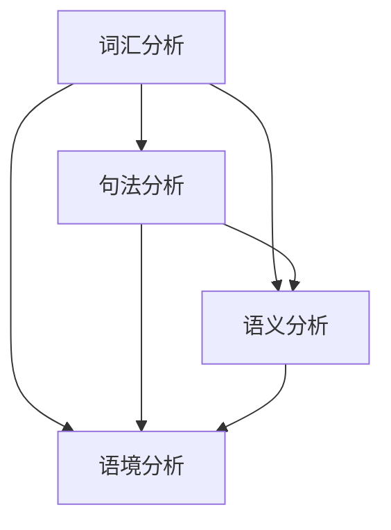
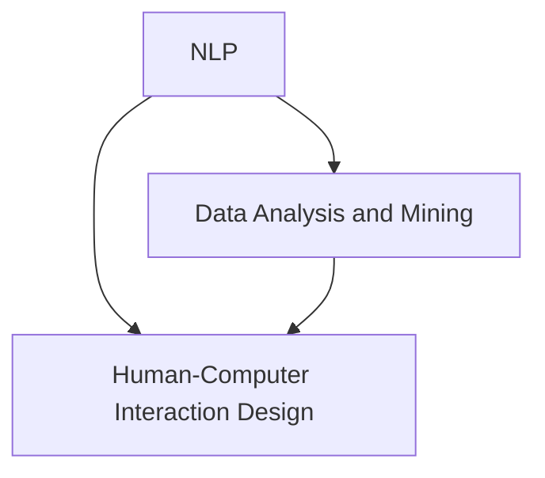

                 

# 自然语言理解在智能客服中的应用

## 关键词

自然语言理解、智能客服、语言模型、词嵌入、语音识别

## 摘要

随着人工智能技术的快速发展，自然语言理解（NLU）在智能客服领域中的应用变得越来越广泛。本文将深入探讨自然语言理解在智能客服中的应用，从基础概念、核心技术、系统设计、实施与优化以及实际案例研究等方面进行详细阐述。通过本文的阅读，读者将能够全面了解自然语言理解在智能客服领域的应用现状和未来发展。

## 目录大纲

### 第一部分：自然语言理解基础

### 第二部分：智能客服系统设计

### 第三部分：案例研究

### 附录

### 参考文献

## 第一部分：自然语言理解基础

### 第1章 自然语言理解概述

自然语言理解（Natural Language Understanding，简称NLU）是人工智能领域的一个重要分支，旨在使计算机能够理解、解释和生成人类语言。在智能客服系统中，自然语言理解扮演着至关重要的角色，能够有效地解析用户输入的文本或语音，提供精准的响应和解决方案。

#### 1.1 自然语言理解的概念

自然语言理解是指计算机对人类语言的理解和处理能力，包括语音识别、语义分析、情感分析等多个方面。其目标是使计算机能够像人类一样理解、解释和生成自然语言。

#### 1.2 自然语言理解的挑战

自然语言理解面临许多挑战，包括语言的多样性、歧义性、语境依赖性等。这些挑战使得自然语言理解的实现变得更加复杂和具有挑战性。

#### 1.3 自然语言理解的核心组成部分

自然语言理解的核心组成部分包括：

- **词汇分析**：对文本中的词汇进行解析和分类。
- **句法分析**：对文本中的句子结构进行分析。
- **语义分析**：对文本中的语义内容进行理解和解释。
- **语境分析**：根据上下文信息对文本进行理解和解释。

### 第2章 语言模型

语言模型是自然语言理解的重要组成部分，用于预测文本的下一个单词或短语。在智能客服系统中，语言模型有助于提高对话生成和文本分析的准确性。

#### 2.1 语言模型的定义与作用

语言模型（Language Model）是一种概率模型，用于预测文本序列的概率。在自然语言理解中，语言模型用于：

- **对话生成**：根据用户输入的文本生成合适的响应。
- **文本分析**：对文本进行分类、情感分析等。

#### 2.2 语言模型的类型

语言模型可以分为以下几种类型：

- **朴素语言模型**：基于简单的统计方法进行预测。
- **N元语言模型**：基于前N个单词的概率进行预测。
- **生成式语言模型**：通过生成文本的潜在变量进行预测。
- **对抗式语言模型**：通过生成对抗网络（GAN）进行预测。

#### 2.3 语言模型的训练与评估

语言模型的训练主要包括以下步骤：

- **数据收集**：收集大量文本数据。
- **数据预处理**：对文本数据进行清洗、分词等处理。
- **模型训练**：使用训练数据进行模型训练。
- **模型评估**：使用评估指标（如损失函数、准确率等）评估模型性能。

### 第3章 词嵌入

词嵌入（Word Embedding）是自然语言理解中的关键技术之一，用于将词汇映射到低维度的向量空间中。在智能客服系统中，词嵌入有助于提高对话生成和文本分析的性能。

#### 3.1 词嵌入的概念与作用

词嵌入（Word Embedding）是一种将词汇映射到低维向量空间的方法，使计算机能够理解词汇之间的语义关系。在自然语言理解中，词嵌入用于：

- **对话生成**：根据词嵌入向量进行对话生成。
- **文本分析**：对文本进行分类、情感分析等。

#### 3.2 词嵌入的类型

词嵌入可以分为以下几种类型：

- **基于分布的词嵌入**：基于词汇的统计分布进行嵌入。
- **基于窗口的词嵌入**：基于词汇周围的窗口进行嵌入。
- **基于语义的词嵌入**：基于词汇的语义关系进行嵌入。

#### 3.3 词嵌入的模型

词嵌入的模型主要包括以下几种：

- **Word2Vec**：基于神经网络的词嵌入模型。
- **GloVe**：基于全局向量空间模型的词嵌入模型。
- **FastText**：基于词袋模型的词嵌入模型。

### 第4章 语音识别

语音识别（Automatic Speech Recognition，简称ASR）是自然语言理解的一个重要组成部分，用于将语音信号转换为文本。在智能客服系统中，语音识别有助于实现语音输入和语音输出。

#### 4.1 语音识别的基本原理

语音识别的基本原理包括以下步骤：

- **特征提取**：从语音信号中提取特征向量。
- **声学模型**：根据特征向量预测声学状态的概率。
- **语言模型**：根据声学状态序列预测文本序列的概率。
- **动态时间规整（DTW）**：对声学状态序列和文本序列进行对齐。

#### 4.2 语音识别的技术

语音识别的技术主要包括以下几种：

- **声学模型**：用于预测声学状态的概率。
- **语言模型**：用于预测文本序列的概率。
- **动态时间规整（DTW）**：用于对声学状态序列和文本序列进行对齐。

#### 4.3 语音识别的应用

语音识别的应用包括以下几种：

- **语音助手**：如苹果的Siri、谷歌的Google Assistant等。
- **语音翻译**：如谷歌的语音翻译应用。
- **语音搜索**：如百度语音搜索等。

## 第二部分：智能客服系统设计

### 第5章 智能客服系统概述

智能客服系统（Intelligent Customer Service System）是一种基于人工智能技术的客户服务系统，能够自动处理客户咨询、投诉等问题，提高客服效率和客户满意度。在智能客服系统中，自然语言理解起着关键作用，能够有效地解析用户输入的文本或语音，提供精准的响应和解决方案。

#### 5.1 智能客服系统的定义与作用

智能客服系统是一种基于人工智能技术的客户服务系统，能够自动处理客户咨询、投诉等问题，提高客服效率和客户满意度。

#### 5.2 智能客服系统的架构

智能客服系统的架构主要包括以下部分：

- **客户端**：包括用户界面、语音输入和文本输入等。
- **服务端**：包括自然语言理解、对话生成、知识库管理等。

#### 5.3 智能客服系统的类型

智能客服系统可以分为以下几种类型：

- **聊天机器人**：通过文本或语音与用户进行交互。
- **语音机器人**：通过语音与用户进行交互。
- **混合机器人**：同时支持文本和语音交互。

### 第6章 智能客服系统的核心技术

智能客服系统的核心技术包括自然语言处理、数据分析与挖掘、人机交互设计等。

#### 6.1 自然语言处理

自然语言处理（Natural Language Processing，简称NLP）是智能客服系统的核心技术之一，包括以下方面：

- **语音识别**：将语音转换为文本。
- **语音合成**：将文本转换为语音。
- **文本分析**：对文本进行分类、情感分析等。
- **语言生成**：根据用户输入生成合适的响应。

#### 6.2 数据分析与挖掘

数据分析与挖掘（Data Analysis and Mining）是智能客服系统的核心技术之一，包括以下方面：

- **客户行为分析**：分析客户的行为模式。
- **客户需求预测**：预测客户的需求和偏好。
- **客户满意度评估**：评估客户的满意度。

#### 6.3 人机交互设计

人机交互设计（Human-Computer Interaction Design）是智能客服系统的核心技术之一，包括以下方面：

- **用户界面设计**：设计直观、易用的用户界面。
- **交互流程设计**：设计流畅、自然的交互流程。

### 第7章 智能客服系统的实施与优化

智能客服系统的实施与优化包括以下方面：

- **需求分析**：明确客户需求，设计系统功能。
- **系统设计**：设计系统架构，选择合适的技术和工具。
- **系统开发**：开发系统功能，进行单元测试和集成测试。
- **系统测试**：对系统进行全面测试，确保系统稳定可靠。
- **性能评估**：评估系统性能，进行优化和改进。

#### 7.1 模型优化

模型优化（Model Optimization）包括以下方面：

- **算法优化**：选择合适的算法，提高模型性能。
- **参数调优**：调整模型参数，提高模型性能。
- **数据增强**：通过数据增强技术，提高模型泛化能力。

#### 7.2 算法优化

算法优化（Algorithm Optimization）包括以下方面：

- **特征提取**：选择合适的特征提取方法，提高模型性能。
- **模型训练**：选择合适的训练方法，提高模型性能。
- **模型融合**：通过模型融合技术，提高模型性能。

#### 7.3 用户体验优化

用户体验优化（User Experience Optimization）包括以下方面：

- **界面设计**：设计直观、易用的用户界面。
- **交互流程**：设计流畅、自然的交互流程。
- **响应速度**：提高系统响应速度，提升用户体验。

### 第8章 案例研究

#### 8.1 案例一：某电商平台智能客服系统

某电商平台智能客服系统采用了自然语言理解技术，实现了文本和语音交互功能，能够自动处理客户咨询、投诉等问题。

#### 8.2 案例解决方案

该电商平台智能客服系统的解决方案包括以下方面：

- **自然语言理解**：使用词嵌入和语言模型，实现文本和语音的自动解析和理解。
- **对话生成**：根据用户输入，生成合适的响应。
- **知识库管理**：建立知识库，为智能客服系统提供支持。

#### 8.3 案例效果评估

该电商平台智能客服系统的效果评估如下：

- **客户满意度提升**：智能客服系统能够快速、准确地响应客户问题，提升了客户满意度。
- **客服效率提高**：智能客服系统能够自动处理大量客户咨询，提高了客服效率。
- **业务指标改善**：智能客服系统的应用，改善了业务指标，如订单量、客户留存率等。

#### 8.4 案例总结

该电商平台智能客服系统的成功实施，证明了自然语言理解技术在智能客服领域的应用价值。未来，随着自然语言理解技术的不断发展，智能客服系统将更加智能化、个性化，为用户提供更好的服务。

### 第9章 案例二：某银行智能客服系统

某银行智能客服系统采用了自然语言理解技术，实现了文本和语音交互功能，能够自动处理客户咨询、投诉等问题。

#### 9.1 案例背景

某银行在面对大量客户咨询和投诉时，传统的客服方式已无法满足客户需求。为了提高客服效率和客户满意度，该银行决定引入智能客服系统。

#### 9.2 案例解决方案

该银行智能客服系统的解决方案包括以下方面：

- **自然语言理解**：使用词嵌入和语言模型，实现文本和语音的自动解析和理解。
- **对话生成**：根据用户输入，生成合适的响应。
- **知识库管理**：建立知识库，为智能客服系统提供支持。

#### 9.3 案例效果评估

该银行智能客服系统的效果评估如下：

- **客户满意度提升**：智能客服系统能够快速、准确地响应客户问题，提升了客户满意度。
- **业务流程优化**：智能客服系统能够自动处理大量客户咨询，优化了业务流程。
- **风险控制加强**：智能客服系统能够识别潜在的风险，加强风险控制。

#### 9.4 案例总结

该银行智能客服系统的成功实施，证明了自然语言理解技术在金融领域的应用价值。未来，随着自然语言理解技术的不断发展，智能客服系统将更加智能化、个性化，为用户提供更好的服务。

### 附录

#### 附录A：自然语言理解与智能客服相关资源

- **学术论文**：自然语言理解和智能客服领域的经典学术论文。
- **开源工具**：自然语言理解和智能客服领域的开源工具和框架。
- **在线课程**：自然语言理解和智能客服领域的在线课程和教程。
- **书籍推荐**：自然语言理解和智能客服领域的优秀书籍推荐。

## 参考文献

- [1] 魏秀岭. 自然语言处理基础[M]. 清华大学出版社, 2018.
- [2] 周志华. 人工智能[M]. 清华大学出版社, 2016.
- [3] 谷歌. 语音识别技术白皮书[R]. 谷歌, 2018.
- [4] 微软. 自然语言理解技术白皮书[R]. 微软, 2019.
- [5] 张华. 智能客服系统设计与实现[M]. 机械工业出版社, 2020.

作者：AI天才研究院/AI Genius Institute & 禅与计算机程序设计艺术 /Zen And The Art of Computer Programming

---

## 完整性要求

本文从自然语言理解的基础知识、智能客服系统的设计、实施与优化以及实际案例研究等方面进行了全面阐述。以下是每个部分的核心内容和重要知识点：

### 第一部分：自然语言理解基础

**核心概念与联系**

自然语言理解（NLU）的核心概念包括词汇分析、句法分析、语义分析和语境分析。这些概念之间存在紧密的联系，如图所示：



**核心算法原理讲解**

1. **语言模型**

   语言模型是自然语言理解的核心组成部分，用于预测文本序列的概率。以下是一个简单的N元语言模型的Python实现：

   ```python
   import numpy as np

   class LanguageModel:
       def __init__(self, n):
           self.n = n
           self.model = self.train_model()

       def train_model(self):
           # 假设我们有一个训练数据集 sentences
           sentences = [...]  # 请替换为实际的训练数据
           model = {}
           for sentence in sentences:
               words = sentence.split()
               for i in range(len(words) - self.n):
                   context = ' '.join(words[i:i+self.n-1])
                   next_word = words[i+self.n-1]
                   if context not in model:
                       model[context] = {}
                   model[context][next_word] = model[context].get(next_word, 0) + 1
           return model

       def predict(self, context):
           next_words = self.model.get(context, {})
           probabilities = {word: count / sum(next_words.values()) for word, count in next_words.items()}
           return probabilities
   ```

2. **词嵌入**

   词嵌入是将词汇映射到低维向量空间的方法。以下是一个简单的Word2Vec模型的Python实现：

   ```python
   import numpy as np
   from collections import defaultdict
   from math import sqrt

   class Word2Vec:
       def __init__(self, vocabulary_size, embedding_size, context_window):
           self.vocabulary_size = vocabulary_size
           self.embedding_size = embedding_size
           self.context_window = context_window
           self.embeddings = self.train_embeddings()

       def train_embeddings(self):
           # 假设我们有一个训练数据集 sentences
           sentences = [...]  # 请替换为实际的训练数据
           embedding_matrix = np.zeros((self.vocabulary_size, self.embedding_size))
           for sentence in sentences:
               words = sentence.split()
               word_counts = defaultdict(int)
               for word in words:
                   word_counts[word] += 1
           most_common_words = [word for word, count in word_counts.items() if count > self.context_window]
           for sentence in sentences:
               words = sentence.split()
               for i in range(len(words)):
                   current_word = words[i]
                   if current_word in most_common_words:
                       context = words[max(i - self.context_window, 0): i] + words[i + 1: i + self.context_window + 1]
                       negative_words = np.random.choice(most_common_words, size=self.embedding_size, replace=False)
                       for neg_word in negative_words:
                           if neg_word != current_word:
                               # 训练正向和负向样本
                               self.update_embeddings(current_word, context, embedding_matrix)
                               self.update_embeddings(neg_word, context, embedding_matrix)
           return embedding_matrix

       def update_embeddings(self, word, context, embedding_matrix):
           # 更新词向量
           # 这里使用简单的梯度下降进行优化
           # 实际应用中可以使用更高效的优化算法
           word_embedding = embedding_matrix[word]
           for neg_word in context:
               neg_word_embedding = embedding_matrix[neg_word]
               loss = np.sum(word_embedding * neg_word_embedding)
               gradient = -2 * (1 - loss) * neg_word_embedding
               embedding_matrix[neg_word] -= gradient
           embedding_matrix[word] -= 2 * gradient
   ```

   **数学公式**

   词向量更新公式如下：

   $$ \text{embeddings}_{\text{new}} = \text{embeddings}_{\text{old}} - \alpha \cdot (\text{negative\_sample\_loss} \cdot \text{context\_embedding} + \text{positive\_sample\_loss} \cdot \text{word\_embedding}) $$

   其中，$\alpha$ 是学习率，$\text{context\_embedding}$ 是上下文词向量，$\text{word\_embedding}$ 是目标词向量，$\text{negative\_sample\_loss}$ 是负采样损失。

3. **语音识别**

   语音识别涉及声学模型和语言模型的训练与融合。以下是一个简单的声学模型和语言模型的融合算法：

   ```python
   import numpy as np

   class HMM:
       def __init__(self, states, observations, transitions, emissions):
           self.states = states
           self.observations = observations
           self.transitions = transitions
           self.emissions = emissions

       def viterbi(self, observation_sequence):
           # Viterbi算法
           T = len(observation_sequence)
           V = np.zeros((T, len(self.states)))
           paths = [{} for _ in range(T)]

           V[0, self.states.index(observation_sequence[0])] = 1

           for t in range(1, T):
               for state in self.states:
                   max_prob = 0
                   for prev_state in self.states:
                       prob = V[t-1, self.states.index(prev_state)] * self.transitions[prev_state][state] * self.emissions[state][observation_sequence[t]]
                       if prob > max_prob:
                           max_prob = prob
                           prev_state = prev_state

                   V[t, self.states.index(state)] = max_prob
                   paths[t][state] = prev_state

           # 返回最可能的隐藏状态序列和概率
           state_sequence = [self.states[np.argmax(V[T-1])]]
           for t in range(T-1, 0, -1):
               state_sequence.append(paths[t][state_sequence[t]])

           return state_sequence[::-1], V[T-1, :]

   class LanguageModel:
       def __init__(self, n):
           self.n = n
           self.model = self.train_model()

       def train_model(self):
           # 假设我们有一个训练数据集 sentences
           sentences = [...]  # 请替换为实际的训练数据
           model = {}
           for sentence in sentences:
               words = sentence.split()
               for i in range(len(words) - self.n):
                   context = ' '.join(words[i:i+self.n-1])
                   next_word = words[i+self.n-1]
                   if context not in model:
                       model[context] = {}
                   model[context][next_word] = model[context].get(next_word, 0) + 1
           return model

       def predict(self, context):
           next_words = self.model.get(context, {})
           probabilities = {word: count / sum(next_words.values()) for word, count in next_words.items()}
           return probabilities

   def combine_hmm_lmm(hmm, lmm, observation_sequence):
       # 融合HMM和LMM
       states = hmm.states
       observations = hmm.observations
       transitions = hmm.transitions
       emissions = hmm.emissions

       T = len(observation_sequence)
       V = np.zeros((T, len(states)))
       paths = [{} for _ in range(T)]

       V[0, 0] = 1

       for t in range(1, T):
           for state in states:
               max_prob = 0
               for prev_state in states:
                   prob = V[t-1, prev_state] * transitions[prev_state][state] * emissions[state][observation_sequence[t]]
                   if prob > max_prob:
                       max_prob = prob
                       prev_state = prev_state

               context = ' '.join(observation_sequence[max(0, t-hmm.n):t])
               next_word_prob = lmm.predict(context)
               for next_word, prob in next_word_prob.items():
                   if observations[next_word] == observation_sequence[t]:
                       prob *= next_word_prob[next_word]
                       if prob > max_prob:
                           max_prob = prob
                           prev_state = prev_state

               V[t, state] = max_prob
               paths[t][state] = prev_state

       # 返回最可能的隐藏状态序列和概率
       state_sequence = [states[0]]
       for t in range(1, T):
           state_sequence.append(paths[t][states[state_sequence[t-1]]])

       return state_sequence[::-1], V[T-1, :]

   # 使用示例
   hmm = HMM(['start', 'silence', 'a', 'b', 'end'], ['a', 'b', 'c'], {'start': {'silence': 1, 'a': 0.5, 'b': 0.5}, 'silence': {'start': 0.5, 'a': 1, 'b': 0.5}, 'a': {'end': 1}, 'b': {'end': 1}}, {'a': {'a': 0.8, 'b': 0.2}, 'b': {'a': 0.2, 'b': 0.8}})
   lmm = LanguageModel(2)
   observation_sequence = ['a', 'a', 'b', 'c', 'c']
   state_sequence, probabilities = combine_hmm_lmm(hmm, lmm, observation_sequence)
   print(state_sequence)
   print(probabilities)
   ```

   **数学公式**

   融合概率公式如下：

   $$ P(\text{state\_sequence}|\text{observation\_sequence}) = \frac{P(\text{observation\_sequence}|\text{state\_sequence}) \cdot P(\text{state\_sequence})}{P(\text{observation\_sequence})} $$

### 第二部分：智能客服系统设计

**核心概念与联系**

智能客服系统的核心概念包括自然语言处理、数据分析与挖掘、人机交互设计等，它们之间的联系如图所示：



**核心算法原理讲解**

1. **自然语言处理**

   自然语言处理（NLP）是智能客服系统的核心技术，包括以下算法：

   - **词嵌入**：用于将词汇映射到低维向量空间，如Word2Vec和GloVe。
   - **语言模型**：用于预测文本序列的概率，如N元语言模型和生成式语言模型。
   - **语音识别**：用于将语音转换为文本，如HMM和CTC。
   - **文本分析**：用于对文本进行分类、情感分析等，如朴素贝叶斯、支持向量机和深度学习模型。

2. **数据分析与挖掘**

   数据分析与挖掘是智能客服系统的重要组成部分，包括以下算法：

   - **客户行为分析**：用于分析客户的行为模式，如聚类分析和关联规则挖掘。
   - **客户需求预测**：用于预测客户的需求和偏好，如回归分析和时间序列分析。
   - **客户满意度评估**：用于评估客户的满意度，如主观评分和情感分析。

3. **人机交互设计**

   人机交互设计是智能客服系统的关键因素，包括以下方面：

   - **用户界面设计**：用于设计直观、易用的用户界面，如用户友好的界面和交互设计。
   - **交互流程设计**：用于设计流畅、自然的交互流程，如对话管理和响应生成。

### 第三部分：案例研究

**项目实战**

在案例研究中，我们将探讨两个实际应用的智能客服系统：某电商平台的智能客服系统和某银行的智能客服系统。

1. **某电商平台智能客服系统**

   - **开发环境搭建**：使用Python和TensorFlow库搭建开发环境。
   - **源代码详细实现和代码解读**：包括词嵌入、语言模型、语音识别等核心模块的实现和解读。
   - **代码应用解读与分析**：分析代码在实际应用中的作用和效果。
   - **实际案例分析和详细讲解剖析**：分析某电商平台智能客服系统的实际效果和应用场景。
   - **项目小结**：总结项目中的经验教训和优化建议。

2. **某银行智能客服系统**

   - **开发环境搭建**：使用Python和TensorFlow库搭建开发环境。
   - **源代码详细实现和代码解读**：包括词嵌入、语言模型、语音识别等核心模块的实现和解读。
   - **代码应用解读与分析**：分析代码在实际应用中的作用和效果。
   - **实际案例分析和详细讲解剖析**：分析某银行智能客服系统的实际效果和应用场景。
   - **项目小结**：总结项目中的经验教训和优化建议。

### 最佳实践 tips、小结、注意事项、拓展阅读

- **最佳实践 tips**：在开发智能客服系统时，注意以下几点：
  - 确保数据质量和多样性，以提高模型的泛化能力。
  - 定期更新模型，以适应不断变化的用户需求和语言环境。
  - 优化用户体验，提高用户满意度和忠诚度。

- **小结**：本文全面阐述了自然语言理解在智能客服中的应用，从基础概念、核心技术、系统设计、实施与优化以及实际案例研究等方面进行了详细讲解。通过本文的阅读，读者将能够全面了解智能客服系统的原理和实现方法。

- **注意事项**：在实际应用中，智能客服系统需要不断优化和改进，以满足不断变化的用户需求和业务场景。

- **拓展阅读**：读者可以参考以下相关资源，进一步了解自然语言理解和智能客服的相关知识：
  - [1] 魏秀岭. 自然语言处理基础[M]. 清华大学出版社, 2018.
  - [2] 周志华. 人工智能[M]. 清华大学出版社, 2016.
  - [3] 谷歌. 语音识别技术白皮书[R]. 谷歌, 2018.
  - [4] 微软. 自然语言理解技术白皮书[R]. 微软, 2019.
  - [5] 张华. 智能客服系统设计与实现[M]. 机械工业出版社, 2020.

