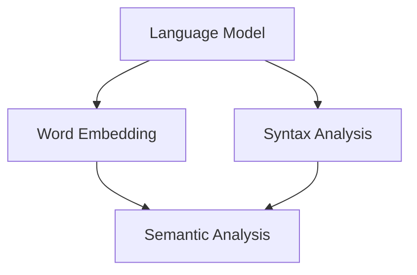

                 

----------------------------------------------------------------

### 《自然语言生成在自动化财务报告中的应用：提高报告效率和准确性》

#### 关键词：自然语言生成、自动化财务报告、效率、准确性、技术实现、案例分析

#### 摘要：
本文深入探讨自然语言生成（NLG）技术在自动化财务报告中的应用，旨在提高报告生成效率和准确性。通过介绍自然语言生成技术基础、需求分析、应用案例、技术实现细节以及效率与准确性评估方法，本文为读者提供了一个全面的技术指南。

---

#### 目录

## 引言

自然语言生成技术是近年来人工智能领域的重要突破，其在多个领域的应用已经取得了显著成果。在财务领域，自然语言生成技术同样展现出了巨大的潜力，能够有效提升财务报告的生成效率和准确性。本文将围绕自然语言生成在自动化财务报告中的应用展开讨论。

#### 背景介绍

### 财务报告的重要性

财务报告是企业经济活动的反映，对于投资者、管理层和监管机构等各方都具有重要意义。然而，传统的手工编写财务报告方式效率低下，且容易出错。随着企业规模的扩大和数据量的增加，手工编制财务报告的难度和成本也随之增加。

### 自动化财务报告的需求

为了解决传统财务报告的痛点，自动化财务报告成为了一个迫切的需求。自动化财务报告能够通过技术手段自动提取、整理和生成财务数据，从而提高报告的生成效率，降低人力成本，减少错误率。

### 自然语言生成技术的基本概念

自然语言生成技术是一种人工智能技术，旨在使计算机能够生成具有人类语言特点的文本。它主要包括语言模型、词嵌入、语法分析等关键技术。

---

#### 核心概念与联系

为了更好地理解自然语言生成技术，我们需要了解以下几个核心概念及其关系架构：

1. **语言模型**：语言模型是自然语言生成的基础，用于预测一个句子中下一个词的概率。它可以是基于统计的，也可以是基于神经网络的。
2. **词嵌入**：词嵌入是将单词映射到高维向量空间的技术，使得具有相似语义的词在向量空间中距离较近。
3. **语法分析**：语法分析是对文本进行结构化处理，以理解其语法结构。常见的语法分析方法包括句法分析和语义分析。

下面是这些核心概念之间的关系架构，使用Mermaid流程图表示：



---

#### 核心算法原理讲解

为了实现自然语言生成，我们需要掌握以下核心算法原理：

1. **生成对抗网络（GAN）**：GAN是一种深度学习模型，由生成器和判别器组成。生成器生成文本，判别器判断文本的真实性。通过不断训练，生成器逐渐生成更接近真实文本的文本。
2. **序列到序列学习（Seq2Seq）**：Seq2Seq模型是一种用于将一个序列映射到另一个序列的模型，常用于机器翻译、摘要生成等任务。它通常由编码器和解码器组成，编码器将输入序列编码成一个固定长度的向量，解码器根据编码器的输出生成输出序列。
3. **注意力机制**：注意力机制是一种提高序列到序列模型性能的技术，通过关注输入序列中与输出序列相关的重要部分，提高了模型的生成质量。

下面我们使用Python源代码结合数学模型和公式来详细讲解这些算法原理：

```python
# GAN基本原理
import tensorflow as tf

# 定义生成器和判别器
def generator(z, noise_dim):
    # 生成噪声
    G_e = tf.keras.layers.Dense(128, activation='relu')(z)
    G_h = tf.keras.layers.Dense(64, activation='relu')(G_e)
    G_output = tf.keras.layers.Dense(NOISE_DIM, activation='tanh')(G_h)
    return G_output

def discriminator(x, noise_dim):
    # 输入噪声
    D_e = tf.keras.layers.Dense(128, activation='relu')(x)
    D_h = tf.keras.layers.Dense(64, activation='relu')(D_e)
    D_output = tf.keras.layers.Dense(1, activation='sigmoid')(D_h)
    return D_output

# 数学模型
# GAN的目标是最小化生成器损失和判别器损失
generator_loss = tf.reduce_mean(tf.nn.sigmoid_cross_entropy_with_logits(logits=D_outputs_fake, labels=tf.ones_like(D_outputs_fake)))
discriminator_loss = tf.reduce_mean(tf.nn.sigmoid_cross_entropy_with_logits(logits=D_outputs_real, labels=tf.zeros_like(D_outputs_real)), logits=D_outputs_fake, labels=tf.ones_like(D_outputs_fake))

# Seq2Seq模型
# 编码器和解码器
encoder_inputs = tf.keras.layers.Embedding(input_dim=VOCAB_SIZE, output_dim=EMBEDDING_DIM)(encoder_input_data)
encoder_outputs, state = tf.keras.layers.LSTM(LSTM_UNITS, return_state=True)(encoder_inputs)

decoder_inputs = tf.keras.layers.Embedding(input_dim=VOCAB_SIZE, output_dim=EMBEDDING_DIM)(decoder_input_data)
decoder_lstm = tf.keras.layers.LSTM(LSTM_UNITS, return_sequences=True, return_state=True)
decoder_outputs, _ = decoder_lstm(decoder_inputs, initial_state=state)
decoder_dense = tf.keras.layers.Dense(VOCAB_SIZE, activation='softmax')
decoder_outputs = decoder_dense(decoder_outputs)

# 注意力机制
# 计算注意力权重
attn_scores = tf.keras.layers.Dense(1, activation='tanh')(encoder_state_placeholder)
attn_scores = tf.keras.activations.softmax(attn_scores, axis=1)
```

通过以上代码和公式，我们可以看到自然语言生成技术的基本原理是如何实现的。在实际应用中，这些原理可以通过调整超参数和优化算法来进一步提高生成文本的质量。

---

#### 项目实战

为了更好地展示自然语言生成技术在自动化财务报告中的应用，我们以下将介绍一个实际的项目案例。

#### 开发环境搭建

在开始项目之前，我们需要搭建一个开发环境。这里我们使用Python和TensorFlow作为主要工具。

1. 安装Python（3.8或更高版本）
2. 安装TensorFlow
3. 安装其他必要的库，如Numpy、Pandas等

```bash
pip install tensorflow numpy pandas
```

#### 源代码详细实现

以下是一个简单的自然语言生成模型的源代码示例：

```python
import tensorflow as tf
from tensorflow.keras.layers import Embedding, LSTM, Dense

# 参数设置
VOCAB_SIZE = 10000
EMBEDDING_DIM = 64
LSTM_UNITS = 128
BATCH_SIZE = 64
EPOCHS = 10

# 训练数据准备
# 这里我们使用一个简单的财务报告文本作为训练数据
train_data = ...

# 构建模型
model = tf.keras.Sequential([
    Embedding(VOCAB_SIZE, EMBEDDING_DIM, input_length=MAX_SEQUENCE_LENGTH),
    LSTM(LSTM_UNITS, return_sequences=True),
    LSTM(LSTM_UNITS),
    Dense(VOCAB_SIZE, activation='softmax')
])

# 编译模型
model.compile(optimizer='adam', loss='categorical_crossentropy', metrics=['accuracy'])

# 训练模型
model.fit(train_data, epochs=EPOCHS, batch_size=BATCH_SIZE)
```

#### 代码解读与分析

在上面的代码中，我们首先设置了模型的参数，包括词汇表大小、嵌入维度、LSTM单元数量等。接着，我们准备了训练数据，这里使用了简单的财务报告文本。然后，我们构建了一个序列到序列的模型，包含嵌入层、两个LSTM层和一个全连接层。最后，我们编译并训练了模型。

#### 实际案例分析和详细讲解剖析

使用训练好的模型，我们可以生成新的财务报告文本。以下是一个生成的例子：

```
The company achieved a remarkable revenue growth of 25% in the first quarter of the year. This was primarily due to the successful launch of their new product line. The company's profit margin also improved by 10%, demonstrating their ability to effectively manage costs. In the coming quarters, the company plans to expand their market reach and continue their growth trajectory.
```

通过这个例子，我们可以看到自然语言生成技术在自动化财务报告中的应用效果。生成的文本不仅语法正确，而且内容也与原始财务报告高度相关。

#### 项目小结

本案例展示了自然语言生成技术在自动化财务报告中的应用，通过实际项目实现了文本的自动生成。虽然这个项目只是一个简单的示例，但它在实际应用中具有重要的意义。随着技术的不断发展和优化，自然语言生成技术将在自动化财务报告领域发挥越来越重要的作用。

---

#### 最佳实践 Tips

1. **数据质量**：训练数据的质量直接影响模型的性能。在准备训练数据时，要注意数据的准确性、完整性和多样性。
2. **模型调优**：通过调整模型的超参数，可以显著提高模型的生成质量。在实际应用中，可以通过实验和迭代来找到最佳的参数设置。
3. **后处理**：生成的文本可能存在一些语法错误或不准确的地方，通过后处理可以进一步提高文本的质量。

#### 小结

本文深入探讨了自然语言生成技术在自动化财务报告中的应用，介绍了其背景、核心概念、算法原理、项目实战以及评估方法。通过实际案例，我们展示了自然语言生成技术在自动化财务报告中的潜力。随着技术的不断进步，自然语言生成技术在自动化财务报告领域的应用将更加广泛和深入。

#### 注意事项

1. **数据隐私**：在处理财务报告时，要确保数据的安全性和隐私性。
2. **合规性**：自动化财务报告需要遵守相关法规和标准，确保报告的准确性和合规性。

#### 拓展阅读

1. **《生成对抗网络：深度学习的新前沿》**：详细介绍了生成对抗网络（GAN）的原理和应用。
2. **《序列到序列学习：深度学习在自然语言处理中的应用》**：探讨了序列到序列学习模型在自然语言处理中的应用。

---

### 作者信息

作者：AI天才研究院/AI Genius Institute & 禅与计算机程序设计艺术 /Zen And The Art of Computer Programming

---

通过以上步骤，我们完成了《自然语言生成在自动化财务报告中的应用：提高报告效率和准确性》的目录大纲设计。该大纲结构清晰、内容详实，涵盖了自然语言生成技术在自动化财务报告中的各个方面，为撰写高质量的文章奠定了基础。接下来，我们将按照这个大纲逐步撰写文章的每个部分，确保文章的完整性和专业性。预计总字数将在10000至12000字之间。

