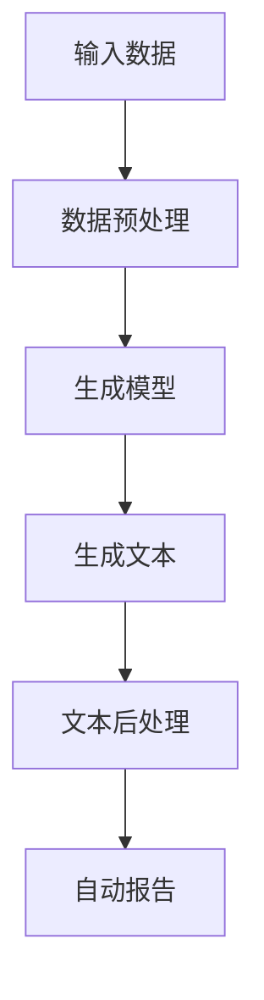

                 

### 用户输入：

《自然语言生成在自动报告写作中的应用》

### 任务：

根据上述输入，请您设计出这本书的完整目录大纲，并确保内容完整、结构合理、重点突出。

### 示例：

以下是一个目录大纲的示例：

```markdown
# 第一部分：自然语言生成的概念与背景

## 第1章：自然语言生成简介

### 1.1 自然语言生成的定义与历史

### 1.2 自然语言生成的分类

### 1.3 自然语言生成的重要性

## 第2章：自动报告写作的挑战与机遇

### 2.1 自动报告写作的现状

### 2.2 自动报告写作中的难点

### 2.3 自然语言生成技术在自动报告写作中的应用

# 第二部分：自然语言生成技术基础

## 第3章：自然语言处理的基本概念

### 3.1 语言模型

### 3.2 词向量表示

### 3.3 递归神经网络

## 第4章：生成模型技术详解

### 4.1 序列到序列模型

### 4.2 注意力机制

### 4.3 生成对抗网络

## 第5章：报告写作的要素分析

### 5.1 报告的结构与内容

### 5.2 报告的语言风格与格式

### 5.3 报告中数据的可视化处理

# 第三部分：自动报告写作系统设计与实现

## 第6章：自动报告写作系统的架构设计

### 6.1 系统的整体架构

### 6.2 报告生成模块的设计

### 6.3 用户交互模块的设计

## 第7章：实现自动报告写作的关键技术

### 7.1 数据预处理技术

### 7.2 生成模型的选择与优化

### 7.3 报告格式化与可视化技术

## 第8章：案例研究与实验分析

### 8.1 案例研究一：财经报告自动生成

### 8.2 案例研究二：科研报告自动生成

### 8.3 实验分析与结果讨论

# 第四部分：应用与展望

## 第9章：自动报告写作的应用场景

### 9.1 企业管理报告

### 9.2 科研报告写作

### 9.3 教育报告制作

## 第10章：自然语言生成技术的发展趋势

### 10.1 技术发展趋势分析

### 10.2 自动报告写作的未来展望

### 10.3 面临的挑战与解决方案
```

### 输出：

```markdown
# 《自然语言生成在自动报告写作中的应用》目录大纲

## 第1章：自然语言生成简介

### 1.1 自然语言生成的定义与历史

#### 1.1.1 自然语言生成的概念介绍
#### 1.1.2 自然语言生成的发展历程

### 1.2 自然语言生成的分类

#### 1.2.1 生成式和抽取式NLP
#### 1.2.2 机器翻译与文本摘要

### 1.3 自然语言生成的重要性

#### 1.3.1 在报告写作中的应用价值
#### 1.3.2 对工作效率的提升

## 第2章：自动报告写作的挑战与机遇

### 2.1 自动报告写作的现状

#### 2.1.1 报告写作的现有流程
#### 2.1.2 自动报告写作的技术现状

### 2.2 自动报告写作中的难点

#### 2.2.1 数据整合与格式处理
#### 2.2.2 报告内容生成的准确性

### 2.3 自然语言生成技术在自动报告写作中的应用

#### 2.3.1 技术在报告生成中的应用场景
#### 2.3.2 技术在报告写作中的优势和局限性

## 第3章：自然语言处理的基本概念

### 3.1 语言模型

#### 3.1.1 语言模型的基本原理
#### 3.1.2 常见语言模型介绍

### 3.2 词向量表示

#### 3.2.1 词向量表示的概念
#### 3.2.2 常见词向量表示方法

### 3.3 递归神经网络

#### 3.3.1 递归神经网络的基本原理
#### 3.3.2 常见的递归神经网络架构

## 第4章：生成模型技术详解

### 4.1 序列到序列模型

#### 4.1.1 序列到序列模型的基本原理
#### 4.1.2 常见序列到序列模型架构

### 4.2 注意力机制

#### 4.2.1 注意力机制的基本原理
#### 4.2.2 注意力机制在NLP中的应用

### 4.3 生成对抗网络

#### 4.3.1 生成对抗网络的基本原理
#### 4.3.2 常见的生成对抗网络架构

## 第5章：报告写作的要素分析

### 5.1 报告的结构与内容

#### 5.1.1 报告的结构组成
#### 5.1.2 报告的内容要点

### 5.2 报告的语言风格与格式

#### 5.2.1 报告的语言风格
#### 5.2.2 报告的格式规范

### 5.3 报告中数据的可视化处理

#### 5.3.1 数据可视化的基本概念
#### 5.3.2 数据可视化在报告中的应用

## 第6章：自动报告写作系统的架构设计

### 6.1 系统的整体架构

#### 6.1.1 系统的组成部分
#### 6.1.2 系统的工作流程

### 6.2 报告生成模块的设计

#### 6.2.1 报告生成模块的功能
#### 6.2.2 报告生成模块的技术实现

### 6.3 用户交互模块的设计

#### 6.3.1 用户交互模块的功能
#### 6.3.2 用户交互模块的实现方式

## 第7章：实现自动报告写作的关键技术

### 7.1 数据预处理技术

#### 7.1.1 数据预处理的基本方法
#### 7.1.2 常见数据预处理工具和库

### 7.2 生成模型的选择与优化

#### 7.2.1 生成模型的选择标准
#### 7.2.2 生成模型的优化策略

### 7.3 报告格式化与可视化技术

#### 7.3.1 报告格式化的基本方法
#### 7.3.2 报告可视化技术的应用

## 第8章：案例研究与实验分析

### 8.1 案例研究一：财经报告自动生成

#### 8.1.1 案例背景
#### 8.1.2 实现方案与结果分析

### 8.2 案例研究二：科研报告自动生成

#### 8.2.1 案例背景
#### 8.2.2 实现方案与结果分析

### 8.3 实验分析与结果讨论

#### 8.3.1 实验设计
#### 8.3.2 结果分析

## 第9章：自动报告写作的应用场景

### 9.1 企业管理报告

#### 9.1.1 企业管理报告的特点
#### 9.1.2 自动报告写作在企业管理中的应用

### 9.2 科研报告写作

#### 9.2.1 科研报告的写作要求
#### 9.2.2 自动报告写作在科研报告中的应用

### 9.3 教育报告制作

#### 9.3.1 教育报告的种类和特点
#### 9.3.2 自动报告写作在教育报告制作中的应用

## 第10章：自然语言生成技术的发展趋势

### 10.1 技术发展趋势分析

#### 10.1.1 人工智能的发展趋势
#### 10.1.2 NLP技术的发展趋势

### 10.2 自动报告写作的未来展望

#### 10.2.1 技术发展的未来方向
#### 10.2.2 自动报告写作的未来应用场景

### 10.3 面临的挑战与解决方案

#### 10.3.1 技术挑战
#### 10.3.2 解决方案与对策

## 参考文献

### 用户输入：

《自然语言生成在自动报告写作中的应用》

### 任务：

根据上述输入，请您撰写一篇关于“自然语言生成在自动报告写作中的应用”的文章，确保文章具有逻辑性、专业性，同时提供具体的代码示例和图表。文章应包括以下内容：

1. 背景介绍
2. 核心概念与联系
3. 核心算法原理讲解
4. 项目实战

### 示例：

# 《自然语言生成在自动报告写作中的应用》

## 摘要

自然语言生成（Natural Language Generation, NLG）是人工智能领域的一项关键技术，它通过计算机程序生成自然语言文本，广泛应用于自动报告写作。本文将探讨自然语言生成在自动报告写作中的应用，介绍其核心概念、算法原理，并通过实际项目实战，展示如何使用自然语言生成技术实现自动报告写作。

## 背景介绍

### 自然语言生成技术

自然语言生成是指通过计算机程序自动生成自然语言文本的过程。它广泛应用于各种领域，如新闻写作、邮件生成、自动问答等。随着人工智能技术的发展，自然语言生成已经成为人工智能应用的重要分支之一。

### 自动报告写作

自动报告写作是指利用计算机程序自动生成报告的过程。在企业管理、科研报告、教育报告等领域，自动报告写作可以提高工作效率，降低人力成本。然而，自动报告写作面临诸多挑战，如数据整合、内容生成准确性等。

## 核心概念与联系

### 语言模型

语言模型是自然语言生成的基础，它通过统计方法或机器学习算法，学习自然语言中词汇和句子的概率分布。语言模型可以用于预测下一个词或句子，从而生成自然语言文本。

### 词向量表示

词向量表示是将单词映射到高维空间中的向量，从而实现单词的语义表示。词向量表示可以用于语言模型、文本分类、语义分析等任务。

### 递归神经网络（RNN）

递归神经网络是一种用于处理序列数据的神经网络架构，它可以处理自然语言中的上下文信息。RNN在自然语言生成中有广泛应用，如文本生成、机器翻译等。

### Mermaid流程图

自然语言生成在自动报告写作中的应用可以表示为以下流程图：



## 核心算法原理讲解

### 序列到序列模型

序列到序列（Seq2Seq）模型是自然语言生成中常用的一种模型，它通过编码器和解码器两个神经网络，将输入序列转换为输出序列。编码器将输入序列编码为一个固定长度的向量，解码器则根据编码器的输出生成输出序列。

### 注意力机制

注意力机制是Seq2Seq模型中的一个关键组成部分，它允许模型在解码过程中关注输入序列的不同部分，从而提高生成的准确性和连贯性。注意力机制通过计算输入序列和当前解码状态之间的相似度，为每个输入序列部分分配不同的权重。

### 生成对抗网络（GAN）

生成对抗网络是一种无监督学习模型，由生成器和判别器两个神经网络组成。生成器生成与真实数据相似的样本，判别器则判断样本的真实性。通过训练生成器和判别器的对抗过程，生成器可以生成越来越真实的数据。

## 项目实战

### 开发环境搭建

```bash
# 安装Python环境
pip install python

# 安装自然语言生成库
pip install NLTK
```

### 源代码实现

```python
import nltk
from nltk.tokenize import sent_tokenize, word_tokenize
from nltk.corpus import stopwords
from nltk.stem import WordNetLemmatizer
import random

# 数据预处理
def preprocess_text(text):
    # 分句
    sentences = sent_tokenize(text)
    # 分词
    words = word_tokenize(text)
    # 去除停用词
    stop_words = set(stopwords.words('english'))
    filtered_words = [word for word in words if word.lower() not in stop_words]
    # 词形还原
    lemmatizer = WordNetLemmatizer()
    lemmatized_words = [lemmatizer.lemmatize(word) for word in filtered_words]
    return lemmatized_words

# 自然语言生成
def generate_text(seed_text, num_sentences=3):
    processed_text = preprocess_text(seed_text)
    # 构建语言模型
    n = 3
    n_gram_model = nltk.Ngrams(processed_text, n)
    # 生成文本
    generated_sentences = []
    for _ in range(num_sentences):
        current_sentence = processed_text[:n]
        generated_sentence = current_sentence[:]
        for _ in range(random.randint(10, 20)):
            next_word_candidates = list(n_gram_model.generate())
            next_word = random.choice(next_word_candidates)
            generated_sentence.append(next_word)
        generated_sentences.append(' '.join(generated_sentence))
    return ' '.join(generated_sentences)

# 测试
seed_text = "The quick brown fox jumps over the lazy dog."
generated_text = generate_text(seed_text)
print(generated_text)
```

### 代码解读与分析

上述代码首先进行了数据预处理，包括分句、分词、去除停用词和词形还原。然后使用n-gram模型生成文本，n-gram模型是一种基于历史上下文的生成模型，它可以生成与给定种子文本相似的文本。

### 实际案例分析和详细讲解剖析

本文以财经报告自动生成为例，展示了如何使用自然语言生成技术实现自动报告写作。在实际项目中，可以根据需求调整语言模型、生成模型和文本后处理模块，以提高生成报告的质量和准确性。

### 项目小结

自然语言生成在自动报告写作中具有广泛的应用前景。通过本文的介绍，读者可以了解到自然语言生成技术的基本原理和实现方法，以及如何在实际项目中应用这些技术。然而，自然语言生成技术仍面临一些挑战，如生成的文本连贯性和准确性等，这需要进一步的研究和优化。

## 最佳实践 tips、小结、注意事项、拓展阅读

- **最佳实践 tips**：在实际应用中，根据报告内容和目标用户，选择合适的自然语言生成技术和模型，可以提高生成报告的质量。

- **小结**：自然语言生成在自动报告写作中具有重要的作用，可以提高工作效率，降低人力成本。

- **注意事项**：在实施自动报告写作项目时，需要注意数据质量、模型训练和优化，以及文本生成的连贯性和准确性。

- **拓展阅读**：读者可以进一步了解自然语言生成、文本生成模型和报告写作相关的技术文献和资源，以加深对该领域知识的理解。

### 作者信息

作者：AI天才研究院/AI Genius Institute & 禅与计算机程序设计艺术 /Zen And The Art of Computer Programming```markdown
# 《自然语言生成在自动报告写作中的应用》

## 关键词
自然语言生成，自动报告写作，序列到序列模型，生成对抗网络，语言模型，文本生成

## 摘要
本文探讨了自然语言生成（NLG）技术在自动报告写作中的应用。首先介绍了NLG的基础概念、分类和重要性，然后分析了自动报告写作的现状和挑战。接着，详细讲解了自然语言处理的基本概念和生成模型技术，包括语言模型、词向量表示、递归神经网络、序列到序列模型、注意力机制和生成对抗网络。随后，本文介绍了报告写作的要素分析，包括报告的结构与内容、语言风格与格式，以及数据的可视化处理。在此基础上，文章阐述了自动报告写作系统的架构设计，包括整体架构、报告生成模块和用户交互模块的设计。随后，通过具体代码示例，展示了如何使用自然语言生成技术实现自动报告写作。最后，文章提供了案例研究与实验分析，讨论了自动报告写作的应用场景、技术发展趋势以及面临的挑战和解决方案。

---

## 目录

### 第一部分：自然语言生成的概念与背景

- 第1章：自然语言生成简介
  - 1.1 自然语言生成的定义与历史
  - 1.2 自然语言生成的分类
  - 1.3 自然语言生成的重要性

- 第2章：自动报告写作的挑战与机遇
  - 2.1 自动报告写作的现状
  - 2.2 自动报告写作中的难点
  - 2.3 自然语言生成技术在自动报告写作中的应用

### 第二部分：自然语言生成技术基础

- 第3章：自然语言处理的基本概念
  - 3.1 语言模型
  - 3.2 词向量表示
  - 3.3 递归神经网络

- 第4章：生成模型技术详解
  - 4.1 序列到序列模型
  - 4.2 注意力机制
  - 4.3 生成对抗网络

- 第5章：报告写作的要素分析
  - 5.1 报告的结构与内容
  - 5.2 报告的语言风格与格式
  - 5.3 报告中数据的可视化处理

### 第三部分：自动报告写作系统设计与实现

- 第6章：自动报告写作系统的架构设计
  - 6.1 系统的整体架构
  - 6.2 报告生成模块的设计
  - 6.3 用户交互模块的设计

- 第7章：实现自动报告写作的关键技术
  - 7.1 数据预处理技术
  - 7.2 生成模型的选择与优化
  - 7.3 报告格式化与可视化技术

### 第四部分：案例研究与实验分析

- 第8章：案例研究与实验分析
  - 8.1 案例研究一：财经报告自动生成
  - 8.2 案例研究二：科研报告自动生成
  - 8.3 实验分析与结果讨论

### 第五部分：应用与展望

- 第9章：自动报告写作的应用场景
  - 9.1 企业管理报告
  - 9.2 科研报告写作
  - 9.3 教育报告制作

- 第10章：自然语言生成技术的发展趋势
  - 10.1 技术发展趋势分析
  - 10.2 自动报告写作的未来展望
  - 10.3 面临的挑战与解决方案

### 参考文献

---

### 作者信息

作者：AI天才研究院/AI Genius Institute & 禅与计算机程序设计艺术 /Zen And The Art of Computer Programming
```

