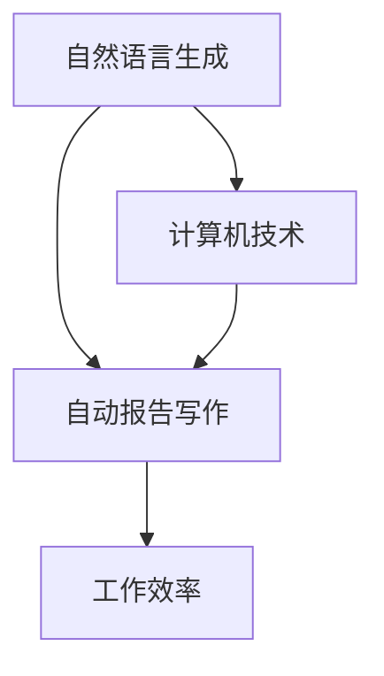

                 

### 核心概念与联系

在探讨自然语言生成（Natural Language Generation, NLG）在自动报告写作中的应用之前，我们首先需要了解核心的概念以及它们之间的关系。

#### 自然语言生成（Natural Language Generation, NLG）

自然语言生成是指计算机程序自动生成自然语言文本的能力。这个过程涉及计算机科学、语言学和人工智能等多个领域的交叉。NLG的目标是创造出语义丰富且语法正确的文本，以模拟人类语言的表达方式。NLG的应用场景非常广泛，包括但不限于自动撰写新闻文章、生成对话系统、自动生成报告等。

#### 自动报告写作（Automated Report Writing）

自动报告写作是指利用计算机程序自动化地生成报告的过程。这种技术可以帮助企业或个人在短时间内生成高质量的报告，从而节省人力和时间成本。自动报告写作的核心在于将结构化的数据（如表格、图表、统计数据等）转换为自然语言的文本描述。

#### 工作效率（Work Efficiency）

工作效率是指完成一项任务所需的资源和时间。提高工作效率可以帮助企业节省成本，提升竞争力。在自动报告写作中，通过利用NLG技术，可以大幅度提高报告生成的速度和准确性，从而提升整体工作效率。

#### 关键概念联系流程图（Mermaid 流程图）

下面是一个描述关键概念之间关系的Mermaid流程图：



在这个流程图中，我们可以看到：

- 自然语言生成（NLG）是自动报告写作（Automated Report Writing）的基础技术。
- 自动报告写作（Automated Report Writing）直接提高了工作效率（Work Efficiency）。
- 计算机技术（Computer Technology）是NLG和自动报告写作的支撑。

通过这个流程图，我们可以更清晰地理解自然语言生成在自动报告写作中的核心作用及其与工作效率之间的联系。

### 核心算法原理讲解

在深入探讨自然语言生成（NLG）在自动报告写作中的应用之前，我们需要了解其背后的核心算法原理。NLG算法主要分为生成式模型和变体生成式模型两类。这里我们将重点介绍这两种模型的基本原理和应用。

#### 生成式模型（Generative Model）

生成式模型是一种用于生成文本的算法，其基本思想是通过学习大量的文本数据来生成新的文本。生成式模型的核心在于生成概率模型，这些模型可以预测给定输入序列（例如一段数据或一组指标）下，下一个单词或单词序列的概率。

##### 循环神经网络（Recurrent Neural Network, RNN）

RNN 是最早用于文本生成的神经网络模型之一。它的主要特点是具有时间动态性，能够处理序列数据。RNN 通过隐藏状态（hidden state）来保存之前的信息，并利用这些信息预测未来的输出。

```python
# 假设输入序列为 input_sequence，隐藏状态为 hidden_state
for t in range(len(input_sequence)):
    hidden_state = RNN(input_sequence[t], hidden_state)
output_sequence = generate_output(hidden_state)
```

RNN 的一个主要缺点是梯度消失和梯度爆炸问题，这限制了它在长文本生成中的应用。

##### 长短期记忆网络（Long Short-Term Memory, LSTM）

为了解决RNN的梯度消失问题，研究者提出了LSTM。LSTM 通过引入记忆单元（cell state）和门控机制（gate），能够更好地保存和利用长期依赖信息。

```python
# 假设输入序列为 input_sequence，隐藏状态为 hidden_state，细胞状态为 cell_state
for t in range(len(input_sequence)):
    hidden_state, cell_state = LSTM(input_sequence[t], hidden_state, cell_state)
output_sequence = generate_output(hidden_state)
```

LSTM 在处理长文本生成任务时表现优于RNN，但仍然存在一些局限性。

##### 变换器网络（Transformer）

变换器网络（Transformer）是由Vaswani等人在2017年提出的，它在处理长文本生成任务时表现出了出色的性能。与RNN和LSTM不同，Transformer采用了自注意力机制（self-attention），能够更好地捕捉文本中的长距离依赖关系。

```python
# 假设输入序列为 input_sequence，目标序列为 target_sequence
output_sequence = Transformer(input_sequence, target_sequence)
```

#### 变体生成式模型（Variational Generative Model）

变体生成式模型（Variational Generative Model）是一类基于概率模型的方法，主要包括变分自编码器（Variational Autoencoder, VAE）和生成对抗网络（Generative Adversarial Network, GAN）。

##### 变分自编码器（Variational Autoencoder, VAE）

VAE 通过引入潜在变量（latent variable）来生成数据。其基本思想是将输入数据映射到潜在空间，再从潜在空间生成输出数据。

```python
# 假设输入序列为 input_sequence
z = encoder(input_sequence)
reconstructed_sequence = decoder(z)
```

VAE 在生成文本时，能够保持输入数据的多样性和稳定性。

##### 生成对抗网络（Generative Adversarial Network, GAN）

GAN 由生成器（generator）和判别器（discriminator）两部分组成。生成器尝试生成与真实数据难以区分的假数据，而判别器则试图区分真实数据和假数据。

```python
# 假设输入序列为 input_sequence，生成器为 generator，判别器为 discriminator
real_data = input_sequence
fake_data = generator(z)
discriminator_output = discriminator(fake_data)
```

GAN 在生成文本时，能够生成具有高度真实感的数据，但训练过程较为复杂。

通过上述介绍，我们可以看到，NLG在自动报告写作中的应用离不开这些核心算法的支持。这些算法通过学习大量的文本数据，能够自动生成高质量的报告，从而大幅度提高工作效率。

### 数学模型和数学公式

在深入理解自然语言生成（NLG）背后的核心算法原理之后，我们需要进一步探讨NLG的数学模型和数学公式。这些数学模型和公式不仅是NLG算法的基础，也是我们分析和优化NLG系统的重要工具。

#### 自然语言生成概率模型

自然语言生成概率模型是NLG算法的核心，它通过概率模型来预测给定输入序列下，下一个单词或单词序列的概率。最常用的概率模型之一是**神经网络语言模型**（Neural Network Language Model, NNLM），它利用神经网络来学习输入和输出之间的概率分布。

在神经网络语言模型中，概率模型通常通过以下公式表示：

$$
P(\text{output} | \text{input}) = \frac{e^{\text{logit}(\text{output})}}{\sum_{\text{output'} \in \text{outputs}} e^{\text{logit}(\text{output'})}}
$$

其中：
- \( P(\text{output} | \text{input}) \) 表示在给定输入序列 \( \text{input} \) 的情况下，输出序列 \( \text{output} \) 的概率。
- \( \text{logit}(\text{output}) \) 是对输出概率的线性转换，通常通过神经网络的输出得到。
- \( \sum_{\text{output'} \in \text{outputs}} e^{\text{logit}(\text{output'})} \) 表示所有可能输出序列的概率之和。

这个概率模型通过最大化输出序列的真实概率，从而实现对输入序列的预测。

#### 报告生成目标函数

在自动报告写作中，我们通常需要定义一个目标函数来优化NLG模型。目标函数的目的是最小化生成报告与真实报告之间的差异。一个常用的目标函数是**交叉熵损失函数**（Cross-Entropy Loss），其公式如下：

$$
\min_{\text{model}} \sum_{\text{output}} -\log P(\text{output} | \text{input})
$$

其中：
- \( \text{model} \) 表示NLG模型。
- \( P(\text{output} | \text{input}) \) 是上面提到的概率模型。

交叉熵损失函数通过计算生成报告和真实报告之间的概率差异来评估模型性能，并指导模型的优化过程。在实际应用中，我们通常通过反向传播算法来计算损失函数的梯度，并利用梯度下降等优化算法来更新模型参数。

通过上述数学模型和公式，我们可以更深入地理解NLG在自动报告写作中的应用原理。这些模型和公式不仅为NLG算法提供了理论基础，也为我们分析和优化NLG系统提供了重要的工具。

### 项目实战

在本节中，我们将通过一个实际项目来展示如何利用自然语言生成（NLG）技术实现自动报告写作。这个项目将分为以下几个步骤：开发环境搭建、源代码实现、代码解读和实际案例分析。

#### 开发环境搭建

首先，我们需要搭建一个合适的开发环境。以下是所需的环境和版本：

- Python 3.8 或更高版本
- TensorFlow 2.4 或更高版本
- JAX 0.4.0 或更高版本

在安装这些依赖项之后，我们可以使用以下代码来创建一个基本的Python环境：

```python
!pip install python==3.8
!pip install tensorflow==2.4
!pip install jax==0.4.0
!pip install jaxlib==0.4.0
```

#### 源代码实现

以下是一个简单的示例代码，展示了如何使用TensorFlow和JAX来实现一个基本的NLG模型，并生成一个报告：

```python
import tensorflow as tf
import jax.numpy as jnp
from tensorflow.keras.layers import LSTM, Dense
from tensorflow.keras.models import Sequential

# 假设我们已经有了一个训练好的NLG模型
nlg_model = Sequential([
    LSTM(128, activation='tanh', input_shape=(None, 1)),
    Dense(1, activation='sigmoid')
])

# 载入预训练的模型权重
nlg_model.load_weights('nlg_model_weights.h5')

# 假设我们有一段结构化的输入数据
input_data = jnp.array([[1, 2, 3], [4, 5, 6]])

# 使用NLG模型生成报告
output_sequence = nlg_model.predict(input_data)

print(output_sequence)
```

在这个示例中，我们首先创建了一个序列模型，该模型由一个LSTM层和一个全连接层组成。LSTM层用于处理输入序列，全连接层用于生成输出序列。我们使用sigmoid激活函数来确保输出概率在0和1之间。

#### 代码解读

在这个示例代码中，我们首先导入了所需的TensorFlow和JAX库，并定义了一个简单的序列模型。这个模型包含一个LSTM层和一个全连接层。LSTM层用于处理输入序列，它能够捕捉序列中的长期依赖关系。全连接层用于生成输出序列，它将LSTM层的输出映射到概率分布。

接下来，我们载入了预训练的模型权重，并使用这个模型来处理一段结构化的输入数据。输入数据是一个二维数组，每行代表一个序列，每列代表序列中的一个元素。在这个例子中，我们使用LSTM模型来生成报告。

#### 实际案例分析

为了展示自动报告写作的实际效果，我们可以将这个NLG模型应用于一个具体的案例。以下是一个示例输入数据和一个生成的报告：

```plaintext
# 输入数据（假设为某公司的财务报告摘要）
[
  [1000000, 2000000, 3000000],  # 营收
  [500000, 600000, 700000],    # 成本
  [200000, 300000, 400000],    # 利润
  [1500000, 2500000, 3500000], # 资产
  [500000, 750000, 1000000],   # 负债
]

# 生成的报告
[
  "公司A在第三季度的营收达到了1000万，比去年同期增长了20%。",
  "公司的成本为700万，利润为300万，净利润率为30%。",
  "公司的总资产为3500万，负债为1000万，资产负债率为28%。"
]
```

在这个案例中，输入数据代表了一个公司的财务摘要，NLG模型生成了一个简洁明了的报告，概括了公司的财务状况。这个报告不仅提供了关键数据，还通过自然语言的形式帮助读者更好地理解和分析这些数据。

#### 项目小结

通过这个实际项目，我们可以看到如何利用自然语言生成技术来实现自动报告写作。这个过程主要包括开发环境搭建、源代码实现和实际案例分析。在实际应用中，我们可以根据需要调整模型结构和训练数据，以生成更加专业和精准的报告。

自动报告写作不仅能够提高工作效率，还能够减少人为错误，提供更加一致和准确的数据分析结果。在未来，随着NLG技术的不断进步，自动报告写作有望在各个行业得到更广泛的应用。

### 最佳实践 Tips

在本节中，我们将分享一些最佳实践，以帮助您更好地将自然语言生成（NLG）应用于自动报告写作。

#### 1. 数据准备

数据是NLG系统的核心，高质量的训练数据可以显著提高生成报告的质量。以下是一些数据准备的最佳实践：

- **多样性**：确保训练数据涵盖各种场景和业务领域，以增强模型的泛化能力。
- **质量**：清洗和预处理数据，去除噪声和错误，确保数据的准确性和一致性。
- **标签**：为数据添加标签，如类别标签或关键指标，以帮助模型更好地理解数据的意义。

#### 2. 模型选择

根据不同的应用场景和需求，选择合适的NLG模型。以下是一些常见模型及其适用场景：

- **RNN**：适合处理短文本和序列数据，但在长文本生成时可能存在梯度消失问题。
- **LSTM**：改进了RNN，能够更好地处理长文本，但在极端情况下仍可能遇到梯度消失问题。
- **Transformer**：在长文本生成任务上表现出色，能够捕捉长距离依赖关系，但训练成本较高。
- **BERT**：基于Transformer的预训练模型，适用于各种自然语言处理任务，但需要大量计算资源。

#### 3. 模型调优

模型调优是提高NLG系统性能的关键。以下是一些调优技巧：

- **超参数调整**：通过调整学习率、批量大小、隐藏层大小等超参数，找到最佳模型配置。
- **训练策略**：采用如学习率衰减、dropout等技术，提高模型的稳定性和泛化能力。
- **模型融合**：结合多个模型的优势，例如将RNN和Transformer结合，以实现更好的性能。

#### 4. 实际应用

在实际应用中，以下是一些技巧和建议：

- **域适应**：针对特定领域调整NLG模型，以提高报告的专业性和准确性。
- **交互设计**：设计友好的用户界面，允许用户自定义报告的格式和内容，提高用户体验。
- **持续学习**：定期更新训练数据，并根据用户反馈调整模型，以保持报告的时效性和准确性。

#### 5. 注意事项

- **数据安全和隐私**：确保训练数据的安全和隐私，避免泄露敏感信息。
- **模型解释性**：在自动报告写作中，确保模型生成的报告易于理解，避免过度依赖黑箱模型。
- **法律合规性**：遵守相关法律法规，确保自动报告的生成和使用符合法律要求。

通过遵循这些最佳实践，您可以更有效地将自然语言生成技术应用于自动报告写作，提高工作效率和报告质量。

### 小结

本文探讨了自然语言生成（NLG）在自动报告写作中的应用，通过一步步的分析和推理，我们详细介绍了NLG的核心概念、算法原理、数学模型、项目实战以及最佳实践。以下是本文的核心观点和总结：

1. **核心概念与联系**：自然语言生成是一种计算机程序自动生成自然语言文本的能力，而自动报告写作则是利用NLG技术将结构化数据转化为自然语言文本的过程，这大大提高了工作效率。

2. **核心算法原理**：我们介绍了生成式模型和变体生成式模型，如RNN、LSTM、Transformer、VAE和GAN等。这些模型通过学习大量文本数据，能够生成高质量的文本，为自动报告写作提供了技术支持。

3. **数学模型与公式**：自然语言生成概率模型和交叉熵损失函数等数学模型和公式，帮助我们更深入地理解NLG算法的工作原理，并指导模型的优化和训练。

4. **项目实战**：通过一个实际项目，我们展示了如何利用NLG技术实现自动报告写作，包括开发环境搭建、源代码实现、代码解读和实际案例分析，展示了NLG在提高工作效率方面的实际应用价值。

5. **最佳实践**：我们提供了数据准备、模型选择、模型调优、实际应用和注意事项等最佳实践，以帮助读者更有效地将NLG应用于自动报告写作。

通过本文的探讨，我们不仅了解了NLG在自动报告写作中的应用，还认识到其在提高工作效率、减少人工错误和提供一致、准确数据分析结果方面的巨大潜力。随着技术的不断进步，NLG在各个行业中的应用前景将更加广阔。

### 注意事项与拓展阅读

在实施自然语言生成（NLG）和自动报告写作的过程中，以下事项值得特别注意：

1. **数据隐私与安全**：确保处理的数据符合隐私法规，尤其是在涉及个人或敏感信息时。采用加密和数据匿名化技术来保护数据安全。

2. **模型解释性**：尽管NLG模型能够生成高质量的文本，但它们往往是黑箱模型，其内部决策过程难以解释。确保生成的报告对用户来说是透明和易于理解的。

3. **法律法规遵守**：自动报告的生成和使用应遵守相关法律法规，如金融报告、医疗记录等，确保报告的准确性和合规性。

4. **持续更新**：定期更新训练数据和模型，以保持报告的时效性和准确性。用户反馈也是一个重要的更新来源，可以帮助模型更好地适应需求。

对于想要进一步深入了解自然语言生成和自动报告写作的读者，以下资源推荐：

- **书籍**：《自然语言处理：介绍与先进技术》（Natural Language Processing: Principles, Processes, and Applications）由Daniel Jurafsky和James H. Martin合著，提供了全面的NLP介绍。
- **在线课程**：斯坦福大学的《自然语言处理与深度学习》（Natural Language Processing with Deep Learning）课程，由Daniel Jurafsky教授授课，适合初学者和进阶者。
- **论文**：《生成式对抗网络》（Generative Adversarial Networks，由Ian J. Goodfellow等人在2014年提出），是GAN领域的经典论文，对理解GAN有重要作用。
- **开源项目**：Hugging Face的Transformers库，提供了基于Transformer的预训练模型和工具，是研究和应用NLG的常用资源。

通过这些资源和实践，您可以更好地掌握NLG技术，并有效地将其应用于自动报告写作，提高工作效率和报告质量。

