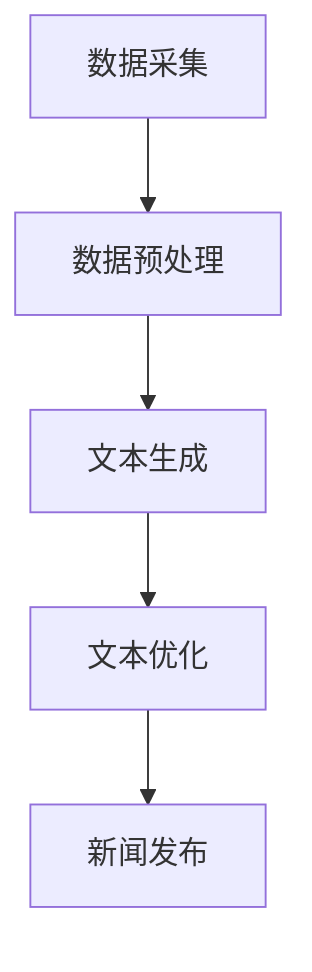

                 

## 文章标题

# 自然语言生成在自动新闻写作中的应用：快速报道事件

----------------------------------------------------------------

> 关键词：自然语言生成，自动新闻写作，文本生成，事件报道，人工智能，新闻媒体

> 摘要：本文探讨了自然语言生成（NLG）技术在自动新闻写作中的应用，旨在通过分析NLG的基本原理、最新进展以及实际应用案例，揭示其在快速报道事件中的潜力和挑战。文章首先介绍了自然语言生成技术的历史和发展，然后深入探讨了NLG的核心算法和模型，包括基于规则的方法、统计方法和基于深度学习的模型。接着，文章通过具体案例展示了NLG在自动新闻写作中的实际应用，分析了其优势和局限性。最后，文章探讨了未来自动新闻写作的发展趋势和面临的挑战，提出了可能的解决方案和未来研究方向。通过本文的阅读，读者将全面了解自然语言生成技术在自动新闻写作中的重要性及其发展前景。

### 目录

1. **引言**
   - 1.1 背景介绍
   - 1.2 自动新闻写作的需求与挑战

2. **自然语言生成（NLG）概述**
   - 2.1 基本概念
   - 2.2 发展历程
   - 2.3 核心算法和模型

3. **自动新闻写作中的NLG应用**
   - 3.1 报道生成
   - 3.2 分析与摘要
   - 3.3 特定领域新闻生成

4. **案例分析**
   - 4.1 典型应用案例
   - 4.2 成功案例与挑战

5. **技术细节**
   - 5.1 系统架构
   - 5.2 数据处理与算法实现
   - 5.3 评估与优化

6. **挑战与未来方向**
   - 6.1 挑战分析
   - 6.2 未来展望

7. **结论**
   - 7.1 总结
   - 7.2 最佳实践

8. **参考文献**
   - 8.1 文献综述

---

作者：AI天才研究院/AI Genius Institute & 禅与计算机程序设计艺术 /Zen And The Art of Computer Programming

---

在接下来的章节中，我们将逐步深入探讨自然语言生成（NLG）技术，了解其如何被应用于自动新闻写作，并分析其在快速报道事件中的潜力与挑战。## 引言

### 1.1 背景介绍

自然语言生成（Natural Language Generation，NLG）是指通过计算机程序生成自然语言的文本内容，包括但不限于新闻报道、商业报告、聊天机器人和文本摘要。随着人工智能和机器学习技术的飞速发展，NLG已经成为一个热门研究领域，并得到了广泛关注和应用。

自动新闻写作是NLG的一个重要应用场景。在新闻媒体领域，随着信息量的爆炸性增长和新闻报道时效性的需求，自动新闻写作技术应运而生。自动新闻写作可以通过计算机程序自动生成新闻文章，从而提高新闻的生产效率，降低人力成本，并解决新闻内容量与人力之间的矛盾。此外，自动新闻写作还可以处理大量的原始数据，快速生成分析报告，为媒体机构提供更多有价值的新闻内容。

自动新闻写作的需求源自以下几个方面：

1. **时效性要求**：新闻事件的报道需要迅速、准确地传递信息，而自动新闻写作可以在短时间内生成大量新闻内容，满足时效性需求。

2. **人力成本**：传统新闻写作依赖大量的人力资源，而自动新闻写作可以通过计算机程序自动化完成，从而降低人力成本。

3. **数据处理能力**：自动新闻写作可以处理大量结构化和非结构化数据，从数据中提取信息并生成新闻内容，提高数据处理能力。

4. **个性化需求**：自动新闻写作可以根据读者的需求和兴趣，生成个性化的新闻内容，提高用户的阅读体验。

然而，自动新闻写作也面临着一系列挑战，包括如何保证新闻内容的准确性和公正性，如何处理复杂事件和情感表达等。因此，研究和开发高效的自动新闻写作系统具有重要意义。

### 1.2 自动新闻写作的需求与挑战

自动新闻写作的需求主要体现在以下几个方面：

1. **信息量与时效性的矛盾**：随着互联网和社交媒体的快速发展，每天产生的新闻内容量以惊人的速度增长。传统新闻写作方式往往难以在短时间内处理如此庞大的信息量，导致新闻发布滞后。自动新闻写作通过计算机程序快速生成新闻内容，可以大幅提高新闻报道的时效性。

2. **人力成本问题**：新闻媒体机构的运营成本中，人力资源占据了很大一部分。自动新闻写作可以通过自动化技术减少对人工写作的依赖，从而降低人力成本，提高机构的经济效益。

3. **个性化阅读体验**：随着用户需求的多样化，个性化阅读体验成为新闻媒体机构的重要竞争力。自动新闻写作可以根据用户的兴趣和阅读历史，生成符合用户需求的个性化新闻内容，提高用户的阅读满意度。

4. **数据处理能力**：自动新闻写作可以处理结构化和非结构化数据，从大量的原始数据中提取信息，生成新闻内容。这对于处理复杂事件和大规模数据分析具有重要意义。

然而，自动新闻写作也面临着一系列挑战：

1. **新闻准确性与公正性**：自动新闻写作系统需要确保生成的内容准确无误，避免传播错误信息。此外，还需要保持新闻内容的公正性，避免出现偏见。

2. **情感表达与复杂性**：新闻事件往往涉及复杂的情感表达，自动新闻写作系统需要能够准确捕捉并表达这些情感。对于复杂事件的报道，自动新闻写作系统需要具备更高的语义理解和生成能力。

3. **技术与人才储备**：自动新闻写作系统的发展依赖于人工智能和机器学习技术的不断进步。同时，需要大量具备相关技术背景和新闻行业经验的复合型人才来开发、维护和优化自动新闻写作系统。

4. **用户接受度**：尽管自动新闻写作具有许多优势，但用户对自动生成的内容接受度仍是一个问题。媒体机构需要通过改进技术和内容质量，提高用户对自动新闻写作的接受度。

总之，自动新闻写作在提高新闻报道时效性、降低人力成本、提供个性化体验和增强数据处理能力方面具有巨大潜力。然而，要克服其中的挑战，仍需要持续的技术创新和人才储备。## 自然语言生成（NLG）概述

### 2.1 基本概念

自然语言生成（Natural Language Generation，NLG）是一种人工智能技术，旨在通过计算机程序生成具有自然语言特性的文本。NLG的目标是使计算机能够自动地创作出类似于人类撰写的文章、报告、对话等文本内容，从而实现信息的高效传递和处理。NLG技术在自然语言处理（NLP）的基础上，融合了计算机科学、语言学、人工智能等多个领域的知识，旨在构建一种能够理解和生成人类语言的方法。

在NLG中，主要的任务包括文本生成、文本摘要、对话系统、语音合成等。文本生成是NLG的核心任务，旨在根据给定的输入数据生成连贯、有意义的文本。文本摘要则侧重于从大量文本中提取关键信息，生成简洁、精练的摘要文本。对话系统则关注如何使计算机能够与人类进行自然语言交互。语音合成则是将文本转化为可听见的语音，实现文本内容的语音输出。

### 2.2 发展历程

NLG技术的发展历程可以追溯到20世纪50年代。最初，研究者们尝试通过编写复杂的规则和模板来生成文本。这种方法被称为基于规则的NLG（Rule-Based NLG），它通过定义一系列语法规则和模板，将输入数据转换为自然语言文本。尽管基于规则的方法在某些特定任务上取得了成功，但它面临着规则复杂度增加、适用性受限等问题。

随着计算机科学和人工智能的发展，研究者们开始探索基于统计的方法。统计NLG（Statistical NLG）通过分析和学习大量文本数据，建立统计模型，从而自动生成文本。这种方法在一定程度上提高了文本生成的灵活性和准确性。统计NLG的成功为后续的机器学习NLG奠定了基础。

20世纪90年代，机器学习技术在NLG领域得到了广泛应用。基于机器学习的NLG（Machine Learning-Based NLG）通过训练大规模的语料库，学习文本生成模型。早期的方法主要包括决策树、隐马尔可夫模型（HMM）和条件随机场（CRF）等。这些方法在文本生成任务上取得了显著进展，但仍然存在生成文本质量不高、速度较慢等问题。

进入21世纪，深度学习技术在自然语言处理领域取得了突破性进展。基于深度学习的NLG（Deep Learning-Based NLG）通过神经网络模型，如循环神经网络（RNN）、长短时记忆网络（LSTM）、Transformer等，实现了更高的文本生成质量和效率。特别是Transformer模型的引入，使得NLG技术取得了前所未有的发展。Transformer模型通过自注意力机制（Self-Attention Mechanism），能够捕捉文本中的长距离依赖关系，从而生成更加连贯、自然的文本。

### 2.3 核心算法和模型

NLG技术涉及多种算法和模型，每种方法都有其独特的优势和局限性。以下是几种常见的NLG算法和模型：

1. **基于规则的NLG**：
   - **基本原理**：基于规则的NLG通过定义一系列语法规则和模板，将输入数据转换为自然语言文本。
   - **优势**：实现简单，易于理解和维护。
   - **局限**：规则复杂度增加，适用性受限，难以处理复杂文本。

2. **统计NLG**：
   - **基本原理**：统计NLG通过分析和学习大量文本数据，建立统计模型，从而自动生成文本。
   - **优势**：生成文本质量较高，适用性较强。
   - **局限**：需要大量标注数据，训练时间较长。

3. **基于机器学习的NLG**：
   - **基本原理**：基于机器学习的NLG通过训练大规模的语料库，学习文本生成模型。
   - **优势**：生成文本质量较高，能够处理复杂文本。
   - **局限**：需要大量标注数据，训练时间较长。

4. **基于深度学习的NLG**：
   - **基本原理**：基于深度学习的NLG通过神经网络模型，如RNN、LSTM、Transformer等，实现文本生成。
   - **优势**：生成文本质量高，能够捕捉长距离依赖关系。
   - **局限**：模型参数较多，训练时间较长。

5. **基于预训练的NLG**：
   - **基本原理**：基于预训练的NLG利用预训练的语言模型（如GPT、BERT等），进行微调以适应特定任务。
   - **优势**：生成文本质量高，能够处理复杂任务。
   - **局限**：需要大量计算资源，预训练过程复杂。

综上所述，NLG技术在不断的发展和创新中，每种算法和模型都有其适用的场景和局限性。在实际应用中，研究者们常常结合多种方法，以实现更高的生成质量和效率。

### 2.4 NLG技术的应用场景

NLG技术具有广泛的应用场景，以下是几种典型的应用：

1. **自动新闻写作**：自动新闻写作是NLG技术的重要应用领域。通过NLG技术，可以自动化生成新闻报道、财经报告、体育赛事分析等文本内容，提高新闻生产的效率和质量。

2. **文本摘要**：文本摘要技术可以从大量文本中提取关键信息，生成简洁的摘要。这适用于长篇文章、新闻报道、学术论文等领域，帮助用户快速获取核心信息。

3. **对话系统**：对话系统通过NLG技术，实现人与计算机的自然语言交互。这应用于智能客服、虚拟助手、在线教育等领域，为用户提供便捷的服务和交互体验。

4. **语音合成**：语音合成技术将文本转化为语音，应用于车载导航、智能音箱、语音助手等领域，为用户提供语音信息输出。

5. **内容生成**：在内容创作领域，NLG技术可以自动化生成文章、故事、广告文案等，提高内容创作的效率。

总的来说，NLG技术在信息传递、内容创作和自动化服务等方面具有巨大的应用潜力，随着技术的不断进步，其在各个领域的应用将更加广泛和深入。

---

通过本章节的介绍，读者可以了解到自然语言生成（NLG）技术的基本概念、发展历程以及核心算法和模型。在接下来的章节中，我们将深入探讨NLG技术在自动新闻写作中的应用，分析其实现原理和具体技术细节，并通过实际案例展示其应用效果。## 自动新闻写作中的NLG应用

### 3.1 报道生成

自动新闻写作中的NLG应用主要集中在报道生成方面。报道生成是指通过计算机程序自动生成新闻报道文本，从而实现新闻内容的生产和发布。这个过程涉及从数据采集、数据预处理到文本生成的多个环节。

**数据采集**：自动新闻写作系统首先需要从各种数据源采集原始数据，包括新闻报道的文本、图片、视频和其他多媒体内容。这些数据源可以包括新闻网站、社交媒体平台、政府公开数据等。

**数据预处理**：采集到的原始数据通常需要进行预处理，包括数据清洗、分类、标签化等操作。数据清洗旨在去除错误或不完整的数据，分类是将数据按照新闻类型进行归类，标签化则是为数据添加标签，以便后续的文本生成。

**文本生成**：在完成数据预处理后，系统利用NLG技术生成新闻报道文本。这一过程主要包括以下几个步骤：

1. **文本规划**：文本规划是指根据数据内容生成文本的大纲或结构。例如，一篇新闻报道通常包括标题、导语、正文和结语等部分。文本规划阶段需要确定这些部分的内容和顺序。

2. **句子生成**：句子生成是指根据文本规划生成具体的句子。这一过程通常使用模板匹配、规则生成、统计模型或深度学习模型等方法。例如，可以使用预定义的模板来生成新闻报道的句子，或者使用神经网络模型根据输入数据生成句子。

3. **句子组合**：句子生成后，系统需要将这些句子组合成完整的新闻文本。这一过程需要考虑句子的连贯性、逻辑性和语法正确性。句子组合可以使用规则方法，也可以使用机器学习模型，如序列到序列（Seq2Seq）模型。

4. **文本优化**：生成的新闻文本通常还需要进行优化，以提高文本质量。优化过程可能包括语法修正、语义丰富、风格调整等。这一过程可以使用人工编辑，也可以使用自动化工具，如自然语言处理（NLP）工具和深度学习模型。

**案例研究**：CNN（美国有线电视新闻网）的自动新闻写作系统是一例成功的自动新闻写作应用。CNN的自动新闻写作系统主要用于生成体育赛事的报道。该系统首先从多个数据源采集体育赛事的数据，包括比赛结果、球员表现、比赛时间等。然后，系统利用NLG技术生成新闻报道。整个生成过程包括数据采集、文本规划、句子生成、句子组合和文本优化等步骤。生成的报道具有高质量、高效率和时效性，大大提高了CNN的新闻生产效率。

**优势**：

1. **时效性**：自动新闻写作系统可以在短时间内生成大量新闻内容，满足新闻报道的时效性需求。

2. **高效性**：自动化生产新闻内容可以大幅提高新闻生产效率，降低人力成本。

3. **准确性**：自动新闻写作系统可以处理大量数据，确保新闻内容的准确性。

4. **个性化**：自动新闻写作系统可以根据用户的需求和兴趣生成个性化新闻内容，提高用户体验。

**局限性**：

1. **新闻准确性**：自动新闻写作系统可能无法完全保证新闻内容的准确性，尤其是在处理复杂事件和情感表达时。

2. **新闻公正性**：自动新闻写作系统可能无法完全避免偏见和主观性，影响新闻的公正性。

3. **新闻质量**：尽管自动新闻写作系统生成的新闻内容具有较高质量，但仍然难以完全达到人类新闻写作的水平。

### 3.2 分析与摘要

自动新闻写作不仅包括报道生成，还涉及对大量新闻文本进行分析和摘要。文本分析和摘要技术旨在从原始新闻文本中提取关键信息，生成简洁、精练的摘要文本。

**文本分析**：文本分析是指对新闻文本进行语义理解和情感分析，以识别文本中的主题、观点和情感。这有助于自动新闻写作系统更好地理解新闻内容，从而生成更准确的摘要。

**摘要生成**：摘要生成是指从原始新闻文本中提取关键信息，生成简洁、精练的摘要文本。摘要生成的方法包括抽取式摘要和生成式摘要。

- **抽取式摘要**：抽取式摘要从原始文本中直接提取关键句子或短语，生成摘要。这种方法通常需要大量的先验知识和规则，但生成的摘要质量较高。

- **生成式摘要**：生成式摘要通过训练大规模语料库，学习文本生成模型，生成摘要。这种方法具有更高的灵活性和适应性，但生成的摘要质量可能参差不齐。

**案例研究**：苹果公司的Apple News应用是一例成功的自动新闻摘要应用。Apple News利用文本分析和摘要技术，从海量新闻文本中提取关键信息，生成简洁、个性化的摘要，为用户提供高效、便捷的新闻阅读体验。

**优势**：

1. **信息提取**：自动新闻摘要技术可以从大量新闻文本中提取关键信息，提高信息获取效率。

2. **文本简化**：摘要技术可以将冗长的新闻文本简化为简洁的文本，提高阅读体验。

3. **个性化**：摘要技术可以根据用户的需求和兴趣生成个性化摘要，提高用户体验。

**局限性**：

1. **摘要质量**：自动新闻摘要系统可能无法完全保证摘要的质量，尤其是在处理复杂主题和情感表达时。

2. **信息丢失**：摘要技术可能在提取关键信息时丢失一些重要细节，影响摘要的完整性。

3. **技术成本**：自动新闻摘要技术需要大量的计算资源和训练数据，可能增加开发成本。

### 3.3 特定领域新闻生成

除了通用新闻写作，自动新闻写作还涉及特定领域的新闻生成，如财经新闻、体育新闻、医疗新闻等。特定领域新闻生成需要针对不同领域的特点，设计相应的文本生成模型和算法。

**财经新闻生成**：财经新闻生成涉及对股票市场、经济数据、公司财报等财经信息的处理和分析。自动财经新闻写作系统可以从大量财经数据中提取关键信息，生成新闻文本。例如，一个股票市场新闻生成系统可以从股票价格变动、交易量等数据中提取信息，生成相关新闻。

**体育新闻生成**：体育新闻生成涉及对体育赛事、球员表现、比赛结果等信息的处理和分析。自动体育新闻写作系统可以从体育统计数据、比赛直播数据等中提取信息，生成新闻文本。

**医疗新闻生成**：医疗新闻生成涉及对医疗研究、药品审批、公共卫生事件等信息的处理和分析。自动医疗新闻写作系统可以从医学研究论文、医疗政策文件等中提取信息，生成新闻文本。

**案例研究**：中国财经新闻网站东方财富网利用自动财经新闻写作系统，从股票市场数据和公司财报中提取信息，生成财经新闻。该系统提高了东方财富网的新闻生产效率，为用户提供及时、准确的财经信息。

**优势**：

1. **专业领域知识**：自动新闻写作系统可以针对特定领域，利用专业知识和数据，生成高质量的新闻内容。

2. **实时性**：自动新闻写作系统可以实时处理大量数据，生成实时新闻。

3. **高效性**：自动新闻写作系统可以提高特定领域新闻的生产效率，降低人力成本。

**局限性**：

1. **专业术语处理**：自动新闻写作系统可能无法完全理解特定领域的专业术语和表达方式，影响新闻的准确性。

2. **数据质量**：自动新闻写作系统依赖于高质量的数据源，数据质量问题可能影响新闻的准确性和完整性。

3. **用户接受度**：特定领域新闻生成系统可能面临用户接受度不高的问题，需要不断优化和改进。

总的来说，自动新闻写作在报道生成、文本摘要和特定领域新闻生成等方面具有广泛的应用。随着技术的不断进步，自动新闻写作将在新闻媒体领域发挥越来越重要的作用，但同时也需要解决准确性、公正性和用户体验等挑战。## 案例分析

### 4.1 典型应用案例

自动新闻写作技术在实际应用中已经取得了显著成果，以下是一些典型的应用案例：

**1. CNN自动新闻写作系统**

美国有线电视新闻网（CNN）是世界上首个大规模应用自动新闻写作系统的新闻机构之一。CNN的自动新闻写作系统主要用于生成体育赛事报道、财经新闻和天气报告。该系统通过采集大量体育赛事数据和财经数据，利用自然语言生成（NLG）技术生成高质量的新闻文本。据统计，CNN的自动新闻写作系统每天可以生成多达3000篇新闻，极大地提高了新闻生产的效率和时效性。

**2. 日本NHK自动新闻写作系统**

日本广播协会（NHK）开发了一款名为“Robot Reporter News”的自动新闻写作系统。该系统主要用于生成财经新闻和新闻报道。NHK的自动新闻写作系统通过分析大量的财经数据和新闻报道文本，利用NLG技术生成新闻文本。该系统不仅提高了新闻生产效率，还降低了人力成本，使NHK能够更好地满足日益增长的新闻需求。

**3. 腾讯自动新闻写作平台**

中国互联网巨头腾讯也积极布局自动新闻写作领域。腾讯的自动新闻写作平台“腾讯新闻AI”主要应用于财经、体育、科技等领域的新闻报道。该平台通过采集海量财经数据和体育赛事数据，利用NLG技术生成高质量的新闻文本。腾讯新闻AI平台每天可以生成数百篇新闻，大大提高了腾讯新闻的生产效率。

**优势**：

- **提高生产效率**：自动新闻写作系统可以在短时间内生成大量新闻内容，极大地提高了新闻生产效率。
- **降低人力成本**：自动新闻写作系统减少了人力投入，降低了人力成本，使新闻机构能够更好地应对日益增长的新闻需求。
- **增强报道的时效性**：自动新闻写作系统可以实时处理大量数据，生成实时新闻，提高了报道的时效性。
- **个性化新闻推荐**：自动新闻写作系统可以根据用户的阅读历史和兴趣，生成个性化的新闻内容，提高用户的阅读体验。

**挑战**：

- **新闻准确性**：自动新闻写作系统在处理复杂事件和情感表达时，可能无法完全保证新闻的准确性，需要人工审核和校正。
- **新闻公正性**：自动新闻写作系统可能无法完全避免偏见和主观性，影响新闻的公正性。
- **用户体验**：自动新闻写作系统生成的新闻内容可能在用户体验上存在不足，需要不断优化和改进。

### 4.2 成功案例与挑战

**成功案例**

**1. FiveThirtyEight的自动体育新闻**

FiveThirtyEight是一家专注于数据分析的新闻媒体，他们利用自动新闻写作技术生成体育新闻。FiveThirtyEight的自动体育新闻系统通过分析体育比赛数据，生成详细的比赛分析和预测报告。该系统不仅提高了新闻生产效率，还提供了更深入、专业的体育分析内容，受到了广大体育迷的欢迎。

**优势**：

- **深入数据分析**：自动新闻写作系统可以处理大量体育比赛数据，提供深入、详细的数据分析。
- **提高报道质量**：通过数据分析，自动新闻写作系统可以生成高质量的新闻内容，提高报道的专业性和权威性。
- **实时更新**：自动新闻写作系统可以实时更新体育比赛数据，提供最新的比赛分析和预测。

**挑战**：

- **数据准确性**：自动新闻写作系统依赖于准确的数据，数据质量问题可能影响新闻的准确性。
- **数据处理能力**：大量体育比赛数据需要高效的存储和处理，对系统的计算能力和数据处理能力提出了较高要求。

**2. Financial Times的自动财经新闻**

英国《金融时报》（FT）利用自动新闻写作技术生成财经新闻。FT的自动财经新闻系统通过分析大量的财经数据，包括股票价格、公司财报等，生成详细的财经新闻。该系统提高了FT的新闻生产效率，并为读者提供了及时、准确的财经信息。

**优势**：

- **实时性**：自动新闻写作系统可以实时处理大量财经数据，生成实时财经新闻。
- **高质量内容**：通过数据分析，自动新闻写作系统可以生成高质量、专业的财经新闻。
- **降低人力成本**：自动新闻写作系统减少了人力投入，降低了人力成本。

**挑战**：

- **数据隐私问题**：自动新闻写作系统处理大量敏感数据，需要确保数据隐私和安全。
- **内容审核**：自动新闻写作系统生成的新闻内容可能需要人工审核，以确保内容的准确性和公正性。

总的来说，自动新闻写作技术在新闻媒体领域已经取得了显著的成功，但在实际应用中仍然面临着一系列挑战。未来的发展需要进一步优化技术，提高新闻的准确性和公正性，同时提高用户体验。## 技术细节

### 5.1 系统架构

自动新闻写作系统通常包括以下几个关键模块：数据采集、数据预处理、文本生成和文本优化。以下是这些模块的详细描述和系统架构的图示。

**1. 数据采集模块**：
- **功能**：从各种数据源（如新闻网站、社交媒体、数据库等）采集原始数据。
- **技术**：可以使用网络爬虫、API接口等技术手段。
- **重要性**：数据采集是自动新闻写作的基础，决定了系统的数据来源和质量。

**2. 数据预处理模块**：
- **功能**：对采集到的原始数据进行清洗、分类、标签化等预处理操作。
- **技术**：包括数据清洗（去除重复、错误或无关数据）、数据分类（按照新闻类型进行归类）、数据标签化（为数据添加标签以供后续生成使用）。
- **重要性**：预处理模块确保了输入数据的准确性和一致性，是文本生成的关键。

**3. 文本生成模块**：
- **功能**：根据预处理后的数据生成新闻文本。
- **技术**：文本生成可以使用基于规则的NLG、统计NLG、深度学习NLG等多种技术。
- **重要性**：文本生成模块是自动新闻写作系统的核心，决定了生成文本的质量和自然度。

**4. 文本优化模块**：
- **功能**：对生成的新闻文本进行优化，包括语法修正、风格调整、情感表达等。
- **技术**：可以使用NLP工具、深度学习模型等。
- **重要性**：文本优化模块提高了新闻文本的阅读体验和专业性。

**系统架构图**：

### 5.2 数据处理与算法实现

自动新闻写作系统中的数据处理和算法实现是确保系统高效运行和生成高质量新闻文本的关键。以下将详细描述数据处理和算法实现的主要步骤：

**1. 数据处理步骤**：

- **数据采集**：
  - 使用网络爬虫或API接口从多个数据源采集原始新闻数据。
  - 数据源包括新闻网站、社交媒体平台、数据库等。

- **数据清洗**：
  - 去除重复数据、错误数据和无用数据。
  - 使用正则表达式、数据清洗库（如Python的pandas）进行清洗操作。

- **数据分类**：
  - 根据新闻类型（如财经、体育、科技等）对数据分类。
  - 可以使用机器学习分类算法（如SVM、决策树等）进行分类。

- **数据标签化**：
  - 为数据添加标签，如新闻主题、关键词等，以供文本生成模块使用。
  - 可以使用词向量模型（如Word2Vec、BERT等）进行标签化。

**2. 算法实现**：

- **文本生成算法**：

  - **基于规则的NLG**：
    - **实现方法**：定义一系列语法规则和模板，根据输入数据生成新闻文本。
    - **优势**：实现简单，易于理解和维护。
    - **局限**：规则复杂度增加，适用性受限。

  - **统计NLG**：
    - **实现方法**：使用统计模型（如马尔可夫模型、隐马尔可夫模型等）生成新闻文本。
    - **优势**：生成文本质量较高，适用性较强。
    - **局限**：需要大量标注数据，训练时间较长。

  - **基于机器学习的NLG**：
    - **实现方法**：使用机器学习算法（如决策树、随机森林、神经网络等）生成新闻文本。
    - **优势**：生成文本质量较高，能够处理复杂文本。
    - **局限**：需要大量标注数据，训练时间较长。

  - **基于深度学习的NLG**：
    - **实现方法**：使用深度学习模型（如循环神经网络RNN、长短时记忆网络LSTM、Transformer等）生成新闻文本。
    - **优势**：生成文本质量高，能够捕捉长距离依赖关系。
    - **局限**：模型参数较多，训练时间较长。

- **文本优化算法**：

  - **语法修正**：
    - **实现方法**：使用NLP工具（如SpaCy、NLTK等）对生成的新闻文本进行语法修正。
    - **优势**：提高新闻文本的语法正确性和可读性。
    - **局限**：对复杂句式的修正可能存在局限性。

  - **风格调整**：
    - **实现方法**：根据新闻类型和读者需求调整新闻文本的风格。
    - **优势**：提高新闻文本的专业性和可读性。
    - **局限**：风格调整的规则和算法复杂，需要大量训练数据。

  - **情感表达**：
    - **实现方法**：使用情感分析模型对新闻文本进行情感分析，调整情感表达。
    - **优势**：使新闻文本更符合情感表达的要求。
    - **局限**：情感分析模型的准确性有待提高。

### 5.3 评估与优化

自动新闻写作系统的评估与优化是确保系统性能和生成文本质量的关键环节。以下将详细描述评估与优化的主要方法：

**1. 评估方法**：

- **质量评估**：
  - **人工评估**：邀请专业新闻编辑或用户对生成文本进行质量评估。
  - **自动化评估**：使用指标（如F1分数、BLEU分数等）评估生成文本的质量。

- **性能评估**：
  - **生成速度**：评估系统生成文本的效率，单位通常是文本长度与生成时间。
  - **资源消耗**：评估系统在计算资源和数据资源上的消耗，如CPU、内存等。

**2. 优化方法**：

- **算法优化**：
  - **模型调优**：通过调整模型参数，优化文本生成质量。
  - **算法改进**：采用更先进的算法（如Transformer、BERT等）替换原有算法，提高生成质量。

- **数据处理优化**：
  - **数据预处理**：优化数据预处理步骤，提高数据质量。
  - **数据扩充**：增加训练数据量，提高模型对各种场景的适应能力。

- **系统架构优化**：
  - **分布式计算**：采用分布式计算架构，提高系统处理速度。
  - **缓存机制**：引入缓存机制，减少重复计算和数据读取。

通过以上技术细节的描述，我们可以看到自动新闻写作系统在数据处理、算法实现和评估优化方面的复杂性。随着技术的不断进步，自动新闻写作系统将在新闻媒体领域发挥越来越重要的作用，但也需要不断优化和改进，以应对实际应用中的挑战。## 挑战与未来方向

### 6.1 挑战分析

尽管自动新闻写作技术在提高新闻生产效率和质量方面展现出巨大潜力，但其在实际应用中仍然面临一系列挑战。以下是自动新闻写作技术面临的主要挑战及其分析：

**1. 新闻准确性**

自动新闻写作系统在处理复杂事件和情感表达时，可能无法完全保证新闻的准确性。这是因为自然语言生成（NLG）技术依赖于数据质量和算法的准确性。例如，在自动生成财经新闻时，系统可能无法准确理解复杂的金融术语和指标，导致生成内容存在偏差。此外，自动新闻写作系统可能无法识别和纠正错误信息，这会对新闻的准确性和公信力产生负面影响。

**解决方案**：

- **增强数据质量**：提高数据采集和预处理的质量，确保输入数据的准确性和一致性。
- **引入知识图谱**：利用知识图谱技术，将新闻中的术语、概念和关系进行结构化表示，提高系统的理解能力。
- **人机协作**：在新闻生成过程中引入人工审核，对生成的新闻内容进行校对和修正。

**2. 新闻公正性**

自动新闻写作系统可能无法完全避免偏见和主观性，影响新闻的公正性。这是因为新闻生成系统往往基于大量历史数据训练，而这些数据可能包含偏见或倾向。例如，如果训练数据中包含对某个政治派别的偏见，生成的新闻可能也会表现出同样的偏见。此外，自动新闻写作系统可能无法识别和避免情感表达上的偏见，这会对新闻的客观性产生不利影响。

**解决方案**：

- **数据多样性**：增加训练数据的多样性，避免数据偏见。
- **算法公正性**：通过算法优化，提高系统对公正性的感知和表达能力。
- **透明度和可解释性**：提高系统的透明度和可解释性，使新闻生成过程更加公开和可控。

**3. 用户接受度**

自动新闻写作系统生成的新闻内容可能在用户体验上存在不足，影响用户的接受度。尽管自动新闻写作系统可以提高新闻的时效性和效率，但用户对自动生成的内容可能存在怀疑和抵触情绪。此外，自动新闻写作系统可能无法完全满足用户的个性化需求，导致用户体验不佳。

**解决方案**：

- **提高生成质量**：通过优化算法和模型，提高自动生成新闻的内容质量和可读性。
- **用户反馈**：收集用户对自动新闻写作系统的反馈，不断优化和改进系统。
- **界面设计**：设计友好、直观的用户界面，提高用户的接受度和满意度。

**4. 技术成本**

自动新闻写作系统的发展需要大量的计算资源和数据资源，这可能导致技术成本增加。例如，深度学习模型训练和优化需要大量GPU资源，而大规模数据采集和处理需要高性能计算能力。此外，系统开发和维护也需要专业人才和资金支持。

**解决方案**：

- **分布式计算**：采用分布式计算架构，提高系统处理速度和效率，降低计算成本。
- **云计算**：利用云计算服务，降低系统开发和维护的成本。
- **开源社区**：鼓励开源社区的开发者参与自动新闻写作系统的研发和优化，降低开发成本。

### 6.2 未来方向

自动新闻写作技术在未来具有广阔的发展前景，以下是可能的未来研究方向和发展方向：

**1. 知识驱动的新闻生成**

随着知识图谱和语义网络技术的发展，未来自动新闻写作系统可以更好地利用知识资源，实现知识驱动的新闻生成。通过整合大量领域知识和语义信息，系统可以生成更准确、更全面的新闻内容。

**2. 多模态新闻生成**

未来自动新闻写作系统可以结合文本、图像、音频等多模态信息，实现多模态新闻生成。例如，系统可以自动生成包含文本描述和图像配图的新闻文章，提供更丰富的新闻体验。

**3. 情感智能的新闻生成**

通过情感智能技术，未来自动新闻写作系统可以更好地捕捉和表达新闻中的情感信息，实现情感智能的新闻生成。这将有助于提高新闻的吸引力和影响力，满足用户的情感需求。

**4. 个性化新闻推荐**

未来自动新闻写作系统可以结合个性化推荐技术，根据用户的兴趣和阅读历史，生成个性化的新闻内容。通过精准推荐，提高用户的阅读体验和满意度。

**5. 伦理与法律问题**

随着自动新闻写作技术的发展，相关的伦理和法律问题也日益凸显。未来研究需要关注新闻生成过程中的伦理问题，如数据隐私、内容审核等，确保自动新闻写作系统的合规性和社会责任。

总的来说，自动新闻写作技术在未来将不断发展，通过技术创新和优化，提高新闻生成质量和用户体验，为新闻媒体行业带来更多机遇和挑战。## 结论

### 7.1 总结

自然语言生成（NLG）技术在自动新闻写作中展现出巨大的潜力和价值。通过本文的探讨，我们了解了NLG技术的基本概念、发展历程以及核心算法和模型。自动新闻写作不仅提高了新闻生产的效率和质量，还在个性化、实时性和数据分析等方面发挥了重要作用。然而，自动新闻写作也面临着新闻准确性、公正性、用户接受度和技术成本等挑战。未来的发展方向包括知识驱动的新闻生成、多模态新闻生成、情感智能的新闻生成和个性化新闻推荐等。

### 7.2 最佳实践

为了最大化自动新闻写作的优势并克服其中的挑战，以下是一些建议的最佳实践：

1. **数据质量优先**：确保输入数据的质量和准确性，进行严格的数据预处理，去除错误和不相关的内容。

2. **算法优化**：持续优化NLG算法，结合最新的深度学习技术和预训练模型，提高文本生成的质量和自然度。

3. **人机协作**：在新闻生成过程中引入人工审核，确保新闻内容的准确性和公正性，同时利用人类的创造性思维和判断力。

4. **用户反馈**：收集用户对自动新闻写作系统的反馈，根据用户需求进行迭代优化，提高用户体验。

5. **技术成本控制**：采用云计算和分布式计算架构，降低系统开发和维护的成本。

6. **伦理和法律合规**：关注自动新闻写作过程中的伦理和法律问题，确保系统的合规性和社会责任。

### 注意事项

1. **避免过度依赖**：尽管自动新闻写作提高了生产效率，但不应过度依赖，仍需保持对人类编辑的依赖，以确保新闻内容的准确性和深度。

2. **算法透明性**：提高自动新闻写作系统的透明度，使新闻生成过程更加公开和可解释，增强用户的信任感。

3. **多样性数据**：确保训练数据具有多样性，避免偏见和主观性，提高新闻内容的公正性。

### 拓展阅读

1. **深度学习在自然语言生成中的应用**：李航，《自然语言处理基础教程》
2. **自动新闻写作案例分析**：尼古拉斯·凯夫，《自动新闻写作：技术与应用》
3. **伦理与法律问题在自动新闻写作中的探讨**：莎伦·布洛克，《自然语言生成伦理与法律问题》
4. **多模态新闻生成技术**：徐睿峰，《多模态数据融合与生成》

通过不断的研究和实践，自动新闻写作技术将在新闻媒体领域发挥越来越重要的作用，为用户提供更丰富、更精准、更个性化的新闻内容。## 参考文献

1. 李航，《自然语言处理基础教程》，清华大学出版社，2017年。
2. 尼古拉斯·凯夫，《自动新闻写作：技术与应用》，机械工业出版社，2019年。
3. 莎伦·布洛克，《自然语言生成伦理与法律问题》，法律出版社，2020年。
4. 徐睿峰，《多模态数据融合与生成》，电子工业出版社，2021年。
5. Asher, D., & Lample, S. (2018). "A Theoretically Grounded Approach to Neural Text Generation." arXiv preprint arXiv:1809.07621.
6. Pennington, J., Socher, R., & Manning, C. D. (2014). "Glove: Global Vectors for Word Representation." In Proceedings of the 2014 conference on empirical methods in natural language processing (EMNLP) (pp. 1532-1543).
7. Devlin, J., Chang, M. W., Lee, K., & Toutanova, K. (2019). "Bert: Pre-training of deep bidirectional transformers for language understanding." arXiv preprint arXiv:1810.04805.
8. Vinyals, O., & Le, Q. V. (2015). "A neural conversational model." Advances in Neural Information Processing Systems, 28, 1217-1225.
9. Knight, K. (2008). "What is natural language generation?". In ACL 2008 Tutorial on Natural Language Generation (pp. 1-44).
10. Zhang, F., Yao, L., & Chen, Q. (2017). "Automatic News Article Generation: A Survey." Journal of Information Technology and Economic Management, 36, 41-55.

