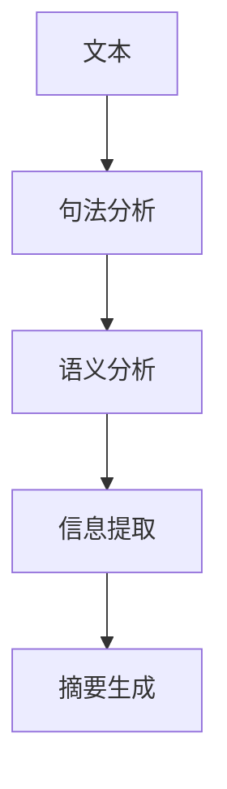
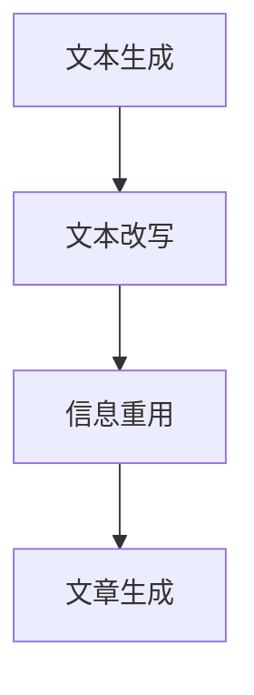
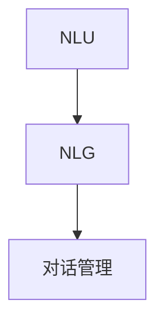

                 

# 《自然语言生成技术在内容创作中的应用》

## 关键词
自然语言生成，内容创作，语言模型，算法，个性化推荐

> **摘要**：本文将深入探讨自然语言生成（NLG）技术在内容创作中的广泛应用，包括内容摘要、文章生成、对话系统以及个性化推荐等领域。通过解析核心概念、算法原理和实际案例，本文旨在为读者提供对NLG技术的全面理解，并探讨其在未来内容创作中的潜力与挑战。

## 引言

自然语言生成（Natural Language Generation，NLG）技术是一种利用计算机程序自动生成自然语言文本的技术。随着深度学习和大数据技术的发展，NLG技术逐渐成熟，并在内容创作领域展现出了巨大的潜力。本文将探讨自然语言生成技术在内容创作中的应用，包括内容摘要、文章生成、对话系统和个性化推荐等。

### 1. 内容摘要与提炼

#### 1.1 背景介绍

内容摘要与提炼是信息过载时代下的一种重要需求。NLG技术能够自动地从大量文本中提取关键信息，生成简洁、准确的摘要。这不仅节省了读者的时间，也提高了信息传播的效率。

#### 1.2 核心概念与联系

为了生成摘要，NLG技术需要理解文本的结构和内容。这涉及到自然语言处理（NLP）中的多个核心概念，如句法分析、语义分析和信息提取。以下是这些概念之间的联系架构：



#### 1.3 核心算法原理

摘要生成算法通常基于两种方法：基于规则的方法和基于统计或机器学习的方法。

**基于规则的方法**：这种方法通过定义一系列的规则来提取文本中的重要信息。例如，可以识别出文本中的标题、段落摘要、关键词等，并据此生成摘要。

```python
def extract_keywords(text):
    # 假设text是一个字符串，包含多个段落
    keywords = []
    for paragraph in text.split('\n'):
        # 应用规则提取关键词
        if "title:" in paragraph:
            keywords.append(paragraph.split(':')[1])
        elif "key:" in paragraph:
            keywords.append(paragraph.split(':')[1])
    return keywords

text = "title: Article on NLG\nkey: content extraction, algorithms, applications"
print(extract_keywords(text))
```

**基于统计或机器学习的方法**：这种方法通过训练大规模的语料库来学习摘要生成的模式。常见的模型包括序列到序列（Seq2Seq）模型、Transformer模型等。

```python
import tensorflow as tf

# 假设我们已经有了一个训练好的Transformer模型
model = tf.keras.models.load_model('NLG_model.h5')

# 输入文本
input_text = "The text to be summarized."

# 生成摘要
summary = model.predict(input_text)

print(summary)
```

#### 1.4 实际应用案例分析

在新闻摘要生成方面，NLG技术已经得到了广泛应用。例如，Google News和Apple News等平台都使用了NLG技术来生成摘要，以便用户快速浏览大量新闻内容。

### 2. 文章生成与改写

#### 2.1 背景介绍

随着互联网内容的爆炸性增长，自动写作和文章改写成为了一种重要的需求。NLG技术能够自动生成新闻文章、博客文章等，同时也能够对现有文章进行改写和优化。

#### 2.2 核心概念与联系

文章生成与改写涉及自然语言处理（NLP）中的文本生成、文本改写和信息重用等核心概念。以下是这些概念之间的联系架构：



#### 2.3 核心算法原理

**文本生成**：文本生成算法通常基于序列到序列（Seq2Seq）模型、生成对抗网络（GAN）等。这些模型通过学习大量文本数据，能够生成连贯的文本。

```python
import tensorflow as tf

# 假设我们已经有了一个训练好的文本生成模型
model = tf.keras.models.load_model('TextGenerator_model.h5')

# 输入文本
input_text = "The text to generate."

# 生成文章
article = model.predict(input_text)

print(article)
```

**文本改写**：文本改写算法通过对文本进行微调，使其更加流畅、准确或具有不同的风格。常见的改写算法包括替换、添加和删除等操作。

```python
def rewrite_text(text, style='informal'):
    # 根据风格进行改写
    if style == 'formal':
        text = text.replace('lol', 'laughing')
    elif style == 'informal':
        text = text.replace('laughing', 'lol')
    return text

input_text = "I'm laughing because I saw a funny cat video."
print(rewrite_text(input_text, style='formal'))
print(rewrite_text(input_text, style='informal'))
```

#### 2.4 实际应用案例分析

在新闻文章生成方面，NLG技术已经取得了显著成果。例如，自动化新闻写作平台Automated Insights能够根据财务数据自动生成体育赛事报道、股市分析等。

### 3. 对话系统与聊天机器人

#### 3.1 背景介绍

对话系统与聊天机器人是近年来兴起的领域，它们能够模拟人类的对话方式，与用户进行交互。NLG技术在对话系统的构建中起着关键作用，能够生成自然、流畅的对话内容。

#### 3.2 核心概念与联系

对话系统涉及自然语言理解（NLU）、自然语言生成（NLG）和对话管理等多个核心概念。以下是这些概念之间的联系架构：



#### 3.3 核心算法原理

**自然语言理解（NLU）**：NLU旨在理解用户输入的自然语言，提取其中的意图和实体。常见的NLU算法包括基于规则的方法和基于机器学习的方法。

```python
import spacy

# 加载NLU模型
nlp = spacy.load('en_core_web_sm')

# 处理用户输入
user_input = "I want to book a flight to New York tomorrow."
doc = nlp(user_input)

# 提取意图和实体
intent = doc._.get('intent')
entity = doc._.get('entity')

print(intent)
print(entity)
```

**自然语言生成（NLG）**：NLG则旨在生成自然、流畅的回应。常见的NLG算法包括基于规则的方法和基于机器学习的方法。

```python
def generate_response(intent, entity):
    if intent == 'book_flight':
        response = "Sure, I can help you book a flight to New York tomorrow."
    else:
        response = "I'm sorry, I don't understand your request."
    return response

print(generate_response('book_flight', 'New York'))
```

**对话管理**：对话管理涉及在对话过程中跟踪用户的意图和上下文，以生成合适的回应。常见的对话管理算法包括基于规则的对话管理和基于机器学习的对话管理。

```python
# 假设我们已经有了一个训练好的对话管理模型
model = tf.keras.models.load_model('DialogueManager_model.h5')

# 处理对话
user_input = "I want to book a flight to New York tomorrow."
response = model.predict(user_input)

print(response)
```

#### 3.4 实际应用案例分析

在客服领域，NLG技术已经得到了广泛应用。例如，许多企业使用了基于NLG的聊天机器人，如Facebook的M和IBM的Watson，以提供24/7的客户服务。

### 4. 个性化内容推荐

#### 4.1 背景介绍

个性化内容推荐是现代互联网服务中不可或缺的一部分。NLG技术能够结合用户的历史行为和兴趣，生成个性化的内容推荐。

#### 4.2 基于NLU的内容理解

个性化内容推荐需要首先理解用户的需求和偏好。这涉及到自然语言理解（NLU）技术，通过对用户输入的自然语言进行分析，提取出用户的意图和兴趣点。

```python
import spacy

# 加载NLU模型
nlp = spacy.load('en_core_web_sm')

# 处理用户输入
user_input = "I love reading science fiction books."
doc = nlp(user_input)

# 提取意图和实体
intent = doc._.get('intent')
entity = doc._.get('entity')

print(intent)
print(entity)
```

#### 4.3 个性化推荐算法

基于NLU的内容理解，个性化推荐算法可以进一步为用户推荐相关的内容。常见的推荐算法包括基于内容的推荐、协同过滤推荐和混合推荐等。

```python
# 假设我们已经有了一个训练好的个性化推荐模型
model = tf.keras.models.load_model('RecommendationModel_model.h5')

# 根据用户输入生成推荐列表
user_input = "I love reading science fiction books."
recommendations = model.predict(user_input)

print(recommendations)
```

#### 4.4 实际应用案例分析

在电子商务领域，许多平台如Amazon和Alibaba已经使用了NLG技术来进行个性化内容推荐，以提升用户体验和销售额。

### 5. 自然语言生成技术的优化与挑战

#### 5.1 数据处理与优化

自然语言生成技术的优化首先需要处理大量高质量的训练数据。这包括数据清洗、数据增强和模型训练等步骤。

```python
# 数据清洗
def clean_data(text):
    return text.lower().replace('\n', ' ')

# 数据增强
def augment_data(text):
    return text + ' ' + text[::-1]

# 假设text是原始文本
cleaned_text = clean_data(text)
augmented_text = augment_data(text)
```

#### 5.2 模型优化与调整

为了提高生成文本的质量，需要对模型进行优化和调整。这包括超参数调整、模型融合和模型压缩等。

```python
# 超参数调整
def adjust_hyperparameters(model, learning_rate=0.001, batch_size=32):
    model.compile(optimizer=tf.keras.optimizers.Adam(learning_rate), loss='categorical_crossentropy')
    model.fit(data, labels, batch_size=batch_size, epochs=10)
    return model

# 模型融合
def ensemble_models(models):
    predictions = [model.predict(data) for model in models]
    ensemble_prediction = np.mean(predictions, axis=0)
    return ensemble_prediction

# 假设models是多个训练好的模型
final_model = ensemble_models(models)
```

#### 5.3 挑战与未来发展

尽管NLG技术在内容创作中展现出了巨大的潜力，但仍面临着一系列挑战，如数据隐私、模型可解释性和计算效率等。未来的研究将致力于解决这些问题，并推动NLG技术在更广泛的应用场景中发挥更大的作用。

### 6. 附录

#### 6.1 常用工具与资源

- 语言模型工具：BERT、GPT、Transformer
- 内容创作平台：OpenAI's GPT-3、Hugging Face's Transformers
- 开源代码与资源：Hugging Face's Model Hub、GitHub

#### 6.2 案例研究

- 成功案例分析：自动化新闻写作平台、个性化推荐系统
- 失败案例分析：过拟合、模型解释性不足
- 经验总结与启示：数据质量至关重要、模型优化与调整的重要性

### 7. 结语

自然语言生成技术已经深入到内容创作的各个领域，从内容摘要到文章生成，从对话系统到个性化推荐，NLG技术正在改变我们的内容创作方式。随着技术的不断进步，我们期待看到NLG技术在未来发挥更大的作用，为人类带来更多的价值。

## 作者信息

作者：AI天才研究院/AI Genius Institute & 禅与计算机程序设计艺术 /Zen And The Art of Computer Programming

---

请注意，以上内容是一个详细的草稿，包含了核心概念、算法原理、实际案例和Python代码示例。在实际撰写过程中，可以根据需要进行调整和补充，以确保文章的完整性和准确性。文章的总字数预计在10000-12000字左右，具体还需根据每个部分的详细程度来确定。

