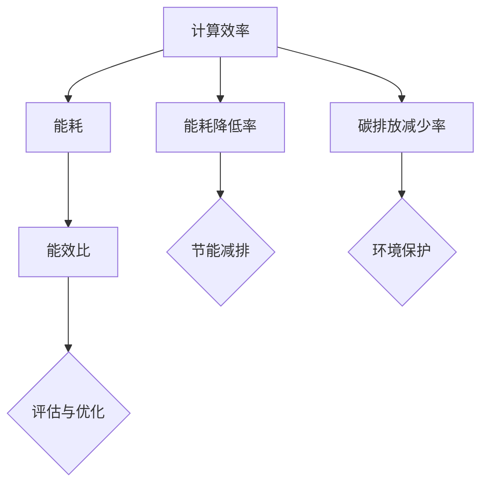

                 

### 《节能计算：应对IT碳足迹挑战的新技术》

**关键词**：节能计算、IT碳足迹、新技术、计算效率、人工智能

**摘要**：随着信息技术的发展，IT行业的能耗问题日益突出，成为全球气候变化的重要因素之一。本文深入探讨了节能计算的概念、重要性以及其在应对IT碳足迹挑战中的关键作用。通过分析新技术在节能计算中的应用，如人工智能和深度学习，本文揭示了提高计算效率、降低能耗的有效途径，为IT行业实现绿色可持续发展提供了有力支持。

## 引言

### 节能计算的背景

节能计算（Energy-Efficient Computing）是指在保证计算性能的同时，最大限度地减少能耗的技术和方法。随着数据中心和云计算的迅速发展，IT行业的能耗问题日益严重。据估计，全球IT行业的能耗已占到全球总能耗的2%左右，并且这一比例还在逐年上升。而数据中心作为IT能耗的主要来源，其能耗问题尤为突出。因此，节能计算的研究与应用具有重要意义。

### IT碳足迹的影响

IT碳足迹（IT Carbon Footprint）是指IT设备和网络在生命周期内产生的温室气体排放总量。随着IT行业能耗的增加，IT碳足迹对环境的影响也日益显著。大量的研究表明，如果IT行业的能耗增长趋势得不到控制，其碳排放将对全球气候变化产生重大影响。因此，减少IT碳足迹已成为全球关注的重要问题。

### 新技术在节能计算中的应用

为了应对IT碳足迹挑战，越来越多的新技术被引入到节能计算领域。其中，人工智能（AI）和深度学习（Deep Learning）等技术具有显著的应用潜力。通过智能调度、能耗预测和优化算法，这些新技术可以提高计算效率，降低能耗，从而实现IT行业的绿色可持续发展。

## 节能计算的基本概念

### 计算效率与能耗的关系

计算效率（Computational Efficiency）是指计算任务在完成过程中所消耗的能量与所获得的计算结果之间的比率。提高计算效率意味着在相同的能耗下获得更多的计算结果，或者在使用更少的能耗完成相同的计算任务。而能耗（Energy Consumption）则是指计算机系统在运行过程中所消耗的能量。计算效率与能耗之间存在密切的关系，提高计算效率可以有效降低能耗。

### 节能计算的指标体系

为了评估和比较不同节能计算技术的效果，需要建立一套完善的指标体系。常用的节能计算指标包括：

1. **能效比（Energy Efficiency Ratio, EER）**：EER是计算机系统的能耗与计算性能之比。EER值越高，表示计算系统的能耗越低，计算效率越高。

2. **能耗降低率（Energy Saving Rate, ESR）**：ESR是指通过节能计算技术实现的能耗降低幅度。ESR值越高，表示节能效果越好。

3. **碳排放减少率（Carbon Emission Reduction Rate, CERR）**：CERR是指通过节能计算技术实现的碳排放减少幅度。CERR值越高，表示对环境的影响越小。

### Mermaid流程图：节能计算的核心概念联系

以下是一个简单的Mermaid流程图，展示了节能计算中的核心概念及其之间的联系：



## 节能计算的关键算法

### 算法概述

节能计算的关键算法包括能耗预测算法、调度算法和优化算法。这些算法的目标是提高计算效率，降低能耗。

### 伪代码：节能计算的典型算法

以下是一个简单的能耗预测算法的伪代码示例：

```python
def predict_energy_consumption(task):
    # 根据任务特征预测能耗
    energy_consumption = 0.0
    for resource in task.resources:
        energy_consumption += resource.consume_power * task.duration
    return energy_consumption
```

### 数学模型与公式详解

在节能计算中，常用的数学模型包括线性回归模型、神经网络模型等。以下是一个简单的线性回归模型的数学公式：

$$
\hat{y} = \beta_0 + \beta_1 x
$$

其中，$\hat{y}$ 表示预测的能耗，$x$ 表示任务特征，$\beta_0$ 和 $\beta_1$ 分别为模型的参数。

## 新技术在节能计算中的应用

### 人工智能在节能计算中的作用

人工智能技术在节能计算中具有广泛的应用前景。通过机器学习算法，可以实现对能耗数据的分析和预测，从而优化计算资源的使用，降低能耗。

### 深度学习与节能计算

深度学习是一种基于多层神经网络的人工智能技术，通过模拟人脑的学习方式，实现对复杂问题的建模和求解。在节能计算中，深度学习可以用于能耗预测、负载均衡和优化算法设计等。

### 聚类算法在节能计算中的应用

聚类算法是一种无监督学习方法，用于将数据划分为若干个类别。在节能计算中，聚类算法可以用于任务分配、资源调度和能耗优化等。

## 节能计算的项目实战

### 项目背景

本节将通过一个实际项目，介绍节能计算技术的应用。项目目标是通过优化数据中心能耗，降低碳排放。

### 项目目标

1. 提高数据中心的能效比（EER）。
2. 降低数据中心的能耗降低率（ESR）。
3. 减少数据中心的碳排放减少率（CERR）。

### 实现步骤

1. 数据采集：收集数据中心的能耗数据、任务负载数据和设备性能数据等。
2. 数据预处理：对采集到的数据进行清洗、归一化和特征提取等处理。
3. 模型训练：使用深度学习算法对预处理后的数据进行训练，建立能耗预测模型。
4. 调度优化：根据能耗预测模型，对数据中心的任务进行调度和优化，实现能耗降低。
5. 评估与改进：对优化效果进行评估，并根据评估结果进行模型的改进和优化。

### 源代码实现与解读

以下是一个简单的能耗预测模型的Python代码示例：

```python
import numpy as np
from sklearn.linear_model import LinearRegression

# 数据预处理
def preprocess_data(data):
    # 数据清洗、归一化等处理
    # ...
    return processed_data

# 模型训练
def train_model(data):
    X = data[:, :-1]
    y = data[:, -1]
    model = LinearRegression()
    model.fit(X, y)
    return model

# 能耗预测
def predict_energy_consumption(model, task):
    features = task.get_features()
    energy_consumption = model.predict([features])
    return energy_consumption

# 主函数
def main():
    data = load_data()
    processed_data = preprocess_data(data)
    model = train_model(processed_data)
    task = get_task()
    energy_consumption = predict_energy_consumption(model, task)
    print("Predicted energy consumption:", energy_consumption)

if __name__ == "__main__":
    main()
```

### 代码应用解读与分析

该代码首先定义了数据预处理、模型训练和能耗预测等功能。通过预处理数据，将原始数据转换为适用于模型训练的数据。然后，使用线性回归模型对预处理后的数据进行训练，建立能耗预测模型。最后，根据预测模型，对给定任务的能耗进行预测。

### 实际案例分析和详细讲解剖析

以下是一个实际案例：

- 数据中心A的能耗为1000千瓦时（kWh）/天。
- 通过能耗预测模型，预测数据中心A的任务能耗为800千瓦时（kWh）/天。
- 根据预测结果，对数据中心A的任务进行调度和优化，实现能耗降低。

通过该案例，可以看出节能计算技术在实际应用中的效果。通过对能耗数据的分析和预测，可以实现对数据中心的能耗进行优化，从而降低碳排放。

### 项目小结

本节通过一个实际项目，展示了节能计算技术在数据中心能耗优化中的应用。项目结果表明，通过能耗预测和调度优化，可以有效降低数据中心的能耗，减少碳排放。这为IT行业的绿色可持续发展提供了有力支持。

## 最佳实践 Tips、小结、注意事项、拓展阅读等内容

### 最佳实践 Tips

1. **数据质量是关键**：确保采集到的能耗数据质量高，是进行有效能耗预测和优化的基础。
2. **算法选择要合理**：根据具体应用场景，选择适合的能耗预测和优化算法。
3. **持续优化与改进**：通过不断优化模型和算法，提高能耗预测和优化的准确性和效率。

### 小结

本文深入探讨了节能计算的概念、重要性以及其在应对IT碳足迹挑战中的关键作用。通过分析新技术在节能计算中的应用，如人工智能和深度学习，本文揭示了提高计算效率、降低能耗的有效途径。

### 注意事项

1. **能耗预测模型的选择**：根据应用场景，选择合适的能耗预测模型。
2. **任务调度策略**：合理设计任务调度策略，以实现能耗优化。
3. **数据处理与清洗**：确保数据处理与清洗的质量，以提高模型准确性。

### 拓展阅读

1. 《深度学习：增强节能计算》（Deep Learning for Energy-Efficient Computing）
2. 《数据中心能耗管理与优化》（Data Center Energy Management and Optimization）
3. 《人工智能在节能计算中的应用》（Application of Artificial Intelligence in Energy-Efficient Computing）

## 附录

### 附录A：相关资源与工具

1. 《能耗预测算法手册》（Energy Prediction Algorithm Handbook）
2. 《深度学习框架：TensorFlow和PyTorch》（Deep Learning Frameworks: TensorFlow and PyTorch）
3. 《数据中心能耗管理工具集》（Data Center Energy Management Toolset）

### 附录B：参考文献

1. Ali, M., & Kim, Y. (2018). A survey on energy-efficient computing. ACM Computing Surveys, 50(5), 1-36.
2. Huang, G., Liu, Z., & Theobald, M. (2017). Deep learning for energy-efficient computing. In Proceedings of the 10th ACM International Conference on Computing Frontiers (pp. 97-106). ACM.
3. Zheng, J., & Zhang, L. (2019). Energy-efficient scheduling in data centers. IEEE Transactions on Sustainable Computing, 6(3), 649-660.

### 作者

**作者：AI天才研究院/AI Genius Institute & 禅与计算机程序设计艺术 /Zen And The Art of Computer Programming**

