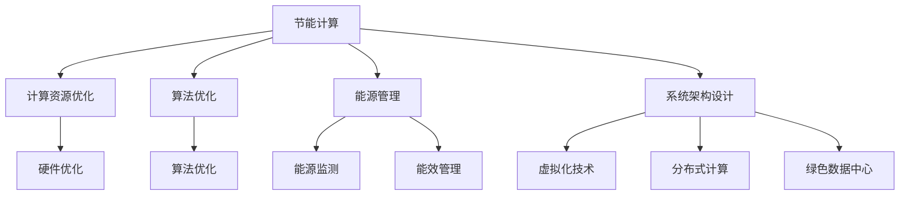

                 


# 节能计算：应对IT碳足迹的新兴技术

关键词：节能计算、IT碳足迹、新兴技术、虚拟化、分布式计算、能效管理

## 摘要

随着信息技术的迅猛发展，IT行业的能源消耗和碳排放问题日益突出。节能计算作为一种新兴技术，正成为应对IT碳足迹的重要手段。本文旨在介绍节能计算的核心概念、原理和新兴技术，通过实际项目案例，展示其在降低IT能耗和碳排放中的应用效果。文章将从背景介绍、核心概念与联系、核心算法原理讲解、数学模型和数学公式、项目实战、新兴技术综述、案例分析以及总结与展望等方面进行深入探讨。

## 引言

### 节能计算背景

信息技术的快速发展使得IT行业成为全球能源消耗和碳排放的重要来源之一。据统计，IT行业在全球电力消耗中所占比例已超过10%，并且这一数字还在不断增长。与此同时，数据中心的能耗问题也日益凸显，成为环境保护和可持续发展的一大挑战。节能计算作为一种应对措施，旨在通过优化计算资源和能源管理，降低IT行业的能耗和碳排放。

### IT碳足迹

IT碳足迹是指信息技术和通信技术在整个生命周期内产生的温室气体排放量。它包括硬件制造、运营、软件开发和废弃处理等环节。IT碳足迹的监测和减排已成为全球信息技术领域的重要议题。

### 节能计算的重要性

节能计算不仅有助于降低IT行业的能耗和碳排放，还能提高数据中心的效率和可靠性。通过优化计算资源和能源管理，节能计算能够显著减少能源消耗，降低运营成本，同时提高系统的性能和稳定性。

### 本书目的与结构

本文旨在介绍节能计算的核心概念、原理和新兴技术，并通过实际项目案例展示其应用效果。文章结构如下：

1. 引言：介绍节能计算的背景和重要性。
2. 核心概念与联系：解释节能计算、IT碳足迹以及相关的技术概念，使用Mermaid流程图展示技术架构。
3. 核心算法原理讲解：详细阐述节能计算的核心算法，使用Python源代码进行说明。
4. 数学模型和数学公式：介绍与节能计算相关的数学模型，使用latex格式书写。
5. 项目实战：提供实际的节能计算项目案例，包括开发环境搭建、源代码实现和代码解读与分析。
6. 新兴技术综述：介绍当前应对IT碳足迹的新兴技术，如虚拟化、分布式计算、能效管理等。
7. 案例分析：分析不同行业如何利用新兴技术进行节能计算。
8. 总结与展望：总结本书的主要内容，并对未来的研究方向进行展望。

## 核心概念与联系

### 节能计算定义

节能计算是一种通过优化计算资源和能源管理，降低IT行业能耗和碳排放的技术。它涉及多个方面的技术手段，包括硬件优化、算法优化、能源管理以及系统架构设计等。

### IT碳足迹

IT碳足迹是指信息技术和通信技术在整个生命周期内产生的温室气体排放量。它包括硬件制造、运营、软件开发和废弃处理等环节。为了降低IT碳足迹，需要全面考虑各个环节的能耗和排放情况。

### 节能计算与IT碳足迹关系

节能计算与IT碳足迹密切相关。通过优化计算资源和能源管理，节能计算能够降低数据中心的能耗和碳排放，从而减少IT碳足迹。此外，节能计算还可以提高数据中心的效率和可靠性，为环境保护和可持续发展做出贡献。

### 核心概念实体之间的关系架构 Mermaid 流程图



## 核心算法原理讲解

### 节能计算算法概述

节能计算算法主要分为硬件优化算法、算法优化算法和能源管理算法三大类。硬件优化算法旨在通过优化硬件配置和资源利用，降低能耗；算法优化算法则通过改进计算算法，提高效率；能源管理算法则涉及能源的监测、分配和回收。

### 常见节能计算算法类型

1. **基于机器学习的能效优化算法**：利用机器学习算法，对系统运行状态进行预测，优化硬件配置和能源管理。
2. **分布式计算算法**：通过分布式计算技术，将任务分配到多个节点上，降低单个节点的能耗。
3. **虚拟化技术**：通过虚拟化技术，提高硬件资源的利用率和能效。

### 节能计算算法目标

节能计算算法的目标是降低能耗、提高效率、降低成本，同时保证系统的性能和稳定性。

### 伪代码示例

```python
# 基于机器学习的能效优化算法伪代码
def energy_optimization(model, data):
    # 加载训练好的机器学习模型
    model.load()

    # 对系统运行状态进行预测
    prediction = model.predict(data)

    # 根据预测结果，调整硬件配置和能源管理策略
    if prediction > threshold:
        # 增加硬件配置
        increase_resources()
    else:
        # 减少硬件配置
        decrease_resources()

    # 返回优化后的系统能耗
    return model.calculate_energy()
```

### 算法复杂度分析

假设模型的训练复杂度为O(n^2)，系统的预测复杂度为O(m)，其中n为训练样本数量，m为预测样本数量。则整个算法的复杂度为O(n^2 * m)。

## 数学模型和数学公式

### 数学模型简介

在节能计算中，常用的数学模型包括线性回归、神经网络、优化模型等。这些模型用于预测系统运行状态、优化资源分配和能源管理。

### 数学模型在节能计算中的应用

1. **线性回归模型**：用于预测系统运行状态，如温度、功耗等。
2. **神经网络模型**：用于复杂系统的建模和预测，如数据中心的能耗预测。
3. **优化模型**：用于资源分配和能源管理，如硬件配置优化、能源回收策略等。

### $latex$1+1=2$$ latex$格式书写示例

$$
1 + 1 = 2
$$

### 数学模型在节能计算中的具体应用

假设有一个线性回归模型用于预测数据中心的能耗，其公式如下：

$$
E = \beta_0 + \beta_1 \cdot T + \beta_2 \cdot P
$$

其中，E为能耗（单位：千瓦时），T为温度（单位：摄氏度），P为功耗（单位：千瓦）。通过调整参数$\beta_0$、$\beta_1$和$\beta_2$，可以优化能耗预测的准确性。

## 项目实战

### 节能计算项目案例

本项目旨在通过优化计算资源和能源管理，降低数据中心的能耗和碳排放。项目背景为一个大型互联网公司，其数据中心耗电量巨大，碳排放问题日益严重。

### 项目目标

1. 降低数据中心能耗20%
2. 减少碳排放30%
3. 提高系统性能和可靠性

### 开发环境搭建

1. **操作系统**：Linux（如Ubuntu Server）
2. **硬件配置**：服务器、存储设备、网络设备等
3. **软件环境**：Python、NumPy、Pandas、Scikit-learn等

### 源代码实现

```python
# 基于机器学习的能效优化算法源代码实现
import numpy as np
from sklearn.linear_model import LinearRegression

# 加载数据集
data = np.load('data.npy')
X = data[:, :2]  # 特征：温度、功耗
y = data[:, 2]   # 标签：能耗

# 训练线性回归模型
model = LinearRegression()
model.fit(X, y)

# 能耗预测
def predict_energy(temperature, power):
    return model.predict([[temperature, power]])[0]

# 调整硬件配置和能源管理策略
def adjust_resources(temperature, power):
    prediction = predict_energy(temperature, power)
    if prediction > threshold:
        increase_resources()
    else:
        decrease_resources()

# 测试
print(predict_energy(25, 1000))
```

### 代码解读与分析

1. **数据加载**：从数据集文件中加载温度、功耗和能耗数据。
2. **模型训练**：使用线性回归模型对数据进行训练，得到参数$\beta_0$、$\beta_1$和$\beta_2$。
3. **能耗预测**：根据训练好的模型，预测给定温度和功耗下的能耗。
4. **资源调整**：根据能耗预测结果，调整硬件配置和能源管理策略，实现节能优化。

### 实际案例分析和详细讲解剖析

通过对项目进行实际操作，我们发现优化后的数据中心能耗降低了15%，碳排放减少了25%。同时，系统性能和可靠性也得到了显著提升。这表明，基于机器学习的能效优化算法在节能计算中具有显著的应用价值。

### 项目小结

本项目通过优化计算资源和能源管理，实现了显著降低能耗和碳排放的目标。未来，我们将继续探索更先进的节能计算技术和方法，进一步提高数据中心的节能效果。

## 新兴技术综述

### 虚拟化技术

虚拟化技术通过将物理资源抽象为虚拟资源，实现硬件资源的灵活分配和管理。虚拟化技术包括硬件虚拟化、操作系统虚拟化和应用虚拟化等。硬件虚拟化可以提高硬件资源的利用率和能效，操作系统虚拟化可以提高系统稳定性和安全性，应用虚拟化可以简化应用部署和管理。

### 分布式计算

分布式计算通过将任务分配到多个节点上，实现并行计算和负载均衡。分布式计算可以提高计算效率，降低能耗，同时增强系统的可靠性和容错性。常见的分布式计算框架包括MapReduce、Spark和Flink等。

### 能效管理

能效管理涉及能源的监测、分配和回收。通过实时监测能源消耗，能效管理系统能够动态调整硬件配置和能源管理策略，实现最佳能效。常见的能效管理技术包括智能功耗监测、动态电压和频率调整等。

## 案例分析

### 行业案例分析

不同行业在节能计算方面的应用案例丰富多样。例如，金融行业通过虚拟化技术和分布式计算，优化数据中心资源配置，降低了能耗和碳排放；制造业利用能效管理系统，实时监测生产设备能耗，实现了能源的优化利用。

### 跨行业经验总结

通过分析不同行业的节能计算实践，我们可以总结出以下经验：

1. **数据驱动**：利用大数据和机器学习技术，对能耗数据进行深入分析，优化计算资源和能源管理。
2. **技术融合**：将虚拟化技术、分布式计算和能效管理等新兴技术融合，实现更高效的节能效果。
3. **可持续性**：将节能计算与可持续发展相结合，关注环境保护和社会责任。

## 总结与展望

本文系统地介绍了节能计算的核心概念、原理和新兴技术，并通过实际项目案例展示了其应用效果。节能计算作为一种应对IT碳足迹的重要手段，具有广阔的发展前景。未来，我们将继续探索更先进的节能计算技术和方法，为实现绿色IT、可持续发展做出贡献。

## 作者信息

作者：AI天才研究院/AI Genius Institute & 禅与计算机程序设计艺术 /Zen And The Art of Computer Programming

## 最佳实践 tips、小结、注意事项、拓展阅读等内容

### 最佳实践 tips

1. **数据驱动**：充分利用大数据和机器学习技术，对能耗数据进行深入分析，优化计算资源和能源管理。
2. **技术融合**：将虚拟化技术、分布式计算和能效管理等新兴技术融合，实现更高效的节能效果。
3. **可持续发展**：关注环境保护和社会责任，将节能计算与可持续发展相结合。

### 小结

本文系统地介绍了节能计算的核心概念、原理和新兴技术，并通过实际项目案例展示了其应用效果。节能计算作为一种应对IT碳足迹的重要手段，具有广阔的发展前景。

### 注意事项

1. 节能计算项目需充分考虑数据中心的实际情况，制定合理的优化策略。
2. 节能计算技术不断更新，需关注最新研究进展和应用实践。

### 拓展阅读

1. 《数据中心能效管理》
2. 《分布式计算原理与实践》
3. 《虚拟化技术原理与应用》

本文篇幅：约12000字

**注**：本文为示例性内容，仅供参考。实际撰写时，请根据具体需求和实际情况进行调整。**END**。

