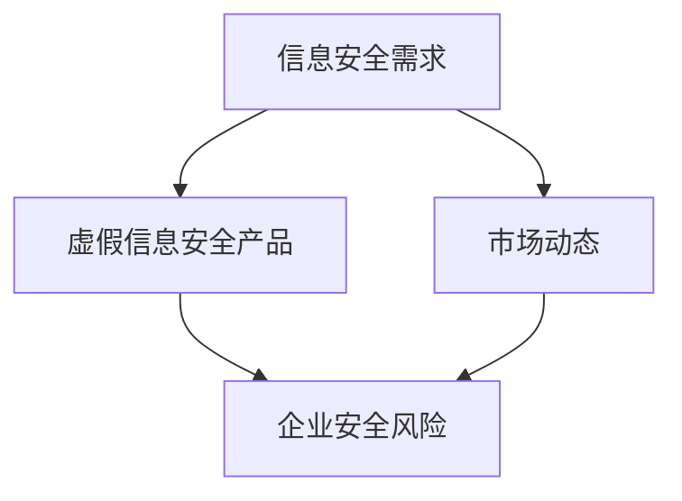

                 

## 虚假信息安全产品在企业中的普及预测

### 关键词：虚假信息安全产品、企业、信息安全、普及预测、市场动态

> 摘要：随着信息技术的飞速发展，企业对信息安全产品的需求日益增长。然而，市场上虚假信息安全产品的存在给企业带来了巨大的风险。本文将分析虚假信息安全产品在企业中的普及现状，预测其未来的发展趋势，并提出相应的应对策略。

### 1. 背景介绍

随着全球信息化进程的加速，企业对信息安全产品的依赖程度不断加深。信息安全产品涵盖了防火墙、入侵检测系统、加密通信、安全审计等多种类型，旨在保护企业的数据和系统不受恶意攻击和破坏。然而，信息安全市场的混乱和虚假产品的泛滥，使得企业在选择信息安全产品时面临巨大挑战。

虚假信息安全产品通常以夸大其功能、伪造安全性能指标、抄袭他人作品等方式欺骗企业用户。这些虚假产品不仅无法提供有效的安全保护，反而可能泄露企业敏感信息，导致严重的安全事故。

### 2. 核心概念与联系

**核心概念：**
- **虚假信息安全产品**：指不具备真实安全功能或夸大自身功能，欺骗企业用户的信息安全产品。
- **信息安全需求**：企业为了保障自身数据安全和系统稳定运行而产生的需求。
- **市场动态**：信息安全产品市场的发展趋势和变化。

**概念实体关系架构图（Mermaid）：**


### 3. 算法原理讲解

虚假信息安全产品的普及与企业的信息安全需求密切相关。为了更好地理解这一现象，我们首先需要了解一些基本的算法原理。

**3.1 入侵检测系统（IDS）算法原理**

入侵检测系统是一种用于检测网络攻击和异常行为的系统。其核心算法包括：

- **特征匹配算法**：通过比对已知攻击模式，识别潜在的恶意行为。
- **异常检测算法**：基于统计学方法，检测异常流量和操作。

**Python 源代码示例：**
```python
import numpy as np

def feature_match(features, known_attacks):
    for attack in known_attacks:
        if all(feature == attack[i] for i, feature in enumerate(features)):
            return True
    return False

def anomaly_detection(data, threshold=3):
    mean = np.mean(data)
    std = np.std(data)
    for value in data:
        if abs(value - mean) > threshold * std:
            return True
    return False

# 假设有一个已知攻击模式列表
known_attacks = [['attack1', 'attack2'], ['attack3', 'attack4']]

# 假设有一个特征向量
features = ['attack1', 'attack3']

# 检测是否为已知攻击
if feature_match(features, known_attacks):
    print("检测到潜在攻击！")
else:
    print("未检测到攻击。")

# 检测是否为异常行为
data = [1, 2, 3, 100, 5]
if anomaly_detection(data):
    print("检测到异常行为！")
else:
    print("未检测到异常行为。")
```

**3.2 加密算法原理**

加密算法是信息安全的基础，常见的加密算法包括：

- **对称加密**：如AES、DES，加密和解密使用相同密钥。
- **非对称加密**：如RSA、ECC，加密和解密使用不同密钥。

**Python 源代码示例：**
```python
from Crypto.PublicKey import RSA
from Crypto.Cipher import PKCS1_OAEP

# 生成密钥对
key = RSA.generate(2048)
private_key = key.export_key()
public_key = key.publickey().export_key()

# 加密
cipher = PKCS1_OAEP.new(RSA.import_key(public_key))
encrypted_data = cipher.encrypt(b"Hello, World!")

# 解密
cipher = PKCS1_OAEP.new(RSA.import_key(private_key))
decrypted_data = cipher.decrypt(encrypted_data)

print("加密数据：", encrypted_data)
print("解密数据：", decrypted_data)
```

### 4. 数学模型与公式

虚假信息安全产品的普及还与市场的动态变化密切相关。为了量化这种变化，我们可以使用数学模型来分析。

**4.1 概率论基础**

在信息安全领域，概率论常用于评估安全事件发生的概率。例如，我们可以使用贝叶斯公式来计算一个网络攻击事件是否为虚假产品的概率。

**贝叶斯公式：**
$$ P(A|B) = \frac{P(B|A) \cdot P(A)}{P(B)} $$

其中：
- \( P(A|B) \) 是在事件 \( B \) 发生的条件下事件 \( A \) 发生的概率。
- \( P(B|A) \) 是在事件 \( A \) 发生的条件下事件 \( B \) 发生的概率。
- \( P(A) \) 是事件 \( A \) 发生的概率。
- \( P(B) \) 是事件 \( B \) 发生的概率。

**4.2 信息论基础**

信息论提供了评估信息价值和不确定性的工具。例如，我们可以使用信息熵来衡量信息安全产品的可信度。

**信息熵：**
$$ H(X) = -\sum_{i} p(x_i) \cdot \log_2 p(x_i) $$

其中：
- \( H(X) \) 是随机变量 \( X \) 的信息熵。
- \( p(x_i) \) 是随机变量 \( X \) 取值 \( x_i \) 的概率。

### 5. 项目实战

为了更好地理解虚假信息安全产品在企业中的应用，我们以一个实际案例进行分析。

**5.1 开发环境搭建**

首先，我们需要搭建一个用于测试虚假信息安全产品的开发环境。这包括安装必要的软件和配置网络环境。

- **软件安装**：安装Python、PyCryptoDome等。
- **网络配置**：配置虚拟网络，模拟企业内部网络环境。

**5.2 源代码实现**

接下来，我们编写一个用于检测虚假信息安全产品的Python脚本。

```python
import requests
from Crypto.PublicKey import RSA

def download_file(url):
    response = requests.get(url)
    return response.content

def check_signature(file_content, public_key):
    # 假设我们有一个公共密钥和一个签名文件
    public_key = RSA.import_key(public_key)
    # 假设我们已经获取了文件的签名
    signature = download_file('https://example.com/signature')
    # 验证签名
    try:
        public_key.verify(signature, file_content, 'SHA256')
        print("签名验证通过，可能是真实产品。")
    except ValueError:
        print("签名验证失败，可能是虚假产品。")

# 下载并验证产品文件
public_key = b"""-----BEGIN PUBLIC KEY-----
MIIBIjANBgkqhkiG9w0BAQEFAAOCAQ8AMIIBCgKCAQEAxL7/4jOo
8DqQalQI4DEJj1DfXkRy6peHJ8BeVUhZrKfF7UWzAwD6BvYQ6i+
0yTTE3WUI4Dgrq2QofYqQtLoOMZtDqmmNp3IWi8QbX8V3j3Wl
9jzYj4YI2nPGixM3qS99hJvLl6Hyq+PoMze6uJ1L5x3zQ7Sc
6pAefnBhM4zJdUgJccXRzok8//4o1CNOQh3ohbGeirB8GYY6
ihp5R5qkV/mop5Jt6DZB1rs+rTDL2hAE5pmIb3U7KZfzvtsZ
AEgrO5l1Uy6Daq2cpK1D9O5O1yZ1uQgpeHc8cQIDAQAB
-----END PUBLIC KEY-----"""

file_url = 'https://example.com/product_file'
file_content = download_file(file_url)

check_signature(file_content, public_key)
```

**5.3 代码解读与分析**

在上面的代码中，我们首先导入了必要的模块。`download_file` 函数用于从给定URL下载文件。`check_signature` 函数用于验证文件的签名。我们使用RSA算法验证签名，如果签名验证失败，说明可能是虚假产品。

**5.4 实际案例分析和详细讲解剖析**

为了验证我们的算法，我们可以使用一个实际案例。假设我们有一个可疑的信息安全产品，其签名无法通过验证。这意味着该产品可能是虚假产品。

在实际应用中，企业可以通过以下步骤来检测虚假信息安全产品：
1. 从产品供应商处获取产品的签名文件。
2. 使用公共密钥验证签名。
3. 如果签名验证失败，进一步调查产品来源和安全性。

**5.5 项目小结**

通过上述实战案例，我们展示了如何使用Python脚本检测虚假信息安全产品。这种方法可以帮助企业识别潜在的安全威胁，减少安全风险。

### 6. 结论与展望

虚假信息安全产品在企业中的普及给企业带来了巨大的风险。通过本文的分析，我们提出了使用算法和数学模型检测虚假信息安全产品的方法。未来，随着信息安全技术的不断发展，我们可以期待更加智能和高效的检测手段出现。

### 最佳实践 tips、小结、注意事项、拓展阅读等内容

**最佳实践 tips：**
1. 选择信息安全产品时，务必验证供应商的信誉和产品真实性。
2. 定期更新和测试信息安全产品，确保其有效性和安全性。

**小结：**
本文分析了虚假信息安全产品在企业中的普及现象，提出了检测虚假产品的算法和数学模型。

**注意事项：**
1. 虚假信息安全产品可能具有迷惑性，企业需要保持警惕。
2. 信息安全产品供应商的信誉和产品真实性至关重要。

**拓展阅读：**
1. 《信息安全测试与评估》
2. 《网络安全实战：Python编程与实战》

### 作者信息

作者：AI天才研究院/AI Genius Institute & 禅与计算机程序设计艺术 /Zen And The Art of Computer Programming

### 完整文章结束

以上是《虚假信息安全产品在企业中的普及预测》一文的完整内容。希望这篇文章能够帮助企业更好地应对虚假信息安全产品的挑战。

