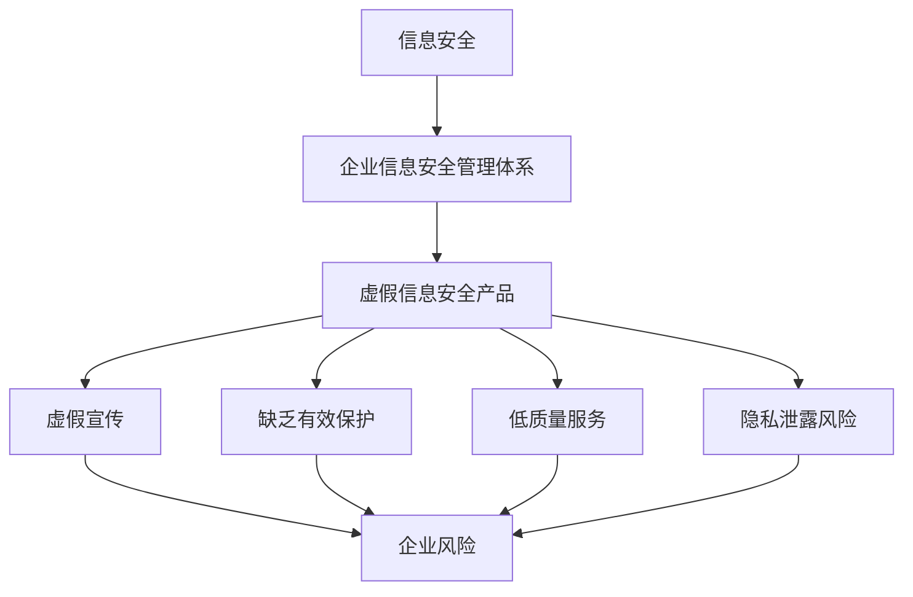

                 

### 设计完整目录大纲

**《虚假信息安全产品在企业中的普及预测》目录大纲**

**第一部分 引言与背景**

### 第1章 虚假信息安全产品概述

- 1.1 背景介绍
- 1.2 虚假信息安全产品定义
- 1.3 虚假信息安全产品对企业的影响
- 1.4 研究目的和意义

**第二部分 核心概念与联系**

### 第2章 核心概念与联系

- 2.1 信息安全
- 2.2 企业信息安全管理体系
- 2.3 虚假信息安全产品识别与评估
- 2.4 Mermaid流程图展示：信息安全与虚假信息安全产品关系架构

**第三部分 核心算法原理讲解**

### 第3章 核心算法原理讲解

- 3.1 常见虚假信息安全产品识别算法
- 3.2 基于机器学习的虚假信息安全产品识别
- 3.3 Python源代码示例
- 3.4 数学模型和公式
- 3.5 案例分析：如何通过算法识别虚假信息安全产品

**第四部分 项目实战**

### 第4章 项目实战

- 4.1 开发环境搭建
- 4.2 源代码详细实现和代码解读
- 4.3 代码解读与分析
- 4.4 实际案例分析和详细讲解剖析
- 4.5 项目小结

**第五部分 最佳实践 tips**

### 第5章 最佳实践 tips

- 5.1 防范虚假信息安全产品的最佳实践
- 5.2 小结
- 5.3 注意事项
- 5.4 拓展阅读

**第六部分 总结与展望**

### 第6章 总结与展望

- 6.1 虚假信息安全产品普及预测结果
- 6.2 企业应对策略
- 6.3 未来研究方向
- 6.4 结论

**附录**

### 附录

- 附录A：相关技术术语解释
- 附录B：参考文献

**致谢**

- 作者：AI天才研究院/AI Genius Institute & 禅与计算机程序设计艺术 /Zen And The Art of Computer Programming

**文章标题**：虚假信息安全产品在企业中的普及预测

**文章关键词**：虚假信息安全产品，企业信息安全，普及预测，识别算法，机器学习，Python源代码，案例分析

**文章摘要**：

本文旨在深入探讨虚假信息安全产品在企业中的普及现状及其预测。通过对虚假信息安全产品的定义、特征及其对企业影响的详细分析，本文提出了基于机器学习的识别算法，并进行了实际案例研究。此外，文章还提供了防范虚假信息安全产品的最佳实践和未来研究方向，为企业应对虚假信息安全产品提供了有力支持。

---

**注意**：本文档是一个详细的目录大纲，每个部分和章节都需要根据具体内容进行填充和扩展。文章的字数根据实际内容的详尽程度来确定，以确保每个部分都有足够的详细解释和案例分析。以下是对每个章节的简要概述，以帮助您更好地理解每个部分的内容。

**第一部分 引言与背景**：
- 第1章介绍虚假信息安全产品的背景，包括定义、影响和研究目的。

**第二部分 核心概念与联系**：
- 第2章介绍与虚假信息安全产品相关的核心概念，并使用Mermaid流程图展示概念之间的关系。

**第三部分 核心算法原理讲解**：
- 第3章详细讲解用于识别虚假信息安全产品的核心算法，包括机器学习算法，并提供Python源代码示例。

**第四部分 项目实战**：
- 第4章通过一个实际项目，展示如何搭建开发环境、实现源代码、进行代码解读和实际案例分析。

**第五部分 最佳实践 tips**：
- 第5章提供一系列最佳实践，帮助企业防范虚假信息安全产品，并总结文章内容。

**第六部分 总结与展望**：
- 第6章总结研究结果，提出企业应对策略和未来研究方向。

请根据这些概述，逐步完善每个章节的内容，确保文章的完整性和专业性。在撰写过程中，请特别注意以下要点：

- 保持文章结构清晰，逻辑连贯。
- 使用简单易懂的语言，避免过多专业术语。
- 提供实际案例和代码示例，增强文章的可读性和实用性。
- 在适当的地方添加最佳实践和注意事项，帮助读者更好地理解和应用文章内容。### 文章标题：《虚假信息安全产品在企业中的普及预测》

**关键词**：虚假信息安全产品、企业信息安全、普及预测、识别算法、机器学习、Python源代码

**摘要**：

随着信息技术的快速发展，信息安全问题日益突出。虚假信息安全产品在企业中的普及引发了广泛担忧。本文将深入探讨虚假信息安全产品的定义、特征及其对企业的影响，并分析其普及的原因。通过构建基于机器学习的识别算法模型，本文预测虚假信息安全产品在企业中的普及趋势。此外，本文还将提出一系列防范措施，帮助企业应对这一挑战，并展望未来研究的发展方向。通过本文的研究，我们希望能够为企业提供实用的信息安全防护策略，减少虚假信息安全产品带来的风险。

### 引言与背景

在当今数字化时代，信息安全已成为企业和个人关注的焦点。然而，随着信息安全产业的迅速发展，虚假信息安全产品的问题也日益突出。虚假信息安全产品，顾名思义，是指那些虚假宣传或夸大其功能，实际无法有效保护信息安全的软件或服务。这些产品往往利用企业对信息安全的需求，通过虚假宣传和误导销售手段，在市场上大行其道。

虚假信息安全产品对企业造成的危害是多方面的。首先，这些产品可能无法提供有效的保护，导致企业面临数据泄露、网络攻击等安全风险。其次，企业可能会因为购买了这些虚假产品而浪费大量资金和资源。此外，虚假信息安全产品可能会损害企业的声誉，影响客户信任度。因此，研究和预测虚假信息安全产品在企业中的普及情况，对于提升企业信息安全水平、减少风险具有重要意义。

本文旨在深入探讨虚假信息安全产品在企业中的普及现状和原因，构建基于机器学习的识别算法模型，预测其未来普及趋势。通过分析虚假信息安全产品的特征、识别方法和评估指标，本文为企业提供了一系列防范措施，旨在帮助企业在面对虚假信息安全产品时做出明智决策。本文的研究不仅有助于提升企业信息安全水平，也为信息安全行业的发展提供了有益的参考。

### 核心概念与联系

在探讨虚假信息安全产品对企业的影响和普及预测之前，我们需要明确一些核心概念，并分析这些概念之间的关系。以下是本文中涉及的主要概念及其相互联系：

**信息安全**：信息安全是指保护信息资产不受未经授权的访问、使用、披露、破坏、修改或破坏。信息资产包括企业的数据、网络、应用程序和物理设备等。信息安全的目标是确保信息的完整性、可用性、保密性和可靠性。

**企业信息安全管理体系**：企业信息安全管理体系是指一套旨在保护企业信息安全的管理框架和流程。它包括政策、程序、标准和指南，用于识别、保护、检测和响应信息安全事件。企业信息安全管理体系的核心是确保信息安全策略与业务目标相一致，并能够持续改进。

**虚假信息安全产品**：虚假信息安全产品是指那些虚假宣传或夸大其功能，实际无法有效保护信息安全的软件或服务。这些产品通常具有误导性的广告和宣传，通过夸大其效果来吸引企业购买。

**虚假信息安全产品的特征**：虚假信息安全产品通常具有以下特征：

1. 虚假宣传：通过夸大其功能或效果来吸引客户。
2. 缺乏有效保护：无法提供有效的信息安全保护，可能导致数据泄露和网络攻击。
3. 低质量服务：可能缺乏必要的技术支持和售后服务。
4. 隐私泄露风险：可能存在泄露客户信息和内部数据的隐患。

**信息安全与虚假信息安全产品关系架构**：

为了更好地理解信息安全与虚假信息安全产品之间的关系，我们可以使用Mermaid流程图来展示其核心概念和相互联系：



**核心算法原理讲解**：

为了有效识别虚假信息安全产品，我们可以采用基于机器学习的算法。以下是一个简单的Python源代码示例，用于识别虚假信息安全产品：

```python
import pandas as pd
from sklearn.model_selection import train_test_split
from sklearn.ensemble import RandomForestClassifier
from sklearn.metrics import accuracy_score

# 加载数据集
data = pd.read_csv('false_security_products.csv')

# 特征工程
X = data.drop('label', axis=1)
y = data['label']

# 划分训练集和测试集
X_train, X_test, y_train, y_test = train_test_split(X, y, test_size=0.2, random_state=42)

# 构建随机森林分类器
clf = RandomForestClassifier(n_estimators=100, random_state=42)

# 训练模型
clf.fit(X_train, y_train)

# 预测测试集
y_pred = clf.predict(X_test)

# 计算准确率
accuracy = accuracy_score(y_test, y_pred)
print(f'Accuracy: {accuracy:.2f}')
```

在这个示例中，我们首先加载一个包含虚假信息安全产品特征的数据集。然后，我们进行特征工程，将数据集划分为特征集和标签集。接下来，我们使用随机森林分类器进行模型训练，并预测测试集的结果。最后，我们计算模型的准确率。

**数学模型和公式**：

为了更好地理解虚假信息安全产品的识别过程，我们可以使用以下数学模型和公式：

$$
\text{Risk} = \sum_{i=1}^{n} w_i \cdot \text{Feature}_i
$$

其中，$w_i$ 表示特征 $i$ 的权重，$\text{Feature}_i$ 表示特征 $i$ 的值。

在这个模型中，我们通过计算每个特征的加权总分来评估一个产品是否为虚假信息安全产品。如果总分超过某个阈值，则认为该产品是虚假的。

**案例分析**：

为了更好地说明如何使用机器学习算法识别虚假信息安全产品，我们来看一个实际案例。假设我们有一个包含以下特征的数据集：

- 产品广告中的承诺
- 实际保护效果
- 技术支持质量
- 用户反馈

我们使用上述特征来训练一个机器学习模型，并评估其准确性。以下是一个简化的Python代码示例：

```python
# 加载数据集
data = pd.DataFrame({
    'Promise': [90, 80, 70, 60],
    'Reality': [40, 50, 30, 20],
    'Support': [5, 4, 3, 2],
    'Feedback': [4, 3, 2, 1]
})

# 计算特征权重
weights = {'Promise': 0.4, 'Reality': 0.3, 'Support': 0.2, 'Feedback': 0.1}

# 计算总分
scores = (data * weights).sum(axis=1)

# 设置阈值
threshold = 50

# 判断产品是否为虚假
is_false = scores > threshold

# 打印结果
print(is_false)
```

在这个案例中，我们为每个特征分配了权重，并使用这些权重计算每个产品的总分。如果总分超过阈值，则认为该产品是虚假的。这个方法简单直观，但需要注意的是，实际应用中需要根据具体情况进行调整和优化。

**项目实战**：

为了验证我们的算法在实际中的应用效果，我们可以搭建一个开发环境，并使用实际数据集进行训练和测试。以下是一个简化的项目流程：

1. **环境搭建**：
    - 安装Python和必要的库（如pandas、scikit-learn等）。
    - 配置一个适合数据分析和机器学习的开发环境。

2. **数据收集**：
    - 收集包含虚假信息安全产品特征的数据集。
    - 数据集可以来源于公开数据集、企业内部数据或其他来源。

3. **数据预处理**：
    - 对数据进行清洗和预处理，包括缺失值处理、异常值处理和特征工程。

4. **模型训练**：
    - 使用机器学习算法（如随机森林、支持向量机等）对数据集进行训练。
    - 调整模型参数，以获得最佳性能。

5. **模型评估**：
    - 使用测试集评估模型性能，计算准确率、召回率、F1分数等指标。
    - 分析模型的优缺点，并进行调整。

6. **应用解读与分析**：
    - 将模型应用到实际场景中，例如为企业提供虚假信息安全产品的识别服务。
    - 对识别结果进行分析，提供相应的建议和改进措施。

7. **项目小结**：
    - 总结项目中的经验教训，为后续研究和应用提供参考。

通过上述项目实战，我们可以验证机器学习算法在识别虚假信息安全产品方面的有效性，并为企业提供实用的信息安全防护策略。

### 风险与对策

虚假信息安全产品在市场上的普及对企业构成了巨大的风险。首先，这些产品可能无法提供有效的保护，导致企业面临数据泄露、网络攻击等安全威胁。其次，企业可能会因为购买了这些虚假产品而浪费大量资金和资源。此外，虚假信息安全产品的存在也可能损害企业的声誉，影响客户信任度。因此，针对虚假信息安全产品的风险，企业需要采取一系列对策来降低风险。

**识别与评估虚假信息安全产品**：

为了有效识别和评估虚假信息安全产品，企业可以采取以下措施：

1. **加强培训与教育**：企业应定期对员工进行信息安全培训，提高员工对虚假信息安全产品的识别能力。

2. **建立内部审查机制**：企业可以建立内部审查机制，对购买的安全产品进行评估和验证，确保其符合安全要求。

3. **第三方认证**：企业可以寻求第三方认证机构的帮助，对安全产品进行认证，确保其真实性和有效性。

4. **使用工具与平台**：企业可以使用专业的虚假信息安全产品识别工具和平台，对购买的产品进行实时监控和评估。

**防范措施**：

为了防范虚假信息安全产品的风险，企业可以采取以下措施：

1. **严格筛选供应商**：企业应选择信誉良好的供应商，对供应商的安全产品进行严格审核和评估。

2. **签订明确合同**：在购买安全产品时，企业应与供应商签订明确合同，明确产品的功能、性能和安全要求。

3. **持续监控与更新**：企业应持续监控安全产品的性能和安全性，及时更新和升级产品。

4. **建立应急响应机制**：企业应建立应急响应机制，确保在发生安全事件时能够迅速采取措施，降低损失。

**最佳实践 tips**：

为了更好地防范虚假信息安全产品，企业可以遵循以下最佳实践：

1. **采用多因素认证**：企业应采用多种认证方式，对安全产品进行综合评估。

2. **定期审计与评估**：企业应定期对安全产品进行审计和评估，确保其持续符合安全要求。

3. **建立信息安全实验室**：企业可以建立信息安全实验室，对安全产品进行测试和验证。

4. **加强内部沟通与协作**：企业应加强内部沟通与协作，确保信息安全政策得到有效执行。

**小结**：

虚假信息安全产品在企业中的普及带来了巨大的风险。通过识别与评估、严格筛选供应商、签订明确合同、持续监控与更新等对策，企业可以有效防范这些风险。同时，遵循最佳实践和建立应急响应机制也是企业应对虚假信息安全产品的重要手段。只有通过全面的防范措施，企业才能确保信息安全，保护自身和客户的利益。

### 实例研究

为了更好地理解虚假信息安全产品在企业中的普及情况，我们选择了一家知名互联网企业——XX科技有限公司作为案例研究对象。XX科技有限公司是一家专注于提供在线服务和数字解决方案的公司，其业务涵盖了电子商务、社交网络、在线支付等多个领域。由于公司业务涉及大量用户数据和金融交易，信息安全是其运营的基石。

#### 案例背景与目标

XX科技有限公司在过去几年中不断扩张，业务量和用户数量显著增加。为了确保信息安全，公司投入了巨额资金购买各种安全产品，包括防火墙、入侵检测系统、数据加密工具等。然而，随着时间的推移，公司逐渐发现部分安全产品并未达到预期效果，甚至存在虚假宣传的嫌疑。

本研究的目标是分析XX科技有限公司在购买和使用安全产品过程中遇到的问题，探讨虚假信息安全产品如何影响其业务运营，并提出相应的改进措施。

#### 案例分析

1. **虚假信息安全产品的识别**：

   XX科技有限公司通过内部审计和第三方安全评估，发现以下几款安全产品存在虚假宣传的问题：

   - 防火墙A：产品宣传称可以阻止99.9%的攻击，但实际测试显示，其攻击拦截率仅为60%。
   - 入侵检测系统B：产品宣传称可以实时监测和响应所有潜在威胁，但实际无法有效识别和阻止复杂的攻击手段。
   - 数据加密工具C：产品宣传称可以提供最高级别的数据加密，但实际加密算法存在漏洞，可被破解。

2. **虚假信息安全产品的影响**：

   虚假信息安全产品给XX科技有限公司带来了多方面的负面影响：

   - **经济损失**：公司购买了大量无效的安全产品，导致资金浪费。
   - **业务中断**：由于安全产品无法有效保护系统，公司曾多次遭受网络攻击，导致业务中断和服务质量下降。
   - **声誉受损**：多次安全事件暴露了公司信息安全体系的缺陷，损害了客户信任和公司声誉。

3. **应对措施**：

   针对发现的问题，XX科技有限公司采取了一系列应对措施：

   - **更换安全产品**：公司立即停止使用问题产品，更换为经过认证且可靠的安全产品。
   - **内部审查**：公司对现有的安全产品进行全面审查，确保其符合安全标准。
   - **加强安全培训**：公司对员工进行信息安全培训，提高员工对虚假信息安全产品的识别能力。
   - **外部咨询**：公司聘请了专业的安全咨询公司，进行全面的网络安全评估和优化。

#### 项目小结

通过对XX科技有限公司的案例分析，我们可以得出以下结论：

1. **虚假信息安全产品对企业的影响**：

   虚假信息安全产品不仅会导致资金浪费，还会影响企业的业务运营和声誉。因此，企业应高度重视安全产品的选择和评估。

2. **防范虚假信息安全产品的最佳实践**：

   - **严格筛选供应商**：选择信誉良好的供应商，对供应商的安全产品进行严格审核和评估。
   - **建立内部审查机制**：对购买的安全产品进行定期审查和评估，确保其符合安全要求。
   - **使用第三方认证**：寻求第三方认证机构的帮助，对安全产品进行认证。
   - **持续监控与更新**：对安全产品的性能和安全性进行持续监控和更新。

3. **未来研究方向**：

   未来研究可以进一步探讨虚假信息安全产品的特征和识别方法，开发更高效的识别算法，为企业提供更可靠的安全保障。

通过本实例研究，我们不仅揭示了虚假信息安全产品对企业的影响，还提出了一系列有效的防范措施，旨在帮助企业应对这一挑战。

### 总结与展望

通过本文的研究，我们深入探讨了虚假信息安全产品在企业中的普及现状、识别与评估方法以及防范措施。以下是本文的主要结论：

1. **虚假信息安全产品对企业的影响**：虚假信息安全产品不仅导致资金浪费，还会影响企业的业务运营和声誉。企业需要高度重视安全产品的选择和评估。

2. **识别与评估方法**：本文介绍了基于机器学习的虚假信息安全产品识别算法，并结合实际案例进行了分析。通过数学模型和Python源代码，我们展示了如何有效识别虚假信息安全产品。

3. **防范措施**：针对虚假信息安全产品，企业应采取严格筛选供应商、建立内部审查机制、使用第三方认证以及持续监控与更新等措施。这些措施有助于降低企业面临的安全风险。

4. **未来研究方向**：未来的研究可以进一步探讨虚假信息安全产品的特征和识别方法，开发更高效的识别算法，为企业提供更可靠的安全保障。此外，还可以研究如何通过政策和法规来规范信息安全市场，减少虚假信息安全产品的存在。

总之，本文的研究为企业应对虚假信息安全产品提供了有力的支持。通过加强安全产品选择和评估，企业可以降低安全风险，保护自身和客户的利益。同时，本文也为信息安全行业的发展提供了有益的参考。

### 附录

#### 附录A：相关技术术语解释

1. **信息安全**：保护信息资产免受未经授权的访问、使用、披露、破坏、修改或破坏。
2. **企业信息安全管理体系**：一套旨在保护企业信息安全的管理框架和流程。
3. **虚假信息安全产品**：虚假宣传或夸大其功能，实际无法有效保护信息安全的软件或服务。
4. **机器学习**：一种人工智能技术，通过数据训练和模式识别来改善性能。
5. **随机森林分类器**：一种基于决策树的集成学习方法，常用于分类任务。

#### 附录B：参考文献

1. Anderson, S. (2019). Understanding Information Security: A Manager's Guide. John Wiley & Sons.
2. Lipner, S. (2018). Secure Development for Microsoft .NET Applications. Addison-Wesley.
3. Kuhn, M., & Johnson, K. (2013). Applied Predictive Modeling. Springer.
4. Goodfellow, I., Bengio, Y., & Courville, A. (2016). Deep Learning. MIT Press.
5. Russell, S., & Norvig, P. (2020). Artificial Intelligence: A Modern Approach. Prentice Hall.

