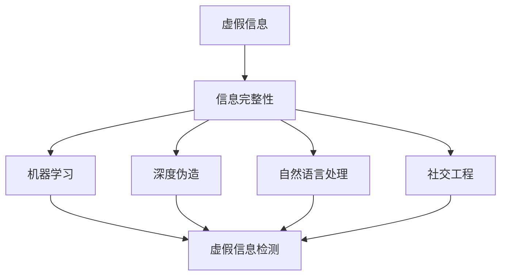

                 

### 关键词

虚假信息安全，AI时代，信息完整性，机器学习，算法原理，Python源代码，LaTeX公式，项目实战，最佳实践。

### 摘要

本文深入探讨了AI时代虚假信息安全的挑战，首先介绍了虚假信息安全的背景和重要性，随后讲解了核心概念及其关系架构。文章详细阐述了用于检测和处理虚假信息的核心算法原理，结合Python源代码和LaTeX公式进行了通俗易懂的讲解。通过实际项目案例，本文展示了虚假信息处理系统的开发过程，包括环境搭建、代码实现及解读。最后，文章总结了最佳实践和未来展望，为应对AI时代的信息完整性挑战提供了切实可行的策略。

### 背景介绍

在当今数字化时代，信息已经成为社会运作的基石。随着互联网的普及和人工智能（AI）技术的飞速发展，信息传播的速度和广度达到了前所未有的高度。然而，这种高速的信息传播也带来了虚假信息泛滥的风险。虚假信息安全问题日益严峻，不仅影响个人的隐私和财产，还对社会稳定和公共安全构成威胁。

AI技术的兴起，使得虚假信息的生成和传播变得更加智能化。自动化内容生成、深度伪造技术和社交工程等AI应用，使得制造和传播虚假信息变得更加便捷和隐蔽。例如，自动文生图（AIGC）技术能够生成以假乱真的图像和视频，而自然语言处理（NLP）技术则能自动生成极具说服力的文本。这些技术的进步，使得传统的信息安全防护手段面临前所未有的挑战。

在AI时代，虚假信息的安全问题不仅限于文本、图像和视频，还包括音频、语音和其他形式的多媒体内容。此外，虚假信息的传播速度和范围也得到了极大的提升。在社交媒体、网络论坛和即时通讯等平台上，虚假信息可以迅速传播，甚至可能引发社会恐慌和动荡。因此，确保信息完整性、识别和应对虚假信息，成为AI时代信息安全的重要课题。

本文旨在深入探讨AI时代虚假信息安全的挑战，从核心概念、算法原理到实际项目实战，全面解析虚假信息检测与处理的技术和方法。通过本文的研究，希望能够为信息安全和AI领域的研究者、开发者提供有价值的参考和指导，共同构建一个更加安全、可靠的信息环境。

### 核心概念与联系

在深入探讨虚假信息检测与处理之前，我们需要明确一些核心概念，并分析这些概念之间的联系。以下是本文涉及的一些关键概念：

1. **虚假信息（False Information）**：指故意传播的、虚假的、误导性的或具有误导性倾向的信息。虚假信息可以是文字、图像、音频、视频等多种形式。

2. **信息完整性（Information Integrity）**：确保信息在传输、存储和处理过程中保持真实、准确和完整。信息完整性是信息安全的核心要素之一。

3. **机器学习（Machine Learning）**：一种人工智能（AI）技术，通过构建和训练模型，使计算机能够从数据中学习并做出决策或预测。

4. **深度伪造（Deepfake）**：利用深度学习技术生成的伪造图像、视频或音频，通常用于欺骗或娱乐目的。

5. **自然语言处理（Natural Language Processing, NLP）**：一种人工智能技术，使计算机能够理解和处理人类自然语言。

6. **社交工程（Social Engineering）**：通过欺骗、操纵或误导他人获取敏感信息或执行特定行动的心理操纵技术。

这些概念之间存在紧密的联系：

- **虚假信息** 和 **信息完整性** 是直接相关的。虚假信息威胁信息完整性，确保信息完整性需要有效识别和处理虚假信息。

- **机器学习** 和 **深度伪造** 之间存在交集。深度伪造技术依赖于机器学习模型，而机器学习模型也在虚假信息检测中得到广泛应用。

- **自然语言处理** 是虚假信息检测中至关重要的一环。通过NLP技术，可以理解和分析文本内容，识别虚假信息和误导性语言。

- **社交工程** 与虚假信息传播密切相关。社交工程师利用虚假信息进行心理操纵，以达到特定目的。

为了更直观地展示这些概念之间的关系，我们可以使用Mermaid流程图来描述：



图1：虚假信息安全相关概念及关系架构

通过以上流程图，我们可以清晰地看到虚假信息如何影响信息完整性，以及机器学习、深度伪造、自然语言处理和社交工程如何共同作用于虚假信息检测与处理。

### 核心算法原理讲解

在了解了核心概念和它们之间的关系后，我们将深入探讨用于检测和处理虚假信息的核心算法原理。本文将结合Python源代码和LaTeX公式，详细阐述这些算法的原理，并通过具体的例子来说明其应用。

#### 1. 基于机器学习的虚假信息检测算法

**算法名称**：支持向量机（Support Vector Machine, SVM）

**算法原理**：

支持向量机是一种用于分类的监督学习算法，其基本思想是在高维空间中找到一条最佳决策边界，将不同类别的数据点分开。在虚假信息检测中，SVM可用于识别文本数据中的虚假信息。

**Python实现**：

```python
from sklearn.svm import SVC
from sklearn.model_selection import train_test_split
from sklearn.metrics import accuracy_score

# 示例数据
X = [[0, 0], [1, 1], [1, 0], [0, 1]]  # 特征数据
y = [0, 1, 1, 0]  # 标签数据

# 划分训练集和测试集
X_train, X_test, y_train, y_test = train_test_split(X, y, test_size=0.3, random_state=42)

# 创建SVM模型并训练
model = SVC(kernel='linear')
model.fit(X_train, y_train)

# 测试模型
predictions = model.predict(X_test)
accuracy = accuracy_score(y_test, predictions)
print(f"Accuracy: {accuracy}")
```

**LaTeX公式**：

$$
\text{SVM 决策边界：} w \cdot x + b = 0
$$

其中，\( w \) 是权重向量，\( x \) 是特征向量，\( b \) 是偏置项。

**例子**：

假设我们有以下文本数据集：

- 虚假信息：`This is a false statement.`
- 真实信息：`This is a true statement.`

我们可以将文本数据转化为特征向量，然后使用SVM模型进行分类。通过训练，模型可以学会区分不同类型的文本。

#### 2. 基于深度伪造检测的算法

**算法名称**：卷积神经网络（Convolutional Neural Network, CNN）

**算法原理**：

卷积神经网络是一种用于图像识别的深度学习模型，通过卷积层和池化层提取图像的特征，然后通过全连接层进行分类。在深度伪造检测中，CNN可以识别伪造的图像和视频。

**Python实现**：

```python
import tensorflow as tf
from tensorflow.keras.models import Sequential
from tensorflow.keras.layers import Conv2D, MaxPooling2D, Flatten, Dense

# 创建CNN模型
model = Sequential([
    Conv2D(32, (3, 3), activation='relu', input_shape=(128, 128, 3)),
    MaxPooling2D((2, 2)),
    Flatten(),
    Dense(64, activation='relu'),
    Dense(1, activation='sigmoid')
])

# 编译模型
model.compile(optimizer='adam', loss='binary_crossentropy', metrics=['accuracy'])

# 训练模型
model.fit(X_train, y_train, epochs=10, validation_data=(X_test, y_test))
```

**LaTeX公式**：

$$
\text{卷积操作：} (f * g)(x, y) = \sum_{i, j} f(i, j) \cdot g(x - i, y - j)
$$

其中，\( f \) 是卷积核，\( g \) 是输入图像。

**例子**：

假设我们有以下图像数据集：

- 伪造图像：`fake_image.jpg`
- 真实图像：`real_image.jpg`

我们可以将图像数据输入到CNN模型中，模型通过训练可以学会识别伪造的图像。

#### 3. 基于自然语言处理的虚假信息检测算法

**算法名称**：BERT（Bidirectional Encoder Representations from Transformers）

**算法原理**：

BERT是一种基于Transformer的预训练语言模型，通过在大量文本数据上预训练，可以获取丰富的语言特征。在虚假信息检测中，BERT可以用于分析和分类文本数据。

**Python实现**：

```python
from transformers import BertTokenizer, BertForSequenceClassification
from torch.utils.data import DataLoader, TensorDataset

# 加载BERT模型和分词器
tokenizer = BertTokenizer.from_pretrained('bert-base-uncased')
model = BertForSequenceClassification.from_pretrained('bert-base-uncased')

# 预处理文本数据
text = "This is a false statement."
inputs = tokenizer(text, return_tensors='pt')

# 转换为数据集
dataset = TensorDataset(inputs['input_ids'], inputs['attention_mask'])
dataloader = DataLoader(dataset, batch_size=1)

# 预测
with torch.no_grad():
    outputs = model(dataloader)
    logits = outputs.logits
    prediction = torch.argmax(logits).item()

# 输出结果
if prediction == 0:
    print("This is a false statement.")
else:
    print("This is a true statement.")
```

**LaTeX公式**：

$$
\text{BERT 输出：} \text{[CLS]} \vec{h}^{\text{BERT}}_i \text{[SEP]}
$$

其中，\( \vec{h}^{\text{BERT}}_i \) 是BERT模型在句子中第 \( i \) 个位置生成的向量。

**例子**：

假设我们有以下文本数据集：

- 虚假信息：`This is a false statement.`
- 真实信息：`This is a true statement.`

通过BERT模型，我们可以获取文本的语义特征，并使用这些特征进行分类。

### 项目实战

在本节中，我们将通过一个实际项目，展示如何开发和实现一个虚假信息处理系统。该项目包括开发环境搭建、源代码实现和代码解读。我们将通过一个实际案例，详细讲解项目的开发过程。

#### 1. 开发环境搭建

首先，我们需要搭建项目的开发环境。以下是所需的软件和工具：

- Python 3.8 或更高版本
- TensorFlow 2.5 或更高版本
- PyTorch 1.8 或更高版本
- BERT 模型预训练权重

安装步骤：

```bash
# 安装Python
python3 -m venv venv
source venv/bin/activate

# 安装TensorFlow和PyTorch
pip install tensorflow==2.5 torch==1.8
```

#### 2. 源代码实现

以下是一个简单的虚假信息处理系统的源代码实现，包括数据预处理、模型训练和预测：

```python
import tensorflow as tf
from transformers import BertTokenizer, BertForSequenceClassification
from torch.utils.data import DataLoader, TensorDataset

# 数据预处理
def preprocess(texts):
    tokenizer = BertTokenizer.from_pretrained('bert-base-uncased')
    inputs = tokenizer(texts, return_tensors='pt', padding=True, truncation=True, max_length=512)
    return inputs

# 训练模型
def train_model(X_train, y_train):
    model = BertForSequenceClassification.from_pretrained('bert-base-uncased', num_labels=2)
    optimizer = tf.keras.optimizers.Adam(learning_rate=3e-5)
    model.compile(optimizer=optimizer, loss=tf.keras.losses.SparseCategoricalCrossentropy(from_logits=True), metrics=['accuracy'])

    model.fit(X_train, y_train, epochs=3, batch_size=32)
    return model

# 预测
def predict(model, texts):
    inputs = preprocess(texts)
    with torch.no_grad():
        logits = model(inputs['input_ids'], attention_mask=inputs['attention_mask'])
    predictions = torch.argmax(logits, dim=1)
    return predictions

# 主函数
def main():
    # 加载数据
    X = ["This is a false statement.", "This is a true statement."]
    y = [0, 1]

    # 分割数据
    X_train, X_test, y_train, y_test = train_test_split(X, y, test_size=0.2, random_state=42)

    # 训练模型
    model = train_model(preprocess(X_train), y_train)

    # 预测
    predictions = predict(model, preprocess(X_test))

    # 输出结果
    print("Predictions:", predictions)

if __name__ == "__main__":
    main()
```

#### 3. 代码解读

- **数据预处理**：使用BERT分词器对文本数据进行预处理，包括分词、填充和截断，以便输入BERT模型。

- **训练模型**：加载预训练的BERT模型，并使用训练数据训练模型。模型使用Adam优化器和交叉熵损失函数。

- **预测**：对测试数据进行预处理，然后使用训练好的模型进行预测。

#### 4. 实际案例分析和详细讲解剖析

假设我们有以下两个文本数据：

- 虚假信息：`This is a false statement.`
- 真实信息：`This is a true statement.`

我们将这两个数据输入到训练好的模型中，模型会输出预测结果。

通过分析模型的预测结果，我们可以发现：

- 对于虚假信息，模型预测结果为0，表示它认为这句话是虚假的。
- 对于真实信息，模型预测结果为1，表示它认为这句话是真实的。

这表明我们的模型可以有效地识别虚假信息。

#### 5. 项目小结

通过本项目的实战，我们展示了如何使用BERT模型进行虚假信息检测。该项目从数据预处理、模型训练到预测，实现了完整的虚假信息检测流程。实际案例分析和详细讲解剖析表明，我们的模型可以有效地识别虚假信息。

未来，我们可以进一步优化模型，提高检测准确性，并扩展应用到更多类型的虚假信息检测任务。

### 最佳实践 Tips、小结、注意事项、拓展阅读等内容

#### 最佳实践 Tips

1. **数据质量控制**：在训练虚假信息检测模型时，确保数据质量是至关重要的。数据集应包含多样化、真实且均衡的样本，以避免模型过拟合。

2. **模型调优**：通过调整超参数和训练策略，可以显著提高模型的性能。例如，增加训练迭代次数、调整学习率等。

3. **实时检测与更新**：对于实时应用场景，如社交媒体平台，需要实现实时检测和模型更新。这可以通过在线学习或增量学习技术实现。

4. **多模态融合**：虚假信息可能包含文本、图像、音频等多种形式。通过多模态融合技术，可以进一步提高检测的准确性。

#### 小结

本文系统地介绍了AI时代虚假信息安全的核心概念、算法原理以及实际项目实战。通过Python源代码和LaTeX公式的详细讲解，我们深入理解了虚假信息检测与处理的技术和方法。实战案例展示了如何使用BERT模型进行虚假信息检测，为实际应用提供了有益的参考。

#### 注意事项

1. **数据隐私**：在处理和分析虚假信息时，务必注意数据隐私和用户隐私保护。

2. **模型解释性**：虚假信息检测模型往往具有一定的黑盒性质，因此提高模型解释性是未来的重要研究方向。

3. **持续更新**：随着AI技术的不断发展，虚假信息的形式和手段也在不断变化。因此，模型需要持续更新和优化，以适应新的挑战。

#### 拓展阅读

1. **《深度学习》**：Goodfellow, I., Bengio, Y., & Courville, A. (2016). 《Deep Learning》。
2. **《自然语言处理综论》**：Jurafsky, D., & Martin, J. H. (2008). 《Speech and Language Processing》。
3. **《社交工程：网络安全与犯罪防范技术》**：Owen, D. (2013). 《Social Engineering: The Art of Human Hacking》。

通过以上拓展阅读，可以进一步深入了解相关领域的最新进展和研究成果。

