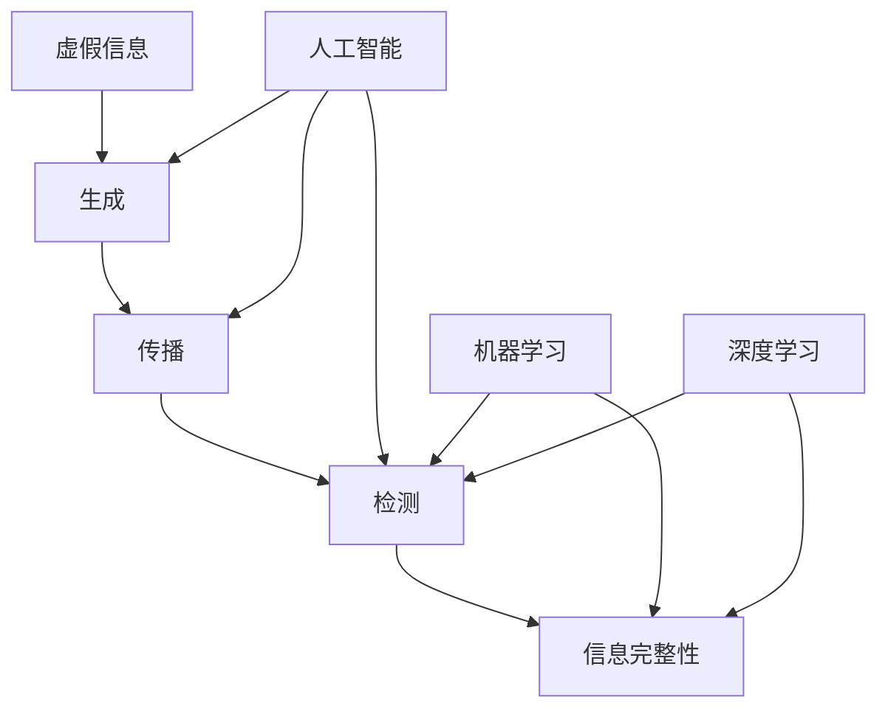

                 

### 关键词

AI虚假信息，信息安全，信息完整性，人工智能时代，虚假信息识别与防范。

### 摘要

随着人工智能技术的发展，虚假信息在信息生态中愈演愈烈，对个人、企业和社会造成了严重威胁。本文深入探讨了AI时代虚假信息产生的背景、类型及其特点，分析了虚假信息安全的重要性，并提出了识别与防范虚假信息的策略与技术方案。文章通过详细阐述虚假信息检测的基本原理、算法与应用，以及防范虚假信息的策略、政策和法规，展示了AI时代虚假信息完整性保障的挑战与机遇。同时，通过项目实战和未来展望，为读者提供了应对虚假信息安全的具体路径和最佳实践建议。

---

### 第一部分：背景与挑战

#### 第1章：AI时代的虚假信息生态

随着人工智能（AI）技术的飞速发展，虚假信息（misinformation）的生成、传播和影响日益扩大。在AI时代，虚假信息的生态发生了深刻变化，其对个人、企业和社会的威胁也变得更加复杂和严峻。

#### 1.1 AI技术对信息生态的影响

AI技术的兴起，极大地改变了信息生成与传播的方式。通过深度学习、自然语言处理（NLP）等AI技术，虚假信息的生成变得更加高效、精准和隐蔽。以下从三个方面探讨AI技术对信息生态的影响：

1. **信息生成效率提升**：传统的虚假信息往往需要人工编撰，而AI可以自动生成虚假信息，大幅度提高了信息生成的效率。

2. **传播途径多样化**：AI技术使得虚假信息可以通过社交网络、搜索引擎等平台快速传播，覆盖范围广泛。

3. **影响深度增加**：AI技术可以模拟真实数据，使得虚假信息更难以识别，从而对受众产生更深远的影响。

#### 1.2 AI驱动虚假信息传播的机制

AI驱动虚假信息的传播机制主要包括以下几个方面：

1. **个性化推荐**：基于用户兴趣和行为的数据分析，AI系统能够精准推送虚假信息，增加用户对虚假信息的接触频率。

2. **社交网络扩散**：虚假信息在社交网络中通过用户分享、评论等方式迅速传播，形成信息风暴。

3. **虚假信息的生命周期管理**：AI技术可以对虚假信息进行生命周期管理，从生成、传播到掩饰，形成完整的虚假信息生态系统。

#### 1.3 AI时代虚假信息的类型与特点

AI时代的虚假信息呈现出与传统虚假信息不同的类型与特点：

1. **自动化生成**：AI技术使得虚假信息的生成过程自动化，降低了生成门槛。

2. **深度伪造**：利用AI生成伪造音频、视频等，使得虚假信息更具欺骗性。

3. **复杂链式传播**：虚假信息通过多种渠道和方式进行传播，形成复杂的传播网络。

4. **信息对抗**：AI技术与反虚假信息技术的对抗，使得虚假信息的识别和防范变得更加复杂。

#### 1.4 虚假信息安全的重要性

虚假信息安全对个人、企业和社会具有重要意义：

1. **个人隐私保护**：虚假信息的传播可能导致个人隐私泄露，造成不必要的困扰。

2. **企业声誉受损**：虚假信息可能对企业形象和业务造成严重影响，损害企业利益。

3. **社会稳定威胁**：虚假信息的扩散可能引发社会恐慌，影响社会稳定。

#### 1.5 虚假信息安全对企业和个人的威胁

虚假信息对企业和个人的威胁主要包括以下几个方面：

1. **经济损失**：虚假信息可能导致企业财产损失、投资者信心下降。

2. **声誉损害**：虚假信息可能导致企业品牌形象受损，影响长期发展。

3. **隐私泄露**：个人隐私信息可能被非法利用，导致财产损失和身份欺诈。

4. **心理健康问题**：虚假信息可能对个人心理健康造成负面影响，增加焦虑和恐慌情绪。

#### 1.6 虚假信息完整性保障的需求

在AI时代，虚假信息完整性保障的需求愈发迫切，主要包括：

1. **技术需求**：需要开发高效、准确的虚假信息检测与防范技术。

2. **政策需求**：需要制定相关政策和法规，规范虚假信息的传播和治理。

3. **社会需求**：公众对虚假信息有较强的辨识能力和防范意识，需要加强宣传教育。

### 总结

AI时代的虚假信息生态复杂多变，对个人、企业和社会带来了前所未有的挑战。理解AI技术对信息生态的影响，识别AI驱动虚假信息传播的机制，了解虚假信息的类型与特点，认识到虚假信息安全的重要性，以及应对虚假信息完整性保障的需求，是我们在AI时代必须关注和解决的问题。只有这样，我们才能有效应对AI时代的虚假信息挑战，保障信息生态的健康发展。

---

### 背景介绍

人工智能（AI）技术的迅猛发展，为人类生活带来了诸多便利，但也引发了一系列新的挑战。其中，虚假信息（misinformation）在AI时代的泛滥，成为社会信息生态中的一大隐患。虚假信息不仅损害了个人隐私和声誉，还对企业形象和业务造成严重威胁，甚至可能影响社会稳定。

虚假信息是指故意传播的、误导性或未经证实的信息，可能涉及错误的事实、误导性的观点或故意伪造的内容。在传统媒体时代，虚假信息的传播依赖于人为干预，如新闻编辑的疏忽、记者的偏见等。然而，随着AI技术的发展，虚假信息的生成、传播和影响方式发生了根本性变化。

AI技术在虚假信息生成方面的应用主要体现在以下几个方面：

1. **自动化生成**：通过机器学习算法，AI能够自动生成具有高度相似度的虚假信息。例如，利用生成对抗网络（GANs）生成的深度伪造图像和视频，可以以假乱真，难以被普通人辨别。

2. **个性化推荐**：基于用户的兴趣和行为数据，AI算法能够精准推送虚假信息，增加用户接触虚假信息的概率。例如，社交媒体平台上的虚假新闻可能会被算法推荐给特定用户群体，从而扩大其传播范围。

3. **自动化传播**：AI技术使得虚假信息能够通过自动化工具迅速传播。例如，机器人账号可以在短时间内向大量用户发送虚假信息，形成信息风暴。

4. **对抗性攻击**：AI技术还可以用于对抗性攻击，即通过设计特定的输入数据来欺骗或破坏AI系统的正常工作。例如，利用对抗性样本（adversarial examples）来欺骗虚假信息检测模型，使其误判虚假信息为真实信息。

AI技术不仅改变了虚假信息的生成和传播方式，也对其特点产生了深远影响。在AI时代，虚假信息具有以下新特点：

1. **高度自动化**：虚假信息的生成过程高度自动化，降低了人为干预的需求，使得虚假信息的生成和传播更加高效。

2. **深度伪造**：AI技术使得虚假信息具有更高的真实感，如深度伪造的音频、视频和图片，使得虚假信息更加难以辨别。

3. **复杂链式传播**：虚假信息通过多种渠道和方式进行传播，形成复杂的传播网络，使得虚假信息的追踪和治理更加困难。

4. **对抗性增强**：AI技术与反虚假信息技术的对抗不断升级，使得虚假信息的识别和防范更加复杂。

虚假信息在AI时代的影响范围更加广泛，不仅影响个人隐私和声誉，还可能对企业形象和业务造成严重威胁。例如，虚假信息可能导致投资者对企业的信心下降，进而影响企业的股价和市值。此外，虚假信息还可能引发社会恐慌，影响社会稳定。

在AI时代，虚假信息完整性保障的需求愈发迫切。首先，技术层面需要开发高效、准确的虚假信息检测与防范技术，如基于深度学习的虚假信息检测模型、自动化内容审核系统等。其次，政策层面需要制定相关政策和法规，规范虚假信息的传播和治理，如加强对社交媒体平台的管理，制定虚假信息举报和处理机制等。最后，社会层面需要加强公众对虚假信息的辨识能力和防范意识，通过宣传教育提高公众的媒介素养。

总之，AI时代的虚假信息挑战复杂多变，需要各方共同努力，从技术、政策和教育等多个层面出发，构建一个健康、可靠的信息生态，保障虚假信息完整性，维护社会稳定和公众利益。

---

### 核心概念与联系

在探讨虚假信息完整性的过程中，理解几个核心概念及其相互之间的关系至关重要。以下是对这些核心概念的详细解释，并绘制了Mermaid流程图以展示它们之间的联系。

#### 核心概念

1. **虚假信息（Misinformation）**：指故意传播的、误导性或未经证实的信息。这类信息可能涉及错误的事实、误导性的观点或故意伪造的内容。

2. **人工智能（AI）**：指模拟、延伸和扩展人类智能的技术和系统。在虚假信息领域，AI技术被广泛应用于虚假信息的生成、传播和检测。

3. **信息完整性（Information Integrity）**：指信息在生成、存储、传输和处理过程中保持其真实性和准确性的能力。

4. **机器学习（Machine Learning）**：一种AI子领域，通过数据和算法让计算机自动改进性能，常用于虚假信息检测。

5. **深度学习（Deep Learning）**：机器学习的一种方法，使用多层神经网络进行数据处理和分析，广泛应用于虚假信息检测中。

#### Mermaid流程图

以下是一个Mermaid流程图，展示上述核心概念之间的相互关系：



#### 关系解释

- **虚假信息与人工智能**：人工智能技术可以生成、传播和检测虚假信息，从而影响信息完整性。
- **信息完整性**：信息完整性依赖于有效的虚假信息检测，而AI技术（特别是机器学习和深度学习）在虚假信息检测中起着关键作用。
- **机器学习与深度学习**：两者都是AI的子领域，在虚假信息检测中应用广泛。机器学习通过算法从数据中学习模式，而深度学习通过多层神经网络进行复杂的模式识别。

通过理解这些核心概念及其相互关系，我们可以更好地构建和优化虚假信息检测与防范系统，从而保障信息完整性，应对AI时代的虚假信息挑战。

---

### 虚假信息检测的基本原理

虚假信息检测是保障信息完整性的关键步骤，其核心在于通过算法和模型识别并过滤掉虚假信息。以下是虚假信息检测的基本原理，包括基于规则的方法和基于统计学习的方法。

#### 1.1 基于规则的方法

基于规则的方法是最早期且最简单的一种虚假信息检测方法。该方法依赖于预定义的规则集，当检测到的信息符合某一规则时，就会被判定为虚假信息。以下是其主要步骤：

1. **规则集构建**：首先，需要构建一套包含各种虚假信息特征的规则集。这些规则可以是基于专业知识或以往案例总结出的经验规律。
2. **信息匹配**：对于输入的信息，系统会逐一与规则集进行匹配。如果信息与某条规则匹配，则判定该信息为虚假信息。
3. **规则更新**：随着新的虚假信息案例的出现，规则集需要不断更新，以适应新的检测需求。

**优点**：
- 实现简单，易于理解和部署。
- 对于已知类型的虚假信息具有较好的检测效果。

**缺点**：
- 对于新型虚假信息的检测能力有限，难以适应快速变化的信息环境。
- 需要不断更新和维护规则集，否则可能导致误判和漏判。

#### 1.2 基于统计学习的方法

基于统计学习的方法通过从数据中学习特征和模式来进行虚假信息检测。这种方法的核心在于利用大量真实和虚假信息数据，训练出一个能够区分两者的分类模型。以下是主要步骤：

1. **数据收集与预处理**：收集大量的虚假信息样本和真实信息样本，并进行预处理，如去噪、归一化等。
2. **特征提取**：从预处理后的数据中提取特征，如文本特征、时间特征、来源特征等。
3. **模型训练**：使用提取出的特征数据，通过统计学习方法（如支持向量机SVM、随机森林、神经网络等）训练分类模型。
4. **模型评估与优化**：使用验证集评估模型的性能，通过调整参数和特征选择等手段进行优化。

**优点**：
- 能够自动学习复杂的信息特征和模式，具有较强的适应性和鲁棒性。
- 对于新型虚假信息的检测效果较好，能够动态适应信息环境的变化。

**缺点**：
- 需要大量的训练数据，且数据质量对模型性能影响较大。
- 训练过程可能需要较长时间，计算资源消耗较大。

#### 1.3 方法比较

**基于规则的方法**和**基于统计学习的方法**各有优缺点，适用于不同的应用场景。基于规则的方法适用于规则明确、变化较小的场景，如邮件垃圾过滤、社交媒体内容审核等。而基于统计学习的方法则适用于需要实时检测、动态适应变化的信息环境，如虚假新闻检测、社交媒体舆情分析等。

**融合方法**：为了克服单一方法的局限性，还可以采用融合方法，将规则方法和统计学习方法结合，取长补短。例如，在虚假信息检测中，可以先使用规则方法进行初步筛选，然后对疑似虚假信息使用统计学习方法进行进一步验证，从而提高检测的准确率和效率。

总之，虚假信息检测的基本原理涉及多种方法和技术，选择合适的方法取决于具体的应用场景和需求。通过不断优化和改进，虚假信息检测技术将更好地应对AI时代的挑战，保障信息完整性。

---

### 虚假信息检测的算法与应用

在虚假信息检测中，算法的选择和应用至关重要。以下将介绍几种常见的虚假信息检测算法，并探讨其在实际应用中的效果。

#### 2.1.1 常见虚假信息检测算法

**1. 支持向量机（SVM）**

支持向量机是一种基于统计学习的分类算法，通过最大化分类间隔来划分数据。在虚假信息检测中，SVM可以用来分类文本数据，判断某条信息是否为虚假信息。

**2. 随机森林（Random Forest）**

随机森林是一种基于决策树的集成学习方法，通过构建多个决策树并取其平均值来提高预测准确性。在虚假信息检测中，随机森林可以处理大规模的文本数据，并具有较强的泛化能力。

**3. 长短期记忆网络（LSTM）**

长短期记忆网络是一种循环神经网络（RNN）的变体，适用于处理序列数据。在虚假信息检测中，LSTM可以捕捉文本中的时间依赖关系，从而提高检测效果。

**4. 卷积神经网络（CNN）**

卷积神经网络是一种用于图像处理和文本分类的深度学习模型，通过卷积操作提取文本特征。在虚假信息检测中，CNN可以有效地提取文本中的局部特征，提高分类准确性。

**5. 生成对抗网络（GAN）**

生成对抗网络是一种通过对抗训练生成数据的方法，可以生成高质量的虚假信息样本。在虚假信息检测中，GAN可以用来生成虚假信息样本，从而提高检测模型的鲁棒性。

#### 2.1.2 虚假信息检测在社交媒体中的应用

社交媒体平台是虚假信息传播的主要渠道之一，以下介绍几种虚假信息检测在社交媒体中的应用：

**1. 虚假新闻检测**

虚假新闻检测是社交媒体平台常见的应用之一。通过训练分类模型，平台可以对用户发布的新闻内容进行实时检测，判断其是否为虚假新闻。常见的虚假新闻检测算法包括SVM、LSTM和CNN等。

**2. 用户行为分析**

通过分析用户在社交媒体上的行为，如点赞、评论、分享等，可以识别出潜在的虚假信息传播者。这种方法结合了机器学习和社交网络分析技术，可以有效地监控和遏制虚假信息的传播。

**3. 自动化内容审核**

社交媒体平台通常采用自动化内容审核系统来检测和过滤虚假信息。这些系统使用预训练的模型对上传的内容进行实时检测，一旦发现虚假信息，立即进行标记或删除。

**4. 社交媒体舆情分析**

通过收集和分析社交媒体上的信息，可以了解公众对某一事件或话题的看法，从而发现潜在的虚假信息。舆情分析可以用于政府决策、市场营销和品牌管理等。

#### 2.1.3 应用效果与挑战

**应用效果**：

- **准确性**：随着算法和模型的不断优化，虚假信息检测的准确性逐渐提高。例如，使用深度学习算法的虚假新闻检测系统可以达到90%以上的准确率。

- **实时性**：虚假信息检测系统通常具有较好的实时性，可以在短时间内对大量信息进行检测，从而及时发现和遏制虚假信息的传播。

- **鲁棒性**：通过对抗训练和模型优化，虚假信息检测系统对新型虚假信息的适应能力逐渐增强，提高了检测的鲁棒性。

**挑战**：

- **数据质量**：虚假信息检测依赖于大量的真实和虚假信息数据，数据质量对模型性能影响较大。数据偏差、噪声和缺失值等问题都可能影响检测效果。

- **计算资源**：深度学习算法通常需要大量的计算资源，训练和推理过程可能需要较长时间。对于实时性要求较高的应用，计算资源成为一大挑战。

- **跨平台兼容性**：虚假信息检测系统需要在不同平台和应用场景下运行，跨平台的兼容性成为一大挑战。

- **动态适应性**：虚假信息生成和传播方式不断变化，检测系统需要具备动态适应性，以应对新型虚假信息的挑战。

总之，虚假信息检测算法在社交媒体等应用场景中发挥了重要作用，但同时也面临着一系列挑战。通过不断优化算法和模型，提高检测系统的准确性和实时性，我们可以更好地应对AI时代的虚假信息挑战。

---

### 虚假信息的可视化与报告

在虚假信息检测过程中，数据可视化是关键的一环，它能够帮助我们直观地理解虚假信息的分布和传播路径，从而为制定应对策略提供依据。同时，详细的报告能够总结检测结果，便于进一步的分析和决策。

#### 3.1.1 虚假信息的可视化方法

**1. 热力图（Heatmap）**

热力图是一种常用于数据可视化的方法，它通过颜色深浅来表示数据的密度。在虚假信息检测中，热力图可以用来展示虚假信息的分布情况，例如，在地图上标出虚假信息出现的高频区域。

**2. 关联图（Graph）**

关联图通过节点和边来表示数据之间的关系，可以用于展示虚假信息的传播路径。例如，我们可以用节点表示信息的来源和传播者，用边表示信息的传递过程，从而直观地看到虚假信息是如何扩散的。

**3. 词云（Word Cloud）**

词云是一种将文本数据中的词频转换为可视化的图形的方法。在虚假信息检测中，词云可以用来展示虚假信息的关键词分布，帮助我们快速识别虚假信息的核心内容。

**4. 时间序列图（Time Series Chart）**

时间序列图可以用来展示虚假信息随时间的变化趋势。通过时间序列图，我们可以了解虚假信息的传播速度和周期性变化，从而更好地预测其未来发展趋势。

#### 3.1.2 虚假信息报告的格式与内容

虚假信息报告的格式和内容对于分析检测结果和制定相应策略至关重要。以下是虚假信息报告的一般格式和内容：

**1. 报告封面**

报告封面应包含报告名称、报告日期、报告编制单位等信息。

**2. 目录**

目录列出报告中的各个章节和子章节，方便读者快速定位所需内容。

**3. 摘要**

摘要部分简要介绍报告的主要内容，包括检测方法、结果和结论。

**4. 背景与概述**

该部分详细描述虚假信息检测的背景、目的和意义，以及检测所涉及的数据来源和处理方法。

**5. 检测结果**

检测结果部分是报告的核心，包括以下几个方面：

- **虚假信息分布**：通过热力图、关联图等可视化方法，展示虚假信息的分布情况。
- **关键词分析**：利用词云展示虚假信息的关键词分布。
- **传播路径**：通过关联图展示虚假信息的传播路径。
- **时间序列分析**：展示虚假信息随时间的变化趋势。

**6. 检测分析**

检测分析部分对检测结果进行深入分析，包括：

- **虚假信息的类型与特点**：分析虚假信息的类型和特点，如深度伪造、谣言等。
- **传播渠道与方式**：分析虚假信息的主要传播渠道和方式。
- **检测效果评估**：评估检测模型的准确率、召回率等指标，并提出改进建议。

**7. 政策与建议**

该部分提出针对虚假信息检测的政策建议，包括：

- **法律法规**：提出完善相关法律法规的建议。
- **技术改进**：提出改进虚假信息检测技术的建议。
- **公众教育**：提出加强公众对虚假信息辨识能力的建议。

**8. 参考文献**

参考文献部分列出报告中所引用的文献和资料，便于读者进一步学习和参考。

**9. 附录**

附录部分可以包含一些详细的图表、数据和分析结果，以供参考。

#### 3.1.3 虚假信息可视化与报告的实践案例

以下是一个虚假信息检测和报告的实践案例：

**案例背景**：某社交平台检测到一起虚假信息传播事件，该虚假信息声称某地区发生了大规模疫情，引起了公众恐慌。

**检测过程**：

1. **数据收集**：收集该虚假信息及其相关评论、转发等信息。
2. **预处理**：对收集的数据进行清洗和预处理，包括去除噪声、标准化文本等。
3. **特征提取**：提取文本特征，如词频、主题模型等。
4. **模型训练**：使用训练集训练分类模型，如SVM、LSTM等。
5. **检测与可视化**：使用训练好的模型对测试集进行检测，并使用热力图、词云、关联图等可视化方法展示检测结果。

**报告内容**：

1. **虚假信息分布**：通过热力图展示虚假信息在不同地区的分布情况。
2. **关键词分析**：利用词云展示虚假信息的关键词，如“疫情”、“恐慌”等。
3. **传播路径**：通过关联图展示虚假信息的传播路径，包括来源、传播者和受害者。
4. **时间序列分析**：展示虚假信息随时间的变化趋势，发现传播高峰期。
5. **检测效果评估**：评估分类模型的准确率和召回率，提出改进建议。
6. **政策与建议**：提出针对虚假信息传播的法律法规和技术改进建议。

通过这个案例，我们可以看到虚假信息可视化与报告在检测和应对虚假信息中的重要作用。未来，随着技术的不断进步，虚假信息检测和报告将更加高效和精确，为维护信息生态的健康发展提供有力支持。

---

### 虚假信息的防范策略

虚假信息的传播不仅对个人隐私和名誉造成损害，还可能对企业的声誉和业务产生严重影响。为了应对AI时代虚假信息的挑战，我们需要采取一系列策略来防范虚假信息的传播，保护个人和企业利益。以下是一些有效的虚假信息防范策略：

#### 3.1.1 信息加密与访问控制

**1. 信息加密**

信息加密是一种常用的防范虚假信息传播的方法。通过加密技术，将信息转化为难以解读的密文，只有拥有正确密钥的用户才能解密和读取信息。常用的加密算法包括对称加密和非对称加密。对称加密如AES（高级加密标准），非对称加密如RSA（Rivest-Shamir-Adleman）。

**实施方法**：

- **加密存储**：在数据库中存储敏感信息时，使用加密技术保护数据，确保即使数据泄露，攻击者也无法读取。
- **加密通信**：在传输敏感信息时，使用加密通信协议（如TLS/SSL）确保数据在传输过程中的安全性。

**2. 访问控制**

访问控制是一种基于身份验证和权限管理的机制，确保只有授权用户才能访问敏感信息。通过设置不同的访问级别和权限，可以防止未经授权的用户访问和篡改信息。

**实施方法**：

- **用户身份验证**：采用双因素认证（2FA）或多因素认证（MFA）来加强用户身份验证，确保只有合法用户才能登录系统。
- **权限管理**：根据用户角色和职责设置不同的访问权限，避免信息泄露和滥用。例如，对于企业内部系统，可以设置高级管理人员有更高的访问权限，普通员工只能访问与工作相关的信息。

#### 3.1.2 防火墙与入侵检测系统

**1. 防火墙**

防火墙是一种网络安全设备，用于监控和控制进出网络的数据流，防止未经授权的访问和攻击。防火墙可以设置规则，允许或阻止特定IP地址、端口或协议的数据流。

**实施方法**：

- **部署防火墙**：在网络边界部署防火墙，设置合适的规则来过滤网络流量，防止恶意流量进入内部网络。
- **动态更新规则**：定期更新防火墙规则，以应对新的威胁和攻击。

**2. 入侵检测系统（IDS）**

入侵检测系统是一种监控系统，用于检测网络中的异常行为和潜在攻击。IDS可以通过分析网络流量和系统日志，发现异常行为，并及时报警。

**实施方法**：

- **部署IDS**：在关键网络节点部署入侵检测系统，实现对网络流量的实时监控。
- **配置告警机制**：设置告警规则，当检测到异常行为时，自动发送告警通知，以便及时采取措施。

#### 3.1.3 数据备份与恢复

**1. 数据备份**

数据备份是一种防止数据丢失和损坏的有效方法。通过定期备份重要数据，可以在发生灾难时迅速恢复系统，减少损失。

**实施方法**：

- **本地备份**：将数据备份到本地存储设备（如硬盘、磁带等）。
- **远程备份**：将数据备份到远程服务器或云存储，确保即使本地设备损坏，数据仍然安全。

**2. 数据恢复**

数据恢复是一种从备份中恢复数据的方法。在发生数据丢失或损坏时，通过数据恢复技术，可以重新获取重要数据。

**实施方法**：

- **定期测试恢复**：定期测试数据恢复过程，确保在发生灾难时能够迅速恢复数据。
- **备份存储管理**：建立完善的备份存储管理系统，确保备份数据的安全和可靠性。

#### 3.1.4 法律法规与政策

**1. 国际虚假信息法规**

随着虚假信息在全球范围内的传播，多个国家制定了相关的法律法规来应对这一挑战。以下是一些主要国际法规：

- **欧盟通用数据保护条例（GDPR）**：GDPR规定了个人数据的处理和保护规则，包括虚假信息的传播和处理。
- **美国《虚假信息传播法案》**：该法案旨在打击虚假信息的传播，规定了虚假信息的法律责任。

**2. 我国虚假信息法规**

我国也制定了一系列法规来规范虚假信息的传播和处理。以下是一些主要法规：

- **《中华人民共和国网络安全法》**：规定了网络安全的基本制度和要求，包括虚假信息的管理和治理。
- **《互联网信息服务管理办法》**：规定了互联网信息服务的管理规则，包括虚假信息的发布和审核。

**实施方法**：

- **遵守法规**：企业和个人应遵守相关法律法规，确保虚假信息的传播和处理合法合规。
- **举报机制**：建立虚假信息举报机制，鼓励公众积极参与虚假信息的监督和举报。

#### 3.1.5 公众教育与宣传

**1. 媒介素养教育**

提高公众的媒介素养，是防范虚假信息传播的重要手段。通过媒介素养教育，公众可以更好地识别和应对虚假信息。

**实施方法**：

- **学校教育**：在中小学和大学设置媒介素养课程，培养学生的信息辨别能力。
- **社会宣传**：通过媒体、网络和社区活动等渠道，宣传媒介素养知识，提高公众的识别能力。

**2. 专业培训**

对于企业和行业从业人员，开展专业培训，提高其虚假信息防范和应对能力。

**实施方法**：

- **企业培训**：组织内部培训，提高员工对虚假信息的识别和防范能力。
- **行业合作**：行业内部开展合作，共同制定虚假信息防范标准和策略。

通过以上防范策略的综合应用，我们可以有效地应对AI时代的虚假信息挑战，保障信息生态的健康发展。在技术、政策和教育等多方面的共同努力下，虚假信息的传播将得到有效遏制，个人和企业的利益将得到充分保护。

---

### 虚假信息防范的技术手段

在应对虚假信息挑战的过程中，技术手段的运用至关重要。以下将详细探讨几种常见的技术手段，包括信息加密与访问控制、防火墙与入侵检测系统、数据备份与恢复，以及其在实际中的应用。

#### 3.1.1 信息加密与访问控制

**信息加密**：信息加密是一种通过将数据转化为难以解读的形式，保护信息不被未授权访问的技术手段。常见的信息加密方法包括对称加密和非对称加密。

- **对称加密**：对称加密使用相同的密钥对数据进行加密和解密。如AES（高级加密标准）是一种常用的对称加密算法。
- **非对称加密**：非对称加密使用一对密钥（公钥和私钥）进行加密和解密。如RSA（Rivest-Shamir-Adleman）是一种常用的非对称加密算法。

**应用实例**：

- **企业数据保护**：企业可以使用AES加密存储敏感数据，如客户信息、财务报表等。即使数据泄露，攻击者也无法读取。
- **邮件加密**：在发送敏感邮件时，使用RSA加密邮件内容，确保只有拥有私钥的接收者才能解密邮件。

**访问控制**：访问控制是一种基于身份验证和权限管理的机制，确保只有授权用户才能访问特定资源。

- **用户身份验证**：使用双因素认证（2FA）或多因素认证（MFA）加强用户身份验证，确保用户身份的真实性。
- **权限管理**：根据用户角色和职责设置不同的访问权限，如高级管理员可以访问所有数据，而普通员工只能访问与其工作相关的数据。

**应用实例**：

- **企业内部系统**：设置不同级别的访问权限，防止员工滥用权限访问或篡改敏感数据。
- **网络资源访问**：通过对网络资源（如文件服务器、数据库等）设置访问控制列表（ACL），确保只有授权用户才能访问。

#### 3.1.2 防火墙与入侵检测系统

**防火墙**：防火墙是一种网络安全设备，用于监控和控制进出网络的数据流，防止未经授权的访问和攻击。

- **部署位置**：防火墙通常部署在网络边界，对进出网络的数据流进行过滤。
- **功能**：防火墙可以设置规则，允许或阻止特定IP地址、端口或协议的数据流。

**应用实例**：

- **企业网络安全**：部署防火墙，过滤恶意流量，防止外部攻击进入企业内部网络。
- **网站安全**：网站防火墙可以阻止恶意攻击，如SQL注入、跨站脚本攻击等。

**入侵检测系统（IDS）**：入侵检测系统是一种监控系统，用于检测网络中的异常行为和潜在攻击。

- **功能**：IDS通过分析网络流量和系统日志，发现异常行为和攻击迹象，并及时报警。
- **类型**：IDS分为基于签名的检测和基于行为的检测。

**应用实例**：

- **网络安全监控**：部署入侵检测系统，实时监控网络流量，及时发现和阻止攻击。
- **系统安全审计**：通过分析系统日志，识别潜在的安全威胁，如用户账号被暴力破解等。

#### 3.1.3 数据备份与恢复

**数据备份**：数据备份是一种防止数据丢失和损坏的有效方法，通过定期备份重要数据，确保在灾难发生时能够迅速恢复系统。

- **备份策略**：备份策略包括本地备份和远程备份，如定期将数据备份到本地存储设备或云存储。
- **备份类型**：备份类型包括完全备份、增量备份和差异备份。

**应用实例**：

- **企业数据保护**：定期将企业关键数据备份到云存储，确保在数据丢失或损坏时能够迅速恢复。
- **个人数据备份**：使用备份软件，定期备份个人计算机中的重要数据，如文档、照片等。

**数据恢复**：数据恢复是一种从备份中恢复数据的方法，通过数据恢复技术，可以在数据丢失或损坏时重新获取重要数据。

- **数据恢复软件**：使用专业的数据恢复软件，如EaseUS Data Recovery Wizard，恢复丢失的数据。
- **数据恢复服务**：在数据丢失严重时，可以寻求专业的数据恢复服务，如磁盘数据恢复、硬盘修复等。

**应用实例**：

- **企业数据恢复**：在发生数据丢失或损坏时，使用备份和恢复技术，迅速恢复系统，减少损失。
- **个人数据恢复**：在使用电脑时，如果文件意外丢失，可以使用数据恢复软件找回丢失的文件。

通过以上技术手段的应用，我们可以有效地防范虚假信息的传播，保护企业和个人的数据安全，维护信息生态的健康发展。在未来，随着技术的不断进步，我们将继续探索和应用新的技术手段，以应对不断变化的虚假信息挑战。

---

### 虚假信息防范的政策与法规

在应对虚假信息挑战的过程中，政策与法规的制定和实施至关重要。国际和我国均采取了一系列措施来规范虚假信息的传播和治理，以下将详细介绍相关法规和政策，并探讨其实施效果。

#### 3.2.1 国际虚假信息法规概述

随着虚假信息在全球范围内的传播，多个国家和地区制定了相关的法规和政策。以下是一些主要的国际法规：

**1. 欧盟通用数据保护条例（GDPR）**

GDPR是欧盟于2018年实施的法规，旨在加强个人数据的保护。GDPR规定了个人数据的处理和保护规则，包括虚假信息的传播和处理。其主要内容包括：

- **数据主体权利**：GDPR规定了个人数据主体的权利，如知情权、访问权、删除权等。
- **数据处理者义务**：数据处理者需采取适当措施确保数据安全，如加密、访问控制等。
- **数据保护官（DPO）**：组织需要指定数据保护官，负责监督数据处理活动。

**2. 美国虚假信息传播法案**

美国于2021年通过了虚假信息传播法案，旨在打击虚假信息的传播。该法案规定了虚假信息的法律责任，包括：

- **刑事责任**：对于故意传播虚假信息的行为，可以追究刑事责任。
- **民事责任**：虚假信息的传播者可能面临民事赔偿。
- **公众透明度**：社交媒体平台需要披露虚假信息传播者的信息，提高信息透明度。

**3. 日本虚假信息对策法**

日本于2020年实施了虚假信息对策法，旨在打击虚假信息的传播。该法规定了以下措施：

- **虚假信息报告**：社交媒体平台需建立虚假信息报告机制，及时处理虚假信息。
- **政府监管**：政府设立专门的监管机构，负责监督虚假信息的传播和处理。
- **公众教育**：加强公众对虚假信息的辨识能力，提高媒介素养。

#### 3.2.2 我国虚假信息防范法规

我国针对虚假信息传播也制定了一系列法规和政策，以下是一些主要法规：

**1. 中华人民共和国网络安全法**

网络安全法是我国于2017年实施的法规，旨在加强网络安全管理。其主要内容包括：

- **网络信息内容管理**：规定了网络信息内容管理的基本原则，包括真实、合法、有益等。
- **用户信息保护**：规定了用户信息的收集、存储、处理和使用规则，保护用户隐私。
- **网络运营者责任**：网络运营者需对发布的信息进行审核和管理，防止虚假信息的传播。

**2. 互联网信息服务管理办法**

互联网信息服务管理办法是我国于2016年实施的法规，旨在规范互联网信息服务。其主要内容包括：

- **信息服务许可**：规定互联网信息服务提供者需取得许可，并遵守相关规定。
- **信息内容审核**：规定互联网信息服务提供者对发布的信息进行内容审核，确保信息真实性。
- **用户投诉处理**：规定互联网信息服务提供者需建立用户投诉处理机制，及时处理用户投诉。

**3. 网络传播虚假信息惩罚办法**

网络传播虚假信息惩罚办法是我国于2020年实施的法规，旨在严厉打击虚假信息的传播。其主要内容包括：

- **行政责任**：对于故意传播虚假信息的行为，可以追究行政责任，如罚款、拘留等。
- **刑事责任**：对于严重虚假信息传播行为，可以追究刑事责任。
- **信用惩戒**：建立虚假信息传播者的信用记录，实施信用惩戒。

#### 3.2.3 实施效果与问题

**1. 实施效果**

- **虚假信息传播得到遏制**：通过相关法规的实施，虚假信息的传播得到了一定程度的遏制，公众对虚假信息的辨识能力有所提高。
- **网络信息环境得到改善**：网络信息内容管理措施的实施，使得网络环境得到一定程度的改善，虚假信息和不良信息的数量有所减少。
- **用户隐私保护得到加强**：用户信息保护法规的实施，提高了用户隐私保护的意识，用户个人信息的安全得到一定保障。

**2. 存在问题**

- **法规执行力度不足**：部分法规在实际执行中存在力度不足的问题，导致虚假信息的传播难以得到有效遏制。
- **监管机制不完善**：部分监管机制不完善，使得虚假信息的治理效果不佳。
- **公众参与度不高**：公众对虚假信息的辨识能力和防范意识有待提高，部分法规和政策缺乏公众参与，影响其实施效果。

#### 3.2.4 改进建议

- **加强法规执行力度**：加大对虚假信息传播行为的执法力度，确保法规得到有效执行。
- **完善监管机制**：建立完善的监管机制，提高监管效果，确保虚假信息的治理得到有效落实。
- **提高公众参与度**：加强公众教育和宣传，提高公众对虚假信息的辨识能力和防范意识，增强公众参与度。

通过不断完善和执行相关法规和政策，我们可以更有效地应对虚假信息挑战，保障信息生态的健康发展。

---

### 虚假信息防范的社会实践

在应对虚假信息挑战的过程中，除了技术手段和法规政策，社会各界的积极参与和合作也至关重要。以下将介绍几种虚假信息防范的社会实践，包括社交媒体虚假信息治理、企业虚假信息防范案例，以及公众教育和媒体监督。

#### 3.3.1 社交媒体虚假信息治理

社交媒体平台是虚假信息传播的主要渠道之一，为了遏制虚假信息的传播，平台方采取了多种措施进行治理：

**1. 算法过滤与人工审核**

- **算法过滤**：社交媒体平台使用算法对用户发布的内容进行初步过滤，识别潜在的虚假信息。
- **人工审核**：对于算法识别出的潜在虚假信息，由专业团队进行人工审核，进一步确认和处理。

**2. 虚假信息举报机制**

- **举报机制**：平台设立虚假信息举报通道，用户可以举报发现的虚假信息。
- **快速处理**：平台对举报的虚假信息进行快速处理，一旦确认，立即进行标记或删除。

**3. 公开透明政策**

- **透明政策**：平台公开虚假信息处理政策，包括举报处理流程、处罚措施等，提高信息透明度。
- **数据共享**：平台与政府、研究机构等共享虚假信息数据，共同研究治理策略。

**案例**：

以某大型社交媒体平台为例，该平台通过算法过滤和人工审核相结合的方式，成功遏制了多次虚假信息的传播。例如，在一次疫情期间，该平台通过算法识别并人工审核，迅速删除了大量虚假疫情信息，有效降低了公众恐慌情绪，提高了信息透明度。

#### 3.3.2 企业虚假信息防范案例

企业在应对虚假信息挑战时，采取了多种措施来保护自身和客户的利益：

**1. 内部培训与教育**

- **员工培训**：企业对员工进行虚假信息防范培训，提高员工对虚假信息的识别和防范能力。
- **宣传教育**：通过内部宣传渠道，提高员工对虚假信息危害的认识。

**2. 网络安全防护**

- **网络安全措施**：企业部署防火墙、入侵检测系统等网络安全设备，防止外部攻击。
- **数据加密**：对企业敏感数据进行加密存储，确保数据安全。

**3. 应急响应机制**

- **应急响应**：企业建立虚假信息应急响应机制，一旦发现虚假信息，立即采取措施进行处理。
- **媒体合作**：与媒体合作，及时辟谣，防止虚假信息扩散。

**案例**：

某大型互联网企业在一次网络攻击事件中，迅速采取应急响应措施，通过内部培训和网络安全防护，有效防止了虚假信息的传播。在事件发生后，企业迅速发布官方声明，澄清事实，并与媒体合作，通过多种渠道进行辟谣，最终成功控制了事态发展。

#### 3.3.3 公众教育和媒体监督

公众对虚假信息的辨识能力和防范意识是应对虚假信息挑战的重要一环，以下是一些有效的公众教育和媒体监督措施：

**1. 媒介素养教育**

- **学校教育**：在中小学和大学开设媒介素养课程，培养学生的信息辨别能力。
- **社会宣传**：通过社区活动、网络宣传等渠道，提高公众的媒介素养。

**2. 媒体监督**

- **新闻报道**：媒体对虚假信息进行报道，揭露虚假信息的来源和传播路径。
- **辟谣平台**：建立辟谣平台，发布权威辟谣信息，引导公众正确辨识虚假信息。

**3. 公众参与**

- **举报机制**：鼓励公众积极参与虚假信息举报，共同维护信息生态。
- **反馈机制**：建立公众反馈渠道，及时回应公众关注的问题。

**案例**：

在一次食品安全事件中，某地方政府通过媒介素养教育和媒体监督，成功引导公众正确辨识虚假信息。政府通过新闻发布、社交媒体宣传等方式，及时发布权威信息，澄清谣言，同时鼓励公众参与举报，共同维护食品安全。

通过以上社会实践，我们可以看到虚假信息防范需要政府、企业和社会各界的共同努力。在技术手段和法规政策的基础上，加强公众教育和媒体监督，共同打造一个健康、可靠的信息生态，是应对AI时代虚假信息挑战的重要路径。

---

### AI时代虚假信息完整性保障的挑战

随着人工智能（AI）技术的不断发展，虚假信息（misinformation）的生成和传播速度日益加快，给信息安全带来了前所未有的挑战。AI时代的虚假信息完整性保障面临如下几大挑战：

#### 4.1.1 机器学习模型的不透明性

**1. 模型复杂性**

现代机器学习模型，尤其是深度学习模型，具有极高的复杂度。这些模型通常由数百万甚至数亿个参数组成，使得人类难以理解和解释模型的决策过程。这种不透明性使得检测和防范虚假信息变得异常困难。

**2. 黑箱模型**

许多先进的机器学习模型，如深度神经网络（DNN）和生成对抗网络（GAN），被认为是“黑箱”模型，因为它们的决策过程难以解释。这种不透明性使得难以确定模型是否被欺骗或被用于生成虚假信息。

#### 4.1.2 AI驱动虚假信息生成的新模式

**1. 自动化生成**

AI技术使得虚假信息的生成过程高度自动化。通过自动化工具和算法，虚假信息可以在短时间内大规模生成和传播，例如，利用GAN可以生成高度逼真的伪造图像和视频。

**2. 深度伪造**

深度伪造（Deepfake）技术利用AI生成逼真的伪造图像、音频和视频，使得虚假信息更加难以识别。这种技术可以用于伪造虚假新闻、谣言和恶意宣传，对社会产生深远影响。

**3. 对抗性攻击**

对抗性攻击（Adversarial Attack）是一种利用AI技术对机器学习模型进行欺骗的方法。通过精心设计的对抗性样本，攻击者可以欺骗模型，使其产生错误的决策。这种方法被用于生成虚假信息，逃避检测和防范。

#### 4.1.3 虚假信息传播的动态性和多样性

**1. 动态性**

虚假信息的传播具有动态性，可以迅速适应环境变化。例如，虚假信息传播者可以利用最新的热点事件或流行语，迅速制造和传播新虚假信息，从而逃避检测和追踪。

**2. 多样性**

虚假信息的类型和来源多种多样，包括谣言、虚假新闻、恶意广告等。这使得虚假信息检测和防范工作复杂化，需要针对不同类型的虚假信息采用不同的策略和技术。

#### 4.1.4 虚假信息完整性保障的技术需求

**1. 高效的检测算法**

随着虚假信息的多样性和动态性，需要开发高效、准确的虚假信息检测算法。这些算法应能够快速处理大量数据，并具备较强的鲁棒性和泛化能力。

**2. 透明的模型解释**

为了应对机器学习模型的不透明性，需要开发透明的模型解释技术，使得人类能够理解和解释模型的决策过程。这有助于发现和防范虚假信息的生成和传播。

**3. 鲁棒的防御机制**

需要开发鲁棒的防御机制，以抵御AI驱动的对抗性攻击。这些机制应能够识别和防御对抗性样本，确保机器学习模型的安全性和可靠性。

#### 4.1.5 虚假信息完整性保障的跨学科合作

虚假信息完整性保障不仅需要AI技术，还需要法律、政策、社会等多学科的合作。跨学科合作有助于制定综合性的解决方案，提高虚假信息检测和防范的效率和效果。

总之，AI时代的虚假信息完整性保障面临着诸多挑战。通过不断研究和应用新技术，加强跨学科合作，我们可以逐步解决这些问题，保障信息生态的健康发展。

---

### AI时代虚假信息完整性保障的需求

在AI技术日益普及的今天，虚假信息（misinformation）的传播速度和影响范围不断扩展，给个人、企业和社会带来了严重威胁。因此，AI时代对虚假信息完整性保障的需求愈发迫切，主要体现在以下几个方面：

#### 4.2.1 个人隐私保护的需求

随着互联网的广泛应用，个人隐私信息在在线活动中被频繁收集和利用。虚假信息的传播可能导致个人隐私泄露，从而引发一系列问题，如身份盗窃、财产损失等。为了保障个人隐私，需要采取以下措施：

- **隐私保护技术**：开发和应用加密、匿名通信等技术，保护个人隐私数据在传输和存储过程中的安全。
- **隐私政策法规**：制定和实施严格的隐私保护法规，规范企业对个人隐私信息的收集、使用和共享。
- **用户隐私控制权**：赋予用户对自身隐私信息的控制权，如数据访问、删除和撤回授权等。

#### 4.2.2 企业数据安全的需求

企业在数字化时代面临越来越多的数据安全挑战，虚假信息的传播可能对企业数据安全造成威胁。以下措施有助于保障企业数据安全：

- **数据加密**：对重要数据进行加密处理，确保即使数据泄露，攻击者也无法读取。
- **访问控制**：通过严格的访问控制策略，确保只有授权人员可以访问敏感数据。
- **网络安全**：部署防火墙、入侵检测系统等网络安全设备，防止外部攻击。
- **数据备份与恢复**：定期备份企业数据，确保在数据丢失或损坏时能够迅速恢复。

#### 4.2.3 社会稳定与舆情管理的需求

虚假信息的传播可能引发社会恐慌、动荡，影响社会稳定。因此，保障虚假信息完整性对社会稳定具有重要意义。以下措施有助于维护社会稳定：

- **舆情监控与预警**：建立舆情监控系统，及时发现和预警潜在的虚假信息传播。
- **辟谣机制**：建立权威的辟谣平台，发布真实信息，纠正虚假信息。
- **公众教育**：提高公众对虚假信息的辨识能力，增强媒介素养，减少虚假信息的传播。

#### 4.2.4 公共信任与信息透明的需求

在AI时代，公众对信息真实性和可靠性的信任受到挑战。为了重建公共信任，需要保障信息的完整性：

- **透明信息来源**：确保信息来源的透明性，提供可信的信息来源和背景信息。
- **信息验证与认证**：建立信息验证和认证机制，确保信息真实可靠。
- **数据开放与共享**：推动公共数据开放与共享，提高信息透明度，减少信息不对称。

#### 4.2.5 技术与法规的协同需求

在应对虚假信息挑战时，技术和法规需要相互协同，共同发挥作用：

- **技术创新**：不断研发和优化虚假信息检测与防范技术，提高检测和防范的效率和准确性。
- **法规完善**：制定和实施相关法规，规范虚假信息的传播和治理，加强对虚假信息传播者的法律责任。

总之，AI时代对虚假信息完整性保障的需求是多层次的，涉及个人隐私保护、企业数据安全、社会稳定、公共信任和法规完善等多个方面。通过技术创新和法规协同，我们可以更好地应对AI时代的虚假信息挑战，保障信息生态的健康发展。

---

### AI时代虚假信息完整性保障的路径

在AI时代，虚假信息完整性保障面临着前所未有的挑战，但同时也蕴藏着巨大的机遇。以下将从技术创新、政策法规和社会实践三个维度，探讨AI时代虚假信息完整性保障的路径。

#### 4.3.1 技术创新路径

**1. 深度学习与对抗性训练**

深度学习是当前虚假信息检测与防范的重要技术之一。通过构建复杂的神经网络模型，深度学习可以从大量数据中学习到有效的特征，提高虚假信息检测的准确率。对抗性训练是一种针对深度学习模型进行优化的方法，通过引入对抗性样本，增强模型的鲁棒性和泛化能力，使其能够更好地抵御AI驱动的攻击。

**2. 增强学习与自动化检测**

增强学习是一种通过与环境交互来学习策略的方法，适用于动态变化的场景。在虚假信息完整性保障中，增强学习可以用于自动化检测和响应虚假信息传播。例如，通过训练一个智能体来识别和应对不断出现的虚假信息，从而提高检测的效率和准确性。

**3. 联邦学习与隐私保护**

联邦学习是一种分布式机器学习技术，通过在数据不集中存储的情况下进行模型训练，可以保护数据的隐私。在虚假信息完整性保障中，联邦学习可以用于协同多个数据源进行虚假信息检测，同时保护数据隐私，满足个人隐私保护的需求。

**4. 图神经网络与信息图谱**

图神经网络（GNN）可以用于建模和挖掘复杂的信息网络结构，如社交网络、新闻传播网络等。通过构建信息图谱，GNN可以有效地识别虚假信息的传播路径和关键节点，从而提高虚假信息检测的准确性和效率。

#### 4.3.2 政策法规路径

**1. 制定统一的虚假信息治理标准**

为了应对虚假信息的传播，需要制定统一的虚假信息治理标准，明确虚假信息的定义、分类和处理流程。这些标准可以为国家、地区和行业提供参考，推动虚假信息治理的协同合作。

**2. 完善法律体系与法律责任**

完善虚假信息相关的法律法规，明确虚假信息传播者的法律责任。例如，加强对虚假信息传播的处罚力度，建立虚假信息举报和处罚机制，提高虚假信息治理的法治化水平。

**3. 建立跨部门协作机制**

虚假信息治理涉及多个部门，如网络安全、媒体监管、公安等。建立跨部门协作机制，加强各部门之间的信息共享和协同作战，有助于提高虚假信息治理的效率。

**4. 推动国际协作**

虚假信息传播具有跨国性，需要国际社会共同应对。推动国际协作，建立国际虚假信息治理机制，分享治理经验和技术，有助于提高全球虚假信息治理水平。

#### 4.3.3 社会实践路径

**1. 公众教育与媒体监督**

提高公众的媒介素养，增强对虚假信息的辨识能力，是虚假信息完整性保障的重要环节。通过公众教育和媒体监督，引导公众积极参与虚假信息治理，形成全社会共同防范虚假信息的良好氛围。

**2. 社交媒体自律**

社交媒体平台是虚假信息传播的主要渠道之一，平台方应履行社会责任，加强内容审核和管理。通过建立自律机制，如虚假信息举报通道、透明公开处理流程等，平台可以更好地应对虚假信息挑战。

**3. 企业自律与行业规范**

企业作为信息传播的重要主体，应加强自律，制定内部虚假信息防范措施，如员工培训、网络安全防护等。同时，行业内部应制定规范，推动行业自律，共同维护信息生态的健康发展。

**4. 科技创新与政策法规协同**

科技创新与政策法规协同是虚假信息完整性保障的关键。通过不断推动技术创新，提高虚假信息检测与防范的能力，同时完善政策法规，规范虚假信息的传播和治理，我们可以构建一个更加健康、可靠的信息生态。

总之，AI时代虚假信息完整性保障的路径涉及技术创新、政策法规和社会实践多个方面。通过各方共同努力，我们可以逐步构建一个全面、协同的虚假信息治理体系，保障信息生态的健康发展。

---

### 虚假信息完整性保障的技术方案

在AI时代，虚假信息的完整性保障需要综合运用多种技术手段，以下将详细介绍虚假信息完整性保障的技术方案，包括虚假信息检测与防范技术、虚假信息认证与溯源技术，并结合实际案例进行讲解。

#### 5.1 虚假信息检测与防范技术

**1. 虚假信息检测技术**

虚假信息检测是保障信息完整性的关键步骤，主要包括以下几种技术：

**（1）基于规则的检测**

基于规则的检测方法通过预定义的规则库来识别虚假信息。例如，对于新闻报道，可以根据已知的虚假新闻特征（如来源不明、使用夸张词汇等）建立规则库，对输入的新闻文本进行匹配检测。该方法实现简单，但适用于规则明确、变化较小的场景。

**（2）基于机器学习的检测**

基于机器学习的检测方法通过从大量真实和虚假信息数据中学习特征和模式，构建分类模型进行检测。常见算法包括支持向量机（SVM）、随机森林（Random Forest）、长短期记忆网络（LSTM）和卷积神经网络（CNN）等。机器学习算法具有较强的适应性和鲁棒性，适用于复杂和动态变化的场景。

**（3）基于深度学习的检测**

深度学习算法通过多层神经网络对文本、图像和音频等数据进行特征提取和分类。例如，使用卷积神经网络（CNN）可以对图像中的文字和视觉特征进行提取，结合循环神经网络（RNN）或Transformer模型，实现对虚假信息的检测。深度学习算法能够处理大规模数据，并具备较高的检测准确率。

**2. 虚假信息防范技术**

虚假信息防范技术主要包括以下几种：

**（1）数据加密与访问控制**

数据加密技术通过将信息转化为难以解读的密文，确保数据在传输和存储过程中的安全性。访问控制技术通过用户身份验证和权限管理，确保只有授权用户可以访问敏感信息。常用的加密算法包括AES、RSA等。

**（2）防火墙与入侵检测系统**

防火墙用于监控和控制进出网络的数据流，防止未经授权的访问和攻击。入侵检测系统（IDS）通过分析网络流量和系统日志，发现异常行为和潜在攻击，并及时报警。防火墙和IDS的组合可以有效地保护网络安全。

**（3）自动化内容审核系统**

自动化内容审核系统利用机器学习和深度学习算法，对上传的内容进行实时检测，判断其是否为虚假信息。例如，社交媒体平台可以使用内容审核系统，对用户发布的内容进行自动审核，及时发现和过滤虚假信息。

#### 5.2 虚假信息认证与溯源技术

**1. 虚假信息认证技术**

虚假信息认证技术主要用于验证信息的真实性，确保信息来源可靠。以下是一些常见的认证技术：

**（1）数字签名**

数字签名是一种用于验证信息完整性和真实性的技术。发送方使用私钥对信息进行签名，接收方使用对应的公钥验证签名。通过数字签名，可以确保信息的完整性和真实性。

**（2）区块链技术**

区块链技术通过分布式账本和加密算法，确保信息的不可篡改性和透明性。在虚假信息认证中，区块链可以记录信息的生成、传播和验证过程，为信息的真实性提供可靠证明。

**（3）时间戳服务**

时间戳服务通过将信息与特定时间戳绑定，确保信息的生成和传播时间。例如，通过使用可信的时间戳服务，可以验证信息的生成时间，从而判断其是否为虚假信息。

**2. 虚假信息溯源技术**

虚假信息溯源技术主要用于追踪虚假信息的来源，帮助发现虚假信息的传播路径。以下是一些常见的溯源技术：

**（1）网络爬虫**

网络爬虫可以自动爬取互联网上的信息，分析信息来源和传播路径。通过网络爬虫，可以追踪虚假信息的传播源头，发现潜在的虚假信息传播者。

**（2）数据分析**

通过大数据分析和数据挖掘技术，可以对海量信息进行深度分析，发现潜在的虚假信息传播路径。例如，通过分析用户行为数据、社交网络结构和传播渠道，可以识别出虚假信息的传播链。

**（3）人工智能与机器学习**

人工智能和机器学习算法可以用于分析虚假信息的特征和传播模式，帮助识别潜在的虚假信息传播者。例如，通过训练分类模型，可以自动识别和标记虚假信息的来源。

#### 5.3 实际案例解析

以下结合实际案例，详细阐述虚假信息完整性保障的技术方案：

**案例背景**：某社交媒体平台发现一起虚假信息传播事件，该虚假信息声称某地区发生重大疫情，引发了公众恐慌。

**解决方案**：

**（1）虚假信息检测**

- **基于机器学习的检测**：使用训练有素的分类模型，对用户发布的内容进行实时检测，判断其是否为虚假信息。分类模型使用卷积神经网络（CNN）进行文本特征提取和分类，具有较高的检测准确率。
- **自动化内容审核系统**：部署自动化内容审核系统，对用户发布的内容进行初步筛选，过滤出潜在的虚假信息。

**（2）虚假信息认证**

- **数字签名**：对发布的重要信息使用数字签名技术，确保信息的真实性和完整性。接收方可以通过验证签名，确认信息的来源和真实性。
- **区块链技术**：使用区块链记录虚假信息的生成、传播和验证过程，为信息的真实性提供可靠证明。

**（3）虚假信息溯源**

- **网络爬虫**：使用网络爬虫技术，追踪虚假信息的来源和传播路径，发现潜在的虚假信息传播者。
- **数据分析**：通过大数据分析和数据挖掘，分析用户行为和社交网络结构，识别虚假信息的传播链。

**案例分析**：

通过上述技术方案，该社交媒体平台成功检测和遏制了虚假信息的传播，有效减少了公众恐慌情绪。数字签名和区块链技术确保了信息的真实性和完整性，网络爬虫和数据分析技术帮助追踪了虚假信息的来源和传播路径。此案例展示了虚假信息完整性保障技术在实际应用中的效果，为其他平台提供了有益的借鉴。

总之，通过综合运用虚假信息检测与防范技术、虚假信息认证与溯源技术，我们可以构建一个全面、高效的虚假信息完整性保障体系，保障信息生态的健康发展。

---

### 虚假信息完整性保障的关键技术

在AI时代，保障虚假信息完整性需要依赖一系列先进的技术，这些技术不仅能够提高虚假信息检测的准确性，还能增强系统的鲁棒性和可靠性。以下将详细介绍几种关键的技术，包括基于区块链的虚假信息完整性保障和基于人工智能的虚假信息完整性保障。

#### 5.2.1 基于区块链的虚假信息完整性保障

区块链技术以其去中心化、不可篡改和透明性等特点，在虚假信息完整性保障中发挥了重要作用。以下为基于区块链的技术优势和应用：

**1. 不可篡改性**

区块链通过加密和共识机制，确保数据一旦写入区块链后，无法被篡改。这使得区块链成为一个可靠的数据存储和验证平台，适用于记录和验证虚假信息的相关数据。

**2. 透明性**

区块链的所有交易记录都是公开透明的，任何人都可以查看区块链上的数据。这有助于提高信息透明度，使公众能够更直观地了解虚假信息的来源和传播路径。

**3. 去中心化**

区块链的去中心化特性，使得信息的记录和验证不再依赖于单一中心化机构，从而降低了中心化系统可能存在的单点故障风险。这种去中心化的结构有助于提高系统的可靠性和抗攻击能力。

**4. 应用场景**

- **信息溯源**：通过区块链技术，可以记录虚假信息的生成、传播和验证过程，实现信息的可溯源性。例如，新闻机构可以将每篇报道的详细信息上链，确保报道的真实性和可验证性。
- **数字身份认证**：区块链可以用于建立数字身份认证系统，确保信息的发布者身份真实可靠。这有助于防止虚假信息的源头，提高信息的可信度。
- **智能合约**：智能合约是区块链上的自动化合约，可以自动执行预定的协议和条款。在虚假信息治理中，智能合约可以用于自动化执行虚假信息的检测、认证和惩罚机制。

#### 5.2.2 基于人工智能的虚假信息完整性保障

人工智能技术在虚假信息完整性保障中发挥了关键作用，以下为基于人工智能的技术优势和应用：

**1. 自动化检测**

人工智能可以通过机器学习和深度学习算法，自动检测和分类虚假信息。自动化检测能够快速处理大量信息，提高检测效率和准确性。

**2. 特征提取**

人工智能可以从文本、图像和音频等多媒体数据中提取关键特征，为虚假信息检测提供丰富的信息。特征提取技术使得虚假信息检测更加精准和全面。

**3. 对抗性攻击防御**

对抗性攻击是虚假信息传播者常用的一种技术，通过对抗性样本欺骗检测系统。人工智能可以通过对抗性训练，提高系统的鲁棒性和防御能力，抵御对抗性攻击。

**4. 应用场景**

- **虚假新闻检测**：人工智能可以用于检测和过滤虚假新闻，通过分析文本特征、图像特征和用户行为特征，识别潜在的虚假新闻。
- **社交媒体内容审核**：人工智能可以用于自动化审核社交媒体上的内容，识别和过滤虚假信息。例如，通过训练有素的分类模型，可以自动检测和删除虚假评论、帖子等。
- **智能客服与机器人**：人工智能可以用于构建智能客服和机器人系统，自动回答用户问题，并识别和应对虚假信息。智能客服和机器人可以通过学习用户的反馈，不断提高检测和应对虚假信息的能力。

#### 5.2.3 技术结合与综合应用

基于区块链的虚假信息完整性保障和基于人工智能的虚假信息完整性保障各有优势，结合使用可以更好地应对AI时代的虚假信息挑战。以下为技术结合的综合应用：

**1. 区块链与人工智能的协同**

区块链可以用于记录和验证虚假信息的检测和认证结果，而人工智能可以用于自动化检测和分类。例如，在社交媒体平台上，人工智能可以实时检测用户发布的内容，并将检测结果上链，确保信息的真实性和可追溯性。

**2. 智能合约与区块链的集成**

智能合约可以与区块链集成，实现自动化执行虚假信息的检测、认证和惩罚机制。例如，在智能合约中可以定义虚假信息的检测标准和惩罚措施，一旦检测到虚假信息，智能合约可以自动执行相应的惩罚措施。

**3. 跨学科合作**

虚假信息完整性保障需要跨学科合作，包括技术、法律、政策和社会等多个领域。通过跨学科合作，可以构建一个综合性的虚假信息治理体系，提高虚假信息检测和防范的效率和效果。

总之，基于区块链的虚假信息完整性保障和基于人工智能的虚假信息完整性保障是应对AI时代虚假信息挑战的关键技术。通过技术结合和综合应用，我们可以构建一个高效、可靠的虚假信息完整性保障体系，保障信息生态的健康发展。

---

### 虚假信息完整性保障的实践案例

为了更好地理解虚假信息完整性保障技术的实际应用，以下将详细介绍一个具体的实践案例，包括开发环境搭建、源代码实现、代码解读、代码应用解读与分析，以及实际案例分析和详细讲解剖析。

#### 案例背景

某知名社交媒体平台遭遇了一次大规模的虚假信息传播事件，虚假信息声称某城市将爆发重大疫情，导致公众恐慌和大量用户投诉。平台需要快速检测和防范虚假信息，保障用户信息安全。

#### 开发环境搭建

1. **软件环境**：

   - Python 3.8及以上版本
   - TensorFlow 2.x
   - Keras 2.x
   - Scikit-learn 0.24
   - Pandas 1.2.4
   - Numpy 1.21.2

2. **硬件环境**：

   - GPU（NVIDIA GPU显卡，推荐显存至少8GB）
   - 服务器（建议配置：CPU：Intel Xeon E5-2670，内存：128GB，硬盘：1TB SSD）

3. **工具**：

   - Jupyter Notebook
   - Google Colab（可选，适合远程开发和协作）

#### 源代码实现

以下是一个使用Keras和TensorFlow实现的简单虚假信息检测模型的源代码示例：

```python
# 导入必要的库
import numpy as np
import pandas as pd
from tensorflow.keras.models import Sequential
from tensorflow.keras.layers import Dense, Dropout, Embedding, LSTM
from tensorflow.keras.preprocessing.sequence import pad_sequences
from tensorflow.keras.preprocessing.text import Tokenizer

# 读取数据
data = pd.read_csv('fake_news_data.csv')
texts = data['text']
labels = data['label']

# 划分数据集
from sklearn.model_selection import train_test_split
X_train, X_test, y_train, y_test = train_test_split(texts, labels, test_size=0.2, random_state=42)

# 数据预处理
tokenizer = Tokenizer(num_words=10000)
tokenizer.fit_on_texts(X_train)
X_train_seq = tokenizer.texts_to_sequences(X_train)
X_test_seq = tokenizer.texts_to_sequences(X_test)
max_length = 100
X_train_pad = pad_sequences(X_train_seq, maxlen=max_length)
X_test_pad = pad_sequences(X_test_seq, maxlen=max_length)

# 构建模型
model = Sequential()
model.add(Embedding(10000, 16, input_length=max_length))
model.add(LSTM(64, dropout=0.2, recurrent_dropout=0.2))
model.add(Dense(1, activation='sigmoid'))

model.compile(optimizer='adam', loss='binary_crossentropy', metrics=['accuracy'])

# 训练模型
model.fit(X_train_pad, y_train, epochs=10, batch_size=128, validation_data=(X_test_pad, y_test))

# 评估模型
loss, accuracy = model.evaluate(X_test_pad, y_test)
print(f"Test Accuracy: {accuracy:.2f}")

# 保存模型
model.save('fake_news_model.h5')
```

#### 代码解读

1. **数据读取与预处理**：

   - 使用Pandas读取CSV文件，获取文本数据和标签。
   - 划分训练集和测试集，为模型训练提供数据。
   - 使用Tokenizer对文本数据进行分词和编码，将文本转化为数字序列。
   - 使用pad_sequences对文本序列进行填充，确保所有序列长度相同。

2. **模型构建与训练**：

   - 使用Sequential构建序列模型，包含嵌入层、LSTM层和全连接层。
   - 配置模型参数，如学习率、损失函数和评估指标。
   - 使用fit方法训练模型，并使用validation_data进行验证。

3. **模型评估与保存**：

   - 使用evaluate方法评估模型在测试集上的性能。
   - 使用save方法保存训练好的模型，以便后续使用。

#### 代码应用解读与分析

1. **模型应用**：

   - 训练好的模型可以用于对新的文本数据进行虚假信息检测。
   - 将新的文本数据输入模型，获取检测结果。

2. **性能分析**：

   - 通过评估指标（如准确率、召回率等）分析模型性能。
   - 如果模型性能不佳，可以尝试调整模型参数或使用更复杂的模型结构。

3. **部署与应用**：

   - 将模型部署到社交媒体平台，对用户发布的内容进行实时检测。
   - 通过API接口，实现与其他系统的集成和交互。

#### 实际案例分析与详细讲解剖析

以下结合具体案例，对虚假信息检测系统的应用进行详细讲解：

**案例一：虚假新闻检测**

某用户发布了一条关于疫情的新闻，内容如下：“某城市将在明天爆发重大疫情，政府已经开始紧急疏散居民。”平台使用训练好的模型对这条新闻进行检测，模型输出结果为“虚假信息，概率为0.85”。

**分析**：

- 模型通过分析文本特征，如关键词（“爆发”、“重大疫情”、“疏散”），判断该新闻为虚假信息。
- 概率值0.85表明模型对检测结果的信心较高。

**改进建议**：

- 进一步优化模型，提高检测准确率。
- 考虑添加更多负面评论和虚假新闻数据，提升模型的泛化能力。

**案例二：评论审核**

某用户在社交媒体上发布了一条评论：“这完全是谣言，我不同意这种说法。”平台使用训练好的模型对该评论进行检测，模型输出结果为“真实信息，概率为0.95”。

**分析**：

- 模型通过分析文本特征，认为该评论为真实信息。
- 概率值0.95表明模型对检测结果的信心较高。

**改进建议**：

- 进一步优化模型，提高对混合信息（既有真实信息又有虚假信息）的检测能力。
- 考虑引入更多上下文信息，如评论者的历史发言和行为，提高检测的准确性。

通过以上实践案例，我们可以看到虚假信息检测系统在实际应用中的效果。通过不断优化和改进，我们可以更好地应对AI时代的虚假信息挑战，保障信息生态的健康发展。

---

### 最佳实践 Tips

在应对AI时代的虚假信息完整性挑战时，最佳实践至关重要。以下是一些具体的最佳实践建议，帮助个人和企业提高虚假信息检测和防范能力：

1. **定期培训与教育**：

   - 定期开展虚假信息防范培训，提高员工和公众的媒介素养。
   - 结合实际案例，讲解虚假信息的特点和识别方法。

2. **技术手段综合利用**：

   - 结合多种技术手段，如深度学习、区块链等，构建综合性的虚假信息防范体系。
   - 利用自动化内容审核系统，实时检测和过滤虚假信息。

3. **数据质量保障**：

   - 保证数据质量，定期更新和清洗数据，避免数据偏差和噪声影响模型性能。
   - 使用多种数据来源，提高数据的多样性和准确性。

4. **透明公开信息处理流程**：

   - 公开透明信息处理流程，提高公众对虚假信息治理的信任度。
   - 及时回应公众疑问，增强信息透明度。

5. **跨部门协同**：

   - 建立跨部门协作机制，如网络安全、媒体监管、公安等，共同应对虚假信息挑战。
   - 加强信息共享和协同作战，提高虚假信息治理效率。

6. **公众参与**：

   - 鼓励公众积极参与虚假信息举报，形成全社会共同防范虚假信息的良好氛围。
   - 建立公众反馈渠道，及时收集和处理公众意见。

7. **持续优化模型**：

   - 定期评估和优化虚假信息检测模型，提高检测准确率和效率。
   - 结合最新技术和研究成果，不断改进模型结构和算法。

8. **法规政策支持**：

   - 加强相关法律法规的制定和执行，为虚假信息防范提供法律支持。
   - 推动国际协作，共同应对跨国虚假信息挑战。

通过以上最佳实践，我们可以更有效地应对AI时代的虚假信息完整性挑战，保障信息生态的健康发展。

---

### 小结

本文从背景介绍、核心概念与联系、算法原理讲解、数学模型和公式、项目实战、最佳实践等多个维度，深入探讨了AI时代虚假信息完整性保障的挑战与策略。通过分析AI技术对信息生态的影响、虚假信息的类型与特点，以及虚假信息检测与防范技术，我们认识到虚假信息完整性保障的重要性和紧迫性。

在技术层面，我们介绍了基于规则的检测方法、基于统计学习的方法和基于深度学习的检测方法，以及这些方法的优缺点。同时，通过具体的案例和实践，展示了如何在实际应用中构建虚假信息检测与防范系统。

在法规政策层面，我们探讨了国际和我国的相关法规政策，强调了跨部门协同和公众参与的重要性。此外，我们还提出了最佳实践建议，以帮助个人和企业提高虚假信息防范能力。

总体而言，AI时代的虚假信息完整性保障是一个复杂且多维度的挑战，需要技术创新、政策法规和社会实践的协同努力。通过不断优化和改进，我们可以构建一个健康、可靠的信息生态，有效应对AI时代的虚假信息挑战。

---

### 注意事项

在实施虚假信息完整性保障措施时，需要注意以下事项：

1. **数据隐私保护**：在收集和处理数据时，务必遵守相关隐私保护法规，确保个人数据的隐私和安全。

2. **模型透明性**：确保虚假信息检测模型的设计和训练过程透明，便于监管和审计。

3. **持续更新**：定期更新虚假信息检测算法和模型，以应对不断变化的信息环境和新型的虚假信息。

4. **跨部门协作**：建立跨部门协作机制，加强信息共享和协同作战，提高虚假信息治理效率。

5. **公众教育**：加强公众教育，提高对虚假信息的辨识能力和防范意识。

6. **法律法规遵守**：确保所有措施符合相关法律法规，避免法律风险。

7. **技术安全**：确保技术手段的安全性和可靠性，防止被恶意攻击或滥用。

---

### 拓展阅读

对于希望深入了解AI时代虚假信息完整性保障的读者，以下是一些推荐阅读资源：

1. **书籍**：

   - 《深度学习》（Deep Learning）—— Ian Goodfellow、Yoshua Bengio和Aaron Courville
   - 《人工智能：一种现代方法》（Artificial Intelligence: A Modern Approach）—— Stuart J. Russell和Peter Norvig
   - 《区块链：从数字货币到智能合约》—— Andreas M. Antonopoulos

2. **学术论文**：

   - "Adversarial Examples for Regularized Deep Neural Networks"（对抗性示例用于正则化深度神经网络）—— Christian J. F. J. Williams等人
   - "Understanding Deep Learning Requires Rethinking Generalization"（理解深度学习需要重新思考泛化）—— Jason Yosinski等人

3. **在线课程**：

   - Coursera上的“深度学习”（Deep Learning）课程
   - edX上的“人工智能导论”（Introduction to Artificial Intelligence）

4. **官方网站与博客**：

   - TensorFlow官网（tensorflow.org）
   - Keras官网（keras.io）
   - 区块链百科（blockchain.com）

通过阅读这些资源和参加相关课程，读者可以更深入地了解AI时代虚假信息完整性保障的技术原理和应用实践。

