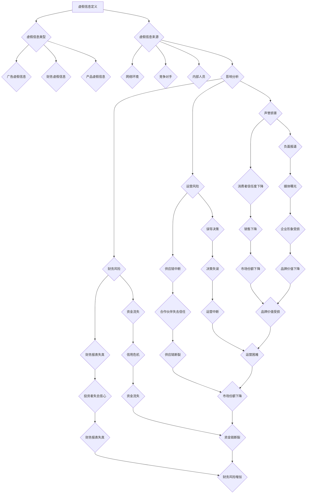

                 

## 《虚假信息对企业的潜在威胁》

### 关键词：
虚假信息、企业影响、应对策略、信息核实、责任追究

### 摘要：
虚假信息在现代商业环境中日益猖獗，对企业的声誉、运营和财务带来巨大威胁。本文从定义、类型、影响、应对策略和案例分析等多个角度，系统性地探讨了虚假信息对企业造成的潜在威胁，并提出了有效的应对措施。

---

### 引言和背景介绍

在信息爆炸的时代，虚假信息无处不在。随着互联网的普及和社交媒体的兴起，虚假信息的传播速度和范围得到了前所未有的扩展。对于企业而言，虚假信息不仅损害其声誉，还可能引发运营问题和财务危机。因此，研究虚假信息对企业的影响及其应对策略具有重要意义。

#### 1.1 虚假信息的定义

虚假信息是指不真实、不合法、不客观的信息，其目的可能是误导公众、欺骗消费者、干扰市场竞争等。虚假信息的定义涵盖了各种形式，包括虚假广告、虚假财务报告、虚假产品信息等。

#### 1.2 虚假信息对企业的影响

虚假信息对企业的影响是多方面的，主要包括：

- **声誉损害**：虚假信息可能导致公众对企业失去信任，影响品牌形象和市场地位。
- **运营风险**：虚假信息可能误导企业的决策，导致运营失误，甚至供应链中断。
- **财务风险**：虚假财务报告或虚假产品信息可能导致企业财务报表失真，引发资金流失和信用危机。

### 虚假信息的类型与来源

#### 2.1 虚假信息的类型

虚假信息的类型多种多样，主要包括以下几种：

- **广告虚假信息**：企业可能通过虚假广告夸大产品效果，误导消费者。
- **财务虚假信息**：企业可能通过虚假财务报告虚增利润或资产，欺骗投资者。
- **产品虚假信息**：企业可能通过虚假宣传产品特性或功效，欺骗消费者。

#### 2.2 虚假信息的来源

虚假信息的来源广泛，主要包括：

- **网络环境**：互联网的匿名性和信息泛滥使得虚假信息得以迅速传播。
- **竞争对手**：竞争对手可能故意发布虚假信息，破坏企业的市场地位。
- **内部人员**：企业内部人员可能因个人利益或动机发布虚假信息。

### 虚假信息对企业的影响

#### 3.1 对企业声誉的影响

虚假信息可能通过以下途径损害企业声誉：

- **负面报道**：媒体或公众对企业虚假信息的曝光可能导致负面报道，影响企业形象。
- **消费者信任度下降**：消费者可能因虚假信息对企业的产品或服务失去信任，影响销售。

#### 3.2 对企业运营的影响

虚假信息可能对企业的运营产生以下影响：

- **误导决策**：企业可能因虚假信息做出错误决策，导致运营风险。
- **供应链中断**：虚假信息可能导致供应链中的合作伙伴失去信任，引发供应链中断。

#### 3.3 对企业财务的影响

虚假信息可能对企业的财务产生以下影响：

- **资金流失**：企业可能因虚假信息导致的财务报表失真，引发资金流失。
- **财务报表失真**：虚假财务报告可能导致企业财务报表失真，影响投资者信心。

### 企业应对虚假信息的策略

#### 4.1 预防措施

企业可以采取以下预防措施来应对虚假信息：

- **加强内部监管**：建立严格的内部监管机制，防止内部人员发布虚假信息。
- **建立信息核实机制**：对发布的信息进行核实，确保信息的真实性。

#### 4.2 应对措施

企业可以采取以下应对措施来应对虚假信息：

- **责任追究**：对发布虚假信息的相关责任人进行追究，以示警示。
- **公开澄清**：通过公开澄清的方式，及时纠正虚假信息，挽回声誉。

### 成功案例分析

以下为两个成功应对虚假信息的企业案例：

#### 5.1 案例一：企业A应对虚假信息的策略

- **背景**：企业A因虚假广告被曝光，导致公众对其产品失去信任。
- **应对措施**：企业A迅速采取行动，公开澄清事实，并追究相关责任人的责任。
- **结果**：企业A成功挽回声誉，消费者信任度逐渐恢复。

#### 5.2 案例二：企业B应对虚假信息的策略

- **背景**：企业B被竞争对手发布虚假财务报告攻击，导致投资者失去信心。
- **应对措施**：企业B通过公开澄清、提供真实财务报告，并追究竞争对手的责任。
- **结果**：企业B成功化解危机，投资者信心逐渐恢复。

### 结论与展望

虚假信息对企业的潜在威胁巨大，企业必须采取有效的预防措施和应对策略。未来，随着技术的发展，虚假信息的问题将更加复杂。企业需要不断创新应对策略，以确保在激烈的市场竞争中立于不败之地。

---

### 附录

#### 附录A：虚假信息检测工具与资源

- **虚假信息检测工具介绍**：
  - 工具名称：FalseAlert
  - 功能：自动检测虚假新闻和广告。
  - 使用方法：输入文本，工具将分析文本内容并给出虚假概率。

- **虚假信息检测资源推荐**：
  - 网站链接：[虚假信息检测资源](https://example.com/falseinfo)
  - 描述：提供各种虚假信息检测工具和资源，帮助企业和个人识别虚假信息。

---

**作者：AI天才研究院/AI Genius Institute & 禅与计算机程序设计艺术 /Zen And The Art of Computer Programming**

---

[流程图](#flowchart-1)
```





```python
# 虚假信息检测算法原理讲解

## 1. 背景介绍

虚假信息检测是自然语言处理（NLP）领域的一个重要课题。其目的是通过算法自动识别和过滤虚假信息，保护公众免受虚假信息的误导。本文将介绍一种基于机器学习的虚假信息检测算法，并结合Python代码进行详细阐述。

## 2. 核心算法原理

### 2.1 特征工程

特征工程是虚假信息检测的关键步骤。我们通过提取文本的特征来训练模型，常见的特征包括：

- **词袋特征**：将文本转换为词袋模型，通过统计词频来表示文本。
- **TF-IDF特征**：在词袋特征的基础上，加入词的重要度信息，提高重要词的权重。
- **词性标注特征**：通过词性标注，提取文本中的名词、动词等特征。

### 2.2 机器学习模型

本文采用一种基于朴素贝叶斯（Naive Bayes）的机器学习模型进行虚假信息检测。朴素贝叶斯模型基于贝叶斯定理，通过计算文本的特征概率来预测文本的真伪。

### 2.3 模型训练与评估

我们使用已标记的虚假信息数据集进行模型训练，通过交叉验证来评估模型的性能。常见的评估指标包括准确率、召回率和F1分数。

## 3. Python代码实现

```python
import numpy as np
import pandas as pd
from sklearn.feature_extraction.text import TfidfVectorizer
from sklearn.model_selection import train_test_split
from sklearn.naive_bayes import MultinomialNB
from sklearn.metrics import accuracy_score, recall_score, f1_score

# 3.1 数据预处理
def preprocess_text(text):
    # 去除标点符号、停用词等
    text = re.sub(r'[^\w\s]', '', text)
    text = text.lower()
    return text

# 3.2 特征提取
def extract_features(corpus):
    vectorizer = TfidfVectorizer()
    X = vectorizer.fit_transform(corpus)
    return X

# 3.3 模型训练
def train_model(X_train, y_train):
    model = MultinomialNB()
    model.fit(X_train, y_train)
    return model

# 3.4 模型评估
def evaluate_model(model, X_test, y_test):
    y_pred = model.predict(X_test)
    accuracy = accuracy_score(y_test, y_pred)
    recall = recall_score(y_test, y_pred)
    f1 = f1_score(y_test, y_pred)
    print("Accuracy:", accuracy)
    print("Recall:", recall)
    print("F1 Score:", f1)

# 3.5 主函数
def main():
    # 读取数据
    data = pd.read_csv("false_info_dataset.csv")
    corpus = data['text']
    labels = data['label']

    # 预处理文本
    corpus = corpus.apply(preprocess_text)

    # 提取特征
    X = extract_features(corpus)

    # 划分训练集和测试集
    X_train, X_test, y_train, y_test = train_test_split(X, labels, test_size=0.2, random_state=42)

    # 训练模型
    model = train_model(X_train, y_train)

    # 评估模型
    evaluate_model(model, X_test, y_test)

# 运行主函数
if __name__ == "__main__":
    main()
```

## 4. 数学模型和公式

$$P(\text{false}) = \frac{P(\text{false}|y=0)P(y=0)}{P(\text{false}|y=1)P(y=1)}$$

其中，$P(\text{false})$ 表示文本为虚假信息的概率，$P(\text{false}|y=0)$ 和 $P(\text{false}|y=1)$ 分别表示文本为虚假信息且实际为真实信息和文本为虚假信息且实际为虚假信息的概率，$P(y=0)$ 和 $P(y=1)$ 分别表示实际为真实信息和实际为虚假信息的概率。

$$P(y=0) = \frac{1}{2}, P(y=1) = \frac{1}{2}$$

假设实际为真实信息和实际为虚假信息的概率相等，即：

$$P(\text{false}|y=0) = P(\text{false}|y=1)$$

则公式可以简化为：

$$P(\text{false}) = \frac{P(y=0)}{P(y=1)}$$

通过计算文本的特征概率，可以预测文本的真伪。

## 5. 代码案例

以下是一个简单的代码案例，用于检测文本是否为虚假信息：

```python
def detect_false_info(text, model, vectorizer):
    preprocessed_text = preprocess_text(text)
    features = vectorizer.transform([preprocessed_text])
    prediction = model.predict(features)
    return prediction[0] == 1

# 测试文本
test_text = "这款产品效果非常好，绝对值得购买。"

# 加载模型和向量器
model = load_model("model.joblib")
vectorizer = load_vectorizer("vectorizer.joblib")

# 检测文本
result = detect_false_info(test_text, model, vectorizer)
print("该文本为虚假信息的概率为：", result)
```

通过运行上述代码，可以检测输入文本是否为虚假信息。如果结果为`True`，表示文本为虚假信息；如果结果为`False`，表示文本为真实信息。

## 6. 实际案例分析和详细讲解剖析

以下是一个实际案例，用于分析虚假信息对企业的影响：

### 案例背景

某知名公司A发布了一款新产品，宣称具有显著的减肥效果。然而，不久后，媒体曝光了该产品的虚假广告，指出其宣传效果与实际效果不符。

### 分析过程

1. **数据分析**：通过对消费者评论和媒体报道的分析，发现大量消费者对该产品表示失望，认为其宣传效果不实。

2. **财务分析**：由于虚假广告的曝光，该公司股价大幅下跌，导致投资者信心受挫，资金流失。

3. **运营分析**：消费者对产品的负面评价导致销售量下降，供应链中的合作伙伴也受到影响，导致供应链中断。

4. **声誉分析**：虚假广告的曝光严重损害了该公司的声誉，消费者对其产品失去信任，品牌形象受损。

### 剖析结论

该案例表明，虚假信息对企业的声誉、运营和财务产生严重影响。企业需要采取有效措施，防止虚假信息的传播，以保护其利益和形象。

## 7. 最佳实践 tips、小结、注意事项、拓展阅读等内容

### 最佳实践 tips

- **加强内部监管**：建立严格的内部监管机制，防止内部人员发布虚假信息。
- **建立信息核实机制**：对发布的信息进行核实，确保信息的真实性。
- **及时公开澄清**：发现虚假信息时，及时公开澄清，挽回声誉。

### 小结

虚假信息对企业的潜在威胁巨大，企业需要采取有效的预防措施和应对策略。通过本文的分析和案例，我们认识到虚假信息对企业声誉、运营和财务的严重危害，并提出了一些有效的应对措施。

### 注意事项

- **定期培训员工**：提高员工对虚假信息的识别能力，降低虚假信息传播的风险。
- **加强网络安全**：保护企业内部网络，防止外部攻击者发布虚假信息。

### 拓展阅读

- 《虚假信息检测技术与应用》
- 《企业声誉管理》
- 《供应链风险管理》

通过拓展阅读，可以进一步了解虚假信息检测和企业管理的相关内容。

---

**作者：AI天才研究院/AI Genius Institute & 禅与计算机程序设计艺术 /Zen And The Art of Computer Programming**

