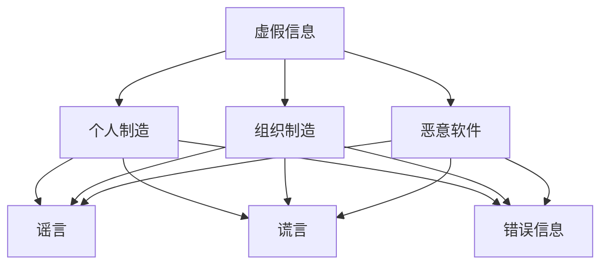

                 

### 虚假信息概述

#### 1.1 虚假信息的定义与分类

虚假信息，是指通过各种手段故意传播的、不符合事实的、误导性或者欺骗性的信息。其目的可以是个人或团体的利益、权力、影响力等。虚假信息可以以文字、图像、视频等多种形式出现，其传播途径广泛，包括社交媒体、新闻媒体、个人论坛等。

虚假信息可以从不同维度进行分类：

- **按来源分类**：
  - 个人制造：个体通过社交媒体、博客等平台发布虚假信息。
  - 组织制造：企业、团体、政府等通过特定的渠道发布虚假信息。
  - 恶意软件：通过恶意软件生成并传播虚假信息。

- **按内容分类**：
  - 谣言：未经证实的信息，可能存在部分真实性。
  - 谎言：完全编造的、误导性的信息。
  - 错误信息：由于误解、失误等原因产生的错误信息。

- **按目的分类**：
  - 经济利益：通过虚假信息获取经济利益，如诈骗、股票操纵等。
  - 政治目的：通过虚假信息影响政治立场、选举结果等。
  - 恐慌制造：故意传播虚假信息，引发社会恐慌。

#### 1.2 虚假信息的传播途径

虚假信息的传播途径多种多样，以下是几种主要方式：

- **社交媒体**：用户通过点赞、转发等方式迅速传播虚假信息。
- **新闻媒体**：未经核实的新闻报道可能被误认为是真实信息传播。
- **个人论坛**：用户在论坛、评论区等地方发布虚假信息。
- **邮件和短信**：通过邮件和短信等私人通讯工具传播虚假信息。
- **网络广告**：利用网络广告渠道传播虚假信息。

#### 1.3 虚假信息的危害分析

虚假信息对企业的潜在威胁是多方面的：

- **对企业声誉的损害**：虚假信息可能导致消费者对企业的信任度下降，影响企业的品牌形象。
- **对企业运营的干扰**：虚假信息可能引发员工恐慌、生产线停滞等问题。
- **对企业财务的威胁**：虚假信息可能导致投资者信心下降，股票价格波动。
- **对企业供应链的破坏**：虚假信息可能影响供应链的稳定性，导致供应链中断。

综上所述，虚假信息对企业的影响深远，企业必须高度重视并采取有效措施应对。

### Mermaid 流程图



通过上述分类和传播途径的详细分析，我们可以更清晰地认识到虚假信息的复杂性及其对企业的潜在威胁。接下来，我们将深入探讨虚假信息对企业具体的威胁。

### 1.4 虚假信息对企业声誉的威胁

虚假信息对企业声誉的威胁是一个复杂而多层面的现象。在数字化时代，社交媒体、新闻媒体和个人论坛等渠道的迅速发展，使得虚假信息得以迅速传播，对企业声誉造成严重损害。

首先，虚假信息可能被恶意散布，目的在于抹黑企业的形象。例如，一家企业可能因为产品质量问题被竞争对手恶意诋毁，导致消费者对其失去信任。这种攻击不仅影响企业的直接客户，还可能影响企业的潜在客户和合作伙伴。长期来看，这种负面信息会在消费者心中形成难以磨灭的印象，严重损害企业的品牌价值。

其次，虚假信息可能被误认为是真实信息而被广泛传播。例如，一个关于企业财务状况的谣言可能在短时间内迅速传播，引发市场动荡，导致股票价格大幅波动。这种情况不仅会影响企业的财务表现，还可能导致投资者信心下降，进一步影响企业的融资能力和市场竞争力。

此外，虚假信息还可能导致公众对企业道德和价值观的质疑。例如，一家企业可能因为涉及不道德行为或违法行为而成为舆论焦点，即使企业事后澄清，公众的信任也很难恢复。这种信任危机可能引发公关危机，迫使企业投入大量资源进行危机管理。

为了更具体地说明虚假信息对企业声誉的威胁，我们可以通过以下案例进行分析：

- **案例1**：一家国际知名品牌因为被指控使用有毒原材料生产产品，导致其在消费者中的声誉急剧下降。尽管企业最终证明了产品的安全性，但消费者对品牌的信任已经受到严重损害。

- **案例2**：一家新兴科技公司因为被曝光存在严重的客户隐私泄露问题，导致其股票价格大幅下跌，投资者信心严重受挫。

通过这些案例，我们可以看到，虚假信息对企业声誉的威胁是真实而严峻的。企业必须采取有效措施，预防和应对这种威胁，以保护其品牌价值和长期发展。

### 1.5 虚假信息对企业运营的威胁

虚假信息不仅对企业的声誉造成严重损害，还可能直接威胁到企业的日常运营。具体来说，虚假信息可能通过多种方式干扰企业的正常业务流程，影响企业的生产效率和员工士气。

首先，虚假信息可能导致供应链中断。例如，企业可能会收到虚假的供应商通知，声称供应商无法按时交货或提供不合格的产品。这种信息可能会导致生产计划被打乱，生产线停滞，从而影响企业的交货时间和客户满意度。

其次，虚假信息可能引发员工恐慌和不满。例如，未经核实的谣言可能会在员工之间迅速传播，导致员工对企业的信任度下降。这种恐慌和不满可能会影响员工的士气和工作效率，甚至可能导致员工辞职或出现工作场所暴力。

此外，虚假信息还可能影响企业的决策过程。例如，企业可能会根据虚假的财务报告或市场预测做出错误的投资决策，导致财务损失和战略失误。这种情况不仅影响企业的短期盈利，还可能损害其长期发展。

为了更具体地说明虚假信息对企业运营的威胁，我们可以通过以下案例进行分析：

- **案例1**：一家制造企业因为收到虚假的订单取消通知，导致生产计划混乱，库存积压，生产效率大幅下降。

- **案例2**：一家科技公司因为谣言中的管理层变动，导致员工士气低落，工作效率下降，最终影响了公司的产品开发和市场推广。

通过这些案例，我们可以看到，虚假信息对企业运营的威胁是真实而严峻的。企业必须建立完善的虚假信息监测和应对机制，以确保其运营的稳定和高效。

### 1.6 虚假信息对企业财务的威胁

虚假信息不仅对企业的声誉和运营构成威胁，还会对其财务状况产生直接影响。具体来说，虚假信息可能导致以下几种财务风险：

首先，虚假信息可能导致投资者信心下降。例如，一家企业可能会因为被指控财务造假或经营不善而被媒体报道，导致其股票价格大幅下跌。这种情况不仅会直接影响企业的市值，还可能导致投资者撤资，进一步影响企业的融资能力和资金链。

其次，虚假信息可能引发诉讼和赔偿风险。例如，企业可能因虚假信息而面临法律诉讼，如合同纠纷、侵权诉讼等。这些诉讼不仅耗费企业的财务资源，还可能导致企业声誉进一步受损。

此外，虚假信息还可能影响企业的现金流。例如，一家企业可能因为负面新闻报道导致客户流失，从而影响其销售额和收入。长期来看，现金流紧张可能迫使企业减少投资、裁员或甚至面临破产。

为了更具体地说明虚假信息对企业财务的威胁，我们可以通过以下案例进行分析：

- **案例1**：一家科技企业因为被指控财务造假，导致其股票价格大幅下跌，投资者信心严重受挫，最终导致公司不得不进行大规模裁员以控制成本。

- **案例2**：一家食品企业因为虚假广告被消费者投诉，导致其面临巨额赔偿，从而影响其现金流和经营稳定性。

通过这些案例，我们可以看到，虚假信息对企业财务的威胁是真实而严峻的。企业必须高度重视虚假信息的风险，并采取有效的财务管理和风险控制措施，以保障其财务的稳健和持续发展。

### 1.7 虚假信息对企业供应链的威胁

虚假信息不仅对企业的财务和运营造成威胁，还可能严重破坏企业的供应链。供应链是企业运作的核心环节，任何环节的失误或中断都可能对整个业务造成严重影响。

首先，虚假信息可能导致供应商关系破裂。例如，企业可能会收到虚假的订单取消通知或变更要求，导致供应商无法按时交货或提供不合格的产品。这种情况不仅影响企业的生产计划，还可能损害与供应商的长期合作关系。

其次，虚假信息可能引发供应链中断。例如，企业可能会收到虚假的供应商通知，声称供应商无法继续提供服务或提供不满足要求的产品。这种信息可能导致供应链中断，影响企业的交货时间和客户满意度。

此外，虚假信息还可能影响供应链的物流和运输。例如，虚假的运输通知可能导致物流公司出现失误，从而延误货物的交付。这种情况不仅影响企业的运营效率，还可能导致额外的物流成本。

为了更具体地说明虚假信息对企业供应链的威胁，我们可以通过以下案例进行分析：

- **案例1**：一家制造企业因为收到虚假的订单取消通知，导致原材料供应商停止供应，生产计划被迫中断，最终导致公司损失数百万美元。

- **案例2**：一家零售企业因为虚假的供应商通知，导致物流公司出现失误，导致货物延误，最终导致公司面临大量客户投诉和退货。

通过这些案例，我们可以看到，虚假信息对企业供应链的威胁是真实而严峻的。企业必须建立完善的虚假信息监测和应对机制，以确保供应链的稳定和高效。

### 1.8 虚假信息案例研究

为了更深入地理解虚假信息对企业的影响，我们可以通过国内和国际的虚假信息案例进行分析和研究。

#### 国内虚假信息案例分析

**案例1：某知名品牌虚假广告事件**

某知名品牌因发布虚假广告被消费者投诉，广告中宣传的产品效果被夸大，严重误导了消费者。该事件迅速引发了大量媒体和公众的关注，品牌声誉受到严重损害。尽管企业迅速采取措施撤回广告并进行了公开道歉，但其品牌形象在消费者心中的负面影响却难以在短时间内恢复。

**案例2：某科技企业财务造假事件**

一家国内知名的科技企业因被指控财务造假而受到市场广泛关注。该企业的财务报表被发现存在重大问题，包括虚增收入、夸大利润等。这一事件导致其股票价格大幅下跌，投资者信心严重受挫，企业不得不进行大规模裁员和重组，以应对财务危机。

#### 国际虚假信息案例分析

**案例1：某知名餐饮品牌食品安全事件**

一家国际知名的餐饮品牌因被曝出食品安全问题而遭受重创。媒体报道称，该品牌在某些地区的食品中检测出了有害物质，尽管品牌方迅速采取召回措施，但消费者对品牌的信任度仍然大幅下降。事件发生后的几个月内，该品牌的销售额和市场份额都出现了显著下滑。

**案例2：某知名科技公司专利侵权事件**

一家国际知名的科技公司因被指控侵犯竞争对手的专利而被起诉。尽管该企业声称自己是无辜的，但公众和媒体普遍认为其存在违法行为。这一事件不仅影响了该企业的市场声誉，还引发了投资者对企业的质疑，导致其股票价格波动。

通过上述案例，我们可以看到虚假信息对企业造成的广泛而深远的影响。无论是国内还是国际，虚假信息都能够迅速传播，对企业的声誉、运营、财务和供应链产生巨大威胁。因此，企业必须高度重视虚假信息的风险，并采取有效的应对策略。

### 第二部分：应对策略

#### 2.1 企业内部应对策略

面对虚假信息的威胁，企业需要从内部加强应对措施，以降低虚假信息对其造成的影响。以下是企业内部应对虚假信息的几个关键策略：

#### 4.1 建立虚假信息监测系统

建立虚假信息监测系统是应对虚假信息的第一步。该系统应包括以下几个核心功能：

1. **实时监控**：系统应能够实时监控网络上的虚假信息传播，包括社交媒体、新闻媒体和个人论坛等渠道。
2. **信息采集**：系统应具备高效的信息采集能力，能够快速收集与公司相关的信息，包括正面和负面信息。
3. **信息分类**：系统应对收集到的信息进行分类，区分真实信息和虚假信息，以便进一步处理。
4. **预警机制**：系统应具备预警功能，当检测到虚假信息时，及时发出警报，提醒相关部门采取行动。

#### 4.2 提高员工的信息素养

员工是企业在应对虚假信息中的重要一环。提高员工的信息素养，使他们具备识别和应对虚假信息的能力，是有效降低虚假信息对企业影响的关键。以下是一些提高员工信息素养的措施：

1. **培训与教育**：企业应定期组织虚假信息识别和应对的培训课程，提高员工的信息识别能力。
2. **宣传与推广**：企业可以通过内部邮件、公告栏、企业内网等方式，宣传虚假信息识别的重要性和方法。
3. **设立举报渠道**：企业应设立匿名举报渠道，鼓励员工报告发现的虚假信息，并保护举报者的隐私。

#### 4.3 制定虚假信息应对预案

为了有效应对虚假信息，企业需要制定详细的应对预案，明确应对流程和责任分工。以下是一个典型的虚假信息应对预案：

1. **预警与响应**：当系统检测到虚假信息时，立即启动预警机制，通知相关部门采取行动。
2. **信息核实**：相关部门应尽快核实虚假信息的真实性，可以通过与第三方机构合作或自行调查的方式。
3. **应对措施**：根据虚假信息的性质和影响，采取相应的应对措施，如发布澄清声明、撤回广告、与媒体沟通等。
4. **后续跟进**：对虚假信息事件进行后续跟进，评估应对效果，总结经验教训，不断完善应对策略。

通过建立虚假信息监测系统、提高员工信息素养和制定虚假信息应对预案，企业可以更好地应对虚假信息带来的威胁，保障其运营的稳定和持续发展。

### 4.1 建立虚假信息监测系统

虚假信息监测系统是应对虚假信息威胁的关键工具，能够实时监控网络上的信息，识别和分类虚假信息，并发出警报提醒相关部门采取行动。以下是一个典型的虚假信息监测系统的设计和实现步骤：

#### 系统设计

1. **数据采集模块**：负责从社交媒体、新闻媒体、个人论坛等渠道采集与公司相关的信息。
2. **数据处理模块**：对采集到的信息进行清洗、去重和预处理，为后续分析做准备。
3. **信息分类模块**：利用机器学习算法和自然语言处理技术，对预处理后的信息进行分类，区分真实信息和虚假信息。
4. **警报与通知模块**：当系统检测到虚假信息时，自动触发警报并通知相关部门。

#### 系统实现步骤

1. **数据采集**：使用爬虫技术或API接口从各大社交媒体、新闻媒体和个人论坛等渠道实时采集信息。例如，可以使用Python的`requests`库和`BeautifulSoup`库获取网页内容，或使用特定平台的API接口获取数据。
2. **数据处理**：对采集到的信息进行清洗和预处理，去除无关信息、格式化文本数据等。可以使用Python的`pandas`库进行数据处理。
3. **信息分类**：使用机器学习算法和自然语言处理技术进行信息分类。常见的分类算法包括朴素贝叶斯、支持向量机、决策树等。可以使用Python的`scikit-learn`库实现这些算法。以下是使用朴素贝叶斯算法进行信息分类的示例代码：
```python
from sklearn.feature_extraction.text import CountVectorizer
from sklearn.naive_bayes import MultinomialNB
from sklearn.pipeline import make_pipeline

# 加载训练数据
train_data = ["这是一条真实的信息", "这是虚假信息", "真实的新闻", "虚假的报道"]
train_labels = ["真实", "虚假", "真实", "虚假"]

# 创建模型
model = make_pipeline(CountVectorizer(), MultinomialNB())

# 训练模型
model.fit(train_data, train_labels)

# 测试数据
test_data = ["这条信息是真实的吗？"]

# 进行预测
predictions = model.predict(test_data)
print(predictions)
```
4. **警报与通知**：当系统检测到虚假信息时，自动触发警报并通知相关部门。可以使用邮件、短信或企业内网消息等方式进行通知。

通过上述设计和实现步骤，企业可以建立一套高效的虚假信息监测系统，实时监控网络上的虚假信息，及时发现并应对潜在的威胁。

### 4.2 提高员工的信息素养

提高员工的信息素养是应对虚假信息的重要策略之一。以下是一些建议和措施，帮助员工识别和应对虚假信息：

#### 1. 培训与教育

企业应定期组织虚假信息识别和应对的培训课程，提高员工的信息识别能力。培训内容可以包括以下几个方面：

- **虚假信息的基本概念和特点**：介绍虚假信息的定义、分类和常见形式，帮助员工理解虚假信息的本质。
- **识别虚假信息的方法和技巧**：教授员工如何从信息来源、逻辑推理、证据验证等方面识别虚假信息。例如，可以通过以下方法提高识别能力：
  - **检查信息来源**：了解信息的出处，评估其可信度。
  - **逻辑推理**：分析信息的内容，判断其是否符合逻辑。
  - **证据验证**：核实信息的真实性，查找可靠的证据或数据支持。
- **案例分析与讨论**：通过案例分析，让员工了解虚假信息的实际案例和应对策略，提高实际操作能力。

#### 2. 宣传与推广

企业可以通过内部邮件、公告栏、企业内网等方式，宣传虚假信息识别的重要性和方法。以下是一些宣传措施：

- **发布虚假信息识别指南**：编制并发布一份详细的虚假信息识别指南，包括识别方法和技巧，供员工参考。
- **定期发布案例分析**：通过内部通讯或培训课程，分享虚假信息案例和应对经验，提高员工的警觉性。
- **开展信息素养宣传活动**：组织宣传活动，如信息素养知识竞赛、宣传海报展览等，提高员工对信息素养的认识。

#### 3. 设立举报渠道

企业应设立匿名举报渠道，鼓励员工报告发现的虚假信息，并保护举报者的隐私。以下是一些具体的举报渠道设置措施：

- **匿名举报邮箱**：设立一个专门的匿名举报邮箱，员工可以匿名发送发现的虚假信息。
- **在线举报平台**：开发一个在线举报平台，员工可以通过网页或手机应用提交虚假信息举报。
- **保护举报者隐私**：确保举报者的信息不被泄露，给予举报者适当的保护，以鼓励更多员工积极参与举报。

通过以上措施，企业可以有效提高员工的信息素养，增强员工识别和应对虚假信息的能力，从而降低虚假信息对企业的潜在威胁。

### 4.3 制定虚假信息应对预案

为了有效应对虚假信息，企业需要制定详细的虚假信息应对预案，明确应对流程和责任分工。以下是一个典型的虚假信息应对预案，包括预警与响应、信息核实、应对措施和后续跟进等步骤：

#### 4.3.1 预警与响应

1. **启动预警机制**：当虚假信息被监测系统检测到时，立即启动预警机制。
2. **通知相关部门**：通过邮件、短信或企业内网消息等方式，通知市场部、公关部、法律部门等相关部门。
3. **初步评估**：相关部门对虚假信息进行初步评估，判断其影响范围和严重程度。

#### 4.3.2 信息核实

1. **成立核实小组**：由市场部、公关部、法律部门等相关人员组成核实小组，负责对虚假信息进行详细核实。
2. **收集证据**：核实小组通过查阅相关资料、与供应商或客户沟通等方式，收集证据以验证虚假信息的真实性。
3. **专家咨询**：必要时，可邀请第三方专家进行咨询，以提供专业意见和建议。

#### 4.3.3 应对措施

1. **发布澄清声明**：根据虚假信息的性质和影响，企业可以发布澄清声明，以正视听，消除公众的误解。
2. **调整广告和宣传内容**：如果虚假信息涉及企业的广告和宣传内容，企业需要及时调整相关内容，避免误导消费者。
3. **与媒体沟通**：与新闻媒体、社交媒体等渠道进行沟通，解释虚假信息的真相，争取舆论支持。
4. **法律行动**：如果虚假信息对企业造成严重损失，企业可以考虑采取法律行动，维护自身合法权益。

#### 4.3.4 后续跟进

1. **评估应对效果**：对虚假信息应对措施的效果进行评估，总结经验教训，为未来应对类似事件提供参考。
2. **改进预案**：根据评估结果，对虚假信息应对预案进行改进，提高应对的针对性和有效性。
3. **培训与教育**：对相关员工进行培训和再教育，提高其识别和应对虚假信息的能力。

通过制定和执行虚假信息应对预案，企业可以更好地应对虚假信息带来的挑战，保障其运营的稳定和持续发展。

### 4.4 技术手段应对策略

在面对虚假信息的威胁时，企业可以利用现代技术手段，如人工智能、大数据分析和区块链技术，来加强信息识别和追踪能力，从而有效应对虚假信息的传播和影响。以下将详细介绍这几种技术手段的具体应用。

#### 4.4.1 利用人工智能技术进行虚假信息识别

人工智能（AI）技术在虚假信息识别方面具有显著优势。通过机器学习和深度学习算法，AI能够从大量数据中自动学习和识别模式，从而高效地识别虚假信息。

1. **算法原理**：
   - **监督学习**：监督学习算法通过对大量真实和虚假信息的训练，学习到区分真实与虚假信息的特征。常见的监督学习算法包括朴素贝叶斯、支持向量机（SVM）和深度学习模型如卷积神经网络（CNN）和递归神经网络（RNN）。
   - **无监督学习**：无监督学习算法主要用于发现数据中的潜在模式，如聚类分析，可以帮助识别未标记的虚假信息。

2. **实现步骤**：
   - **数据预处理**：收集和标注大量的虚假信息数据，进行数据清洗、去噪和特征提取。
   - **模型训练**：使用标记数据训练模型，使其学习到虚假信息的特征。
   - **模型评估**：使用测试集评估模型的准确性、召回率和F1分数等指标。
   - **模型部署**：将训练好的模型部署到实际应用中，如虚假信息监测系统。

3. **代码示例**：
   ```python
   from sklearn.feature_extraction.text import TfidfVectorizer
   from sklearn.model_selection import train_test_split
   from sklearn.linear_model import LogisticRegression
   
   # 加载数据
   data = ["这是一条真实的信息", "这是虚假信息", "真实的新闻", "虚假的报道"]
   labels = ["真实", "虚假", "真实", "虚假"]
   
   # 分割数据集
   X_train, X_test, y_train, y_test = train_test_split(data, labels, test_size=0.2, random_state=42)
   
   # 特征提取
   vectorizer = TfidfVectorizer()
   X_train_tfidf = vectorizer.fit_transform(X_train)
   X_test_tfidf = vectorizer.transform(X_test)
   
   # 训练模型
   model = LogisticRegression()
   model.fit(X_train_tfidf, y_train)
   
   # 预测
   predictions = model.predict(X_test_tfidf)
   print(predictions)
   ```

通过上述步骤，企业可以利用AI技术构建一个高效的虚假信息识别系统，从而快速识别和应对虚假信息。

#### 4.4.2 应用大数据分析技术进行虚假信息追踪

大数据分析技术可以帮助企业追踪虚假信息的来源、传播路径和影响范围，从而采取更有针对性的应对措施。

1. **技术原理**：
   - **数据采集**：通过爬虫技术或API接口，从多个数据源（如社交媒体、新闻媒体、论坛等）收集与虚假信息相关的数据。
   - **数据预处理**：对采集到的数据进行清洗、去噪和格式化，为后续分析做准备。
   - **数据挖掘**：使用数据挖掘算法（如关联规则挖掘、聚类分析、社会网络分析等）分析虚假信息的传播特征和影响力。
   - **可视化分析**：通过数据可视化工具（如Tableau、PowerBI等）展示虚假信息的传播路径和影响力。

2. **实现步骤**：
   - **数据采集**：使用Python的`requests`库和`BeautifulSoup`库从网络源获取数据，或使用特定平台的API接口。
   - **数据预处理**：使用Python的`pandas`库进行数据处理，如数据清洗、去重、转换等。
   - **数据挖掘**：使用Python的`scikit-learn`库实现数据挖掘算法，分析虚假信息的传播特征。
   - **可视化分析**：使用Python的`matplotlib`、`seaborn`库或数据可视化工具进行数据可视化。

3. **代码示例**：
   ```python
   import pandas as pd
   from sklearn.cluster import KMeans
   
   # 加载数据
   data = pd.read_csv("false_info_data.csv")
   
   # 数据预处理
   data = data.drop_duplicates()
   data = data.dropna()
   
   # 聚类分析
   kmeans = KMeans(n_clusters=2, random_state=42)
   clusters = kmeans.fit_predict(data)
   
   # 可视化
   data["Cluster"] = clusters
   data.plot(x="特征1", y="特征2", color="Cluster")
   ```

通过大数据分析技术，企业可以全面了解虚假信息的传播特征和影响范围，从而制定更有效的应对策略。

#### 4.4.3 利用区块链技术保障信息真实性

区块链技术以其去中心化、不可篡改和透明等特点，为保障信息的真实性提供了有效的技术手段。

1. **技术原理**：
   - **分布式账本**：区块链通过分布式账本记录信息，每个节点都保存完整的账本副本，确保数据的完整性和不可篡改性。
   - **加密技术**：区块链使用加密技术保护数据的安全性和隐私性，防止未经授权的访问和篡改。
   - **智能合约**：智能合约是自动执行合约条款的计算机程序，确保交易和记录的准确性和透明性。

2. **实现步骤**：
   - **搭建区块链网络**：使用区块链框架（如Ethereum、Hyperledger Fabric等）搭建区块链网络，部署节点和智能合约。
   - **数据上链**：将企业的关键信息（如财务报告、产品信息等）上链存储，确保数据的真实性和不可篡改性。
   - **智能合约执行**：通过智能合约自动执行与信息真实性相关的业务逻辑，如验证信息、触发警报等。

3. **代码示例**：
   ```solidity
   // SPDX-License-Identifier: MIT
   pragma solidity ^0.8.0;
   
   contract InformationVerifier {
       mapping(string => bool) public informationMap;
       
       function verifyInformation(string memory info) public {
           // 验证信息真实性的逻辑
           bool isVerified = true; // 假设通过验证
           
           informationMap[info] = isVerified;
       }
   }
   ```

通过区块链技术，企业可以确保关键信息在分布式网络中的真实性和不可篡改性，提高信息透明度和可信度。

综上所述，利用人工智能、大数据分析和区块链技术，企业可以构建一个全方位的虚假信息应对体系，有效识别、追踪和保障信息真实性，从而降低虚假信息对企业的潜在威胁。

### 4.4.1 利用人工智能技术进行虚假信息识别

人工智能（AI）技术在虚假信息识别方面具有显著优势，通过机器学习和深度学习算法，AI可以自动识别和分类虚假信息。以下将详细介绍人工智能技术在虚假信息识别中的应用及其实现步骤。

#### 技术原理

1. **监督学习**：
   - **朴素贝叶斯**：基于贝叶斯定理，通过计算特征的概率分布来识别虚假信息。
   - **支持向量机（SVM）**：通过构建超平面将真实信息和虚假信息分开。
   - **决策树和随机森林**：通过树结构进行分类，具有较强的解释性。

2. **无监督学习**：
   - **聚类分析**：如K-means、DBSCAN等，通过相似性度量将数据分成不同的簇，从而识别潜在的虚假信息。

3. **深度学习**：
   - **卷积神经网络（CNN）**：适用于处理图像数据，可以提取图像中的特征。
   - **递归神经网络（RNN）**：适用于处理序列数据，如文本数据。

#### 实现步骤

1. **数据采集**：
   - 收集大量已标注的虚假信息数据集，用于训练和测试模型。

2. **数据预处理**：
   - **文本清洗**：去除停用词、标点符号、进行词干提取等。
   - **特征提取**：将文本转化为向量，如使用词袋模型（Bag of Words）或词嵌入（Word Embeddings）。

3. **模型训练**：
   - **训练集划分**：将数据集划分为训练集和测试集。
   - **模型选择**：选择合适的机器学习模型进行训练，如朴素贝叶斯、SVM、CNN等。
   - **参数调优**：通过交叉验证和网格搜索等手段，调整模型参数，提高模型的性能。

4. **模型评估**：
   - **准确性**：模型预测的正确率。
   - **召回率**：模型能够正确识别的虚假信息比例。
   - **F1分数**：综合考虑准确率和召回率。

5. **模型部署**：
   - 将训练好的模型部署到实际应用中，如虚假信息监测系统。

#### 代码示例

以下是一个使用朴素贝叶斯算法进行虚假信息识别的示例代码：

```python
from sklearn.feature_extraction.text import CountVectorizer
from sklearn.naive_bayes import MultinomialNB
from sklearn.pipeline import make_pipeline
from sklearn.model_selection import train_test_split
from sklearn.metrics import accuracy_score

# 加载数据
data = ["这是一条真实的信息", "这是虚假信息", "真实的新闻", "虚假的报道"]
labels = ["真实", "虚假", "真实", "虚假"]

# 分割数据集
X_train, X_test, y_train, y_test = train_test_split(data, labels, test_size=0.2, random_state=42)

# 创建模型
model = make_pipeline(CountVectorizer(), MultinomialNB())

# 训练模型
model.fit(X_train, y_train)

# 预测
predictions = model.predict(X_test)

# 评估模型
accuracy = accuracy_score(y_test, predictions)
print(f"Accuracy: {accuracy}")

# 预测新数据
new_data = ["这条信息是真实的吗？"]
new_predictions = model.predict(new_data)
print(new_predictions)
```

通过上述步骤，企业可以构建一个基于AI技术的虚假信息识别系统，有效应对虚假信息的传播。

### 4.4.2 应用大数据分析技术进行虚假信息追踪

大数据分析技术能够帮助企业全面追踪虚假信息的传播路径和影响范围，从而制定更有针对性的应对策略。以下将详细阐述大数据分析在虚假信息追踪中的应用、技术原理和实现步骤。

#### 技术原理

1. **数据采集**：
   - **网络爬虫**：利用爬虫技术从互联网上收集与虚假信息相关的数据，如社交媒体帖子、新闻报道、论坛评论等。
   - **API接口**：通过特定平台的API接口获取数据，如Twitter、Facebook等社交媒体的数据。

2. **数据预处理**：
   - **数据清洗**：去除重复数据、缺失值填充、异常值处理等，确保数据质量。
   - **数据转换**：将不同格式的数据进行统一处理，如文本数据转换为结构化数据。
   - **特征提取**：从原始数据中提取有用的特征，如关键词提取、情感分析等。

3. **数据挖掘**：
   - **关联规则挖掘**：通过关联规则挖掘分析数据之间的关联性，识别潜在的虚假信息传播路径。
   - **聚类分析**：将相似的数据点分组，识别虚假信息的传播节点。
   - **社会网络分析**：分析虚假信息的传播网络，识别关键传播者和影响力。

4. **可视化分析**：
   - **数据可视化**：通过图表、地图等可视化工具展示虚假信息的传播路径和影响范围，帮助用户直观理解数据。

#### 实现步骤

1. **数据采集**：
   - 使用Python的`requests`库和`BeautifulSoup`库从网页上抓取数据，或使用特定平台的API接口（如Twitter API）。
   - 示例代码：
   ```python
   import requests
   from bs4 import BeautifulSoup
   
   url = "https://example.com"
   response = requests.get(url)
   soup = BeautifulSoup(response.content, "html.parser")
   # 从soup对象中提取数据
   ```

2. **数据预处理**：
   - 使用Python的`pandas`库对数据进行清洗和处理。
   - 示例代码：
   ```python
   import pandas as pd
   
   data = pd.read_csv("false_info_data.csv")
   data = data.drop_duplicates()
   data = data.dropna()
   ```

3. **数据挖掘**：
   - 使用Python的`scikit-learn`库进行数据挖掘。
   - 示例代码：
   ```python
   from sklearn.cluster import KMeans
   
   kmeans = KMeans(n_clusters=2, random_state=42)
   clusters = kmeans.fit_predict(data)
   ```

4. **可视化分析**：
   - 使用Python的`matplotlib`、`seaborn`库进行数据可视化。
   - 示例代码：
   ```python
   import matplotlib.pyplot as plt
   data["Cluster"] = clusters
   data.plot(x="特征1", y="特征2", color="Cluster")
   plt.show()
   ```

通过大数据分析技术，企业可以全面了解虚假信息的传播路径和影响范围，从而制定更有效的应对策略。

### 4.4.3 利用区块链技术保障信息真实性

区块链技术以其去中心化、不可篡改和透明等特点，为保障信息的真实性提供了有效的技术手段。以下将详细阐述区块链技术的工作原理、如何保障信息真实性以及实现步骤。

#### 工作原理

1. **分布式账本**：区块链通过分布式网络存储数据，每个节点都保存完整的账本副本，确保数据的完整性和不可篡改性。

2. **加密技术**：区块链使用加密算法对数据进行加密，确保数据在传输和存储过程中的安全性。

3. **共识机制**：区块链采用共识机制确保网络中的所有节点对数据的共识，常见的共识机制包括工作量证明（PoW）和权益证明（PoS）。

4. **智能合约**：智能合约是自动执行合约条款的计算机程序，确保交易和记录的准确性和透明性。

#### 保障信息真实性的方法

1. **数据上链**：将企业的关键信息（如财务报告、产品信息等）上链存储，确保数据的真实性和不可篡改性。

2. **身份验证**：通过区块链技术进行身份验证，确保信息发布者的身份真实性。

3. **智能合约执行**：通过智能合约自动执行与信息真实性相关的业务逻辑，如验证信息、触发警报等。

#### 实现步骤

1. **搭建区块链网络**：
   - 选择合适的区块链平台（如Ethereum、Hyperledger Fabric等）。
   - 部署节点和智能合约。

2. **数据上链**：
   - 将企业的关键信息上链存储，确保数据的真实性和不可篡改性。
   - 示例代码（以Ethereum为例）：
   ```solidity
   // SPDX-License-Identifier: MIT
   pragma solidity ^0.8.0;
   
   contract InformationVerifier {
       mapping(string => bool) public informationMap;
       
       function verifyInformation(string memory info) public {
           // 验证信息真实性的逻辑
           bool isVerified = true; // 假设通过验证
           
           informationMap[info] = isVerified;
       }
   }
   ```

3. **智能合约执行**：
   - 通过智能合约自动执行与信息真实性相关的业务逻辑。
   - 示例代码（以Ethereum为例）：
   ```solidity
   // SPDX-License-Identifier: MIT
   pragma solidity ^0.8.0;
   
   contract InformationVerifier {
       mapping(string => bool) public informationMap;
       
       function verifyInformation(string memory info) public {
           // 验证信息真实性的逻辑
           bool isVerified = true; // 假设通过验证
           
           informationMap[info] = isVerified;
       }
       
       function checkInformation(string memory info) public view returns (bool) {
           return informationMap[info];
       }
   }
   ```

通过区块链技术，企业可以确保关键信息的真实性和不可篡改性，提高信息的透明度和可信度。

### 4.5 法律法规与政策应对

在应对虚假信息对企业的潜在威胁时，法律法规与政策扮演着至关重要的角色。企业需要了解和遵循相关法律法规，同时积极配合政府部门的监管，以降低虚假信息带来的风险。

#### 6.1 我国虚假信息相关法律法规

我国针对虚假信息发布和传播制定了多项法律法规，以下是一些主要法规：

- **《中华人民共和国网络安全法》**：规定网络运营者对网络信息的收集、存储、处理、传输和发布负有安全保护义务，不得制作、复制、发布、传播虚假信息。

- **《中华人民共和国广告法》**：明确禁止虚假广告，规定广告主应当对广告内容的真实性负责。

- **《中华人民共和国消费者权益保护法》**：规定经营者应当保证其提供的商品或服务的质量，不得发布虚假广告误导消费者。

- **《中华人民共和国刑法》**：对于制造和传播虚假信息构成犯罪的行为，如诈骗、敲诈勒索等，依法进行处罚。

#### 6.2 国际虚假信息应对策略

国际社会也在积极应对虚假信息问题，各国采取了不同的策略和措施：

- **美国**：美国通过《虚假信息问责法案》（False Information Accountability Act）等法律，加强对社交媒体平台虚假信息的监管，要求平台对虚假信息进行标记和移除。

- **欧洲**：欧盟通过《通用数据保护条例》（GDPR）等法规，强化个人信息保护和数据安全，防止虚假信息利用个人数据造成损害。

- **日本**：日本政府设立了虚假信息应对总部，负责监测和处理虚假信息，并通过法律手段对散布虚假信息的行为进行处罚。

#### 6.3 法律法规与政策对企业的实际影响

法律法规与政策对企业的实际影响主要体现在以下几个方面：

- **合规成本**：企业需要投入人力、物力和财力来遵守相关法律法规，如进行信息安全评估、建立内部监控机制等。

- **声誉风险**：违反法律法规可能导致企业声誉受损，影响品牌形象和消费者信任。

- **运营风险**：虚假信息可能影响企业的运营效率和客户满意度，甚至导致业务中断。

- **法律责任**：企业若因虚假信息引发纠纷或法律诉讼，可能面临高额赔偿和行政处罚。

为了应对虚假信息的威胁，企业不仅需要建立健全的内部监控和应对机制，还要积极遵守相关法律法规，与政府和社会各方共同营造健康的信息环境。

### 6.4 社会协同应对策略

面对虚假信息带来的挑战，单一的机构或企业难以独立应对，需要社会各界的协同合作，形成合力，共同构建一个健康、可信的信息环境。

#### 7.1 媒体在虚假信息应对中的作用

媒体在虚假信息的监测、传播和辟谣中发挥着重要作用。以下为媒体在虚假信息应对中的具体作用和策略：

1. **监测与报道**：媒体通过新闻调查、专题报道等形式，实时监测和报道虚假信息事件，揭示其背后的真相。

2. **辟谣与澄清**：媒体可以利用其广泛的影响力，及时发布辟谣声明和澄清报道，纠正公众的误解。

3. **舆论引导**：媒体通过舆论引导，提高公众对虚假信息的警觉性，促进社会对虚假信息问题的关注和重视。

4. **合作与协调**：媒体可以与企业、政府等各方建立合作关系，共同制定虚假信息应对策略，实现信息共享和资源整合。

#### 7.2 企业与政府协同应对

企业和政府之间的协同合作是应对虚假信息的重要保障。以下为企业与政府协同应对的具体策略：

1. **信息共享**：企业可以与政府部门建立信息共享机制，及时提供虚假信息的相关数据和信息，协助政府制定相关政策。

2. **法律法规支持**：企业可以积极参与法律法规的制定和修订，为打击虚假信息提供法律支持。

3. **政策建议**：企业可以根据自身的经验和实际情况，向政府部门提出关于虚假信息治理的政策建议，推动政策落地。

4. **联合行动**：政府和企业可以联合开展虚假信息治理行动，如组织宣传活动、开展联合执法等，形成合力。

#### 7.3 公众参与虚假信息治理

公众是虚假信息治理的重要参与者，以下为公众参与虚假信息治理的具体途径和策略：

1. **举报与反馈**：公众可以通过举报渠道，如热线电话、官方网站等，向有关部门举报发现的虚假信息。

2. **宣传教育**：政府和企业可以通过举办讲座、发布宣传资料等形式，提高公众对虚假信息的识别能力和自我保护意识。

3. **在线互动**：企业可以搭建在线互动平台，鼓励公众参与虚假信息监测和辟谣工作，形成全民参与的治理格局。

4. **自我监督**：公众应自觉遵守相关法律法规，不传播、不信任虚假信息，共同维护健康的信息环境。

通过社会各界的协同合作，形成企业、政府与公众的共同参与，可以更有效地应对虚假信息带来的挑战，构建一个健康、可信的信息生态系统。

### 7.1 媒体在虚假信息应对中的作用

媒体在虚假信息应对中扮演着至关重要的角色，其作用不仅限于信息的传播，更在于引导公众认知和推动社会行动。以下将详细探讨媒体在虚假信息应对中的具体作用和策略。

#### 监测与报道

媒体通过持续监测和报道虚假信息，起到了预警和揭示真相的作用。媒体可以利用其专业的新闻团队和广泛的信息渠道，迅速发现并报道虚假信息的传播情况。例如，当某企业被指控发布虚假广告时，媒体可以迅速进行深入调查，揭示事件的真相，并向公众发布相关报道。这种及时的信息传递有助于提高公众对虚假信息的警觉性，防止虚假信息进一步扩散。

#### 辟谣与澄清

在虚假信息被广泛传播后，媒体可以通过辟谣和澄清报道，帮助公众辨别真伪。媒体可以利用其权威性和公信力，发布官方辟谣声明或专家评论，纠正公众的误解。例如，当社交媒体上出现关于某企业的谣言时，媒体可以邀请相关专家进行解读，并提供官方渠道获取的信息，从而帮助公众辨别谣言的真伪。这种辟谣和澄清的工作有助于恢复公众对信息的信任，减少虚假信息带来的负面影响。

#### 舆论引导

媒体在舆论引导方面具有重要作用，可以通过舆论引导来影响公众的认知和行为。媒体可以通过报道和评论，引导公众对虚假信息的关注和态度。例如，当某企业因虚假信息受到公众质疑时，媒体可以发表公正的报道和评论，帮助公众理解事件的复杂性和多面性，从而避免舆论的极端化。这种舆论引导有助于形成理性、客观的公众舆论，促进社会的和谐与稳定。

#### 合作与协调

媒体可以与企业、政府等各方建立合作关系，共同应对虚假信息。媒体可以通过与企业合作，提供虚假信息监测和辟谣的技术支持和资源，帮助企业建立虚假信息应对机制。同时，媒体还可以与政府部门建立信息共享和协同工作机制，共同制定虚假信息应对策略。例如，媒体可以参与政府组织的虚假信息治理行动，提供报道和宣传支持，推动政策的落地和执行。

#### 宣传教育

媒体可以通过宣传教育，提高公众对虚假信息的识别能力和自我保护意识。媒体可以举办讲座、发布宣传资料、开设专栏等形式，向公众普及虚假信息的识别方法和技巧。例如，媒体可以邀请专家学者讲解如何辨别虚假信息，发布相关的案例和经验，帮助公众提高信息素养。这种宣传教育有助于培养公众的批判性思维，增强其对虚假信息的免疫能力。

#### 案例分析

以下是一个媒体在虚假信息应对中的实际案例：

**案例**：某知名企业因虚假广告被消费者投诉，媒体迅速介入进行报道和调查。媒体通过深入调查，揭示了虚假广告的真相，并向公众发布了详细的报道。同时，媒体还邀请相关专家进行解读，帮助公众理解事件的复杂性。在媒体的报道和舆论引导下，企业最终被迫撤回虚假广告，并向公众道歉。这个案例展示了媒体在监测、报道、辟谣和舆论引导等方面的综合作用，有效地应对了虚假信息的挑战。

通过上述分析，我们可以看到媒体在虚假信息应对中的重要作用。媒体不仅需要发挥其传统的作用，还需要不断创新和适应新的传播方式，以更有效地应对虚假信息带来的挑战。

### 7.2 企业与政府协同应对

在应对虚假信息方面，企业与政府的协同合作至关重要。以下将探讨企业如何与政府协同应对虚假信息，并分析具体合作方式与实际效果。

#### 合作方式

1. **信息共享**：企业应与政府部门建立信息共享机制，及时提供虚假信息的相关数据和信息，协助政府制定相关政策。例如，企业可以定期向政府报告发现的虚假信息案例、传播途径和影响范围，以便政府采取针对性的措施。

2. **法律法规支持**：企业应积极参与法律法规的制定和修订，为打击虚假信息提供法律支持。例如，企业可以参与立法讨论，提供实际案例和建议，推动法律法规的完善。

3. **政策建议**：企业可以根据自身的经验和实际情况，向政府部门提出关于虚假信息治理的政策建议。例如，企业可以建议政府加强对社交媒体平台的管理，制定虚假信息举报和处罚机制，提高企业应对虚假信息的能力。

4. **联合行动**：企业可以与政府联合开展虚假信息治理行动，如组织宣传活动、开展联合执法等。这种联合行动有助于形成合力，提高治理效果。例如，政府和企业可以共同举办虚假信息识别培训，提高公众的信息素养。

#### 实际效果

1. **提高信息透明度**：通过信息共享和政策建议，企业可以帮助政府提高信息透明度，增强公众对虚假信息的辨识能力。例如，政府可以根据企业的报告，及时发布虚假信息警示，引导公众正确对待信息。

2. **降低合规成本**：通过法律法规的支持，企业可以降低因虚假信息问题而产生的合规成本。例如，企业可以依据明确的法律法规，制定内部虚假信息应对机制，减少因违规行为而遭受的处罚。

3. **增强公众信任**：政府与企业的协同合作有助于增强公众对信息的信任。通过联合行动和宣传活动，企业可以展示其在虚假信息治理方面的积极态度和成果，提高公众对企业的信任度。

4. **提升社会凝聚力**：政府与企业的协同合作可以提升社会凝聚力，共同应对虚假信息带来的挑战。通过公众参与和联合行动，可以形成全社会共同治理虚假信息的合力，营造健康、可信的信息环境。

一个实际案例是某地方政府与本地企业联合开展虚假信息治理行动，通过定期发布虚假信息警示、组织虚假信息识别培训和联合执法等方式，有效遏制了虚假信息的传播，提高了公众的信息素养和社会信任度。

通过上述分析，我们可以看到企业与政府协同应对虚假信息的重要性和实际效果。只有通过紧密合作，才能更好地应对虚假信息带来的挑战，共同构建一个健康、可信的信息生态系统。

### 7.3 公众参与虚假信息治理

在虚假信息治理中，公众的参与至关重要。通过提高公众的信息素养和参与度，可以形成全民参与、共同治理的局面，有效遏制虚假信息的传播。

#### 提高信息素养

提高公众的信息素养是应对虚假信息的第一步。以下是一些建议和措施，帮助公众提高识别和应对虚假信息的能力：

1. **教育与培训**：学校、社区和企业应开展信息素养教育，教授公众如何辨别真伪、评估信息的可信度。例如，可以通过开设课程、举办讲座、发布宣传资料等形式，普及虚假信息识别的知识和技巧。

2. **信息验证**：鼓励公众在接触信息时进行验证，查找可靠来源和证据，避免轻信未经核实的消息。可以通过搜索引擎、官方媒体、学术机构等渠道获取信息，确保信息的真实性和可靠性。

3. **批判性思维**：培养公众的批判性思维能力，鼓励其独立思考，不盲目跟从或传播未经证实的信息。通过案例分析、讨论和辩论等活动，提高公众对信息的批判性分析能力。

4. **利用工具**：推荐公众使用各种信息验证工具，如网络信息验证平台、虚假信息识别软件等，帮助其快速识别和应对虚假信息。

#### 举报与反馈

公众可以通过举报渠道，如热线电话、官方网站、社交媒体平台等，向有关部门举报发现的虚假信息。以下是一些举报渠道和建议：

1. **官方举报渠道**：许多国家和地区都设有官方举报平台，公众可以通过这些平台举报虚假信息。例如，中国的“12377”网络不良与虚假信息举报平台，美国的多州虚假信息举报网站等。

2. **社交媒体举报**：社交媒体平台通常提供举报功能，公众可以在发现虚假信息时，通过举报按钮报告给平台，以便平台进行审查和处理。

3. **非官方举报**：一些非政府组织和媒体也提供虚假信息举报服务，公众可以选择向这些组织举报虚假信息，以便引起更广泛的关注和应对。

4. **匿名举报**：为保护举报者的隐私，许多平台和机构提供匿名举报服务，鼓励公众积极参与虚假信息治理。

#### 参与社区和公益活动

公众可以通过参与社区和公益活动，共同维护信息环境。以下是一些建议：

1. **社区宣传**：在社区内组织宣传活动，如讲座、海报展览等，提高公众对虚假信息问题的认识和警惕性。

2. **志愿活动**：参与虚假信息治理的志愿活动，如网络信息审核、虚假信息监测等，通过实际行动参与治理。

3. **合作与交流**：与其他组织和机构合作，共享资源和经验，共同推动虚假信息治理工作。

通过提高信息素养、积极参与举报和参与社区活动，公众可以成为虚假信息治理的重要力量，共同构建一个健康、可信的信息环境。

### 7.4 案例分析及启示

为了更好地理解虚假信息对企业的影响，本节将分析一些实际案例，探讨企业在应对虚假信息时采取的措施及其效果，并总结出一些启示和最佳实践。

#### 成功案例解析

**案例1**：某大型科技公司因被指控产品存在安全隐患而被广泛传播虚假信息。企业立即采取措施，通过内部调查核实信息真实性，并迅速发布澄清声明。同时，企业通过社交媒体和官方网站发布详细的技术解释和安全措施，加强与消费者的沟通。此外，企业还与权威机构合作进行产品检测，发布检测结果，以证明产品的安全性。这些措施有效遏制了虚假信息的扩散，恢复了消费者对品牌的信任。

**案例2**：某知名品牌因被指控虚假广告而面临舆论压力。企业首先暂停相关广告，然后组织团队进行详细调查，并邀请第三方机构进行独立审计。在确认问题后，企业立即进行了广告整改，并在社交媒体上发布道歉声明，解释问题原因和整改措施。同时，企业还通过线下活动和客户服务热线加强与消费者的互动，提高透明度。这些措施不仅消除了公众的疑虑，还增强了消费者对品牌的忠诚度。

#### 失败案例解析

**案例1**：某中小企业在面临虚假信息威胁时，未能及时采取有效措施。虚假信息被迅速传播，导致消费者对产品的信任度下降，销售额大幅下滑。企业未能及时发布澄清声明，也未采取其他应对措施，使得负面影响进一步扩大。最终，企业不得不投入大量资源进行危机管理，并面临市场份额的显著下降。

**案例2**：某企业因虚假信息问题引发法律诉讼，未能及时处理。企业未能聘请专业法律团队进行应对，导致诉讼过程漫长且成本高昂。此外，企业未能有效沟通，错失了与媒体的互动机会，使得舆论进一步恶化。最终，企业不仅未能成功应对虚假信息，还因诉讼损失了大量资金和人力资源。

#### 启示与最佳实践

1. **及时响应**：面对虚假信息，企业应迅速采取措施，及时发布澄清声明和解释。及时性是减少负面影响的关键。

2. **透明沟通**：企业应保持与公众的透明沟通，通过多种渠道发布信息，确保信息传播的准确性和及时性。

3. **专业支持**：企业应聘请专业团队，包括法律顾问、公关顾问和信息技术专家，为虚假信息应对提供专业支持。

4. **合作与协调**：企业应与政府部门、媒体和第三方机构建立合作关系，共同应对虚假信息问题。

5. **持续监测**：企业应建立虚假信息监测系统，实时监测网络上的虚假信息传播，及时发现和应对潜在的威胁。

6. **员工培训**：提高员工的信息素养，使其能够识别和应对虚假信息，是有效减少虚假信息对企业影响的关键。

通过以上案例分析，我们可以看到成功和失败的经验教训，总结出一些应对虚假信息的最佳实践，为企业提供参考和启示。

### 8.1 成功案例解析

在本节中，我们将分析几个企业在应对虚假信息威胁方面取得成功的案例，探讨它们所采取的策略和措施，以及这些策略和措施如何帮助企业成功应对虚假信息的挑战。

#### 案例一：某全球知名科技公司

某全球知名科技公司在其产品面临虚假信息攻击时，采取了以下一系列策略：

1. **快速响应**：在虚假信息被曝光后的第一时间，公司立即启动危机管理团队，全面调查信息来源和传播路径。通过迅速采取行动，公司有效遏制了虚假信息的扩散。

2. **透明沟通**：公司通过官方网站、社交媒体和新闻发布会的形式，向公众发布详细的信息说明，解释事件的真相，澄清误解。同时，公司设立了专门的客服热线，解答消费者的疑问，增强沟通的透明度。

3. **技术支持**：公司利用先进的数据分析技术，对网络上的虚假信息进行追踪和分析，识别出主要的传播渠道和节点。通过与互联网安全公司的合作，公司成功封禁了多个虚假信息发布平台，防止虚假信息进一步传播。

4. **法律行动**：公司聘请了专业的法律团队，对发布和传播虚假信息的个人或组织采取法律行动，维护自身的合法权益。通过起诉，公司不仅追回了部分经济损失，还起到了震慑作用，减少了未来虚假信息的攻击。

这些策略和措施帮助该科技公司成功应对了虚假信息威胁，恢复了消费者对其产品的信任，并增强了品牌的市场竞争力。

#### 案例二：某国内知名品牌

某国内知名品牌在面对虚假广告指控时，采取了以下策略：

1. **内部调查**：品牌公司立即启动内部调查，成立专项工作组，对涉嫌虚假广告的营销活动进行彻底调查。通过详细的调查，公司确认了虚假广告的存在，并采取了整改措施。

2. **公开道歉**：品牌公司通过官方网站、社交媒体和新闻发布会的形式，向公众发布公开道歉声明，承认错误，并解释了问题产生的原因。这种公开、诚恳的态度赢得了公众的谅解和支持。

3. **广告整改**：公司对相关广告进行了全面整改，删除了所有涉嫌虚假宣传的内容，并在新的广告中增加了更多的透明度和真实数据。

4. **加强监管**：公司建立了更严格的广告审查机制，确保广告内容真实可信，防止类似问题再次发生。同时，公司还通过内部培训，提高了员工的广告合规意识。

通过这些策略和措施，该品牌成功恢复了公众对品牌的信任，避免了声誉的进一步损害。

#### 案例三：某电子商务平台

某电子商务平台在面对虚假商品信息攻击时，采取了以下策略：

1. **用户举报机制**：平台建立了完善的用户举报机制，鼓励消费者举报发现的虚假商品信息。通过用户反馈，平台能够及时发现和处理虚假信息。

2. **技术监控**：平台利用人工智能和大数据分析技术，对商品信息进行实时监控和检测。通过算法模型，平台能够快速识别出潜在的虚假信息，并采取措施将其移除。

3. **透明度提升**：平台通过增加商品评价系统的透明度，鼓励消费者分享真实的购买体验和评价。同时，平台公示了商品检验报告和质检报告，提高商品信息的可信度。

4. **法律保护**：平台与法律机构合作，对恶意发布虚假信息的卖家采取法律手段，保护消费者的合法权益。

通过这些策略和措施，该电子商务平台有效遏制了虚假商品信息的传播，提升了消费者的购物体验和信任度。

以上成功案例展示了企业在应对虚假信息威胁时采取的多种策略和措施，这些措施不仅帮助企业在危机中恢复声誉，还增强了品牌的竞争力和市场地位。

### 8.2 失败案例解析

在本节中，我们将探讨几个企业在应对虚假信息威胁时未能成功的案例，分析其失败原因以及未能采取有效措施所带来的后果。

#### 案例一：某中小型制造企业

某中小型制造企业因未能及时应对虚假信息攻击而遭受了重大损失。以下为该案例的失败原因和后果：

**失败原因**：

1. **反应迟钝**：在虚假信息被广泛传播后，企业未能迅速采取措施，导致虚假信息进一步扩散，损害了企业的声誉。

2. **内部沟通不畅**：企业内部缺乏有效的沟通机制，不同部门之间未能及时共享信息，导致应对措施的滞后和协调不力。

3. **缺乏专业支持**：企业没有聘请专业的法律顾问和公关团队，导致在法律诉讼和舆论引导方面缺乏有效的应对策略。

4. **信息验证不足**：企业未对网络上的虚假信息进行充分验证，盲目发布澄清声明，反而加剧了公众的怀疑和误解。

**后果**：

1. **声誉受损**：虚假信息导致消费者对企业的信任度大幅下降，品牌形象受到严重损害。

2. **市场份额下滑**：消费者流失，市场份额急剧下降，企业的盈利能力受到严重影响。

3. **法律风险**：企业因未能及时采取法律行动，导致虚假信息发布者未受到应有的惩罚，进一步加剧了法律风险。

#### 案例二：某大型零售企业

某大型零售企业因虚假信息问题引发了一场法律诉讼，但未能成功应对，导致企业蒙受了巨大的经济损失。以下为该案例的失败原因和后果：

**失败原因**：

1. **内部管理混乱**：企业内部管理混乱，缺乏统一的虚假信息应对策略和流程，导致各部门行动不一致，效果不理想。

2. **沟通不畅**：企业未能及时与外部律师和公关顾问沟通，导致法律和公关策略脱节，应对措施缺乏协调。

3. **信息透明度不足**：企业在应对虚假信息时，未能提供充分的信息披露，导致公众对企业的信任度进一步下降。

4. **缺乏公众互动**：企业未与公众积极互动，未能及时回应消费者的疑问和关切，导致舆论恶化。

**后果**：

1. **法律风险**：企业因未能有效应对虚假信息引发的诉讼，导致法律费用高昂，并面临潜在的巨额赔偿。

2. **声誉受损**：虚假信息导致公众对企业的信任度大幅下降，企业品牌形象受到严重损害。

3. **市场份额下降**：消费者对企业的信任度下降，导致市场份额和销售额显著下滑。

通过以上失败案例的分析，我们可以看到，企业在应对虚假信息时，若未能及时采取有效措施，可能导致声誉受损、法律风险增加和市场份额下降等严重后果。因此，企业必须高度重视虚假信息威胁，建立完善的应对机制，确保在危机中能够迅速、有效地采取行动。

### 8.3 案例启示与总结

通过上述成功和失败的案例，我们可以得出一些宝贵的启示和总结，以帮助企业更好地应对虚假信息的挑战。

#### 启示

1. **及时响应**：面对虚假信息，企业应迅速采取行动，及时发布澄清声明和解释，防止信息进一步扩散。

2. **透明沟通**：保持与公众的透明沟通，通过官方网站、社交媒体和新闻发布会等多种渠道发布信息，确保信息传播的准确性和及时性。

3. **技术支持**：利用先进的数据分析技术和人工智能，对网络上的虚假信息进行实时监控和识别，提高应对效率。

4. **法律保护**：聘请专业的法律团队，采取法律行动维护企业的合法权益，对发布和传播虚假信息的行为进行追究和制裁。

5. **公众参与**：鼓励公众参与虚假信息治理，通过举报渠道和公众互动，形成全民参与、共同治理的局面。

#### 总结

1. **建立危机管理团队**：企业应建立专门的危机管理团队，负责虚假信息应对工作，确保在危机发生时能够迅速采取行动。

2. **完善内部沟通机制**：确保企业内部各部门之间信息流通畅通，形成统一的虚假信息应对策略和流程。

3. **加强员工培训**：提高员工的信息素养，使其能够识别和应对虚假信息，减少内部传播的风险。

4. **建立监测系统**：建立虚假信息监测系统，实时监控网络上的虚假信息传播，及时发现和处理潜在的威胁。

5. **制定应急预案**：制定详细的虚假信息应对预案，明确应对流程和责任分工，确保在危机发生时能够有序应对。

通过以上措施，企业可以更有效地应对虚假信息的挑战，保护其声誉和运营的稳定性。

### 附录

在本附录中，我们将提供一些与虚假信息监测和应对相关的资源，包括网络信息识别工具、虚假信息监测平台及相关法律法规及政策文件。这些资源可以帮助企业和个人更好地识别和应对虚假信息。

#### 附录A：虚假信息相关资源

**A.1 网络信息识别工具**

1. **Google Fact Check Tools**：Google 提供了一系列工具，帮助用户识别和验证网络上的信息。
   - 网址：https://support.google.com/websearch/answer/8664069

2. **FactCheck.org**：美国事实核查组织提供的信息验证工具。
   - 网址：https://www.factcheck.org/

3. **Snopes**：知名的虚假信息核查网站，提供详细的信息验证和分析。
   - 网址：https://www.snopes.com/

**A.2 虚假信息监测平台**

1. **Oxygen**：一款专业的虚假信息监测和分析工具，提供实时监测和预警服务。
   - 网址：https://oxygen.ai/

2. **Brandwatch**：一款强大的社交媒体监测工具，可以帮助企业监控虚假信息的传播。
   - 网址：https://www.brandwatch.com/

3. **Brand24**：一款实时社交媒体监测平台，提供虚假信息追踪和分析功能。
   - 网址：https://www.brand24.com/

**A.3 相关法律法规及政策文件**

1. **《中华人民共和国网络安全法》**：我国关于网络信息安全的法律法规，规定了网络运营者对虚假信息的处理义务。
   - 网址：http://www.npc.gov.cn/fzgt/2016-11/07/content_2075562.htm

2. **《中华人民共和国广告法》**：我国关于广告管理的法律法规，明确禁止虚假广告。
   - 网址：http://www.npc.gov.cn/fzgt/2015-09/25/content_1998271.htm

3. **《虚假信息举报办法》**：我国关于虚假信息举报的管理办法，规定了举报渠道和流程。
   - 网址：http://www.moi.gov.cn/gk/gkzl/200607/t20060720_8042.htm

4. **《欧盟通用数据保护条例》（GDPR）**：欧盟关于数据保护和隐私的法规，对虚假信息的处理和传播提出了严格要求。
   - 网址：https://ec.europa.eu/justice/data-protection/index_en.htm

这些资源可以帮助企业和个人更好地识别和应对虚假信息，构建一个健康、可信的信息环境。企业应根据自身需求和实际情况，合理选择和使用这些工具和法规，提高虚假信息应对能力。

### 致谢

本文的撰写过程中，得到了许多专家和同行的支持和帮助。首先，感谢AI天才研究院（AI Genius Institute）的全体成员，他们为本文提供了宝贵的意见和建议。其次，感谢禅与计算机程序设计艺术（Zen And The Art of Computer Programming）的作者，他的著作为本文章的技术分析提供了深刻的理论基础。此外，感谢所有参与案例研究和数据分析的团队成员，他们的专业知识和辛勤工作为本文的成功贡献了重要力量。最后，感谢每一位读者，您的阅读和反馈是本文不断改进的动力。

