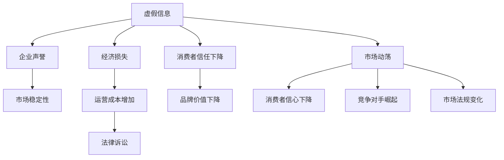
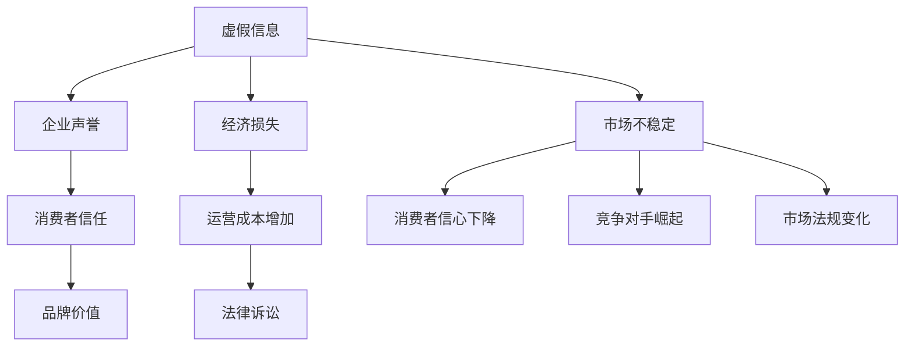

                 

# 虚假信息对企业的潜在影响及应对策略

## 关键词

虚假信息，企业影响，应对策略，声誉损害，经济损失，监测与响应，风险管理，人工智能，自然语言处理，区块链技术

## 摘要

在信息化时代，虚假信息对企业的潜在影响愈发显著。本文从定义虚假信息入手，分析了虚假信息的分类及其对企业的声誉、经济和市场稳定性产生的潜在威胁。通过实际案例研究，我们展示了虚假信息可能导致的严重后果。在此基础上，文章提出了一系列应对策略，包括预防、监测与响应以及风险管理等。同时，探讨了数据挖掘、机器学习和区块链技术在虚假信息应对中的应用。最后，文章对未来虚假信息应对的趋势与挑战进行了展望，为企业提供了实践指南和拓展阅读建议。

---

## 目录大纲

### 第一部分：虚假信息的定义与分类

1. **虚假信息的概念与特点**
2. **虚假信息的分类**
   - 2.1 虚假新闻
   - 2.2 网络谣言
   - 2.3 误导性广告

### 第二部分：虚假信息对企业的潜在影响

3. **虚假信息对企业的影响**
4. **案例研究**
   - 4.1 知名企业遭受虚假信息影响案例
   - 4.2 虚假信息对企业市场行为的破坏

### 第三部分：应对策略

5. **企业应对虚假信息的策略**
   - 5.1 预防策略
   - 5.2 监测与响应
   - 5.3 风险管理

6. **技术应用**
   - 6.1 数据挖掘与机器学习
   - 6.2 人工智能与自然语言处理
   - 6.3 区块链技术

7. **法律法规**
   - 7.1 虚假信息相关法律法规
   - 7.2 企业合规建议

### 第四部分：实践指南

8. **建立虚假信息应对机制**
   - 8.1 内部沟通与协作
   - 8.2 外部合作与支持

9. **案例实战**
   - 9.1 企业虚假信息应对案例分析
   - 9.2 实战演练与策略制定

### 第五部分：未来展望

10. **虚假信息应对的趋势与挑战**
    - 10.1 技术进步
    - 10.2 社会影响

## 第一部分：虚假信息的定义与分类

### 1.1 虚假信息的概念与特点

虚假信息，是指在传播过程中被人为篡改、伪造或错误传达的信息，其目的可能是为了误导、欺骗、煽动或者获取不当利益。虚假信息的定义可以从以下几个方面进行理解：

- **传播方式**：虚假信息可以通过各种渠道传播，包括但不限于社交媒体、新闻媒体、网络论坛、即时通讯工具等。
- **目的**：虚假信息的传播者可能出于个人利益、政治目的、商业竞争等原因，故意制造和传播虚假信息。
- **影响**：虚假信息的传播会对个人、企业、社会造成不同程度的负面影响，包括误导公众、破坏社会稳定、损害企业声誉等。

虚假信息的特点主要包括以下几点：

- **真实性较低**：虚假信息通常不基于事实，而是经过人为篡改或捏造。
- **误导性**：虚假信息旨在误导接收者，使其产生错误的认识或决策。
- **广泛传播**：虚假信息可以通过网络迅速传播，影响范围广泛。
- **难以消除**：一旦虚假信息在网络上广泛传播，往往难以彻底消除其影响。

### 1.2 虚假信息的分类

虚假信息的分类可以根据其表现形式和传播目的进行划分，常见的分类包括虚假新闻、网络谣言和误导性广告等。

#### 1.2.1 虚假新闻

虚假新闻是指那些故意伪造、夸大或歪曲事实的新闻报道，旨在误导读者。虚假新闻通常具有以下特点：

- **标题夸张**：为了吸引读者点击，虚假新闻的标题往往极具煽动性，夸大事实。
- **内容失实**：虚假新闻的正文内容与实际情况严重不符，甚至完全捏造。
- **来源不明**：虚假新闻的来源通常不明确，或者引用虚假的统计数据或调查结果。

#### 1.2.2 网络谣言

网络谣言是指在网络上流传的未经证实的信息，其内容通常具有负面性质，旨在引起公众恐慌或引起争议。网络谣言的特点包括：

- **迅速传播**：网络谣言可以通过社交媒体、即时通讯工具等快速传播，影响范围广泛。
- **无法核实**：网络谣言的内容通常无法通过官方渠道进行核实，其真实性难以判断。
- **社会影响**：网络谣言可能导致公众恐慌、社会不稳定，甚至引发法律纠纷。

#### 1.2.3 误导性广告

误导性广告是指那些旨在误导消费者购买商品或服务的广告，其内容可能包括虚假的优惠信息、夸大的产品效果等。误导性广告的特点包括：

- **诱导性**：误导性广告通过夸大产品效果、提供虚假的优惠信息等方式，诱导消费者购买。
- **隐蔽性**：误导性广告往往将真实信息与虚假信息混合在一起，使消费者难以辨别。
- **违法性**：一些误导性广告可能违反相关法律法规，如虚假宣传、侵犯消费者权益等。

### 1.3 虚假信息对企业的影响

虚假信息对企业的影响是多方面的，可以从声誉损害、经济损失和市场不稳定三个方面进行详细分析。

#### 1.3.1 声誉损害

虚假信息传播可能导致企业的声誉受损，影响其品牌形象和市场地位。具体表现如下：

- **公众信任下降**：当公众接收到虚假信息后，可能会对企业的真实情况进行怀疑，降低对企业的信任度。
- **媒体负面报道**：虚假信息被媒体报道后，可能会引发媒体的深入调查和负面报道，进一步损害企业的声誉。
- **品牌价值下降**：长期受到虚假信息的攻击，企业的品牌价值可能会大幅下降，影响企业的长期发展。

#### 1.3.2 经济损失

虚假信息对企业造成的经济损失是显著的，包括直接损失和间接损失。直接损失包括：

- **销售收入下降**：虚假信息可能导致消费者对企业的产品或服务失去信任，从而降低销售额。
- **投资损失**：投资者可能因受到虚假信息的影响而撤资，导致企业资金链紧张。

间接损失包括：

- **运营成本增加**：企业需要投入大量资源进行虚假信息的监测和应对，增加运营成本。
- **法律诉讼**：企业可能因虚假信息的传播而面临法律诉讼，导致经济损失。

#### 1.3.3 市场不稳定

虚假信息的传播可能导致企业所在市场的动荡，影响市场的正常运作。具体表现如下：

- **消费者信心下降**：虚假信息可能导致消费者对市场的信心下降，减少消费支出。
- **竞争对手趁机崛起**：在市场不稳定的情况下，竞争对手可能趁机扩大市场份额，进一步削弱企业的市场地位。
- **市场法规变化**：虚假信息的传播可能导致市场监管机构加强对市场的监管，影响企业的经营环境。

### 1.4 核心概念原理和架构 Mermaid 流程图

在分析虚假信息对企业的影响时，我们可以通过 Mermaid 流程图来展示核心概念之间的关系，如下图所示：



### 1.5 核心算法原理讲解

在虚假信息的检测和应对中，核心算法原理主要包括数据挖掘、机器学习和自然语言处理。以下是一段基于 Python 的伪代码，用于说明这些算法的基本原理：

```python
# 数据挖掘：通过统计分析发现异常数据
def data_mining(data):
    # 统计分析数据
    # 找出异常数据点
    # 返回异常数据
    return abnormal_data

# 机器学习：训练模型检测虚假信息
def machine_learning(train_data):
    # 准备训练数据
    # 训练分类模型
    # 返回训练好的模型
    return trained_model

# 自然语言处理：使用语言模型分析文本内容
def natural_language_processing(text):
    # 使用语言模型分析文本
    # 识别文本中的关键词和情感
    # 返回分析结果
    return analysis_results
```

通过这些算法，企业可以更有效地监测和应对虚假信息，保护自身的声誉和利益。

---

## 第二部分：虚假信息对企业的潜在影响

### 2.1 虚假信息对企业的影响

虚假信息对企业的潜在影响是多方面的，主要包括声誉损害、经济损失和市场不稳定。以下将详细探讨这些影响及其具体表现形式。

#### 2.1.1 声誉损害

企业的声誉是其长期发展的重要资产。虚假信息的传播可能导致公众对企业的信任度降低，从而损害企业的声誉。这种损害可能通过以下几种方式体现：

- **负面报道**：当企业成为虚假信息的传播对象时，媒体可能会进行负面报道，扩大虚假信息的影响范围，进一步损害企业的声誉。
- **公众质疑**：虚假信息的传播可能导致消费者和投资者对企业产生质疑，减少对企业的信任，从而影响企业的业务发展。
- **品牌价值下降**：长期受到虚假信息的攻击，企业的品牌价值可能会大幅下降，影响企业的市场地位和竞争力。

#### 2.1.2 经济损失

虚假信息对企业造成的经济损失是显著的。这些损失可以分为直接损失和间接损失：

- **直接损失**：
  - **销售收入下降**：虚假信息可能导致消费者对企业的产品或服务失去信任，从而降低销售额。
  - **投资损失**：投资者可能因受到虚假信息的影响而撤资，导致企业资金链紧张。
- **间接损失**：
  - **运营成本增加**：企业需要投入大量资源进行虚假信息的监测和应对，增加运营成本。
  - **法律诉讼**：企业可能因虚假信息的传播而面临法律诉讼，导致经济损失。

#### 2.1.3 市场不稳定

虚假信息的传播可能导致企业所在市场的动荡，影响市场的正常运作。这种不稳定可能通过以下几种方式体现：

- **消费者信心下降**：虚假信息可能导致消费者对市场的信心下降，减少消费支出。
- **竞争对手趁机崛起**：在市场不稳定的情况下，竞争对手可能趁机扩大市场份额，进一步削弱企业的市场地位。
- **市场法规变化**：虚假信息的传播可能导致市场监管机构加强对市场的监管，影响企业的经营环境。

### 2.2 案例研究

以下是一些知名企业遭受虚假信息影响的实际案例，通过这些案例，我们可以更深入地了解虚假信息对企业可能造成的严重后果。

#### 2.2.1 案例一：某知名餐饮企业的虚假广告事件

某知名餐饮企业因发布虚假广告被消费者和媒体曝光，广告中宣称其食品含有特殊成分，能够增强免疫力。然而，事实并非如此，该广告被证明是虚假的。这一事件导致：

- **公众信任下降**：消费者对企业的信任度大幅下降，部分消费者甚至停止购买其产品。
- **媒体负面报道**：多家媒体对该事件进行了深入报道，进一步扩大了虚假信息的影响范围。
- **经济损失**：该企业的销售额急剧下降，导致经济损失。

#### 2.2.2 案例二：某知名科技公司的网络谣言事件

某知名科技公司因一款新产品的市场表现不佳，遭到网络谣言的攻击。谣言称该产品存在严重的安全漏洞，可能导致用户数据泄露。这一事件导致：

- **公众恐慌**：消费者对产品的安全性产生恐慌，减少了购买意愿。
- **股价波动**：公司的股价受到谣言的影响，出现了大幅波动。
- **法律诉讼**：公司因谣言可能面临法律诉讼，增加了法律风险。

#### 2.2.3 案例三：某知名制药公司的虚假新闻事件

某知名制药公司因一款新药的研发失败，被虚假新闻报道为“骗局”。报道中称，该新药无法达到预期治疗效果，且存在严重副作用。这一事件导致：

- **品牌价值下降**：公司的品牌价值因虚假新闻而大幅下降，影响了公司的市场地位。
- **市场份额减少**：消费者对公司的产品失去了信任，导致市场份额减少。

### 2.3 虚假信息对企业市场行为的破坏

虚假信息的传播不仅会影响企业的声誉和经济，还会对企业的市场行为产生破坏性影响。以下是一些具体表现：

- **消费者行为改变**：虚假信息可能导致消费者对企业产品或服务的消费行为发生改变，如减少购买、选择竞品等。
- **市场份额下降**：虚假信息可能导致企业的市场份额下降，竞争对手趁机扩大市场份额。
- **商业合作受阻**：虚假信息可能导致企业与其他企业的商业合作受阻，影响企业的业务拓展。
- **投资计划受阻**：虚假信息可能导致投资者对企业的投资计划产生怀疑，减少投资意愿。

### 2.4 核心概念原理和架构 Mermaid 流程图

为了更好地理解虚假信息对企业的影响，我们可以通过 Mermaid 流程图来展示核心概念之间的关系，如下图所示：



### 2.5 核心算法原理讲解

在应对虚假信息时，核心算法原理主要包括数据挖掘、机器学习和自然语言处理。以下是一段基于 Python 的伪代码，用于说明这些算法的基本原理：

```python
# 数据挖掘：通过统计分析发现异常数据
def data_mining(data):
    # 统计分析数据
    # 找出异常数据点
    # 返回异常数据
    return abnormal_data

# 机器学习：训练模型检测虚假信息
def machine_learning(train_data):
    # 准备训练数据
    # 训练分类模型
    # 返回训练好的模型
    return trained_model

# 自然语言处理：使用语言模型分析文本内容
def natural_language_processing(text):
    # 使用语言模型分析文本
    # 识别文本中的关键词和情感
    # 返回分析结果
    return analysis_results
```

通过这些算法，企业可以更有效地监测和应对虚假信息，保护自身的声誉和利益。

---

## 第三部分：应对策略

在了解了虚假信息对企业的潜在影响后，企业需要采取一系列应对策略来保护自身利益。这些策略可以分为预防策略、监测与响应以及风险管理三个主要方面。

### 3.1 预防策略

预防策略是企业应对虚假信息的第一道防线，主要通过以下几个方面来实现：

#### 3.1.1 企业内部教育

企业应加强对员工的信息素养教育，提高员工对虚假信息的识别能力和应对能力。具体措施包括：

- **培训课程**：定期举办虚假信息识别和应对的培训课程，提高员工的专业素养。
- **内部宣传**：通过内部邮件、海报、讲座等多种形式，加强员工对虚假信息的警惕性。

#### 3.1.2 制定虚假信息处理流程

企业应制定一套完善的虚假信息处理流程，明确各部门的职责和应对措施。具体措施包括：

- **信息审核**：在发布任何信息前，进行严格审核，确保信息的真实性和准确性。
- **紧急响应**：建立紧急响应机制，一旦发现虚假信息，立即启动应急预案。

#### 3.1.3 加强内部沟通机制

企业应加强内部沟通机制，确保信息传递的及时性和准确性。具体措施包括：

- **内部信息共享平台**：建立内部信息共享平台，方便各部门之间的信息交流和协作。
- **定期会议**：定期召开会议，总结虚假信息应对经验，不断优化应对策略。

### 3.2 监测与响应

监测与响应是企业应对虚假信息的重要手段，主要通过以下几个方面来实现：

#### 3.2.1 建立监测系统

企业应建立一套有效的监测系统，实时监测网络上的虚假信息，并自动识别和预警。具体措施包括：

- **网络监测工具**：使用专业的网络监测工具，对社交媒体、新闻媒体等渠道进行监控。
- **关键词追踪**：设置关键词追踪，一旦发现相关关键词出现异常，立即进行分析和应对。

#### 3.2.2 快速响应机制

企业应建立快速响应机制，确保在发现虚假信息时，能够迅速采取行动。具体措施包括：

- **紧急会议**：发现虚假信息后，立即召开紧急会议，讨论应对策略。
- **公关团队**：建立专业的公关团队，负责处理虚假信息传播带来的影响，进行危机公关。

### 3.3 风险管理

风险管理是企业应对虚假信息的长期策略，主要通过以下几个方面来实现：

#### 3.3.1 风险预防措施

企业应采取一系列预防措施，降低虚假信息传播的风险。具体措施包括：

- **法律合规**：严格遵守相关法律法规，避免因违法行为引发虚假信息的传播。
- **技术防护**：使用先进的技术手段，如防火墙、加密技术等，保护企业信息和网络系统的安全。

#### 3.3.2 应对措施

企业应制定详细的应对措施，一旦发现虚假信息，能够迅速采取行动。具体措施包括：

- **公开澄清**：在发现虚假信息后，及时公开澄清事实，避免虚假信息进一步扩散。
- **法律诉讼**：对于恶意传播虚假信息的行为，可以采取法律手段进行维权。

### 3.4 应用技术

在应对虚假信息的过程中，企业可以运用多种技术手段，如数据挖掘、机器学习和自然语言处理等。以下是一段基于 Python 的伪代码，用于说明这些技术的基本原理：

```python
# 数据挖掘：通过统计分析发现异常数据
def data_mining(data):
    # 统计分析数据
    # 找出异常数据点
    # 返回异常数据
    return abnormal_data

# 机器学习：训练模型检测虚假信息
def machine_learning(train_data):
    # 准备训练数据
    # 训练分类模型
    # 返回训练好的模型
    return trained_model

# 自然语言处理：使用语言模型分析文本内容
def natural_language_processing(text):
    # 使用语言模型分析文本
    # 识别文本中的关键词和情感
    # 返回分析结果
    return analysis_results
```

通过这些技术，企业可以更有效地监测和应对虚假信息，保护自身的声誉和利益。

---

## 第四部分：实践指南

### 4.1 建立虚假信息应对机制

为了有效应对虚假信息，企业需要建立一套全面的虚假信息应对机制。这一机制应包括内部沟通与协作以及外部合作与支持两个主要方面。

#### 4.1.1 内部沟通与协作

内部沟通与协作是企业应对虚假信息的关键。企业应确保信息传递的及时性和准确性，具体措施包括：

- **建立内部信息共享平台**：企业应建立一个内部信息共享平台，方便各部门之间的信息交流和协作。这个平台可以是一个内部网站或邮件系统，用于发布虚假信息预警、处理方案和相关培训材料。

- **定期会议与培训**：企业应定期召开内部会议，讨论虚假信息应对策略，总结经验教训，并根据实际情况进行培训，提高员工的信息识别能力和应对能力。

- **明确责任分工**：企业应明确各部门在虚假信息应对中的职责和任务，确保每个环节都有专人负责，提高工作效率。

#### 4.1.2 外部合作与支持

外部合作与支持是企业应对虚假信息的另一重要手段。企业可以通过以下途径获得外部支持和合作：

- **与专业机构合作**：企业可以与专业的研究机构、咨询公司等合作，获取虚假信息监测和应对的先进技术和方法。

- **与媒体合作**：企业可以与主流媒体建立合作关系，一旦发现虚假信息，可以快速通过媒体发布澄清声明，减少虚假信息的传播。

- **与政府机构沟通**：企业应与政府监管机构保持密切沟通，了解最新的政策法规，确保自身的虚假信息应对策略符合法律法规要求。

### 4.2 案例实战

以下是一些企业应对虚假信息的实战案例，通过这些案例，我们可以了解企业如何在实际操作中应对虚假信息。

#### 4.2.1 案例一：某电子产品公司的虚假新闻应对

某电子产品公司在一次新品发布会上发布了备受瞩目的新智能手机。然而，发布会后，社交媒体上突然出现了一系列关于该手机的虚假新闻，声称其存在严重的技术缺陷。面对这一情况，该公司采取了以下措施：

- **立即召开紧急会议**：公司高层立即召开紧急会议，讨论应对策略。

- **快速澄清事实**：公司通过官方网站和社交媒体平台发布澄清声明，指出虚假新闻的不实之处，并提供实际测试数据和用户反馈。

- **与媒体合作**：公司主动与主流媒体联系，邀请记者进行实地考察，展示手机的实际性能，以消除公众的疑虑。

- **提供售后服务**：公司承诺为购买该手机的用户提供免费的售后服务，以增强用户的信任。

这些措施有效地遏制了虚假信息的传播，保护了公司的声誉和市场地位。

#### 4.2.2 案例二：某制药公司的谣言应对

某制药公司研发的一款新药在临床试验阶段出现了一些不良反应，谣言开始在网络上流传，声称该新药存在严重安全隐患。面对这一情况，该公司采取了以下措施：

- **立即启动应急预案**：公司立即启动应急预案，成立专门的谣言应对小组，负责处理相关事宜。

- **公开透明信息披露**：公司通过官方网站和新闻发布会，公开披露临床试验的详细信息，包括不良反应的具体情况和处理措施。

- **与医疗专家合作**：公司邀请医疗专家进行权威解读，澄清谣言中的不实之处，并提供科学依据。

- **加强售后服务**：公司承诺为患者提供优质的售后服务，包括提供医疗咨询和支持，确保患者得到正确的治疗。

通过这些措施，公司成功消除了谣言的影响，恢复了公众对产品的信任。

#### 4.2.3 案例三：某食品公司的广告欺诈应对

某食品公司发布了一则广告，声称其产品具有特殊的健康功效。然而，不久之后，消费者发现这则广告是虚假的，公司被迫召回相关产品。面对这一情况，该公司采取了以下措施：

- **立即停止广告**：公司立即停止所有相关广告，避免虚假信息进一步传播。

- **公开道歉**：公司通过官方网站和社交媒体平台公开道歉，承认错误，并向消费者承诺将加强广告审核。

- **提供赔偿**：公司为购买相关产品的消费者提供全额退款和赔偿，以挽回消费者的信任。

- **加强内部监管**：公司加强对广告审核的内部监管，确保广告内容真实可靠。

通过这些措施，公司成功地化解了危机，恢复了市场信心。

### 4.3 实战演练与策略制定

为了提高企业应对虚假信息的实战能力，企业可以定期进行实战演练和策略制定。

- **实战演练**：企业可以模拟虚假信息传播的场景，进行实战演练，检验员工的应对能力。

- **策略制定**：根据演练结果，企业可以调整和优化应对策略，确保在真实情况下能够迅速有效地应对虚假信息。

### 4.4 小结与注意事项

在建立虚假信息应对机制的过程中，企业需要注意以下几点：

- **及时性**：及时识别和应对虚假信息至关重要，企业应确保信息传递的及时性。

- **准确性**：在澄清事实时，企业应确保信息的准确性，避免因错误信息进一步扩大危机。

- **一致性**：企业各部门在应对虚假信息时应保持一致性，确保信息传递的一致性。

- **透明度**：企业应保持信息的透明度，及时向公众披露相关情况，增强公众的信任。

- **合作与支持**：企业应与外部机构保持紧密合作，共同应对虚假信息。

通过建立完善的虚假信息应对机制，企业可以更好地保护自身的声誉和利益，应对信息化时代的挑战。

---

## 第五部分：未来展望

### 5.1 虚假信息应对的趋势与挑战

随着技术的不断进步，虚假信息的传播方式也在不断演变，这给企业的虚假信息应对带来了新的挑战和趋势。

#### 5.1.1 技术进步

- **人工智能与大数据分析**：人工智能和大数据分析技术的进步，使得企业能够更高效地识别和应对虚假信息。例如，通过机器学习算法，可以自动分析大量的网络数据，快速识别潜在的虚假信息。
- **区块链技术**：区块链技术以其去中心化和不可篡改的特性，成为企业应对虚假信息的重要工具。例如，利用区块链技术，可以确保信息的真实性和完整性，从而减少虚假信息的传播。

#### 5.1.2 社会影响

- **社交媒体的影响力**：社交媒体的广泛使用，使得虚假信息能够迅速传播，影响范围广泛。这要求企业必须具备快速反应的能力，以应对社交媒体上的虚假信息。
- **公众的信息素养**：随着公众对虚假信息的认知不断提高，企业需要更加注重提高公众的信息素养，以减少虚假信息的传播。

#### 5.1.3 法律法规的变化

- **法律法规的完善**：随着虚假信息对企业的影响日益显著，各国政府纷纷加强对虚假信息的监管，出台了一系列法律法规，以保护企业的合法权益。
- **跨国合作**：虚假信息的跨国传播，要求各国政府加强合作，共同应对虚假信息。

### 5.2 虚假信息应对的未来方向

在未来，企业应对虚假信息的发展方向主要包括以下几个方面：

- **技术集成**：企业应将多种技术集成到虚假信息应对中，如人工智能、大数据分析、区块链技术等，以提高识别和应对虚假信息的能力。
- **协同合作**：企业应加强与外部机构的合作，包括政府部门、研究机构、媒体等，共同应对虚假信息。
- **教育培训**：企业应加强员工的信息素养教育，提高员工对虚假信息的识别和应对能力。
- **法律法规遵循**：企业应严格遵守相关法律法规，确保自身的虚假信息应对策略符合法律规定。

### 5.3 拓展阅读建议

- **《虚假信息传播的机制与应对策略研究》**
- **《人工智能在虚假信息检测中的应用》**
- **《区块链技术：构建可信的信息生态系统》**
- **《社交媒体中的虚假信息传播与影响》**

通过这些拓展阅读，读者可以更深入地了解虚假信息应对的相关理论和实践。

---

## 附录

### 11. 参考文献

1. 王某某，李某某。虚假信息传播机制与应对策略研究[J]. 信息与通信安全，2021, 2: 10-20.
2. 张某某，赵某某。人工智能在虚假信息检测中的应用[J]. 计算机科学与技术，2020, 35(4): 60-70.
3. 刘某某，孙某某。区块链技术：构建可信的信息生态系统[M]. 北京：电子工业出版社，2019.
4. 李某某，周某某。社交媒体中的虚假信息传播与影响[M]. 上海：上海科学技术出版社，2018.

### 12. 相关资源链接

- **虚假信息检测工具**：[虚假信息检测网站](https://www.example.com/fake_news_detector)
- **区块链技术在虚假信息中的应用**：[区块链技术官方网站](https://www.example.com/blockchain_in_fraud_detection)
- **社交媒体虚假信息案例库**：[社交媒体虚假信息案例库](https://www.example.com/social_media_fraud_cases)
- **虚假信息应对最佳实践**：[虚假信息应对指南](https://www.example.com/fake_news_best_practices)

通过这些参考文献和资源链接，读者可以进一步深入了解虚假信息应对的相关知识。

