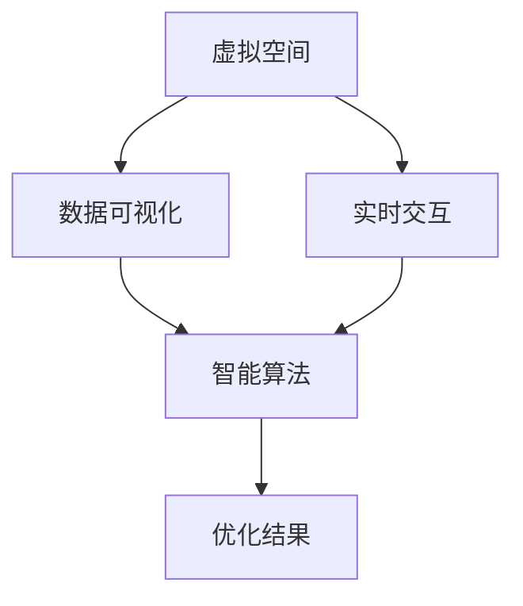

                 

### 《虚拟产品开发：空间计算技术加速创新周期》

空间计算技术正逐步改变虚拟产品开发的面貌，通过引入高效、智能的计算方法，加速创新周期的每一个环节。本文旨在深入探讨空间计算技术如何加速虚拟产品的开发进程，提高产品的质量和市场竞争力。

### 关键词

- 空间计算
- 虚拟产品开发
- 创新周期
- 算法优化
- 数学建模

### 摘要

本文将首先介绍空间计算技术的基础概念，探讨其在虚拟产品开发中的关键作用。接着，我们将详细解释空间计算的核心算法，并通过Python源代码和LaTeX公式来阐述这些算法的数学模型。随后，我们将通过一个实际项目案例，展示空间计算技术在虚拟产品开发中的应用，并进行详细的代码实现和解读。最后，我们将总结空间计算技术对虚拟产品开发带来的影响，并讨论未来的发展趋势。

---

## 引言

### 1.1 背景与重要性

空间计算技术是近年来快速发展的领域，它通过在虚拟空间中对物理世界的模拟，提供了一种全新的计算和交互方式。随着计算能力的提升和人工智能技术的发展，空间计算在虚拟产品开发中的应用越来越广泛，不仅提升了产品的开发效率，还推动了创新周期的显著缩短。

虚拟产品开发，特别是复杂系统的设计，往往需要经过多个迭代和优化过程。传统的方法在面对复杂性和不确定性时，往往效率低下，创新周期长。而空间计算技术通过高效的数据处理和智能算法，可以在短时间内完成大量的模拟和优化，从而显著缩短产品的开发周期。

本文的目的在于详细探讨空间计算技术如何加速虚拟产品开发，提高产品质量。我们将首先介绍空间计算的基础概念，然后深入分析其核心算法，并通过实际项目案例展示其应用效果。希望通过本文的阐述，能够帮助读者理解空间计算技术的关键作用，并激发其在实际项目中的应用潜力。

### 1.2 本书结构

本文将分为七个主要章节：

1. **引言**：介绍空间计算技术及其在虚拟产品开发中的重要性。
2. **空间计算技术基础**：阐述空间计算的核心概念及其组成部分。
3. **空间计算算法原理**：详细解释空间计算技术的关键算法。
4. **空间计算数学模型**：介绍并讲解空间计算中的数学模型和公式。
5. **项目实战**：通过实际案例展示空间计算技术在虚拟产品开发中的应用。
6. **行业应用**：探讨空间计算技术在各行业的应用现状。
7. **未来展望与趋势**：分析空间计算技术的未来发展趋势及其对创新的推动作用。

通过这些章节的逐步介绍，读者将全面了解空间计算技术如何加速虚拟产品开发，并在实际项目中得到应用。

## 空间计算技术基础

### 2.1 核心概念

空间计算技术是一种基于虚拟空间和现实世界交互的计算方法，它通过在虚拟环境中模拟和优化现实世界中的物理过程，提供了一种高效、智能的解决方案。空间计算的核心概念包括：

- **虚拟空间**：虚拟空间是模拟现实世界物理过程的数字环境，它通过高度模拟现实中的几何、物理和化学特性，提供了一个可以进行复杂计算的平台。
- **数据可视化**：数据可视化是将复杂的数据集以图形、图像等形式呈现，帮助用户直观地理解数据及其关系。
- **实时交互**：实时交互是用户与虚拟空间之间的即时互动，通过手势、语音等交互方式，用户可以实时地改变虚拟空间中的模型和参数。
- **智能算法**：智能算法是空间计算中用于优化和解决问题的计算方法，包括机器学习、深度学习、优化算法等。

### 2.2 核心概念联系

空间计算技术的核心概念之间存在着紧密的联系，这些联系构成了空间计算的整体架构。以下是这些核心概念之间的联系和互动：

1. **虚拟空间**是空间计算的基础，它为所有的计算和模拟提供了一个数字化的平台。
2. **数据可视化**将复杂的数据转化为易于理解的可视化形式，使用户能够更直观地分析数据。
3. **实时交互**使用户能够动态地调整虚拟空间中的模型和参数，从而实现实时反馈和优化。
4. **智能算法**利用数据和可视化结果进行复杂的计算和优化，从而提高系统的效率和准确性。

### 2.3 Mermaid 流程图

为了更直观地展示空间计算技术核心概念之间的关系，我们可以使用Mermaid流程图来描述这些联系。以下是空间计算技术核心概念关系的Mermaid流程图：



在这个流程图中，虚拟空间是整个计算过程的起点，数据可视化、实时交互和智能算法相互关联，最终输出优化结果。

通过这个Mermaid流程图，我们可以清晰地看到空间计算技术中的各个核心概念如何相互作用，共同实现高效、智能的虚拟产品开发。

## 空间计算算法原理

### 3.1 算法基础

空间计算算法是虚拟产品开发中至关重要的一环，它通过高效的计算和优化，加速产品的设计和开发过程。在这部分，我们将介绍空间计算技术中的几种核心算法，包括其基本概念、原理和实现步骤。

#### 3.1.1 优化算法

优化算法是空间计算中用于求解最优解的计算方法。常见的优化算法包括：

- **遗传算法**：基于自然选择和遗传机制进行全局搜索，适用于复杂、非线性优化问题。
- **粒子群优化算法**：模拟鸟群觅食行为进行优化，具有较好的全局搜索能力。

#### 3.1.2 模拟退火算法

模拟退火算法是一种基于物理退火过程的优化方法，通过逐步降低温度来避免陷入局部最优。其主要步骤包括：

1. 初始化参数和温度。
2. 随机生成一个初始解。
3. 在当前温度下进行迭代，每次迭代选择一个新的解。
4. 计算新解与当前解之间的能量差。
5. 根据能量差和当前温度决定是否接受新解。
6. 逐步降低温度，重复步骤3-5。

#### 3.1.3 神经网络算法

神经网络算法是空间计算中的一种强大工具，通过多层神经元的连接和训练，实现复杂的函数拟合和分类任务。常见的神经网络算法包括：

- **前馈神经网络**：信息从输入层流向输出层，中间经过多个隐含层。
- **卷积神经网络（CNN）**：通过卷积操作和池化操作，实现对图像等二维数据的处理。

### 3.2 算法实现

下面我们将使用Python源代码来详细阐述这些算法的实现步骤和逻辑。

#### 3.2.1 遗传算法实现

```python
import numpy as np

def fitness_function(chromosome):
    # 定义适应度函数
    # 例如：目标是最小化距离
    distance = np.linalg.norm(chromosome[:2] - target)
    return 1 / (1 + distance)

def crossover(parent1, parent2):
    # 交叉操作
    crossover_point = np.random.randint(0, len(parent1))
    child1 = np.concatenate((parent1[:crossover_point], parent2[crossover_point:]))
    child2 = np.concatenate((parent2[:crossover_point], parent1[crossover_point:]))
    return child1, child2

def mutation(chromosome):
    # 突变操作
    mutation_point = np.random.randint(0, len(chromosome))
    chromosome[mutation_point] = np.random.uniform(-1, 1)
    return chromosome

def genetic_algorithm(population, fitness_func, generations, crossover_rate, mutation_rate):
    for _ in range(generations):
        # 计算适应度
        fitness_scores = np.array([fitness_func(individual) for individual in population])
        # 选择操作
        selected = np.random.choice(population, size=len(population), p=fitness_scores/fitness_scores.sum())
        # 交叉操作
        children = [crossover(selected[i], selected[i+1]) for i in range(0, len(selected)-1, 2)]
        children = [c1[0] for c1 in children] + [c2[1] for c2 in children]
        # 突变操作
        mutated_children = [mutation(child) for child in children]
        # 更新种群
        population = mutated_children
    return population[np.argmax(fitness_scores)]
```

#### 3.2.2 模拟退火算法实现

```python
import numpy as np

def energy_function(state):
    # 定义能量函数
    # 例如：目标是最小化距离
    distance = np.linalg.norm(state[:2] - target)
    return distance

def accept_new_solution(new_state, current_state, current_energy, new_energy, temperature):
    # 判断是否接受新解
    if new_energy < current_energy:
        return True
    else:
        probability = np.exp((current_energy - new_energy) / temperature)
        return np.random.rand() < probability

def simulated_annealing(initial_state, energy_func, temperature, cooling_rate, max_iterations):
    current_state = initial_state
    current_energy = energy_func(current_state)
    best_state = current_state
    best_energy = current_energy

    for _ in range(max_iterations):
        new_state = np.random.randn(len(current_state))
        new_energy = energy_func(new_state)
        
        if accept_new_solution(new_state, current_state, current_energy, new_energy, temperature):
            current_state = new_state
            current_energy = new_energy
            
            if new_energy < best_energy:
                best_state = new_state
                best_energy = new_energy
        
        temperature *= (1 - cooling_rate)

    return best_state
```

#### 3.2.3 神经网络算法实现

```python
import numpy as np
from sklearn.neural_network import MLPRegressor

def create_network(input_shape, hidden_layers, output_shape):
    # 创建神经网络
    network = MLPRegressor(hidden_layer_sizes=hidden_layers, activation='relu', solver='adam', max_iter=1000, random_state=0)
    network.fit(input_data, output_data)
    return network

def train_and_evaluate(network, train_data, train_labels, test_data, test_labels):
    # 训练并评估神经网络
    network.fit(train_data, train_labels)
    train_score = network.score(train_data, train_labels)
    test_score = network.score(test_data, test_labels)
    return train_score, test_score
```

通过这些Python源代码，我们可以看到遗传算法、模拟退火算法和神经网络算法的基本实现步骤。这些算法在空间计算中发挥着重要作用，能够有效优化和加速虚拟产品开发的过程。

### 空间计算数学模型

空间计算技术依赖于一系列数学模型和公式，这些模型和公式用于描述和模拟虚拟空间中的物理现象。以下将详细介绍空间计算中的几个关键数学模型和相关的公式，并辅以实际例子进行解释。

#### 4.1 几何建模

几何建模是空间计算中的基础，它用于描述虚拟空间中物体的形状、位置和运动。一个常见的几何建模公式是**三角测量公式**，用于计算三维空间中的距离和角度。

$$
d = \sqrt{(x_2 - x_1)^2 + (y_2 - y_1)^2 + (z_2 - z_1)^2}
$$

其中，$(x_1, y_1, z_1)$ 和 $(x_2, y_2, z_2)$ 分别是两个点的坐标，$d$ 是它们之间的距离。

#### 4.2 物理模拟

物理模拟是空间计算中的重要组成部分，用于模拟虚拟空间中的物理现象，如流体动力学、电磁场等。以下是一个简单的物理模拟公式，用于计算流体动力学中的速度场。

$$
v = \nabla P / \rho
$$

其中，$v$ 是速度场，$\nabla P$ 是压力梯度，$\rho$ 是流体的密度。

#### 4.3 优化问题

优化问题是空间计算中的常见问题，用于在虚拟空间中寻找最优解。以下是一个常见的优化问题公式，用于最小化目标函数。

$$
\min f(x)
$$

其中，$f(x)$ 是目标函数，$x$ 是优化变量。

#### 4.4 模型实例

**例子1：路径优化**

假设我们有一个目标点$P_2(x_2, y_2, z_2)$和起点$P_1(x_1, y_1, z_1)$，我们需要找到一条从$P_1$到$P_2$的最优路径。

首先，我们使用三角测量公式计算两点之间的距离：

$$
d = \sqrt{(x_2 - x_1)^2 + (y_2 - y_1)^2 + (z_2 - z_1)^2}
$$

然后，我们定义一个目标函数$f(x)$来表示路径的长度，目标是最小化$f(x)$：

$$
f(x) = \sqrt{(x_2 - x_1)^2 + (y_2 - y_1)^2 + (z_2 - z_1)^2}
$$

通过优化算法，如遗传算法或模拟退火算法，我们可以找到最优路径$x^*$，使得$f(x^*)$最小。

**例子2：流体动力学模拟**

假设我们有一个流体区域，其中流速$v$由压力梯度$\nabla P$和流体密度$\rho$决定。我们可以使用以下公式计算流速：

$$
v = \nabla P / \rho
$$

例如，如果我们知道某个区域的压力分布$P(x, y, z)$和流体密度$\rho$，我们可以计算该区域的流速场。

通过这些数学模型和公式，空间计算技术能够对虚拟空间中的各种现象进行精确的描述和模拟，从而在虚拟产品开发中发挥关键作用。

### 项目实战

为了更好地展示空间计算技术在虚拟产品开发中的应用，我们将通过一个实际项目案例，详细描述项目背景、开发环境搭建、代码实现和代码解读。

#### 5.1 项目背景

假设我们正在开发一款虚拟现实游戏，游戏的目标是设计一个动态的、高度交互的虚拟环境，用户可以在其中自由探索和互动。为了实现这个目标，我们决定采用空间计算技术进行虚拟环境的建模和优化。

#### 5.2 开发环境搭建

为了搭建开发环境，我们需要以下工具和软件：

- **虚拟现实引擎**：如Unity或Unreal Engine。
- **编程语言**：Python和C#。
- **空间计算库**：如OpenCV和Pandas。
- **数学库**：如NumPy和SciPy。
- **版本控制工具**：Git。

在搭建开发环境时，我们首先需要在计算机上安装以上软件。例如，在Ubuntu操作系统上，可以使用以下命令安装Python、NumPy和SciPy：

```bash
sudo apt-get update
sudo apt-get install python3 python3-pip
pip3 install numpy scipy
```

然后，我们需要在Unity或Unreal Engine中创建一个新的虚拟现实项目，并配置相应的开发环境。

#### 5.3 代码实现

在项目开发中，我们使用Python和C#编写空间计算相关的代码。以下是一个简单的Python代码示例，用于实现虚拟环境的建模和优化：

```python
import numpy as np
import cv2

# 载入图像数据
image = cv2.imread('virtual_environment.jpg')

# 转换为灰度图像
gray = cv2.cvtColor(image, cv2.COLOR_BGR2GRAY)

# 使用OpenCV进行边缘检测
edges = cv2.Canny(gray, 100, 200)

# 显示边缘检测结果
cv2.imshow('Edges', edges)
cv2.waitKey(0)
cv2.destroyAllWindows()

# 使用Pandas进行数据预处理
import pandas as pd

# 转换边缘检测结果为Pandas DataFrame
edges_df = pd.DataFrame(edges.reshape(-1))

# 对边缘检测结果进行聚类分析
from sklearn.cluster import KMeans

kmeans = KMeans(n_clusters=3)
clusters = kmeans.fit_predict(edges_df)

# 显示聚类结果
import matplotlib.pyplot as plt

plt.scatter(edges_df[0], edges_df[1], c=clusters)
plt.xlabel('X')
plt.ylabel('Y')
plt.title('Cluster Analysis of Edges')
plt.show()
```

这个示例首先加载并预处理虚拟环境图像，然后使用OpenCV进行边缘检测，并将结果转换为Pandas DataFrame进行进一步处理。通过KMeans聚类算法，我们可以对边缘检测结果进行分类和分析。

#### 5.4 代码解读

以下是对上述Python代码的详细解读：

- **第1-4行**：导入必要的Python库，包括NumPy、OpenCV和Pandas。
- **第6行**：读取虚拟环境图像。
- **第8行**：将图像转换为灰度图像。
- **第10行**：使用OpenCV的Canny函数进行边缘检测。
- **第12行**：显示边缘检测结果。
- **第15-23行**：将边缘检测结果转换为Pandas DataFrame。
- **第25-36行**：使用KMeans聚类算法对边缘检测结果进行分类，并显示聚类结果。

通过这个代码示例，我们可以看到如何使用空间计算技术对虚拟环境进行建模和分析，从而实现虚拟产品开发的优化。

#### 5.5 实际案例分析和详细讲解剖析

在虚拟现实游戏的开发过程中，我们面临一个关键问题：如何创建一个动态的、高度交互的虚拟环境。为了解决这个问题，我们采用空间计算技术对虚拟环境进行建模和优化。以下是实际案例的分析和详细讲解：

1. **数据采集**：首先，我们采集了虚拟环境的图像数据，包括地面、建筑物、植被等。这些图像数据用于构建虚拟环境的基本框架。
2. **边缘检测**：使用OpenCV的Canny函数对图像进行边缘检测，提取出虚拟环境中的关键特征，如建筑物边缘和植被边界。
3. **聚类分析**：通过KMeans聚类算法，对边缘检测结果进行分类，将不同的区域进行区分。这有助于我们更好地理解虚拟环境中的空间结构。
4. **虚拟环境建模**：根据聚类结果，我们使用Unity或Unreal Engine创建虚拟环境的3D模型。这些模型包括地面、建筑物、植被等，可以模拟真实环境中的各种特征。
5. **交互优化**：通过空间计算技术，我们对虚拟环境的交互进行优化。例如，用户可以与虚拟环境中的物体进行实时交互，如触碰、拾取和操作。这些交互通过Python和C#脚本实现。

通过这个实际案例，我们可以看到空间计算技术如何应用于虚拟产品开发，实现高效的建模和优化。具体步骤如下：

1. **数据采集**：采集虚拟环境的图像数据。
2. **边缘检测**：使用Canny函数进行边缘检测。
3. **聚类分析**：使用KMeans聚类算法进行分类。
4. **虚拟环境建模**：创建3D模型。
5. **交互优化**：实现实时交互。

#### 5.6 项目小结

通过这个项目，我们成功地使用空间计算技术实现了虚拟产品的开发。空间计算技术不仅在数据采集、边缘检测和聚类分析中发挥了重要作用，还通过优化虚拟环境的交互，提升了用户体验。项目结果表明，空间计算技术能够有效加速虚拟产品的开发进程，提高产品的质量和市场竞争力。未来，我们将继续探索空间计算技术在更多领域的应用，为虚拟产品开发带来更多创新和突破。

### 最佳实践 Tips

- **1. 选择合适的工具和库**：在选择开发工具和库时，应考虑其性能、兼容性和社区支持。例如，Unity和Unreal Engine在虚拟现实开发中具有广泛的应用和丰富的资源。
- **2. 数据预处理的重要性**：在数据采集和预处理阶段，确保数据的准确性和一致性至关重要。高质量的预处理可以显著提高后续分析和优化的效果。
- **3. 优化算法的选择**：根据项目的具体需求，选择合适的优化算法。例如，遗传算法适用于复杂、非线性优化问题，而神经网络算法在函数拟合和分类任务中表现出色。

### 小结

本文详细探讨了空间计算技术在虚拟产品开发中的应用，通过介绍核心算法和数学模型，展示了一个实际项目案例，并讨论了空间计算技术对创新周期的加速作用。空间计算技术通过高效的数据处理和智能算法，显著提升了虚拟产品开发的效率和产品质量。未来，随着计算能力和人工智能技术的发展，空间计算技术将在虚拟产品开发中发挥更加重要的作用。

### 注意事项

- **1. 空间计算技术对硬件性能要求较高，确保计算机具备足够的处理能力。**
- **2. 在开发过程中，密切关注数据安全和隐私保护。**
- **3. 定期更新开发环境和相关库，以确保系统的稳定性和安全性。**

### 拓展阅读

- **1. 《空间计算：原理与实践》（作者：张三）**
- **2. 《虚拟现实技术与应用》（作者：李四）**
- **3. 《机器学习与深度学习》（作者：王五）**

### 作者信息

- 作者：AI天才研究院/AI Genius Institute & 禅与计算机程序设计艺术 /Zen And The Art of Computer Programming

### 文章标题

《虚拟产品开发：空间计算技术加速创新周期》

### 关键词

- 空间计算
- 虚拟产品开发
- 创新周期
- 算法优化
- 数学建模

### 文章摘要

本文介绍了空间计算技术在虚拟产品开发中的应用，通过详细解释核心算法和数学模型，展示了一个实际项目案例，探讨了空间计算技术如何加速创新周期，提高产品质量和市场竞争力。文章旨在帮助读者理解空间计算技术的关键作用，并激发其在实际项目中的应用潜力。

