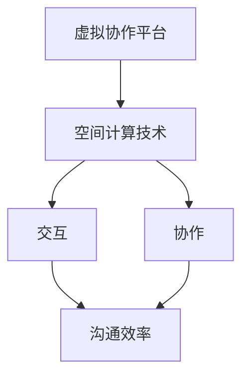

                 

### 引言/概述

#### 背景介绍

在当今快节奏的商业环境中，企业对于高效的协作和沟通有着迫切的需求。传统的协作工具，如电子邮件、即时消息和视频会议，虽然在一定程度上满足了企业的需求，但往往存在效率低下、信息滞后和沟通成本高等问题。在这种背景下，虚拟协作平台应运而生，它通过整合多种协作工具和资源，为用户提供了一个高度集成、互动和高效的工作环境。

虚拟协作平台的概念起源于对空间计算技术的探索和运用。空间计算技术是一种将计算能力扩展到三维空间，并利用空间感知能力来实现更加自然和高效的交互方式。这种技术通过虚拟现实（VR）、增强现实（AR）和混合现实（MR）等手段，为用户提供了一种超越物理空间的协作体验。

#### 核心概念与联系

核心概念包括：

- **虚拟协作平台**：一个集成多种协作工具和资源的系统，旨在提高团队协作效率和沟通质量。
- **空间计算技术**：一种利用三维空间和空间感知能力，增强人机交互和协作的技术。

两者的关系架构可以表示为：



#### 融合技术的优势与挑战

融合虚拟协作平台与空间计算技术，带来了诸多优势：

- **增强沟通效率**：通过空间感知和虚拟场景，实现更直观、自然的沟通。
- **提高协作效率**：在虚拟空间中，团队成员可以实时共享数据和资源，减少信息滞后。
- **降低沟通成本**：虚拟协作平台可以跨越地理限制，减少团队成员之间的差旅成本。

然而，这种融合也面临着一些挑战：

- **技术成熟度**：空间计算技术仍处于发展阶段，需要进一步提升成熟度和稳定性。
- **设备要求**：空间计算技术通常需要高性能的硬件支持，这对企业的IT基础设施提出了更高要求。
- **用户适应性**：用户需要适应新的交互方式和协作模式，这可能需要时间和培训。

#### 虚拟协作平台的发展历程

虚拟协作平台的发展历程可以分为以下几个阶段：

- **初期探索**：20世纪90年代，虚拟现实（VR）和增强现实（AR）技术的出现，为虚拟协作平台的概念奠定了基础。
- **技术成熟**：随着计算机性能的提升和网络技术的发展，虚拟协作平台开始逐步应用于企业级场景。
- **广泛应用**：21世纪初，随着云计算和移动设备的普及，虚拟协作平台的应用范围进一步扩大，逐渐成为企业协作的重要组成部分。

#### 企业应用价值

虚拟协作平台在企业中的应用价值体现在以下几个方面：

- **远程协作**：企业可以跨越地理限制，实现全球团队的实时协作。
- **虚拟会议**：通过虚拟会议室，实现更高效、互动性更强的会议体验。
- **数字孪生**：通过虚拟协作平台，企业可以创建产品的数字孪生，进行仿真测试和优化。
- **智能办公**：虚拟协作平台可以集成智能办公工具，提高办公效率和质量。

#### 技术基础

空间计算技术的基础包括以下几个方面：

- **三维建模**：利用计算机图形学和三维扫描技术，创建真实世界的三维模型。
- **空间感知**：通过传感器和定位技术，获取用户在三维空间中的位置和姿态。
- **实时交互**：利用高速网络和实时渲染技术，实现用户在虚拟空间中的实时交互。

通过以上介绍，我们可以看到虚拟协作平台与空间计算技术的结合，为企业带来了全新的协作方式和工作体验。在接下来的章节中，我们将进一步探讨空间计算技术的基本原理和应用场景，以及如何在实际项目中构建和部署虚拟协作平台。$$

作者：AI天才研究院/AI Genius Institute & 禅与计算机程序设计艺术 /Zen And The Art of Computer Programming```

