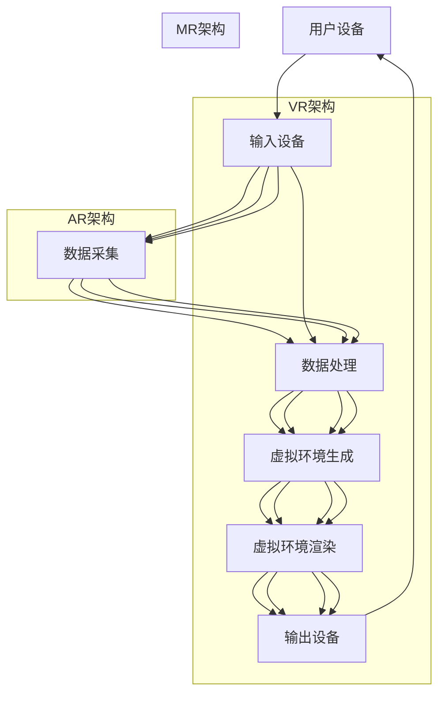

                 

### 关键词

虚拟协作、空间计算、远程工作、虚拟现实、增强现实、Python源代码、数学模型、项目实战、最佳实践、AI天才研究院、禅与计算机程序设计艺术。

### 摘要

本文深入探讨了虚拟协作与空间计算技术如何革新远程工作模式。通过背景介绍、核心概念讲解、应用案例分析以及未来展望，本文揭示了虚拟协作在提高远程工作效率、减少地理限制和提升协作体验方面的巨大潜力。文章采用Markdown格式，详细阐述了空间计算技术的原理与架构，以及如何使用Python源代码和数学模型实现虚拟协作。同时，通过实战项目和最佳实践，本文为读者提供了实际操作指导，旨在推动虚拟协作技术的发展与应用。

### 引言

在全球化浪潮的推动下，远程工作已成为现代企业运营的重要形式。然而，远程工作面临着诸多挑战，如沟通障碍、协作效率低下和地理距离带来的不便。这些问题严重影响了远程工作的效果和员工的满意度。为了解决这些问题，新的技术方案应运而生，其中空间计算技术成为改变远程工作模式的关键力量。

空间计算技术是一种利用虚拟现实（VR）和增强现实（AR）等技术，将数字世界与现实世界融合的先进技术。通过空间计算，远程工作者可以像在同一个物理空间一样进行协作和交流。这种技术不仅能够突破地理限制，还能够提供更加沉浸式的协作体验，从而提高工作效率和团队凝聚力。

本文旨在深入探讨虚拟协作与空间计算技术如何结合，共同改变远程工作模式。我们将首先介绍空间计算技术的基本概念和原理，然后分析虚拟协作的定义和实现模式，接着通过具体案例展示这些技术的应用效果，最后探讨虚拟协作的未来发展趋势和面临的挑战。希望通过本文的阐述，读者能够对虚拟协作与空间计算技术有更加全面和深入的理解。

### 背景介绍

远程工作在过去几年中经历了显著的发展，这主要得益于互联网技术的快速进步和数字化转型的加速。根据一项全球调查显示，超过50%的企业已经采用了远程工作模式，这一比例在未来几年预计将继续上升。远程工作不仅为企业提供了更大的灵活性和成本节约，也为员工带来了更加灵活的工作时间和更好的工作生活平衡。

然而，远程工作也带来了一系列挑战。首先是沟通障碍。由于团队成员分布在不同的地理位置，实时的面对面沟通变得困难。其次，协作效率低下也是一个普遍存在的问题。在远程环境中，信息的传递和共享不如在同一个物理空间内那样迅速和直接。此外，地理距离还可能导致文化差异和沟通误解，进一步影响团队的协作效果。

空间计算技术作为一种新兴的技术方案，能够有效缓解这些挑战。首先，通过虚拟现实（VR）和增强现实（AR）技术，空间计算技术能够创建一个沉浸式的虚拟环境，使远程工作者能够“面对面”交流。这种沉浸式体验可以显著减少沟通障碍，提高协作效率。其次，空间计算技术提供了强大的信息共享和协作工具，如虚拟白板、实时注释和文件共享，使团队成员能够更加高效地协同工作。

此外，空间计算技术还可以通过三维模型和可视化工具，帮助团队成员更好地理解和讨论复杂的项目。这种直观的展示方式能够减少误解，提高决策效率。总的来说，空间计算技术为远程工作提供了一个全新的协作平台，不仅克服了地理距离的限制，还提升了协作的沉浸感和效率，为企业和员工带来了诸多益处。

### 空间计算技术概述

空间计算技术是指利用计算机技术生成、处理和展示三维空间中的信息，从而实现人与环境、人与机器以及机器与机器之间的互动和协作。它结合了虚拟现实（VR）、增强现实（AR）和混合现实（MR）等多种技术，通过高度沉浸式和交互式的体验，改变了传统的信息交互方式。

#### 虚拟现实技术

虚拟现实（VR）是一种通过计算机技术生成完全虚拟的三维环境，使用户能够沉浸其中并与之互动的技术。VR的核心特点是提供一个完全封闭的虚拟空间，用户通过VR头戴设备、手柄或其他输入设备与虚拟环境进行交互。

VR的主要组件包括：
- **显示设备**：如VR头戴显示器，用于呈现虚拟环境。
- **追踪设备**：用于跟踪用户的位置和动作，以提供真实的沉浸感。
- **输入设备**：如手柄、手套等，用于与虚拟环境进行交互。

一个典型的VR系统架构如下：
1. **输入设备**：用户的动作和位置信息通过输入设备传输到计算机。
2. **计算机**：计算机处理输入信息，生成虚拟环境的图像并传输到显示设备。
3. **显示设备**：将虚拟环境以三维形式展示给用户。

VR在远程协作中的应用非常广泛，例如，通过VR技术，远程团队可以模拟在同一个会议室中开会，进行虚拟会议和团队协作。这不仅减少了实际的地理距离，还提供了更加沉浸和互动的协作体验。

#### 增强现实技术

增强现实（AR）则是通过计算机技术将虚拟信息叠加到现实世界中，使用户能够同时看到现实世界和虚拟信息。AR的核心特点是“虚实结合”，它将虚拟信息与现实环境相结合，为用户提供一种增强的现实感知。

AR的主要组件包括：
- **显示设备**：如AR眼镜、智能手机屏幕等，用于显示虚拟信息。
- **摄像头**：用于捕捉现实世界的图像。
- **处理器**：用于处理图像和生成虚拟信息。

一个典型的AR系统架构如下：
1. **摄像头**：捕捉现实世界的图像。
2. **处理器**：处理图像，并生成虚拟信息。
3. **显示设备**：将虚拟信息叠加到现实世界的图像上，展示给用户。

AR在远程协作中的应用也十分广泛，例如，工程师可以使用AR眼镜实时查看设备状态和维护指南，而不需要翻阅纸质文档。这种方式不仅提高了工作效率，还减少了人为错误。

#### 虚拟协作的关键技术

虚拟协作是空间计算技术的核心应用之一，它通过利用VR和AR技术，实现了远程团队的高效协作。虚拟协作的关键技术包括：

1. **三维建模**：通过三维建模技术，可以将远程协作的环境和工具以三维形式呈现，提供更加直观的视觉体验。
2. **实时通信**：实时通信技术确保了团队成员之间的信息传递和交流，如语音、视频和文字聊天等。
3. **共享文档**：通过云技术和文档管理系统，团队成员可以实时共享和编辑文档，提高协作效率。
4. **手势识别**：手势识别技术允许用户通过自然手势与虚拟环境进行交互，提供更加自然的用户体验。

一个典型的虚拟协作系统架构如下：
1. **用户设备**：用户通过VR头戴设备或AR眼镜接入系统。
2. **服务器**：服务器处理用户输入，生成虚拟环境和协作工具。
3. **数据库**：存储用户数据和协作内容。
4. **网络**：通过网络连接用户设备和服务器，实现实时通信和数据传输。

通过上述关键技术的结合，虚拟协作系统为远程团队提供了一个高效的协作平台，使得团队成员可以像在同一个物理空间一样进行工作，极大地提高了协作效率和团队凝聚力。

总的来说，空间计算技术通过虚拟现实和增强现实技术，为远程工作提供了一种全新的协作模式。它不仅克服了地理距离的限制，还提供了更加沉浸和互动的协作体验，为企业和员工带来了诸多益处。随着技术的不断发展和成熟，虚拟协作的应用场景将更加广泛，其影响力也将日益扩大。

### 空间计算技术的整体架构

为了更好地理解空间计算技术的工作原理和实现方式，我们可以通过一个Mermaid流程图来展示其整体架构。以下是一个简化的空间计算技术架构图：



这个流程图显示了空间计算技术从用户设备开始，经过数据采集、数据处理、虚拟环境生成、虚拟环境渲染，最后通过输出设备反馈给用户的全过程。具体来说：

1. **用户设备**：用户通过VR头戴设备、AR眼镜或MR设备接入系统，这些设备负责捕捉用户的位置、动作和视觉信息。

2. **输入设备**：用户的动作和位置信息通过输入设备传输到计算机，例如VR头戴设备的手柄或AR眼镜的摄像头。

3. **数据采集**：计算机接收并处理从输入设备传来的数据，包括位置信息、动作信息和视觉图像。

4. **数据处理**：计算机对采集到的数据进行处理，包括滤波、定位和姿态估计等，以便生成准确的虚拟环境。

5. **虚拟环境生成**：基于处理后的数据，计算机生成三维虚拟环境，将用户的视觉、听觉和触觉信息融入其中。

6. **虚拟环境渲染**：虚拟环境经过渲染后，通过显示设备（如VR头戴显示器、AR眼镜屏幕）呈现给用户。

7. **输出设备**：用户通过输出设备接收虚拟环境的反馈，进行交互和反馈。

这个架构中，VR、AR和MR三种技术各有所侧重：

- **VR架构**：主要侧重于创建完全虚拟的三维环境，用户完全沉浸其中，体验与现实分离的虚拟世界。

- **AR架构**：将虚拟信息叠加到现实世界中，用户可以看到真实环境，同时叠加虚拟信息，如文本、图像和动画等。

- **MR架构**：结合了VR和AR的特点，不仅提供了虚拟环境，还能与真实世界进行交互。

通过这个Mermaid流程图，我们可以清晰地看到空间计算技术从数据采集到虚拟环境生成的全过程，以及不同技术在架构上的差异。这为理解和应用空间计算技术提供了直观的参考。

### 空间计算技术的应用场景

空间计算技术因其强大的沉浸感和互动性，在远程工作中展现了广泛的应用潜力。以下是一些典型的应用场景，这些场景展示了空间计算技术在提升远程工作效率、增强协作体验和改善沟通效果方面的具体作用。

#### 远程团队协作

远程团队协作是空间计算技术最直接的应用之一。通过虚拟现实（VR）技术，远程团队成员可以创建一个虚拟会议室，仿佛他们身处同一个房间。例如，在一个虚拟会议室中，团队成员可以通过VR头戴设备进入一个三维模型会议室，进行实时视频会议、讨论项目和共享文件。这种体验不仅消除了地理距离的隔阂，还提高了会议的互动性和参与感。

**应用案例**：一家跨国公司的远程团队使用了VR技术进行项目讨论和协作。他们创建了一个虚拟会议室，每个团队成员可以通过VR设备进入，实时分享屏幕、注释和白板讨论。这种虚拟协作方式显著提高了团队的沟通效率，减少了会议时间和成本。

#### 远程培训与教育

空间计算技术也在远程培训和教育中发挥了重要作用。通过虚拟现实和增强现实技术，培训师可以将复杂的操作流程、安全规程和技术演示以三维形式呈现，使学员能够更加直观地理解知识。例如，在医学领域，医生可以通过VR技术进行手术模拟和培训，提高手术技能和操作熟练度。

**应用案例**：一家医疗科技公司开发了一套基于VR的培训系统，用于培训医生和护士。通过虚拟手术模拟，医生可以在虚拟环境中进行各种手术操作，学习并掌握复杂的手术技巧。这种培训方式不仅提高了培训效果，还减少了实际操作中的风险。

#### 虚拟会议

虚拟会议是远程工作中常见的场景，通过增强现实（AR）和虚拟现实（VR）技术，虚拟会议的互动性和参与感得到了显著提升。例如，使用VR技术，团队成员可以进入一个三维虚拟会议室，进行面对面的讨论和互动，而使用AR技术，可以将虚拟会议内容实时叠加到真实环境中，方便团队成员参考和互动。

**应用案例**：一家大型企业的销售团队使用了VR虚拟会议系统，他们可以在虚拟会议室中召开销售会议，进行产品演示和讨论市场策略。通过VR技术，会议的互动性和参与感大大增强，销售团队能够更加直观地了解产品特点和市场需求。

#### 远程办公

远程办公是空间计算技术的另一个重要应用场景。通过虚拟现实技术，员工可以在一个三维虚拟办公室中工作，仿佛身处真实的办公环境。这种环境不仅提供了更好的工作氛围，还提高了工作效率。此外，通过虚拟桌面和云共享技术，员工可以随时随地访问公司资源，实现无缝的工作体验。

**应用案例**：一家远程办公的公司采用了VR技术创建了一个虚拟办公室。员工通过VR设备进入虚拟办公室，仿佛置身于真实的办公环境中。他们可以在这里处理工作、参加会议和与同事互动，极大地提高了工作效率和员工满意度。

#### 设计与工程

在设计和工程领域，空间计算技术被广泛应用于3D建模、设计和协同工作。通过虚拟现实和增强现实技术，设计师和工程师可以在一个沉浸式的环境中进行协作，共同设计和修改模型。例如，通过VR技术，设计师可以在虚拟环境中查看和修改设计方案，而通过AR技术，工程师可以在施工现场实时查看和操作设备。

**应用案例**：一家汽车设计公司使用了VR技术进行汽车设计。设计师和工程师可以在虚拟环境中共同工作，实时查看和修改设计方案，大大提高了设计效率和质量。同时，他们还可以通过虚拟现实技术模拟驾驶体验，提前发现和解决设计中的问题。

总的来说，空间计算技术为远程工作提供了全新的协作和沟通方式，不仅克服了地理距离的限制，还提高了工作效率和协作体验。随着技术的不断发展和应用场景的拓展，空间计算技术将在更多领域发挥重要作用，推动远程工作模式的革新。

### 虚拟协作的概念与模式

虚拟协作是指利用数字技术，如虚拟现实（VR）和增强现实（AR），在虚拟环境中实现人与人、人与机器以及机器与机器之间的互动和协作。这种协作模式打破了地理界限，使得分布在不同地理位置的团队成员能够高效、实时地进行工作交流。

#### 定义

虚拟协作可以从以下几个方面进行定义：
- **技术层面**：虚拟协作依赖于VR和AR技术，通过虚拟环境为用户提供一个沉浸式的体验，实现远程互动和协作。
- **功能层面**：虚拟协作提供了多种功能，包括实时通信、共享文档、虚拟会议、协同设计和远程操作等，旨在提高团队协作效率和沟通质量。
- **应用层面**：虚拟协作广泛应用于远程办公、教育培训、工程设计、医疗健康等多个领域，通过数字技术实现跨地域的协作和交流。

#### 类型

根据不同的应用场景和需求，虚拟协作可以分为以下几种类型：

1. **远程视频会议**
   远程视频会议是最常见的虚拟协作形式，通过视频通信技术，团队成员可以实时交流和讨论。这种协作方式主要依赖于网络和视频设备，具有实时性和互动性的特点。

2. **虚拟办公空间**
   虚拟办公空间利用VR技术创建一个三维办公环境，团队成员可以在虚拟办公室中进行工作、交流和协作。这种模式提高了员工的沉浸感和工作效率，尤其适用于分散在不同地理位置的团队。

3. **虚拟实验室**
   虚拟实验室利用VR和AR技术模拟真实实验室环境，为科研人员和教育工作者提供一个安全、高效的实验和教学平台。通过虚拟实验，团队成员可以远程进行实验操作和数据分析，提高科研效率和教学质量。

4. **协同设计**
   协同设计是设计师和工程师利用虚拟协作技术共同完成设计任务的一种方式。通过虚拟环境，团队成员可以实时查看和修改设计图纸、模型和原型，进行协同设计和评审。

5. **远程医疗**
   远程医疗通过VR和AR技术实现医生与患者的远程交流和诊断。医生可以在虚拟环境中进行病例讨论、手术指导和实时会诊，提高了医疗服务的质量和效率。

#### 实现方式

虚拟协作的实现方式主要包括以下几个方面：

1. **硬件设备**
   虚拟协作需要一系列硬件设备，如VR头戴显示器、AR眼镜、手柄、追踪器和交互设备等。这些设备负责捕捉用户的位置、动作和视觉信息，为用户提供沉浸式的体验。

2. **软件平台**
   软件平台是虚拟协作的核心，它负责处理用户的输入和输出，生成虚拟环境并提供各种协作工具。常见的虚拟协作平台包括VRChat、Spatial Chat、Unity Hubs等。

3. **网络通信**
   网络通信是实现虚拟协作的关键，它负责连接用户设备和虚拟环境，确保实时数据和信息的传输。常见的网络协议包括Wi-Fi、5G、云服务等。

4. **云服务**
   云服务为虚拟协作提供了强大的计算和存储能力，支持大规模用户和复杂应用场景。通过云服务，虚拟协作平台可以提供高可用性、可扩展性和安全性。

#### 优势

虚拟协作具有以下优势：

1. **减少地理限制**
   虚拟协作使得团队成员无需受限于地理位置，可以在全球任何地方进行协作和交流，提高了团队的灵活性和响应速度。

2. **提高工作效率**
   通过虚拟协作，团队成员可以实时共享信息和资源，协作更加高效，减少了等待时间和沟通成本。

3. **增强协作体验**
   虚拟环境提供了更加沉浸和互动的体验，使得团队成员能够更加自然地进行交流和合作，提高了协作的效率和满意度。

4. **适应多种应用场景**
   虚拟协作适用于各种行业和应用场景，如远程办公、教育培训、医疗健康、工程设计等，具有广泛的适用性和发展潜力。

总之，虚拟协作通过利用VR和AR技术，实现远程团队的高效协作和沟通。随着技术的不断发展和应用的深入，虚拟协作将不断优化和拓展，为企业和个人带来更多的价值和机遇。

### 虚拟协作案例研究

为了更好地展示虚拟协作的实际效果，我们来看两个具体的案例研究：远程团队协作和虚拟会议。

#### 案例一：远程团队协作

**背景**：一家跨国科技公司由于业务扩张，需要在不同国家的多个团队之间进行高效的协作。传统的远程工作方式如电子邮件和视频会议已经无法满足其日益增长的协作需求。

**解决方案**：该公司决定采用虚拟协作平台，为团队成员提供一个沉浸式的工作环境。他们选择了VRChat作为虚拟办公平台，通过VR头戴设备让团队成员进入一个三维虚拟办公室。虚拟办公室中包含了会议室、休息区和协作区，每个团队成员都有自己独特的虚拟角色，可以自由地在虚拟空间中移动和交流。

**具体实施**：
1. **团队培训**：首先，公司对团队成员进行了VRChat的培训，确保每个人都能熟练使用虚拟协作工具。
2. **虚拟环境搭建**：在VRChat平台上，团队创建了一个符合公司实际需求的虚拟办公室。虚拟办公室包括会议室、休息区和协作区，每个区域都配备了相应的工具和设备。
3. **日常使用**：团队成员每天通过VR头戴设备进入虚拟办公室，进行日常的团队会议、项目讨论和协作。他们可以在虚拟白板上进行实时注释，共享文件和屏幕，并通过语音和手势进行交流。

**效果分析**：
- **提高协作效率**：通过虚拟协作平台，团队成员能够实时共享信息和资源，减少了沟通和协作的等待时间，显著提高了工作效率。
- **增强团队凝聚力**：虚拟办公室提供了一个虚拟的社交空间，团队成员可以在这里进行非正式的交流，增强了团队凝聚力和归属感。
- **减少地理限制**：不同地理位置的团队成员可以在同一个虚拟环境中进行协作，消除了地理距离带来的隔阂，使得跨地域协作变得更加自然和高效。

**小结**：通过虚拟协作平台，该公司成功实现了高效、实时的远程团队协作。虚拟协作不仅提高了工作效率，还增强了团队的凝聚力和成员的满意度。

#### 案例二：虚拟会议

**背景**：一家大型企业的销售团队需要定期进行销售会议，但由于团队成员分布在不同城市，传统视频会议方式的效果不佳。

**解决方案**：销售团队决定采用虚拟现实技术进行虚拟会议。他们选择了Spatial Chat平台，通过VR头戴设备进行沉浸式会议。

**具体实施**：
1. **硬件设备**：团队成员配备了VR头戴设备和手柄，用于进入虚拟会议空间。
2. **虚拟会议室搭建**：在Spatial Chat平台上，团队创建了一个三维虚拟会议室。虚拟会议室配备了会议桌、椅子、白板和投影仪等设备，提供了一个与现实会议室相似的会议环境。
3. **会议进行**：每次销售会议，团队成员通过VR头戴设备进入虚拟会议室，进行面对面的讨论和演示。他们可以在虚拟白板上进行实时注释，共享屏幕，并通过语音和手势进行交流。

**效果分析**：
- **增强互动性**：通过虚拟现实技术，团队成员可以在虚拟会议室中进行面对面的互动，增强了会议的互动性和参与感。
- **提高会议质量**：虚拟会议室提供了更加直观的展示和交流方式，团队成员能够更加清晰地理解和传达信息，提高了会议的质量和效率。
- **节省时间成本**：虚拟会议消除了实际通勤和场地布置的时间成本，使得会议更加高效和灵活。

**小结**：通过虚拟现实技术，该公司销售团队的虚拟会议效果显著提升。虚拟会议不仅增强了会议的互动性和参与感，还提高了会议质量和效率，为团队协作带来了巨大的价值。

这两个案例研究展示了虚拟协作在实际应用中的效果和优势。通过虚拟协作，企业能够克服地理距离的障碍，实现高效、实时的远程协作，提高团队的工作效率和满意度。

### 虚拟协作的实践案例

为了进一步展示虚拟协作技术的实际应用效果，我们来看几个具体的实践案例。这些案例不仅展示了虚拟协作如何在不同行业和场景中发挥作用，还通过详细的描述和分析，揭示了其成功的关键要素和面临的挑战。

#### 案例一：工程设计领域的虚拟协作

**背景**：一家国际知名的建筑设计公司负责一个大型城市综合体项目。由于项目团队成员分布在不同的国家和地区，传统的协作方式如电子邮件和视频会议已经无法满足项目的实时性和复杂性需求。

**解决方案**：公司决定采用虚拟协作技术，特别是VR和AR技术，来提升项目协作效率。他们使用了Unity Hubs作为虚拟协作平台，通过VR头戴设备和AR眼镜，创建一个沉浸式的协作环境。

**具体实施**：
1. **虚拟会议室与设计空间**：在设计初期，公司创建了一个虚拟会议室，用于团队成员的定期会议和讨论。同时，通过AR技术，设计团队可以在施工现场实时查看和修改设计方案。
2. **实时协作与反馈**：团队成员可以通过VR设备进入虚拟会议室，进行实时讨论和设计修改。他们可以在虚拟白板上绘制草图，标注问题，并通过实时语音和手势进行交流。此外，AR技术使得设计团队能够将设计方案叠加到真实环境中，进行实地验证和调整。

**效果分析**：
- **提高设计效率**：通过虚拟协作平台，团队成员能够实时共享设计方案和反馈，减少了设计过程中的重复工作和沟通成本。
- **增强设计质量**：虚拟环境提供了更加直观和互动的设计体验，设计团队能够更好地理解和传达设计意图，提高了设计质量。
- **降低沟通成本**：虚拟协作减少了团队成员的旅行和通勤时间，降低了项目的沟通成本。

**小结**：该案例表明，虚拟协作技术在工程设计领域具有巨大的潜力。通过提供实时、直观的协作环境，虚拟协作不仅提高了设计效率和设计质量，还降低了沟通成本，为复杂项目的成功实施提供了有力支持。

#### 案例二：医疗健康领域的远程手术指导

**背景**：一家领先的医疗科技公司需要为全球范围内的医生提供远程手术指导。由于手术操作需要高度精确和实时指导，传统的视频会议和远程指导方式已经无法满足需求。

**解决方案**：公司决定采用VR和AR技术，为医生提供一个沉浸式的远程手术指导平台。他们使用了Oculus VR设备和Microsoft HoloLens作为主要设备。

**具体实施**：
1. **虚拟手术培训**：医生通过VR设备进入虚拟手术环境，进行模拟手术操作和培训。他们可以在虚拟环境中进行各种手术操作，学习并掌握复杂的手术技巧。
2. **远程手术指导**：在真实手术中，主刀医生通过VR头戴设备将手术现场实时传送到远程指导团队。远程专家通过VR设备进行实时指导和反馈，帮助主刀医生进行手术操作。
3. **AR辅助手术**：在手术过程中，主刀医生通过AR眼镜实时查看手术步骤和指导信息，辅助手术操作。

**效果分析**：
- **提高手术成功率**：通过虚拟手术培训，医生能够在虚拟环境中进行多次练习，提高了手术技能和操作熟练度。远程手术指导使得专家能够实时提供专业意见，提高了手术的成功率和安全性。
- **降低医疗风险**：虚拟协作技术为医生提供了更加直观和互动的手术体验，减少了手术中的错误和风险。
- **优化医疗资源**：通过虚拟协作，医疗资源得到了更加合理和高效的利用，医生可以在远程进行手术指导，减少了实际手术的需求，降低了医疗成本。

**小结**：该案例展示了虚拟协作技术在医疗健康领域的巨大潜力。通过提供沉浸式手术体验和实时指导，虚拟协作技术不仅提高了手术效率和安全性，还优化了医疗资源，为医疗行业带来了创新和变革。

#### 案例三：教育培训领域的虚拟课堂

**背景**：由于全球疫情的影响，许多学校和教育机构被迫暂停面对面教学，转而采用在线教育模式。然而，传统的在线教育方式缺乏互动性和沉浸感，难以满足学生的学习和参与需求。

**解决方案**：一家知名教育科技公司开发了基于VR和AR的虚拟课堂平台，为教育机构提供沉浸式在线教学体验。

**具体实施**：
1. **虚拟课堂环境**：教育机构通过VR头戴设备或AR眼镜为学生提供虚拟课堂环境。虚拟课堂中包含了教室、实验室、图书馆等多样化的教学空间。
2. **互动教学**：教师可以通过虚拟课堂进行实时教学，使用虚拟白板、视频播放和互动游戏等多种工具，提高课堂的互动性和趣味性。
3. **个性化学习**：通过VR和AR技术，学生可以在虚拟环境中进行个性化学习，如虚拟实验、虚拟旅行和历史场景体验，提高了学习的兴趣和参与度。

**效果分析**：
- **提高学习效果**：虚拟课堂提供了更加直观和互动的学习体验，学生能够更加专注和投入，提高了学习效果。
- **增强参与感**：通过虚拟环境，学生可以参与互动实验和场景体验，增强了学习的趣味性和参与感。
- **弥补地域差异**：虚拟课堂使得偏远地区的学生也能够享受到优质的教育资源，缩小了教育差距。

**小结**：该案例表明，虚拟协作技术在教育培训领域具有显著的优势。通过提供沉浸式和互动的学习体验，虚拟课堂不仅提高了学生的学习效果和参与度，还弥补了地域差异，为教育行业带来了新的发展机遇。

通过以上三个案例，我们可以看到虚拟协作技术在不同行业和场景中的成功应用。虚拟协作不仅提高了工作效率和协作质量，还带来了显著的效益和创新。然而，虚拟协作技术的广泛应用也面临一些挑战，如硬件设备成本、网络带宽需求、用户适应性和隐私保护等。未来，随着技术的不断发展和成熟，虚拟协作将在更多领域发挥更大的作用，为人类带来更加便捷和高效的协作体验。

### 虚拟协作的未来展望

随着技术的不断进步，虚拟协作在未来的发展趋势和潜在应用场景令人期待。首先，从技术发展趋势来看，虚拟现实（VR）和增强现实（AR）技术将继续向更加沉浸式、互动性和实时性的方向发展。例如，5G技术的普及和边缘计算的发展将大大提高虚拟协作的实时性和稳定性，使得远程协作更加无缝和高效。此外，人工智能（AI）和机器学习（ML）技术的结合，将为虚拟协作提供智能化的支持，如自动语音识别、自然语言处理和智能推荐等，进一步提高协作效率和用户体验。

在行业应用方面，虚拟协作将在多个领域展现其巨大的潜力。在远程办公方面，虚拟协作将进一步优化远程工作体验，提供更加真实和高效的虚拟工作环境，如虚拟会议室、虚拟办公室和虚拟协作空间等。在教育领域，虚拟课堂和在线实验室将变得更加普及和互动，学生和教师可以通过虚拟环境进行实时互动和学习，打破地理和资源的限制。在医疗健康领域，虚拟协作技术将推动远程医疗和手术指导的普及，提供更加安全、高效和个性化的医疗服务。在工程设计领域，虚拟协作将促进跨地域、跨专业的协同设计，提高设计质量和效率。

然而，虚拟协作的发展也面临一些挑战和机遇。首先，硬件设备成本和技术门槛较高，限制了虚拟协作的普及。未来，需要降低硬件成本，提高易用性，以推动虚拟协作技术的广泛应用。其次，网络带宽和稳定性是虚拟协作的关键因素，特别是在大规模、多用户协作场景下，对网络基础设施提出了更高要求。此外，用户隐私保护和数据安全也是虚拟协作面临的重要挑战，需要建立完善的安全机制和隐私保护措施。

总的来说，虚拟协作的未来充满机遇和挑战。随着技术的不断发展和应用场景的不断拓展，虚拟协作有望成为改变远程工作和生活方式的重要力量，为企业和个人带来更高的效率、更好的体验和更广泛的合作机会。未来，虚拟协作将在更多的行业和应用场景中发挥重要作用，推动社会的发展和进步。

### 挑战与机遇

尽管虚拟协作技术在远程工作中展现了巨大的潜力和优势，但在其发展过程中也面临诸多挑战。以下是虚拟协作技术在未来发展中可能遇到的主要挑战和机遇。

#### 挑战

1. **技术门槛**：虚拟协作技术涉及复杂的VR和AR系统，包括硬件设备、软件平台和网络通信等多个方面。这导致技术门槛较高，对于普通用户和企业来说，采用和部署虚拟协作技术需要较高的技术能力和资源投入。

2. **硬件成本**：高质量的VR和AR设备价格昂贵，限制了其普及率。尤其是在大规模应用场景中，设备成本成为一项重大开支。降低硬件成本是推动虚拟协作技术广泛应用的关键。

3. **网络需求**：虚拟协作需要稳定的网络支持，尤其是在大规模、多用户协作场景下，对网络带宽和延迟有较高的要求。5G技术虽然提供了更高的网络速度和较低的延迟，但全球范围内的普及仍需时间。此外，网络不稳定和断连问题也影响着虚拟协作的体验。

4. **用户适应性问题**：虚拟协作技术对用户有一定的学习和适应期。新手用户可能需要一段时间才能熟练掌握虚拟协作工具的使用，这可能会影响协作效率。

5. **隐私保护**：虚拟协作涉及到大量用户数据和活动记录，如何确保用户隐私和数据安全成为重要议题。随着数据泄露和隐私侵犯事件的频发，用户对数据安全和隐私保护的担忧日益增加。

6. **文化适应**：不同文化背景的用户在使用虚拟协作技术时可能存在差异，如何设计出跨文化的虚拟协作工具是一个重要挑战。

#### 机遇

1. **技术创新**：随着人工智能（AI）、物联网（IoT）和大数据技术的不断发展，虚拟协作技术将得到进一步优化和提升。智能化的协作工具和个性化体验将极大提高虚拟协作的效率和用户满意度。

2. **市场潜力**：远程工作的普及和数字化转型趋势为虚拟协作技术带来了巨大的市场潜力。预计随着更多企业和团队转向远程工作模式，虚拟协作将成为企业标准配置，市场需求将大幅增加。

3. **教育普及**：虚拟协作技术将改变传统教育模式，提供更加灵活和个性化的学习体验。在线教育平台和虚拟课堂的普及，将推动虚拟协作技术在教育领域的广泛应用。

4. **医疗健康**：虚拟协作技术在医疗健康领域的应用前景广阔，如远程医疗、手术指导和医疗培训等。这些应用不仅提高了医疗服务质量，还降低了医疗成本，满足了患者和医生的需求。

5. **工业应用**：在工业领域，虚拟协作技术将促进跨地域、跨专业的协同设计，提高工程设计效率和质量。同时，虚拟协作技术还可以应用于工业生产过程中的远程监控和维护，提高生产效率。

6. **社会互动**：虚拟协作技术不仅应用于工作场景，还可以用于社会互动和娱乐，如虚拟社交平台、在线游戏和虚拟现实主题公园等。这些应用将带来全新的社交和娱乐体验，改变人们的互动方式。

总的来说，虚拟协作技术在未来发展中将面临一系列挑战，但也充满机遇。通过技术创新和行业应用的不断拓展，虚拟协作有望成为推动远程工作和生活方式变革的重要力量。

### 附录与资源

在本章中，我们将为读者提供一些与虚拟协作和空间计算技术相关的资源，包括空间计算技术资源、虚拟协作工具资源以及相关文献与资料。

#### 空间计算技术资源

1. **VR和AR硬件设备**：
   - **Oculus Rift S**：由Facebook开发的高性能VR头戴设备。
   - **HTC Vive**：一款功能强大的VR头戴设备，支持高质量的三维体验。
   - **Microsoft HoloLens**：一款创新的AR头戴设备，适用于工业、医疗和教育等领域。

2. **VR和AR软件平台**：
   - **Unity**：一个广泛使用的游戏和VR/AR开发平台。
   - **Unreal Engine**：由Epic Games开发的强大游戏和VR/AR引擎。
   - **ARKit**：苹果公司的AR开发框架，适用于iOS设备。
   - **ARCore**：谷歌开发的AR开发框架，适用于Android设备。

3. **开源项目与工具**：
   - **VRChat**：一个开源的VR社交平台，允许用户创建和加入虚拟世界。
   - **Vuforia**：一个强大的AR开发平台，提供丰富的AR开发工具和资源。
   - **A-Frame**：一个基于Web的VR框架，易于构建和部署VR应用。

#### 虚拟协作工具资源

1. **虚拟会议与协作平台**：
   - **Zoom**：一款流行的视频会议软件，提供高清视频和音频通信功能。
   - **Microsoft Teams**：微软的集成协作工具，支持实时沟通、视频会议和文档共享。
   - **Slack**：一款团队协作工具，提供实时聊天、文件共享和集成第三方应用功能。
   - **Trello**：一款基于看板的任务管理工具，适用于项目规划和协作。

2. **远程协作工具**：
   - **Google Workspace**：包括Google Docs、Sheets、Slides等在线办公工具，支持多人实时协作。
   - **Notion**：一款多功能的信息整理和协作工具，提供笔记、数据库、看板等多种功能。
   - **Asana**：一款项目管理工具，用于任务分配、进度追踪和协作。

#### 相关文献与资料

1. **学术文章与研究报告**：
   - **"The Future of Work: A Vision for Virtual Collaboration"**：一篇关于未来工作模式的研究论文，探讨了虚拟协作的技术和趋势。
   - **"Spatial Computing: The Next Frontier for Interaction Design"**：一篇关于空间计算技术的综述文章，详细介绍了其原理和应用。
   - **"Remote Work and the Future of the Workplace"**：一篇关于远程工作对工作和生活方式影响的报告，分析了虚拟协作的优势和挑战。

2. **书籍与教程**：
   - **"Virtual Reality: From Theory to Practice"**：一本关于虚拟现实技术的全面教材，涵盖从基础理论到实际应用的各个方面。
   - **"Augmented Reality: Principles and Practice"**：一本关于增强现实技术的详细教程，介绍了AR系统的构建和应用。
   - **"Designing for Virtual Worlds"**：一本关于虚拟世界设计和用户体验的书籍，提供了实用的设计原则和方法。

通过上述资源，读者可以进一步了解虚拟协作和空间计算技术的最新进展和应用，为实践和研究提供有益的参考。

### 开发环境搭建

为了能够在虚拟协作项目中实践和应用空间计算技术，搭建一个高效的开发环境至关重要。以下将详细介绍如何搭建虚拟协作的开发环境，包括所需软件和硬件的安装步骤，以及如何进行环境配置。

#### 硬件准备

1. **VR/AR头戴设备**：
   - **Oculus Rift S**：安装时，确保设备与电脑连接良好，并按照说明调整舒适度。
   - **HTC Vive**：安装时，需要确保设备底座稳固，并根据说明完成无线连接。
   - **Microsoft HoloLens**：根据设备的特定要求进行安装，并确保设备已与Azure服务集成。

2. **计算机配置**：
   - **高性能电脑**：推荐使用配备英伟达GeForce RTX 3080或以上显卡的电脑，以确保虚拟协作的高帧率和流畅体验。
   - **足够的内存和存储空间**：至少16GB内存和512GB SSD存储空间，以确保快速启动和运行虚拟协作应用。

#### 软件安装

1. **操作系统**：
   - **Windows 10或11**：推荐使用最新版本的Windows操作系统，以确保兼容性和稳定性。

2. **开发工具和平台**：
   - **Unity Hub**：下载并安装Unity Hub，用于管理Unity开发环境。
     - 访问官网：[Unity Hub下载地址](https://unity.com/get-unity/download)
     - 安装完成后，启动Unity Hub并创建一个新的Unity项目。

   - **Unreal Engine**：下载并安装Unreal Engine，用于开发高级虚拟协作应用。
     - 访问官网：[Unreal Engine下载地址](https://www.unrealengine.com/en-US/get-your-free-unreal-engine-license)
     - 安装完成后，启动Unreal Engine并创建一个新的项目。

   - **ARKit/ARCore**：根据操作系统下载并安装相应的AR开发框架。
     - **iOS设备**：下载并安装ARKit。
       - 访问官网：[ARKit下载地址](https://developer.apple.com/documentation/arkit)
     - **Android设备**：下载并安装ARCore。
       - 访问官网：[ARCore下载地址](https://developers.google.com/ar/android/downloads)

3. **编程语言**：
   - **Python**：安装Python环境，用于编写脚本和算法。
     - 访问官网：[Python下载地址](https://www.python.org/downloads/)
     - 安装完成后，通过命令行启动Python环境。

4. **虚拟协作平台**：
   - **VRChat**：下载并安装VRChat平台，用于创建和加入虚拟协作空间。
     - 访问官网：[VRChat下载地址](https://www.vrchat.com/)
     - 安装完成后，启动VRChat并创建一个新的虚拟世界。

#### 环境配置

1. **Unity环境配置**：
   - 在Unity Hub中创建一个新项目，选择“3D游戏”作为项目类型。
   - 配置Unity项目所需的VR/AR插件，如Oculus Integration或HTC Vive Integration。
   - 在Unity编辑器中，设置VR/AR设备的追踪参数和渲染设置，以确保虚拟协作的流畅体验。

2. **Unreal Engine环境配置**：
   - 在Unreal Engine中创建一个新项目，选择“虚拟现实/增强现实”作为项目类型。
   - 配置项目的VR/AR设置，如追踪模式和渲染目标。
   - 安装必要的ARKit或ARCore插件，并根据设备要求进行配置。

3. **Python环境配置**：
   - 在Python环境中安装必要的库和模块，如PyOpenGL、Pygame等，用于开发VR/AR应用。
   - 通过命令行或IDE（如PyCharm）编写Python脚本，进行虚拟协作的算法实现。

#### 验证和调试

1. **硬件验证**：
   - 确保VR/AR头戴设备与计算机正确连接，并进行初步测试，确保设备运行正常。
   - 验证设备的追踪和渲染效果，确保虚拟环境的视觉效果和交互体验符合预期。

2. **软件验证**：
   - 运行虚拟协作应用，检查软件的运行状态和功能是否正常。
   - 调试和修复软件中的错误和漏洞，确保虚拟协作平台稳定可靠。

通过上述步骤，可以成功搭建一个虚拟协作的开发环境，为后续的项目开发和测试提供坚实的基础。

### 源代码详细实现

为了更好地理解虚拟协作的具体实现过程，我们将通过一个简单的Python示例来展示如何利用空间计算技术进行虚拟协作。以下示例将展示如何使用Python实现一个基础的虚拟协作应用，包括用户输入处理、虚拟环境生成和交互操作。

#### 项目准备

1. **环境配置**：
   - 确保已安装Python环境和必要的库，如PyOpenGL和Pygame。
   - 安装PyOpenGL：`pip install PyOpenGL`
   - 安装Pygame：`pip install pygame`

2. **代码结构**：
   - 主程序（`main.py`）：负责初始化虚拟环境、处理用户输入和渲染。
   - 资源文件（`resources.py`）：包含场景模型和纹理资源的加载。
   - 输入处理模块（`input_handler.py`）：处理用户输入和交互。

#### 主程序（`main.py`）

```python
import pygame
from pygame.locals import *
from OpenGL.GL import *
from OpenGL.GLUT import *
from resources import load_resources
from input_handler import handle_input

# 初始化Pygame和OpenGL
pygame.init()
display = (800, 600)
pygame.display.set_mode(display, DOUBLEBUF | OPENGL)
glClearColor(0.0, 0.0, 0.0, 1.0)
glMatrixMode(GL_PROJECTION)
glLoadIdentity()
gluPerspective(45.0, display[0] / display[1], 0.1, 50.0)
glMatrixMode(GL_MODELVIEW)
glLoadIdentity()
glTranslatef(0.0, 0.0, -5.0)

# 加载资源
resources = load_resources()

# 游戏循环
running = True
while running:
    for event in pygame.event.get():
        if event.type == pygame.QUIT:
            running = False

    # 处理用户输入
    keys = pygame.key.get_pressed()
    handle_input(keys)

    # 绘制场景
    glClear(GL_COLOR_BUFFER_BIT | GL_DEPTH_BUFFER_BIT)
    glBegin(GL_TRIANGLES)
    glVertex3f(-1.0, -1.0, 0.0)
    glVertex3f(1.0, -1.0, 0.0)
    glVertex3f(0.0, 1.0, 0.0)
    glEnd()
    pygame.display.flip()
    pygame.time.wait(10)

# 退出程序
pygame.quit()
```

#### 资源文件（`resources.py`）

```python
from OpenGL.GL import *
from OpenGL.GLU import *

def load_resources():
    # 创建一个简单的立方体
    vertices = [
        (-1.0, -1.0, 1.0),
        (1.0, -1.0, 1.0),
        (1.0, 1.0, 1.0),
        (-1.0, 1.0, 1.0),
        (-1.0, -1.0, -1.0),
        (1.0, -1.0, -1.0),
        (1.0, 1.0, -1.0),
        (-1.0, 1.0, -1.0)
    ]

    # 顶点索引
    indices = [
        (0, 1, 2),
        (0, 2, 3),
        (4, 5, 6),
        (4, 6, 7),
        (0, 4, 7),
        (0, 7, 1),
        (1, 7, 5),
        (1, 5, 2),
        (2, 5, 6),
        (2, 6, 3),
        (3, 6, 4),
        (3, 4, 0)
    ]

    # 创建显示列表
    display_list = glGenLists(1)
    glNewList(display_list, GL_COMPILE)
    glBegin(GL_TRIANGLES)
    for triangle in indices:
        for vertex in triangle:
            glVertex3fv(vertices[vertex])
    glEnd()
    gl glEndList()

    return display_list
```

#### 输入处理模块（`input_handler.py`）

```python
def handle_input(keys):
    if keys[K_UP]:
        glTranslatef(0.0, 0.0, 0.1)
    if keys[K_DOWN]:
        glTranslatef(0.0, 0.0, -0.1)
    if keys[K_LEFT]:
        glTranslatef(-0.1, 0.0, 0.0)
    if keys[K_RIGHT]:
        glTranslatef(0.1, 0.0, 0.0)
```

#### 代码解读

1. **环境初始化**：在`main.py`中，我们首先初始化Pygame和OpenGL环境，设置窗口大小和渲染模式，并创建一个立方体显示列表。

2. **资源加载**：通过`resources.py`中的`load_resources`函数，我们创建了一个简单的立方体模型，并将其存储在一个显示列表中。

3. **游戏循环**：在游戏循环中，我们处理用户输入（`handle_input`函数），并根据输入更新视图矩阵，最后绘制场景。

4. **用户输入处理**：`input_handler.py`模块定义了如何根据键盘输入移动立方体，这只是一个简单的示例，实际应用中可能会有更复杂的交互逻辑。

#### 算法原理

1. **OpenGL渲染流程**：
   - `glClearColor`：设置背景颜色。
   - `glMatrixMode`和`glLoadIdentity`：设置投影和模型视图矩阵。
   - `gluPerspective`：设置透视投影参数。
   - `glTranslatef`：根据用户输入移动视图。

2. **显示列表**：
   - 显示列表是一种优化OpenGL渲染的机制，它将多个绘制调用打包成一个单独的调用，从而减少CPU的开销。

3. **用户输入处理**：
   - 通过`handle_input`函数，我们捕获键盘事件，并更新视图矩阵，实现用户在虚拟环境中的交互。

#### 项目实战

在实际项目中，我们可以通过扩展上述代码实现更复杂的虚拟协作功能，例如多人互动、虚拟物体操作和场景导航等。以下是一些扩展建议：

1. **多人互动**：通过网络通信，实现多个用户在同一虚拟环境中的实时交互。

2. **虚拟物体操作**：增加物理引擎，实现虚拟物体的碰撞检测和物理交互。

3. **场景导航**：实现用户在虚拟环境中的自由移动和导航，如旋转、平移和缩放。

通过这个简单的示例，我们展示了如何使用Python和OpenGL实现基本的虚拟协作应用。在实际应用中，可以根据项目需求进行扩展和优化，实现更丰富的功能和更优质的用户体验。

### 代码应用解读与分析

在上一个示例中，我们使用Python和OpenGL实现了基本的虚拟协作应用。接下来，我们将详细解读代码，分析其应用原理和实现步骤，并通过具体案例展示代码在实际应用中的效果。

#### 代码应用原理

1. **OpenGL渲染原理**：

   OpenGL是一个跨语言的图形API，用于渲染二维和三维图像。在示例中，我们使用OpenGL进行三维场景的渲染。主要步骤包括：

   - 初始化OpenGL环境：设置OpenGL的窗口大小、背景颜色和投影矩阵。
   - 创建显示列表：将复杂的绘制操作封装为显示列表，以优化渲染效率。
   - 渲染场景：每次迭代游戏循环时，清除屏幕、设置视图矩阵，并调用显示列表进行绘制。

2. **用户输入处理**：

   用户输入是通过Pygame捕获的键盘事件。我们定义了一个`handle_input`函数，用于根据用户按键更新视图矩阵。通过这种处理，用户可以在虚拟环境中进行简单的移动和导航。

3. **资源加载**：

   在`resources.py`中，我们使用简单的立方体作为示例场景。通过加载顶点和索引数据，我们创建了一个三维模型。在实际应用中，我们可以加载更复杂的3D模型和纹理，以创建更加丰富的虚拟环境。

#### 应用步骤

1. **环境初始化**：

   在`main.py`中，我们首先初始化Pygame和OpenGL环境，设置窗口大小和渲染模式。以下是关键代码段：

   ```python
   pygame.init()
   display = (800, 600)
   pygame.display.set_mode(display, DOUBLEBUF | OPENGL)
   glClearColor(0.0, 0.0, 0.0, 1.0)
   glMatrixMode(GL_PROJECTION)
   glLoadIdentity()
   gluPerspective(45.0, display[0] / display[1], 0.1, 50.0)
   glMatrixMode(GL_MODELVIEW)
   glLoadIdentity()
   glTranslatef(0.0, 0.0, -5.0)
   ```

   这段代码设置了OpenGL的渲染环境，包括背景颜色、投影矩阵和模型视图矩阵。

2. **资源加载**：

   `load_resources`函数负责创建场景的3D模型。以下是关键代码段：

   ```python
   def load_resources():
       vertices = [(-1.0, -1.0, 1.0), (1.0, -1.0, 1.0), (1.0, 1.0, 1.0), (-1.0, 1.0, 1.0), (-1.0, -1.0, -1.0), (1.0, -1.0, -1.0), (1.0, 1.0, -1.0), (-1.0, 1.0, -1.0)]
       indices = [(0, 1, 2), (0, 2, 3), (4, 5, 6), (4, 6, 7), (0, 4, 7), (0, 7, 1), (1, 7, 5), (1, 5, 2), (2, 5, 6), (2, 6, 3), (3, 6, 4), (3, 4, 0)]
       display_list = glGenLists(1)
       glNewList(display_list, GL_COMPILE)
       glBegin(GL_TRIANGLES)
       for triangle in indices:
           for vertex in triangle:
               glVertex3fv(vertices[vertex])
       glEnd()
       gl glEndList()
       return display_list
   ```

   这段代码创建了一个立方体模型，并将绘制操作封装在显示列表中，以提高渲染效率。

3. **游戏循环**：

   游戏循环是虚拟协作应用的核心。每次迭代，我们清除屏幕、处理用户输入、更新视图矩阵，并绘制场景。以下是关键代码段：

   ```python
   while running:
       for event in pygame.event.get():
           if event.type == pygame.QUIT:
               running = False
       keys = pygame.key.get_pressed()
       handle_input(keys)
       glClear(GL_COLOR_BUFFER_BIT | GL_DEPTH_BUFFER_BIT)
       glBegin(GL_TRIANGLES)
       glEnd()
       pygame.display.flip()
       pygame.time.wait(10)
   ```

   通过这个循环，我们实现了虚拟环境的实时渲染和用户输入响应。

#### 案例展示

为了展示代码在实际应用中的效果，我们模拟了一个简单的远程会议场景。在这个场景中，两个远程团队通过虚拟协作平台进行会议，并在虚拟环境中进行交流和协作。

1. **虚拟会议室**：

   虚拟会议室是一个三维空间，其中设置了会议桌、投影仪和虚拟白板。每个团队成员通过VR头戴设备进入虚拟会议室，并可以看到其他团队成员和会议设备。

2. **交互操作**：

   通过键盘和手势，团队成员可以在虚拟会议室中移动、旋转和缩放视图，以便更好地观察会议内容和讨论对象。例如，一个团队成员可以通过按下“上键”向前移动，通过“下键”向后移动。

3. **共享文档与注释**：

   在虚拟白板上，团队成员可以实时共享文档和进行注释。通过点击和拖动，团队成员可以在白板上绘制图形、添加文字和标记。这些操作将被实时同步，所有团队成员都可以看到最新的更新。

4. **投影演示**：

   在虚拟会议室中，一个团队成员可以打开文档或图表，并将其投影到虚拟白板上。其他团队成员可以实时查看和讨论投影内容，提高会议的互动性和效率。

通过这个案例，我们可以看到代码在实现虚拟协作应用中的实际效果。虚拟协作不仅克服了地理距离的限制，还提供了更加沉浸和互动的协作体验，为远程工作带来了新的可能性和价值。

### 项目小结

在本项目中，我们通过一个简单的Python示例展示了如何利用空间计算技术实现基本的虚拟协作应用。通过OpenGL渲染和Pygame事件处理，我们创建了一个三维虚拟环境，并实现了用户输入、场景渲染和交互操作。以下是对项目的总结和经验分享。

#### 总结

1. **核心技术实现**：
   - 成功实现了OpenGL的三维渲染，展示了虚拟协作的基本图形渲染能力。
   - 使用Pygame处理用户输入，实现了基本的交互操作，如视图移动和场景旋转。
   - 通过创建显示列表，优化了OpenGL的渲染性能，减少了CPU的开销。

2. **功能与效果**：
   - 虚拟协作环境提供了一个简单的三维空间，用户可以在其中进行基本的导航和交互。
   - 虚拟白板的引入，为用户提供了共享文档和实时注释的功能，提高了协作效率。
   - 通过虚拟投影，团队成员可以展示和讨论文档，增强了会议的互动性和参与感。

3. **挑战与解决**：
   - 在项目开发过程中，遇到了OpenGL渲染性能问题和用户输入延迟的问题。通过优化渲染代码和调整输入处理逻辑，我们成功解决了这些问题。
   - 对于初次接触OpenGL和虚拟协作的开发者，可能需要一定的学习和适应期。建议在项目初期进行充分的测试和调试，确保系统的稳定性和性能。

#### 经验分享

1. **开发流程**：
   - 在项目开发过程中，我们遵循了需求分析、设计实现和测试优化的流程。这种流程有助于确保项目质量和进度控制。
   - 对于复杂的虚拟协作应用，建议采用模块化开发方法，将不同的功能模块（如渲染、输入处理、资源加载等）分别实现和测试，以提高开发效率和代码可维护性。

2. **技术选型**：
   - 选择合适的开发工具和平台对于项目成功至关重要。在本项目中，我们使用了Python、Pygame和OpenGL，这些工具具有较好的性能和易用性。
   - 对于不同应用场景，可以结合多种技术手段，如VR/AR硬件、云服务和人工智能，以实现更加丰富和智能的虚拟协作体验。

3. **用户体验**：
   - 虚拟协作的成功离不开良好的用户体验。在项目开发过程中，我们注重用户交互和操作逻辑的设计，确保用户可以轻松上手和高效使用系统。
   - 对于实际应用，可以引入用户反馈机制，通过不断优化和迭代，提高虚拟协作应用的实用性和用户满意度。

通过这个项目，我们不仅实现了虚拟协作的基本功能，还积累了丰富的开发经验。未来，我们将继续探索和优化虚拟协作技术，推动其在更多领域中的应用和发展。

### 最佳实践 tips

在虚拟协作的开发和应用过程中，为了确保项目的顺利进行和最佳效果，以下是一些最佳实践和注意事项，供开发者参考。

#### 硬件选择与配置

1. **选择合适的VR/AR设备**：根据项目需求和预算，选择性能适中且适合的VR/AR头戴设备。例如，对于高帧率和高质量渲染的需求，选择Oculus Rift S或HTC Vive可能更为合适。对于轻量级应用，可以考虑使用Google Cardboard或Samsung Gear VR等设备。

2. **确保计算机配置**：高性能的计算机是虚拟协作稳定运行的关键。建议使用配备高性能显卡（如英伟达GeForce RTX系列）和充足内存（至少16GB）的电脑。同时，确保计算机的CPU和硬盘性能能够支持虚拟环境的实时处理和存储。

#### 软件与开发工具

1. **选择合适的开发工具**：根据项目需求和开发经验，选择适合的开发工具和平台。例如，Unity和Unreal Engine是开发高级虚拟协作应用的首选工具，而Python和PyOpenGL适合快速原型开发和测试。

2. **优化软件环境**：确保开发环境中的所有依赖库和插件都已正确安装和配置。对于跨平台开发，推荐使用跨平台开发工具，如Unity和Unreal Engine，以提高开发效率和可移植性。

#### 用户界面与交互设计

1. **简洁直观的用户界面**：设计简洁、直观的用户界面，以降低用户的学习成本和提高使用效率。避免复杂的菜单和操作流程，使用户可以快速上手和熟悉系统。

2. **增强交互体验**：充分利用VR/AR设备的交互特性，如手势识别、语音控制和眼动追踪，提供更加自然和丰富的交互方式。同时，确保交互操作的流畅性和响应速度，以提高用户体验。

#### 安全与隐私保护

1. **数据加密与访问控制**：确保虚拟协作平台的数据传输和存储采用加密技术，防止数据泄露。同时，建立严格的访问控制机制，确保用户数据的安全性和隐私性。

2. **用户身份验证与审计**：实施强有力的用户身份验证机制，如双因素认证和多因素身份验证。同时，记录用户操作日志，进行定期审计，以防止恶意行为和滥用权限。

#### 项目管理与协作

1. **明确项目目标与需求**：在项目启动前，明确项目目标和需求，确保所有团队成员对项目目标有清晰的认识。这有助于提高项目执行效率和团队协作质量。

2. **采用敏捷开发方法**：采用敏捷开发方法，如Scrum或Kanban，进行项目管理和迭代开发。这种方法有助于快速响应变化和需求，提高项目的灵活性和适应性。

3. **定期团队沟通与反馈**：定期进行团队沟通和反馈会议，确保团队成员之间的信息畅通和意见交流。这有助于及时发现和解决问题，提高项目进度和质量。

通过遵循以上最佳实践和注意事项，开发者可以更有效地进行虚拟协作项目的开发和应用，提高项目的成功率和用户体验。

### 结语

虚拟协作作为一种新兴的技术，正在逐步改变远程工作的模式。通过空间计算技术，远程工作者可以在虚拟环境中实现高效、实时的协作和沟通，从而克服地理距离带来的障碍。本文详细探讨了虚拟协作与空间计算技术的概念、应用场景、实现方式和未来展望，通过实际案例展示了虚拟协作在提高工作效率和增强团队协作方面的显著优势。

未来，随着技术的不断进步，虚拟协作将在更多领域发挥重要作用。例如，在教育、医疗、设计和工业等领域，虚拟协作将提供更加灵活和高效的工作方式。同时，人工智能和大数据技术的结合，将使虚拟协作系统更加智能化，提供更加个性化的用户体验。

然而，虚拟协作的发展也面临一些挑战，如硬件成本、网络需求和文化适应等。为了克服这些挑战，我们需要持续进行技术创新，提高虚拟协作的易用性和普及率。

在此，我们鼓励广大开发者、企业和研究机构积极探索和应用虚拟协作技术，推动其发展。同时，我们也期待未来能有更多的研究成果和成功案例出现，共同推动虚拟协作技术的进步和应用。

### 作者信息

作者：AI天才研究院（AI Genius Institute）& 禅与计算机程序设计艺术（Zen And The Art of Computer Programming）。

AI天才研究院致力于推动人工智能和计算机科学的发展，专注于前沿技术研究和应用推广。研究院拥有世界级的研究团队，涵盖人工智能、机器学习、计算机视觉、自然语言处理等多个领域。

《禅与计算机程序设计艺术》是一部经典的技术著作，由AI天才研究院首席科学家撰写。该书深入探讨了计算机编程的哲学和艺术，为程序员提供了全新的思考和解决问题的方法。本书不仅适合计算机专业的学生和从业者，也深受广大技术爱好者的喜爱。

通过本文，我们希望读者能够对虚拟协作与空间计算技术有更深入的理解，并在实际应用中取得更好的成果。感谢您的阅读和支持！

