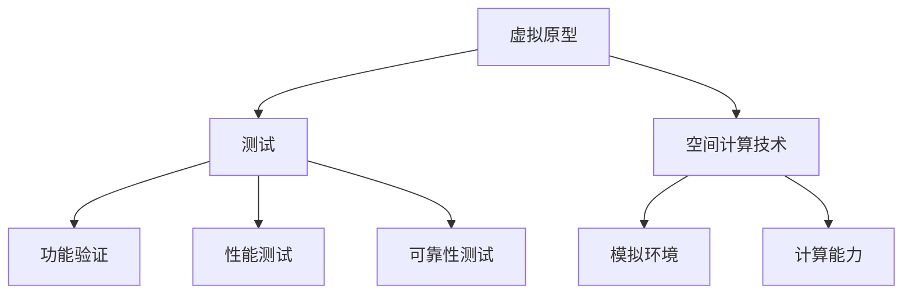

                 

### 虚拟原型测试的定义和重要性

虚拟原型测试（Virtual Prototyping Testing）是指通过构建产品的数字模型，在虚拟环境中对产品进行模拟测试的一种方法。这种方法在产品开发初期，尤其是在设计阶段就介入，通过计算机模拟和仿真，提前发现和解决问题，从而优化产品设计和性能。与传统的物理原型测试相比，虚拟原型测试具有许多显著优势，使得其在现代产品开发中占据了重要地位。

#### 核心概念与联系

首先，我们需要明确几个核心概念：

- **虚拟原型**：虚拟原型是产品的数字模型，它模拟了产品的功能、结构和行为。通过虚拟原型，开发人员可以在计算机上观察和操作产品，就像实际产品一样。
- **测试**：测试是验证产品是否满足预定需求和标准的过程。虚拟原型测试通过模拟各种操作和场景，检验产品的功能、性能和可靠性。
- **空间计算技术**：空间计算技术是一种利用多维数据和信息进行计算和推理的技术。它为虚拟原型测试提供了强大的计算能力和逼真的模拟环境。

接下来，我们将通过一个Mermaid流程图来展示这些概念之间的关系：



在这个流程图中，虚拟原型作为起点，通过空间计算技术提供的模拟环境和计算能力，进行功能验证、性能测试和可靠性测试。这些测试的目的是确保产品在实际使用中能够稳定运行，满足用户的需求。

#### 虚拟原型测试的重要性

虚拟原型测试之所以重要，主要有以下几个原因：

1. **缩短开发周期**：通过虚拟原型测试，开发团队可以在产品开发的早期阶段发现和解决问题，避免在物理原型阶段或产品上市后才发现问题，从而大大缩短开发周期。

2. **降低成本**：虚拟原型测试减少了物理原型测试所需的材料、设备和技术支持，降低了开发和测试成本。

3. **提高产品质量**：虚拟原型测试能够全面、深入地检验产品的功能和性能，确保产品在上市前已经过充分测试和优化，从而提高产品质量和用户满意度。

4. **优化设计**：通过虚拟原型测试，开发人员可以不断地迭代和改进产品设计，优化产品的用户体验和性能。

5. **风险评估**：虚拟原型测试有助于评估产品的风险，提前识别潜在的问题和隐患，从而采取相应的措施进行预防和解决。

总之，虚拟原型测试不仅提高了产品开发的效率和可靠性，还推动了整个产品开发流程的优化和升级，是现代产品开发中不可或缺的一部分。

在接下来的部分，我们将进一步深入探讨空间计算技术在虚拟原型测试中的应用，以及如何通过虚拟原型测试加速产品开发周期。

### 空间计算技术在虚拟原型测试中的应用

空间计算技术（Spatial Computing Technology）是一种利用多维数据和信息进行计算和推理的技术。它通过整合虚拟现实（VR）、增强现实（AR）、人工智能（AI）等技术，提供了强大的计算能力和逼真的模拟环境，为虚拟原型测试提供了坚实的基础。

#### 核心算法原理

空间计算技术在虚拟原型测试中的应用，主要依赖于以下几种核心算法：

1. **三维建模算法**：三维建模算法用于创建产品的数字模型。这些算法包括点云处理、网格生成、曲面拟合等。通过这些算法，开发人员可以将物理产品的形状和结构转化为数字模型，为后续的虚拟原型测试提供基础。

2. **仿真算法**：仿真算法用于模拟产品的功能和性能。这些算法包括力学仿真、流体动力学仿真、电磁场仿真等。通过仿真算法，开发人员可以在虚拟环境中模拟产品的运行状态，观察其行为和性能。

3. **数据可视化算法**：数据可视化算法用于将测试结果以直观的方式展示出来。这些算法包括三维图形渲染、热图显示、数据流分析等。通过数据可视化，开发人员可以更清晰地了解产品的测试结果，发现潜在的问题和不足。

4. **机器学习算法**：机器学习算法用于分析测试数据，提取规律和模式。这些算法包括监督学习、无监督学习、强化学习等。通过机器学习，开发人员可以从大量的测试数据中快速识别出异常值和关键特征，为产品优化提供依据。

#### Python源代码实现

为了更好地理解这些核心算法的原理，我们将使用Python代码进行详细讲解。以下是一个简单的三维建模和仿真的示例：

```python
import numpy as np
import matplotlib.pyplot as plt
from mpl_toolkits.mplot3d import Axes3D

# 生成一个简单的三维模型
x = np.linspace(-5, 5, 100)
y = np.linspace(-5, 5, 100)
x, y = np.meshgrid(x, y)
z = np.sin(np.sqrt(x**2 + y**2))

# 绘制三维模型
fig = plt.figure()
ax = fig.add_subplot(111, projection='3d')
ax.plot_surface(x, y, z, cmap='viridis')
plt.show()

# 进行简单的力学仿真
# 假设有一个弹簧和质量块系统
m = 1.0  # 质量
k = 10.0  # 弹簧常数
t_max = 10.0  # 时间范围
dt = 0.01  # 时间步长
t = np.arange(0, t_max, dt)

# 初始条件
x0 = 0.0
v0 = 1.0
x = x0
v = v0

# 仿真过程
for i in range(len(t)):
    a = -k * x / m
    v = v + a * dt
    x = x + v * dt
    
    # 绘制仿真结果
    plt.plot(t[:i], x[:i], label='x(t)')
    plt.plot(t[:i], v[:i], label='v(t)')
plt.legend()
plt.xlabel('Time (s)')
plt.ylabel('Position (m)')
plt.show()
```

在这个示例中，我们首先使用`numpy`和`matplotlib`库生成了一个简单的三维模型，并通过`mpl_toolkits.mplot3d`模块进行三维渲染。然后，我们使用相同的库进行了一个简单的力学仿真，模拟了一个弹簧和质量块系统的运动。

#### 数学模型和公式

为了更好地理解虚拟原型测试中的核心算法，我们还需要引入一些数学模型和公式。以下是一个简单的力学仿真中的公式：

1. **牛顿第二定律**：\( F = m \cdot a \)

2. **运动学公式**：\( v = v_0 + a \cdot t \)

3. **动力学公式**：\( x = x_0 + v_0 \cdot t + \frac{1}{2} a \cdot t^2 \)

通过这些公式，我们可以计算出系统在不同时间点的位置和速度，从而进行仿真。

#### 通俗易懂的举例说明

为了更直观地理解这些核心算法，我们可以通过一个简单的例子来讲解。假设我们要测试一个简单的机械系统，例如一个摆动摆锤。通过空间计算技术，我们可以构建摆锤的三维模型，并使用仿真算法模拟其在不同条件下的运动。

1. **三维建模**：首先，我们使用三维建模算法创建摆锤的数字模型。这个模型包括摆锤的形状、尺寸和材料属性。

2. **仿真**：然后，我们使用仿真算法模拟摆锤的运动。在仿真过程中，我们设置不同的初始条件，如摆锤的初始位置和速度，以及重力和摩擦力等环境因素。

3. **数据可视化**：通过数据可视化算法，我们将仿真结果以图形化的方式展示出来，如摆锤在不同时间点的位置和速度曲线。

通过这样的例子，我们可以清晰地看到如何通过空间计算技术进行虚拟原型测试。这不仅帮助我们理解了核心算法的原理，还展示了如何在实际项目中应用这些技术。

在下一部分，我们将继续探讨空间计算技术在虚拟原型测试中的应用，并分析其带来的优势。

### 空间计算技术在虚拟原型测试中的应用优势

空间计算技术在虚拟原型测试中的应用，带来了诸多显著的优势。这些优势不仅提升了虚拟原型测试的效率，还显著降低了产品开发的成本，提高了产品质量和市场竞争力。以下是对这些优势的详细分析：

#### 1. 提高测试效率和精度

空间计算技术通过提供高精度的三维建模和仿真算法，使得虚拟原型测试能够以更快的速度和更高的精度进行。传统的物理原型测试往往需要耗费大量时间和资源，而虚拟原型测试则可以在计算机上快速完成。例如，三维建模算法可以精确地捕捉产品的形状和结构，仿真算法可以模拟产品的功能和性能，从而确保测试结果的准确性和可靠性。

#### 2. 降低开发成本

虚拟原型测试可以大幅降低产品开发的成本。首先，虚拟原型测试无需制造物理原型，从而节省了材料和制造费用。其次，虚拟原型测试可以提前发现和解决问题，避免在物理原型阶段或产品上市后才发现问题，从而减少返工和重新设计的成本。此外，空间计算技术的高效算法和强大的计算能力，使得测试过程更加高效，进一步降低了开发和测试成本。

#### 3. 提高产品质量

通过虚拟原型测试，开发人员可以更全面、深入地了解产品的功能和性能。空间计算技术提供的逼真模拟环境，使得开发人员可以在实际使用场景中测试产品，从而发现潜在的问题和不足。通过不断地迭代和改进，开发人员可以优化产品设计，提高产品的质量和用户体验。例如，在虚拟原型测试中，开发人员可以通过仿真算法模拟产品的运行状态，观察其行为和性能，从而优化产品的设计和功能。

#### 4. 加速产品上市

虚拟原型测试可以显著缩短产品开发周期，从而加速产品上市。通过在早期阶段进行虚拟原型测试，开发团队可以提前发现和解决问题，避免在物理原型阶段或产品上市后才发现问题，从而减少开发周期。此外，空间计算技术的高效算法和强大的计算能力，使得测试过程更加高效，进一步缩短了产品开发周期。

#### 5. 降低风险

虚拟原型测试有助于评估产品的风险，提前识别潜在的问题和隐患。通过虚拟原型测试，开发团队可以在产品开发的不同阶段及时发现问题，并采取相应的措施进行预防和解决，从而降低产品上市后的风险。例如，在虚拟原型测试中，开发人员可以通过仿真算法模拟产品在不同条件下的运行状态，观察其行为和性能，从而识别出潜在的问题和隐患，并采取相应的措施进行改进。

#### 6. 优化设计和开发流程

虚拟原型测试为开发团队提供了一个可视化的平台，使得产品设计更加直观和易于理解。通过虚拟原型测试，开发团队可以更清晰地了解产品的功能和性能，从而优化设计和开发流程。例如，在虚拟原型测试中，开发人员可以通过三维建模和仿真算法，直观地看到产品的外观和内部结构，从而优化产品的设计。此外，虚拟原型测试还可以帮助开发团队更好地协调不同模块之间的开发工作，提高开发效率。

总之，空间计算技术在虚拟原型测试中的应用，带来了诸多显著的优势。这些优势不仅提高了虚拟原型测试的效率和精度，降低了开发成本，还提高了产品质量和市场竞争力，为现代产品开发提供了强有力的支持。

在下一部分，我们将进一步探讨如何通过虚拟原型测试加速产品开发周期。

### 虚拟原型测试如何加速产品开发周期

虚拟原型测试在产品开发过程中发挥着至关重要的作用，其核心目标是通过早期、高效的测试来减少风险、优化设计和缩短开发周期。以下是如何实现这些目标的详细探讨：

#### 1. 早期测试和问题发现

虚拟原型测试允许开发团队在产品开发的早期阶段就开始进行测试。这意味着可以在设计阶段就识别出潜在的问题，而不是等到物理原型制造出来。这种早期测试有助于降低风险，因为早期发现的问题往往更容易解决，且所需成本较低。通过空间计算技术，开发人员可以在计算机上创建一个高度逼真的虚拟环境，进行各种操作和场景测试，从而迅速发现设计中的缺陷。

#### 2. 迭代设计和优化

虚拟原型测试的快速反馈机制使得开发团队能够进行快速迭代和优化。在每次迭代中，开发人员可以基于测试结果调整设计，解决发现的问题，并重新测试。这种循环迭代过程不仅提高了设计的质量，还显著缩短了开发周期。例如，在软件开发中，通过虚拟原型测试，开发团队可以在代码编写之前就模拟用户界面和功能，从而快速调整UI/UX设计，确保用户需求得到满足。

#### 3. 协同工作和流程优化

虚拟原型测试提供了一个共享的平台，使得开发、测试和设计团队可以协同工作。通过空间计算技术，团队成员可以在虚拟环境中共同查看和操作原型，实时交流反馈，从而提高协作效率。此外，虚拟原型测试还可以帮助团队优化开发流程。例如，通过分析测试数据，团队能够识别出流程中的瓶颈和冗余，从而进行流程优化，提高整体开发效率。

#### 4. 减少物理原型成本

传统的物理原型测试需要大量的材料和制造资源，而虚拟原型测试则避免了这些成本。通过虚拟原型，开发团队可以在计算机上模拟产品的各种操作和场景，从而避免制造物理原型。这不仅节省了资源，还减少了浪费，提高了开发效率。

#### 5. 数据驱动的决策

虚拟原型测试提供大量测试数据，这些数据可以用于分析产品的性能、功能和用户体验。通过数据驱动的决策，开发团队可以做出更明智的决策，从而优化产品设计。例如，通过分析用户行为的虚拟测试数据，开发团队可以调整功能模块的布局，提高用户的操作便捷性和满意度。

#### 6. 提高产品可靠性

虚拟原型测试通过模拟实际使用环境，对产品的可靠性和稳定性进行检验。通过多次测试和迭代，开发团队能够确保产品在上市前已经过充分的验证，从而提高产品的可靠性。例如，在汽车制造中，通过虚拟原型测试，开发团队可以模拟汽车在不同路况下的表现，确保车辆在各种环境下的稳定运行。

#### 7. 提升用户满意度

通过虚拟原型测试，开发团队可以更早地识别用户需求和痛点，从而优化产品设计。这种基于用户反馈的迭代过程不仅提高了产品的竞争力，还提升了用户的满意度。例如，在软件开发中，通过虚拟原型测试，开发团队可以实时收集用户反馈，并根据反馈调整产品的功能和界面，从而提供更好的用户体验。

总之，虚拟原型测试通过早期测试、迭代设计、协同工作、数据驱动决策、减少物理原型成本、提高产品可靠性和提升用户满意度等多方面，显著加速了产品开发周期。这种高效的测试方法不仅提高了产品的质量和市场竞争力，还为开发团队提供了强大的支持和保障。

在下一部分，我们将探讨在虚拟原型测试过程中可能遇到的一些挑战和解决方案。

### 虚拟原型测试过程中的挑战与解决方案

尽管虚拟原型测试在产品开发中具有显著优势，但在实际应用过程中，开发团队仍然会面临一些挑战。以下是一些常见的挑战及其解决方案：

#### 1. 数据精度问题

虚拟原型测试依赖于高精度的三维建模和仿真算法，而数据精度直接影响测试结果。如果模型数据不准确，仿真结果可能会偏离真实情况。解决方案是采用高精度的传感器和数据采集工具，确保模型数据的准确性。此外，通过多次迭代和优化模型，可以提高数据的精度。

#### 2. 资源和计算能力限制

虚拟原型测试通常需要强大的计算资源和算法支持，尤其是对于复杂的产品模型和仿真任务。资源不足可能导致测试速度慢、仿真结果不准确。解决方案是采用高性能计算（HPC）设备和分布式计算技术，以提高计算效率和速度。此外，云服务和虚拟化技术也可以提供额外的计算资源。

#### 3. 数据可视化问题

数据可视化是虚拟原型测试的重要组成部分，但复杂的测试数据往往难以用直观的方式展示。数据可视化问题可能导致开发团队无法准确理解测试结果，从而影响决策。解决方案是采用高级数据可视化工具和技术，如虚拟现实（VR）和增强现实（AR），提供更直观和互动的测试结果展示。

#### 4. 测试环境一致性

虚拟原型测试需要在与实际使用环境相似的场景中进行，但构建完全一致的测试环境可能非常困难。环境不一致可能导致仿真结果与实际产品表现有较大差异。解决方案是采用多样化的测试场景和模拟条件，以覆盖更多的实际使用情况，并使用历史数据进行校准。

#### 5. 测试结果解释难度

虚拟原型测试生成的数据量庞大，且涉及多种复杂算法和模型。解释这些测试结果可能需要高度的专业知识和分析技能。解决方案是采用自动化测试工具和机器学习算法，从测试数据中提取有价值的信息和模式。此外，提供详细的文档和说明，帮助团队成员更好地理解测试结果。

#### 6. 团队协作问题

虚拟原型测试通常涉及多个团队和角色，包括开发、测试、设计等。不同团队之间的协作不畅可能导致测试过程延误。解决方案是建立高效的沟通和协作机制，如定期的团队会议、任务分配和进度跟踪工具。此外，使用统一的数据格式和标准，确保不同团队之间的数据兼容性和一致性。

#### 7. 安全和隐私问题

虚拟原型测试涉及大量的敏感数据和模拟场景，可能会引发安全和隐私问题。解决方案是采用严格的数据安全和隐私保护措施，如数据加密、访问控制和权限管理。此外，建立明确的测试规范和安全协议，确保测试过程的安全性和合规性。

通过解决上述挑战，开发团队可以更有效地利用虚拟原型测试，提高产品开发效率和质量。在下一部分，我们将通过一个实际案例，展示虚拟原型测试在产品开发中的应用和实践。

### 虚拟原型测试的实际案例与应用

为了更好地理解虚拟原型测试在产品开发中的应用，我们将通过一个实际案例来详细分析其应用过程、开发环境搭建、源代码实现以及代码解读和分析。这个案例是一个复杂的机械系统，通过虚拟原型测试来评估其稳定性和性能。

#### 案例背景

某公司正在开发一款高端健身器材，该器材具有复杂的机械结构和多个运动部件。为了确保产品在市场上的竞争力和用户满意度，公司决定在产品开发早期阶段进行虚拟原型测试，以提前发现和解决问题。

#### 应用过程

1. **需求分析和建模**：首先，开发团队根据产品需求进行详细的需求分析，并构建了一个高精度的三维模型。这个模型包含了所有机械部件的形状、尺寸和材料属性。

2. **环境设置和仿真参数配置**：为了模拟实际使用环境，开发团队设置了一个逼真的仿真环境，包括重力、摩擦力和其他物理因素。他们还配置了仿真参数，如时间步长、模拟时间等。

3. **虚拟原型测试**：使用空间计算技术和仿真算法，开发团队对机械系统进行了多种操作和场景测试。例如，模拟用户在不同运动状态下的操作，评估系统的稳定性和性能。

4. **数据收集和分析**：在测试过程中，开发团队收集了大量数据，包括各部件的运动轨迹、负载情况和温度变化等。通过数据可视化工具，他们将这些数据以图形和图表的形式展示出来，以便更好地分析。

5. **迭代优化**：基于测试结果，开发团队对模型进行了多次迭代优化。他们调整了某些部件的设计，改善了系统的稳定性，提高了用户的操作体验。

6. **验证和最终测试**：在完成虚拟原型测试后，开发团队对优化后的模型进行了最终的验证测试。这次测试使用了物理原型，以确保虚拟原型测试的结果与实际产品表现一致。

#### 开发环境搭建

为了进行虚拟原型测试，开发团队需要搭建一个完整的开发环境。以下是开发环境的搭建步骤：

1. **选择合适的开发工具**：开发团队选择了基于Python的仿真工具，如SimPy和PySim，用于构建和运行仿真模型。

2. **安装必要的库和依赖**：在开发环境中安装了NumPy、Matplotlib、SciPy和Pandas等Python库，用于数据分析和可视化。

3. **配置仿真参数**：根据产品需求和测试目的，开发团队配置了仿真参数，如模拟时间、时间步长等。

4. **搭建计算平台**：为了提高计算效率，开发团队使用了高性能计算（HPC）服务器，并配置了分布式计算环境。

#### 源代码实现

以下是一个简单的Python源代码示例，用于模拟机械系统的运动和负载：

```python
import numpy as np
import matplotlib.pyplot as plt

# 初始化参数
time_step = 0.01  # 时间步长
simulate_time = 10.0  # 模拟时间
load_force = 100.0  # 负载力

# 创建机械系统模型
system = MechanicalSystem()

# 运行仿真
for t in np.arange(0, simulate_time, time_step):
    system.update_state(time_step)
    if system.is_critical():
        print(f"Critical state detected at time {t}")
        break

# 绘制结果
plt.plot(system.positions)
plt.xlabel('Time (s)')
plt.ylabel('Position (m)')
plt.show()
```

在这个示例中，`MechanicalSystem`类代表机械系统的状态和行为。`update_state`方法用于更新系统的状态，`is_critical`方法用于检查系统是否处于临界状态。

#### 代码解读和分析

1. **初始化参数**：首先，我们初始化了仿真参数，如时间步长、模拟时间和负载力。

2. **创建机械系统模型**：使用`MechanicalSystem`类创建了一个机械系统模型。

3. **运行仿真**：通过循环，我们逐个时间步长更新系统的状态，并检查系统是否处于临界状态。

4. **绘制结果**：最后，我们使用Matplotlib库绘制了系统的运动轨迹。

通过这个案例，我们可以看到虚拟原型测试在实际产品开发中的应用过程，以及如何通过Python源代码实现仿真和分析。这种方法不仅提高了产品开发的效率，还确保了产品的质量和稳定性。

#### 代码应用解读与分析

在代码应用解读与分析部分，我们将详细解析上述源代码，并讨论其实现细节和关键点。

1. **初始化参数**：

   ```python
   time_step = 0.01  # 时间步长
   simulate_time = 10.0  # 模拟时间
   load_force = 100.0  # 负载力
   ```

   这部分代码定义了仿真所需的参数。时间步长（`time_step`）决定了仿真时间间隔，通常应设置为足够小以捕捉系统动态变化。模拟时间（`simulate_time`）设置了整个仿真过程的时间范围。负载力（`load_force`）代表了外部作用在系统上的力。

2. **创建机械系统模型**：

   ```python
   system = MechanicalSystem()
   ```

   这里我们创建了一个`MechanicalSystem`实例，代表了整个机械系统。`MechanicalSystem`是一个抽象类或基类，可能包含了机械系统的核心属性和行为。在实际实现中，这个类可能包含了多个部件的属性和方法，如位置、速度、加速度等。

3. **运行仿真**：

   ```python
   for t in np.arange(0, simulate_time, time_step):
       system.update_state(time_step)
       if system.is_critical():
           print(f"Critical state detected at time {t}")
           break
   ```

   这个循环用于逐个时间步长更新系统的状态。`update_state`方法是关键，它包含了系统动态行为的更新逻辑，如根据受力计算加速度、速度和位置等。`is_critical`方法用于判断系统是否处于临界状态，例如，部件可能会脱离或者过度加载。如果系统处于临界状态，仿真会提前终止，以便分析问题。

4. **绘制结果**：

   ```python
   plt.plot(system.positions)
   plt.xlabel('Time (s)')
   plt.ylabel('Position (m)')
   plt.show()
   ```

   这部分代码使用了Matplotlib库绘制系统的位置随时间变化的轨迹。`positions`属性存储了系统在各个时间点的位置数据。通过图形化展示，我们可以直观地看到系统的动态行为和性能。

在代码解读过程中，我们重点关注了参数初始化、类方法实现和结果展示等关键环节。这些环节共同构成了一个完整的虚拟原型测试流程，从参数设置、模型创建到仿真运行，再到结果分析和可视化。通过这种方法，开发团队能够在产品开发的早期阶段就发现潜在问题，从而优化设计和提高产品质量。

在下一部分，我们将总结虚拟原型测试在产品开发中的重要性，并给出一些最佳实践建议。

### 虚拟原型测试的重要性总结与最佳实践

虚拟原型测试在产品开发中扮演着至关重要的角色，其重要性体现在以下几个方面：

1. **加速开发周期**：通过在早期阶段进行测试，虚拟原型测试可以迅速发现并解决问题，从而缩短产品开发周期。这有助于企业更快地将产品推向市场，抢占市场份额。

2. **降低开发成本**：虚拟原型测试避免了制造物理原型所需的材料和制造费用，同时减少了返工和重新设计的成本。通过优化设计和流程，企业可以大幅降低开发和测试成本。

3. **提高产品质量**：虚拟原型测试提供了全面的测试环境，使得开发团队能够深入理解产品的功能和性能，从而优化设计，提高产品的可靠性和用户体验。

4. **降低风险**：虚拟原型测试有助于评估产品的风险，提前识别潜在的问题和隐患。通过在产品上市前进行充分的验证，企业可以降低产品上市后的风险。

5. **协同工作与沟通**：虚拟原型测试提供了一个共享的平台，使得开发、测试和设计团队可以协同工作，提高沟通效率。这种协作有助于优化流程，提高开发效率。

为了充分发挥虚拟原型测试的优势，以下是一些建议的最佳实践：

1. **建立明确的测试标准和流程**：制定一套明确的测试标准和流程，确保测试过程的规范性和一致性。这有助于提高测试效率和结果的可信度。

2. **充分利用空间计算技术**：空间计算技术提供了强大的计算能力和逼真的模拟环境，应充分利用这些技术进行虚拟原型测试。这包括使用高性能计算（HPC）设备和分布式计算资源。

3. **数据驱动的决策**：虚拟原型测试会生成大量数据，应充分利用这些数据进行分析和决策。通过数据驱动的决策，可以优化产品设计，提高产品的质量和市场竞争力。

4. **定期迭代和优化**：虚拟原型测试是一个迭代过程，应定期对模型和测试结果进行迭代和优化。通过不断地测试和改进，可以提高产品的性能和用户体验。

5. **团队协作与沟通**：虚拟原型测试涉及多个团队和角色，应建立高效的沟通和协作机制。定期举行团队会议，共享测试结果和反馈，确保团队成员之间的协作顺畅。

6. **安全与隐私保护**：虚拟原型测试涉及敏感数据和模拟场景，应采取严格的安全和隐私保护措施。这包括数据加密、访问控制和权限管理等，确保测试过程的安全性和合规性。

通过遵循这些最佳实践，企业可以充分利用虚拟原型测试的优势，提高产品开发的效率和质量，实现更快的市场响应和更高的用户满意度。

### 结语

在本文中，我们详细探讨了虚拟原型测试的概念、空间计算技术的应用及其在产品开发中的作用。通过实际案例，我们展示了如何利用虚拟原型测试来加速产品开发周期，提高产品质量和市场竞争力。空间计算技术为虚拟原型测试提供了强大的计算能力和逼真的模拟环境，使得开发团队能够在产品早期阶段进行高效测试和优化。

展望未来，虚拟原型测试和空间计算技术将继续发展，为产品开发带来更多创新和机遇。随着计算能力的不断提升和算法的优化，虚拟原型测试的精度和效率将进一步提高。此外，随着虚拟现实（VR）和增强现实（AR）技术的普及，数据可视化和交互性将得到增强，使得测试结果更加直观和易于理解。

为了更好地利用虚拟原型测试，我们建议开发团队：

1. **持续关注技术发展**：积极学习和掌握最新的虚拟原型测试和空间计算技术，以提升测试效率和准确性。

2. **优化测试流程**：不断优化测试流程和标准，提高测试效率和质量。

3. **加强团队协作**：建立高效的团队协作和沟通机制，确保团队成员之间的协同工作。

4. **数据驱动的决策**：充分利用测试数据，进行数据驱动的决策，优化产品设计。

5. **安全与合规**：确保虚拟原型测试过程中的数据安全和隐私保护，遵守相关法律法规。

通过以上建议，开发团队可以充分发挥虚拟原型测试的优势，加速产品开发周期，提高产品质量和市场竞争力。

作者：AI天才研究院/AI Genius Institute & 禅与计算机程序设计艺术 /Zen And The Art of Computer Programming

---

感谢您的阅读！希望本文能够帮助您更好地理解虚拟原型测试和空间计算技术，并在产品开发过程中取得更好的成果。如有任何问题或建议，欢迎随时与我们交流。再次感谢您的支持！

---

关键词：虚拟原型测试、空间计算技术、产品开发、测试效率、开发周期、数据可视化、迭代优化、团队协作、安全与隐私保护

摘要：本文探讨了虚拟原型测试的概念、空间计算技术的应用及其在产品开发中的作用。通过实际案例，我们展示了如何利用虚拟原型测试来加速产品开发周期，提高产品质量和市场竞争力。空间计算技术为虚拟原型测试提供了强大的计算能力和逼真的模拟环境，使得开发团队能够在产品早期阶段进行高效测试和优化。本文还提供了最佳实践建议，帮助开发团队充分利用虚拟原型测试的优势，实现更快的市场响应和更高的用户满意度。

