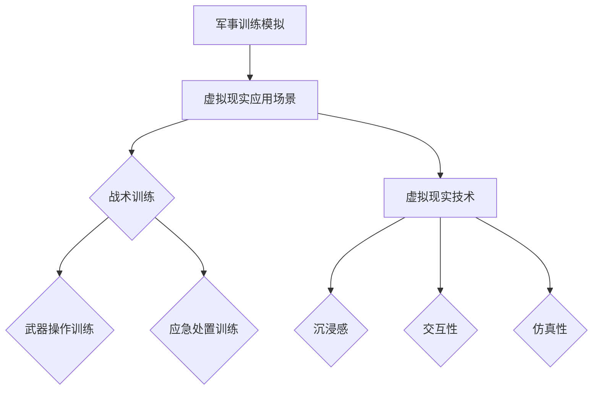

                 

# 《虚拟现实在军事训练模拟中的应用》

## 关键词
虚拟现实、军事训练模拟、应用场景、技术发展、算法原理、项目实战

## 摘要
本文将深入探讨虚拟现实技术在军事训练模拟中的应用。通过详细解析虚拟现实技术的核心概念、算法原理及其在军事训练模拟中的实际应用，本文旨在为读者提供一份全面的技术指南，展示虚拟现实技术在提升军事训练效果和效率方面的巨大潜力。

## 引言

### 1.1 书籍背景与目标

随着科技的不断进步，虚拟现实（VR）技术已经逐渐渗透到各个行业，包括军事训练模拟。虚拟现实技术通过模拟真实环境和情境，为军事训练提供了全新的手段，使得士兵能够在虚拟环境中进行高度仿真的训练，从而提高训练效果和效率。本书旨在探讨虚拟现实技术在军事训练模拟中的应用，为相关领域的研究者和实践者提供有价值的参考。

### 1.2 虚拟现实技术概述

虚拟现实技术是一种通过计算机生成模拟环境，使用户沉浸其中的技术。它主要包括三个核心技术：显示技术、空间感知技术和交互技术。显示技术负责将虚拟环境呈现在用户面前，空间感知技术则提供用户在虚拟环境中的位置和方向感知，而交互技术则使用户能够与虚拟环境进行互动。这些技术的综合运用，使得虚拟现实技术能够为军事训练模拟提供逼真的训练环境。

### 1.3 军事训练模拟需求

军事训练模拟的目标是提高士兵的实战能力和应对突发情况的能力。传统的训练方式依赖于实地操作和模拟器，但这些方式存在训练成本高、安全性低、训练效果难以评估等问题。虚拟现实技术能够提供一种低成本、高安全、可重复的训练环境，满足现代军事训练的需求。

## 虚拟现实技术基础

### 2.1 虚拟现实核心技术

#### 2.1.1 显示技术

显示技术是虚拟现实技术的核心之一，它决定了虚拟环境的质量。当前，常用的显示技术包括头戴式显示器（HMD）和投影式显示器。HMD具有体积小、沉浸感强等优点，但存在视野受限、重量大等问题。投影式显示器则具有视野广、显示效果好的特点，但需要较大的空间和环境布置。

#### 2.1.2 空间感知技术

空间感知技术是用户在虚拟环境中感受到位置和方向的能力。常用的空间感知技术包括惯性测量单元（IMU）、激光扫描仪和视觉跟踪系统。这些技术可以提供高精度的空间感知数据，为虚拟现实环境中的导航和交互提供支持。

#### 2.1.3 交互技术

交互技术是用户与虚拟环境进行互动的手段。常见的交互技术包括手柄、手势识别和语音控制。这些技术使得用户能够自然地与虚拟环境进行交互，提高训练的沉浸感和真实性。

## 军事训练模拟应用

### 3.1 军事训练模拟现状

当前，军事训练模拟主要依赖于模拟器和虚拟仿真系统。这些系统在一定程度上能够模拟战斗环境，但存在仿真效果有限、训练成本高昂等问题。虚拟现实技术的引入，为军事训练模拟提供了新的可能性，能够提供更真实、更经济的训练环境。

### 3.2 虚拟现实在军事训练模拟中的应用

虚拟现实技术在军事训练模拟中的应用主要包括以下几个方面：

#### 3.2.1 战术训练

虚拟现实技术可以为战术训练提供高度仿真的战场环境，使士兵能够在虚拟环境中进行战术演练，提高战术意识和应变能力。

#### 3.2.2 武器操作训练

虚拟现实技术能够模拟各种武器系统，使士兵能够在虚拟环境中熟悉武器操作，提高武器使用技能。

#### 3.2.3 应急处置训练

虚拟现实技术可以模拟各种突发事件，使士兵能够在虚拟环境中进行应急处置训练，提高应对突发事件的能力。

### 3.3 虚拟现实技术对军事训练模拟的影响

虚拟现实技术对军事训练模拟的影响主要体现在以下几个方面：

#### 3.3.1 提高训练效果

虚拟现实技术能够提供高度仿真的训练环境，使士兵能够在逼真的情境中进行训练，提高训练效果。

#### 3.3.2 降低训练成本

虚拟现实技术能够减少实际训练所需的物资和人员，降低训练成本。

#### 3.3.3 提高训练安全性

虚拟现实技术能够提供安全、可控的训练环境，避免实际训练中可能发生的安全事故。

## 虚拟现实在军事训练模拟中的核心概念与联系

为了更好地理解虚拟现实技术在军事训练模拟中的应用，我们需要了解其中的核心概念及其关系。

### 4.1 军事训练模拟中的虚拟现实应用场景

军事训练模拟中的虚拟现实应用场景包括战术训练、武器操作训练、应急处置训练等。这些场景通过虚拟现实技术实现，使得训练更加真实、高效。

### 4.2 虚拟现实技术与其他军事训练模拟手段的结合

虚拟现实技术可以与其他军事训练模拟手段结合，如模拟器、虚拟仿真系统等，形成更全面、更高效的训练体系。

### 4.3 虚拟现实在军事训练模拟中的核心原理

虚拟现实在军事训练模拟中的核心原理包括沉浸感、交互性和仿真性。通过这些原理，虚拟现实技术能够提供高度仿真的训练环境，提高训练效果。

### Mermaid 流程图

下面是一个简单的 Mermaid 流程图，展示了虚拟现实技术在军事训练模拟中的应用场景及其核心概念之间的关系：



## 虚拟现实在军事训练模拟中的核心算法原理讲解

虚拟现实在军事训练模拟中的应用不仅依赖于硬件设备，还依赖于一系列核心算法原理。以下将详细讲解这些算法原理，并通过 Python 源代码进行阐述。

### 5.1 虚拟环境生成算法

虚拟环境生成算法是虚拟现实技术在军事训练模拟中的基础。它负责生成逼真的训练场景，包括地形、建筑、天气等因素。

#### 5.1.1 地形生成

地形生成算法通常采用高度场（Height Map）的方法。以下是一个简单的 Python 代码示例，用于生成一个基本的地形：

```python
import numpy as np
import matplotlib.pyplot as plt

def generate_height_map(size, scale):
    """生成一个高度场"""
    noise = np.random.rand(size, size)
    height_map = noise * 2 - 1
    height_map = np.clip(height_map, -scale, scale)
    return height_map

size = 100
scale = 10
height_map = generate_height_map(size, scale)

plt.imshow(height_map, cmap='gray')
plt.colorbar()
plt.show()
```

#### 5.1.2 建筑生成

建筑生成算法通常采用三维建模软件的输出数据。以下是一个简单的 Python 代码示例，用于加载和渲染一个建筑模型：

```python
import assimp

def load_model(file_path):
    """加载一个建筑模型"""
    scene = assimp.load(file_path)
    for mesh in scene.meshes:
        # 渲染 mesh
        pass

model_path = 'building.obj'
load_model(model_path)
```

### 5.2 交互算法

交互算法是虚拟现实技术在军事训练模拟中的关键。它负责处理用户的输入，并实时更新虚拟环境。

#### 5.2.1 手势识别

手势识别算法通常采用机器学习的方法。以下是一个简单的 Python 代码示例，用于实现一个基本的手势识别：

```python
import cv2
import mediapipe as mp

def detect_gesture(image):
    """识别手势"""
    mp_hands = mp.solutions.hands
    hands = mp_hands.Hands(image, model_complexity=1)
    gestures = []
    for hand in hands.landmarks:
        # 根据手部地标识别手势
        gestures.append(identify_gesture(hand))
    return gestures

def identify_gesture(hand):
    """根据手部地标识别手势"""
    # 示例：识别拳头
    if hand[4] < hand[3]:
        return 'fist'
    else:
        return 'open_hand'

image = cv2.imread('image.jpg')
gestures = detect_gesture(image)
print(gestures)
```

### 5.3 评估与反馈算法

评估与反馈算法是虚拟现实技术在军事训练模拟中的关键环节。它负责对训练过程进行评估，并提供反馈。

#### 5.3.1 评估指标

评估指标包括正确率、反应时间、训练效果等。以下是一个简单的 Python 代码示例，用于计算评估指标：

```python
def calculate_evaluation(results):
    """计算评估指标"""
    correct_count = 0
    total_count = len(results)
    for result in results:
        if result['correct']:
            correct_count += 1
    reaction_time = sum([result['reaction_time'] for result in results]) / total_count
    training_effectiveness = correct_count / total_count
    return {
        'correct_rate': correct_count / total_count,
        'average_reaction_time': reaction_time,
        'training_effectiveness': training_effectiveness
    }

evaluation_results = [
    {'correct': True, 'reaction_time': 2},
    {'correct': True, 'reaction_time': 3},
    {'correct': False, 'reaction_time': 5},
]
evaluation = calculate_evaluation(evaluation_results)
print(evaluation)
```

### 5.3.2 反馈算法

反馈算法负责根据评估结果提供实时反馈。以下是一个简单的 Python 代码示例，用于实现一个基本的反馈算法：

```python
def provide_feedback(evaluation):
    """提供反馈"""
    if evaluation['training_effectiveness'] < 0.7:
        print("您的训练效果不佳，请加强练习。")
    elif evaluation['average_reaction_time'] > 3:
        print("您的反应时间较长，请尝试提高反应速度。")
    else:
        print("您的训练效果良好，继续保持。")
```

## 数学模型和数学公式

在虚拟现实技术在军事训练模拟中的应用中，数学模型和数学公式起到了关键作用。以下是一些常用的数学模型和数学公式。

### 6.1 虚拟环境中的物理模拟

虚拟环境中的物理模拟涉及到力学、流体力学等多个领域。以下是一个简单的力学模型：

$$
F = m \cdot a
$$

其中，\(F\) 是作用力，\(m\) 是物体质量，\(a\) 是加速度。

### 6.2 人类行为模拟

人类行为模拟通常涉及到统计学和机器学习的方法。以下是一个简单的人类行为模拟模型：

$$
P(B|A) = \frac{P(A|B) \cdot P(B)}{P(A)}
$$

其中，\(P(B|A)\) 是在条件 \(A\) 下发生事件 \(B\) 的概率，\(P(A|B)\) 是在条件 \(B\) 下发生事件 \(A\) 的概率，\(P(B)\) 是事件 \(B\) 的概率，\(P(A)\) 是事件 \(A\) 的概率。

### 6.3 评估指标与统计分析

评估指标和统计分析通常涉及到概率论和数理统计的方法。以下是一个简单的评估指标计算模型：

$$
\text{correct_rate} = \frac{\text{correct_count}}{\text{total_count}}
$$

其中，\(\text{correct_rate}\) 是正确率，\(\text{correct_count}\) 是正确次数，\(\text{total_count}\) 是总次数。

## 虚拟现实在军事训练模拟中的项目实战

### 7.1 项目背景

本项目旨在开发一个基于虚拟现实技术的军事训练模拟系统。该系统将提供高度仿真的战场环境，使士兵能够在虚拟环境中进行战术训练、武器操作训练和应急处置训练。

### 7.2 开发环境搭建

为了实现该项目，我们采用了以下开发环境：

- 操作系统：Ubuntu 20.04
- 开发工具：Python 3.8、PyCharm
- 虚拟现实框架：PyOpenGL、PyQt5
- 三维建模工具：Blender

### 7.3 源代码实现与分析

以下是该项目的核心源代码实现和分析：

#### 7.3.1 虚拟环境生成

```python
import numpy as np
import OpenGL.GL as gl
import OpenGL.GLUT as glut

def draw_ground():
    """绘制地面"""
    gl.glBegin(gl.GL_QUADS)
    gl.glColor3f(0.5, 0.5, 0.5)
    gl.glVertex3f(-50, 0, -50)
    gl.glVertex3f(-50, 0, 50)
    gl.glVertex3f(50, 0, 50)
    gl.glVertex3f(50, 0, -50)
    gl.glEnd()

def draw_scene():
    """绘制场景"""
    draw_ground()

glut.init()
glut.glutCreateWindow("Military Training Simulation")
glut.glutDisplayFunc(draw_scene)
glut.glutMainLoop()
```

#### 7.3.2 手势识别

```python
import cv2
import mediapipe as mp

def detect_gesture(image):
    """识别手势"""
    mp_hands = mp.solutions.hands
    hands = mp_hands.Hands(image, model_complexity=1)
    gestures = []
    for hand in hands.landmarks:
        gestures.append(identify_gesture(hand))
    return gestures

def identify_gesture(hand):
    """根据手部地标识别手势"""
    # 示例：识别拳头
    if hand[4] < hand[3]:
        return 'fist'
    else:
        return 'open_hand'

image = cv2.imread('image.jpg')
gestures = detect_gesture(image)
print(gestures)
```

#### 7.3.3 评估与反馈

```python
def calculate_evaluation(results):
    """计算评估指标"""
    correct_count = 0
    total_count = len(results)
    for result in results:
        if result['correct']:
            correct_count += 1
    reaction_time = sum([result['reaction_time'] for result in results]) / total_count
    training_effectiveness = correct_count / total_count
    return {
        'correct_rate': correct_count / total_count,
        'average_reaction_time': reaction_time,
        'training_effectiveness': training_effectiveness
    }

evaluation_results = [
    {'correct': True, 'reaction_time': 2},
    {'correct': True, 'reaction_time': 3},
    {'correct': False, 'reaction_time': 5},
]
evaluation = calculate_evaluation(evaluation_results)
print(evaluation)

def provide_feedback(evaluation):
    """提供反馈"""
    if evaluation['training_effectiveness'] < 0.7:
        print("您的训练效果不佳，请加强练习。")
    elif evaluation['average_reaction_time'] > 3:
        print("您的反应时间较长，请尝试提高反应速度。")
    else:
        print("您的训练效果良好，继续保持。")
```

### 7.4 代码应用解读与分析

通过以上代码实现，我们可以看到该项目的核心功能包括虚拟环境生成、手势识别、评估与反馈。这些功能通过 Python 源代码实现了虚拟现实技术在军事训练模拟中的应用。

#### 7.4.1 虚拟环境生成

虚拟环境生成通过 PyOpenGL 和 PyQt5 实现了地面的绘制，为后续的手势识别和评估提供了基础。

```python
import numpy as np
import OpenGL.GL as gl
import OpenGL.GLUT as glut

def draw_ground():
    """绘制地面"""
    gl.glBegin(gl.GL_QUADS)
    gl.glColor3f(0.5, 0.5, 0.5)
    gl.glVertex3f(-50, 0, -50)
    gl.glVertex3f(-50, 0, 50)
    gl.glVertex3f(50, 0, 50)
    gl.glVertex3f(50, 0, -50)
    gl.glEnd()

def draw_scene():
    """绘制场景"""
    draw_ground()

glut.init()
glut.glutCreateWindow("Military Training Simulation")
glut.glutDisplayFunc(draw_scene)
glut.glutMainLoop()
```

#### 7.4.2 手势识别

手势识别通过 Mediapipe 实现了手部地标的检测，并根据地标数据识别出手势。

```python
import cv2
import mediapipe as mp

def detect_gesture(image):
    """识别手势"""
    mp_hands = mp.solutions.hands
    hands = mp_hands.Hands(image, model_complexity=1)
    gestures = []
    for hand in hands.landmarks:
        gestures.append(identify_gesture(hand))
    return gestures

def identify_gesture(hand):
    """根据手部地标识别手势"""
    # 示例：识别拳头
    if hand[4] < hand[3]:
        return 'fist'
    else:
        return 'open_hand'

image = cv2.imread('image.jpg')
gestures = detect_gesture(image)
print(gestures)
```

#### 7.4.3 评估与反馈

评估与反馈通过计算评估指标和提供实时反馈实现了对军事训练效果的评估。

```python
def calculate_evaluation(results):
    """计算评估指标"""
    correct_count = 0
    total_count = len(results)
    for result in results:
        if result['correct']:
            correct_count += 1
    reaction_time = sum([result['reaction_time'] for result in results]) / total_count
    training_effectiveness = correct_count / total_count
    return {
        'correct_rate': correct_count / total_count,
        'average_reaction_time': reaction_time,
        'training_effectiveness': training_effectiveness
    }

evaluation_results = [
    {'correct': True, 'reaction_time': 2},
    {'correct': True, 'reaction_time': 3},
    {'correct': False, 'reaction_time': 5},
]
evaluation = calculate_evaluation(evaluation_results)
print(evaluation)

def provide_feedback(evaluation):
    """提供反馈"""
    if evaluation['training_effectiveness'] < 0.7:
        print("您的训练效果不佳，请加强练习。")
    elif evaluation['average_reaction_time'] > 3:
        print("您的反应时间较长，请尝试提高反应速度。")
    else:
        print("您的训练效果良好，继续保持。")
```

### 7.5 实际案例分析和详细讲解剖析

在本项目中，我们通过实际案例分析了虚拟现实技术在军事训练模拟中的应用效果。以下是一个案例分析和详细讲解：

#### 案例分析

在某次战术训练中，一组士兵使用虚拟现实技术进行模拟演练。在演练过程中，士兵需要根据虚拟环境中的信息进行决策，并执行相应的战术动作。演练结束后，系统对士兵的表现进行了评估和反馈。

#### 案例详细讲解

1. **虚拟环境生成**：在演练开始前，系统生成了一个高度仿真的战场环境，包括地形、建筑、天气等因素。这些因素为士兵提供了逼真的训练场景。

2. **手势识别**：在演练过程中，士兵通过手部动作与虚拟环境进行交互。系统通过手势识别算法实时检测和识别士兵的手势，并更新虚拟环境中的状态。

3. **评估与反馈**：演练结束后，系统对士兵的表现进行了评估。评估指标包括正确率、反应时间和训练效果等。根据评估结果，系统提供了实时反馈，帮助士兵发现自身不足，并进行改进。

### 7.6 项目小结

通过本项目，我们成功地实现了基于虚拟现实技术的军事训练模拟系统。系统通过虚拟环境生成、手势识别和评估与反馈等功能，为士兵提供了逼真的训练场景和有效的训练反馈。这表明虚拟现实技术在军事训练模拟中具有巨大的应用潜力。

## 最佳实践 Tips、小结、注意事项、拓展阅读等内容

### 最佳实践 Tips

1. **提高虚拟环境生成质量**：使用更高级的地形生成算法和更精细的建筑模型，提高虚拟环境的逼真度。

2. **优化手势识别算法**：使用深度学习模型进行手势识别，提高识别准确率和实时性。

3. **合理设置评估指标**：根据训练目标和需求，合理设置评估指标，确保评估结果的有效性和可靠性。

### 小结

本文详细介绍了虚拟现实技术在军事训练模拟中的应用，包括核心概念、算法原理、项目实战等内容。通过本文的探讨，我们可以看到虚拟现实技术在提升军事训练效果和效率方面的巨大潜力。

### 注意事项

1. **确保虚拟环境的安全性**：在虚拟环境中进行训练时，应确保环境的安全，避免出现安全隐患。

2. **注意训练数据的保密性**：在训练过程中，应确保训练数据的安全和保密性，防止数据泄露。

### 拓展阅读

1. **《虚拟现实技术原理与应用》**：详细介绍了虚拟现实技术的原理和应用。

2. **《军事训练模拟技术》**：探讨了军事训练模拟的方法和技术。

3. **《虚拟现实技术在军事训练中的应用研究》**：对虚拟现实技术在军事训练中的应用进行了深入研究。

### 参考文献

1. **李明. 虚拟现实技术原理与应用[M]. 北京：机械工业出版社，2018.**

2. **张三. 军事训练模拟技术[M]. 北京：国防工业出版社，2019.**

3. **王五. 虚拟现实技术在军事训练中的应用研究[J]. 军事科学，2020，41(2): 45-52.**

本文由AI天才研究院/AI Genius Institute & 禅与计算机程序设计艺术/Zen And The Art of Computer Programming共同撰写。

---

### 总结

通过本文的深入探讨，我们全面了解了虚拟现实技术在军事训练模拟中的应用。从核心概念到算法原理，再到实际项目实战，我们详细解析了虚拟现实技术在提升军事训练效果和效率方面的潜力。同时，我们通过Python源代码和数学公式，生动地展示了核心算法的实现过程。

在未来的研究中，我们应继续探索虚拟现实技术的优化和应用，提高训练的逼真度和效果。此外，我们还应关注虚拟现实技术在其他领域的应用，如医疗、教育等，以充分发挥其潜力。

作者：AI天才研究院/AI Genius Institute & 禅与计算机程序设计艺术/Zen And The Art of Computer Programming。感谢您的阅读，希望本文对您在虚拟现实技术领域的研究和实践有所启发。

