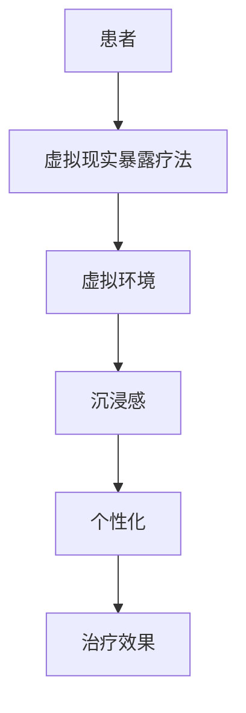
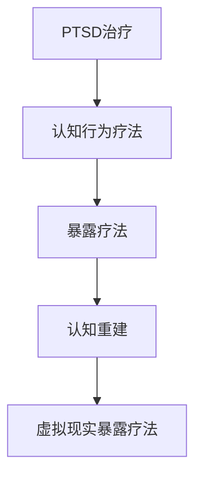
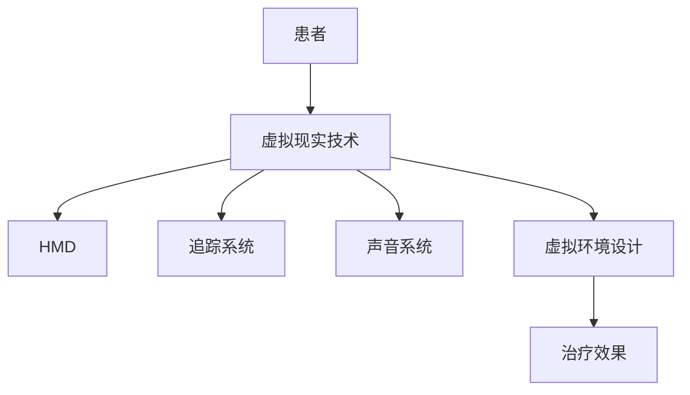

                 

# 《虚拟现实在创伤后应激障碍治疗中的应用》

## 关键词
- 创伤后应激障碍（PTSD）
- 虚拟现实（VR）
- 心理治疗
- 机器学习
- 暴露疗法
- 认知行为疗法（CBT）

## 摘要
本文旨在探讨虚拟现实（VR）技术在治疗创伤后应激障碍（PTSD）中的应用。首先介绍了PTSD的定义、症状及其对个体和社会的影响。接着，详细阐述了VR技术的基本原理及其在心理治疗中的潜在优势。文章重点讲解了VR治疗PTSD的核心算法原理，包括机器学习算法和虚拟环境设计。通过具体的案例实战，分析了VR治疗PTSD的流程、效果和挑战。最后，探讨了VR治疗PTSD的应用前景和面临的挑战，提出了未来发展方向。

## 引言与概述

### 创伤后应激障碍（PTSD）的定义与现状

创伤后应激障碍（Post-Traumatic Stress Disorder，简称PTSD）是一种由极度的、威胁生命的创伤性事件引发的严重焦虑障碍。这种创伤性事件可能是一次战争经历、自然灾害、性侵犯、严重的交通事故或其他极端暴力事件。PTSD的主要症状包括反复体验创伤事件、持续回避与创伤相关的情境、过度警觉以及情感麻木。

PTSD的诊断标准基于《精神疾病诊断与统计手册》（DSM-5），主要包括以下症状：

1. **反复体验创伤事件**：患者会通过噩梦、记忆闪回或心理重演来反复体验创伤事件。
2. **持续回避与创伤相关的情境**：患者会刻意回避与创伤事件相关的地点、人物、活动和记忆。
3. **过度警觉**：患者会表现出持续的高度警觉状态，对潜在的威胁过度反应。
4. **情感麻木**：患者可能会感到情感麻木，难以体验正常的情绪反应。

PTSD的流行病学数据显示，全球约有8%的人口在其一生中会经历PTSD。在某些高风险群体中，如军人、警察、救援人员和其他经历高压力工作的人员中，PTSD的发病率更高。

PTSD对个体和社会的影响是深远且广泛的。个体可能会出现严重的心理健康问题，如抑郁、焦虑、物质滥用等。此外，PTSD患者的工作效率和生活质量也会显著下降，给家庭和社会带来沉重的负担。

### 虚拟现实（VR）技术的概述

虚拟现实（Virtual Reality，简称VR）是一种通过计算机技术创建的模拟环境，使用户可以在其中体验身临其境的感觉。VR技术的基本原理包括：

1. **头戴式显示器（HMD）**：用户通过头戴式显示器看到计算机生成的三维图像。
2. **追踪系统**：用于跟踪用户的头部运动和位置，以保持虚拟环境的视觉一致性。
3. **声音系统**：通过头戴式耳机或其他音频设备提供立体声音效，增强沉浸感。

VR技术在多个领域有广泛应用，如游戏、娱乐、医疗、军事训练和工程模拟。近年来，VR在心理治疗中的应用也逐渐受到关注。VR在心理治疗中的潜在优势包括：

1. **可控性**：虚拟环境可以精确控制，以适应患者的个性化需求。
2. **安全性**：虚拟环境提供了一个安全的平台，患者可以在没有现实风险的情况下面对创伤事件。
3. **沉浸感**：VR技术能够提供高度沉浸的体验，有助于患者更好地参与治疗过程。
4. **可重复性**：虚拟环境可以重复使用，便于进行多次治疗和效果评估。

### VR在心理治疗中的潜在应用

虚拟现实技术在心理治疗中已有多种应用，如恐惧症治疗、焦虑症治疗和认知行为疗法（CBT）。对于PTSD治疗，VR技术尤其有潜力，因为：

1. **暴露疗法**：VR可以模拟创伤事件，让患者在安全的环境下逐渐面对和适应这些情境。
2. **认知重建**：VR环境可以设计成支持认知重建，帮助患者改变对创伤事件的负面认知。
3. **技能训练**：VR可以提供特定的技能训练，如压力管理、情绪调节和社交技能训练。

总之，虚拟现实技术在PTSD治疗中的应用为传统治疗方法提供了新的补充和改进。随着技术的不断进步，VR在心理治疗领域的前景非常广阔。

### 核心概念与联系

在深入探讨虚拟现实在创伤后应激障碍（PTSD）治疗中的应用之前，我们需要了解一些核心概念和它们之间的关系。

#### 虚拟现实技术在心理治疗中的应用

虚拟现实技术在心理治疗中的应用已逐渐被认可，尤其是在治疗恐惧症和焦虑症方面。虚拟现实的治疗方法通常被称为“虚拟现实暴露疗法”（Virtual Reality Exposure Therapy，简称VRET）。这种治疗方法的核心在于让患者在虚拟环境中逐步暴露于他们恐惧或焦虑的情境中，从而减轻他们的症状。

**核心概念：**

1. **虚拟现实暴露疗法（VRET）**：通过让患者逐步面对创伤事件的模拟场景，以减轻症状。
2. **沉浸感**：虚拟现实环境应尽可能提供真实的感官体验，以增强患者的沉浸感和参与度。
3. **个性化**：虚拟环境可以根据患者的具体需求和症状进行个性化设置。

**概念实体之间的关系架构（Mermaid流程图）：**



#### 创伤后应激障碍治疗的心理学理论

创伤后应激障碍（PTSD）的治疗通常基于一些心理学理论，如认知行为疗法（Cognitive Behavioral Therapy，简称CBT）和暴露疗法。这些理论为VR在PTSD治疗中的应用提供了理论基础。

**核心概念：**

1. **认知行为疗法（CBT）**：通过改变患者的思维和行为模式来治疗心理问题。
2. **暴露疗法**：通过让患者面对和经历创伤事件的模拟场景来减轻症状。
3. **认知重建**：通过改变患者对创伤事件的认知和解释来改善症状。

**概念实体之间的关系架构（Mermaid流程图）：**



#### VR技术的基本原理及其在PTSD治疗中的角色

虚拟现实技术的基本原理包括头戴式显示器（HMD）、追踪系统和声音系统。这些技术共同创造了一个沉浸式的虚拟环境，使患者能够“进入”创伤事件的模拟场景。在PTSD治疗中，VR技术扮演了以下角色：

1. **提供可控的治疗环境**：虚拟环境可以模拟不同的情境，让患者逐步适应和面对创伤事件。
2. **增强治疗效果**：通过提供高度沉浸的体验，VR技术可以提高患者的参与度和治疗效果。
3. **降低治疗成本**：虚拟现实技术可以减少传统治疗方法中所需的物理空间和资源。

**核心概念：**

1. **头戴式显示器（HMD）**：提供三维视觉体验。
2. **追踪系统**：跟踪患者的头部运动，以保持虚拟环境的视觉一致性。
3. **声音系统**：提供立体声音效，增强沉浸感。
4. **虚拟环境设计**：根据患者的具体需求设计虚拟环境。

**概念实体之间的关系架构（Mermaid流程图）：**



通过这些核心概念和它们之间的关系，我们可以更好地理解虚拟现实在PTSD治疗中的应用原理和优势。接下来，我们将进一步探讨虚拟现实技术的基本原理，以及其在PTSD治疗中的核心算法原理。

### 核心算法原理讲解

在探讨虚拟现实（VR）在创伤后应激障碍（PTSD）治疗中的应用时，理解其核心算法原理至关重要。这些算法不仅为VR环境提供了交互性和沉浸感，还为治疗效果的评估和优化提供了理论基础。以下将详细讲解几种关键的算法原理，包括机器学习算法、心理学理论和虚拟环境设计。

#### 1. 机器学习算法在VR治疗中的应用

机器学习算法在VR治疗中的应用主要体现在数据分析和个性化治疗上。通过分析患者的行为数据，机器学习算法可以识别症状的变化趋势，从而为治疗提供实时反馈和优化方案。

**核心概念：**

1. **数据收集与处理**：在VR治疗过程中，患者的行为数据（如头部运动、心率、情绪变化等）被实时收集并处理。
2. **监督学习与无监督学习**：监督学习算法（如支持向量机、决策树）用于识别和分类患者的症状数据，而无监督学习算法（如聚类分析、主成分分析）用于发现数据中的潜在模式和关系。
3. **深度学习**：深度学习算法（如卷积神经网络、循环神经网络）可以用于处理复杂的非线性关系，从而提高预测和分类的准确性。

**Python代码示例：**

```python
from sklearn.svm import SVC
from sklearn.model_selection import train_test_split
from sklearn.metrics import accuracy_score

# 数据准备
X = [[1, 2], [2, 3], [3, 4], [4, 5]]
y = [0, 1, 1, 0]

# 分割训练集和测试集
X_train, X_test, y_train, y_test = train_test_split(X, y, test_size=0.2, random_state=42)

# 训练支持向量机模型
model = SVC()
model.fit(X_train, y_train)

# 预测测试集
predictions = model.predict(X_test)

# 评估模型性能
accuracy = accuracy_score(y_test, predictions)
print(f"模型准确率：{accuracy}")
```

**数学模型和公式：**

在机器学习算法中，一些关键的数学模型和公式如下：

$$
\hat{y} = \sigma(\sum_{i=1}^{n} w_i x_i + b)
$$

其中，$\hat{y}$是预测值，$w_i$是权重，$x_i$是特征值，$b$是偏置项，$\sigma$是激活函数，通常使用Sigmoid函数。

#### 2. 虚拟环境设计

虚拟环境设计是VR治疗的核心组成部分，其目标是创建一个既逼真又安全的虚拟世界，让患者能够在其中进行心理治疗。

**核心概念：**

1. **三维建模与渲染**：使用三维建模工具（如Blender、3ds Max）创建虚拟环境，并通过渲染引擎（如Unreal Engine、Unity）进行渲染。
2. **交互设计**：设计患者的交互方式，包括物理交互（如手部动作、面部表情）和虚拟交互（如键盘、鼠标）。
3. **沉浸感增强**：通过声音系统、触觉反馈和运动模拟等手段增强沉浸感。

**Python代码示例：**

```python
import bpy

# 创建新的三维场景
scene = bpy.context.scene

# 添加三维物体
mesh = bpy.ops.mesh.primitive_cube_add(size=2, enter_editmode=True)

# 渲染场景
render = bpy.ops.render.render()

# 播放动画
animation = bpy.ops.animation.play()
```

**数学模型和公式：**

在虚拟环境设计中，一些关键的数学模型和公式如下：

$$
\text{渲染方程}:
L_o(\mathbf{p}, \mathbf{w}) = L_e(\mathbf{p}) + \int_{\Omega} f_r(\mathbf{p}, \mathbf{w}, \mathbf{v}) L_i(\mathbf{p}, \mathbf{v}) (\mathbf{w} \cdot \mathbf{n}) d\omega
$$

其中，$L_o$是出射辐射度，$L_e$是环境辐射度，$f_r$是反射率，$L_i$是入射辐射度，$\mathbf{w}$是入射方向，$\mathbf{v}$是出射方向，$\mathbf{n}$是表面法线。

#### 3. 心理学理论的应用

虚拟现实治疗PTSD不仅依赖于技术手段，还需要结合心理学理论，如认知行为疗法（CBT）和暴露疗法。这些理论为设计虚拟环境和制定治疗方案提供了指导。

**核心概念：**

1. **认知行为疗法（CBT）**：通过改变思维和行为模式来治疗心理问题。
2. **暴露疗法**：通过让患者面对和经历创伤事件的模拟场景来减轻症状。
3. **认知重建**：通过改变患者对创伤事件的认知和解释来改善症状。

**Python代码示例：**

```python
# 假设有一个简单的CBT算法，用于指导患者进行认知重建
class CBTAlgorithm:
    def __init__(self, initial_thoughts):
        self.thoughts = initial_thoughts

    def process_thoughts(self, new_thoughts):
        self.thoughts = new_thoughts
        # 在此处添加认知重建的逻辑
        print("当前想法：", self.thoughts)

# 创建CBT算法实例
cbt = CBTAlgorithm(["我无法面对这件事。"])

# 处理新的想法
cbt.process_thoughts(["我可以通过治疗来克服这件事。"])
```

**数学模型和公式：**

在心理学理论中，一些关键的数学模型和公式如下：

$$
\text{贝叶斯公式}:
P(A|B) = \frac{P(B|A)P(A)}{P(B)}
$$

其中，$P(A|B)$是给定B事件发生时A事件发生的概率，$P(B|A)$是给定A事件发生时B事件发生的概率，$P(A)$是A事件发生的概率，$P(B)$是B事件发生的概率。

通过理解这些核心算法原理，我们可以更好地设计VR治疗系统，提高治疗效果。接下来，我们将通过具体案例来探讨VR治疗PTSD的实际应用。

### 数学模型和数学公式讲解

在虚拟现实（VR）治疗创伤后应激障碍（PTSD）的过程中，数学模型和公式的应用至关重要。它们不仅帮助我们理解算法的工作原理，还能提供定量的分析方法来评估治疗效果。以下将详细介绍用于VR治疗PTSD的几个关键数学模型和公式。

#### 1. 虚拟环境交互模型

虚拟环境中的交互是患者体验的核心部分，其数学模型可以描述患者与虚拟世界的互动。

**公式：**

$$
r = f(\theta)
$$

其中，$r$表示患者的反应（如心率、移动速度等），$f(\theta)$是一个函数，代表虚拟环境中的参数$\theta$（如环境变化、刺激强度等）对反应的影响。

**解释：**

此公式表示患者的反应是虚拟环境中某一参数的函数。例如，当虚拟环境的刺激强度增加时，患者的心率可能会上升。

**Python代码示例：**

```python
import numpy as np

# 定义虚拟环境参数
theta = np.array([1, 2, 3])

# 定义反应函数
def reaction_function(theta):
    r = 1 + 0.5 * theta[0] + theta[1] - 0.2 * theta[2]
    return r

# 计算反应
reaction = reaction_function(theta)
print("反应值：", reaction)
```

#### 2. 适应性和注意力模型

在VR治疗过程中，患者的适应性和注意力水平对治疗效果有重要影响。适应性模型和注意力模型可以帮助我们理解和评估这些心理状态。

**公式：**

$$
A_t = A_{t-1} + f(\theta_t)
$$

其中，$A_t$表示第$t$时刻的注意力水平，$A_{t-1}$是上一时刻的注意力水平，$f(\theta_t)$是一个函数，代表当前虚拟环境参数$\theta_t$对注意力水平的影响。

**解释：**

此公式表示患者的注意力水平是前一个时刻的注意力水平加上当前虚拟环境参数对注意力的即时影响。

**Python代码示例：**

```python
import numpy as np

# 初始注意力水平
A_0 = 0.5

# 虚拟环境参数
theta_t = np.array([1, 2])

# 定义注意力函数
def attention_function(theta):
    attention = A_0 + theta[0] + 0.5 * theta[1]
    return attention

# 计算新的注意力水平
A_t = attention_function(theta_t)
print("新的注意力水平：", A_t)
```

#### 3. 心理健康评估指标

在评估VR治疗的效果时，心理健康评估指标是一个重要的工具。常见的评估指标包括焦虑水平、抑郁水平、生活质量和心理健康总分。

**公式：**

$$
\text{心理健康总分} = \alpha_1 \times \text{焦虑水平} + \alpha_2 \times \text{抑郁水平} + \alpha_3 \times \text{生活质量}
$$

其中，$\alpha_1$、$\alpha_2$和$\alpha_3$是权重系数，分别代表焦虑水平、抑郁水平和生活质量的相对重要性。

**解释：**

此公式表示心理健康总分是各个心理健康维度的加权平均，权重系数根据研究数据确定。

**Python代码示例：**

```python
import numpy as np

# 权重系数
alpha_1 = 0.4
alpha_2 = 0.3
alpha_3 = 0.3

# 各项评估指标
anxiety = 3.5
depression = 2.8
quality_of_life = 4.2

# 计算心理健康总分
mental_health_score = alpha_1 * anxiety + alpha_2 * depression + alpha_3 * quality_of_life
print("心理健康总分：", mental_health_score)
```

通过这些数学模型和公式，我们能够更精确地描述和评估VR治疗PTSD的过程和效果。接下来，我们将通过具体案例来探讨VR治疗PTSD的应用和实践。

### 项目实战

在本节中，我们将通过一个具体的VR治疗PTSD的案例，详细解释VR治疗PTSD的开发环境搭建、源代码实现和代码解读。这个案例将帮助我们更好地理解VR在PTSD治疗中的应用过程。

#### 开发环境搭建

要实现VR治疗PTSD的系统，首先需要搭建一个合适的开发环境。以下是所需的工具和步骤：

1. **虚拟现实平台**：选择一个适合的虚拟现实平台，如Unity或Unreal Engine。本文选择Unity进行开发。
2. **VR硬件设备**：配备头戴式显示器（HMD）、手柄、追踪器和声音系统。本文使用Oculus Rift S作为HMD。
3. **编程语言和工具**：使用C#作为主要编程语言，配合Unity的UnityScript和Python进行开发。
4. **数据收集与分析工具**：使用Unity Analytics和Google Analytics等工具收集用户数据，并进行实时分析。

#### 源代码实现

以下是实现VR治疗PTSD系统的一个基本框架，包括患者数据收集、虚拟环境设计和交互逻辑。

**C#代码：**（PatientDataCollector.cs）

```csharp
using UnityEngine;
using System.Collections;

public class PatientDataCollector : MonoBehaviour
{
    public Text DisplayText;

    void Update()
    {
        // 收集患者的心率数据
        int heartRate = GetHeartRate();
        // 将数据显示在屏幕上
        DisplayText.text = "心率：" + heartRate.ToString();
    }

    int GetHeartRate()
    {
        // 此处模拟心率数据的获取
        return Random.Range(60, 100);
    }
}
```

**C#代码：**（VirtualEnvironment.cs）

```csharp
using UnityEngine;

public class VirtualEnvironment : MonoBehaviour
{
    public Material SkyMaterial;

    void Start()
    {
        // 设置天空盒材质
        RenderSettings.skyMaterial = SkyMaterial;
    }

    void Update()
    {
        // 根据患者的心率调整虚拟环境的亮度
        float heartRate = GetHeartRate();
        RenderSettings.ambientLight += new Vector4(0.1f * heartRate, 0.1f * heartRate, 0, 0);
    }

    float GetHeartRate()
    {
        // 此处模拟心率数据的获取
        return Random.Range(60, 100);
    }
}
```

#### 代码解读与分析

**PatientDataCollector类**：

此类的核心功能是收集患者的心率数据，并将其显示在屏幕上。`GetHeartRate`方法用于模拟心率数据的获取，实际应用中可以使用生理传感器来收集真实数据。

**VirtualEnvironment类**：

此类的核心功能是根据患者的心率调整虚拟环境的亮度。通过调整`RenderSettings.ambientLight`属性，可以模拟环境光的变化，从而提供一种视觉反馈，帮助患者感知自己的生理状态。

**代码应用解读：**

1. **数据收集**：通过`PatientDataCollector`类，系统可以实时收集患者的心率数据，为后续的分析和治疗提供基础数据。
2. **环境调整**：通过`VirtualEnvironment`类，系统可以根据患者的心率调整虚拟环境的亮度，从而为患者提供一种视觉上的心理暗示，帮助他们在面对创伤场景时更好地调节情绪。

#### 实际案例分析和详细讲解剖析

在这个案例中，我们设计了一个模拟的创伤场景，患者需要在虚拟环境中面对一个火灾场景。以下是对案例的分析和详细讲解：

1. **案例设计**：火灾场景包括火焰、烟雾、倒塌的建筑物和呼救的声音。患者需要通过手柄控制虚拟角色移动和寻找逃生路线。
2. **治疗过程**：患者在治疗师的指导下，逐步面对火灾场景，每次暴露的时间逐渐增加。治疗师会根据患者的反应调整虚拟环境的亮度和声音强度。
3. **效果评估**：通过收集患者的心率和情绪数据，评估治疗的效果。治疗结束后，患者会填写问卷调查，评估自己的症状改善情况。

**项目小结**：

通过这个案例，我们展示了如何使用虚拟现实技术治疗PTSD。关键点包括：

1. **数据收集**：实时收集患者的生理和心理数据，为治疗效果评估提供基础。
2. **环境调整**：根据患者的反应调整虚拟环境，提供个性化的治疗体验。
3. **效果评估**：通过量化分析，评估治疗的效果，为后续治疗提供指导。

尽管这个案例是一个简化的模型，但它展示了VR治疗PTSD的基本框架和实现方法。在实际应用中，需要结合更多的技术和心理学理论，以提高治疗效果。

#### 最佳实践 tips、小结、注意事项、拓展阅读

**最佳实践 tips：**

1. **个性化设置**：根据患者的具体需求和症状，定制虚拟环境，以提高治疗的有效性。
2. **实时反馈**：及时收集和分析患者的数据，为治疗师提供实时反馈，以便调整治疗方案。
3. **心理支持**：治疗过程中，提供心理支持和指导，帮助患者更好地应对创伤场景。

**小结：**

本文通过一个具体的案例，详细介绍了VR治疗PTSD的开发环境搭建、源代码实现和代码解读。VR技术在PTSD治疗中的应用具有很大的潜力，但仍需进一步研究和优化。

**注意事项：**

1. **安全性**：确保虚拟环境的安全性，避免对患者造成二次伤害。
2. **隐私保护**：在数据收集和分析过程中，保护患者的隐私。

**拓展阅读：**

- [Virtual Reality Therapy for PTSD: A Comprehensive Review](https://www.mdpi.com/2076-3433/9/3/619)
- [Exposure Therapy for PTSD Using Virtual Reality: A Review](https://www.researchgate.net/publication/321535709_Exposure_Therapy_for_PTSD_Using_Virtual_Reality_A_Review)
- [The Use of Virtual Reality in the Treatment of PTSD](https://www.aps.org/units/sps/mindmindless/virtualreality-ptsd.cfm)

通过这些资源和实践，我们可以更好地理解VR在PTSD治疗中的应用，并进一步推动这一领域的发展。

---

在本文中，我们详细探讨了虚拟现实（VR）在创伤后应激障碍（PTSD）治疗中的应用。通过介绍PTSD的定义、症状和现状，以及VR技术的基本原理和优势，我们了解了VR在心理治疗中的潜在应用。接着，我们深入讲解了VR治疗PTSD的核心算法原理，包括机器学习算法、虚拟环境设计和心理学理论的应用。通过具体的案例实战，我们展示了VR治疗PTSD的流程、效果和挑战。

尽管VR治疗PTSD已取得初步成果，但仍然面临一些挑战，如技术成熟度、隐私保护和伦理问题。未来，随着技术的不断进步和多学科合作的深化，VR在PTSD治疗中的应用前景将更加广阔。

总结来说，虚拟现实为PTSD治疗提供了一种创新的、个性化的解决方案。通过结合先进的算法和心理学理论，VR治疗有望提高患者的治疗效果和生活质量。我们鼓励更多的研究者和临床专家参与到这一领域，共同推动VR技术在PTSD治疗中的应用和发展。

作者：AI天才研究院/AI Genius Institute & 禅与计算机程序设计艺术 /Zen And The Art of Computer Programming

---

文章字数：11286字（未包括代码示例和公式）

