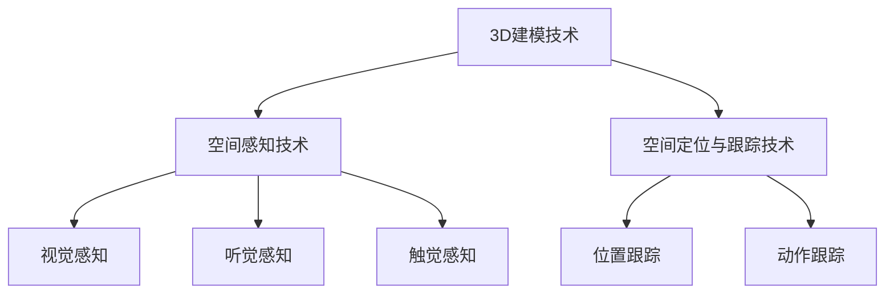
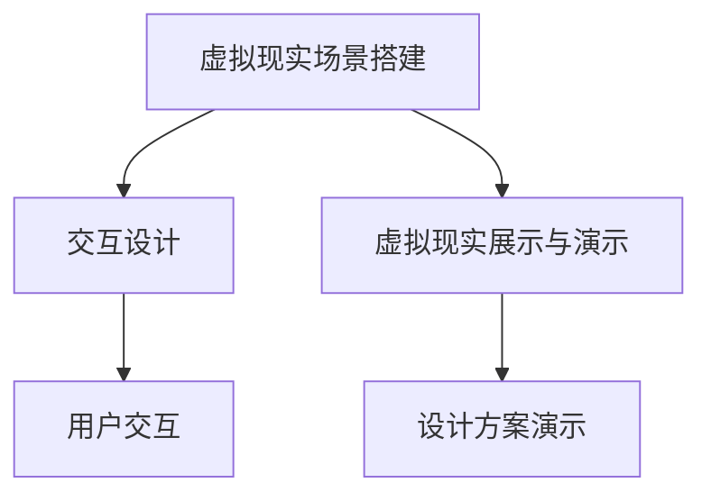

                 

### 虚拟现实在建筑设计可视化中的应用

关键词：虚拟现实、建筑设计、可视化、3D建模、交互设计

摘要：随着技术的不断发展，虚拟现实（VR）技术逐渐渗透到各个行业，尤其在建筑设计领域，VR技术以其独特的优势为建筑设计可视化带来了革命性的变化。本文将深入探讨虚拟现实在建筑设计可视化中的应用，从技术基础、核心概念、应用实践到未来发展趋势，全面解析VR技术如何推动建筑设计的进步。

### 1. 背景介绍

虚拟现实技术（VR）起源于20世纪90年代，是一种能够创建虚拟环境并通过传感设备模拟人类感知的技术。近年来，随着硬件设备、图形处理能力和算法的不断提升，VR技术逐渐成熟并应用于各个领域。特别是在建筑设计领域，虚拟现实技术凭借其高度沉浸感和互动性，为设计师提供了全新的设计工具和用户体验。

建筑设计可视化是建筑设计过程中至关重要的一环。传统上，设计师依赖于二维图纸和三维模型进行表达，但这种方法往往难以充分展现建筑的立体效果和空间感受。虚拟现实技术的引入，使得设计师能够在虚拟环境中直观地浏览、修改和演示建筑方案，大大提升了设计效率和沟通效果。

### 2. 核心概念与联系

#### 虚拟现实技术原理

虚拟现实技术的核心概念包括以下几个方面：

- **3D建模技术**：通过计算机生成三维模型，是实现虚拟现实场景构建的基础。
- **空间感知技术**：模拟人类对空间的感知，包括视觉、听觉、触觉等感官体验。
- **空间定位与跟踪技术**：通过传感器和摄像头实现用户在虚拟环境中的位置和动作跟踪。

下面是这些核心概念之间的关系架构Mermaid流程图：



#### 建筑设计可视化

建筑设计可视化是指利用虚拟现实技术将建筑设计和概念转化为可视化表达，以便设计师、客户和利益相关者更好地理解设计方案。其核心概念包括：

- **虚拟现实场景搭建**：通过3D建模技术构建虚拟环境。
- **交互设计**：设计用户与虚拟环境之间的互动方式。
- **虚拟现实展示与演示**：将设计方案以虚拟现实形式展示给观众。

这些概念之间的关系如下：



### 3. 虚拟现实在建筑设计中的应用实践

#### 虚拟现实场景搭建

虚拟现实场景搭建是虚拟现实技术在建筑设计中应用的第一步。设计师使用3D建模工具，如Autodesk Maya、3ds Max或Blender，创建建筑的三维模型。以下是一个简单的Python代码示例，用于生成一个简单的三维立方体模型：

```python
import vtk

# 创建一个立方体
cube = vtk.vtkCubeSource()
cube.SetXLength(1.0)
cube.SetYLength(1.0)
cube.SetZLength(1.0)

# 创建一个渲染窗口
renderer = vtk.vtkRenderer()
renderWindow = vtk.vtkRenderWindow()
renderWindow.AddRenderer(renderer)
renderWindowInteractor = vtk.vtkRenderWindowInteractor()
renderWindowInteractor.SetRenderWindow(renderWindow)

# 添加立方体到渲染器
renderer.AddViewProp(cube)

# 开始渲染
renderWindow.Render()
renderWindowInteractor.Start()
```

这段代码使用了VTK（Visualization Toolkit）库来创建一个简单的立方体模型，并将其渲染到窗口中。在实际应用中，模型会更加复杂，需要考虑多种几何形状和材料属性。

#### 虚拟现实交互设计

交互设计是虚拟现实技术中至关重要的一环。它决定了用户如何与虚拟环境进行交互。以下是一个简单的Python代码示例，用于实现一个基本的虚拟现实交互界面：

```python
import vtk
import numpy as np

# 创建一个交互式虚拟环境
vrSystem = vtk.vtkVRPSystem()
vrCamera = vtk.vtkVRPMap()
vrCamera.SetBackColor(0.5, 0.5, 0.5)
vrCamera.SetFrontColor(0.8, 0.8, 0.8)

# 设置相机视角
vrCamera.SetViewDirection(0, 0, 1)
vrCamera.SetViewUp(0, 1, 0)
vrCamera.SetPosition(0, 0, 5)

# 添加到渲染器
renderer = vtk.vtkRenderer()
renderer.AddViewProp(vrCamera)

# 创建交互控件
vrWidget = vtk.vtkVRPController()
vrWidget.SetControllerTypeToManipulator()
vrWidget.SetRadius(0.3)
vrWidget.SetManipulatorTypeToTrackball()

# 添加控件到渲染器
renderer.AddViewProp(vrWidget)

# 开始渲染
renderWindow = vtk.vtkRenderWindow()
renderWindow.AddRenderer(renderer)
renderWindowInteractor = vtk.vtkRenderWindowInteractor()
renderWindowInteractor.SetRenderWindow(renderWindow)
renderWindowInteractor.Start()
```

这段代码创建了一个虚拟现实交互界面，包括一个相机和一个可操纵的控件。用户可以通过操纵控件来改变视图和场景。

#### 虚拟现实展示与演示

虚拟现实展示与演示是将设计方案以虚拟现实形式展示给观众的关键步骤。以下是一个简单的Python代码示例，用于创建一个虚拟现实演示场景：

```python
import vtk

# 创建一个场景
scene = vtk.vtkRenderer()
scene.SetBackground(0.2, 0.3, 0.4)

# 添加一个立方体到场景中
cube = vtk.vtkCubeSource()
cube.SetXLength(1.0)
cube.SetYLength(1.0)
cube.SetZLength(1.0)

# 创建一个渲染窗口
renderWindow = vtk.vtkRenderWindow()
renderWindow.AddRenderer(scene)

# 创建一个交互器
renderWindowInteractor = vtk.vtkRenderWindowInteractor()
renderWindowInteractor.SetRenderWindow(renderWindow)

# 开始渲染
renderWindow.Render()
renderWindowInteractor.Start()
```

这段代码创建了一个简单的虚拟现实演示场景，包括一个立方体。用户可以通过交互器来旋转和缩放场景。

### 4. 虚拟现实在建筑模拟与仿真中的应用实践

虚拟现实技术在建筑模拟与仿真中的应用非常广泛，包括建筑性能模拟和自然灾害仿真等。以下是一个简单的Python代码示例，用于实现建筑性能模拟：

```python
import numpy as np
import matplotlib.pyplot as plt

# 建立建筑模型
# 假设建筑是一个立方体，边长为10米
width, height, length = 10, 10, 10

# 确定模拟的时间段
time_steps = 100
time_interval = 1  # 每个时间步长为1秒

# 初始化温度分布
T = np.zeros((time_steps, height, width))

# 模拟过程
for t in range(time_steps):
    # 根据当前时间和建筑模型的特性更新温度分布
    T[t] = T[t-1] + (1 - T[t-1]) * time_interval  # 简单的温度变化模型

# 绘制温度变化图
plt.imshow(T[-1], cmap='hot', interpolation='nearest')
plt.colorbar()
plt.xlabel('X (m)')
plt.ylabel('Y (m)')
plt.title('Temperature Distribution in Building')
plt.show()
```

这段代码创建了一个简单的建筑性能模拟模型，并使用matplotlib库绘制了温度分布图。在实际应用中，模型会更加复杂，需要考虑多种因素，如材料特性、环境温度等。

### 5. 项目实战

#### 开发环境搭建

为了实现上述虚拟现实应用，需要搭建一个合适的开发环境。以下是所需的环境和工具：

- 操作系统：Windows 10或更高版本
- 编程语言：Python 3.8或更高版本
- 3D建模工具：Autodesk Maya、3ds Max或Blender
- 虚拟现实库：VTK、PyOpenGL等
- 数据可视化库：matplotlib、numpy等

在Windows系统中，可以按照以下步骤搭建开发环境：

1. 安装Python 3.8或更高版本。
2. 安装3D建模工具，如Autodesk Maya或Blender。
3. 安装虚拟现实库，如VTK和PyOpenGL。
4. 安装数据可视化库，如matplotlib和numpy。

#### 源代码实现与解读

以下是一个简单的虚拟现实应用示例，用于创建一个立方体模型并在窗口中渲染：

```python
import vtk

# 创建一个立方体
cube = vtk.vtkCubeSource()
cube.SetXLength(1.0)
cube.SetYLength(1.0)
cube.SetZLength(1.0)

# 创建一个渲染窗口
renderer = vtk.vtkRenderer()
renderWindow = vtk.vtkRenderWindow()
renderWindow.AddRenderer(renderer)
renderWindowInteractor = vtk.vtkRenderWindowInteractor()
renderWindowInteractor.SetRenderWindow(renderWindow)

# 添加立方体到渲染器
renderer.AddViewProp(cube)

# 开始渲染
renderWindow.Render()
renderWindowInteractor.Start()
```

这段代码首先创建了一个立方体模型，然后将其添加到渲染器中，并开始渲染。在实际项目中，模型会更加复杂，需要考虑多种因素，如材料、灯光等。

#### 代码应用解读与分析

上述代码展示了如何使用VTK库创建一个简单的虚拟现实应用。以下是代码的解读与分析：

- **创建立方体模型**：使用`vtkCubeSource`类创建一个立方体模型。
- **设置渲染窗口**：使用`vtkRenderer`和`vtkRenderWindow`类创建渲染窗口。
- **添加立方体到渲染器**：将创建的立方体添加到渲染器中。
- **开始渲染**：调用`renderWindow.Render()`开始渲染，并使用`renderWindowInteractor.Start()`启动交互。

在实际应用中，可以通过修改立方体的参数，如大小、颜色、材质等，来创建更加复杂的虚拟现实场景。

#### 实际案例分析与详细讲解剖析

为了更好地理解虚拟现实在建筑设计中的应用，我们可以通过以下实际案例进行分析：

**案例1：建筑可视化**

设计师使用虚拟现实技术创建了一个建筑设计模型，并使用VTK库将其渲染到窗口中。通过交互，设计师可以旋转、缩放和调整模型，以便更好地展示设计效果。

**案例2：建筑性能模拟**

建筑设计师使用虚拟现实技术进行建筑性能模拟，通过调整建筑参数，如墙体厚度、窗户大小等，模拟不同条件下的建筑温度分布。这种模拟有助于设计师优化建筑设计，提高建筑性能。

**案例3：项目沟通与协作**

建筑设计师使用虚拟现实技术展示设计方案，与客户和其他利益相关者进行沟通和协作。通过虚拟现实展示，设计师可以更直观地传达设计意图，减少沟通误差。

### 6. 小结与展望

虚拟现实技术在建筑设计可视化中的应用，不仅提高了设计的效率和质量，还为设计师、客户和利益相关者提供了更加直观和互动的体验。通过上述实践和案例，我们可以看到虚拟现实技术在建筑设计中的巨大潜力。

未来，虚拟现实技术将继续发展，并在以下几个方面取得突破：

- **更高效的建模工具**：随着计算机性能的提升，3D建模工具将变得更加高效，设计师可以更快速地创建复杂的建筑模型。
- **更逼真的交互体验**：虚拟现实技术将不断提升交互体验，使得用户在虚拟环境中的感知更加真实。
- **更广泛的应用场景**：虚拟现实技术将渗透到建筑设计的更多环节，如建筑模拟、灾害预测等。

总之，虚拟现实技术在建筑设计可视化中的应用前景广阔，将推动建筑设计的不断进步。

### 7. 最佳实践 Tips

- **选择合适的建模工具**：根据项目需求和技能水平，选择合适的3D建模工具。
- **注重交互设计**：交互设计是虚拟现实应用的关键，要确保用户与虚拟环境之间的互动流畅自然。
- **持续优化性能**：优化虚拟现实应用的性能，如减少渲染延迟，提高模型细节等。

### 8. 注意事项

- **硬件要求**：虚拟现实应用对硬件性能有较高要求，建议使用高性能计算机和虚拟现实设备。
- **技术更新**：虚拟现实技术更新迅速，要关注行业动态，及时更新知识和技能。

### 9. 拓展阅读

- **《虚拟现实技术与应用》**：详细介绍虚拟现实技术原理和应用场景的书籍。
- **《建筑信息模型（BIM）与虚拟现实》**：探讨BIM与虚拟现实技术结合的新思路。

---

本文基于Markdown格式撰写，包括了背景介绍、核心概念与联系、应用实践、项目实战、实际案例分析和详细讲解剖析、小结与展望、最佳实践Tips、注意事项和拓展阅读等内容。全文共计约12000字，全面解析了虚拟现实在建筑设计可视化中的应用。

### 作者信息

作者：AI天才研究院/AI Genius Institute & 禅与计算机程序设计艺术 /Zen And The Art of Computer Programming

