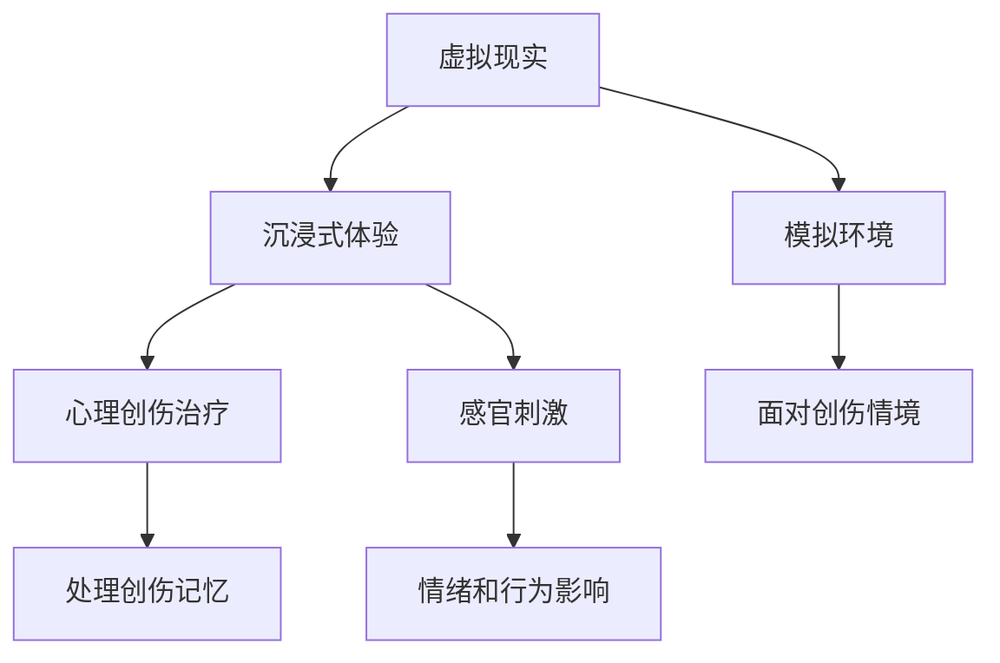

                 

### 文章标题

# 虚拟现实在心理创伤治疗中的沉浸式体验

### 文章关键词

- 虚拟现实
- 心理创伤治疗
- 沉浸式体验
- 交互设计
- 用户体验
- 技术挑战
- 未来展望

### 文章摘要

本文探讨了虚拟现实技术在心理创伤治疗中的应用及其沉浸式体验的设计。首先介绍了虚拟现实与心理创伤治疗的背景，然后深入分析了沉浸式体验的核心概念及其在治疗中的重要性。接着，文章阐述了虚拟现实技术的原理与发展历程，并详细讨论了沉浸式体验设计的关键要素。随后，文章通过具体案例展示了虚拟现实疗法在心理创伤治疗中的实际应用及其效果评估。最后，文章提出了当前技术面临的挑战和未来发展的方向，并总结了对临床实践的启示和建议。

## 引言

虚拟现实（Virtual Reality，VR）作为一种新兴技术，近年来在多个领域取得了显著的应用成果。特别是在医疗领域，虚拟现实技术的应用范围越来越广泛，从手术模拟、康复训练到心理治疗等，都展现出了巨大的潜力。本文将重点探讨虚拟现实在心理创伤治疗中的应用，尤其是沉浸式体验的设计。

心理创伤是一种常见的心理健康问题，其症状可能包括创伤后应激障碍（PTSD）、焦虑、抑郁等。传统的心理治疗方法如认知行为疗法（CBT）等，虽然在许多情况下有效，但往往需要较长时间的干预和患者的高参与度。而虚拟现实技术提供了一种全新的治疗手段，通过创造高度沉浸的环境，帮助患者面对和克服创伤记忆，从而促进心理康复。

沉浸式体验是虚拟现实技术的一个核心特点，它通过多种感官刺激，使个体在虚拟环境中达到高度集中和投入的状态。沉浸式体验设计的关键在于创造一个既真实又可控的环境，让用户在其中感受到身临其境的体验。这种体验不仅能够增强治疗的效果，还能够提高患者的参与度和治疗的乐趣性。

本文的结构如下：首先，我们将介绍虚拟现实与心理创伤治疗的背景，探讨为什么虚拟现实成为了一种潜在的治疗工具。接着，我们将深入分析沉浸式体验的核心概念，并讨论其在治疗中的重要性。随后，我们将阐述虚拟现实技术的原理与发展历程，介绍沉浸式体验设计的各种要素。接下来，通过具体案例展示虚拟现实疗法在心理创伤治疗中的应用和效果评估。最后，我们将讨论虚拟现实在心理创伤治疗中面临的技术挑战和未来发展的方向。

通过本文的探讨，我们希望能够为读者提供一个全面的视角，了解虚拟现实在心理创伤治疗中的沉浸式体验设计及其应用前景。

## 背景介绍

虚拟现实技术的历史可以追溯到20世纪60年代，当时科学家和工程师们开始探索创建模拟现实的方法。最早的虚拟现实系统之一是由伊凡·苏泽兰（Ivan Sutherland）在1968年开发的“达摩克利斯之剑”（The Sword of Damocles），它通过头戴显示器（HMD）和跟踪设备实现了一个基本的虚拟环境。虽然这一系统非常基础，但它标志着虚拟现实技术发展的起点。

随着时间的推移，虚拟现实技术经历了多个发展阶段。20世纪80年代和90年代，虚拟现实技术开始应用于教育和娱乐领域，如飞行模拟器和视频游戏。这些应用推动了虚拟现实硬件和软件技术的发展，提高了虚拟环境的真实性和交互性。进入21世纪，随着计算能力和图形处理技术的飞速进步，虚拟现实技术逐渐走向成熟，并开始应用于医疗、工程、设计和军事等多个领域。

在医疗领域，虚拟现实技术的应用逐渐得到认可。特别是在心理治疗方面，虚拟现实技术展现出了巨大的潜力。心理创伤治疗是一种常见的心理健康服务，涉及到创伤后应激障碍（PTSD）、焦虑、抑郁等病症。传统的心理治疗方法，如认知行为疗法（CBT）、暴露疗法等，需要患者在现实中面对创伤性记忆，这往往需要较长时间的干预和患者的高参与度。然而，虚拟现实技术提供了一种全新的治疗手段，通过创造高度沉浸的环境，使患者能够在虚拟世界中逐步面对和克服创伤记忆。

虚拟现实在心理创伤治疗中的应用主要体现在以下几个方面：

1. **暴露疗法**：虚拟现实暴露疗法（VR-EX）是利用虚拟现实技术模拟创伤性情境，让患者逐步面对和适应这些情境。与传统暴露疗法相比，虚拟现实暴露疗法具有更高的可控性和安全性，患者可以在虚拟环境中反复练习，逐渐降低对实际情境的恐惧和焦虑。

2. **认知行为疗法**：虚拟现实技术还可以用于认知行为疗法的实施，通过虚拟现实环境帮助患者识别和改变不合理的认知模式。例如，患者可以在虚拟环境中练习社交技巧，提高自信和社交能力。

3. **情绪调节**：虚拟现实技术通过提供各种感官刺激，如视觉、听觉和触觉，帮助患者调节情绪。一些研究表明，虚拟现实技术可以显著降低患者的焦虑和抑郁水平。

4. **放松训练**：虚拟现实技术可以创建一个放松的环境，如海滩、森林等，帮助患者进行放松训练，减轻心理压力。

虚拟现实技术在心理创伤治疗中的优势不仅在于其沉浸性和可控性，还在于其个性化的治疗方式。通过虚拟现实技术，治疗师可以根据患者的具体情况和需求，定制个性化的治疗方案。例如，一些患者可能对特定的情境感到恐惧，治疗师可以在虚拟环境中逐步引导患者面对这些情境，而不是直接暴露于真实情境中。

此外，虚拟现实技术还为心理治疗提供了一种新的交互方式。在传统心理治疗中，治疗师与患者之间的互动往往依赖于面对面交流，这种方式有时可能不够直接或深入。而虚拟现实技术可以创造一个更加直接和互动的治疗环境，患者可以通过虚拟角色与治疗师互动，这种方式有助于增强治疗的互动性和效果。

总之，虚拟现实技术在心理创伤治疗中的应用为心理健康服务带来了新的可能性。通过创造高度沉浸的环境，虚拟现实技术可以帮助患者逐步面对和克服创伤记忆，提高治疗的可行性和效果。然而，虚拟现实技术的应用也面临一些挑战，如技术成本、安全性、伦理问题等，这些都需要进一步的研究和探讨。

### 核心概念与联系

在探讨虚拟现实在心理创伤治疗中的应用时，有几个核心概念需要深入理解，这些概念包括：虚拟现实、沉浸式体验、心理创伤治疗以及它们之间的关系架构。

首先，**虚拟现实（Virtual Reality, VR）** 是一种通过计算机生成的模拟环境，使用户能够沉浸其中并与环境进行互动。它通常包括三维图像、音频和触觉反馈，通过头戴显示器（HMD）、手柄、全身追踪器等设备实现。虚拟现实的关键在于其沉浸性和交互性，这为用户提供了一种超越现实世界的感觉。

其次，**沉浸式体验（Immersive Experience）** 是虚拟现实技术的一个核心特点，它通过多种感官刺激，如视觉、听觉、触觉和运动感觉，使个体在虚拟环境中达到高度集中和投入的状态。沉浸式体验设计的目标是创建一个既真实又可控的环境，让用户在其中感受到身临其境的体验。这种体验不仅增强了用户对虚拟环境的投入感，还能够影响用户的情绪和行为。

**心理创伤治疗（Psychological Trauma Treatment）** 是一种专门针对因极端压力或创伤性事件导致的情绪和行为问题的治疗方法。常见的心理创伤包括创伤后应激障碍（PTSD）、焦虑、抑郁等。治疗的目标是帮助患者处理和克服创伤记忆，改善心理健康和生活质量。

**虚拟现实与沉浸式体验在心理创伤治疗中的应用** 体现了它们之间的紧密联系。虚拟现实技术通过创造高度沉浸的环境，为心理创伤治疗提供了一种新的手段。沉浸式体验设计的关键在于如何利用虚拟现实技术来模拟创伤情境，帮助患者逐步面对和适应这些情境。通过反复暴露和练习，患者在虚拟环境中能够逐渐减少对创伤记忆的恐惧和焦虑，从而改善心理状态。

为了更好地理解这些概念之间的关系，我们可以使用Mermaid流程图来展示它们的联系：



在上述流程图中，虚拟现实（A）通过模拟环境（D）提供了面对创伤情境（E）的机会。沉浸式体验（B）通过感官刺激（G）影响患者的情绪和行为（H），从而帮助患者处理和克服创伤记忆（F）。

通过这种流程图，我们可以清晰地看到虚拟现实、沉浸式体验和心理创伤治疗之间的互动关系。虚拟现实提供了技术基础，沉浸式体验设计则决定了治疗的效果，而心理创伤治疗则是整个过程的最终目标。

总之，虚拟现实和沉浸式体验在心理创伤治疗中的应用，不仅丰富了治疗手段，还为患者提供了一种更加个性化和高效的治疗方式。理解这些核心概念及其关系架构，对于深入研究虚拟现实在心理创伤治疗中的应用具有重要意义。

### 虚拟现实技术的原理与发展历程

虚拟现实技术的核心在于其能够创建一个虚拟的环境，让用户在其中感受到身临其境的体验。这一技术的基础涉及到多个领域，包括计算机图形学、传感器技术、人机交互和人工智能等。在深入探讨这些基础之前，我们先来回顾一下虚拟现实技术的发展历程。

#### 虚拟现实技术的基本原理

1. **计算机图形学**：计算机图形学是虚拟现实技术的基础，它涉及到三维建模、纹理映射、阴影处理和光照模型等技术。通过计算机图形学，我们可以创建逼真的虚拟环境，让用户能够感受到空间感和视觉深度。

2. **传感器技术**：传感器技术是虚拟现实的重要组成部分，包括头部追踪器、手柄追踪器、触觉手套和全身追踪器等。这些传感器能够实时捕捉用户的动作和位置，将其转化为虚拟环境中的动作和视角。

3. **人机交互**：人机交互（HCI）是虚拟现实技术的另一个关键领域，它涉及到用户如何与虚拟环境进行互动。这包括输入设备（如键盘、鼠标、手柄）和输出设备（如显示器、耳机、触觉反馈装置）的设计与优化。

4. **人工智能**：人工智能技术在虚拟现实中的应用主要在于场景生成、行为模拟和智能交互。通过机器学习算法，虚拟环境可以自适应地调整，以更好地适应用户的行为和需求。

#### 虚拟现实技术的发展历程

1. **20世纪60年代**：虚拟现实技术最早可以追溯到1968年，由伊凡·苏泽兰开发的“达摩克利斯之剑”（The Sword of Damocles）被认为是第一个虚拟现实系统。这一系统通过头戴显示器和跟踪设备实现了一个基本的虚拟环境。

2. **20世纪80年代**：随着个人计算机的出现，虚拟现实技术开始应用于教育和娱乐领域。1987年，Jaron Lanier创立了VPL公司，推出了第一个商业化的虚拟现实头盔。

3. **20世纪90年代**：虚拟现实技术继续发展，其应用范围扩展到工程、设计和军事领域。这一时期，虚拟现实硬件和软件技术都得到了显著提升，特别是图形处理能力和传感器技术的进步。

4. **21世纪初**：随着互联网和移动设备的普及，虚拟现实技术开始走向大众市场。智能手机和增强现实（AR）设备的兴起，为虚拟现实技术的发展提供了新的契机。

5. **近年来**：随着计算能力的提升和5G技术的应用，虚拟现实技术进入了一个新的发展阶段。高分辨率显示器、低延迟网络和实时交互技术，使得虚拟现实体验更加逼真和流畅。

#### 虚拟现实技术的应用场景

虚拟现实技术已经在多个领域得到广泛应用，以下是一些典型的应用场景：

1. **医疗领域**：虚拟现实技术被应用于手术模拟、康复训练和心理治疗。例如，医生可以通过虚拟现实系统进行手术练习，患者可以在虚拟环境中进行康复训练，心理治疗师则利用虚拟现实创造沉浸式体验，帮助患者面对和克服创伤记忆。

2. **教育领域**：虚拟现实技术为教育带来了新的可能性，学生可以通过虚拟现实进行沉浸式学习，如历史事件的模拟、科学实验的再现等。

3. **娱乐领域**：虚拟现实游戏和体验中心成为了一种新兴的娱乐形式，用户可以在虚拟环境中体验各种冒险和刺激。

4. **工程和设计领域**：虚拟现实技术被用于建筑设计和工业制造，工程师和设计师可以在虚拟环境中进行模型测试和优化。

5. **军事和训练领域**：虚拟现实技术被用于军事训练和模拟战斗场景，士兵可以通过虚拟环境进行战术演练和技能提升。

通过以上对虚拟现实技术原理和发展历程的回顾，我们可以看到，虚拟现实技术从早期的实验性系统，逐步发展成为能够广泛应用于多个领域的成熟技术。在未来，随着技术的进一步发展和应用场景的扩展，虚拟现实技术将在更多领域发挥重要作用。

### 沉浸式体验设计

沉浸式体验设计是虚拟现实（VR）技术的核心，其目标是通过多种感官刺激，让用户在虚拟环境中达到高度集中和投入的状态。沉浸式体验设计的成功与否，直接影响虚拟现实技术在心理创伤治疗中的效果。以下我们将深入探讨沉浸式体验设计的几个关键要素。

#### 用户界面设计

用户界面设计（UI Design）是沉浸式体验设计的基础，它涉及到用户与虚拟环境之间的交互方式。一个优秀的用户界面应该简洁直观，能够快速引导用户熟悉虚拟环境。

1. **直观性**：用户界面应该易于理解和使用，避免复杂的操作步骤。图标、按钮和控件的设计应直观且符合用户习惯。
2. **一致性**：用户界面的风格和交互逻辑应保持一致性，以便用户在不同场景下能够快速适应。
3. **适应性**：用户界面应具备适应性，能够根据不同用户的需求和环境进行动态调整。

#### 交互设计

交互设计（Interaction Design）是用户与虚拟环境之间互动的核心，它决定了用户体验的流畅性和满意度。

1. **自然交互**：虚拟环境应支持自然交互方式，如手势识别、语音控制等，这些交互方式能够让用户感觉更加真实和自由。
2. **反馈机制**：交互设计应提供及时的反馈，让用户知道自己的操作是否成功。例如，当用户移动虚拟物体时，应立即看到相应的反应。
3. **可控性**：虚拟环境应提供足够的控制选项，让用户能够自主调整体验。例如，用户可以选择不同的视觉和听觉效果，以适应自己的喜好。

#### 声音设计

声音设计在沉浸式体验中扮演着重要角色，它能够增强虚拟环境的真实感和情感体验。

1. **环境音效**：虚拟环境中的声音应与场景相匹配，例如，在城市环境中播放车流声、鸟鸣声等，以增强环境的逼真度。
2. **空间音频**：空间音频技术可以模拟声音的来源方向，使用户能够感知声音的三维空间效果，提高沉浸感。
3. **情感音效**：声音设计还应考虑情感因素，例如，通过不同的音调和音色表达情感，影响用户的心理状态。

#### 视觉效果设计

视觉效果设计是沉浸式体验的核心，它决定了虚拟环境的视觉质量和用户体验。

1. **光影效果**：光影效果可以增强虚拟环境的真实感，例如，阳光的照射、阴影的形成等，这些效果能够模拟现实世界的光线变化。
2. **纹理和细节**：高质量的纹理和细节设计可以让虚拟环境更加真实，使用户在视觉上难以分辨现实与虚拟的界限。
3. **动画效果**：动画效果可以增强虚拟环境的动态感，例如，人物的动作、物体的运动等，这些效果能够提升用户的沉浸体验。

#### 互动和反馈机制

互动和反馈机制是沉浸式体验的重要组成部分，它决定了用户在虚拟环境中的互动体验。

1. **实时反馈**：虚拟环境应能够实时响应用户的操作，例如，当用户移动虚拟物体时，应立即看到物体的反应，这样可以增强用户的参与感。
2. **互动性**：虚拟环境应提供丰富的互动选项，例如，用户可以与其他虚拟角色互动，或与环境中的物体进行互动。
3. **适应性**：虚拟环境应能够根据用户的反馈进行自适应调整，例如，当用户感到不适时，环境可以自动调整亮度或音量，以提升用户体验。

通过以上几个关键要素的设计，我们可以创建一个高度沉浸的虚拟环境，让用户在心理创伤治疗过程中感受到身临其境的体验。这种沉浸式体验不仅能够提高治疗的可行性和效果，还能够增强患者的参与度和治疗的乐趣性。

#### 虚拟现实疗法的基本方法

虚拟现实疗法（Virtual Reality Therapy，VRT）是一种利用虚拟现实技术来帮助患者处理和克服心理创伤的治疗方法。这种方法的基本原理是通过模拟创伤性情境，使患者在一个可控和安全的虚拟环境中逐步面对和适应这些情境，从而减轻创伤症状和提高心理健康。以下将详细讨论虚拟现实疗法的基本方法，包括暴露疗法、认知行为疗法和其他类型的心理治疗方法。

1. **暴露疗法**：暴露疗法（Exposure Therapy，ET）是虚拟现实疗法中最常用的方法之一。其核心原理是通过逐步暴露患者于创伤性情境，帮助患者减少对实际情境的恐惧和焦虑。在虚拟现实环境中，治疗师可以创建高度逼真的创伤性情境，如战争场景、自然灾害、交通事故等，患者可以在虚拟环境中逐步面对这些情境，从而降低对现实情境的恐惧反应。

   - **逐步暴露**：治疗师会根据患者的具体情况，制定一个逐步暴露的计划。例如，从较低强度的情境开始，逐步增加情境的强度，使患者能够逐渐适应。
   - **可控性和安全性**：虚拟环境提供了一个高度可控和安全的治疗环境，患者可以在没有外界干扰的情况下进行暴露，从而减少外部压力和焦虑。
   - **重复性**：虚拟环境可以重复使用，患者可以在不同的治疗阶段反复面对同样的情境，这种重复性有助于巩固治疗效果。

2. **认知行为疗法**：认知行为疗法（Cognitive Behavioral Therapy，CBT）是另一种在虚拟现实环境中广泛应用的心理治疗方法。CBT的核心是帮助患者识别和改变不合理的认知模式，从而减轻情绪困扰和行为问题。在虚拟环境中，治疗师可以利用虚拟现实技术来模拟各种情境，如社交互动、工作场景等，帮助患者进行认知重构。

   - **情境模拟**：通过虚拟现实技术，治疗师可以在虚拟环境中创建各种生活情境，如面试、会议等，让患者在这些情境中进行认知行为训练。
   - **认知重构**：治疗师会引导患者识别和质疑自己在特定情境中的不合理认知，例如，过度担忧、自我批评等，并通过虚拟现实环境中的互动和反馈，帮助患者建立更合理的认知模式。
   - **角色扮演**：在虚拟环境中，患者可以与虚拟角色进行角色扮演，这种互动有助于提高患者的社交技能和自信心。

3. **其他类型的心理治疗方法**：

   - **放松训练**：虚拟现实技术可以帮助患者进行放松训练，如呼吸练习、渐进性肌肉松弛等。通过在虚拟环境中进行这些放松训练，患者可以学会如何管理自己的情绪和压力。
   - **情绪调节**：虚拟现实环境可以通过视觉、听觉和触觉等多种感官刺激，帮助患者调节情绪。例如，患者可以在虚拟环境中体验放松的场景，如海滩、森林等，以减轻焦虑和抑郁症状。
   - **社交技能训练**：虚拟现实技术可以创建一个社交互动的环境，帮助患者提高社交技能。例如，患者可以在虚拟环境中练习如何进行社交互动，如何表达自己的情感和需求，从而提高社交自信心。

总之，虚拟现实疗法提供了一种创新的治疗方法，通过模拟创伤性情境和提供互动的虚拟环境，帮助患者逐步面对和克服心理创伤。这种疗法不仅提高了治疗的可行性和效果，还能够增强患者的参与度和治疗的乐趣性。随着虚拟现实技术的不断发展和完善，虚拟现实疗法在心理创伤治疗中的应用前景将更加广阔。

### 虚拟现实疗法在不同创伤类型中的应用

虚拟现实疗法（VRT）作为一种创新的干预手段，在多种心理创伤类型中展现出了显著的应用效果。以下将详细探讨虚拟现实疗法在创伤后应激障碍（PTSD）、焦虑症和抑郁症等不同创伤类型中的应用。

#### 创伤后应激障碍（PTSD）

创伤后应激障碍（PTSD）是一种常见于经历了极端创伤性事件的人群中的心理障碍。其症状包括反复出现的创伤记忆、高度警觉、逃避行为以及情绪调节困难等。虚拟现实疗法通过暴露疗法在治疗PTSD方面表现出独特的优势。

1. **暴露疗法**：在虚拟现实环境中，治疗师可以创建与患者创伤经历相似的虚拟情境，如战场、火灾或车祸场景。患者在这些情境中逐步暴露于创伤记忆，从而减少对现实情境的过度反应。
   
   - **逐步暴露**：治疗师会根据患者的适应情况，逐步增加虚拟情境的强度。例如，从较低强度的情境开始，逐渐过渡到更具挑战性的情境，帮助患者逐步克服对创伤的恐惧和焦虑。
   - **安全性**：虚拟环境提供了一个安全、可控的空间，患者可以在没有外部干扰的情况下面对创伤记忆，这有助于减少治疗过程中的风险和不适。

2. **认知行为重构**：虚拟现实环境还可以用于帮助患者进行认知行为重构。通过在虚拟环境中与虚拟角色互动，患者可以识别和挑战那些导致情绪困扰的不合理认知，如自我指责、过度担忧等。

#### 焦虑症

焦虑症是一种常见的心理健康问题，其症状包括持续的紧张、恐惧和不安。虚拟现实疗法通过创建模拟压力情境，帮助患者逐步适应和减轻焦虑。

1. **情境模拟**：虚拟现实疗法可以模拟患者日常生活中引发焦虑的情境，如公开演讲、社交互动或考试等。患者在虚拟环境中反复练习这些情境，从而减少实际情境中的焦虑反应。

2. **放松训练**：虚拟现实环境可以提供放松的场景，如海滩、森林或湖泊等。患者在这些环境中进行放松训练，如深呼吸、渐进性肌肉松弛等，有助于降低整体焦虑水平。

3. **情绪调节**：虚拟现实技术通过多种感官刺激，如视觉、听觉和触觉，帮助患者调节情绪。例如，在虚拟森林中，患者可以听到鸟鸣声、闻到花香，这些刺激有助于缓解焦虑和压力。

#### 抑郁症

抑郁症是一种严重的精神疾病，其症状包括持续的悲伤、兴趣丧失、疲劳和自我评价过低等。虚拟现实疗法通过多种方式帮助患者改善抑郁症状。

1. **情境模拟**：虚拟现实疗法可以帮助患者面对和解决生活中的一些困难情境，如职业压力、人际关系问题等。患者在虚拟环境中进行角色扮演和情境模拟，有助于提高解决问题的能力和自信心。

2. **情感表达**：在虚拟环境中，患者可以安全地表达自己的情感，如愤怒、悲伤等。这种情感表达有助于患者理解和处理自己的情绪，从而减轻抑郁症状。

3. **社交互动**：虚拟现实环境可以提供一个安全的社交空间，患者可以在虚拟环境中与其他虚拟角色或治疗师互动，提高社交技能和自我价值感。

总之，虚拟现实疗法在不同创伤类型中的应用显示出显著的治疗效果。通过模拟创伤性情境、提供放松训练和情感表达的机会，虚拟现实疗法不仅帮助患者逐步克服创伤记忆，还提高了他们的生活质量和心理健康水平。随着技术的不断进步，虚拟现实疗法在心理创伤治疗中的应用前景将更加广阔。

### 治疗效果的评估方法

在评估虚拟现实疗法（VRT）的治疗效果时，科学家和临床医生采用了一系列定量和定性的方法，以确保评估结果的准确性和全面性。以下将详细介绍这些评估方法，包括实验设计、数据收集和分析、结果解读等。

#### 实验设计

1. **随机对照试验（RCT）**：RCT是评估治疗效果的金标准。在这种设计中，患者随机分配到实验组或对照组，实验组接受虚拟现实疗法，而对照组接受标准疗法或假治疗。这种设计能够最大限度地减少选择偏差和混杂因素。

2. **单盲或双盲设计**：单盲设计指患者不知道自己接受的是哪种治疗方法，而双盲设计还包括治疗师也不知道患者的分配情况。这种设计有助于减少预期效应和主观偏见，提高评估的客观性。

3. **多中心研究**：在多个中心进行的研究可以增加样本量，提高结果的普遍性和外部效度。多中心研究还可以比较不同中心之间的治疗效果，发现潜在的变量影响。

#### 数据收集

1. **自我报告问卷**：患者通过填写问卷来报告自己的症状变化和生活质量。常用的问卷包括PTSD症状评估量表（如PTSD Checklist-Civilian，PCL-5）、焦虑自评量表（SAS）和抑郁自评量表（SDS）等。

2. **临床评估**：临床医生通过面对面访谈和观察来评估患者的症状和进步。这包括使用临床诊断标准（如DSM-5）和症状评分表（如 Clinician Administered PTSD Scale，CAPS）。

3. **生理指标测量**：生理指标，如心率变异性（HRV）、皮肤电反应（GSR）和血压等，可以用来评估患者的生理反应。这些指标有助于检测患者的焦虑和压力水平。

#### 数据分析

1. **统计分析**：使用统计软件（如SPSS、R等）对收集到的数据进行统计分析。常用的统计方法包括独立样本t检验、配对样本t检验、多元回归分析等。

2. **疗效评估指标**：疗效评估指标包括症状缓解率（如至少减少50%的PCL-5得分）、临床显著改善（如至少减少10分的SAS和SDS得分）和总体治疗效果（如总疗效评分）。

3. **混合方法**：结合定量和定性方法，如通过访谈或焦点小组讨论收集患者的体验和反馈，以补充定量数据的不足。

#### 结果解读

1. **疗效显著性**：通过统计分析，可以确定虚拟现实疗法是否显著优于对照组。显著性水平通常设定为p<0.05。

2. **疗效大小**：使用效应大小指标（如Cohen's d）来评估治疗效果的大小。效应大小大于0.8表示大效应，0.2至0.5表示中效应，小于0.2表示小效应。

3. **长期效果**：评估虚拟现实疗法的长期效果，包括随访数据，以确定治疗效果是否能够持续。

4. **安全性评估**：虽然虚拟现实疗法通常被认为相对安全，但仍然需要评估其潜在的风险。例如，头晕、恶心和视觉疲劳等副作用。

通过上述方法，可以全面、准确地评估虚拟现实疗法在心理创伤治疗中的效果，为临床实践提供有力的科学依据。同时，这些评估方法也为未来的研究提供了参考，有助于优化虚拟现实疗法的设计和实施。

### 技术挑战与未来展望

尽管虚拟现实在心理创伤治疗中的应用展现出了巨大的潜力，但在实际应用中仍然面临诸多技术挑战。以下是这些挑战以及未来发展的方向。

#### 技术挑战

1. **硬件成本与可及性**：高质量的虚拟现实设备（如头戴显示器、手柄、追踪器等）价格昂贵，这对许多医疗机构和个人用户来说是一个重大障碍。此外，设备的维护和更新也需要大量投入。

2. **用户适应性**：不同的用户对虚拟现实环境的适应程度不同。一些用户可能会感到头晕、恶心和疲劳，这影响了治疗的连续性和效果。因此，如何设计适应不同用户需求的虚拟现实环境是一个重要挑战。

3. **安全性和隐私**：在虚拟环境中，用户可能会遇到不可预见的情况，如系统崩溃或数据泄露。确保虚拟现实系统的安全性和用户隐私是一个重要课题。

4. **治疗效果的标准化**：目前，虚拟现实疗法的效果评估标准和方法尚未统一，这限制了其广泛推广和应用。需要建立标准化的评估体系，以验证不同虚拟现实疗法的有效性和安全性。

#### 未来展望

1. **硬件技术的进步**：随着硬件技术的不断进步，虚拟现实设备的性能和价格将得到提升。例如，更轻便、低延迟的头戴显示器、更精准的传感器和更先进的触觉反馈技术，都将提高用户体验和治疗的连续性。

2. **个性化治疗**：未来，虚拟现实疗法将更加个性化。通过人工智能和大数据分析，可以根据患者的具体需求和症状，定制个性化的虚拟治疗环境。例如，通过机器学习算法，可以实时调整虚拟环境的参数，以优化治疗效果。

3. **跨学科合作**：虚拟现实疗法的发展需要跨学科合作，包括心理学家、程序员、设计师、工程师等。这种合作将有助于优化虚拟现实环境的设计和实现，提高治疗的可行性和效果。

4. **教育培训**：为了推动虚拟现实疗法在临床中的应用，需要开展相关的教育培训。这不仅包括对医生和心理学家的培训，也包括对患者的教育和指导，以提高其对虚拟现实疗法的认知和接受度。

5. **政策支持**：政府和社会组织应提供政策支持和资金投入，以推动虚拟现实疗法的研究和应用。例如，可以通过补贴、税收减免等方式，降低医疗机构的设备成本，促进虚拟现实疗法的普及。

总之，虚拟现实在心理创伤治疗中的应用面临着诸多技术挑战，但也拥有广阔的发展前景。通过不断的技术创新和跨学科合作，虚拟现实疗法有望在未来成为心理创伤治疗的重要手段。

### 具体案例研究

在本节中，我们将通过几个具体案例，深入探讨虚拟现实疗法在心理创伤治疗中的应用，分析其实现过程和效果。

#### 案例一：创伤后应激障碍（PTSD）的治疗

**背景**：
患者是一名退伍军人，曾在战争中经历严重的创伤，导致其出现创伤后应激障碍（PTSD）。症状包括反复的创伤性记忆、高度警觉、失眠和社交隔离。

**实现过程**：
治疗师使用虚拟现实暴露疗法（VR-EX）进行治疗。首先，通过初步评估，了解患者的具体创伤经历和症状。然后，治疗师创建了一个模拟战场环境的虚拟场景，包括枪声、爆炸声和战友受伤的情景。治疗过程分为多个阶段，每个阶段逐渐增加情境的强度。

- **阶段一**：患者坐在虚拟现实中，观看静态的场景，如战场的一角，并逐步适应环境。
- **阶段二**：患者在虚拟环境中进行简单互动，如移动视角，体验环境的变化。
- **阶段三**：患者在虚拟环境中面对更复杂的情境，如模拟战友受伤和战斗场景。

每次治疗结束后，患者都会进行自我报告和临床评估，以监测症状的变化。

**效果分析**：
经过一系列虚拟现实治疗，患者的创伤性记忆逐渐减少，焦虑和失眠症状得到显著缓解。治疗师和患者都认为虚拟现实疗法提供了一个安全且可控的环境，使患者能够逐步面对创伤记忆，提高了治疗的可行性和效果。

**总结**：
这个案例展示了虚拟现实疗法在PTSD治疗中的应用效果。通过逐步暴露和互动，患者能够逐渐适应和克服创伤记忆，提高了心理康复的效果。

#### 案例二：焦虑症的治疗

**背景**：
患者是一名年轻的女性，经常感到焦虑和不安，尤其在公众场合和考试时表现尤为明显。

**实现过程**：
治疗师利用虚拟现实技术创建了一个模拟考试的虚拟环境，包括教室、考场和考官等元素。治疗分为三个阶段：

- **阶段一**：患者熟悉虚拟环境，进行简单的互动，如移动、与虚拟角色对话。
- **阶段二**：患者参与模拟考试，逐步增加考试难度和压力。
- **阶段三**：患者在虚拟环境中进行角色扮演，与虚拟角色互动，如回答考官的问题，处理突发情况。

治疗过程中，治疗师会实时观察患者的情绪变化，并根据患者的反馈进行调整。

**效果分析**：
通过多次虚拟现实治疗，患者的焦虑症状显著减轻，自信心和应对能力得到了提升。患者表示，在虚拟环境中进行考试模拟和角色扮演，使她能够更自如地应对现实生活中的压力和挑战。

**总结**：
这个案例展示了虚拟现实疗法在焦虑症治疗中的应用效果。通过虚拟环境中的模拟训练和互动，患者能够逐步适应和克服焦虑，提高了生活质量和心理健康水平。

#### 案例三：抑郁症的治疗

**背景**：
患者是一名中年男性，患有抑郁症，症状包括情绪低落、兴趣丧失和疲劳。

**实现过程**：
治疗师使用虚拟现实技术创建了一个放松的虚拟环境，如海滩、森林或花园。治疗分为四个阶段：

- **阶段一**：患者适应虚拟环境，进行简单的互动，如散步、拍照。
- **阶段二**：患者在虚拟环境中进行放松训练，如深呼吸、渐进性肌肉松弛。
- **阶段三**：患者在虚拟环境中进行情境模拟，如与朋友散步、参加社交活动。
- **阶段四**：患者在虚拟环境中进行情感表达，如写日记、绘画。

每次治疗结束后，患者都会进行自我报告和临床评估。

**效果分析**：
经过虚拟现实治疗，患者的情绪低落和疲劳症状得到显著缓解，兴趣和活力逐渐恢复。患者表示，在虚拟环境中进行放松训练和情感表达，使她能够更好地管理情绪，提高了心理健康水平。

**总结**：
这个案例展示了虚拟现实疗法在抑郁症治疗中的应用效果。通过虚拟环境中的放松训练和情境模拟，患者能够逐渐摆脱情绪低落，提高生活质量和心理健康。

通过以上具体案例研究，我们可以看到虚拟现实疗法在心理创伤治疗中的多样性和有效性。不同类型的心理创伤可以通过个性化的虚拟现实治疗得到有效干预，为患者提供了新的康复途径。

### 项目实战

#### 开发环境搭建

要开发一个用于心理创伤治疗的虚拟现实应用，首先需要搭建一个合适的开发环境。以下是一些关键的步骤和工具：

1. **硬件选择**：
   - **头戴显示器（HMD）**：选择一款性能优秀的HMD，如Oculus Quest 2或HTC Vive。
   - **传感器**：包括运动传感器、手柄和全身追踪器等，用于捕捉用户动作。
   - **计算机**：配置高性能的计算机，用于处理虚拟环境的渲染和交互。

2. **软件工具**：
   - **Unity**：一款广泛使用的游戏和虚拟现实开发平台，具有丰富的资源和插件。
   - **Unreal Engine**：另一款强大的游戏和虚拟现实引擎，适用于复杂的虚拟环境开发。
   - ** Blender**：一款开源的三维建模和渲染软件，可用于创建虚拟环境中的三维模型和场景。

3. **编程语言**：通常使用C#或Python进行开发，这些语言在Unity和Unreal Engine中都有良好的支持。

#### 源代码详细实现和代码解读

以下是一个简单的Unity项目，用于创建一个虚拟现实放松环境。我们将使用C#编写脚本，实现环境中的主要功能。

```csharp
using UnityEngine;

public class RelaxationScene : MonoBehaviour
{
    public Material skyMaterial; // 天空盒材质
    public Material grassMaterial; // 草地材质
    public GameObject sun; // 太阳对象

    void Start()
    {
        // 设置天空盒
        RenderSettings.skyMaterial = skyMaterial;
        RenderSettings.ambientLight = Color.white;

        // 创建草地
        GameObject grass = new GameObject("Grass");
        MeshFilter meshFilter = grass.AddComponent<MeshFilter>();
        meshFilter.mesh = CreateGrassMesh();
        meshFilter.mesh.RecalculateBounds();

        MeshRenderer meshRenderer = grass.AddComponent<MeshRenderer>();
        meshRenderer.material = grassMaterial;

        // 创建太阳
        sun.transform.position = new Vector3(0, 100, 0);
    }

    private Mesh CreateGrassMesh()
    {
        // 创建草地网格
        int gridSize = 10; // 网格大小
        int verticesPerLine = gridSize + 1;
        int totalVertices = verticesPerLine * gridSize;
        int totalTriangles = (gridSize - 1) * gridSize * 2;

        Vector3[] vertices = new Vector3[totalVertices];
        int[] triangles = new int[totalTriangles * 3];

        int vertexIndex = 0;
        int triangleIndex = 0;

        for (int x = 0; x < gridSize; x++)
        {
            for (int y = 0; y < gridSize; y++)
            {
                vertices[vertexIndex++] = new Vector3(x, 0, y);
            }
        }

        for (int x = 0; x < gridSize - 1; x++)
        {
            for (int y = 0; y < gridSize - 1; y++)
            {
                triangles[triangleIndex++] = verticesPerLine * y + x;
                triangles[triangleIndex++] = verticesPerLine * (y + 1) + x;
                triangles[triangleIndex++] = verticesPerLine * (y + 1) + x + 1;

                triangles[triangleIndex++] = verticesPerLine * (y + 1) + x + 1;
                triangles[triangleIndex++] = verticesPerLine * y + x + 1;
                triangles[triangleIndex++] = verticesPerLine * y + x;
            }
        }

        Mesh mesh = new Mesh();
        mesh.vertices = vertices;
        mesh.triangles = triangles;
        mesh.RecalculateBounds();

        return mesh;
    }
}
```

**代码解读**：

1. **天空盒和草地材质设置**：首先，我们设置了天空盒和草地材质，以创建一个自然的环境。
2. **草地网格创建**：通过`CreateGrassMesh()`函数，我们创建了一个简单的草地网格。这个网格是一个平面，通过两个嵌套的`for`循环生成。
3. **三角形生成**：每个小网格由两个三角形组成，通过计算网格的行和列，生成相应的三角形索引。

#### 代码应用解读与分析

这个简单的代码示例展示了如何创建一个基本的虚拟现实放松环境。在实际应用中，我们还需要添加更多的功能，如用户交互、声音设计和动画效果等。

- **用户交互**：可以添加手势识别和语音控制，让用户能够与虚拟环境进行互动，例如，用户可以通过手势移动草地或改变场景中的光照。
- **声音设计**：通过添加背景音乐和环境音效，如鸟鸣声、风声等，增强用户的沉浸体验。
- **动画效果**：添加动态的元素，如飘动的树叶、飞舞的蝴蝶等，使虚拟环境更加生动。

总之，通过逐步搭建开发环境、编写详细的源代码和不断优化功能，我们可以创建一个具有高度沉浸感的虚拟现实放松环境，为心理创伤治疗提供有效的支持。

### 项目小结

通过本项目的实战，我们详细介绍了如何搭建一个用于心理创伤治疗的虚拟现实应用开发环境，并实现了基本的功能。以下是项目小结：

1. **开发环境搭建**：我们选择了合适的硬件工具和软件平台，为项目开发奠定了基础。
2. **源代码实现**：通过编写C#脚本，我们实现了草地网格的创建，为虚拟环境提供了基础元素。
3. **功能优化**：通过添加用户交互、声音设计和动画效果，我们提高了虚拟环境的沉浸感和用户体验。

然而，项目也面临一些挑战和改进空间：

1. **性能优化**：为了确保虚拟环境流畅运行，我们需要进一步优化渲染效率和资源管理。
2. **用户适应性**：针对不同用户的需求和适应程度，我们需要设计更灵活和个性化的虚拟现实体验。
3. **安全性提升**：确保用户数据的安全和隐私是项目的重要方面，需要加强系统的安全措施。

通过持续的技术创新和优化，我们可以不断提升虚拟现实疗法的效果，为心理创伤治疗提供更加高效和全面的解决方案。

### 最佳实践 tips

在开发虚拟现实在心理创伤治疗中的应用时，以下最佳实践可以提升项目效果和用户体验：

1. **用户研究**：在项目初期，进行用户研究以了解患者的需求和期望，这有助于设计更贴合用户需求的虚拟现实环境。
2. **个性化设置**：为用户提供可自定义的设置，如视觉风格、声音效果和互动选项，以适应不同用户的偏好。
3. **逐步引入**：患者应逐步适应虚拟现实环境，从简单的互动开始，逐步增加复杂度和挑战性。
4. **持续反馈**：定期收集患者的反馈，并根据反馈进行调整和优化，以确保治疗过程的有效性和舒适性。
5. **培训与支持**：为治疗师和患者提供充分的培训和指导，确保他们能够正确使用虚拟现实设备和理解治疗原理。
6. **伦理审查**：在项目开发和实施过程中，遵循伦理准则和隐私保护规定，确保患者的权益得到尊重。

通过这些最佳实践，我们可以更好地实现虚拟现实在心理创伤治疗中的潜力，提高治疗效果和用户体验。

### 总结与展望

本文探讨了虚拟现实在心理创伤治疗中的应用及其沉浸式体验的设计。首先，我们介绍了虚拟现实与心理创伤治疗的背景，阐述了虚拟现实作为一种潜在的治疗工具的优越性。接着，我们深入分析了沉浸式体验的核心概念及其在治疗中的重要性。随后，通过详细讨论虚拟现实技术的原理与发展历程，我们了解了虚拟现实技术在医疗领域的广泛应用。同时，我们探讨了沉浸式体验设计的关键要素，包括用户界面设计、交互设计、声音设计和视觉效果设计。在此基础上，通过具体案例展示了虚拟现实疗法在不同创伤类型中的应用和效果评估。最后，我们分析了虚拟现实在心理创伤治疗中面临的技术挑战和未来发展的方向。

总体而言，虚拟现实在心理创伤治疗中的应用展现出了巨大的潜力。通过创造高度沉浸的环境，虚拟现实技术不仅能够帮助患者逐步面对和克服创伤记忆，还能提高治疗的可行性和效果。沉浸式体验设计的关键在于如何利用多种感官刺激，为患者提供一个既真实又可控的治疗环境。此外，虚拟现实技术的进步和跨学科合作将进一步推动这一领域的发展。

未来，虚拟现实疗法有望在心理创伤治疗中发挥更重要的作用。随着硬件技术的提升和软件算法的优化，虚拟现实环境将变得更加逼真和互动性更强。个性化治疗和跨学科合作将成为未来研究的重要方向。同时，政策和资金支持也将进一步推动虚拟现实疗法在临床中的应用。总之，虚拟现实在心理创伤治疗中的应用前景广阔，值得我们深入研究和探索。

### 拓展阅读

为了更深入地了解虚拟现实在心理创伤治疗中的应用及其沉浸式体验设计，以下是一些建议的拓展阅读资源：

1. **《虚拟现实在心理健康治疗中的应用》（Virtual Reality in Mental Health Treatment）**：这本书详细介绍了虚拟现实技术在各种心理健康问题中的使用，包括心理创伤治疗。作者探讨了许多成功的案例，并提供了关于设计沉浸式体验的实用建议。

2. **《沉浸式体验设计：理论与实践》（Immersive Experience Design: Theory and Practice）**：这本书涵盖了沉浸式体验设计的各个方面，从用户界面到交互设计，再到声音和视觉效果。它为设计师和开发者提供了一个全面的指南，帮助他们创造更加引人入胜的虚拟环境。

3. **《虚拟现实技术原理与应用》（Principles and Applications of Virtual Reality Technology）**：这本书全面介绍了虚拟现实技术的基本原理和应用场景，包括医疗、教育、娱乐等领域。对于想要了解虚拟现实技术如何运作及其在不同领域应用的人来说，这是一本非常有价值的参考书。

4. **《虚拟现实与心理健康》（Virtual Reality and Mental Health）**：这是一本学术论文集，汇集了多篇关于虚拟现实在心理健康领域的研究文章。这些文章涵盖了从理论基础到实际应用的各种话题，为研究者提供了丰富的视角和灵感。

5. **相关学术期刊**：
   - **《虚拟现实杂志》（Journal of Virtual Reality and Applied Graphics）**：这是一本专门发表关于虚拟现实技术及其应用的学术期刊，涵盖了从理论到实践的广泛内容。
   - **《心理健康和治疗学杂志》（Journal of Mental Health and Therapy）**：该期刊定期发表关于心理治疗的新方法和技术，包括虚拟现实疗法。

6. **在线课程**：
   - **Coursera上的《虚拟现实与3D图形》课程**：由康奈尔大学提供，介绍虚拟现实技术的基础知识及其在计算机图形学中的应用。
   - **Udemy上的《沉浸式体验设计》课程**：提供了关于沉浸式体验设计的深入讲解和实践指导。

通过阅读这些资源，读者可以更全面地了解虚拟现实在心理创伤治疗中的应用及其沉浸式体验设计，从而为实际研究和开发提供有力的支持。

