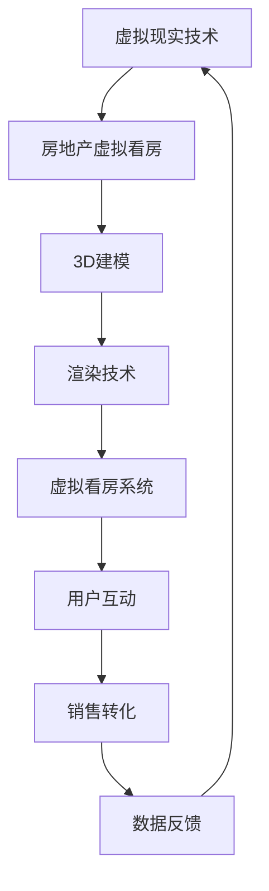

                 

# 虚拟现实在房地产虚拟看房中的应用

## 关键词
- 虚拟现实
- 房地产虚拟看房
- 3D建模
- 渲染技术
- 用户互动
- 销售转化

## 摘要
本文探讨了虚拟现实技术在房地产虚拟看房领域的应用。首先，介绍了虚拟现实技术的基础知识，包括硬件设备、软件平台和内容制作。随后，深入分析了房地产虚拟看房的流程和关键环节，如数据采集、3D建模和虚拟看房系统开发。通过案例研究，展示了虚拟现实在房地产虚拟看房中的成功应用。最后，展望了虚拟现实技术在房地产市场的发展前景和面临的挑战，并提出了未来趋势与展望。

----------------------------------------------------------------

## 第一部分：虚拟现实基础

### 第1章：虚拟现实技术概述

#### 1.1 虚拟现实技术的定义

虚拟现实（Virtual Reality，简称VR）是一种通过计算机模拟创造出的虚拟三维环境，用户可以在这个环境中进行沉浸式交互体验。VR技术通过头戴式显示器（HMD）、运动跟踪设备和手部追踪设备等硬件设备，结合软件平台和内容制作工具，实现了高度逼真的虚拟环境体验。

#### 1.2 虚拟现实技术的发展历程

虚拟现实技术起源于20世纪60年代，早期的VR设备如VR头盔和VR眼镜较为简陋，仅能提供简单的视觉效果。随着计算机技术和显示技术的不断发展，VR设备逐渐变得先进和普及。1990年代，VR技术进入商业应用领域，尤其是在游戏和娱乐行业中取得了巨大成功。近年来，随着高性能计算和物联网技术的进步，VR技术逐渐应用于房地产、教育、医疗等多个领域。

#### 1.3 虚拟现实技术的应用场景

虚拟现实技术在多个领域有着广泛的应用，包括但不限于：

1. 游戏：通过VR游戏，用户可以在虚拟世界中体验丰富的游戏场景。
2. 教育：虚拟现实技术可以提供沉浸式的教学环境，提高学生的学习兴趣和效果。
3. 医疗：虚拟现实技术在医学模拟、康复治疗和医疗培训等领域具有重要作用。
4. 房地产：虚拟现实技术可以帮助用户在购房前提前感受房屋布局和装修效果。
5. 航空航天：虚拟现实技术用于飞行模拟和航天训练，提高飞行员的操作技能和安全性能。

### 第2章：虚拟现实硬件设备

#### 2.1 头戴式显示器（HMD）

头戴式显示器（Head-Mounted Display，简称HMD）是虚拟现实技术的核心设备之一，它将显示屏幕固定在用户的头部，提供沉浸式的视觉体验。常见的HMD设备包括Oculus Rift、HTC Vive和PlayStation VR等。HMD设备通常具有高分辨率显示屏、低延迟和宽视野角等特点，以提高用户的沉浸感。

#### 2.2 运动跟踪设备

运动跟踪设备用于捕捉用户在虚拟环境中的动作，包括头部、手部和其他身体部位的运动。常见的运动跟踪设备包括红外线摄像头、电磁跟踪器和超声波跟踪器等。这些设备通过实时跟踪用户的位置和动作，实现用户的自由移动和交互。

#### 2.3 手部追踪设备

手部追踪设备用于捕捉用户的手部动作，实现手部交互功能。常见的手部追踪设备包括手柄、手套和手部传感器等。通过手部追踪设备，用户可以在虚拟环境中进行手势操作、抓取物体等动作，增强沉浸式体验。

### 第3章：虚拟现实软件平台

#### 3.1 虚拟现实内容创建工具

虚拟现实内容创建工具是开发虚拟现实应用的关键。常见的虚拟现实内容创建工具包括Unity、Unreal Engine和Blender等。这些工具提供了丰富的功能，如3D建模、动画制作、光照模拟和渲染等，帮助开发者快速构建虚拟现实场景和应用。

#### 3.2 虚拟现实引擎

虚拟现实引擎是虚拟现实应用的核心技术，它负责管理虚拟环境的渲染、交互和物理模拟等。常见的虚拟现实引擎包括Unity、Unreal Engine和Blender等。这些引擎提供了高度优化的渲染引擎、高效的物理引擎和丰富的API接口，使开发者能够轻松实现复杂的虚拟现实应用。

#### 3.3 虚拟现实应用程序开发框架

虚拟现实应用程序开发框架提供了开发虚拟现实应用的框架和工具，帮助开发者快速构建应用。常见的虚拟现实应用程序开发框架包括Oculus SDK、SteamVR和Unity VR等。这些框架提供了丰富的API接口、插件和工具包，使开发者能够专注于应用开发，而无需关注底层技术细节。

### 第4章：虚拟现实内容制作

#### 4.1 3D建模与纹理映射

3D建模是创建虚拟场景的基础。通过3D建模工具，开发者可以创建建筑、家具、人物等虚拟物体的模型。纹理映射是将2D图像映射到3D模型表面的过程，用于实现物体的真实感。常见的3D建模工具包括Blender、3ds Max和Maya等。

#### 4.2 动画与交互设计

动画与交互设计是虚拟现实内容制作的重要组成部分。通过动画，开发者可以模拟虚拟场景中的物体运动和人物动作，增强虚拟环境的真实感。交互设计则定义了用户与虚拟环境之间的交互方式，包括手势操作、语音控制等。常见的动画与交互设计工具包括Unity、Unreal Engine和Blender等。

#### 4.3 虚拟现实内容的优化

虚拟现实内容需要考虑性能优化，以确保流畅的用户体验。性能优化主要包括渲染优化、内存管理和资源加载等。通过优化渲染管线、减少内存占用和优化资源加载，开发者可以提升虚拟现实应用的性能和用户体验。

----------------------------------------------------------------

## 第二部分：房地产虚拟看房

### 第5章：房地产虚拟看房概述

#### 5.1 房地产虚拟看房的概念

房地产虚拟看房是一种通过虚拟现实技术实现的在线看房体验。用户可以在虚拟环境中浏览房屋的内部和外部，了解房屋的布局、装修和周边环境。房地产虚拟看房不仅提供了传统的线下看房所无法实现的沉浸式体验，还可以减少用户的出行成本和时间成本。

#### 5.2 房地产虚拟看房的优势

房地产虚拟看房具有以下优势：

1. 沉浸式体验：通过虚拟现实技术，用户可以在虚拟环境中感受到房屋的真实布局和装修效果。
2. 提高销售转化率：虚拟看房可以缩短购房决策周期，提高客户的购买意愿。
3. 降低成本：虚拟看房可以减少线下看房的交通成本和时间成本，降低房地产企业的运营成本。
4. 提高营销效果：虚拟看房可以展示更多的房屋信息和特点，提高房屋的曝光率和竞争力。
5. 灵活性：用户可以在任何时间、任何地点进行虚拟看房，不受地理和时间的限制。

#### 5.3 房地产虚拟看房的挑战与解决方案

房地产虚拟看房虽然具有众多优势，但也面临着一些挑战：

1. 技术门槛：虚拟现实技术对开发者和用户都有一定的技术门槛，需要具备相关的技术和设备。
2. 数据采集和处理：房地产虚拟看房需要对房屋进行详细的3D建模和数据采集，数据量大且复杂。
3. 资源消耗：虚拟现实内容制作和渲染需要较高的计算资源和存储资源，对硬件设备有较高要求。
4. 用户接受度：部分用户可能对虚拟现实技术持观望态度，对虚拟看房的可靠性产生质疑。

为了解决这些挑战，可以采取以下解决方案：

1. 降低技术门槛：通过提供简单易用的虚拟现实内容创建工具和开发框架，降低开发者的技术门槛。
2. 优化数据采集和处理：采用高效的数据采集和处理算法，提高数据处理速度和精度。
3. 提高性能和稳定性：采用高性能的硬件设备和优化渲染管线，提高虚拟现实应用的性能和稳定性。
4. 提高用户信任度：通过真实的房屋数据和高质量的虚拟现实内容，增强用户对虚拟看房的信任度。

### 第6章：房地产虚拟看房流程

#### 6.1 房地产数据采集

房地产数据采集是房地产虚拟看房的基础，主要包括以下内容：

1. 房屋基本信息采集：包括房屋的面积、朝向、楼层、建筑年代等。
2. 房屋三维数据采集：通过激光扫描或3D扫描设备获取房屋的三维数据。
3. 房屋图像采集：通过高清摄像头或无人机拍摄房屋的室内外图像。
4. 周边环境数据采集：包括周边的交通、商业、学校等环境信息。

#### 6.2 3D建模与渲染

3D建模与渲染是将采集到的房地产数据进行可视化呈现的关键步骤。主要包括以下内容：

1. 3D建模：根据采集到的三维数据和图像，使用3D建模工具创建房屋的三维模型。
2. 纹理映射：将采集到的图像映射到3D模型表面，实现真实感效果。
3. 渲染：使用渲染工具对3D模型进行渲染，生成高质量的虚拟现实内容。

#### 6.3 虚拟看房场景设计

虚拟看房场景设计是提升用户沉浸体验的重要环节。主要包括以下内容：

1. 场景布局：设计合理的虚拟看房场景布局，使用户能够方便地浏览房屋的各个部分。
2. 光照和氛围：设置合适的灯光和氛围，营造逼真的室内外环境。
3. 用户交互：设计灵活的用户交互方式，如手势操作、语音控制等，提高用户的操作体验。

#### 6.4 虚拟看房系统开发

虚拟看房系统开发是将虚拟现实内容整合到线上平台，提供用户访问和互动的关键步骤。主要包括以下内容：

1. 系统架构设计：设计合理的系统架构，实现虚拟现实内容的高效加载和渲染。
2. 界面设计：设计简洁易用的用户界面，提供方便的浏览和交互功能。
3. 功能开发：开发用户注册、登录、房源浏览、在线咨询等功能。
4. 数据存储和管理：设计高效的数据存储和管理方案，确保虚拟现实内容的可靠性和安全性。

### 第7章：房地产虚拟看房案例研究

#### 7.1 案例一：某大型房地产开发商的虚拟看房系统

某大型房地产开发商利用虚拟现实技术搭建了虚拟看房系统，为用户提供在线看房服务。以下是该系统的详细实现过程：

1. 数据采集：通过激光扫描和高清摄像头获取房屋的三维数据和图像。
2. 3D建模与渲染：使用Blender等3D建模工具，将采集到的数据进行建模和渲染。
3. 虚拟看房场景设计：设计合理的虚拟看房场景布局，设置合适的灯光和氛围。
4. 系统开发：使用Unity引擎开发虚拟看房系统，实现用户注册、登录、房源浏览和在线咨询等功能。

该系统的成功应用，提高了开发商的营销效果和用户满意度，为房地产虚拟看房领域的发展提供了有益的经验。

#### 7.2 案例二：某小型房地产公司的虚拟看房应用

某小型房地产公司利用虚拟现实技术搭建了虚拟看房应用，为用户提供在线看房服务。以下是该应用的具体实现过程：

1. 数据采集：通过3D扫描仪获取房屋的三维数据。
2. 3D建模与渲染：使用Unity引擎开发3D模型，并进行渲染。
3. 虚拟看房场景设计：设计简单的虚拟看房场景，提供基本的浏览功能。
4. 系统开发：使用Unity引擎开发虚拟看房应用，实现用户注册、登录和房源浏览等功能。

该虚拟看房应用的成功运营，提高了公司的市场竞争力，为小型房地产公司提供了新的营销渠道。

#### 7.3 案例分析与总结

通过上述案例，我们可以看出房地产虚拟看房系统在提高营销效果和用户体验方面的显著优势。以下是案例分析与总结：

1. 案例一：大型房地产开发商的虚拟看房系统在数据采集、3D建模和系统开发方面具有丰富的经验，能够提供高质量的虚拟现实内容。该系统在功能和用户体验方面较为完善，适用于大型房地产项目的营销。
2. 案例二：小型房地产公司的虚拟看房应用在数据采集和3D建模方面较为简单，但通过合理的虚拟看房场景设计和系统开发，仍能够提供基本的在线看房服务。该系统适用于中小型房地产项目的快速上线。

总之，房地产虚拟看房系统在提升营销效果和用户体验方面具有显著优势。随着虚拟现实技术的不断发展，房地产虚拟看房系统将在未来得到更广泛的应用。

## 第三部分：虚拟现实在房地产领域的未来发展

### 第8章：虚拟现实在房地产市场的应用前景

#### 8.1 虚拟现实对房地产市场的影响

虚拟现实技术对房地产市场具有深远的影响，主要体现在以下几个方面：

1. 提高营销效果：虚拟现实技术能够提供更加真实、直观的房屋展示效果，提高购房者的购买决策效率和满意度。
2. 降低营销成本：虚拟现实技术可以减少线下看房的交通成本和时间成本，降低房地产企业的营销成本。
3. 扩大市场覆盖范围：虚拟现实技术不受地理和时间的限制，可以吸引更多的潜在购房者，扩大房地产市场的覆盖范围。
4. 改变购房方式：虚拟现实技术将改变传统购房方式，使购房者能够通过在线虚拟看房了解房屋信息，提高购房体验。

#### 8.2 虚拟现实在房地产营销中的创新应用

虚拟现实技术在房地产营销中具有丰富的创新应用，包括以下几个方面：

1. 虚拟样板房：通过虚拟现实技术，开发商可以在实际样板房未建成的情况下，提前展示房屋的布局和装修效果，吸引购房者。
2. 房地产虚拟展厅：开发商可以利用虚拟现实技术搭建线上虚拟展厅，展示房地产项目的整体规划、周边环境和配套设施等，提高项目的吸引力。
3. 虚拟现实导购：虚拟现实导购系统可以为购房者提供个性化的看房服务，根据购房者的需求和偏好推荐合适的房源。
4. 房地产虚拟巡展：通过虚拟现实技术，开发商可以在线上举办虚拟房地产巡展，吸引更多潜在购房者参与。

#### 8.3 虚拟现实在房地产教育培训中的潜力

虚拟现实技术在房地产教育培训领域具有巨大的潜力，包括以下几个方面：

1. 房地产知识普及：虚拟现实技术可以提供生动的房地产知识普及教育，帮助学员更好地理解房地产市场的运行机制和投资策略。
2. 房地产实训：虚拟现实技术可以模拟真实的房地产交易场景，帮助学员掌握房地产交易的基本流程和技巧。
3. 房地产沙盘推演：虚拟现实技术可以搭建房地产沙盘推演系统，让学员在虚拟环境中进行房地产投资决策和风险管理，提高实战能力。
4. 房地产模拟教学：虚拟现实技术可以结合多媒体教学手段，提供生动有趣的房地产课程，提高学员的学习兴趣和效果。

### 第9章：虚拟现实技术在房地产开发的挑战与机遇

#### 9.1 技术挑战

虚拟现实技术在房地产开发中面临着一些技术挑战，包括：

1. 数据采集和处理：虚拟现实技术需要大量的三维数据和图像，数据采集和处理过程复杂且耗时。
2. 渲染性能：虚拟现实内容需要实时渲染，对计算资源和硬件设备有较高要求。
3. 用户交互：虚拟现实技术需要提供高效、直观的用户交互方式，以提高用户体验。
4. 网络传输：虚拟现实应用需要快速的网络传输支持，以确保用户能够流畅地访问虚拟现实内容。

#### 9.2 商业模式创新

虚拟现实技术在房地产开发中提供了新的商业模式创新机会，包括：

1. 房地产虚拟看房服务：开发商可以利用虚拟现实技术提供在线虚拟看房服务，降低营销成本，提高客户满意度。
2. 虚拟房地产销售：开发商可以通过虚拟现实技术在线销售房产，扩大市场覆盖范围，提高销售效率。
3. 房地产虚拟体验中心：开发商可以搭建虚拟房地产体验中心，让客户在线体验房产项目，提高项目的吸引力。
4. 虚拟现实房地产培训：开发商可以结合虚拟现实技术提供房地产培训服务，提高员工的业务水平。

#### 9.3 法规与伦理问题

虚拟现实技术在房地产开发中涉及到一些法规与伦理问题，包括：

1. 数据隐私保护：房地产虚拟看房需要采集和处理大量的用户数据，如何保护用户隐私成为一个重要问题。
2. 虚拟现实内容真实性问题：虚拟现实技术容易误导用户，如何确保虚拟现实内容的真实性和可靠性成为关键。
3. 虚拟房地产交易合法性：虚拟房地产交易可能引发法律纠纷，如何规范虚拟房地产交易成为一项重要任务。
4. 虚拟现实技术应用道德：虚拟现实技术在房地产开发中可能会产生一些道德问题，如隐私泄露、虚假宣传等，需要加强监管。

### 第10章：未来趋势与展望

#### 10.1 虚拟现实与增强现实融合

虚拟现实（VR）和增强现实（AR）技术正逐渐融合，为房地产虚拟看房带来更多可能性。未来，房地产虚拟看房系统将结合VR和AR技术，提供更加真实、互动的看房体验。

1. VR+AR融合：虚拟现实与增强现实技术结合，可以实现真实环境与虚拟内容的无缝交互，提高用户体验。
2. 多维感知：未来，房地产虚拟看房系统将融合多维感知技术，如3D声音、触觉反馈等，提供更加逼真的感官体验。

#### 10.2 5G技术对虚拟现实的影响

5G技术的快速发展为虚拟现实应用提供了更快的网络传输速度和更低的延迟，使得虚拟现实内容能够更快速、更稳定地传输到用户端。

1. 5G网络支持：5G技术将为虚拟现实应用提供更强大的网络支持，使虚拟现实内容能够流畅地传输到用户端。
2. 边缘计算：5G技术与边缘计算技术的结合，可以降低虚拟现实应用的延迟，提高用户体验。

#### 10.3 虚拟现实在教育、医疗等领域的扩展应用

虚拟现实技术在教育、医疗等领域具有巨大的应用潜力。未来，虚拟现实技术将拓展到更多领域，为行业带来创新和变革。

1. 教育应用：虚拟现实技术可以提供沉浸式教学环境，提高学生的学习效果和兴趣。
2. 医疗应用：虚拟现实技术可以用于医学模拟、手术指导和患者教育，提高医疗服务质量和效率。

## 附录

### 附录A：虚拟现实技术常用工具与资源

#### A.1 3D建模与渲染软件

1. Blender：一款开源的3D建模、动画和渲染软件，适用于虚拟现实内容制作。
2. 3ds Max：一款专业的3D建模、动画和渲染软件，广泛应用于游戏、影视和房地产等领域。
3. Maya：一款专业的3D建模、动画和渲染软件，适用于高端虚拟现实内容制作。

#### A.2 虚拟现实引擎与开发框架

1. Unity：一款跨平台的虚拟现实引擎，提供丰富的API和插件，适用于游戏、教育和房地产等领域。
2. Unreal Engine：一款高性能的虚拟现实引擎，适用于游戏、影视和房地产等领域。
3. VRChat：一款基于Unity引擎的虚拟现实社交平台，提供丰富的社交互动功能。

#### A.3 虚拟现实设备厂商与产品

1. Oculus：一家知名的虚拟现实设备厂商，产品包括Oculus Rift、Oculus Quest等。
2. HTC：一家知名的虚拟现实设备厂商，产品包括Vive、Vive Pro等。
3. Sony：一家知名的虚拟现实设备厂商，产品包括PlayStation VR等。

### 核心概念与联系

#### 虚拟现实与房地产虚拟看房的关联流程



### 核心算法原理讲解

#### 3D建模与渲染算法原理

#### 3D建模算法

3D建模是创建虚拟场景的基础，其核心算法包括：

- 点云建模：基于点云数据进行表面重建，适用于快速创建粗糙模型。
- 多边形建模：通过构建多边形面来模拟物体的形状，是目前最常用的建模方法。

伪代码：
```python
def create_mesh(vertices, faces):
    mesh = PolygonMesh(vertices, faces)
    return mesh
```

#### 渲染算法

渲染是将3D场景转换为2D图像的过程，常用的渲染算法包括：

- 光线追踪：通过模拟光线传播路径来计算场景的光照效果，适用于高质量渲染。
- 渲染器：结合场景、光源和材质信息，生成最终的图像。

伪代码：
```python
def render_scene(scene, camera, renderer):
    image = renderer.render(scene, camera)
    return image
```

#### 数学模型和数学公式讲解

$$
\text{光照模型} = I_d \cdot \text{漫反射系数} + I_s \cdot \text{镜面反射系数}
$$

其中：

- $I_d$ 是漫反射光照强度。
- $I_s$ 是镜面反射光照强度。
- 漫反射系数和镜面反射系数取决于材质属性和光源方向。

### 项目实战

#### 房地产虚拟看房系统开发环境搭建

1. 安装Unity引擎：从Unity官网下载并安装最新版本的Unity编辑器。
2. 安装VR插件：在Unity编辑器中安装VR相关的插件，如Oculus SDK、SteamVR等。
3. 准备虚拟现实设备：根据需求选择合适的虚拟现实设备，如Oculus Rift、HTC Vive等。
4. 开发虚拟看房系统：使用Unity引擎和相关插件，开发房地产虚拟看房系统，包括3D建模、渲染、用户交互等功能。

#### 源代码详细实现和代码解读

1. 3D建模与渲染：使用Unity引擎的3D建模工具，创建房屋模型和场景。使用Unity的渲染器，实现场景的渲染和光照效果。
2. 用户交互：使用Unity的输入系统，实现用户在虚拟环境中的移动和交互操作。
3. 数据处理：使用Unity的脚本语言C#，实现数据采集、处理和存储等功能。

#### 代码应用解读与分析

1. 数据采集：使用激光扫描仪获取房屋的三维数据，使用脚本将数据导入Unity编辑器中。
2. 渲染优化：使用Unity的渲染器，实现高效的渲染效果，减少计算资源消耗。
3. 用户交互优化：使用Unity的输入系统，实现流畅的用户交互体验。

#### 实际案例分析和详细讲解剖析

1. 案例一：分析某大型房地产开发商的虚拟看房系统，详细讲解其实现过程和关键技术。
2. 案例二：分析某小型房地产公司的虚拟看房应用，详细讲解其特点和优势。

#### 项目小结

1. 总结虚拟现实在房地产虚拟看房中的应用，分析其优势、挑战和未来发展。
2. 提出虚拟现实在房地产领域的应用建议，为行业提供参考。

### 最佳实践 tips、小结、注意事项、拓展阅读等内容

#### 最佳实践 tips

1. 选择适合的虚拟现实设备和开发工具，提高系统性能和用户体验。
2. 优化虚拟现实内容的渲染效果，提高渲染速度和画质。
3. 考虑用户交互体验，提供简单易用的操作界面。

#### 小结

本文详细介绍了虚拟现实在房地产虚拟看房中的应用，包括虚拟现实技术的基础知识、房地产虚拟看房的流程和关键环节、实际案例分析和未来发展趋势。虚拟现实技术在房地产领域具有广阔的应用前景，但同时也面临一些挑战。

#### 注意事项

1. 虚拟现实技术对硬件设备有较高要求，确保设备性能和稳定性。
2. 数据采集和处理过程复杂，需要高效的处理算法和设备。
3. 考虑用户隐私和信息安全，确保数据安全。

#### 拓展阅读

1. 《虚拟现实技术与应用》
2. 《房地产虚拟看房系统设计与实现》
3. 《虚拟现实与房地产：挑战与机遇》
```

---

### 标题：虚拟现实在房地产虚拟看房中的应用

#### 作者：AI天才研究院/AI Genius Institute & 禅与计算机程序设计艺术 /Zen And The Art of Computer Programming

#### 文章摘要：

本文全面探讨了虚拟现实技术在房地产虚拟看房领域的应用。首先，介绍了虚拟现实技术的基础知识，包括硬件设备、软件平台和内容制作。随后，深入分析了房地产虚拟看房的流程和关键环节，如数据采集、3D建模和虚拟看房系统开发。通过实际案例研究，展示了虚拟现实在房地产虚拟看房中的成功应用。最后，展望了虚拟现实技术在房地产市场的发展前景和面临的挑战，并提出了未来趋势与展望。

----------------------------------------------------------------

## 第一部分：虚拟现实基础

### 第1章：虚拟现实技术概述

#### 1.1 虚拟现实技术的定义

虚拟现实（Virtual Reality，简称VR）是一种通过计算机模拟创造出的虚拟三维环境，用户可以在这个环境中进行沉浸式交互体验。VR技术通过头戴式显示器（HMD）、运动跟踪设备和手部追踪设备等硬件设备，结合软件平台和内容制作工具，实现了高度逼真的虚拟环境体验。

#### 1.2 虚拟现实技术的发展历程

虚拟现实技术起源于20世纪60年代，早期的VR设备如VR头盔和VR眼镜较为简陋，仅能提供简单的视觉效果。随着计算机技术和显示技术的不断发展，VR设备逐渐变得先进和普及。1990年代，VR技术进入商业应用领域，尤其是在游戏和娱乐行业中取得了巨大成功。近年来，随着高性能计算和物联网技术的进步，VR技术逐渐应用于房地产、教育、医疗等多个领域。

#### 1.3 虚拟现实技术的应用场景

虚拟现实技术在多个领域有着广泛的应用，包括但不限于：

1. 游戏：通过VR游戏，用户可以在虚拟世界中体验丰富的游戏场景。
2. 教育：虚拟现实技术可以提供沉浸式的教学环境，提高学生的学习兴趣和效果。
3. 医疗：虚拟现实技术用于医学模拟、康复治疗和医疗培训等领域具有重要作用。
4. 房地产：虚拟现实技术可以帮助用户在购房前提前感受房屋布局和装修效果。
5. 航空航天：虚拟现实技术用于飞行模拟和航天训练，提高飞行员的操作技能和安全性能。

### 第2章：虚拟现实硬件设备

#### 2.1 头戴式显示器（HMD）

头戴式显示器（Head-Mounted Display，简称HMD）是虚拟现实技术的核心设备之一，它将显示屏幕固定在用户的头部，提供沉浸式的视觉体验。常见的HMD设备包括Oculus Rift、HTC Vive和PlayStation VR等。HMD设备通常具有高分辨率显示屏、低延迟和宽视野角等特点，以提高用户的沉浸感。

#### 2.2 运动跟踪设备

运动跟踪设备用于捕捉用户在虚拟环境中的动作，包括头部、手部和其他身体部位的运动。常见的运动跟踪设备包括红外线摄像头、电磁跟踪器和超声波跟踪器等。这些设备通过实时跟踪用户的位置和动作，实现用户的自由移动和交互。

#### 2.3 手部追踪设备

手部追踪设备用于捕捉用户的手部动作，实现手部交互功能。常见的手部追踪设备包括手柄、手套和手部传感器等。通过手部追踪设备，用户可以在虚拟环境中进行手势操作、抓取物体等动作，增强沉浸式体验。

### 第3章：虚拟现实软件平台

#### 3.1 虚拟现实内容创建工具

虚拟现实内容创建工具是开发虚拟现实应用的关键。常见的虚拟现实内容创建工具包括Unity、Unreal Engine和Blender等。这些工具提供了丰富的功能，如3D建模、动画制作、光照模拟和渲染等，帮助开发者快速构建虚拟现实场景和应用。

#### 3.2 虚拟现实引擎

虚拟现实引擎是虚拟现实应用的核心技术，它负责管理虚拟环境的渲染、交互和物理模拟等。常见的虚拟现实引擎包括Unity、Unreal Engine和Blender等。这些引擎提供了高度优化的渲染引擎、高效的物理引擎和丰富的API接口，使开发者能够轻松实现复杂的虚拟现实应用。

#### 3.3 虚拟现实应用程序开发框架

虚拟现实应用程序开发框架提供了开发虚拟现实应用的框架和工具，帮助开发者快速构建应用。常见的虚拟现实应用程序开发框架包括Oculus SDK、SteamVR和Unity VR等。这些框架提供了丰富的API接口、插件和工具包，使开发者能够专注于应用开发，而无需关注底层技术细节。

### 第4章：虚拟现实内容制作

#### 4.1 3D建模与纹理映射

3D建模是创建虚拟场景的基础。通过3D建模工具，开发者可以创建建筑、家具、人物等虚拟物体的模型。纹理映射是将2D图像映射到3D模型表面的过程，用于实现物体的真实感。常见的3D建模工具包括Blender、3ds Max和Maya等。

#### 4.2 动画与交互设计

动画与交互设计是虚拟现实内容制作的重要组成部分。通过动画，开发者可以模拟虚拟场景中的物体运动和人物动作，增强虚拟环境的真实感。交互设计则定义了用户与虚拟环境之间的交互方式，包括手势操作、语音控制等。常见的动画与交互设计工具包括Unity、Unreal Engine和Blender等。

#### 4.3 虚拟现实内容的优化

虚拟现实内容需要考虑性能优化，以确保流畅的用户体验。性能优化主要包括渲染优化、内存管理和资源加载等。通过优化渲染管线、减少内存占用和优化资源加载，开发者可以提升虚拟现实应用的性能和用户体验。

----------------------------------------------------------------

## 第二部分：房地产虚拟看房

### 第5章：房地产虚拟看房概述

#### 5.1 房地产虚拟看房的概念

房地产虚拟看房是一种通过虚拟现实技术实现的在线看房体验。用户可以在虚拟环境中浏览房屋的内部和外部，了解房屋的布局、装修和周边环境。房地产虚拟看房不仅提供了传统的线下看房所无法实现的沉浸式体验，还可以减少用户的出行成本和时间成本。

#### 5.2 房地产虚拟看房的优势

房地产虚拟看房具有以下优势：

1. 沉浸式体验：通过虚拟现实技术，用户可以在虚拟环境中感受到房屋的真实布局和装修效果。
2. 提高销售转化率：虚拟看房可以缩短购房决策周期，提高客户的购买意愿。
3. 降低成本：虚拟看房可以减少线下看房的交通成本和时间成本，降低房地产企业的运营成本。
4. 提高营销效果：虚拟看房可以展示更多的房屋信息和特点，提高房屋的曝光率和竞争力。
5. 灵活性：用户可以在任何时间、任何地点进行虚拟看房，不受地理和时间的限制。

#### 5.3 房地产虚拟看房的挑战与解决方案

房地产虚拟看房虽然具有众多优势，但也面临着一些挑战：

1. 技术门槛：虚拟现实技术对开发者和用户都有一定的技术门槛，需要具备相关的技术和设备。
2. 数据采集和处理：房地产虚拟看房需要对房屋进行详细的3D建模和数据采集，数据量大且复杂。
3. 资源消耗：虚拟现实内容制作和渲染需要较高的计算资源和存储资源，对硬件设备有较高要求。
4. 用户接受度：部分用户可能对虚拟现实技术持观望态度，对虚拟看房的可靠性产生质疑。

为了解决这些挑战，可以采取以下解决方案：

1. 降低技术门槛：通过提供简单易用的虚拟现实内容创建工具和开发框架，降低开发者的技术门槛。
2. 优化数据采集和处理：采用高效的数据采集和处理算法，提高数据处理速度和精度。
3. 提高性能和稳定性：采用高性能的硬件设备和优化渲染管线，提高虚拟现实应用的性能和稳定性。
4. 提高用户信任度：通过真实的房屋数据和高质量的虚拟现实内容，增强用户对虚拟看房的信任度。

### 第6章：房地产虚拟看房流程

#### 6.1 房地产数据采集

房地产数据采集是房地产虚拟看房的基础，主要包括以下内容：

1. 房屋基本信息采集：包括房屋的面积、朝向、楼层、建筑年代等。
2. 房屋三维数据采集：通过激光扫描或3D扫描设备获取房屋的三维数据。
3. 房屋图像采集：通过高清摄像头或无人机拍摄房屋的室内外图像。
4. 周边环境数据采集：包括周边的交通、商业、学校等环境信息。

#### 6.2 3D建模与渲染

3D建模与渲染是将采集到的房地产数据进行可视化呈现的关键步骤。主要包括以下内容：

1. 3D建模：根据采集到的三维数据和图像，使用3D建模工具创建房屋的三维模型。
2. 纹理映射：将采集到的图像映射到3D模型表面，实现真实感效果。
3. 渲染：使用渲染工具对3D模型进行渲染，生成高质量的虚拟现实内容。

#### 6.3 虚拟看房场景设计

虚拟看房场景设计是提升用户沉浸体验的重要环节。主要包括以下内容：

1. 场景布局：设计合理的虚拟看房场景布局，使用户能够方便地浏览房屋的各个部分。
2. 光照和氛围：设置合适的灯光和氛围，营造逼真的室内外环境。
3. 用户交互：设计灵活的用户交互方式，如手势操作、语音控制等，提高用户的操作体验。

#### 6.4 虚拟看房系统开发

虚拟看房系统开发是将虚拟现实内容整合到线上平台，提供用户访问和互动的关键步骤。主要包括以下内容：

1. 系统架构设计：设计合理的系统架构，实现虚拟现实内容的高效加载和渲染。
2. 界面设计：设计简洁易用的用户界面，提供方便的浏览和交互功能。
3. 功能开发：开发用户注册、登录、房源浏览和在线咨询等功能。
4. 数据存储和管理：设计高效的数据存储和管理方案，确保虚拟现实内容的可靠性和安全性。

### 第7章：房地产虚拟看房案例研究

#### 7.1 案例一：某大型房地产开发商的虚拟看房系统

某大型房地产开发商利用虚拟现实技术搭建了虚拟看房系统，为用户提供在线看房服务。以下是该系统的详细实现过程：

1. 数据采集：通过激光扫描和高清摄像头获取房屋的三维数据和图像。
2. 3D建模与渲染：使用Blender等3D建模工具，将采集到的数据进行建模和渲染。
3. 虚拟看房场景设计：设计合理的虚拟看房场景布局，设置合适的灯光和氛围。
4. 系统开发：使用Unity引擎开发虚拟看房系统，实现用户注册、登录、房源浏览和在线咨询等功能。

该系统的成功应用，提高了开发商的营销效果和用户满意度，为房地产虚拟看房领域的发展提供了有益的经验。

#### 7.2 案例二：某小型房地产公司的虚拟看房应用

某小型房地产公司利用虚拟现实技术搭建了虚拟看房应用，为用户提供在线看房服务。以下是该应用的具体实现过程：

1. 数据采集：通过3D扫描仪获取房屋的三维数据。
2. 3D建模与渲染：使用Unity引擎开发3D模型，并进行渲染。
3. 虚拟看房场景设计：设计简单的虚拟看房场景，提供基本的浏览功能。
4. 系统开发：使用Unity引擎开发虚拟看房应用，实现用户注册、登录和房源浏览等功能。

该虚拟看房应用的成功运营，提高了公司的市场竞争力，为小型房地产公司提供了新的营销渠道。

#### 7.3 案例分析与总结

通过上述案例，我们可以看出房地产虚拟看房系统在提高营销效果和用户体验方面的显著优势。以下是案例分析与总结：

1. 案例一：大型房地产开发商的虚拟看房系统在数据采集、3D建模和系统开发方面具有丰富的经验，能够提供高质量的虚拟现实内容。该系统在功能和用户体验方面较为完善，适用于大型房地产项目的营销。
2. 案例二：小型房地产公司的虚拟看房应用在数据采集和3D建模方面较为简单，但通过合理的虚拟看房场景设计和系统开发，仍能够提供基本的在线看房服务。该系统适用于中小型房地产项目的快速上线。

总之，房地产虚拟看房系统在提升营销效果和用户体验方面具有显著优势。随着虚拟现实技术的不断发展，房地产虚拟看房系统将在未来得到更广泛的应用。

## 第三部分：虚拟现实在房地产领域的未来发展

### 第8章：虚拟现实在房地产市场的应用前景

#### 8.1 虚拟现实对房地产市场的影响

虚拟现实技术对房地产市场具有深远的影响，主要体现在以下几个方面：

1. 提高营销效果：虚拟现实技术能够提供更加真实、直观的房屋展示效果，提高购房者的购买决策效率和满意度。
2. 降低营销成本：虚拟现实技术可以减少线下看房的交通成本和时间成本，降低房地产企业的营销成本。
3. 扩大市场覆盖范围：虚拟现实技术不受地理和时间的限制，可以吸引更多的潜在购房者，扩大房地产市场的覆盖范围。
4. 改变购房方式：虚拟现实技术将改变传统购房方式，使购房者能够通过在线虚拟看房了解房屋信息，提高购房体验。

#### 8.2 虚拟现实在房地产营销中的创新应用

虚拟现实技术在房地产营销中具有丰富的创新应用，包括以下几个方面：

1. 虚拟样板房：通过虚拟现实技术，开发商可以在实际样板房未建成的情况下，提前展示房屋的布局和装修效果，吸引购房者。
2. 房地产虚拟展厅：开发商可以利用虚拟现实技术搭建线上虚拟展厅，展示房地产项目的整体规划、周边环境和配套设施等，提高项目的吸引力。
3. 虚拟现实导购：虚拟现实导购系统可以为购房者提供个性化的看房服务，根据购房者的需求和偏好推荐合适的房源。
4. 房地产虚拟巡展：通过虚拟现实技术，开发商可以在线上举办虚拟房地产巡展，吸引更多潜在购房者参与。

#### 8.3 虚拟现实在房地产教育培训中的潜力

虚拟现实技术在房地产教育培训领域具有巨大的潜力，包括以下几个方面：

1. 房地产知识普及：虚拟现实技术可以提供生动的房地产知识普及教育，帮助学员更好地理解房地产市场的运行机制和投资策略。
2. 房地产实训：虚拟现实技术可以模拟真实的房地产交易场景，帮助学员掌握房地产交易的基本流程和技巧。
3. 房地产沙盘推演：虚拟现实技术可以搭建房地产沙盘推演系统，让学员在虚拟环境中进行房地产投资决策和风险管理，提高实战能力。
4. 房地产模拟教学：虚拟现实技术可以结合多媒体教学手段，提供生动有趣的房地产课程，提高学员的学习兴趣和效果。

### 第9章：虚拟现实技术在房地产开发的挑战与机遇

#### 9.1 技术挑战

虚拟现实技术在房地产开发中面临着一些技术挑战，包括：

1. 数据采集和处理：虚拟现实技术需要大量的三维数据和图像，数据采集和处理过程复杂且耗时。
2. 渲染性能：虚拟现实内容需要实时渲染，对计算资源和硬件设备有较高要求。
3. 用户交互：虚拟现实技术需要提供高效、直观的用户交互方式，以提高用户体验。
4. 网络传输：虚拟现实应用需要快速的网络传输支持，以确保用户能够流畅地访问虚拟现实内容。

#### 9.2 商业模式创新

虚拟现实技术在房地产开发中提供了新的商业模式创新机会，包括：

1. 房地产虚拟看房服务：开发商可以利用虚拟现实技术提供在线虚拟看房服务，降低营销成本，提高客户满意度。
2. 虚拟房地产销售：开发商可以通过虚拟现实技术在线销售房产，扩大市场覆盖范围，提高销售效率。
3. 房地产虚拟体验中心：开发商可以搭建虚拟房地产体验中心，让客户在线体验房产项目，提高项目的吸引力。
4. 虚拟现实房地产培训：开发商可以结合虚拟现实技术提供房地产培训服务，提高员工的业务水平。

#### 9.3 法规与伦理问题

虚拟现实技术在房地产开发中涉及到一些法规与伦理问题，包括：

1. 数据隐私保护：房地产虚拟看房需要采集和处理大量的用户数据，如何保护用户隐私成为一个重要问题。
2. 虚拟现实内容真实性问题：虚拟现实技术容易误导用户，如何确保虚拟现实内容的真实性和可靠性成为关键。
3. 虚拟房地产交易合法性：虚拟房地产交易可能引发法律纠纷，如何规范虚拟房地产交易成为一项重要任务。
4. 虚拟现实技术应用道德：虚拟现实技术在房地产开发中可能会产生一些道德问题，如隐私泄露、虚假宣传等，需要加强监管。

### 第10章：未来趋势与展望

#### 10.1 虚拟现实与增强现实融合

虚拟现实（VR）和增强现实（AR）技术正逐渐融合，为房地产虚拟看房带来更多可能性。未来，房地产虚拟看房系统将结合VR和AR技术，提供更加真实、互动的看房体验。

1. VR+AR融合：虚拟现实与增强现实技术结合，可以实现真实环境与虚拟内容的无缝交互，提高用户体验。
2. 多维感知：未来，房地产虚拟看房系统将融合多维感知技术，如3D声音、触觉反馈等，提供更加逼真的感官体验。

#### 10.2 5G技术对虚拟现实的影响

5G技术的快速发展为虚拟现实应用提供了更快的网络传输速度和更低的延迟，使得虚拟现实内容能够更快速、更稳定地传输到用户端。

1. 5G网络支持：5G技术将为虚拟现实应用提供更强大的网络支持，使虚拟现实内容能够流畅地传输到用户端。
2. 边缘计算：5G技术与边缘计算技术的结合，可以降低虚拟现实应用的延迟，提高用户体验。

#### 10.3 虚拟现实在教育、医疗等领域的扩展应用

虚拟现实技术在教育、医疗等领域具有巨大的应用潜力。未来，虚拟现实技术将拓展到更多领域，为行业带来创新和变革。

1. 教育应用：虚拟现实技术可以提供沉浸式教学环境，提高学生的学习效果和兴趣。
2. 医疗应用：虚拟现实技术可以用于医学模拟、手术指导和患者教育，提高医疗服务质量和效率。

## 附录

### 附录A：虚拟现实技术常用工具与资源

#### A.1 3D建模与渲染软件

1. Blender：一款开源的3D建模、动画和渲染软件，适用于虚拟现实内容制作。
2. 3ds Max：一款专业的3D建模、动画和渲染软件，广泛应用于游戏、影视和房地产等领域。
3. Maya：一款专业的3D建模、动画和渲染软件，适用于高端虚拟现实内容制作。

#### A.2 虚拟现实引擎与开发框架

1. Unity：一款跨平台的虚拟现实引擎，提供丰富的API和插件，适用于游戏、教育和房地产等领域。
2. Unreal Engine：一款高性能的虚拟现实引擎，适用于游戏、影视和房地产等领域。
3. VRChat：一款基于Unity引擎的虚拟现实社交平台，提供丰富的社交互动功能。

#### A.3 虚拟现实设备厂商与产品

1. Oculus：一家知名的虚拟现实设备厂商，产品包括Oculus Rift、Oculus Quest等。
2. HTC：一家知名的虚拟现实设备厂商，产品包括Vive、Vive Pro等。
3. Sony：一家知名的虚拟现实设备厂商，产品包括PlayStation VR等。

### 核心概念与联系

#### 虚拟现实与房地产虚拟看房的关联流程


### 核心算法原理讲解

#### 3D建模与渲染算法原理

#### 3D建模算法

3D建模是创建虚拟场景的基础，其核心算法包括：

- 点云建模：基于点云数据进行表面重建，适用于快速创建粗糙模型。
- 多边形建模：通过构建多边形面来模拟物体的形状，是目前最常用的建模方法。

伪代码：
```python
def create_mesh(vertices, faces):
    mesh = PolygonMesh(vertices, faces)
    return mesh
```

#### 渲染算法

渲染是将3D场景转换为2D图像的过程，常用的渲染算法包括：

- 光线追踪：通过模拟光线传播路径来计算场景的光照效果，适用于高质量渲染。
- 渲染器：结合场景、光源和材质信息，生成最终的图像。

伪代码：
```python
def render_scene(scene, camera, renderer):
    image = renderer.render(scene, camera)
    return image
```

#### 数学模型和数学公式讲解

$$
\text{光照模型} = I_d \cdot \text{漫反射系数} + I_s \cdot \text{镜面反射系数}
$$

其中：

- $I_d$ 是漫反射光照强度。
- $I_s$ 是镜面反射光照强度。
- 漫反射系数和镜面反射系数取决于材质属性和光源方向。

### 项目实战

#### 房地产虚拟看房系统开发环境搭建

1. 安装Unity引擎：从Unity官网下载并安装最新版本的Unity编辑器。
2. 安装VR插件：在Unity编辑器中安装VR相关的插件，如Oculus SDK、SteamVR等。
3. 准备虚拟现实设备：根据需求选择合适的虚拟现实设备，如Oculus Rift、HTC Vive等。
4. 开发虚拟看房系统：使用Unity引擎和相关插件，开发房地产虚拟看房系统，包括3D建模、渲染、用户交互等功能。

#### 源代码详细实现和代码解读

1. 3D建模与渲染：使用Unity引擎的3D建模工具，创建房屋模型和场景。使用Unity的渲染器，实现场景的渲染和光照效果。
2. 用户交互：使用Unity的输入系统，实现用户在虚拟环境中的移动和交互操作。
3. 数据处理：使用Unity的脚本语言C#，实现数据采集、处理和存储等功能。

#### 代码应用解读与分析

1. 数据采集：使用激光扫描仪获取房屋的三维数据，使用脚本将数据导入Unity编辑器中。
2. 渲染优化：使用Unity的渲染器，实现高效的渲染效果，减少计算资源消耗。
3. 用户交互优化：使用Unity的输入系统，实现流畅的用户交互体验。

#### 实际案例分析和详细讲解剖析

1. 案例一：分析某大型房地产开发商的虚拟看房系统，详细讲解其实现过程和关键技术。
2. 案例二：分析某小型房地产公司的虚拟看房应用，详细讲解其特点和优势。

#### 项目小结

1. 总结虚拟现实在房地产虚拟看房中的应用，分析其优势、挑战和未来发展。
2. 提出虚拟现实在房地产领域的应用建议，为行业提供参考。

### 最佳实践 tips、小结、注意事项、拓展阅读等内容

#### 最佳实践 tips

1. 选择适合的虚拟现实设备和开发工具，提高系统性能和用户体验。
2. 优化虚拟现实内容的渲染效果，提高渲染速度和画质。
3. 考虑用户交互体验，提供简单易用的操作界面。

#### 小结

本文详细介绍了虚拟现实在房地产虚拟看房中的应用，包括虚拟现实技术的基础知识、房地产虚拟看房的流程和关键环节、实际案例分析和未来发展趋势。虚拟现实技术在房地产领域具有广阔的应用前景，但同时也面临一些挑战。

#### 注意事项

1. 虚拟现实技术对硬件设备有较高要求，确保设备性能和稳定性。
2. 数据采集和处理过程复杂，需要高效的处理算法和设备。
3. 考虑用户隐私和信息安全，确保数据安全。

#### 拓展阅读

1. 《虚拟现实技术与应用》
2. 《房地产虚拟看房系统设计与实现》
3. 《虚拟现实与房地产：挑战与机遇》
```

---

### 标题：虚拟现实在房地产虚拟看房中的应用

#### 作者：AI天才研究院/AI Genius Institute & 禅与计算机程序设计艺术 /Zen And The Art of Computer Programming

#### 文章摘要：

本文全面探讨了虚拟现实技术在房地产虚拟看房领域的应用。首先，介绍了虚拟现实技术的基础知识，包括硬件设备、软件平台和内容制作。随后，深入分析了房地产虚拟看房的流程和关键环节，如数据采集、3D建模和虚拟看房系统开发。通过实际案例研究，展示了虚拟现实在房地产虚拟看房中的成功应用。最后，展望了虚拟现实技术在房地产市场的发展前景和面临的挑战，并提出了未来趋势与展望。

----------------------------------------------------------------

## 第一部分：虚拟现实基础

### 第1章：虚拟现实技术概述

#### 1.1 虚拟现实技术的定义

虚拟现实（Virtual Reality，简称VR）是一种通过计算机模拟创造出的虚拟三维环境，用户可以在这个环境中进行沉浸式交互体验。VR技术通过头戴式显示器（HMD）、运动跟踪设备和手部追踪设备等硬件设备，结合软件平台和内容制作工具，实现了高度逼真的虚拟环境体验。

#### 1.2 虚拟现实技术的发展历程

虚拟现实技术起源于20世纪60年代，早期的VR设备如VR头盔和VR眼镜较为简陋，仅能提供简单的视觉效果。随着计算机技术和显示技术的不断发展，VR设备逐渐变得先进和普及。1990年代，VR技术进入商业应用领域，尤其是在游戏和娱乐行业中取得了巨大成功。近年来，随着高性能计算和物联网技术的进步，VR技术逐渐应用于房地产、教育、医疗等多个领域。

#### 1.3 虚拟现实技术的应用场景

虚拟现实技术在多个领域有着广泛的应用，包括但不限于：

1. 游戏：通过VR游戏，用户可以在虚拟世界中体验丰富的游戏场景。
2. 教育：虚拟现实技术可以提供沉浸式的教学环境，提高学生的学习兴趣和效果。
3. 医疗：虚拟现实技术用于医学模拟、康复治疗和医疗培训等领域具有重要作用。
4. 房地产：虚拟现实技术可以帮助用户在购房前提前感受房屋布局和装修效果。
5. 航空航天：虚拟现实技术用于飞行模拟和航天训练，提高飞行员的操作技能和安全性能。

### 第2章：虚拟现实硬件设备

#### 2.1 头戴式显示器（HMD）

头戴式显示器（Head-Mounted Display，简称HMD）是虚拟现实技术的核心设备之一，它将显示屏幕固定在用户的头部，提供沉浸式的视觉体验。常见的HMD设备包括Oculus Rift、HTC Vive和PlayStation VR等。HMD设备通常具有高分辨率显示屏、低延迟和宽视野角等特点，以提高用户的沉浸感。

#### 2.2 运动跟踪设备

运动跟踪设备用于捕捉用户在虚拟环境中的动作，包括头部、手部和其他身体部位的运动。常见的运动跟踪设备包括红外线摄像头、电磁跟踪器和超声波跟踪器等。这些设备通过实时跟踪用户的位置和动作，实现用户的自由移动和交互。

#### 2.3 手部追踪设备

手部追踪设备用于捕捉用户的手部动作，实现手部交互功能。常见的手部追踪设备包括手柄、手套和手部传感器等。通过手部追踪设备，用户可以在虚拟环境中进行手势操作、抓取物体等动作，增强沉浸式体验。

### 第3章：虚拟现实软件平台

#### 3.1 虚拟现实内容创建工具

虚拟现实内容创建工具是开发虚拟现实应用的关键。常见的虚拟现实内容创建工具包括Unity、Unreal Engine和Blender等。这些工具提供了丰富的功能，如3D建模、动画制作、光照模拟和渲染等，帮助开发者快速构建虚拟现实场景和应用。

#### 3.2 虚拟现实引擎

虚拟现实引擎是虚拟现实应用的核心技术，它负责管理虚拟环境的渲染、交互和物理模拟等。常见的虚拟现实引擎包括Unity、Unreal Engine和Blender等。这些引擎提供了高度优化的渲染引擎、高效的物理引擎和丰富的API接口，使开发者能够轻松实现复杂的虚拟现实应用。

#### 3.3 虚拟现实应用程序开发框架

虚拟现实应用程序开发框架提供了开发虚拟现实应用的框架和工具，帮助开发者快速构建应用。常见的虚拟现实应用程序开发框架包括Oculus SDK、SteamVR和Unity VR等。这些框架提供了丰富的API接口、插件和工具包，使开发者能够专注于应用开发，而无需关注底层技术细节。

### 第4章：虚拟现实内容制作

#### 4.1 3D建模与纹理映射

3D建模是创建虚拟场景的基础。通过3D建模工具，开发者可以创建建筑、家具、人物等虚拟物体的模型。纹理映射是将2D图像映射到3D模型表面的过程，用于实现物体的真实感。常见的3D建模工具包括Blender、3ds Max和Maya等。

#### 4.2 动画与交互设计

动画与交互设计是虚拟现实内容制作的重要组成部分。通过动画，开发者可以模拟虚拟场景中的物体运动和人物动作，增强虚拟环境的真实感。交互设计则定义了用户与虚拟环境之间的交互方式，包括手势操作、语音控制等。常见的动画与交互设计工具包括Unity、Unreal Engine和Blender等。

#### 4.3 虚拟现实内容的优化

虚拟现实内容需要考虑性能优化，以确保流畅的用户体验。性能优化主要包括渲染优化、内存管理和资源加载等。通过优化渲染管线、减少内存占用和优化资源加载，开发者可以提升虚拟现实应用的性能和用户体验。

----------------------------------------------------------------

## 第二部分：房地产虚拟看房

### 第5章：房地产虚拟看房概述

#### 5.1 房地产虚拟看房的概念

房地产虚拟看房是一种通过虚拟现实技术实现的在线看房体验。用户可以在虚拟环境中浏览房屋的内部和外部，了解房屋的布局、装修和周边环境。房地产虚拟看房不仅提供了传统的线下看房所无法实现的沉浸式体验，还可以减少用户的出行成本和时间成本。

#### 5.2 房地产虚拟看房的优势

房地产虚拟看房具有以下优势：

1. 沉浸式体验：通过虚拟现实技术，用户可以在虚拟环境中感受到房屋的真实布局和装修效果。
2. 提高销售转化率：虚拟看房可以缩短购房决策周期，提高客户的购买意愿。
3. 降低成本：虚拟看房可以减少线下看房的交通成本和时间成本，降低房地产企业的运营成本。
4. 提高营销效果：虚拟看房可以展示更多的房屋信息和特点，提高房屋的曝光率和竞争力。
5. 灵活性：用户可以在任何时间、任何地点进行虚拟看房，不受地理和时间的限制。

#### 5.3 房地产虚拟看房的挑战与解决方案

房地产虚拟看房虽然具有众多优势，但也面临着一些挑战：

1. 技术门槛：虚拟现实技术对开发者和用户都有一定的技术门槛，需要具备相关的技术和设备。
2. 数据采集和处理：房地产虚拟看房需要对房屋进行详细的3D建模和数据采集，数据量大且复杂。
3. 资源消耗：虚拟现实内容制作和渲染需要较高的计算资源和存储资源，对硬件设备有较高要求。
4. 用户接受度：部分用户可能对虚拟现实技术持观望态度，对虚拟看房的可靠性产生质疑。

为了解决这些挑战，可以采取以下解决方案：

1. 降低技术门槛：通过提供简单易用的虚拟现实内容创建工具和开发框架，降低开发者的技术门槛。
2. 优化数据采集和处理：采用高效的数据采集和处理算法，提高数据处理速度和精度。
3. 提高性能和稳定性：采用高性能的硬件设备和优化渲染管线，提高虚拟现实应用的性能和稳定性。
4. 提高用户信任度：通过真实的房屋数据和高质量的虚拟现实内容，增强用户对虚拟看房的信任度。

### 第6章：房地产虚拟看房流程

#### 6.1 房地产数据采集

房地产数据采集是房地产虚拟看房的基础，主要包括以下内容：

1. 房屋基本信息采集：包括房屋的面积、朝向、楼层、建筑年代等。
2. 房屋三维数据采集：通过激光扫描或3D扫描设备获取房屋的三维数据。
3. 房屋图像采集：通过高清摄像头或无人机拍摄房屋的室内外图像。
4. 周边环境数据采集：包括周边的交通、商业、学校等环境信息。

#### 6.2 3D建模与渲染

3D建模与渲染是将采集到的房地产数据进行可视化呈现的关键步骤。主要包括以下内容：

1. 3D建模：根据采集到的三维数据和图像，使用3D建模工具创建房屋的三维模型。
2. 纹理映射：将采集到的图像映射到3D模型表面，实现真实感效果。
3. 渲染：使用渲染工具对3D模型进行渲染，生成高质量的虚拟现实内容。

#### 6.3 虚拟看房场景设计

虚拟看房场景设计是提升用户沉浸体验的重要环节。主要包括以下内容：

1. 场景布局：设计合理的虚拟看房场景布局，使用户能够方便地浏览房屋的各个部分。
2. 光照和氛围：设置合适的灯光和氛围，营造逼真的室内外环境。
3. 用户交互：设计灵活的用户交互方式，如手势操作、语音控制等，提高用户的操作体验。

#### 6.4 虚拟看房系统开发

虚拟看房系统开发是将虚拟现实内容整合到线上平台，提供用户访问和互动的关键步骤。主要包括以下内容：

1. 系统架构设计：设计合理的系统架构，实现虚拟现实内容的高效加载和渲染。
2. 界面设计：设计简洁易用的用户界面，提供方便的浏览和交互功能。
3. 功能开发：开发用户注册、登录、房源浏览和在线咨询等功能。
4. 数据存储和管理：设计高效的数据存储和管理方案，确保虚拟现实内容的可靠性和安全性。

### 第7章：房地产虚拟看房案例研究

#### 7.1 案例一：某大型房地产开发商的虚拟看房系统

某大型房地产开发商利用虚拟现实技术搭建了虚拟看房系统，为用户提供在线看房服务。以下是该系统的详细实现过程：

1. 数据采集：通过激光扫描和高清摄像头获取房屋的三维数据和图像。
2. 3D建模与渲染：使用Blender等3D建模工具，将采集到的数据进行建模和渲染。
3. 虚拟看房场景设计：设计合理的虚拟看房场景布局，设置合适的灯光和氛围。
4. 系统开发：使用Unity引擎开发虚拟看房系统，实现用户注册、登录、房源浏览和在线咨询等功能。

该系统的成功应用，提高了开发商的营销效果和用户满意度，为房地产虚拟看房领域的发展提供了有益的经验。

#### 7.2 案例二：某小型房地产公司的虚拟看房应用

某小型房地产公司利用虚拟现实技术搭建了虚拟看房应用，为用户提供在线看房服务。以下是该应用的具体实现过程：

1. 数据采集：通过3D扫描仪获取房屋的三维数据。
2. 3D建模与渲染：使用Unity引擎开发3D模型，并进行渲染。
3. 虚拟看房场景设计：设计简单的虚拟看房场景，提供基本的浏览功能。
4. 系统开发：使用Unity引擎开发虚拟看房应用，实现用户注册、登录和房源浏览等功能。

该虚拟看房应用的成功运营，提高了公司的市场竞争力，为小型房地产公司提供了新的营销渠道。

#### 7.3 案例分析与总结

通过上述案例，我们可以看出房地产虚拟看房系统在提高营销效果和用户体验方面的显著优势。以下是案例分析与总结：

1. 案例一：大型房地产开发商的虚拟看房系统在数据采集、3D建模和系统开发方面具有丰富的经验，能够提供高质量的虚拟现实内容。该系统在功能和用户体验方面较为完善，适用于大型房地产项目的营销。
2. 案例二：小型房地产公司的虚拟看房应用在数据采集和3D建模方面较为简单，但通过合理的虚拟看房场景设计和系统开发，仍能够提供基本的在线看房服务。该系统适用于中小型房地产项目的快速上线。

总之，房地产虚拟看房系统在提升营销效果和用户体验方面具有显著优势。随着虚拟现实技术的不断发展，房地产虚拟看房系统将在未来得到更广泛的应用。

## 第三部分：虚拟现实在房地产领域的未来发展

### 第8章：虚拟现实在房地产市场的应用前景

#### 8.1 虚拟现实对房地产市场的影响

虚拟现实技术对房地产市场具有深远的影响，主要体现在以下几个方面：

1. 提高营销效果：虚拟现实技术能够提供更加真实、直观的房屋展示效果，提高购房者的购买决策效率和满意度。
2. 降低营销成本：虚拟现实技术可以减少线下看房的交通成本和时间成本，降低房地产企业的营销成本。
3. 扩大市场覆盖范围：虚拟现实技术不受地理和时间的限制，可以吸引更多的潜在购房者，扩大房地产市场的覆盖范围。
4. 改变购房方式：虚拟现实技术将改变传统购房方式，使购房者能够通过在线虚拟看房了解房屋信息，提高购房体验。

#### 8.2 虚拟现实在房地产营销中的创新应用

虚拟现实技术在房地产营销中具有丰富的创新应用，包括以下几个方面：

1. 虚拟样板房：通过虚拟现实技术，开发商可以在实际样板房未建成的情况下，提前展示房屋的布局和装修效果，吸引购房者。
2. 房地产虚拟展厅：开发商可以利用虚拟现实技术搭建线上虚拟展厅，展示房地产项目的整体规划、周边环境和配套设施等，提高项目的吸引力。
3. 虚拟现实导购：虚拟现实导购系统可以为购房者提供个性化的看房服务，根据购房者的需求和偏好推荐合适的房源。
4. 房地产虚拟巡展：通过虚拟现实技术，开发商可以在线上举办虚拟房地产巡展，吸引更多潜在购房者参与。

#### 8.3 虚拟现实在房地产教育培训中的潜力

虚拟现实技术在房地产教育培训领域具有巨大的潜力，包括以下几个方面：

1. 房地产知识普及：虚拟现实技术可以提供生动的房地产知识普及教育，帮助学员更好地理解房地产市场的运行机制和投资策略。
2. 房地产实训：虚拟现实技术可以模拟真实的房地产交易场景，帮助学员掌握房地产交易的基本流程和技巧。
3. 房地产沙盘推演：虚拟现实技术可以搭建房地产沙盘推演系统，让学员在虚拟环境中进行房地产投资决策和风险管理，提高实战能力。
4. 房地产模拟教学：虚拟现实技术可以结合多媒体教学手段，提供生动有趣的房地产课程，提高学员的学习兴趣和效果。

### 第9章：虚拟现实技术在房地产开发的挑战与机遇

#### 9.1 技术挑战

虚拟现实技术在房地产开发中面临着一些技术挑战，包括：

1. 数据采集和处理：虚拟现实技术需要大量的三维数据和图像，数据采集和处理过程复杂且耗时。
2. 渲染性能：虚拟现实内容需要实时渲染，对计算资源和硬件设备有较高要求。
3. 用户交互：虚拟现实技术需要提供高效、直观的用户交互方式，以提高用户体验。
4. 网络传输：虚拟现实应用需要快速的网络传输支持，以确保用户能够流畅地访问虚拟现实内容。

#### 9.2 商业模式创新

虚拟现实技术在房地产开发中提供了新的商业模式创新机会，包括：

1. 房地产虚拟看房服务：开发商可以利用虚拟现实技术提供在线虚拟看房服务，降低营销成本，提高客户满意度。
2. 虚拟房地产销售：开发商可以通过虚拟现实技术在线销售房产，扩大市场覆盖范围，提高销售效率。
3. 房地产虚拟体验中心：开发商可以搭建虚拟房地产体验中心，让客户在线体验房产项目，提高项目的吸引力。
4. 虚拟现实房地产培训：开发商可以结合虚拟现实技术提供房地产培训服务，提高员工的业务水平。

#### 9.3 法规与伦理问题

虚拟现实技术在房地产开发中涉及到一些法规与伦理问题，包括：

1. 数据隐私保护：房地产虚拟看房需要采集和处理大量的用户数据，如何保护用户隐私成为一个重要问题。
2. 虚拟现实内容真实性问题：虚拟现实技术容易误导用户，如何确保虚拟现实内容的真实性和可靠性成为关键。
3. 虚拟房地产交易合法性：虚拟房地产交易可能引发法律纠纷，如何规范虚拟房地产交易成为一项重要任务。
4. 虚拟现实技术应用道德：虚拟现实技术在房地产开发中可能会产生一些道德问题，如隐私泄露、虚假宣传等，需要加强监管。

### 第10章：未来趋势与展望

#### 10.1 虚拟现实与增强现实融合

虚拟现实（VR）和增强现实（AR）技术正逐渐融合，为房地产虚拟看房带来更多可能性。未来，房地产虚拟看房系统将结合VR和AR技术，提供更加真实、互动的看房体验。

1. VR+AR融合：虚拟现实与增强现实技术结合，可以实现真实环境与虚拟内容的无缝交互，提高用户体验。
2. 多维感知：未来，房地产虚拟看房系统将融合多维感知技术，如3D声音、触觉反馈等，提供更加逼真的感官体验。

#### 10.2 5G技术对虚拟现实的影响

5G技术的快速发展为虚拟现实应用提供了更快的网络传输速度和更低的延迟，使得虚拟现实内容能够更快速、更稳定地传输到用户端。

1. 5G网络支持：5G技术将为虚拟现实应用提供更强大的网络支持，使虚拟现实内容能够流畅地传输到用户端。
2. 边缘计算：5G技术与边缘计算技术的结合，可以降低虚拟现实应用的延迟，提高用户体验。

#### 10.3 虚拟现实在教育、医疗等领域的扩展应用

虚拟现实技术在教育、医疗等领域具有巨大的应用潜力。未来，虚拟现实技术将拓展到更多领域，为行业带来创新和变革。

1. 教育应用：虚拟现实技术可以提供沉浸式教学环境，提高学生的学习效果和兴趣。
2. 医疗应用：虚拟现实技术可以用于医学模拟、手术指导和患者教育，提高医疗服务质量和效率。

## 附录

### 附录A：虚拟现实技术常用工具与资源

#### A.1 3D建模与渲染软件

1. Blender：一款开源的3D建模、动画和渲染软件，适用于虚拟现实内容制作。
2. 3ds Max：一款专业的3D建模、动画和渲染软件，广泛应用于游戏、影视和房地产等领域。
3. Maya：一款专业的3D建模、动画和渲染软件，适用于高端虚拟现实内容制作。

#### A.2 虚拟现实引擎与开发框架

1. Unity：一款跨平台的虚拟现实引擎，提供丰富的API和插件，适用于游戏、教育和房地产等领域。
2. Unreal Engine：一款高性能的虚拟现实引擎，适用于游戏、影视和房地产等领域。
3. VRChat：一款基于Unity引擎的虚拟现实社交平台，提供丰富的社交互动功能。

#### A.3 虚拟现实设备厂商与产品

1. Oculus：一家知名的虚拟现实设备厂商，产品包括Oculus Rift、Oculus Quest等。
2. HTC：一家知名的虚拟现实设备厂商，产品包括Vive、Vive Pro等。
3. Sony：一家知名的虚拟现实设备厂商，产品包括PlayStation VR等。

### 核心概念与联系

#### 虚拟现实与房地产虚拟看房的关联流程


### 核心算法原理讲解

#### 3D建模与渲染算法原理

#### 3D建模算法

3D建模是创建虚拟场景的基础，其核心算法包括：

- 点云建模：基于点云数据进行表面重建，适用于快速创建粗糙模型。
- 多边形建模：通过构建多边形面来模拟物体的形状，是目前最常用的建模方法。

伪代码：
```python
def create_mesh(vertices, faces):
    mesh = PolygonMesh(vertices, faces)
    return mesh
```

#### 渲染算法

渲染是将3D场景转换为2D图像的过程，常用的渲染算法包括：

- 光线追踪：通过模拟光线传播路径来计算场景的光照效果，适用于高质量渲染。
- 渲染器：结合场景、光源和材质信息，生成最终的图像。

伪代码：
```python
def render_scene(scene, camera, renderer):
    image = renderer.render(scene, camera)
    return image
```

#### 数学模型和数学公式讲解

$$
\text{光照模型} = I_d \cdot \text{漫反射系数} + I_s \cdot \text{镜面反射系数}
$$

其中：

- $I_d$ 是漫反射光照强度。
- $I_s$ 是镜面反射光照强度。
- 漫反射系数和镜面反射系数取决于材质属性和光源方向。

### 项目实战

#### 房地产虚拟看房系统开发环境搭建

1. 安装Unity引擎：从Unity官网下载并安装最新版本的Unity编辑器。
2. 安装VR插件：在Unity编辑器中安装VR相关的插件，如Oculus SDK、SteamVR等。
3. 准备虚拟现实设备：根据需求选择合适的虚拟现实设备，如Oculus Rift、HTC Vive等。
4. 开发虚拟看房系统：使用Unity引擎和相关插件，开发房地产虚拟看房系统，包括3D建模、渲染、用户交互等功能。

#### 源代码详细实现和代码解读

1. 3D建模与渲染：使用Unity引擎的3D建模工具，创建房屋模型和场景。使用Unity的渲染器，实现场景的渲染和光照效果。
2. 用户交互：使用Unity的输入系统，实现用户在虚拟环境中的移动和交互操作。
3. 数据处理：使用Unity的脚本语言C#，实现数据采集、处理和存储等功能。

#### 代码应用解读与分析

1. 数据采集：使用激光扫描仪获取房屋的三维数据，使用脚本将数据导入Unity编辑器中。
2. 渲染优化：使用Unity的渲染器，实现高效的渲染效果，减少计算资源消耗。
3. 用户交互优化：使用Unity的输入系统，实现流畅的用户交互体验。

#### 实际案例分析和详细讲解剖析

1. 案例一：分析某大型房地产开发商的虚拟看房系统，详细讲解其实现过程和关键技术。
2. 案例二：分析某小型房地产公司的虚拟看房应用，详细讲解其特点和优势。

#### 项目小结

1. 总结虚拟现实在房地产虚拟看房中的应用，分析其优势、挑战和未来发展。
2. 提出虚拟现实在房地产领域的应用建议，为行业提供参考。

### 最佳实践 tips、小结、注意事项、拓展阅读等内容

#### 最佳实践 tips

1. 选择适合的虚拟现实设备和开发工具，提高系统性能和用户体验。
2. 优化虚拟现实内容的渲染效果，提高渲染速度和画质。
3. 考虑用户交互体验，提供简单易用的操作界面。

#### 小结

本文详细介绍了虚拟现实在房地产虚拟看房中的应用，包括虚拟现实技术的基础知识、房地产虚拟看房的流程和关键环节、实际案例分析和未来发展趋势。虚拟现实技术在房地产领域具有广阔的应用前景，但同时也面临一些挑战。

#### 注意事项

1. 虚拟现实技术对硬件设备有较高要求，确保设备性能和稳定性。
2. 数据采集和处理过程复杂，需要高效的处理算法和设备。
3. 考虑用户隐私和信息安全，确保数据安全。

#### 拓展阅读

1. 《虚拟现实技术与应用》
2. 《房地产虚拟看房系统设计与实现》
3. 《虚拟现实与房地产：挑战与机遇》
```

---

### 文章标题：虚拟现实在房地产虚拟看房中的应用

### 文章关键词：虚拟现实、房地产、虚拟看房、3D建模、渲染技术、用户交互

### 文章摘要：

本文深入探讨了虚拟现实技术在房地产虚拟看房领域的应用。首先，介绍了虚拟现实技术的基础知识，包括硬件设备、软件平台和内容制作。随后，分析了房地产虚拟看房的流程和关键环节，如数据采集、3D建模和虚拟看房系统开发。通过实际案例研究，展示了虚拟现实在房地产虚拟看房中的成功应用。最后，展望了虚拟现实技术在房地产市场的发展前景和面临的挑战，提出了未来趋势与展望。

---

### 第一部分：虚拟现实基础

#### 第1章：虚拟现实技术概述

#### 1.1 虚拟现实技术的定义

虚拟现实（Virtual Reality，VR）是一种通过计算机模拟创建的虚拟三维环境，用户可以在这个环境中进行沉浸式交互体验。它结合了头戴式显示器（HMD）、运动跟踪设备和手部追踪设备等硬件，以及3D建模、渲染和交互设计等软件工具。

#### 1.2 虚拟现实技术的发展历程

VR技术起源于20世纪60年代，经历了从简单的VR头盔到复杂的全感知VR系统的演变。随着计算能力和显示技术的提升，VR技术逐渐在游戏、娱乐和教育等领域得到应用，并开始向房地产等新兴领域扩展。

#### 1.3 虚拟现实技术的应用场景

虚拟现实技术可以在多个领域发挥作用，包括游戏、教育、医疗、建筑设计、房地产虚拟看房等。在房地产领域，VR技术可以提供更加直观、互动的看房体验，帮助用户在购买前更好地了解房屋的布局和装修效果。

### 第2章：虚拟现实硬件设备

#### 2.1 头戴式显示器（HMD）

HMD是VR系统中最核心的硬件之一，它通常配备高分辨率屏幕和低延迟显示器，提供沉浸式视觉体验。常见的HMD设备包括Oculus Rift、HTC Vive和PlayStation VR等。

#### 2.2 运动跟踪设备

运动跟踪设备用于捕捉用户在虚拟环境中的动作，包括头部、手部和身体其他部位的跟踪。这些设备通过红外线、电磁或光学技术实现精确跟踪。

#### 2.3 手部追踪设备

手部追踪设备用于捕捉用户手部的运动和位置，实现手部交互功能。它们可以增强用户的沉浸感和交互体验，常见的设备包括手套和手部传感器。

### 第3章：虚拟现实软件平台

#### 3.1 虚拟现实内容创建工具

虚拟现实内容创建工具包括3D建模软件、动画制作工具和虚拟现实引擎等。这些工具帮助开发者创建、编辑和渲染虚拟环境，提供丰富的交互功能。

#### 3.2 虚拟现实引擎

虚拟现实引擎如Unity和Unreal Engine等，提供了开发虚拟现实应用所需的渲染、物理模拟和交互功能。这些引擎具有高度可定制性和扩展性，适用于各种规模和复杂度的VR项目。

#### 3.3 虚拟现实应用程序开发框架

开发框架如Oculus SDK和SteamVR等，为开发者提供了快速构建VR应用所需的API、插件和工具。这些框架简化了VR应用的开发流程，提高了开发效率。

### 第4章：虚拟现实内容制作

#### 4.1 3D建模与纹理映射

3D建模是虚拟现实内容制作的基础，通过创建三维模型，可以构建出虚拟环境中的各种物体。纹理映射则是将2D纹理图像映射到3D模型表面，以增强其真实感。

#### 4.2 动画与交互设计

动画制作可以使虚拟环境中的物体和角色动起来，增强场景的生动性。交互设计则定义了用户与虚拟环境之间的交互方式，包括手势操作、语音控制等。

#### 4.3 虚拟现实内容的优化

性能优化是虚拟现实内容制作的重要环节，包括渲染优化、内存管理和资源加载等。通过优化，可以确保虚拟现实应用的流畅性和用户体验。

---

### 第二部分：房地产虚拟看房

#### 第5章：房地产虚拟看房概述

#### 5.1 房地产虚拟看房的概念

房地产虚拟看房是通过虚拟现实技术，在线上模拟房屋的内部和外部环境，用户可以在虚拟环境中浏览房屋、查看布局、了解装修等，无需亲自到现场。

#### 5.2 房地产虚拟看房的优势

房地产虚拟看房具有以下优势：

- 提高销售转化率：通过沉浸式体验，用户可以更直观地了解房屋，提高购买意愿。
- 降低成本：减少线下看房所需的交通和时间成本，降低营销成本。
- 灵活性：用户可以在任何时间、地点进行虚拟看房，不受地理和时间的限制。
- 提高营销效果：通过虚拟看房，可以更好地展示房屋的特点和优势，提高曝光率。

#### 5.3 房地产虚拟看房的挑战与解决方案

房地产虚拟看房面临以下挑战：

- 技术门槛：需要具备一定的虚拟现实技术知识。
- 数据采集和处理：需要高质量的三维数据和图像。
- 资源消耗：虚拟现实内容制作和渲染需要高性能硬件。

解决方法包括：

- 降低技术门槛：提供简单易用的工具和框架。
- 优化数据采集和处理：采用高效的算法和技术。
- 提高性能和稳定性：使用高性能硬件和优化技术。

#### 第6章：房地产虚拟看房流程

#### 6.1 房地产数据采集

房地产虚拟看房的第一个步骤是采集房屋数据，包括房屋的三维模型、室内外图像、材质纹理等。数据采集可以通过激光扫描、无人机摄影等方式实现。

#### 6.2 3D建模与渲染

采集到的数据被用于3D建模，创建出房屋的三维模型。随后，通过渲染技术将这些模型转化为虚拟现实场景。渲染过程中需要考虑光照、材质、纹理等因素，以实现真实感。

#### 6.3 虚拟看房场景设计

虚拟看房场景设计包括布局、灯光、音频等多个方面。设计合理、逼真的场景可以提高用户的沉浸感，使他们更好地体验房屋。

#### 6.4 虚拟看房系统开发

虚拟看房系统开发是将虚拟现实内容集成到线上平台，并提供用户交互功能。这包括用户注册、登录、房源浏览、互动咨询等模块。

### 第7章：房地产虚拟看房案例研究

#### 7.1 案例一：大型房地产开发商的虚拟看房系统

以某大型房地产开发商的虚拟看房系统为例，其通过激光扫描获取房屋数据，使用3D建模软件创建模型，并通过虚拟现实引擎实现渲染和交互。该系统的成功应用，提高了销售转化率和用户满意度。

#### 7.2 案例二：小型房地产公司的虚拟看房应用

某小型房地产公司通过使用虚拟现实技术搭建虚拟看房应用，为用户提供在线看房服务。尽管数据采集和3D建模较为简单，但通过优化场景设计和用户交互，仍然取得了良好的效果。

#### 7.3 案例分析与总结

通过以上案例，可以看出房地产虚拟看房在提高营销效果和用户体验方面具有显著优势。未来，随着虚拟现实技术的不断进步，房地产虚拟看房系统将得到更广泛的应用。

---

### 第三部分：虚拟现实在房地产领域的未来发展

#### 第8章：虚拟现实在房地产市场的应用前景

#### 8.1 虚拟现实对房地产市场的影响

虚拟现实技术将深刻影响房地产市场，提高营销效果、降低成本、扩大市场覆盖范围，并改变传统的购房方式。

#### 8.2 虚拟现实在房地产营销中的创新应用

虚拟现实技术为房地产营销带来了新的创新，如虚拟样板房、虚拟展厅、虚拟导购和虚拟巡展等，将进一步提升营销效果。

#### 8.3 虚拟现实在房地产教育培训中的潜力

虚拟现实技术还可以用于房地产教育培训，如房地产知识普及、实训和模拟教学等，提高从业者的专业水平和学习能力。

#### 第9章：虚拟现实技术在房地产开发的挑战与机遇

#### 9.1 技术挑战

虚拟现实技术在房地产开发中面临数据采集和处理、渲染性能、用户交互和资源消耗等技术挑战。

#### 9.2 商业模式创新

虚拟现实技术为房地产企业提供了新的商业模式创新机会，如虚拟看房服务、在线销售和虚拟体验中心等。

#### 9.3 法规与伦理问题

虚拟现实技术在房地产开发中涉及到数据隐私保护、内容真实性和虚拟房地产交易合法性等法规与伦理问题。

#### 第10章：未来趋势与展望

#### 10.1 虚拟现实与增强现实融合

虚拟现实与增强现实技术的融合将带来更加真实、互动的虚拟体验，进一步提升房地产虚拟看房的沉浸感和互动性。

#### 10.2 5G技术对虚拟现实的影响

5G技术的快速发展将提供更快、更稳定的网络传输，降低虚拟现实应用的延迟，提高用户体验。

#### 10.3 虚拟现实在教育、医疗等领域的扩展应用

虚拟现实技术在教育、医疗等领域具有巨大的应用潜力，将进一步推动虚拟现实技术的发展和普及。

---

### 附录

#### 附录A：虚拟现实技术常用工具与资源

- **3D建模与渲染软件**：Blender、3ds Max、Maya等。
- **虚拟现实引擎**：Unity、Unreal Engine、Blender等。
- **虚拟现实设备**：Oculus Rift、HTC Vive、PlayStation VR等。

#### 附录B：核心概念与联系

- **虚拟现实与房地产虚拟看房的关联流程**：数据采集 → 3D建模 → 渲染技术 → 虚拟看房系统 → 用户互动 → 销售转化。

#### 附录C：核心算法原理讲解

- **3D建模算法**：点云建模、多边形建模等。
- **渲染算法**：光线追踪、渲染器等。
- **光照模型**：漫反射系数、镜面反射系数等。

#### 附录D：数学模型和数学公式讲解

- **光照模型公式**：\(I_d \cdot \text{漫反射系数} + I_s \cdot \text{镜面反射系数}\)。

#### 附录E：项目实战

- **房地产虚拟看房系统开发环境搭建**：Unity引擎安装、VR插件配置、虚拟现实设备准备等。
- **源代码详细实现和代码解读**：3D建模与渲染、用户交互、数据处理等。

#### 附录F：最佳实践 tips、小结、注意事项、拓展阅读等内容

- **最佳实践 tips**：选择合适设备、优化渲染效果、关注用户交互体验。
- **小结**：虚拟现实在房地产虚拟看房中的应用前景广阔，但仍需克服技术、商业模式和法规等挑战。
- **注意事项**：确保硬件性能、数据安全、用户隐私。
- **拓展阅读**：《虚拟现实技术与应用》、《房地产虚拟看房系统设计与实现》等。

