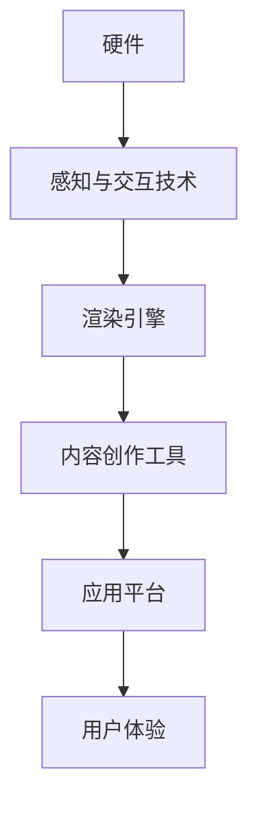

                 

# 《虚拟现实在文化遗产保护中的创新应用》

## 关键词
- 虚拟现实
- 文化遗产保护
- 数字化展示
- 增强现实
- 互动体验

## 摘要

随着科技的不断进步，虚拟现实（VR）技术逐渐成为文化遗产保护领域的重要工具。本文将探讨虚拟现实技术在文化遗产保护中的创新应用，分析其在数字化展示、真实性还原、互动体验等方面的优势。通过实际案例，我们将看到虚拟现实技术如何帮助文化遗产的传承与保护，同时也将探讨其在实际应用中面临的挑战及未来的发展趋势。

## 第一部分：虚拟现实技术基础

### 1.1 虚拟现实技术概述

虚拟现实技术是一种通过计算机生成模拟环境，使用户在其中能够感知和互动的技术。其核心概念包括感知与交互技术、渲染引擎、内容创作工具、应用平台和用户体验。以下是一个简单的Mermaid流程图，展示这些核心概念及其关联关系：



### 1.2 虚拟现实技术原理

虚拟现实技术的基本原理在于创建一个逼真的三维虚拟环境，使用户能够在其中自由探索。其核心算法主要包括场景渲染、光照计算和交互处理。以下是一段伪代码，展示了虚拟现实渲染的基本流程：

```python
function render_scene(scene):
    for object in scene.objects:
        calculate_lighting(object)
        transform_object(object)
        render_object(object)
```

这个流程涉及到多个步骤，包括对象的光照计算、变换和渲染。在渲染过程中，通常会使用图形处理单元（GPU）来加速计算，从而实现流畅的虚拟现实体验。

### 1.3 虚拟现实硬件与设备

虚拟现实系统的硬件设备包括VR头显、手柄、定位传感器和跟踪系统等。这些硬件设备共同作用，为用户提供沉浸式的虚拟现实体验。

- **VR头显**：头戴式显示器，用于呈现虚拟环境。
- **手柄与定位传感器**：用户在虚拟环境中进行交互的工具。
- **跟踪系统**：用于跟踪用户的动作和位置，确保虚拟环境的实时更新。

### 1.4 虚拟现实内容创作工具

虚拟现实内容创作工具包括3D建模软件、动画制作软件和虚拟现实编辑器等。这些工具帮助用户创建和编辑虚拟现实场景，使得虚拟现实技术能够应用于各种领域。

- **3D建模软件**：如Blender、Maya等，用于创建和编辑三维模型。
- **动画制作软件**：如Adobe Animate、3ds Max等，用于制作虚拟现实中的动画效果。
- **虚拟现实编辑器**：如Unity、Unreal Engine等，用于整合各种资源，实现虚拟现实应用程序的开发。

### 1.5 虚拟现实技术在文化遗产保护中的应用前景

虚拟现实技术在文化遗产保护中具有广阔的应用前景。它可以用于增强文化遗产的体验、远程展示文化遗产和数字化保护文化遗产。

- **增强文化遗产体验**：通过虚拟现实技术，用户可以身临其境地感受文化遗产的魅力，增加互动性和参与感。
- **远程文化遗产展示**：虚拟现实技术使得文化遗产可以在全球范围内进行展示，不受地理位置限制。
- **文化遗产数字化保护**：通过虚拟现实技术，可以对文化遗产进行数字化保存，确保其长期保存和传承。

## 第二部分：虚拟现实在文化遗产保护中的应用实践

### 2.1 虚拟现实在文化遗产保护中的实际应用案例

虚拟现实技术在文化遗产保护中已有多个成功案例。以下是一些实际应用案例：

- **故宫虚拟游览**：故宫博物院利用虚拟现实技术，让用户可以通过VR设备虚拟游览故宫，体验皇家的生活和文化。
- **敦煌莫高窟数字化展示**：敦煌莫高窟的壁画和文物通过虚拟现实技术进行数字化展示，使得无法亲临现场的观众也能够欣赏到这些珍贵的文化遗产。
- **丽江古城虚拟体验**：丽江古城的虚拟体验项目，通过虚拟现实技术重现了古城的历史风貌，为游客提供了全新的旅游体验。

### 2.2 虚拟现实在文化遗产数字化保护中的技术挑战

虽然虚拟现实技术在文化遗产保护中具有巨大潜力，但其应用也面临一些技术挑战：

- **数据采集与处理**：需要对文化遗产进行高精度的三维扫描和数据采集，这是一个复杂且耗时的过程。
- **真实性还原**：如何确保虚拟现实展示的文化遗产与真实情况保持一致，是技术上的一个难点。
- **用户体验优化**：虚拟现实技术需要提供流畅、舒适的用户体验，这对硬件和软件的要求较高。

### 2.3 虚拟现实技术在文化遗产保护中的创新应用

虚拟现实技术在文化遗产保护中的应用不断创新，以下是一些创新应用：

- **增强现实文化遗产教育**：通过虚拟现实和增强现实技术，将文化遗产知识融入教育中，提高学生的学习兴趣和参与度。
- **互动式文化遗产体验**：用户可以通过虚拟现实技术参与到文化遗产的修复和创造中，增加互动性和参与感。
- **文化遗产研究与修复**：虚拟现实技术为文化遗产的研究和修复提供了新的工具和方法，有助于更好地保护和传承文化遗产。

### 2.4 虚拟现实在文化遗产保护中的可持续发展

虚拟现实技术在文化遗产保护中的可持续发展需要考虑以下几个方面：

- **文化遗产保护与社会责任**：虚拟现实技术应注重文化遗产的保护，避免对文化遗产造成损害。
- **虚拟现实技术的未来发展**：随着技术的不断进步，虚拟现实技术在文化遗产保护中的应用将会更加广泛和深入。

## 第三部分：虚拟现实在文化遗产保护中的实践指南

### 3.1 虚拟现实在文化遗产保护中的项目开发流程

虚拟现实在文化遗产保护中的项目开发需要遵循以下流程：

1. **需求分析**：明确项目目标和需求，确定保护的对象和目的。
2. **方案设计**：制定项目实施方案，包括技术选型、数据采集和处理方案等。
3. **实施与测试**：根据设计方案进行实施，并进行测试，确保虚拟现实系统的稳定性和可靠性。
4. **维护与更新**：对虚拟现实系统进行定期维护和更新，确保其长期稳定运行。

### 3.2 虚拟现实技术在文化遗产保护中的资源与工具推荐

以下是一些虚拟现实技术在文化遗产保护中常用的资源与工具：

- **开源软件与库**：如Blender、OpenVR等，提供丰富的功能和强大的支持。
- **商业化解决方案**：如Unity、Unreal Engine等，适合大规模虚拟现实项目的开发。
- **硬件推荐**：如HTC Vive、Oculus Rift等，提供高质量的头显设备。

### 3.3 虚拟现实在文化遗产保护中的法规与伦理问题

在虚拟现实技术在文化遗产保护中的应用中，需要遵守相关法规和伦理规范：

- **数据保护法规**：确保采集和处理的文化遗产数据符合数据保护法规，保护文化遗产的隐私和安全。
- **知识产权保护**：尊重文化遗产的知识产权，避免侵权行为。
- **伦理道德考量**：在虚拟现实技术中融入伦理考量，确保技术的使用不会对文化遗产造成损害。

## 附录：虚拟现实在文化遗产保护中的实用资源

以下是一些虚拟现实在文化遗产保护中的实用资源：

- **相关书籍与论文**：介绍虚拟现实技术和文化遗产保护的最新研究成果和应用案例。
- **在线教程与培训课程**：提供虚拟现实技术的学习和实践指导。
- **虚拟现实技术社区与论坛**：聚集虚拟现实技术爱好者和专业人士，交流经验和探讨问题。

## 作者信息

作者：AI天才研究院/AI Genius Institute & 禅与计算机程序设计艺术 /Zen And The Art of Computer Programming

### 结语

虚拟现实技术在文化遗产保护中的应用已经展现出巨大的潜力。通过数字化展示、互动体验和真实性还原，虚拟现实技术为文化遗产的传承和保护提供了新的手段。尽管面临一些技术挑战，但随着虚拟现实技术的不断进步，我们有理由相信，它将在文化遗产保护中发挥越来越重要的作用。让我们共同期待虚拟现实技术在文化遗产保护领域的更多创新应用，为人类的文明传承贡献更多力量。

