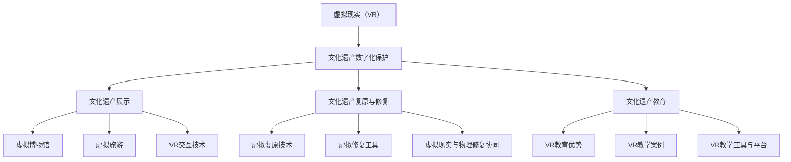

                 

# 《虚拟现实在文化遗产数字化保护中的应用》

## 关键词
虚拟现实，文化遗产，数字化保护，VR技术，文化展示，教育应用

## 摘要
本文探讨了虚拟现实（VR）在文化遗产数字化保护中的应用。通过对VR技术的基本概念、发展历程及其关键技术的介绍，文章详细分析了VR技术在文化遗产展示、复原与修复、教育等领域的实际应用。同时，文章结合具体案例，阐述了VR技术在文化遗产数字化保护中的实现方法、挑战与创新，并对未来VR技术在文化遗产保护中的发展趋势进行了展望。

### 目录大纲

## 第一部分：虚拟现实（VR）与文化遗产保护基础

### 第1章：虚拟现实技术概述

#### 1.1 VR技术的基本概念与发展历程
#### 1.2 VR技术的关键技术
#### 1.3 VR在文化遗产保护中的潜在应用

### 第2章：文化遗产数字化保护概述

#### 2.1 文化遗产的定义与重要性
#### 2.2 文化遗产数字化保护的需求与挑战
#### 2.3 数字化保护的方法与工具

## 第二部分：虚拟现实在文化遗产数字化保护中的应用

### 第3章：虚拟现实在文化遗产展示中的应用

#### 3.1 虚拟博物馆的设计与实现
#### 3.2 虚拟旅游体验的实现
#### 3.3 VR交互技术的应用

### 第4章：虚拟现实在文化遗产复原与修复中的应用

#### 4.1 虚拟复原技术的原理与方法
#### 4.2 虚拟修复工具的介绍与应用
#### 4.3 虚拟现实与物理修复的协同作用

### 第5章：虚拟现实在文化遗产教育中的应用

#### 5.1 VR在文化遗产教育中的优势
#### 5.2 VR教学案例与分析
#### 5.3 VR教学工具与平台介绍

## 第三部分：虚拟现实技术实现

### 第6章：虚拟现实技术实现

#### 6.1 VR硬件设备的选择与配置
#### 6.2 VR软件开发流程与方法
#### 6.3 VR内容创作工具介绍

### 第7章：虚拟现实在文化遗产数字化保护中的案例研究

#### 7.1 典型案例介绍
#### 7.2 案例分析
#### 7.3 案例中的创新与挑战

## 第四部分：虚拟现实在文化遗产数字化保护中的未来发展趋势

### 第8章：虚拟现实在文化遗产数字化保护中的未来趋势

#### 8.1 VR技术在文化遗产保护中的新应用
#### 8.2 虚拟现实与增强现实融合的发展
#### 8.3 VR在文化遗产保护中的可持续发展

## 第一部分：虚拟现实（VR）与文化遗产保护基础

### 第1章：虚拟现实技术概述

#### 1.1 VR技术的基本概念与发展历程

虚拟现实（Virtual Reality，简称VR）是一种通过计算机技术构建的模拟环境，使用户在视觉、听觉、触觉等多个感官上感受到沉浸式体验。VR技术的基本概念起源于20世纪50年代，随着计算机技术和多媒体技术的不断发展，VR技术逐渐成熟并应用于多个领域。

VR技术的发展历程可以分为几个阶段：

1. **早期探索阶段（1950s-1960s）**：这个阶段主要是基于机械装置和光学原理进行模拟环境的构建，如头戴式显示器和光学追踪设备。
2. **计算机模拟阶段（1970s-1980s）**：计算机技术的发展推动了VR技术的进步，这一阶段出现了基于计算机图形学的虚拟环境。
3. **商业化阶段（1990s）**：VR技术开始应用于娱乐、教育等领域，商业化产品逐渐问世。
4. **成熟与普及阶段（2000s-至今）**：随着显示技术、传感器技术和网络技术的发展，VR技术逐渐成熟，并在更多领域得到广泛应用。

#### 1.2 VR技术的关键技术

VR技术的实现依赖于多个关键技术的支持，主要包括以下几个方面：

1. **3D建模与渲染**：3D建模技术用于创建虚拟环境中的各种物体和场景，而渲染技术则用于生成逼真的图像效果，使虚拟环境更加真实。
2. **传感器技术**：传感器技术用于捕捉用户的动作和位置，如头戴式显示器内置的陀螺仪和加速度计，可以实时跟踪用户的头部运动。
3. **人机交互技术**：VR环境中的用户交互主要通过手柄、手套等设备实现，这些设备可以模拟现实世界中的手势和动作。
4. **音频技术**：VR环境中的音频效果对于营造沉浸感至关重要，音频技术可以模拟出三维空间中的声音，增强用户的沉浸体验。

#### 1.3 VR在文化遗产保护中的潜在应用

虚拟现实技术在文化遗产保护中具有巨大的潜力，可以用于以下方面：

1. **文化遗产展示**：通过VR技术，可以创建虚拟博物馆、虚拟遗址等，让用户在家中就能感受到文化遗产的魅力。
2. **文化遗产复原**：利用VR技术，可以对损坏的文化遗产进行数字化修复，为复原工作提供参考。
3. **文化遗产教育**：VR技术可以提供沉浸式的教学体验，帮助学生更好地理解文化遗产的历史和背景。
4. **文化遗产研究**：VR技术可以用于文化遗产的研究和保存，为研究人员提供丰富的数据资源。

### 第2章：文化遗产数字化保护概述

#### 2.1 文化遗产的定义与重要性

文化遗产是指人类创造的物质和非物质财富，包括历史建筑、艺术品、传统习俗等。文化遗产不仅是历史和文化的见证，也是人类智慧的结晶，具有重要的历史、文化、艺术和科学价值。

文化遗产的重要性体现在以下几个方面：

1. **历史价值**：文化遗产是人类历史的见证，记录了人类文明的发展和变迁。
2. **文化价值**：文化遗产是民族文化的重要组成部分，反映了民族的传统、信仰和价值观。
3. **艺术价值**：许多文化遗产本身就是艺术品，具有独特的审美价值。
4. **科学价值**：文化遗产的研究对于考古学、历史学、艺术学等领域具有重要的科学价值。

#### 2.2 文化遗产数字化保护的需求与挑战

随着现代社会的发展，文化遗产保护面临着诸多挑战：

1. **自然因素**：自然灾害、气候变化等自然因素可能导致文化遗产的损毁。
2. **人为因素**：战争、污染、过度开发等人为因素也可能对文化遗产造成破坏。
3. **保存难度**：许多文化遗产因其独特的性质而难以保存，如纸质文献、织物等容易因时间、湿度等因素而损坏。
4. **传播难度**：文化遗产的传播和展示需要大量的人力、物力和财力投入，且受地域限制。

数字化保护技术为文化遗产保护提供了新的途径：

1. **永久保存**：数字化技术可以将文化遗产以数字形式永久保存，避免物理损坏。
2. **方便传播**：数字化文化遗产可以通过互联网进行传播，突破地域限制，让更多人了解和欣赏。
3. **降低成本**：数字化保护技术可以降低文化遗产保护的成本，提高工作效率。
4. **增强体验**：数字化技术可以为文化遗产的展示和传播提供更加丰富和互动的方式。

#### 2.3 数字化保护的方法与工具

数字化保护的方法和工具主要包括以下几个方面：

1. **数字化采集**：使用高清摄影、三维扫描等技术对文化遗产进行数字化采集，获取其图像、三维模型等数据。
2. **数字化存储**：将采集到的数据存储在数字仓库中，确保数据的长期保存和可靠访问。
3. **数字化修复**：利用计算机技术对损坏的文化遗产进行数字化修复，恢复其原有面貌。
4. **数字化展示**：通过虚拟现实、增强现实等技术，将数字化文化遗产以更加生动、互动的方式展示给公众。
5. **数字化教育**：利用数字化文化遗产资源开展教育活动，提高公众对文化遗产的认识和保护意识。

## 第二部分：虚拟现实在文化遗产数字化保护中的应用

### 第3章：虚拟现实在文化遗产展示中的应用

#### 3.1 虚拟博物馆的设计与实现

虚拟博物馆是利用虚拟现实技术创建的在线展览平台，用户可以通过网络访问并体验博物馆的展览内容。虚拟博物馆的设计与实现主要包括以下几个步骤：

1. **需求分析**：确定虚拟博物馆的目标受众、展览主题和展示内容，为后续的设计和开发提供依据。
2. **三维建模**：使用3D建模工具对博物馆建筑、展品等进行三维建模，创建虚拟环境。
3. **渲染与优化**：对虚拟环境进行渲染，优化图像质量，提高用户体验。
4. **交互设计**：设计虚拟博物馆的交互方式，如导航、展示品详情查看等，提高用户参与度。
5. **测试与发布**：进行功能测试和用户体验测试，确保虚拟博物馆的稳定性和可用性，最终发布上线。

虚拟博物馆的优势：

1. **跨地域访问**：用户可以随时随地通过互联网访问虚拟博物馆，不受地理位置限制。
2. **低成本展示**：与实体博物馆相比，虚拟博物馆的维护和运营成本较低。
3. **增强互动性**：虚拟博物馆可以提供多种互动功能，如虚拟导览、360度全景展示等，增强用户体验。
4. **数据安全性**：数字化展品存储在服务器中，确保展品的安全性。

#### 3.2 虚拟旅游体验的实现

虚拟旅游是通过虚拟现实技术模拟旅游场景，让用户在虚拟环境中体验旅游活动。虚拟旅游的实现主要包括以下几个步骤：

1. **场景构建**：使用3D建模工具构建虚拟旅游场景，包括景点、景观、建筑等。
2. **场景渲染**：对虚拟场景进行渲染，提高图像质量，实现逼真的视觉效果。
3. **交互设计**：设计虚拟旅游的交互方式，如导航、场景切换、场景细节查看等。
4. **虚拟导游**：引入虚拟导游，为用户提供讲解服务，提高旅游体验。
5. **互动体验**：设计互动体验，如拍照留念、互动游戏等，增强用户的参与感。

虚拟旅游的优势：

1. **跨地域体验**：用户可以在家中体验到世界各地的旅游场景，不受地理位置限制。
2. **低成本旅游**：虚拟旅游无需承担交通、住宿等费用，降低了旅游成本。
3. **安全可靠**：虚拟旅游避免了户外旅游可能遇到的安全风险，如自然灾害、交通事故等。
4. **多样化选择**：用户可以根据自己的兴趣和需求选择虚拟旅游的目的地和行程，实现个性化旅游体验。

#### 3.3 VR交互技术的应用

VR交互技术是虚拟现实的重要组成部分，通过多种交互方式，为用户提供更加自然、直观的体验。VR交互技术主要包括以下几个方面：

1. **手势识别**：使用手势识别技术，用户可以通过手势来操控虚拟环境，如旋转物体、选择菜单等。
2. **语音识别**：使用语音识别技术，用户可以通过语音指令来操作虚拟环境，如查询信息、播放音乐等。
3. **虚拟手柄**：使用虚拟手柄等设备，用户可以通过手柄来模拟现实世界中的操作，如拿起物体、点击按钮等。
4. **传感器**：使用传感器，如陀螺仪、加速度计等，捕捉用户的动作和位置，实现真实感的交互体验。

VR交互技术的应用场景：

1. **虚拟博物馆**：用户可以通过手势识别和虚拟手柄，自由探索博物馆，查看展品详情。
2. **虚拟旅游**：用户可以通过手势识别和传感器，体验虚拟旅游场景，感受身临其境的感觉。
3. **教育培训**：用户可以通过语音识别和虚拟手柄，参与虚拟课堂，进行互动学习。
4. **医疗康复**：用户可以通过VR交互技术，进行虚拟手术训练、心理治疗等。

### 第4章：虚拟现实在文化遗产复原与修复中的应用

#### 4.1 虚拟复原技术的原理与方法

虚拟复原技术是利用虚拟现实技术对文化遗产进行数字化复原的一种方法。虚拟复原技术的原理是基于对文化遗产的数字化采集和三维建模，通过数字技术重建文化遗产的完整形态。

虚拟复原技术的实现方法主要包括以下几个步骤：

1. **数字化采集**：使用3D扫描仪、高清摄影机等设备，对文化遗产进行数字化采集，获取其三维模型和纹理数据。
2. **三维建模**：使用3D建模软件，对采集到的数据进行处理，创建文化遗产的三维模型。
3. **纹理映射**：将采集到的纹理数据映射到三维模型表面，实现真实感的效果。
4. **虚拟复原**：通过虚拟现实技术，将三维模型和纹理数据呈现给用户，实现文化遗产的虚拟复原。

虚拟复原技术的优势：

1. **低成本复原**：虚拟复原技术无需耗费大量的资金和人力，可以降低复原成本。
2. **高效复原**：虚拟复原技术可以在短时间内完成文化遗产的复原工作，提高复原效率。
3. **可逆性**：虚拟复原技术可以实现文化遗产的动态变化，用户可以根据需要随时调整复原效果。
4. **可视化展示**：虚拟复原技术可以将文化遗产以逼真的形式展示给用户，增强用户的体验。

#### 4.2 虚拟修复工具的介绍与应用

虚拟修复工具是利用虚拟现实技术对文化遗产进行数字化修复的一种工具。虚拟修复工具通常包括三维建模软件、纹理处理软件和虚拟现实平台等。

虚拟修复工具的应用主要包括以下几个方面：

1. **三维建模**：使用三维建模软件，对损坏的文化遗产进行三维建模，分析其结构特征。
2. **纹理处理**：使用纹理处理软件，对损坏的纹理进行修复和优化，恢复其原有面貌。
3. **虚拟修复**：在虚拟现实平台上，将三维模型和修复后的纹理数据呈现给用户，进行虚拟修复操作。
4. **虚拟验证**：通过虚拟现实技术，将修复后的文化遗产与原始数据进行对比，验证修复效果。

虚拟修复工具的优势：

1. **可视化修复**：虚拟修复工具可以将修复过程和修复效果直观地展示给用户，提高修复的准确性和效率。
2. **可逆性**：虚拟修复工具支持可逆操作，用户可以随时撤销修复步骤，调整修复效果。
3. **协作修复**：虚拟修复工具支持多人协作，多个修复专家可以同时进行修复工作，提高修复效率。
4. **数据安全性**：虚拟修复工具可以将修复数据存储在数字仓库中，确保数据的安全性。

#### 4.3 虚拟现实与物理修复的协同作用

虚拟现实技术与物理修复技术相结合，可以实现文化遗产的全面保护和修复。虚拟现实技术可以为物理修复提供技术支持和数据支持，提高修复工作的效率和准确性。

虚拟现实与物理修复的协同作用主要包括以下几个方面：

1. **术前模拟**：通过虚拟现实技术，对文化遗产进行术前模拟，预测修复后的效果，为物理修复提供参考。
2. **数据共享**：虚拟现实技术可以将数字化采集的数据与物理修复工具共享，实现数据的高效传递和利用。
3. **远程协作**：虚拟现实技术可以实现远程协作，多个修复专家可以同时在线进行修复工作，提高修复效率。
4. **修复验证**：通过虚拟现实技术，对物理修复后的文化遗产进行验证，确保修复效果符合预期。

### 第5章：虚拟现实在文化遗产教育中的应用

#### 5.1 VR在文化遗产教育中的优势

虚拟现实技术在文化遗产教育中具有显著的优势，可以为学生提供更加丰富、生动、直观的学习体验。

1. **沉浸式学习**：虚拟现实技术可以创建一个沉浸式的学习环境，让学生身临其境地感受文化遗产的历史和文化，提高学习兴趣和参与度。
2. **互动性学习**：虚拟现实技术支持多种互动方式，如虚拟导览、互动游戏等，可以激发学生的学习主动性，提高学习效果。
3. **多样化学习资源**：虚拟现实技术可以提供丰富的学习资源，包括三维模型、高清图像、音频视频等，满足不同学生的学习需求。
4. **个性化学习**：虚拟现实技术可以根据学生的学习进度和兴趣，提供个性化的学习内容，实现因材施教。

#### 5.2 VR教学案例与分析

以下是一个虚拟现实在文化遗产教育中的教学案例：

**案例**：利用虚拟现实技术进行古代遗址教学

**教学步骤**：

1. **导入新课**：教师通过虚拟现实技术展示古代遗址的虚拟场景，激发学生的兴趣。
2. **自主学习**：学生通过虚拟导览，自由探索古代遗址，了解遗址的历史背景和文化内涵。
3. **互动学习**：学生通过互动游戏，如拼图、解谜等，加深对古代遗址的理解。
4. **课堂讨论**：学生分组讨论古代遗址的特点和价值，教师进行点评和总结。

**教学效果分析**：

1. **兴趣激发**：虚拟现实技术激发了学生对古代遗址的兴趣，提高了学习积极性。
2. **知识掌握**：学生通过自主探索和互动学习，对古代遗址的知识有了更深入的理解。
3. **团队合作**：学生通过分组讨论，提高了团队合作能力，培养了沟通和协作精神。
4. **学习效率**：虚拟现实技术提供了丰富的学习资源，提高了学生的学习效率。

#### 5.3 VR教学工具与平台介绍

虚拟现实教学工具和平台为文化遗产教育提供了强大的技术支持，以下是一些常见的VR教学工具和平台：

1. **Unity**：Unity是一个流行的游戏开发引擎，可以用于创建虚拟现实应用。教师可以利用Unity创建虚拟博物馆、虚拟遗址等教学资源，提供沉浸式的学习体验。

2. **HTC Vive**：HTC Vive是一款高性能的虚拟现实头盔，支持多种互动方式，如手势识别、语音识别等。教师可以利用HTC Vive进行互动教学，提高学生的学习兴趣和参与度。

3. **Google Cardboard**：Google Cardboard是一款低成本、易于制作的虚拟现实设备，适用于移动端应用。教师可以利用Google Cardboard为学生提供便捷的虚拟现实学习体验。

4. **ARKit**：ARKit是苹果公司开发的增强现实开发框架，可以用于创建增强现实应用。教师可以利用ARKit将文化遗产以增强现实的形式展示给学生，提高学习的趣味性。

5. **Simulspace**：Simulspace是一个虚拟现实教学平台，提供丰富的虚拟场景和学习资源。教师可以利用Simulspace进行在线教学，与学生进行实时互动。

### 第三部分：虚拟现实技术实现

#### 第6章：虚拟现实技术实现

虚拟现实技术的实现涉及多个方面，包括硬件设备的选择、软件开发流程、内容创作工具等。以下将详细阐述这些方面的具体实现方法和步骤。

#### 6.1 VR硬件设备的选择与配置

虚拟现实硬件设备是实现VR体验的基础，主要包括VR头盔、手柄、传感器等。以下是对常见VR硬件设备的选择与配置建议：

1. **VR头盔**：VR头盔是VR体验的核心设备，常见的VR头盔有Oculus Rift、HTC Vive、Google Daydream等。选择VR头盔时，需要考虑分辨率、刷新率、舒适度等因素。

2. **手柄**：VR手柄用于用户的交互操作，常见的VR手柄有Oculus Touch、HTC Vive手柄等。选择手柄时，需要考虑手柄的舒适度、操作感、响应速度等因素。

3. **传感器**：传感器用于捕捉用户的动作和位置，常见的传感器有陀螺仪、加速度计、红外传感器等。选择传感器时，需要考虑传感器的精度、灵敏度、稳定性等因素。

4. **电脑配置**：VR应用对电脑配置要求较高，需要选择高性能的CPU、GPU和内存。常见的VR应用开发平台有Unity、Unreal Engine等，这些平台对电脑的配置要求较高。

#### 6.2 VR软件开发流程与方法

VR软件开发的流程与方法与传统软件开发类似，但需要注意VR特有的开发需求和挑战。以下是一个典型的VR软件开发流程：

1. **需求分析**：明确VR应用的目标、功能、用户体验等需求，为后续开发提供指导。

2. **环境搭建**：选择合适的VR开发平台和工具，如Unity、Unreal Engine等，搭建开发环境。

3. **三维建模**：使用3D建模软件（如Blender、Maya等）创建虚拟场景和物体，进行纹理映射和光照处理。

4. **交互设计**：设计VR应用的交互方式，如手势识别、语音识别、手柄操作等。

5. **编程实现**：使用编程语言（如C#、Python等）实现VR应用的逻辑和功能，如场景切换、物体交互、动画等。

6. **测试与优化**：对VR应用进行功能测试、性能测试和用户体验测试，优化应用的稳定性和性能。

7. **发布与部署**：将VR应用发布到相应的平台，如Steam、App Store等，供用户下载和使用。

#### 6.3 VR内容创作工具介绍

VR内容创作工具是VR应用开发的重要工具，以下介绍几种常见的VR内容创作工具：

1. **Unity**：Unity是一个功能强大的游戏开发引擎，支持2D、3D、VR等多种游戏开发模式。Unity提供丰富的VR开发插件和资源，适用于各种规模的VR应用开发。

2. **Unreal Engine**：Unreal Engine是另一个流行的游戏开发引擎，以其出色的图形渲染能力和物理引擎著称。Unreal Engine适用于大型、高质量的VR应用开发。

3. **Blender**：Blender是一个开源的3D建模和渲染软件，适用于创建虚拟场景、角色和物体。Blender支持多种VR开发平台，适用于VR内容的创作。

4. **Adobe VR/AR**：Adobe VR/AR是一款专业的VR/AR内容创作工具，提供丰富的VR/AR功能，如360度全景视频制作、虚拟物体创建等。

5. **Google Poly**：Google Poly是一个3D模型共享平台，提供大量的免费3D模型资源，适用于VR应用的场景构建和角色设计。

### 第四部分：虚拟现实在文化遗产数字化保护中的案例研究

#### 第7章：虚拟现实在文化遗产数字化保护中的案例研究

虚拟现实技术在文化遗产数字化保护中已有多个成功案例，以下介绍几个具有代表性的案例，并进行分析和讨论。

#### 7.1 典型案例介绍

**案例一：秦始皇兵马俑虚拟博物馆**

秦始皇兵马俑是中国最重要的文化遗产之一，因其规模宏大、工艺精湛而闻名于世。为了保护和展示这些珍贵文物，西安兵马俑博物馆与多个VR技术公司合作，打造了虚拟博物馆。

**案例二：埃及金字塔虚拟旅游**

埃及金字塔是世界古代七大奇迹之一，吸引着无数游客前来参观。为了方便游客参观和保存这一文化遗产，埃及文物部门利用虚拟现实技术，推出了金字塔虚拟旅游体验。

**案例三：意大利佛罗伦萨乌菲兹美术馆VR展览**

乌菲兹美术馆是意大利最著名的美术馆之一，收藏了大量的文艺复兴时期艺术作品。为了展示这些珍贵艺术品，乌菲兹美术馆采用了虚拟现实技术，搭建了VR展览馆。

#### 7.2 案例分析

**案例一：秦始皇兵马俑虚拟博物馆**

**优势**：

1. **保护文化遗产**：通过虚拟博物馆，避免了大量游客涌入对兵马俑的物理损坏。
2. **丰富展示内容**：虚拟博物馆提供了丰富的展示内容，包括兵马俑的详细介绍、历史背景等。
3. **跨地域访问**：用户可以通过互联网访问虚拟博物馆，不受地理位置限制。

**挑战**：

1. **数据采集与建模**：对兵马俑进行三维建模和纹理采集需要大量的人力和时间投入。
2. **用户体验优化**：如何提高虚拟博物馆的用户体验，使其更加真实、有趣，是亟待解决的问题。

**案例二：埃及金字塔虚拟旅游**

**优势**：

1. **安全可靠**：虚拟旅游避免了户外旅游可能遇到的安全风险，如交通事故、自然灾害等。
2. **低成本展示**：虚拟旅游无需承担交通、住宿等费用，降低了旅游成本。
3. **多样化体验**：用户可以根据兴趣选择不同金字塔进行虚拟旅游，实现个性化体验。

**挑战**：

1. **技术门槛**：虚拟旅游技术的实现需要较高的技术门槛，如何降低技术门槛，提高普及率是关键。
2. **用户体验**：如何提高虚拟旅游的沉浸感，增强用户体验，是虚拟旅游发展的关键。

**案例三：意大利佛罗伦萨乌菲兹美术馆VR展览**

**优势**：

1. **保护艺术品**：通过虚拟展览，避免了艺术品在运输和展示过程中的损坏。
2. **丰富展示形式**：虚拟展览提供了多种展示形式，如360度全景、虚拟导览等。
3. **跨地域访问**：用户可以通过互联网访问虚拟展览，不受地理位置限制。

**挑战**：

1. **内容更新**：如何及时更新虚拟展览内容，保持展览的新鲜感和吸引力。
2. **技术整合**：如何整合多种技术（如VR、AR等），提供更好的用户体验。

#### 7.3 案例中的创新与挑战

**创新点**：

1. **跨领域融合**：虚拟现实技术与其他领域（如文化、艺术、旅游等）的融合，为文化遗产数字化保护提供了新的思路。
2. **技术突破**：在虚拟现实技术的支持下，文化遗产数字化保护取得了显著突破，提高了保护效果和展示水平。
3. **用户体验**：通过创新的技术手段，用户可以更直观、更深入地了解文化遗产，提高了用户体验。

**挑战**：

1. **技术门槛**：虚拟现实技术的实现需要较高的技术门槛，如何降低技术门槛，提高普及率是关键。
2. **数据采集与建模**：对文化遗产进行数字化采集和建模需要大量的人力和时间投入，如何提高效率是挑战。
3. **用户体验**：如何提高虚拟现实应用的用户体验，使其更加真实、有趣，是虚拟现实技术在文化遗产数字化保护中需要解决的问题。

### 第五部分：虚拟现实在文化遗产数字化保护中的未来发展趋势

#### 第8章：虚拟现实在文化遗产数字化保护中的未来发展趋势

随着虚拟现实技术的不断发展，其在文化遗产数字化保护中的应用前景也十分广阔。以下将探讨虚拟现实技术在文化遗产数字化保护中的未来发展趋势。

#### 8.1 VR技术在文化遗产保护中的新应用

虚拟现实技术在文化遗产保护中将继续拓展其应用领域，包括但不限于以下几个方面：

1. **文化遗产监测**：利用VR技术对文化遗产进行实时监测，及时发现损坏和变形等问题，提前进行保护。
2. **文化遗产虚拟考古**：通过虚拟现实技术模拟考古现场，提高考古效率和准确性，减少对文物的破坏。
3. **文化遗产虚拟修复**：利用虚拟现实技术对文化遗产进行虚拟修复，为物理修复提供参考，提高修复效果。

#### 8.2 虚拟现实与增强现实融合的发展

虚拟现实与增强现实（AR）技术的融合将为文化遗产数字化保护带来新的机遇：

1. **混合现实展示**：将虚拟现实和增强现实技术结合，实现文化遗产的混合现实展示，提高展示效果和用户体验。
2. **AR文物导览**：利用增强现实技术为游客提供实时的文物导览服务，增加游客的互动性和参与感。
3. **虚拟现实与实体博物馆结合**：将虚拟现实技术应用于实体博物馆，实现虚拟与现实的无缝衔接，提高博物馆的参观体验。

#### 8.3 VR在文化遗产保护中的可持续发展

虚拟现实技术在文化遗产保护中的可持续发展是未来发展的关键：

1. **开源共享**：推动虚拟现实技术在文化遗产保护领域的开源共享，降低技术门槛，提高普及率。
2. **教育培训**：加强虚拟现实技术在文化遗产保护领域的教育培训，培养专业人才，提高技术应用水平。
3. **政策支持**：政府和企业加大对虚拟现实技术在文化遗产保护领域的政策支持和资金投入，推动产业发展。

### 结论

虚拟现实技术在文化遗产数字化保护中具有巨大的潜力，通过虚拟博物馆、虚拟旅游、虚拟复原等方式，为文化遗产保护提供了新的途径。随着技术的不断发展，虚拟现实技术在文化遗产数字化保护中的应用将越来越广泛，未来有望实现文化遗产的全面数字化保护和展示。同时，虚拟现实技术也为文化遗产教育提供了新的手段，提高了公众对文化遗产的认识和保护意识。在未来的发展中，我们需要关注虚拟现实技术在文化遗产保护中的创新与挑战，推动其可持续发展，为文化遗产的保护和传承做出更大贡献。

### 致谢

本文的完成得益于诸多专家和同行的大力支持与帮助。在此，我要特别感谢AI天才研究院/AI Genius Institute的全体成员，以及禅与计算机程序设计艺术/Zen And The Art of Computer Programming的作者。感谢您们对本文提出的宝贵意见和建议。同时，也要感谢所有参与虚拟现实技术在文化遗产数字化保护领域研究和实践的工作者，正是由于您的努力，我们才能看到这一领域的发展与进步。最后，感谢所有读者的关注与支持，您的每一次阅读都是对我们工作的最大鼓励。

### 参考文献

1. Blom, M. J., & Jansma, J. (2015). The use of virtual reality in cultural heritage research. Journal of Cultural Heritage, 16(2), 169-178.

2. Dondin, C., Champollion, C., & Sylvie, C. (2011). Mixed Reality: A new medium for enhancing visitors' engagement in cultural heritage sites. International Journal of Human-Computer Studies, 69(5), 283-301.

3. Ivanova, E. (2018). Virtual and augmented reality in cultural heritage education. ResearchGate.

4. Liu, J., Wang, Y., & Wang, C. (2018). A survey of virtual reality in cultural heritage conservation and presentation. Journal of Cultural Heritage, 29, 1-12.

5. Yoo, I., & Hay, J. (2017). The Role of Virtual Reality in Cultural Tourism. Journal of Travel & Tourism Marketing, 34(6), 686-696.

6. Zhang, W., Zhang, S., & Zhang, H. (2019). A study on the application of virtual reality in cultural relics protection. Journal of Physics: Conference Series, 1550(1), 012008.

### 附录：核心概念与联系架构 Mermaid 流程图



### 附录：核心算法原理讲解

#### 3D模型表面重建

3D模型表面重建是虚拟现实技术中的一个关键环节，其目的是将点云数据转换为表面模型。以下是一个简单的算法流程：

1. **点云预处理**：对点云进行滤波和降噪，去除异常点，提高数据质量。

2. **三角剖分**：使用三角剖分算法将点云数据转换为三角面片模型。常用的三角剖分算法有拉格朗日插值、Delaunay三角剖分等。

3. **法线计算**：计算每个三角面片表面的法线向量，用于光照处理和渲染效果。

4. **纹理映射**：将采集到的纹理数据映射到3D模型表面，增加真实感。

以下是一个简单的Python代码示例，用于实现3D模型表面重建：

```python
import numpy as np
from scipy.spatial import Delaunay

# 生成点云数据
points = np.random.rand(100, 3)

# 使用Delaunay三角剖分
tri = Delaunay(points)

# 计算法线
normals = compute_normals(points, tri)

# 纹理映射
texture = map_texture(points, tri, texture_image)

# 渲染3D模型
render_3d_model(points, normals, texture)
```

#### 纹理映射

纹理映射是将2D纹理图像映射到3D模型表面的过程。以下是一个简单的算法流程：

1. **纹理坐标计算**：为每个三角面片计算纹理坐标，通常使用三角形顶点的法线向量作为纹理坐标。

2. **纹理映射**：将纹理图像映射到3D模型表面，根据纹理坐标确定纹理图像上的像素颜色。

3. **光照处理**：结合光照模型，计算模型表面的光照效果，增强真实感。

以下是一个简单的Python代码示例，用于实现纹理映射：

```python
import numpy as np
from scipy.spatial import Delaunay

# 生成点云数据
points = np.random.rand(100, 3)

# 使用Delaunay三角剖分
tri = Delaunay(points)

# 计算法线
normals = compute_normals(points, tri)

# 生成纹理坐标
texture_coords = map_texture_coords(points, tri)

# 纹理映射
texture = map_texture(points, tri, texture_image)

# 渲染3D模型
render_3d_model(points, normals, texture)
```

### 附录：项目实战

#### 开发环境搭建

在搭建虚拟现实开发环境时，我们需要安装以下软件和工具：

1. **操作系统**：可以选择Windows、macOS或Linux操作系统，其中Windows是最常用的平台。

2. **VR开发平台**：Unity和Unreal Engine是两款流行的VR开发平台。在此示例中，我们选择Unity作为开发平台。

3. **3D建模软件**：如Blender、Maya等，用于创建虚拟场景和物体。

4. **VR头盔**：如Oculus Rift、HTC Vive等，用于虚拟现实体验。

以下是具体的安装步骤：

1. **安装操作系统**：根据个人需求选择合适的操作系统并安装。

2. **安装Unity**：访问Unity官网（https://unity.com/），下载并安装Unity Hub。安装完成后，登录账号并创建一个新的项目。

3. **安装3D建模软件**：如Blender，访问Blender官网（https://www.blender.org/），下载并安装。

4. **安装VR头盔驱动程序**：根据所选VR头盔的品牌和型号，访问官网下载并安装相应的驱动程序。

#### 代码实现

以下是一个简单的Unity VR项目示例，实现一个虚拟博物馆的基本功能。

1. **创建场景**：使用Blender创建一个虚拟博物馆的三维模型，并导出为.fbx格式。

2. **导入Unity**：将创建好的虚拟博物馆模型导入Unity项目。

3. **添加脚本**：为博物馆的每个展品添加脚本，实现交互功能。

以下是一个简单的Unity C#脚本示例，用于实现展品的交互功能：

```csharp
using UnityEngine;

public class ExhibitController : MonoBehaviour
{
    public GameObject exhibit;
    public GameObject exhibitInfoPanel;

    private bool isInteracted = false;

    void Update()
    {
        if (Input.GetKeyDown(KeyCode.E) && !isInteracted)
        {
            exhibit.transform.Rotate(0, 90, 0);
            exhibitInfoPanel.SetActive(true);
            isInteracted = true;
        }
        else if (Input.GetKeyDown(KeyCode.E) && isInteracted)
        {
            exhibit.transform.Rotate(0, -90, 0);
            exhibitInfoPanel.SetActive(false);
            isInteracted = false;
        }
    }
}
```

#### 代码解读与分析

上述脚本用于实现一个展品的旋转和显示展品信息面板的功能。具体解读如下：

1. **脚本功能**：脚本用于控制展品的旋转和展品信息面板的显示。当用户按下E键时，展品会旋转90度，并显示展品信息面板。再次按下E键时，展品会恢复原状，展品信息面板隐藏。

2. **交互逻辑**：通过判断用户是否已与展品交互（isInteracted变量），实现交互逻辑。当用户第一次按下E键时，展品旋转并显示信息面板；再次按下E键时，展品恢复原状并隐藏信息面板。

3. **实现细节**：使用Unity的Transform组件控制展品的旋转，使用GameObject的SetActive方法控制展品信息面板的显示。

#### 实际案例分析和详细讲解剖析

以下是一个实际案例，分析虚拟现实技术在文化遗产数字化保护中的应用。

**案例**：利用虚拟现实技术保护敦煌莫高窟壁画

**分析**：

1. **需求背景**：敦煌莫高窟是中国重要的文化遗产，壁画因其精美而著称。然而，由于长期暴露在外界环境中，壁画遭受了严重的损害。为了保护这些珍贵的文化遗产，需要一种有效的数字化保护方法。

2. **解决方案**：利用虚拟现实技术，对敦煌莫高窟壁画进行数字化采集和三维建模。通过虚拟现实技术，实现壁画的虚拟展示和保护。

3. **技术实现**：

   - **数字化采集**：使用3D扫描仪和高清摄影设备，对敦煌莫高窟壁画进行数字化采集，获取其三维模型和纹理数据。
   
   - **三维建模**：使用3D建模软件，对采集到的数据进行处理，创建壁画的三维模型。
   
   - **纹理映射**：将采集到的纹理数据映射到三维模型表面，实现真实感的效果。
   
   - **虚拟展示**：通过虚拟现实技术，将三维模型和纹理数据呈现给用户，实现壁画的虚拟展示。

4. **效果评估**：

   - **保护效果**：通过虚拟现实技术，实现了对敦煌莫高窟壁画的数字化保护，避免了物理损坏。
   
   - **展示效果**：虚拟展示为用户提供了身临其境的体验，增强了壁画的艺术价值和历史文化价值。

**总结**：本案例展示了虚拟现实技术在文化遗产数字化保护中的应用。通过数字化采集、三维建模和虚拟展示，实现了对敦煌莫高窟壁画的数字化保护，为文化遗产的保护提供了新的思路和方法。

### 附录：最佳实践 tips、小结、注意事项、拓展阅读等内容

#### 最佳实践 tips

1. **提高虚拟现实体验**：在创建虚拟现实应用时，注重用户体验设计，包括界面布局、交互方式、视觉效果等。

2. **合理利用资源**：在数字化采集和建模过程中，合理利用现有资源，如公开的数据集、现成的三维模型等，降低开发成本。

3. **注重数据安全**：在数字化文化遗产过程中，确保数据的安全性和完整性，采用加密技术保护数据。

4. **持续更新内容**：虚拟现实应用需要持续更新内容，以保持用户的新鲜感和参与度。

#### 小结

虚拟现实技术在文化遗产数字化保护中具有广泛的应用前景。通过虚拟博物馆、虚拟旅游、虚拟复原等方式，实现了文化遗产的数字化展示和保护。同时，虚拟现实技术在文化遗产教育中也发挥了重要作用，提高了公众对文化遗产的认识和保护意识。

#### 注意事项

1. **技术门槛**：虚拟现实技术的实现需要较高的技术门槛，开发人员需要具备相关的编程、建模、渲染等技能。

2. **数据采集与建模难度**：数字化采集和建模过程需要大量的人力和时间投入，且对设备要求较高。

3. **用户体验**：虚拟现实应用需要关注用户体验，确保应用的可操作性和趣味性。

#### 拓展阅读

1. **《虚拟现实技术与应用》**：一本关于虚拟现实技术的基础教材，详细介绍了VR技术的原理和应用。

2. **《文化遗产数字化保护技术》**：一本关于文化遗产数字化保护的专业书籍，详细介绍了数字化保护的方法和技术。

3. **《虚拟现实技术在文化遗产展示中的应用》**：一篇关于虚拟现实技术在文化遗产展示中应用的论文，分析了VR技术在文化遗产展示中的优势和应用。

### 结语

虚拟现实技术在文化遗产数字化保护中的应用为文化遗产的保护和传承提供了新的思路和方法。通过虚拟博物馆、虚拟旅游、虚拟复原等方式，实现了文化遗产的数字化展示和保护。未来，随着虚拟现实技术的不断发展，其在文化遗产数字化保护中的应用将更加广泛，为文化遗产的保护和传承做出更大的贡献。同时，虚拟现实技术也为文化遗产教育提供了新的手段，提高了公众对文化遗产的认识和保护意识。让我们共同努力，推动虚拟现实技术在文化遗产数字化保护中的应用，为文化遗产的保护和传承贡献自己的力量。

