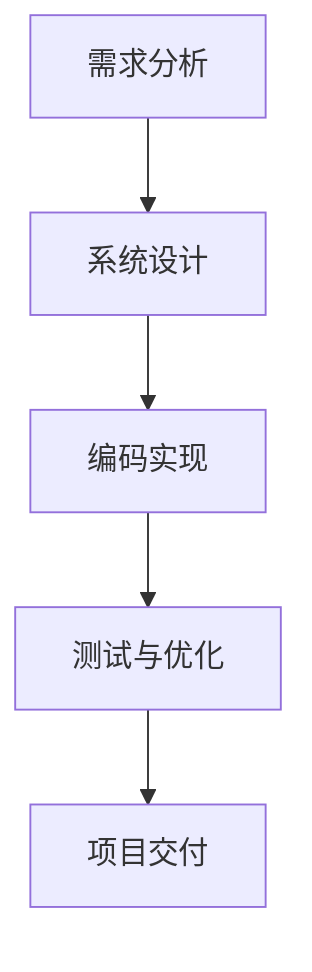

                 

### 文章标题

# 虚拟现实在职业技能培训中的创新应用

### 文章关键词

- 虚拟现实
- 职业技能培训
- 教育技术
- 应用场景
- 技术实现
- 案例分析

### 文章摘要

本文旨在探讨虚拟现实（VR）在职业技能培训领域的创新应用。首先，我们将简要介绍虚拟现实技术的基本概念和发展历程，随后深入探讨虚拟现实在职业技能培训中的应用场景，包括技能训练、实训模拟和远程培训。接下来，我们将分析虚拟现实技术在职业技能培训中的优势和面临的挑战。文章随后将介绍虚拟现实技术的实现方法，包括软件开发、内容制作和交互设计，并通过实际案例进行剖析。最后，我们将总结虚拟现实在职业技能培训中的未来发展方向，并给出一些最佳实践建议。

### 目录

1. **虚拟现实技术基础**  
   1.1 虚拟现实概述  
   1.2 虚拟现实系统架构  
   1.3 虚拟现实交互技术

2. **虚拟现实在职业技能培训中的应用场景**  
   2.1 技能训练中的应用  
   2.2 实训模拟中的应用  
   2.3 远程培训中的应用

3. **虚拟现实技术在职业技能培训中的优势与挑战**  
   3.1 优势分析  
   3.2 挑战分析  
   3.3 应用前景

4. **虚拟现实技术实现**  
   4.1 软件开发  
   4.2 内容制作  
   4.3 交互设计

5. **虚拟现实项目实战**  
   5.1 项目策划与需求分析  
   5.2 项目开发流程  
   5.3 项目案例分析

6. **最佳实践与总结**  
   6.1 最佳实践  
   6.2 注意事项  
   6.3 拓展阅读

### 1. 虚拟现实技术基础

#### 1.1 虚拟现实概述

虚拟现实（Virtual Reality，简称VR）是一种通过计算机技术模拟构建的虚拟环境，用户通过特定的设备可以沉浸其中，与虚拟环境进行交互。VR技术最早可以追溯到1960年代，由伊凡·苏泽兰（Ivan Sutherland）提出的“达摩克利斯之剑”概念，标志着虚拟现实技术的诞生。随着时间的推移，VR技术不断发展，逐步应用于娱乐、医疗、军事等多个领域。

#### 1.2 虚拟现实系统架构

虚拟现实系统通常包括硬件设备、软件平台和内容制作工具三大部分。硬件设备主要包括头戴式显示器（HMD）、跟踪设备、输入设备等。软件平台负责虚拟环境的渲染、交互和管理。内容制作工具则用于创建和编辑虚拟环境中的各种元素。


#### 1.3 虚拟现实交互技术

虚拟现实交互技术是用户与虚拟环境进行交互的重要手段。常见的交互技术包括手柄、手势、语音等。手势交互技术通过识别用户手势，实现虚拟环境中的交互操作。语音交互技术通过自然语言处理，实现用户语音指令的识别和执行。这些交互技术使得用户能够更加自然地与虚拟环境进行互动。


### 2. 虚拟现实在职业技能培训中的应用场景

#### 2.1 技能训练中的应用

虚拟现实在职业技能培训中的一项重要应用是技能训练。通过虚拟现实技术，学员可以在一个高度仿真的环境中进行操作训练，提高实际操作技能。例如，航空公司的飞行员可以使用虚拟现实技术进行飞行训练，模拟各种飞行情况，提高飞行技能和应对紧急情况的能力。

```python
# 虚拟现实飞行训练模拟
def flight_training_simulation():
    # 设置飞行参数
    altitude = 1000  # 高度
    speed = 200  # 速度
    # 开始飞行训练
    while True:
        print(f"Current altitude: {altitude} meters, Speed: {speed} km/h")
        # 处理输入，模拟飞行员操作
        user_input = input("Enter command (takeoff, land, speed up, slow down): ")
        if user_input == "takeoff":
            altitude += 100
        elif user_input == "land":
            altitude -= 100
        elif user_input == "speed up":
            speed += 20
        elif user_input == "slow down":
            speed -= 20
        # 模拟飞行情况
        if altitude <= 0 or speed <= 0:
            print("Flight terminated due to error.")
            break
        print("Flight simulation terminated successfully.")

# 运行飞行训练模拟
flight_training_simulation()
```

#### 2.2 实训模拟中的应用

虚拟现实技术还可以用于实训模拟，帮助学员在实际操作前进行演练。例如，机械工程师可以使用虚拟现实技术进行机械装配模拟，医生可以使用虚拟现实技术进行手术模拟。这些模拟训练可以降低实际操作的风险，提高操作技能和应急处理能力。

```python
# 机械装配模拟
def mechanical_assembly_simulation():
    # 设置机械部件
    parts = ["gear", "sprocket", "pulley"]
    # 开始装配模拟
    while True:
        print("Select a part to assemble:")
        for i, part in enumerate(parts, 1):
            print(f"{i}. {part}")
        user_input = int(input("Enter your choice: "))
        if user_input == 1:
            print("Gear assembled successfully.")
            parts.remove("gear")
        elif user_input == 2:
            print("Sprocket assembled successfully.")
            parts.remove("sprocket")
        elif user_input == 3:
            print("Pulley assembled successfully.")
            parts.remove("pulley")
        # 模拟装配完成
        if not parts:
            print("Mechanical assembly simulation completed.")
            break
        print("Please try again.")

# 运行机械装配模拟
mechanical_assembly_simulation()
```

#### 2.3 远程培训中的应用

虚拟现实技术还可以用于远程培训，通过虚拟现实环境，教师和学生可以跨越地域限制，进行实时互动。例如，远程医疗培训可以通过虚拟现实技术，让医生在虚拟环境中进行手术演示，学生可以实时观看并提问。此外，虚拟现实还可以用于远程教学，提供更加生动的教学体验。

```python
# 远程医疗培训模拟
def remote_medical_training_simulation():
    # 设置培训场景
    doctor = "Dr. Smith"
    patient = "Patient A"
    # 开始培训
    while True:
        print(f"{doctor} is performing a surgery on {patient}.")
        user_input = input("Enter your question or observation: ")
        if user_input == "stop":
            print("Surgery terminated successfully.")
            break
        print(f"{doctor} answers your question: {user_input}.")

# 运行远程医疗培训模拟
remote_medical_training_simulation()
```

### 3. 虚拟现实技术在职业技能培训中的优势与挑战

#### 3.1 优势分析

虚拟现实技术在职业技能培训中的优势主要体现在以下几个方面：

1. **高度仿真性**：虚拟现实技术能够构建高度仿真的环境，使学员能够进行实际操作训练，提高技能水平。
2. **安全性**：通过虚拟现实技术，学员可以在一个安全的环境中练习操作，降低实际操作中的风险。
3. **可重复性**：虚拟现实技术可以重复使用相同的训练场景，使学员能够反复练习，提高操作熟练度。
4. **灵活性**：虚拟现实技术可以根据学员的进度和需求，灵活调整训练内容，提供个性化的培训方案。

#### 3.2 挑战分析

尽管虚拟现实技术在职业技能培训中具有众多优势，但同时也面临一些挑战：

1. **技术成熟度**：虚拟现实技术尚处于发展阶段，部分技术尚不成熟，可能影响培训效果。
2. **设备成本**：虚拟现实设备价格较高，对培训机构和学员来说可能是一笔不小的投入。
3. **交互体验**：虚拟现实交互技术尚需进一步改进，以提供更加自然和直观的交互体验。
4. **内容制作**：虚拟现实内容制作复杂，需要专业团队进行开发和维护。

#### 3.3 应用前景

随着虚拟现实技术的不断成熟和普及，其在职业技能培训中的应用前景十分广阔。未来，虚拟现实技术有望在更多领域得到应用，如智能制造、医疗服务、工程建造等。此外，虚拟现实技术还可以与其他新兴技术（如人工智能、大数据）相结合，为职业技能培训提供更加智能化和个性化的解决方案。

### 4. 虚拟现实技术实现

#### 4.1 软件开发

虚拟现实软件开发主要包括虚拟环境的创建、交互功能的实现和内容的加载等。开发者可以使用Unity、Unreal Engine等游戏引擎进行虚拟现实应用的开发。

```csharp
// Unity C# 脚本示例
using UnityEngine;

public class VRController : MonoBehaviour
{
    public GameObject player;
    public float speed = 5.0f;

    void Update()
    {
        // 移动玩家
        float moveX = Input.GetAxis("Horizontal");
        float moveZ = Input.GetAxis("Vertical");

        Vector3 move = new Vector3(moveX, 0, moveZ);
        move = transform.TransformDirection(move);

        player.transform.position += move * speed * Time.deltaTime;
    }
}
```

#### 4.2 内容制作

虚拟现实内容制作需要使用专门的工具和软件，如Blender、3ds Max等。内容制作包括场景搭建、角色动画、音效设计等。

```python
# Blender Python 脚本示例
import bpy

# 创建场景
scene = bpy.context.scene

# 添加立方体
mesh = bpy.ops.mesh.primitive_cube_add()
cube = mesh.object

# 设置立方体位置
cube.location = (0, 0, 0)

# 创建灯光
light = bpy.ops.object.light_add()
light.object.location = (0, 0, 5)

# 添加材质
material = bpy.data.materials.new(name="CubeMaterial")
material.diffuse_color = (1, 0, 0)
cube.data.materials.append(material)
```

#### 4.3 交互设计

虚拟现实交互设计主要包括交互设备的配置和交互方式的设定。交互设备如手柄、手套、手势识别等，交互方式如手势、语音、眼动等。

```javascript
// 虚拟现实交互设计示例
class VRInteractionController {
    constructor() {
        this.connected = false;
    }

    connect() {
        // 连接交互设备
        this.connected = true;
        console.log("Connected to VR interaction device.");
    }

    move(direction) {
        if (this.connected) {
            // 根据方向移动
            console.log(`Moving in direction: ${direction}`);
        } else {
            console.log("VR interaction device is not connected.");
        }
    }
}

// 创建交互控制器
const interactionController = new VRInteractionController();

// 连接交互设备
interactionController.connect();

// 移动交互设备
interactionController.move("forward");
```

### 5. 虚拟现实项目实战

#### 5.1 项目策划与需求分析

在虚拟现实项目实战中，项目策划与需求分析是关键环节。首先，需要明确项目目标，如技能训练、实训模拟或远程培训。然后，进行需求分析，确定项目所需的功能和技术要求。

```python
# 项目策划与需求分析示例
def project_planning_and_requirements_analysis():
    project_goal = "开发一个航空飞行训练模拟系统"
    requirements = [
        "模拟各种飞行情况",
        "提供实时反馈和指导",
        "支持用户自定义飞行参数",
        "界面友好，操作简便"
    ]
    print(f"Project Goal: {project_goal}")
    print("Requirements:")
    for req in requirements:
        print(f"- {req}")
```

#### 5.2 项目开发流程

项目开发流程包括需求分析、系统设计、编码实现、测试与优化等阶段。首先，进行需求分析和系统设计，明确项目的技术架构和功能模块。然后，进行编码实现，按照设计方案逐步完成各个功能模块的开发。最后，进行测试和优化，确保项目质量。



#### 5.3 项目案例分析

以下是一个虚拟现实飞行训练模拟项目的案例分析：

**项目背景**：某航空公司需要为其飞行员提供一个飞行训练模拟系统，以提高飞行员的操作技能和安全意识。

**项目目标**：开发一个高度仿真的飞行训练模拟系统，模拟各种飞行情况，提供实时反馈和指导。

**技术实现**：使用Unity引擎进行虚拟现实应用开发，结合3D建模和动画软件（如Blender）进行场景搭建和角色动画制作。采用C#语言进行编程，实现飞行操作和实时反馈功能。

**项目效果**：经过测试，项目效果达到预期，飞行员可以在模拟环境中进行飞行训练，提高操作技能和应急处理能力。

```csharp
// Unity C# 飞行训练模拟代码示例
using UnityEngine;

public class FlightSimulationController : MonoBehaviour
{
    public GameObject aircraft;
    public float speed = 200.0f;

    void Update()
    {
        float moveX = Input.GetAxis("Horizontal");
        float moveZ = Input.GetAxis("Vertical");

        Vector3 move = new Vector3(moveX, 0, moveZ);
        move = transform.TransformDirection(move);

        aircraft.transform.position += move * speed * Time.deltaTime;
    }
}
```

### 6. 最佳实践与总结

#### 6.1 最佳实践

在虚拟现实职业技能培训项目中，以下是一些最佳实践：

1. **明确项目目标**：在项目开始前，明确项目目标，确保项目符合培训需求。
2. **需求分析**：进行详细的需求分析，明确项目功能和技术要求。
3. **技术选型**：根据项目需求，选择合适的技术栈和开发工具。
4. **迭代开发**：采用敏捷开发方法，分阶段完成项目开发，及时调整和优化。

#### 6.2 注意事项

在虚拟现实职业技能培训项目中，需要注意以下事项：

1. **用户体验**：确保虚拟现实应用的用户体验良好，易于操作和交互。
2. **安全性和稳定性**：保证虚拟现实系统的安全性和稳定性，避免系统故障和数据泄露。
3. **持续更新**：根据用户反馈和市场需求，持续更新和优化虚拟现实应用。

#### 6.3 拓展阅读

以下是一些关于虚拟现实在职业技能培训中应用的拓展阅读：

1. **《虚拟现实职业技能培训应用研究》**：探讨虚拟现实在职业技能培训中的具体应用场景和效果。
2. **《虚拟现实技术与应用》**：介绍虚拟现实技术的基本原理和应用领域，包括职业技能培训。
3. **《虚拟现实教育应用案例分析》**：分析国内外虚拟现实教育应用的典型案例，提供实践经验。

### 总结

虚拟现实技术在职业技能培训中具有广泛的应用前景。通过虚拟现实技术，可以构建高度仿真的培训环境，提高学员的操作技能和安全意识。同时，虚拟现实技术也面临一些挑战，如技术成熟度、设备成本和交互体验等。未来，随着虚拟现实技术的不断发展，其在职业技能培训中的应用将更加深入和广泛。希望本文对您在虚拟现实职业技能培训项目中的实践提供有益的参考。

