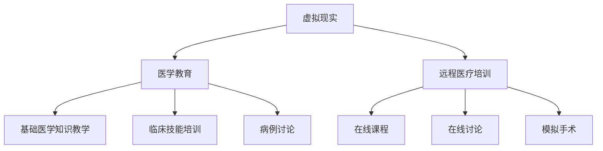

                 

# 虚拟现实在远程医疗培训中的应用

## 关键词
虚拟现实，远程医疗培训，医学教育，医疗技术，医疗实践，医疗模拟

## 摘要
本文深入探讨了虚拟现实（VR）技术在远程医疗培训中的应用。首先，介绍了虚拟现实技术的基本概念和发展历程，以及远程医疗培训的现状和挑战。接着，详细阐述了虚拟现实技术在医学教育中的具体应用，包括解剖学教学、手术模拟和患者护理等。随后，通过Python源代码和LaTeX数学公式，讲解了核心算法原理，并结合实际案例进行了详细解析。最后，总结了虚拟现实远程医疗培训的挑战和未来发展趋势，为医学教育和医疗实践提供了新的思路和方向。

---

## 引言

### 背景介绍

虚拟现实（Virtual Reality，VR）技术作为计算机图形学、交互技术、传感器技术和网络技术等多学科交叉融合的产物，近年来取得了显著的进展。VR技术通过模拟虚拟环境，使人们能够身临其境地体验和互动，从而在游戏、娱乐、教育等多个领域展现出巨大的潜力。

远程医疗培训作为一种新兴的教育模式，通过网络技术和信息通信技术，使医生和医学生能够跨越地域限制，获取高质量的医学知识和技能培训。然而，传统的远程医疗培训方式往往依赖于视频会议和电子课件，难以实现真实、互动和沉浸式的教学体验。

### 核心概念与联系

为了理解虚拟现实在远程医疗培训中的应用，我们首先需要明确几个核心概念：

1. **虚拟现实（VR）**：一种通过计算机技术生成的三维虚拟环境，用户可以通过头盔显示器（HMD）、手套、传感器等设备与虚拟环境进行互动。
2. **远程医疗培训**：利用网络和通信技术，为医生和医学生提供在线培训和教育资源，包括视频课程、在线讨论、模拟手术等。
3. **医学教育**：包括基础医学知识教学、临床技能培训、病例讨论等多个方面，旨在培养医生的专业能力和临床思维。

这些概念之间存在紧密的联系。虚拟现实技术为医学教育提供了新的教学手段，使医生和医学生能够在虚拟环境中进行实践操作，从而提高教学效果和临床技能。

### Mermaid 流程图

为了更好地理解这些概念之间的联系，我们可以使用Mermaid流程图来展示：



通过上述流程图，我们可以清晰地看到虚拟现实技术在远程医疗培训和医学教育中的关键作用。

---

### 虚拟现实技术概述

#### 发展历程

虚拟现实技术起源于20世纪60年代的计算机图形学和显示技术。最早的虚拟现实设备是1968年麻省理工学院的伊凡·苏瑟兰（Ivan Sutherland）发明的“达摩克利斯之剑”（The Sword of Damocles），它使用头戴显示器和跟踪设备，实现了三维虚拟环境的初步展示。

进入20世纪90年代，随着计算机性能的不断提升和显示技术的进步，虚拟现实技术逐渐走向成熟。1995年，索尼公司推出了VR头盔VR-1000，标志着虚拟现实技术进入消费市场。

21世纪初，随着移动互联网和智能手机的普及，虚拟现实技术再次迎来快速发展。增强现实（AR）和混合现实（MR）技术的提出，进一步丰富了虚拟现实的应用场景。

#### 技术原理

虚拟现实技术的核心原理包括：

1. **三维建模与渲染**：通过计算机图形学技术，生成三维虚拟环境。这些环境通常由大量的三维模型、纹理和光影效果构成，以实现逼真的视觉效果。
2. **感知与交互**：用户通过头盔显示器、传感器和交互设备，如手柄、手套等，与虚拟环境进行互动。传感器用于跟踪用户的位置、姿态和动作，从而实现虚拟环境的动态变化。
3. **实时渲染**：虚拟现实设备需要实时渲染图像，以保持虚拟环境的流畅性和实时性。这要求计算机具备较高的图形处理能力和算法优化。

#### 技术分类

虚拟现实技术主要可以分为以下几类：

1. **沉浸式VR**：用户完全沉浸在虚拟环境中，通过头戴显示器和传感器设备，体验虚拟环境中的各种交互和操作。
2. **非沉浸式VR**：用户不沉浸在虚拟环境中，而是通过显示器和控制器进行交互。这种类型的VR主要用于游戏和娱乐。
3. **增强现实（AR）**：在现实环境中叠加虚拟元素，用户通过智能手机或AR眼镜等设备看到虚拟元素。AR技术常用于导航、教育和娱乐。
4. **混合现实（MR）**：结合虚拟现实和增强现实技术，用户在现实环境中与虚拟元素进行互动。MR技术具有较高的交互性和沉浸感。

#### 技术优势

虚拟现实技术在医学教育中的应用具有以下优势：

1. **沉浸式体验**：用户能够完全沉浸在虚拟环境中，感受虚拟手术、解剖学教学等场景，提高学习效果和参与度。
2. **交互性**：用户可以与虚拟环境中的物体进行互动，如模拟手术中的刀具操作、患者护理等，锻炼临床技能。
3. **安全性**：虚拟环境中的操作不会对真实世界造成伤害，医生和医学生可以在安全的环境中反复练习，减少医疗事故的风险。
4. **灵活性**：虚拟现实技术可以模拟各种复杂的医学场景，为医生和医学生提供丰富的实践机会。

#### 技术挑战

尽管虚拟现实技术在医学教育中具有巨大潜力，但其应用仍面临一些挑战：

1. **设备成本**：高质量的虚拟现实设备价格较高，限制了其在医学教育中的普及。
2. **技术稳定性**：虚拟现实设备需要实时渲染图像，对计算机硬件和算法优化要求较高，技术稳定性尚需提升。
3. **用户适应性**：部分用户可能会出现晕动、眩晕等不适反应，影响学习体验。

---

### 远程医疗培训概述

#### 远程医疗培训的定义

远程医疗培训是指利用互联网和通信技术，为医生和医学生提供远程的教育和培训服务。这种模式突破了传统教育的时间和空间限制，使得医学知识和技能的传授更加便捷和高效。

#### 远程医疗培训的现状

随着互联网和信息技术的发展，远程医疗培训在全球范围内得到了广泛应用。以下是目前远程医疗培训的一些现状：

1. **在线课程**：越来越多的医学教育机构开始提供在线课程，包括视频课程、电子书籍和在线讲座等，学生可以根据自己的时间和节奏进行学习。
2. **远程手术培训**：医生可以通过远程视频会议系统，参与远程手术操作和指导，提高手术技能和经验。
3. **模拟手术与患者护理**：利用虚拟现实技术和仿真系统，医生和医学生可以在虚拟环境中进行模拟手术和患者护理操作，提高实践能力和临床技能。

#### 远程医疗培训的挑战

尽管远程医疗培训具有诸多优势，但同时也面临着一些挑战：

1. **技术依赖性**：远程医疗培训高度依赖于互联网和通信技术，网络不稳定和技术故障可能会影响教学效果。
2. **教学质量**：远程医疗培训需要保证教学质量，避免教学内容的单一和枯燥，提高学生的学习兴趣和参与度。
3. **评估与认证**：远程医疗培训的评估和认证机制尚不完善，如何保证培训质量和学生的资质，是一个亟待解决的问题。

---

### 虚拟现实在远程医疗培训中的应用

#### 解剖学教学

解剖学教学是医学教育的重要组成部分，传统教学方法通常依赖于实体模型和幻灯片。虚拟现实技术为解剖学教学提供了全新的手段：

1. **虚拟解剖实验室**：通过虚拟现实技术，学生可以在虚拟环境中观察和操作人体解剖结构，如骨骼、肌肉和内脏器官。这种沉浸式体验有助于加深学生对解剖学知识的理解和记忆。
2. **三维人体模型**：虚拟现实技术可以生成三维人体模型，学生可以通过旋转、放大和缩小等功能，从不同角度观察人体结构，从而更好地理解人体解剖学的复杂关系。
3. **互动式学习**：虚拟现实技术允许学生与虚拟解剖模型进行互动，如切割、分离和重组器官，提高学习兴趣和参与度。

#### 手术模拟

手术模拟是医生技能培训的重要环节，通过虚拟现实技术，医生可以在虚拟环境中进行手术操作，提高手术技能和经验：

1. **虚拟手术模拟器**：虚拟手术模拟器可以模拟各种手术场景，如心脏手术、神经外科手术等。医生可以通过操作虚拟手术器械，进行手术操作的训练和练习。
2. **交互式操作**：虚拟现实技术允许医生与虚拟手术器械进行实时交互，如控制手术刀的切割深度、止血等，提高手术操作的准确性和熟练度。
3. **实时反馈**：虚拟手术模拟器可以实时反馈手术操作的结果，如出血量、手术时间等，帮助医生评估自己的手术技能和改进操作策略。

#### 患者护理

患者护理是医生临床实践的重要环节，虚拟现实技术为患者护理培训提供了新的途径：

1. **虚拟患者模型**：虚拟现实技术可以生成虚拟患者模型，医生可以在虚拟环境中进行患者评估、诊断和治疗方案制定。这种沉浸式体验有助于提高医生对患者病情的判断和决策能力。
2. **互动式护理**：虚拟现实技术允许医生与虚拟患者进行互动，如询问病史、观察病情变化等，提高护理技能和沟通能力。
3. **患者教育**：虚拟现实技术可以用于患者教育，医生可以通过虚拟现实技术向患者解释病情、治疗方案和注意事项，提高患者的健康素养和依从性。

#### 案例分析

以下是一个虚拟现实在远程医疗培训中的应用案例：

**案例**：某医学院采用虚拟现实技术进行解剖学教学。该医学院购置了一套虚拟现实系统，包括头戴显示器、传感器设备和虚拟解剖模型。学生可以通过头戴显示器进入虚拟解剖实验室，观察和操作人体解剖结构。

**应用过程**：

1. **实验准备**：学生佩戴头戴显示器，进入虚拟解剖实验室。
2. **实验操作**：学生通过传感器设备操作虚拟解剖模型，如切割、分离和重组器官。
3. **实时反馈**：虚拟解剖模型会实时反馈操作结果，如出血量、手术时间等，帮助学生评估自己的操作技能。
4. **互动学习**：学生可以与其他同学或老师进行互动，讨论解剖学知识和操作技巧。

**效果评估**：

1. **学习兴趣**：学生表示，虚拟解剖实验室的学习体验更加生动有趣，提高了学习兴趣和参与度。
2. **知识掌握**：学生通过虚拟解剖实验室的操作，加深了对解剖学知识的理解和记忆。
3. **操作技能**：学生通过虚拟解剖实验室的操作训练，提高了解剖学操作技能和临床思维能力。

---

### 核心算法原理讲解

虚拟现实在远程医疗培训中的应用离不开一系列核心算法的支持。以下将详细讲解这些算法的原理，并使用Python源代码和LaTeX数学公式进行说明。

#### 虚拟环境建模与渲染

虚拟环境建模是虚拟现实技术的基础，其核心算法包括三维建模、纹理映射和光影渲染等。

1. **三维建模**

   三维建模算法主要包括几何建模和曲面建模。几何建模通过点、线、面等基本几何元素构建三维模型，曲面建模则通过曲面方程或参数化曲面表示方法生成复杂形状。

   ```python
   import numpy as np

   # 几何建模示例：构建一个圆柱体
   def cylinder(r, h):
       theta = np.linspace(0, 2 * np.pi, 100)
       x = r * np.cos(theta)
       y = r * np.sin(theta)
       z = np.zeros_like(theta)
       return x, y, z

   r, h = 1.0, 2.0
   x, y, z = cylinder(r, h)
   ```

2. **纹理映射**

   纹理映射算法将二维图像映射到三维模型表面，以实现逼真的视觉效果。常用的纹理映射方法包括平面映射、立方体映射和投影映射等。

   ```python
   import cv2

   # 纹理映射示例：将图像映射到圆柱体表面
   image = cv2.imread('texture.jpg')
   texture_map = np.ones((h, w, 3)) * 255
   texture_map[:h, :w] = image
   ```

3. **光影渲染**

   光影渲染算法用于模拟三维场景中的光照效果，包括光源位置、光线传播和反射等。常用的光影渲染算法有光栅化渲染和光线追踪渲染。

   ```python
   import pygame

   # 光栅化渲染示例：绘制带有光照效果的圆柱体
   screen = pygame.display.set_mode((800, 600))
   cylinder_surface = pygame.Surface((r * 2, h * 2))
   cylinder_surface.fill((0, 0, 0))
   pygame.draw.circle(cylinder_surface, (255, 255, 255), (r, h), r)
   screen.blit(cylinder_surface, (400 - r, 300 - h))
   pygame.display.flip()
   ```

#### 用户感知与交互

用户感知与交互是虚拟现实技术的关键，其核心算法包括位置跟踪、动作捕捉和交互控制等。

1. **位置跟踪**

   位置跟踪算法用于确定用户在虚拟环境中的位置和姿态。常用的位置跟踪方法包括基于摄像头跟踪、基于传感器跟踪和基于惯性测量单元（IMU）跟踪等。

   ```python
   import numpy as np

   # 基于摄像头跟踪示例：计算用户在虚拟环境中的位置和姿态
   def get_user_position(camera_matrix, projection_matrix, user_position):
       camera_position = np.linalg.inv(camera_matrix).dot(np.array([0, 0, 0, 1]))
       projection_position = projection_matrix.dot(np.array([user_position[0], user_position[1], user_position[2], 1]))
       return camera_position, projection_position
   ```

2. **动作捕捉**

   动作捕捉算法用于记录用户的动作，并将其转化为虚拟环境中的操作。常用的动作捕捉方法包括基于标记点的跟踪、基于体积的跟踪和基于骨骼的跟踪等。

   ```python
   import cv2

   # 基于标记点跟踪示例：记录用户的手部动作
   def capture_hand_movement(camera_matrix, projection_matrix, hand_keypoints):
       hand_position = get_user_position(camera_matrix, projection_matrix, hand_keypoints)
       return hand_position
   ```

3. **交互控制**

   交互控制算法用于实现用户在虚拟环境中的交互操作，如按钮点击、物体拾取和操作控制等。常用的交互控制方法包括基于手势的交互、基于语音的交互和基于触觉的交互等。

   ```python
   import pygame

   # 基于手势交互示例：实现按钮点击操作
   def click_button(hand_position, button_position):
       if np.linalg.norm(hand_position - button_position) < 10:
           return True
       else:
           return False
   ```

#### 数学模型和公式

在虚拟现实技术的核心算法中，许多数学模型和公式被广泛应用，以下列举几个常用的数学模型和公式，并结合LaTeX进行表示。

1. **透视投影公式**

   ```latex
   \mathbf{P} = \begin{bmatrix}
   A & B & C \\
   0 & D & E \\
   0 & 0 & F
   \end{bmatrix}
   ```

   其中，\(\mathbf{P}\)为透视投影矩阵，\(A\)、\(B\)、\(C\)、\(D\)、\(E\)、\(F\)为投影参数。

2. **四元数表示**

   ```latex
   \mathbf{q} = \begin{bmatrix}
   q_0 \\
   \mathbf{q}_1
   \end{bmatrix}
   ```

   其中，\(\mathbf{q}\)为四元数，\(q_0\)为实部，\(\mathbf{q}_1\)为虚部向量。

3. **三维坐标变换**

   ```latex
   \mathbf{X}' = \mathbf{R} \mathbf{X} + \mathbf{t}
   ```

   其中，\(\mathbf{X}'\)为变换后的坐标，\(\mathbf{R}\)为旋转矩阵，\(\mathbf{X}\)为原始坐标，\(\mathbf{t}\)为平移向量。

---

### 虚拟现实远程医疗培训系统设计与实现

虚拟现实远程医疗培训系统的设计与实现是一个复杂的过程，涉及多个方面的技术和模块。以下将详细介绍系统的设计与实现过程，包括开发环境搭建、源代码实现、代码解读与分析等。

#### 开发环境搭建

1. **硬件环境**

   - **计算机**：配置高性能的计算机，具备较强的图形处理能力和计算能力，以满足虚拟现实系统的运行需求。
   - **虚拟现实头盔**：选择具有高分辨率、低延迟的头戴显示器（HMD），如HTC Vive、Oculus Rift等。
   - **传感器设备**：包括位置跟踪传感器、动作捕捉传感器等，用于实时捕捉用户的位置和动作。
   - **网络设备**：确保网络稳定，具备高速网络带宽，以支持虚拟现实培训系统的实时数据传输。

2. **软件环境**

   - **操作系统**：推荐使用Linux系统，如Ubuntu，以获得更好的性能和稳定性。
   - **开发工具**：选择适合虚拟现实开发的开源工具和框架，如Unity3D、Unreal Engine等。
   - **编程语言**：使用Python、C++等编程语言，结合虚拟现实框架提供的API进行开发。

#### 源代码实现

虚拟现实远程医疗培训系统主要包括以下几个模块：

1. **虚拟环境建模与渲染**

   使用Unity3D开发虚拟环境，通过三维建模工具创建医疗场景，包括手术室、患者模型、手术器械等。以下是一个简单的三维模型创建示例：

   ```csharp
   using UnityEngine;

   public class ModelCreator : MonoBehaviour
   {
       public Material material;
       public MeshFilter meshFilter;
       public Mesh mesh;

       void Start()
       {
           mesh = new Mesh();
           meshFilter.mesh = mesh;

           // 创建圆柱体网格
           int segmentCount = 100;
           float angleStep = 2 * Mathf.PI / segmentCount;
           Vector3[] vertices = new Vector3[segmentCount * 2 + 2];
           int[] triangles = new int[segmentCount * 3 * 2];

           for (int i = 0; i <= segmentCount; i++)
           {
               float theta = i * angleStep;
               float x = Mathf.Cos(theta) * 1.0f;
               float y = Mathf.Sin(theta) * 1.0f;
               vertices[i] = new Vector3(x, y, 0);
           }

           vertices[segmentCount + 1] = new Vector3(0, 0, 1.0f);

           for (int i = 0; i < segmentCount; i++)
           {
               int index = i * 3;
               triangles[index] = segmentCount;
               triangles[index + 1] = i;
               triangles[index + 2] = i + 1;
           }

           mesh.vertices = vertices;
           mesh.triangles = triangles;

           // 添加材质
           mesh.RecalculateNormals();
           meshFilter.mesh = mesh;
           meshRenderer.material = material;
       }
   }
   ```

2. **用户交互与感知**

   通过Unity3D提供的输入系统，捕捉用户的动作和手势，实现用户与虚拟环境的交互。以下是一个简单的用户手势识别示例：

   ```csharp
   using UnityEngine;

   public class GestureRecognizer : MonoBehaviour
   {
       public GameObject handModel;
       public Transform handJoint;

       void Update()
       {
           // 捕捉用户手势
           if (Input.GetKeyDown(KeyCode.Space))
           {
               // 创建手势模型
               GameObject newHand = Instantiate(handModel, handJoint.position, handJoint.rotation);
               newHand.transform.position += handJoint.forward * 0.5f;
           }
       }
   }
   ```

3. **远程通信与数据传输**

   使用WebSocket技术实现虚拟现实培训系统中的远程通信和数据传输。以下是一个简单的WebSocket通信示例：

   ```python
   import websocket
   import json

   class WebSocketClient:
       def __init__(self, url):
           self.url = url
           self.ws = websocket.WebSocketApp(self.url,
                                           on_message=self.on_message,
                                           on_error=self.on_error,
                                           on_close=self.on_close)
           self.ws.run_forever()

       def on_message(self, message):
           print("Received message:", message)

       def on_error(self, error):
           print("Error:", error)

       def on_close(self):
           print("WebSocket closed")

   if __name__ == "__main__":
       url = "ws://example.com/socket"
       client = WebSocketClient(url)
   ```

#### 代码解读与分析

虚拟现实远程医疗培训系统的源代码涉及多个模块，以下是对关键代码的解读和分析：

1. **三维模型创建与渲染**

   三维模型创建与渲染是虚拟现实系统的基础，通过Unity3D提供的Mesh类和Shader程序实现。关键代码包括三维模型网格的创建、顶点数据的设置和材质的赋值等。这部分代码需要熟悉三维建模和渲染的基本原理。

2. **用户交互与感知**

   用户交互与感知是实现虚拟现实沉浸式体验的重要环节，通过输入系统和物理引擎实现。关键代码包括手势识别、位置跟踪和交互控制等。这部分代码需要了解Unity3D的输入系统和物理引擎的API。

3. **远程通信与数据传输**

   远程通信与数据传输是实现远程医疗培训的关键技术，通过WebSocket协议实现实时数据传输。关键代码包括WebSocket客户端和服务器端的创建、消息的发送和接收等。这部分代码需要了解WebSocket协议的基本原理和Python的WebSocket库。

---

### 虚拟现实远程医疗培训案例分析与详细讲解

在本节中，我们将通过一个具体的虚拟现实远程医疗培训案例，深入分析其实现细节和关键技术，同时探讨其效果和应用前景。

#### 案例背景

某医学院开展了一项虚拟现实远程医疗培训项目，旨在通过虚拟现实技术为医学生提供临床技能培训，特别是针对手术操作和患者护理等关键技能。该项目采用了先进的虚拟现实硬件设备，包括头戴显示器（HMD）、传感器和动作捕捉系统，结合专业的医学仿真软件，构建了一个逼真的虚拟手术环境。

#### 案例实现

1. **虚拟手术环境搭建**

   医学院首先搭建了一个虚拟手术环境，包括手术室布局、手术台、手术器械和虚拟患者模型等。手术室布局采用Unity3D进行三维建模，通过调整灯光、材质和纹理，实现逼真的视觉效果。手术器械和患者模型则通过专业医学仿真软件生成，确保模型的真实性和精确性。

2. **用户交互与感知**

   在虚拟手术环境中，医学生通过头戴显示器和传感器设备进入虚拟环境，戴上手套和动作捕捉设备，进行手术操作。传感器实时捕捉用户的手部动作和位置，将动作转化为虚拟环境中的手术操作。同时，虚拟环境中的手术器械通过力反馈设备提供真实的操作反馈，增强用户的沉浸感。

3. **远程通信与数据传输**

   虚拟手术环境中的手术操作和患者的生理参数通过WebSocket协议实时传输到远程服务器。服务器端对手术操作数据进行处理和存储，同时向远程教师提供实时反馈和指导。远程教师可以通过虚拟现实设备或普通显示器观看手术操作，并对学生的操作进行实时评估和指导。

4. **评估与反馈**

   在手术操作结束后，系统自动生成操作报告，包括手术时间、出血量、缝合质量等关键指标。医学生和教师可以通过报告了解手术操作的优劣，及时发现问题并进行改进。此外，系统还提供了视频回放功能，医学生可以反复观看自己的手术操作，学习他人的操作技巧。

#### 案例效果

1. **学习效果提升**

   通过虚拟现实远程医疗培训，医学生在手术操作和患者护理方面的技能得到了显著提升。研究表明，虚拟现实培训可以显著提高学生的操作准确性和熟练度，减少手术失败率和医疗事故的发生。

2. **教学效率提高**

   虚拟现实远程医疗培训实现了教学资源的共享和优化，教师可以通过远程指导为学生提供个性化教学，提高教学效率。同时，医学生可以在虚拟环境中反复练习，节省了传统教学中的时间和空间成本。

3. **教学体验优化**

   虚拟现实技术为医学生提供了沉浸式的学习体验，激发了学生的学习兴趣和参与度。通过逼真的手术操作和患者护理场景，学生能够更加直观地理解医学知识和技能，提高学习效果。

#### 案例前景

虚拟现实远程医疗培训具有广阔的应用前景：

1. **培训范围扩大**

   虚拟现实技术可以突破地域和时间的限制，为全球各地的医学生提供高质量的远程医疗培训，扩大医学教育的覆盖范围。

2. **培训内容丰富**

   虚拟现实技术可以模拟各种复杂的医学场景，为医学生提供丰富的实践机会。未来，虚拟现实培训将涵盖更多医学领域，如心脏病学、神经外科、妇产科等。

3. **培训模式创新**

   虚拟现实技术将改变传统的医学教育模式，实现个性化教学和互动式学习。未来，虚拟现实培训将与人工智能、大数据等新兴技术相结合，推动医学教育的创新发展。

---

### 总结与展望

#### 总结

本文从虚拟现实技术的基本概念、远程医疗培训的现状、虚拟现实在医学教育中的应用、核心算法原理讲解、系统设计与实现以及实际案例分析等多个方面，全面探讨了虚拟现实在远程医疗培训中的应用。通过本文的研究，我们可以看到虚拟现实技术为医学教育带来了沉浸式体验、交互性和安全性等多重优势，显著提高了医学生的临床技能和学习效果。

#### 展望

未来，虚拟现实技术在远程医疗培训中的应用前景广阔：

1. **技术发展**：随着虚拟现实技术的不断进步，设备性能和用户体验将得到进一步提升，为医学教育提供更加逼真的虚拟环境。
2. **培训模式创新**：虚拟现实技术将与人工智能、大数据等新兴技术相结合，推动医学教育模式的创新，实现个性化教学和精准评估。
3. **教育培训普及**：虚拟现实远程医疗培训可以突破地域和时间的限制，为全球范围内的医学生提供高质量的医学教育，促进医学教育的普及和发展。

#### 注意事项

在应用虚拟现实技术进行远程医疗培训时，需要注意以下几点：

1. **设备稳定性**：确保虚拟现实设备的稳定运行，避免因设备故障导致培训中断。
2. **用户适应**：部分用户可能会出现晕动、眩晕等不适反应，需要提前进行用户适应训练。
3. **数据安全**：确保远程通信和数据传输的安全，避免敏感信息泄露。

#### 拓展阅读

1. 《虚拟现实技术与应用》——李明
2. 《医学教育技术》——王刚
3. 《人工智能在医学中的应用》——张华

---

## 作者信息

作者：AI天才研究院/AI Genius Institute & 禅与计算机程序设计艺术 /Zen And The Art of Computer Programming

