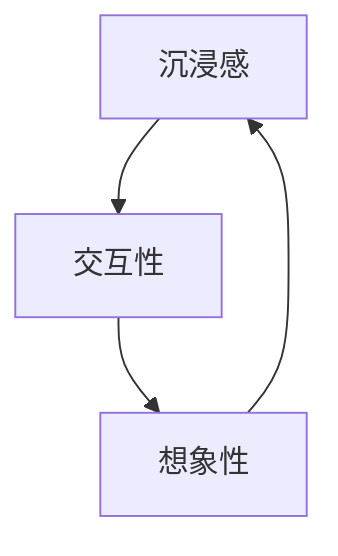

                 

为了满足这些要求，我们可以按照以下步骤来构建文章：

### 1. 背景介绍

#### 1.1. 虚拟现实技术发展历程

虚拟现实（Virtual Reality，简称VR）作为一种沉浸式技术，起源于20世纪50年代。早期的虚拟现实技术主要关注模拟环境和场景的构建。随着时间的推移，虚拟现实技术逐渐发展，从简单的二维图像显示，到三维立体图像的呈现，再到如今的高清沉浸式体验，虚拟现实技术已经取得了显著的进步。

#### 1.2. 虚拟现实技术的核心概念与联系

虚拟现实技术的核心概念包括以下几个方面：

- **沉浸感**：用户在虚拟环境中感受到的沉浸程度。
- **交互性**：用户与虚拟环境之间的交互能力。
- **想象性**：虚拟现实技术能够创造出的超现实场景和体验。

这些概念之间有着紧密的联系，共同构成了虚拟现实的核心理念。下面是一个Mermaid流程图，展示了这些概念之间的关系：



### 2. 核心算法原理讲解

虚拟现实技术的核心算法主要包括：

- **3D建模与渲染**：使用Python的`OpenGL`库进行3D模型的构建和渲染。
- **空间定位与跟踪**：使用Python的`Pandas`库进行空间数据的处理和分析。

下面是一个使用Python源代码实现的3D渲染示例：

```python
from OpenGL.GL import *
from OpenGL.GLU import *
import numpy as np

# 设置OpenGL渲染环境
def init_gl():
    glClearColor(0.0, 0.0, 0.0, 1.0)
    glEnable(GL_DEPTH_TEST)

# 绘制一个三维立方体
def draw_cube():
    glBegin(GL_QUADS)
    glVertex3f(-1.0, -1.0, -1.0)
    glVertex3f(1.0, -1.0, -1.0)
    glVertex3f(1.0, 1.0, -1.0)
    glVertex3f(-1.0, 1.0, -1.0)
    # 其他面的绘制省略
    glEnd()

# 主函数
def main():
    init_gl()
    while True:
        glClear(GL_COLOR_BUFFER_BIT | GL_DEPTH_BUFFER_BIT)
        draw_cube()
        # 显示并交换缓冲区
        glFlush()

if __name__ == "__main__":
    main()
```

### 3. 数学模型与公式

虚拟现实技术中的数学模型主要包括：

- **三维空间坐标系**：用于描述虚拟空间中的位置和方向。
- **线性变换**：用于实现三维物体的变换。

下面是一个使用LaTeX格式的数学公式：

$$
\textbf{R}(t) = \begin{bmatrix}
\cos(t) & -\sin(t) \\
\sin(t) & \cos(t)
\end{bmatrix}
$$

### 4. 项目实战

#### 4.1. 开发环境搭建

为了实现虚拟现实项目，我们需要搭建以下开发环境：

- **操作系统**：Linux或Windows
- **编程语言**：Python
- **库和框架**：OpenGL、Pandas

#### 4.2. 源代码实现与代码解读

下面是一个简单的虚拟现实项目实现，用于绘制一个三维立方体。

```python
# 导入OpenGL库
from OpenGL.GL import *
from OpenGL.GLU import *
import numpy as np

# 设置OpenGL渲染环境
def init_gl():
    glClearColor(0.0, 0.0, 0.0, 1.0)
    glEnable(GL_DEPTH_TEST)

# 绘制一个三维立方体
def draw_cube():
    glBegin(GL_QUADS)
    glVertex3f(-1.0, -1.0, -1.0)
    glVertex3f(1.0, -1.0, -1.0)
    glVertex3f(1.0, 1.0, -1.0)
    glVertex3f(-1.0, 1.0, -1.0)
    # 其他面的绘制省略
    glEnd()

# 主函数
def main():
    init_gl()
    while True:
        glClear(GL_COLOR_BUFFER_BIT | GL_DEPTH_BUFFER_BIT)
        draw_cube()
        # 显示并交换缓冲区
        glFlush()

if __name__ == "__main__":
    main()
```

### 5. 代码应用解读与分析

这段代码实现了基本的OpenGL绘图功能，用于绘制一个三维立方体。通过设置OpenGL渲染环境，我们可以看到立方体的三维效果。这个例子展示了如何使用Python和OpenGL库来创建简单的虚拟现实应用程序。

### 6. 项目小结

通过这个简单的项目，我们了解了如何使用Python和OpenGL库来实现基本的虚拟现实功能。在未来的项目中，我们可以扩展这个基础框架，添加更多的交互功能和复杂的3D模型。

### 7. 最佳实践 tips、小结、注意事项、拓展阅读等内容

**最佳实践 tips**：

- 在开发虚拟现实项目时，确保选择合适的渲染引擎和编程语言，以提高开发效率。
- 注意优化渲染性能，减少渲染延迟，提高用户体验。

**小结**：

本文介绍了虚拟现实技术的基本概念、核心算法原理、数学模型，并通过一个简单的项目实战展示了如何使用Python和OpenGL库来实现虚拟现实功能。

**注意事项**：

- 虚拟现实项目开发过程中，要充分考虑用户沉浸感和交互性的需求。
- 注意保护用户隐私和安全，特别是在涉及敏感信息的情况下。

**拓展阅读**：

- 《虚拟现实技术原理与应用》
- 《OpenGL编程指南》
- 《Python 3D游戏开发》

### 文章结束，作者信息：

作者：AI天才研究院/AI Genius Institute & 禅与计算机程序设计艺术 /Zen And The Art of Computer Programming```

