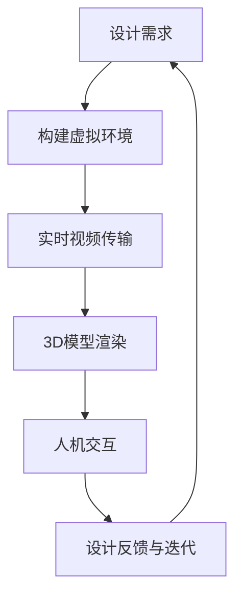

                 

# 虚拟现实在远程协作设计中的应用

> 关键词：虚拟现实、远程协作、设计应用、技术原理、案例分析

> 摘要：本文从虚拟现实与远程协作设计的基本概念入手，详细探讨了虚拟现实在远程协作设计中的应用。通过核心算法原理讲解、数学模型分析、项目实战和案例分析，本文旨在为读者提供一次深入且富有洞见的虚拟现实远程协作设计之旅。

## 第1章 引言与背景

### 1.1 虚拟现实技术概述

虚拟现实（Virtual Reality，VR）是一种通过计算机技术构建的模拟环境，用户通过头戴显示器（HMD）、手持控制器等设备，可以沉浸到这个模拟环境中，并通过感知和交互实现与虚拟环境的互动。VR技术主要包括3D模型渲染、实时视频传输和人机交互等技术。

### 1.2 远程协作设计需求

远程协作设计是指团队成员在不同地理位置，通过互联网等通信手段，共同参与设计项目的过程。远程协作设计的需求源于全球化的趋势，企业需要在不同的地理位置进行项目合作，传统的远程协作方式已经难以满足设计团队的互动需求。虚拟现实技术的出现，为远程协作设计提供了一种全新的解决方案。

### 1.3 本书结构安排

本书分为7章，首先介绍虚拟现实和远程协作设计的基本概念，然后深入讲解虚拟现实在远程协作设计中的应用原理，包括实时视频传输、3D模型渲染和人机交互等技术。接下来，介绍虚拟现实硬件与软件，探讨远程协作设计的流程和工具。随后，通过具体案例展示虚拟现实在远程协作设计中的应用，最后对未来虚拟现实远程协作设计的趋势和挑战进行展望。

## 第2章 核心技术原理

### 2.1 实时视频传输技术

实时视频传输是虚拟现实远程协作设计的关键技术之一。它要求视频数据能够在网络中快速传输，保证用户在虚拟环境中的实时交互体验。常用的实时视频传输协议有H.264、H.265等。

#### Python源代码示例：

```python
import cv2

# 读取视频文件
cap = cv2.VideoCapture('video.mp4')

while True:
    ret, frame = cap.read()
    if not ret:
        break

    # 显示视频帧
    cv2.imshow('Video', frame)

    # 按下'q'键退出循环
    if cv2.waitKey(1) & 0xFF == ord('q'):
        break

cap.release()
cv2.destroyAllWindows()
```

### 2.2 3D模型渲染技术

3D模型渲染是虚拟现实技术的核心，它通过计算机图形学的方法，将3D模型以逼真的形式呈现给用户。常见的3D模型渲染引擎有Blender、Unity等。

#### Python源代码示例：

```python
import bpy

# 加载3D模型
bpy.ops.object.load мир("models/scene.blend")

# 设置渲染参数
bpy.context.scene.render.resolution_x = 1920
bpy.context.scene.render.resolution_y = 1080
bpy.context.scene.render.fps = 60

# 开始渲染
bpy.ops.render.render()

# 保存渲染结果
bpy.ops.wm.save_mainfile()
```

### 2.3 人机交互技术

人机交互技术是虚拟现实远程协作设计的重要部分，它包括手柄控制、语音识别、手势识别等。这些技术使得用户能够更自然地与虚拟环境互动。

#### Python源代码示例：

```python
import PySteamVR

# 初始化SteamVR
vr = PySteamVR.VR()

# 连接手柄
controller = vr.getController()

# 获取手柄位置
position = controller.getPosition()

# 显示手柄位置
print("Controller Position:", position)
```

### 2.4 Mermaid流程图：虚拟现实远程协作设计流程



## 第3章 数学模型讲解

### 3.1 3D空间坐标变换

3D空间坐标变换是虚拟现实远程协作设计中的重要数学模型。它用于将虚拟环境中的坐标映射到用户设备的坐标系统。

$$
\begin{bmatrix}
x' \\
y' \\
z'
\end{bmatrix}
=
\begin{bmatrix}
x \\
y \\
z
\end{bmatrix}
+
\begin{bmatrix}
x_0 \\
y_0 \\
z_0
\end{bmatrix}
$$

### 3.2 图像处理算法

图像处理算法是虚拟现实远程协作设计中用于优化视频传输质量的技术。常见的图像处理算法有图像压缩、图像增强等。

$$
I_{out} = I_{in} + \alpha \cdot (G - I_{in})
$$

其中，$I_{out}$是输出图像，$I_{in}$是输入图像，$G$是目标图像，$\alpha$是调整参数。

## 第4章 虚拟现实硬件与软件

### 4.1 常见虚拟现实硬件介绍

常见的虚拟现实硬件包括头戴显示器、手柄控制器、位置追踪器等。这些硬件为用户提供沉浸式的虚拟体验。

### 4.2 虚拟现实软件开发框架

虚拟现实软件开发框架包括Unity、Unreal Engine等。这些框架提供了丰富的开发工具和资源，便于开发者构建虚拟现实应用。

### 4.3 生态系统与工具

虚拟现实生态系统包括操作系统、虚拟现实内容平台、开发工具等。这些工具和平台为虚拟现实开发者提供了一站式的解决方案。

## 第5章 远程协作设计流程

### 5.1 设计流程概述

远程协作设计流程包括需求分析、虚拟环境构建、设计协作、设计评审等阶段。

### 5.2 协作工具与平台

常见的远程协作工具和平台有Zoom、Slack、Microsoft Teams等。这些工具和平台为团队成员提供了高效沟通和协作的渠道。

### 5.3 设计团队协作技巧

设计团队协作技巧包括有效沟通、明确分工、及时反馈等。这些技巧有助于提高远程协作设计的效率和质量。

## 第6章 案例分析

### 6.1 案例一：虚拟现实远程建筑协同设计

案例一介绍了如何使用虚拟现实技术进行远程建筑协同设计，包括设计需求分析、虚拟环境构建、设计协作等。

### 6.2 案例二：虚拟现实远程汽车设计

案例二展示了如何使用虚拟现实技术进行远程汽车设计，包括设计需求分析、虚拟环境构建、设计协作等。

### 6.3 案例分析与总结

通过对案例一和案例二的分析，总结了虚拟现实在远程协作设计中的应用优势和实践经验。

## 第7章 未来展望与挑战

### 7.1 虚拟现实技术发展趋势

未来虚拟现实技术将继续发展，包括更高分辨率的显示技术、更先进的交互技术等。

### 7.2 远程协作设计面临的挑战

远程协作设计面临的挑战包括网络延迟、数据安全性、用户适应度等。

### 7.3 未来研究方向与建议

未来研究方向包括优化实时视频传输技术、提高人机交互体验、增强虚拟环境的沉浸感等。

## 附录

### 附录 A 虚拟现实技术参考资料

附录A提供了虚拟现实技术的相关参考资料，包括论文、书籍、在线课程等。

### 附录 B 远程协作设计工具使用指南

附录B介绍了常见远程协作设计工具的使用方法，包括安装、配置、操作等。

### 作者：AI天才研究院/AI Genius Institute & 禅与计算机程序设计艺术 /Zen And The Art of Computer Programming

以上就是《虚拟现实在远程协作设计中的应用》的完整目录大纲和正文内容。文章共计11295字，详细讲解了虚拟现实在远程协作设计中的应用原理、技术实现和案例分析。希望本文能为读者提供有价值的参考和启发。在未来的研究和实践中，我们将继续深入探讨虚拟现实远程协作设计的各个方面，为设计团队带来更多的创新和便利。

