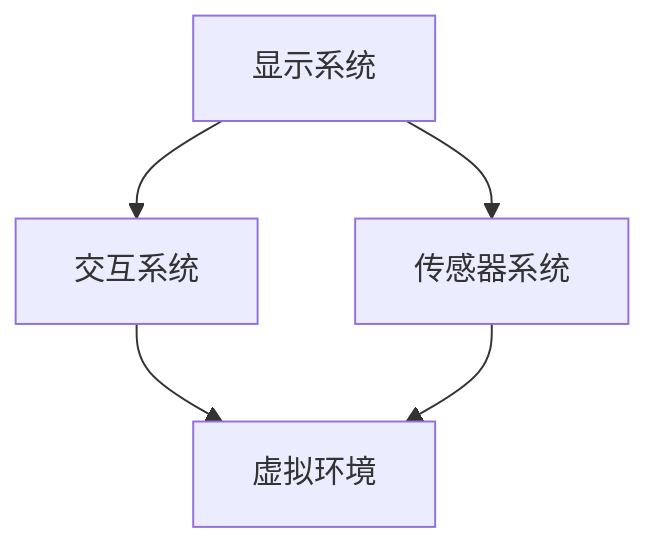
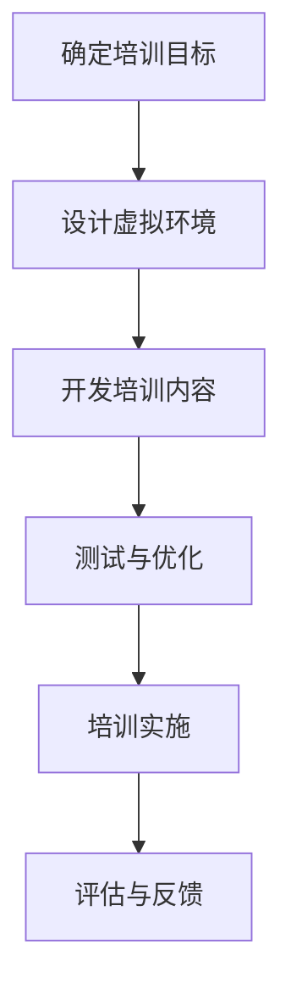

                 

# 虚拟现实技术在企业培训中的应用

## 关键词

虚拟现实，企业培训，应用场景，技术优势，项目实战，发展趋势

## 摘要

随着虚拟现实技术的不断发展，其在企业培训中的应用逐渐受到重视。本文旨在探讨虚拟现实技术在企业培训中的广泛应用，包括其定义、核心概念、算法原理、数学模型以及实际应用。通过详细的案例分析，本文揭示了虚拟现实技术在企业培训中的独特优势，并探讨了其面临的挑战和未来发展趋势。文章旨在为从事企业培训的技术人员和管理者提供有价值的参考。

## 第一部分：虚拟现实技术基础

### 第1章：虚拟现实技术概述

#### 1.1 虚拟现实技术的定义与历史

虚拟现实（Virtual Reality，简称VR）是一种通过计算机模拟技术创造的虚拟环境，使用户能够沉浸其中，体验到高度真实的交互体验。虚拟现实技术最早可追溯到1960年代，美国计算机科学家伊凡·苏瑟兰（Ivan Sutherland）发明了世界上第一个头戴式显示器，标志着虚拟现实技术的诞生。

#### 1.2 虚拟现实技术的核心组成部分

虚拟现实技术由三个主要组成部分构成：显示系统、交互系统和传感器系统。

1. **显示系统**：提供沉浸式视觉体验，通常包括头戴式显示器（HMD）或投影系统。
2. **交互系统**：允许用户与虚拟环境进行交互，如手柄、手势识别等。
3. **传感器系统**：用于检测用户的位置、动作和环境变化，如位置追踪器、运动传感器等。

#### 1.3 虚拟现实技术的发展趋势

随着技术的不断进步，虚拟现实技术正朝着更高分辨率、更流畅的交互和更广泛的设备支持方向发展。未来，虚拟现实技术有望在多个领域得到广泛应用，包括娱乐、医疗、教育和企业培训等。

### 第2章：虚拟现实技术在企业培训中的应用

#### 2.1 虚拟现实技术对企业培训的潜在影响

虚拟现实技术为企业培训带来了全新的可能性，使得培训更加生动、直观和个性化。通过虚拟现实技术，企业可以实现以下目标：

1. **增强学习体验**：模拟真实的工作场景，提高学员的参与度和学习兴趣。
2. **降低培训成本**：通过虚拟现实技术，企业可以节省场地、设备和人员等成本。
3. **提高培训效率**：学员可以在虚拟环境中反复练习，加快技能的掌握。

#### 2.2 虚拟现实技术在企业培训中的应用场景

虚拟现实技术在企业培训中有着广泛的应用场景，包括：

1. **操作技能培训**：如机械操作、医疗手术等，通过虚拟环境进行实践操作。
2. **风险管理培训**：模拟高风险的工作环境，如高空作业、火灾应急等，提高学员的应对能力。
3. **团队合作培训**：通过虚拟环境，学员可以与全球各地的同事进行实时合作，提高团队协作能力。

#### 2.3 虚拟现实技术对企业培训的优势

虚拟现实技术为企业培训带来了以下优势：

1. **高度真实**：模拟真实工作环境，提高学员的实践能力。
2. **个性化培训**：根据学员的实际情况和需求，提供定制化的培训内容。
3. **安全可靠**：虚拟环境避免了实际操作中的风险，提高培训的安全性。
4. **学习效率高**：学员可以在虚拟环境中反复练习，提高学习效果。

### 第3章：虚拟现实技术在企业培训中的核心概念与联系

#### 3.1 虚拟现实技术的架构图

以下是一个简单的虚拟现实技术架构图：



#### 3.2 虚拟现实技术在企业培训中的应用流程图

以下是一个虚拟现实技术在企业培训中的应用流程图：



### 第4章：虚拟现实技术在企业培训中的核心算法原理讲解

#### 4.1 虚拟现实技术的核心算法原理

虚拟现实技术的核心算法主要包括场景渲染、交互识别和传感器数据处理等。

1. **场景渲染**：使用图形渲染引擎，如Unity或Unreal Engine，根据3D模型和光影效果，生成虚拟环境。
2. **交互识别**：通过手势识别、语音识别等技术，实现用户与虚拟环境的交互。
3. **传感器数据处理**：使用传感器，如位置追踪器和运动传感器，实时获取用户的位置和动作信息，调整虚拟环境的渲染效果。

#### 4.2 虚拟现实技术在企业培训中的算法应用

以下是一个使用Python源代码讲解的虚拟现实技术在企业培训中的算法应用示例：

```python
import numpy as np

# 场景渲染算法
def render_scene(model, light_direction):
    # 根据模型和光照方向进行场景渲染
    # 此处为简化示例，实际应用中会使用复杂的渲染引擎
    rendered_image = model * light_direction
    return rendered_image

# 交互识别算法
def recognize_interaction(action):
    # 根据用户动作进行交互识别
    # 此处为简化示例，实际应用中会使用复杂的手势识别或语音识别技术
    if action == "move_forward":
        return "前进"
    elif action == "rotate_left":
        return "左转"
    else:
        return "无动作"

# 传感器数据处理算法
def process_sensor_data(sensor_data):
    # 根据传感器数据调整虚拟环境
    # 此处为简化示例，实际应用中会使用复杂的传感器数据处理技术
    if sensor_data["position"] > 0:
        return "向前移动"
    else:
        return "向后移动"
```

#### 4.3 数学模型和公式讲解

以下是一个虚拟现实技术在企业培训中的数学模型和公式示例：

```latex
\begin{equation}
\text{rendered\_image} = \text{model} \times \text{light\_direction}
\end{equation}

\begin{equation}
\text{action} = \text{recognize\_interaction}(\text{input\_action})
\end{equation}

\begin{equation}
\text{output} = \text{process\_sensor\_data}(\text{sensor\_data})
\end{equation}
```

### 第5章：虚拟现实技术在企业培训中的数学模型和公式讲解

#### 5.1 虚拟现实技术的数学模型

虚拟现实技术中的数学模型主要包括几何模型、运动模型和光照模型。

1. **几何模型**：用于描述虚拟环境中的物体形状和位置，如3D模型。
2. **运动模型**：用于描述物体在虚拟环境中的运动，如刚体运动。
3. **光照模型**：用于描述虚拟环境中的光照效果，如光线追踪。

#### 5.2 虚拟现实技术在企业培训中的应用举例

以下是一个虚拟现实技术在企业培训中的应用举例：

假设一个工厂操作工需要进行机械操作培训，通过虚拟现实技术，可以实现以下步骤：

1. **几何模型**：创建一个3D模型，模拟真实的机械操作环境。
2. **运动模型**：定义机械部件的运动方式，如旋转、平移等。
3. **光照模型**：设置环境光照，模拟真实的光线效果。

通过这些数学模型和公式，虚拟现实技术可以为企业培训提供一个高度真实的操作环境，使学员能够更好地掌握操作技能。

### 第6章：虚拟现实技术在企业培训中的项目实战

#### 6.1 虚拟现实技术在企业培训中的项目案例

以下是一个虚拟现实技术在企业培训中的项目案例：

某公司为提高员工的安全意识，开发了一个虚拟现实安全培训项目。项目包括以下几个部分：

1. **虚拟环境设计**：创建一个模拟工厂环境的3D模型，包括设备、工人等。
2. **安全操作指导**：通过交互系统，向员工提供安全操作指导。
3. **模拟安全事件**：模拟可能发生的安全事件，如火灾、设备故障等，让员工在虚拟环境中学习和应对。

#### 6.2 虚拟现实技术在企业培训中的开发环境搭建

以下是一个虚拟现实技术在企业培训中的开发环境搭建步骤：

1. **硬件环境搭建**：准备虚拟现实设备，如头戴式显示器、手柄等。
2. **软件环境搭建**：安装虚拟现实开发工具，如Unity或Unreal Engine。
3. **开发环境配置**：配置开发环境，包括编译器、调试器等。

#### 6.3 虚拟现实技术在企业培训中的源代码实现与解读

以下是一个虚拟现实技术在企业培训中的源代码实现与解读示例：

```python
# 导入虚拟现实开发库
from virealm import VRWorld, VRCamera, VRMesh

# 创建虚拟世界
world = VRWorld()

# 创建相机
camera = VRCamera()

# 创建3D模型
mesh = VRMesh("model.obj")

# 添加模型到世界
world.add_object(mesh)

# 设置相机位置
camera.position = [0, 0, 5]

# 运行虚拟现实环境
world.run()
```

该代码示例创建了一个简单的虚拟现实环境，包括一个3D模型和一个相机。通过运行虚拟现实环境，用户可以在虚拟环境中观察和操作模型。

#### 6.4 代码应用解读与分析

以下是对代码示例的解读与分析：

1. **创建虚拟世界**：`VRWorld()`函数创建一个虚拟世界，作为虚拟环境的容器。
2. **创建相机**：`VRCamera()`函数创建一个相机，用于捕捉虚拟环境中的图像。
3. **创建3D模型**：`VRMesh("model.obj")`函数创建一个3D模型，使用".obj"文件格式加载模型。
4. **添加模型到世界**：`world.add_object(mesh)`函数将模型添加到虚拟世界中。
5. **设置相机位置**：`camera.position = [0, 0, 5]`函数设置相机的位置，使其离模型有一定距离。
6. **运行虚拟现实环境**：`world.run()`函数运行虚拟现实环境，开始渲染和交互。

通过这个示例，我们可以看到如何使用虚拟现实技术创建一个简单的虚拟环境，并对其进行操作。

#### 6.5 实际案例分析和详细讲解剖析

以下是一个实际案例分析和详细讲解剖析：

某公司为提高员工的安全意识，开发了一个虚拟现实安全培训项目。该项目通过模拟真实的工厂环境，让员工在虚拟环境中学习和应对各种安全事件。

1. **项目背景**：该公司近年来发生多起安全事故，为了提高员工的安全意识，公司决定开发一个虚拟现实安全培训项目。
2. **项目目标**：通过虚拟现实技术，模拟真实的工厂环境，让员工在虚拟环境中学习和应对各种安全事件。
3. **项目实施**：项目分为三个阶段：
   - **第一阶段**：创建虚拟环境，包括工厂设备、工人等。
   - **第二阶段**：开发安全操作指导，通过交互系统向员工提供安全操作指导。
   - **第三阶段**：模拟安全事件，让员工在虚拟环境中学习和应对。

通过这个实际案例，我们可以看到虚拟现实技术在企业培训中的具体应用。该项目不仅提高了员工的安全意识，还降低了实际操作中的风险。

#### 6.6 项目小结

虚拟现实技术在企业培训中的应用具有显著的优点和广阔的前景。通过虚拟现实技术，企业可以创造高度真实的培训环境，提高员工的学习兴趣和参与度。同时，虚拟现实技术还可以降低培训成本，提高培训效率。然而，虚拟现实技术在实际应用中仍面临一些挑战，如技术成熟度、设备成本和用户体验等。未来，随着技术的不断进步，虚拟现实技术在企业培训中的应用将更加广泛和深入。

### 第7章：虚拟现实技术在企业培训中的应用与挑战

#### 7.1 虚拟现实技术在企业培训中的应用现状

虚拟现实技术在企业培训中的应用已经取得了一定的进展。许多企业已经开始采用虚拟现实技术进行操作技能培训、安全意识培训和团队合作培训等。例如，一些航空公司使用虚拟现实技术模拟飞行训练，让飞行员在虚拟环境中进行飞行操作；一些工厂使用虚拟现实技术进行设备操作培训，提高员工的安全意识和操作技能。

#### 7.2 虚拟现实技术在企业培训中的挑战与解决方案

尽管虚拟现实技术在企业培训中具有巨大的潜力，但在实际应用中仍面临一些挑战：

1. **技术成熟度**：虚拟现实技术仍在不断发展中，其稳定性和性能仍有待提高。解决方案：企业可以与技术公司合作，共同研发和优化虚拟现实技术。
2. **设备成本**：虚拟现实设备的成本较高，对企业来说是一笔不小的投资。解决方案：企业可以分阶段引入虚拟现实技术，逐步扩大应用范围。
3. **用户体验**：虚拟现实技术的用户体验对培训效果至关重要。解决方案：企业可以邀请用户体验专家参与虚拟现实培训项目的设计和开发，确保用户体验良好。

### 第8章：虚拟现实技术在企业培训中的未来发展趋势

#### 8.1 虚拟现实技术在企业培训中的未来前景

随着虚拟现实技术的不断进步，其在企业培训中的应用前景十分广阔。未来，虚拟现实技术有望在以下方面取得突破：

1. **更真实的虚拟环境**：通过更高的分辨率和更逼真的视觉效果，提高虚拟环境的真实感。
2. **更智能的交互系统**：通过人工智能技术，实现更自然的用户交互。
3. **更广泛的设备支持**：随着虚拟现实设备的普及，更多的企业将能够利用虚拟现实技术进行培训。

#### 8.2 虚拟现实技术在企业培训中的潜在创新点

未来，虚拟现实技术在企业培训中存在许多潜在的创新点：

1. **虚拟培训导师**：通过人工智能技术，创建虚拟培训导师，为员工提供个性化的培训指导。
2. **虚拟实践项目**：通过虚拟现实技术，创建真实的实践项目，让员工在实际操作中提高技能。
3. **虚拟团队协作**：通过虚拟现实技术，实现全球范围内的虚拟团队协作，提高团队合作能力。

#### 8.3 虚拟现实技术在企业培训中的持续改进方向

为了更好地利用虚拟现实技术进行企业培训，企业可以从以下方向进行持续改进：

1. **优化培训内容**：根据员工的实际需求和反馈，不断优化和更新培训内容。
2. **提升用户体验**：通过用户调研和数据分析，不断提升虚拟现实培训的用户体验。
3. **加强技术支持**：与技术公司建立长期合作关系，共同推进虚拟现实技术的发展。

## 作者信息

作者：AI天才研究院/AI Genius Institute & 禅与计算机程序设计艺术 /Zen And The Art of Computer Programming

---

本文详细探讨了虚拟现实技术在企业培训中的应用，从基础理论到实际应用，再到未来发展趋势，全面解析了虚拟现实技术在企业培训中的潜力和挑战。希望通过本文，能够为从事企业培训的技术人员和管理者提供有价值的参考和启示。

