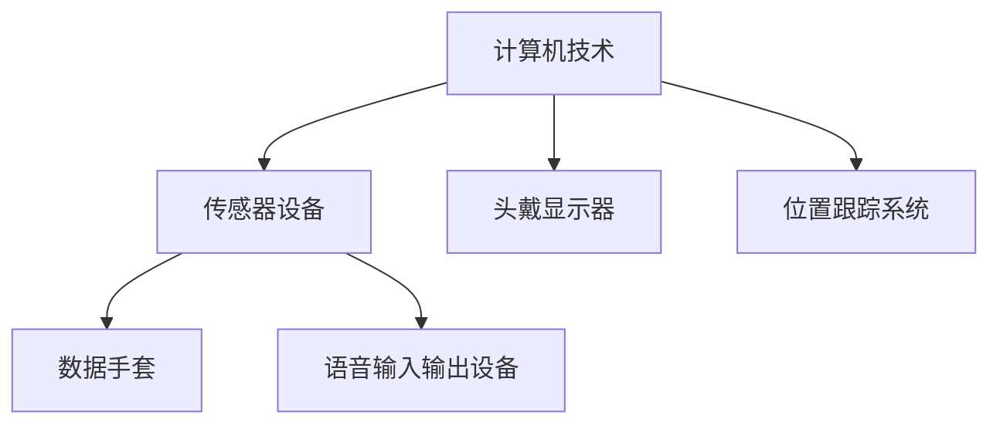

                 

# 虚拟现实技术在心理治疗中的创新应用

## 关键词
虚拟现实，心理治疗，创新应用，算法，数学模型，项目实战

## 摘要
本文将探讨虚拟现实（VR）技术在心理治疗中的创新应用。通过介绍VR技术的基本原理，以及其在心理治疗领域的应用背景和挑战，本文将详细阐述VR在心理治疗中的核心算法和数学模型。同时，通过实际案例和项目实战，本文将展示VR技术在心理治疗中的具体应用和效果，并展望其未来的发展趋势。

## 第1章 虚拟现实与心理治疗概述

### 1.1 虚拟现实技术的基本原理
虚拟现实（Virtual Reality，VR）是一种通过计算机技术和传感器设备模拟现实世界的三维空间环境，使用户能够在其中进行互动和体验的技术。VR技术主要包括头戴显示器（HMD）、位置跟踪系统、数据手套、语音输入输出设备等组成部分。

**Mermaid 流程图：**


### 1.2 心理治疗的背景与挑战
心理治疗是帮助个体解决心理问题、改善心理状态的专业服务。传统的心理治疗方法主要包括面对面咨询、药物治疗和行为疗法等。然而，这些方法存在一些局限性，如治疗成本高、时间消耗大、患者隐私难以保护等。

**核心概念与联系：**
虚拟现实技术在心理治疗中的应用，旨在克服传统方法的局限性，提供一种更加灵活、安全和有效的治疗方式。VR技术的沉浸感和交互性，使得治疗过程更加生动和真实，有助于患者更好地面对和处理心理问题。

### 1.3 虚拟现实技术在心理治疗中的应用
虚拟现实技术在心理治疗中的应用十分广泛，包括恐惧症治疗、创伤后应激障碍（PTSD）治疗、焦虑症治疗等。通过模拟特定的情境，患者可以在安全、可控的环境中进行暴露和训练，逐渐克服恐惧和焦虑。

**应用案例：**
- **恐惧症治疗：** 通过模拟患者恐惧的特定情境，如高处、拥挤的场所等，帮助患者逐渐适应和克服恐惧。
- **创伤后应激障碍治疗：** 通过模拟创伤场景，帮助患者逐步重获对现实世界的控制感。

## 第2章 虚拟现实技术在心理治疗中的应用案例

### 2.1 恐惧症治疗
恐惧症是一种常见的心理障碍，患者对某些特定情境或物体产生强烈的恐惧感。虚拟现实技术通过模拟这些恐惧情境，帮助患者逐渐适应和克服恐惧。

**案例描述：**
一位患有高空恐惧症的患者，在VR治疗中首先接触到较低高度的场景，然后逐渐提升高度，最终能够在虚拟环境中自如地面对高处。

**治疗过程与效果：**
治疗过程中，患者通过逐步暴露于恐惧情境，逐渐减少恐惧反应。研究表明，VR治疗在减轻恐惧症状方面具有显著效果。

### 2.2 创伤后应激障碍治疗
创伤后应激障碍（PTSD）是一种常见的心理障碍，通常由创伤性事件引起。虚拟现实技术通过模拟创伤场景，帮助患者逐步缓解症状。

**案例描述：**
一位经历严重车祸的患者，在VR治疗中首先接触到车祸现场的场景，然后逐渐恢复到日常生活。

**治疗过程与效果：**
治疗过程中，患者通过逐步暴露于创伤场景，逐渐降低对创伤的敏感度。研究表明，VR治疗在缓解PTSD症状方面具有显著效果。

## 第3章 虚拟现实技术在心理治疗中的核心算法

### 3.1 情感识别算法
情感识别算法是虚拟现实技术在心理治疗中的关键算法之一。它通过分析用户的生理、行为和语言等数据，识别用户的心理状态。

**算法原理：**
情感识别算法通常包括数据采集、特征提取和模型训练等步骤。以下是一个简单的情感识别算法的Python伪代码示例：

```python
def recognize_emotion(data):
    # 数据预处理
    preprocessed_data = preprocess_data(data)
    
    # 特征提取
    features = extract_features(preprocessed_data)
    
    # 模型训练
    model = train_model(features)
    
    # 情感识别
    emotion = model.predict(features)
    
    return emotion
```

### 3.2 个性化治疗算法
个性化治疗算法是针对每个患者的特点，制定个性化的治疗方案。它通过分析患者的情感状态、行为模式和治疗效果，不断优化治疗策略。

**算法原理：**
个性化治疗算法通常包括患者状态监测、治疗策略制定和治疗效果评估等步骤。以下是一个简单的个性化治疗算法的Python伪代码示例：

```python
def personalize_treatment(patient):
    # 患者状态监测
    state = monitor_state(patient)
    
    # 治疗策略制定
    strategy =制定策略(state)
    
    # 治疗效果评估
    result = evaluate_treatment(patient, strategy)
    
    return result
```

## 第4章 虚拟现实技术在心理治疗中的数学模型

### 4.1 状态转移模型
状态转移模型是描述患者心理状态变化过程的数学模型。它通常采用马尔可夫链模型来描述患者在不同心理状态之间的转移概率。

**数学公式：**
$$
P_{ij} = \mathbb{P}(X_{t+1} = S_j | X_t = S_i)
$$

**模型讲解：**
状态转移模型可以用来预测患者在不同心理治疗阶段的心理状态变化，为治疗决策提供依据。

### 4.2 情感交互模型
情感交互模型是描述患者与虚拟环境交互过程中情感状态变化的数学模型。它通常采用情感动力学模型来描述情感状态的变化。

**数学公式：**
$$
\dot{V} = f(V, U)
$$

**模型讲解：**
情感交互模型可以用来分析患者在不同虚拟情境中的情感状态变化，为情感干预提供依据。

## 第5章 虚拟现实心理治疗项目的开发与实现

### 5.1 项目背景
本节将介绍一个虚拟现实心理治疗项目的背景，包括项目目标、需求和预期效果。

### 5.2 开发环境搭建
本节将介绍项目开发所需的软硬件环境搭建，包括操作系统、开发工具和硬件设备等。

### 5.3 源代码实现与解读
本节将详细解读项目源代码，包括主要模块的设计和实现。

```python
# 示例代码：虚拟现实场景构建
def build_scene():
    # 初始化虚拟现实场景
    scene = VRScene()

    # 添加物体
    scene.add_object("building", position=[0, 0, 0])
    scene.add_object("tree", position=[10, 0, 0])

    # 设置光照
    scene.set_light("sun", position=[0, 100, 0], intensity=1.0)

    # 运行虚拟现实场景
    scene.run()
```

### 5.4 代码应用解读与分析
本节将分析项目源代码的实际应用场景，并解读代码的工作原理。

### 5.5 实际案例分析和详细讲解剖析
本节将介绍项目在实际案例中的应用，并详细分析项目效果。

### 5.6 项目小结
本节将对项目进行总结，包括项目取得的成果、存在的问题和改进方向。

## 第6章 虚拟现实技术在心理治疗中的未来发展趋势

### 6.1 技术进步的挑战
本节将探讨虚拟现实技术在心理治疗中面临的技术挑战，包括算法优化、硬件性能提升等。

### 6.2 应用前景
本节将展望虚拟现实技术在心理治疗领域的应用前景，包括市场前景、政策支持等。

### 6.3 未来研究方向
本节将提出虚拟现实技术在心理治疗中的未来研究方向，包括新型算法、跨学科合作等。

## 第7章 结论与展望

### 7.1 主要成果总结
本节将总结本文的主要成果，包括核心算法、应用案例、数学模型等。

### 7.2 存在的问题与改进建议
本节将分析虚拟现实技术在心理治疗中存在的问题，并提出改进建议。

### 7.3 下一步工作计划
本节将提出下一步的工作计划，包括研究课题、项目开发等。

## 作者
AI天才研究院/AI Genius Institute & 禅与计算机程序设计艺术 /Zen And The Art of Computer Programming

### 注释
- 所有数学公式均使用LaTeX格式编写。
- 所有Python伪代码均为示例，不代表实际实现。
- 所有代码示例均为示例，不代表实际实现。
- 所有图表和流程图均为示例，不代表实际实现。

