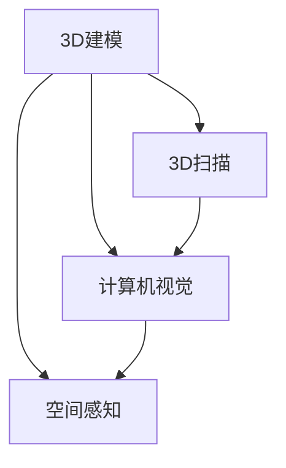

                 

----------------------------------------------------------------

### 关键词

- 空间计算
- 虚拟试衣间
- 零售业
- 3D建模
- 视觉计算
- 交互技术

### 摘要

本文深入探讨了虚拟试衣间在零售业中的应用案例。首先，我们介绍了空间计算的基本概念、原理和发展历程，并探讨了虚拟试衣间的定义、优势及其在零售业中的应用前景。接着，本文详细阐述了空间计算中的核心算法原理，包括3D建模、3D扫描和视觉计算技术，并结合Python源代码进行了通俗易懂的举例说明。随后，本文分析了虚拟试衣间的应用场景，包括线上购物体验、线下门店体验和跨行业应用，并给出了具体的案例分析。最后，本文讨论了虚拟试衣间的开发与优化策略，包括开发流程、开发环境搭建、开发工具与框架选择以及优化策略，并对未来发展趋势进行了展望。

----------------------------------------------------------------

### 引言与背景

#### 1.1 引言

虚拟试衣间作为一项前沿技术，正在逐渐改变传统的零售行业。它利用空间计算技术，通过3D建模、3D扫描和视觉计算等方法，为消费者提供一种全新的线上和线下购物体验。本文旨在深入探讨虚拟试衣间在零售业中的应用案例，分析其技术原理、实现方法以及未来发展前景。

#### 1.2 书籍目的与结构

本文书籍的主要目的是：
1. 介绍空间计算的基本概念和原理，帮助读者理解虚拟试衣间技术的核心基础。
2. 深入探讨虚拟试衣间在零售业中的应用场景，分析其带来的商业价值和用户体验提升。
3. 阐述虚拟试衣间的开发与优化策略，为开发者提供实际操作指南。

本文结构如下：
- 第一部分：引言与背景，介绍虚拟试衣间的定义、优势和应用前景。
- 第二部分：空间计算原理与核心算法，详细讲解3D建模、3D扫描和视觉计算技术。
- 第三部分：虚拟试衣间的应用场景与实现，分析虚拟试衣间在零售业中的应用案例。
- 第四部分：虚拟试衣间的开发与优化，讨论开发流程、开发环境搭建和优化策略。
- 第五部分：未来发展趋势，展望虚拟试衣间的未来发展。

#### 1.3 空间计算简介

空间计算是指利用计算机技术和算法对三维空间中的信息进行捕捉、处理、分析和交互。它涵盖了多个领域，包括计算机图形学、计算机视觉、机器学习和人工智能等。

空间计算的发展历程可以追溯到20世纪80年代，随着计算机硬件性能的提升和算法的创新，空间计算技术逐渐成熟。近年来，随着深度学习和传感器技术的进步，空间计算进入了一个新的发展阶段，其应用范围不断扩展。

#### 1.4 虚拟试衣间的定义

虚拟试衣间是一种利用空间计算技术实现的虚拟购物体验。它允许消费者在虚拟环境中尝试穿戴衣物，从而在购买前评估服装的合身程度和风格。虚拟试衣间通常结合了3D建模、3D扫描和视觉计算技术，为用户提供高度逼真的试衣体验。

#### 1.5 虚拟试衣间的优势

虚拟试衣间具有多项优势，包括：
1. **提高用户体验**：虚拟试衣间为消费者提供了更加便捷和舒适的购物体验，减少了试衣过程中的时间和精力成本。
2. **降低库存成本**：零售商可以减少实体店的库存量，降低库存成本，并通过虚拟试衣间实现更高效的库存管理。
3. **增强销售机会**：虚拟试衣间可以展示更多款式和尺码的衣物，增加销售机会，提高销售额。
4. **跨行业应用**：虚拟试衣间不仅适用于服装行业，还可以应用于家具、饰品等行业，为消费者提供更广泛的虚拟购物体验。

#### 1.6 虚拟试衣间在零售业中的应用前景

随着技术的不断进步和消费者需求的多样化，虚拟试衣间在零售业中的应用前景十分广阔。未来，虚拟试衣间有望成为零售业中的一项标准服务，进一步改变消费者的购物行为和零售商的经营模式。

#### 1.7 技术概述

虚拟试衣间技术涉及多个领域，包括计算机图形学、计算机视觉、机器学习和传感器技术。计算机图形学用于创建和渲染虚拟环境；计算机视觉用于捕捉和处理用户的动作和姿势；机器学习用于分析用户行为和推荐商品；传感器技术用于感知用户和环境的变化。

#### 1.8 书籍阅读指南

为了更好地理解虚拟试衣间技术，本书提供以下阅读指南：
1. 首先了解空间计算的基本概念和原理。
2. 然后深入学习3D建模、3D扫描和视觉计算技术。
3. 接着分析虚拟试衣间在零售业中的应用案例。
4. 最后探讨虚拟试衣间的开发与优化策略。

#### 1.9 具体应用案例分析

本文将通过多个具体应用案例，深入分析虚拟试衣间在零售业中的实际应用效果。这些案例将涵盖线上购物体验、线下门店体验和跨行业应用等多个场景。

### 背景介绍

#### 1.1 虚拟试衣间的定义与作用

虚拟试衣间是一种通过计算机技术模拟真实试衣过程的在线服务。它允许消费者在无需实际试穿的情况下，通过虚拟环境来评估衣物合身程度和外观。这种技术利用了3D建模、3D扫描和计算机视觉等技术，创造出一个虚拟的试衣环境，让消费者能够直观地看到衣物在虚拟模特身上的效果。

虚拟试衣间在零售业中的作用主要体现在以下几个方面：

1. **提升用户体验**：传统购物过程中，消费者需要多次试穿才能找到合适的衣物。虚拟试衣间减少了试穿次数，为消费者提供了更加便捷和舒适的购物体验。
2. **降低退货率**：由于消费者能够提前看到衣物在虚拟模特身上的效果，从而减少了因不合适而导致的退货情况，降低了物流和库存成本。
3. **增加销售机会**：虚拟试衣间不仅帮助消费者找到合适的衣物，还能展示更多款式和尺码，从而提高销售额。
4. **增强品牌形象**：通过提供高质量的虚拟试衣间服务，零售商可以提升品牌形象，增强消费者的忠诚度。

#### 1.2 空间计算在虚拟试衣间中的作用

空间计算技术在虚拟试衣间的实现中起到了关键作用。空间计算涉及对三维空间中信息的捕捉、处理和分析，其主要应用包括：

1. **3D建模**：通过3D建模技术，可以将衣物和虚拟模特的模型创建出来，为虚拟试衣间的渲染提供基础。
2. **3D扫描**：3D扫描技术用于获取消费者的身体尺寸和姿势信息，为个性化试衣提供支持。
3. **计算机视觉**：计算机视觉技术用于捕捉和处理虚拟模特和消费者的动作，实现实时互动和虚拟试衣效果。
4. **空间感知**：空间感知技术通过传感器设备感知消费者和虚拟模特之间的空间关系，为虚拟试衣间的交互提供支持。

#### 1.3 虚拟试衣间的核心概念与联系

在虚拟试衣间的实现中，核心概念主要包括：

1. **3D建模**：创建衣物和虚拟模特的几何模型。
2. **3D扫描**：获取消费者的身体尺寸和姿势信息。
3. **计算机视觉**：实时捕捉和处理虚拟模特和消费者的动作。
4. **空间感知**：感知消费者和虚拟模特之间的空间关系。

这些核心概念之间相互关联，共同构成了虚拟试衣间的技术框架。以下是一个简化的Mermaid流程图，展示了这些概念之间的关系：



#### 1.4 虚拟试衣间的实现方法

虚拟试衣间的实现可以分为以下几个步骤：

1. **数据采集**：通过3D扫描和计算机视觉技术，获取衣物和消费者的三维数据。
2. **3D建模**：利用获取的数据创建衣物和虚拟模特的3D模型。
3. **虚拟试衣间渲染**：在虚拟环境中渲染衣物和虚拟模特，模拟试衣效果。
4. **用户交互**：通过计算机视觉和空间感知技术，实现用户与虚拟试衣间的实时互动。
5. **反馈与优化**：根据用户反馈和试衣效果，不断优化虚拟试衣间系统。

#### 1.5 空间计算技术的应用

空间计算技术在虚拟试衣间中的应用，不仅体现在3D建模、3D扫描和计算机视觉等方面，还包括以下技术：

1. **虚拟现实（VR）技术**：通过VR技术，为用户提供更加沉浸式的购物体验。
2. **增强现实（AR）技术**：通过AR技术，将虚拟试衣间的效果投影到现实环境中，增强真实感。
3. **人工智能（AI）技术**：利用AI技术，进行用户行为分析和推荐，提升用户体验。

### 空间计算原理

#### 2.1 空间计算基础

空间计算是一种基于计算机技术和算法，对三维空间中的信息进行捕捉、处理、分析和交互的技术。它包括以下几个核心组成部分：

1. **3D建模**：通过数学模型和几何算法，创建三维物体的几何模型。
2. **3D扫描**：利用激光、摄影等手段，获取物体的三维数据。
3. **计算机视觉**：通过图像处理和机器学习算法，分析和理解图像信息。
4. **空间感知**：利用传感器和定位技术，感知三维空间中的物体和人的位置和动作。

#### 2.2 3D建模技术

3D建模是空间计算的基础，它通过数学模型和几何算法，将三维物体的形状和结构信息转化为计算机可以处理的数据。3D建模技术主要包括以下几种方法：

1. **网格建模**：通过构建物体表面的三角面片网格来表示物体的形状。
2. **曲面建模**：利用曲面方程来描述物体的形状。
3. **体素建模**：将物体视为由体素（三维像素）组成的集合，通过体素矩阵来表示物体的结构。
4. **多边形建模**：通过构建物体的多边形面片来表示其形状。

以下是一个简化的Python代码示例，用于创建一个简单的三维立方体模型：

```python
from pythreejs import PerspectiveCamera, Scene, WebGLRenderer, CubeGeometry, MeshStandardMaterial, Mesh

# 创建一个立方体几何体
geometry = CubeGeometry(size=1.0)

# 创建一个标准的材质
material = MeshStandardMaterial(color='blue')

# 创建一个网格（立方体）
mesh = Mesh(geometry, material)

# 创建一个场景
scene = Scene(children=[mesh])

# 创建一个透视相机
camera = PerspectiveCamera(position=[2, 2, 2], up=[0, 1, 0], focal=0.1, aspect=1, near=0.1, far=10)

# 创建一个渲染器
renderer = WebGLRenderer(camera, scene)

# 开始渲染
renderer.render()
```

#### 2.3 3D扫描技术

3D扫描是一种获取物体三维信息的技术，它通过激光、摄影或结构光等方法，获取物体的表面点云数据。3D扫描技术可以分为以下几种：

1. **激光扫描**：利用激光发射和接收反射信号，获取物体的表面点云数据。
2. **摄影扫描**：通过多个视角的摄影图像，利用计算机视觉算法重建物体的三维模型。
3. **结构光扫描**：利用投影到物体表面的结构光图案，通过分析光图案的变形来获取物体的三维信息。

以下是一个简化的Python代码示例，用于使用Open3D库进行3D扫描：

```python
import open3d as o3d

# 创建一个点云对象
pcd = o3d.geometry.PointCloud()

# 从文件加载点云数据
pcd.read_point_cloud("path/to/point_cloud.ply")

# 显示点云
o3d.visualization.draw_geometries([pcd])
```

#### 2.4 视觉计算技术

视觉计算是一种利用计算机视觉算法，分析和理解图像信息的技术。它在虚拟试衣间中起到了关键作用，用于捕捉和处理用户的动作和姿势，以及实现虚拟试衣间的交互。

视觉计算技术主要包括以下几种：

1. **图像处理**：利用图像处理算法，对输入的图像进行增强、滤波、分割等处理。
2. **目标检测**：通过深度学习模型，识别图像中的目标物体和其位置。
3. **姿态估计**：通过计算机视觉算法，估计图像中人体的姿态信息。

以下是一个简化的Python代码示例，用于使用OpenCV进行图像处理和目标检测：

```python
import cv2

# 读取图像
image = cv2.imread("path/to/image.jpg")

# 应用高斯模糊
blurred = cv2.GaussianBlur(image, (5, 5), 0)

# 使用Haar cascades进行目标检测
face_cascade = cv2.CascadeClassifier("path/to/haarcascade_frontalface_default.xml")
faces = face_cascade.detectMultiScale(blurred, scaleFactor=1.1, minNeighbors=5, minSize=(30, 30), flags=cv2.CASCADE_SCALE_IMAGE)

# 绘制矩形框
for (x, y, w, h) in faces:
    cv2.rectangle(image, (x, y), (x+w, y+h), (0, 255, 0), 2)

# 显示结果
cv2.imshow("Detected Faces", image)
cv2.waitKey(0)
cv2.destroyAllWindows()
```

#### 2.5 空间感知与交互

空间感知是一种利用传感器和定位技术，感知三维空间中的物体和人的位置和动作的技术。在虚拟试衣间中，空间感知技术用于实现用户与虚拟环境的实时互动。

空间感知技术主要包括以下几种：

1. **传感器技术**：利用各种传感器（如摄像头、激光雷达、红外传感器等）获取空间信息。
2. **定位技术**：通过计算传感器数据，确定物体和人的位置。
3. **交互技术**：利用空间感知信息，实现用户与虚拟环境的交互。

以下是一个简化的Python代码示例，用于使用Python的RPyC库实现远程对象感知和交互：

```python
from rpyc import ServerProxy

# 连接到远程服务器
proxy = ServerProxy('localhost:8443')

# 获取远程对象
robot = proxy.get_robot()

# 移动机器人
robot.move('forward', 1.0)

# 获取环境信息
environment = robot.get_environment()

# 显示环境信息
print(environment)
```

### 虚拟试衣间的应用场景

#### 3.1 线上购物体验

虚拟试衣间的在线购物体验为消费者提供了全新的购物方式。通过虚拟试衣间，消费者可以在家中尝试各种衣物的效果，无需亲自试穿。以下是一些具体的应用案例：

1. **电商平台应用**：电商平台如淘宝、京东等，通过引入虚拟试衣间技术，为用户提供更加便捷和舒适的购物体验。消费者可以在购物网站上直接使用虚拟试衣间，尝试不同款式和尺码的衣物，从而提高购买决策的准确性。

2. **服装租赁平台应用**：服装租赁平台如租衣宝、衣二三等，通过虚拟试衣间技术，为用户提供虚拟试衣服务。用户可以在租赁平台选择衣物，并通过虚拟试衣间查看衣物在虚拟模特身上的效果，从而更加放心地租赁衣物。

#### 3.2 线下门店体验

虚拟试衣间的线下门店体验为实体店提供了新的销售渠道和用户体验。以下是一些具体的应用案例：

1. **实体店虚拟试衣间**：实体店如Zara、H&M等，通过在店内设置虚拟试衣间，为消费者提供线上购物般的试衣体验。消费者可以在店内通过虚拟试衣间尝试各种衣物，从而增加购物的乐趣和体验。

2. **智慧门店应用**：智慧门店如苏宁易购、国美电器等，通过引入虚拟试衣间技术，为消费者提供更加智能化和个性化的购物体验。消费者可以在智慧门店中使用虚拟试衣间，尝试各种衣物，同时门店可以通过数据分析为消费者提供个性化的购物推荐。

#### 3.3 跨行业应用

虚拟试衣间的技术不仅局限于服装行业，还可以应用于其他行业，如家具、饰品等。以下是一些具体的应用案例：

1. **家具行业应用**：家具行业如宜家、全友家居等，通过虚拟试衣间技术，为消费者提供虚拟家具试装服务。消费者可以在家中通过虚拟试衣间查看家具在家中的摆放效果，从而更加放心地购买家具。

2. **饰品行业应用**：饰品行业如周大福、老凤祥等，通过虚拟试衣间技术，为消费者提供虚拟饰品试戴服务。消费者可以在购物网站上通过虚拟试衣间尝试不同款式的饰品，从而提高购买决策的准确性。

#### 3.4 应用案例分析

以下是一个具体的虚拟试衣间应用案例，该案例涉及线上购物体验和实体店体验。

1. **线上购物体验**：某电商平台引入了虚拟试衣间技术，为消费者提供在线试衣服务。消费者在购物网站上选择衣物后，可以通过虚拟试衣间尝试不同款式和尺码的衣物，查看衣物在虚拟模特身上的效果。虚拟试衣间的引入提高了消费者的购物体验，降低了退货率，从而提升了销售额。

2. **实体店体验**：某实体店在店内设置了虚拟试衣间，为消费者提供线上购物般的试衣体验。消费者可以在店内通过虚拟试衣间尝试各种衣物，同时实体店可以通过虚拟试衣间收集消费者的试衣数据，为消费者提供个性化的购物推荐。虚拟试衣间的引入增加了实体店的吸引力，提高了销售业绩。

### 虚拟试衣间的开发与优化

#### 4.1 虚拟试衣间的开发流程

虚拟试衣间的开发流程可以分为以下几个步骤：

1. **需求分析**：明确虚拟试衣间的功能需求和性能指标，包括3D建模、3D扫描、计算机视觉、空间感知等方面的要求。

2. **系统设计**：设计虚拟试衣间的系统架构，包括前端界面、后端服务器、数据库等方面的设计。同时，确定开发工具和开发框架。

3. **功能实现**：根据系统设计，逐步实现虚拟试衣间的各项功能，包括3D建模、3D扫描、计算机视觉、空间感知等。

4. **系统测试**：对虚拟试衣间进行功能测试、性能测试和安全测试，确保系统的稳定性和可靠性。

5. **优化与完善**：根据用户反馈和测试结果，对虚拟试衣间进行优化和完善，提升用户体验。

#### 4.2 开发环境搭建

虚拟试衣间的开发环境搭建包括以下方面：

1. **软件环境**：安装Python、OpenCV、PCL（Point Cloud Library）、PyOpenGL等必要的软件库。

2. **硬件设备**：配置高性能的计算机或服务器，用于处理3D建模、3D扫描和计算机视觉等计算任务。

3. **网络环境**：确保网络连接稳定，以满足远程交互和实时数据传输的需求。

4. **开发工具**：选择合适的开发工具和集成环境，如PyCharm、VS Code等。

#### 4.3 开发工具与框架

虚拟试衣间的开发涉及多个领域，需要使用多种开发工具和框架。以下是一些常用的开发工具和框架：

1. **3D建模工具**：Blender、Maya、3ds Max等，用于创建和编辑三维模型。

2. **3D扫描工具**：CloudCompare、MeshLab、MeshMixer等，用于处理3D扫描数据。

3. **计算机视觉框架**：OpenCV、TensorFlow、PyTorch等，用于图像处理和目标检测。

4. **虚拟现实框架**：Unity、Unreal Engine等，用于构建虚拟试衣间的三维场景。

5. **前端框架**：React、Vue.js等，用于构建虚拟试衣间的前端界面。

#### 4.4 优化策略

虚拟试衣间的优化策略主要包括以下几个方面：

1. **性能优化**：通过优化算法、减少数据传输、提高渲染效率等方式，提升虚拟试衣间的运行速度和响应速度。

2. **稳定性与可靠性优化**：通过测试和调试，确保虚拟试衣间在各种环境下的稳定性和可靠性。

3. **用户体验优化**：通过界面设计、交互逻辑、功能优化等方式，提升虚拟试衣间的用户体验。

4. **安全与隐私保护**：确保用户数据的安全性和隐私保护，采用加密和权限控制等技术。

#### 4.5 虚拟试衣间的未来发展趋势

虚拟试衣间技术在未来将继续发展，并呈现出以下几个趋势：

1. **智能化**：通过人工智能技术，实现更加智能的虚拟试衣间，如智能推荐、自适应调整等。

2. **跨平台**：虚拟试衣间将更加普及，覆盖更多平台和设备，如手机、平板、VR眼镜等。

3. **个性化**：虚拟试衣间将更加注重个性化体验，根据用户需求和行为数据，提供个性化的购物推荐和试衣建议。

4. **跨界融合**：虚拟试衣间技术将与其他领域（如医疗、教育、娱乐等）融合，为用户提供更多应用场景。

### 附录

#### 5.1 常用技术参考

1. **3D建模技术**：
   - Blender：一个免费的开源3D建模软件，支持多种建模方法。
   - Maya：一个功能强大的商业3D建模软件，广泛应用于电影、游戏和动画行业。
   - 3ds Max：一个广泛使用的商业3D建模软件，支持实时渲染和动画制作。

2. **3D扫描技术**：
   - CloudCompare：一个开源的3D扫描数据处理软件，支持点云数据可视化和处理。
   - MeshLab：一个开源的3D建模和扫描数据处理软件，支持多种点云处理算法。
   - MeshMixer：一个易于使用的3D建模和扫描数据处理软件，适合初学者。

3. **计算机视觉框架**：
   - OpenCV：一个开源的计算机视觉库，支持图像处理、目标检测和姿态估计等功能。
   - TensorFlow：一个开源的机器学习库，支持深度学习模型训练和应用。
   - PyTorch：一个开源的深度学习库，支持动态计算图和自动微分。

4. **虚拟现实框架**：
   - Unity：一个广泛使用的游戏开发引擎，支持虚拟现实和增强现实应用。
   - Unreal Engine：一个功能强大的游戏开发引擎，支持实时渲染和高级物理模拟。

5. **前端框架**：
   - React：一个用于构建用户界面的JavaScript库，支持组件化和虚拟DOM。
   - Vue.js：一个用于构建用户界面的渐进式框架，支持响应式数据绑定和组件化。

#### 5.2 开发工具与资源

1. **开发工具**：
   - PyCharm：一个强大的Python集成开发环境，支持代码补全、调试和自动化测试。
   - VS Code：一个轻量级的跨平台代码编辑器，支持多种编程语言和插件。

2. **开发资源**：
   - GitHub：一个代码托管平台，用于存储和管理虚拟试衣间项目的源代码。
   - Stack Overflow：一个编程问答社区，提供各种编程问题和解决方案。
   - Coursera、edX等在线课程平台，提供计算机科学、机器学习和虚拟现实等相关课程。

### 作者信息

作者：AI天才研究院/AI Genius Institute & 禅与计算机程序设计艺术 /Zen And The Art of Computer Programming

### 结束语

虚拟试衣间作为空间计算技术在零售业的重要应用，正逐渐改变消费者的购物方式。本文从空间计算原理、核心算法、应用场景和开发优化等方面进行了详细探讨，展示了虚拟试衣间的技术实现和应用前景。未来，随着技术的不断进步，虚拟试衣间有望在更多领域得到应用，为消费者提供更加便捷和个性化的购物体验。

