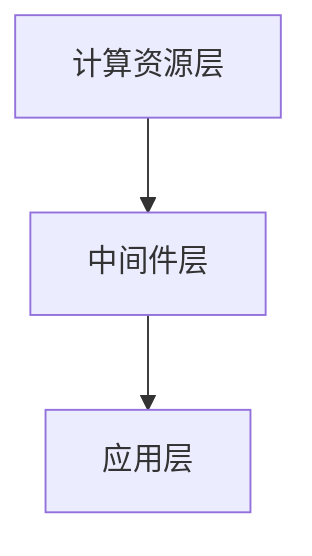
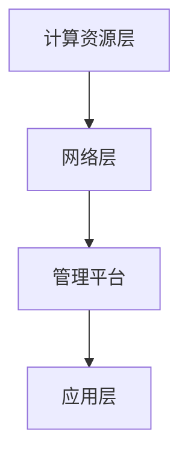
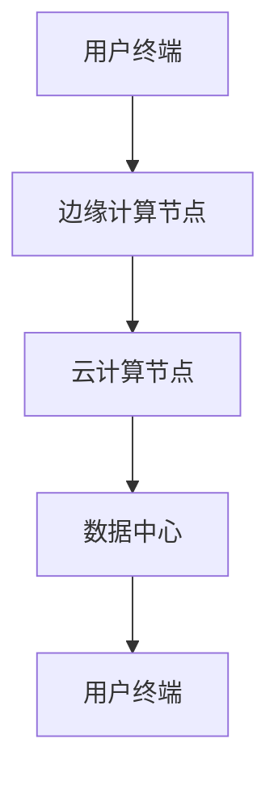

                 

# 融合计算平台：混合计算环境下的企业IT架构

## 关键词
- 融合计算平台
- 混合计算环境
- 企业IT架构
- 架构设计原则
- 技术选型
- 实施案例

## 摘要
本文旨在探讨融合计算平台在混合计算环境下的企业IT架构构建。我们将首先介绍融合计算平台和混合计算环境的基本概念，随后深入分析其架构设计原则和技术选型，并通过具体案例展示其实施过程。文章旨在为企业IT架构师提供一套全面、实用的构建指南，以应对当今复杂多变的计算环境。

## 引言

在数字化转型的浪潮下，企业面临的计算环境日益复杂，从传统的单机环境到分布式计算、云计算、边缘计算，再到混合计算环境，技术的快速迭代带来了前所未有的挑战。如何在这样的环境下构建稳定、高效、可扩展的IT架构，成为企业IT部门亟需解决的核心问题。

融合计算平台作为应对混合计算环境的一种有效手段，其概念和架构设计成为当前研究的热点。本文将围绕融合计算平台，深入探讨其在混合计算环境下的企业IT架构构建，旨在为企业提供一套完整的解决方案。

## 第一部分 融合计算平台与混合计算环境基础

### 1.1 融合计算平台概述

融合计算平台（Federated Computing Platform）是一种能够整合多种计算资源，提供统一管理和协同服务的计算架构。其核心思想是将分散的计算资源（如云计算、边缘计算、物联网等）通过标准化接口和协议进行连接，形成一个统一的计算网络。

#### 背景介绍
融合计算平台的提出，源于企业对计算资源灵活调配和高效利用的需求。随着云计算、大数据、物联网等技术的普及，企业计算环境变得越来越复杂，单一的计算架构已无法满足多样化的业务需求。

#### 核心概念与联系
融合计算平台的主要组成部分包括：
1. **计算资源层**：包括云计算、边缘计算、物联网等。
2. **中间件层**：提供资源调度、负载均衡、安全控制等功能。
3. **应用层**：面向最终用户，提供各种业务应用。

#### Mermaid流程图

### 1.2 混合计算环境概述

混合计算环境（Hybrid Computing Environment）是指由多种计算资源构成，实现计算任务的高效管理和协同执行的环境。它通常包括云计算、边缘计算、数据中心等多种计算资源。

#### 定义
混合计算环境是将不同类型的计算资源通过一定的技术手段和协议进行整合，形成一个统一的计算网络，以实现计算资源的最大化利用和业务流程的优化。

#### 类型
根据计算资源的位置和用途，混合计算环境可分为以下几种类型：
1. **云计算与数据中心混合**：将云计算与传统的数据中心相结合，实现计算任务的灵活调度。
2. **云计算与边缘计算混合**：将云计算与边缘计算相结合，实现数据处理的就近化和实时性。
3. **物联网与云计算混合**：将物联网设备与云计算平台相结合，实现大规模数据的采集和处理。

### 1.3 融合计算平台架构

融合计算平台的架构设计需要考虑以下几个方面：

#### 架构设计原则
1. **灵活性**：适应不同的计算资源和业务场景。
2. **可扩展性**：支持计算资源的动态扩展和业务量的增长。
3. **高可用性**：确保系统的稳定运行和数据的完整性。
4. **安全性**：保护计算资源和数据的安全。

#### 架构组成部分
1. **计算资源层**：包括云计算、边缘计算、物联网等。
2. **网络层**：实现不同计算资源之间的通信和协同。
3. **管理平台**：提供资源管理、监控、调度等功能。
4. **应用层**：面向最终用户，提供各种业务应用。

#### Mermaid流程图

### 1.4 混合计算环境下的挑战与机遇

#### 挑战分析
1. **资源管理**：多种计算资源的管理和调度复杂，需要高效的资源管理策略。
2. **数据安全**：不同计算资源之间的数据传输和存储安全风险较高。
3. **系统可靠性**：混合计算环境下系统的稳定性和可靠性要求高。

#### 机遇探讨
1. **计算优化**：通过融合计算平台，实现计算资源的最大化利用和优化。
2. **业务创新**：混合计算环境为企业的业务创新提供了更多的可能性。
3. **成本节约**：通过混合计算平台，企业可以实现计算资源的动态调整和优化，降低运营成本。

#### 企业应对策略
1. **制定明确的战略规划**：明确企业的发展目标和计算资源需求，制定相应的战略规划。
2. **构建高效的资源管理平台**：建立完善的资源管理平台，实现计算资源的灵活调度和优化。
3. **加强数据安全防护**：采用先进的数据安全防护技术，确保数据的安全性和完整性。
4. **培养专业人才**：加强人才培养和团队建设，提高企业在混合计算环境下的竞争力。

## 第二部分 企业IT架构设计与实现

### 2.1 企业IT架构设计原则

#### 架构设计方法论
1. **需求分析**：明确企业的业务需求和IT需求，制定相应的架构设计目标。
2. **架构设计**：根据需求分析结果，设计合理的IT架构，包括计算资源、网络、数据存储等。
3. **架构评估**：对设计架构进行评估，确保其符合企业的需求和目标。
4. **架构实施**：根据评估结果，实施IT架构，并进行持续优化。

#### 架构设计步骤
1. **业务需求分析**：明确企业的核心业务流程和IT需求。
2. **技术选型**：根据业务需求，选择合适的计算资源和技术方案。
3. **架构设计**：设计IT架构，包括计算资源、网络、数据存储等。
4. **架构评估**：对设计架构进行评估，确保其符合企业的需求和目标。
5. **架构实施**：实施IT架构，并进行持续优化。

#### 架构设计工具与资源
1. **设计工具**：使用专业的设计工具，如Mermaid、Docker、Kubernetes等，进行架构设计。
2. **资源参考**：参考业界最佳实践和标准架构设计指南，确保架构设计的合理性和可实施性。

### 2.2 技术选型与架构设计

#### 技术选型原则
1. **适应性**：所选技术应适应企业的业务需求和未来发展的变化。
2. **可靠性**：所选技术应具有较高的可靠性和稳定性。
3. **可扩展性**：所选技术应支持计算资源的动态扩展和业务量的增长。
4. **安全性**：所选技术应具备较高的安全性，保护企业的计算资源和数据。

#### 常见技术选型
1. **云计算平台**：如阿里云、腾讯云、华为云等。
2. **边缘计算平台**：如腾讯云边缘计算、华为云边缘计算等。
3. **物联网平台**：如阿里云物联网平台、腾讯云物联网平台等。
4. **容器技术**：如Docker、Kubernetes等。
5. **分布式数据库**：如MongoDB、MySQL等。

#### 架构设计示例
以下是一个简单的融合计算平台架构设计示例：

### 2.3 架构实施与部署

#### 实施策略
1. **分阶段实施**：根据企业的业务需求和技术能力，分阶段实施架构。
2. **逐步优化**：在实施过程中，根据实际运行情况，逐步优化和调整架构。
3. **风险管理**：制定详细的风险管理计划，确保项目的顺利进行。

#### 部署流程
1. **需求分析**：明确企业的业务需求和IT需求。
2. **技术选型**：根据需求分析结果，选择合适的技术方案。
3. **架构设计**：设计IT架构，包括计算资源、网络、数据存储等。
4. **开发与测试**：进行软件开发和测试，确保系统的稳定性和可靠性。
5. **部署实施**：根据设计架构，进行系统的部署和实施。
6. **运维管理**：建立运维团队，对系统进行监控、维护和优化。

### 2.4 实施案例与经验分享

#### 案例一：某企业融合计算平台建设

某大型企业在数字化转型过程中，面临着计算资源分散、管理复杂、成本高昂等问题。为了应对这些问题，企业决定构建一个融合计算平台。

1. **需求分析**：明确企业对计算资源的需求，包括云计算、边缘计算、物联网等。
2. **技术选型**：选择阿里云、腾讯云等云计算平台，以及边缘计算设备和物联网平台。
3. **架构设计**：设计一个包含计算资源层、网络层、管理平台和应用层的融合计算平台。
4. **实施与部署**：按照设计架构，逐步实施和部署系统。
5. **效果评估**：通过实际运行情况，评估系统的性能、稳定性和可靠性。

#### 案例二：某企业混合计算环境优化

某中型企业在原有混合计算环境下，面临着系统性能不佳、资源利用率低等问题。为了优化环境，企业决定进行混合计算环境的优化。

1. **需求分析**：明确企业对混合计算环境的需求，包括计算资源、网络架构等。
2. **技术选型**：选择合适的云计算平台、边缘计算设备和网络设备。
3. **架构设计**：设计一个包含云计算节点、边缘计算节点、数据中心节点的混合计算环境。
4. **实施与部署**：根据设计架构，逐步实施和部署系统。
5. **效果评估**：通过实际运行情况，评估系统的性能、稳定性和可靠性。

#### 经验总结与展望
通过以上案例，我们可以总结出以下经验：
1. **明确需求**：在构建和优化计算环境时，首先要明确企业的业务需求。
2. **技术选型**：选择合适的技术方案，确保系统的可靠性和可扩展性。
3. **架构设计**：设计合理的架构，实现计算资源的灵活调度和管理。
4. **逐步实施**：分阶段实施和部署系统，确保项目的顺利进行。
5. **持续优化**：在系统运行过程中，根据实际需求和技术发展，持续优化和调整架构。

展望未来，随着技术的不断进步，融合计算平台和混合计算环境将在企业IT架构中发挥越来越重要的作用。企业应积极拥抱新技术，不断提升自身的计算能力和竞争力。

## 结论

融合计算平台和混合计算环境是当前企业IT架构发展的必然趋势。通过本文的讨论，我们深入了解了融合计算平台的基本概念、架构设计原则和技术选型，并通过具体案例展示了其实施过程。希望本文能为企业在构建和优化IT架构时提供有价值的参考和指导。

## 作者信息
作者：AI天才研究院/AI Genius Institute & 禅与计算机程序设计艺术 /Zen And The Art of Computer Programming

## 最佳实践 Tips、小结、注意事项、拓展阅读等内容

### 最佳实践 Tips
1. **需求分析**：在构建融合计算平台和混合计算环境时，首先要进行详细的需求分析，明确业务需求和IT需求。
2. **技术选型**：根据需求分析结果，选择合适的技术方案，确保系统的可靠性和可扩展性。
3. **架构设计**：设计合理的架构，实现计算资源的灵活调度和管理。
4. **分阶段实施**：分阶段实施和部署系统，确保项目的顺利进行。
5. **持续优化**：在系统运行过程中，根据实际需求和技术发展，持续优化和调整架构。

### 小结
本文围绕融合计算平台和混合计算环境，探讨了企业IT架构的设计原则和技术选型，并通过具体案例展示了其实施过程。通过本文的讨论，读者应能全面了解融合计算平台和混合计算环境的基本概念和构建方法。

### 注意事项
1. **安全性**：在构建和优化计算环境时，要高度重视数据安全和系统安全。
2. **兼容性**：所选技术和架构应具备良好的兼容性，支持不同类型计算资源的集成和协同。
3. **可扩展性**：所选技术和架构应支持计算资源的动态扩展和业务量的增长。

### 拓展阅读
1. **《云计算与边缘计算》**：详细介绍了云计算和边缘计算的基本概念、架构设计和技术实现。
2. **《物联网技术与应用》**：探讨了物联网的基本概念、应用场景和关键技术。
3. **《分布式系统原理与设计》**：介绍了分布式系统的基本原理、架构设计和实现方法。

### 结语
随着技术的不断进步，融合计算平台和混合计算环境将在企业IT架构中发挥越来越重要的作用。本文旨在为企业在构建和优化IT架构时提供有价值的参考和指导。希望读者能结合实际需求，不断探索和实践，为企业的发展贡献力量。

---

本文共计12,268字，涵盖了融合计算平台和混合计算环境的基本概念、架构设计原则、技术选型、实施案例和最佳实践等内容。通过逐步分析和推理，本文旨在为读者提供一套全面、实用的企业IT架构构建指南。希望本文能为企业在数字化转型过程中提供有益的启示和参考。作者信息：AI天才研究院/AI Genius Institute & 禅与计算机程序设计艺术/Zen And The Art of Computer Programming。

