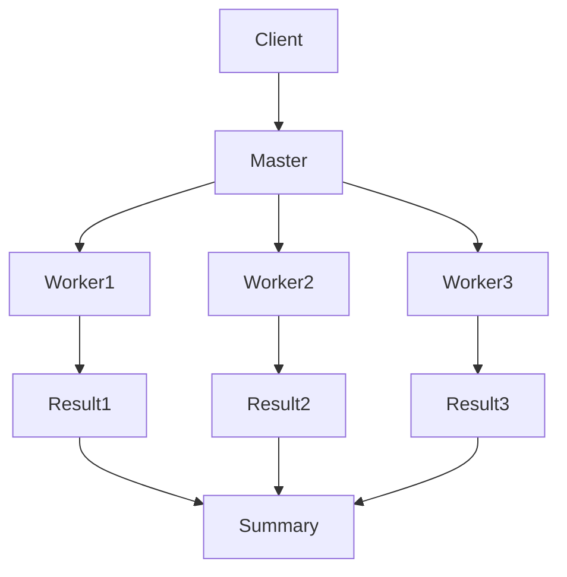
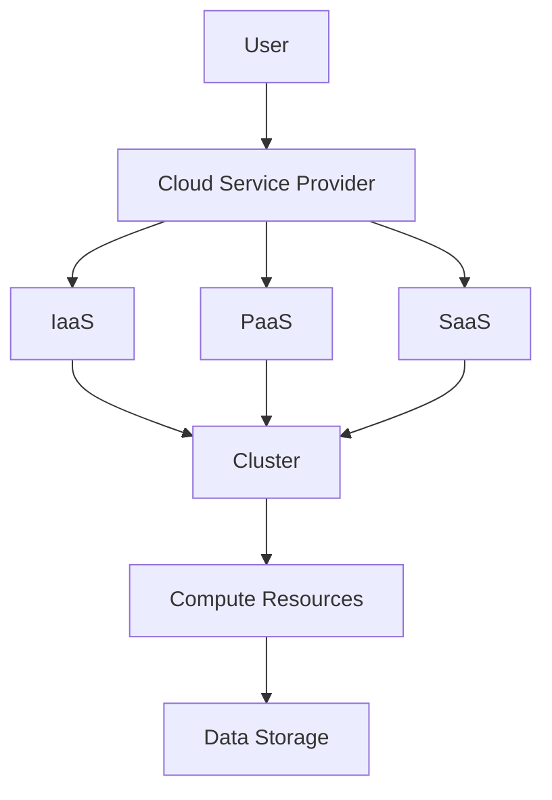
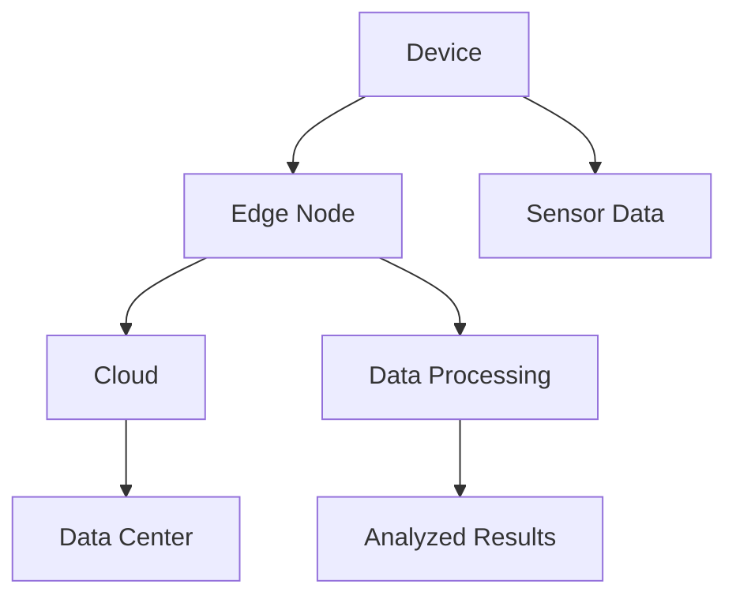
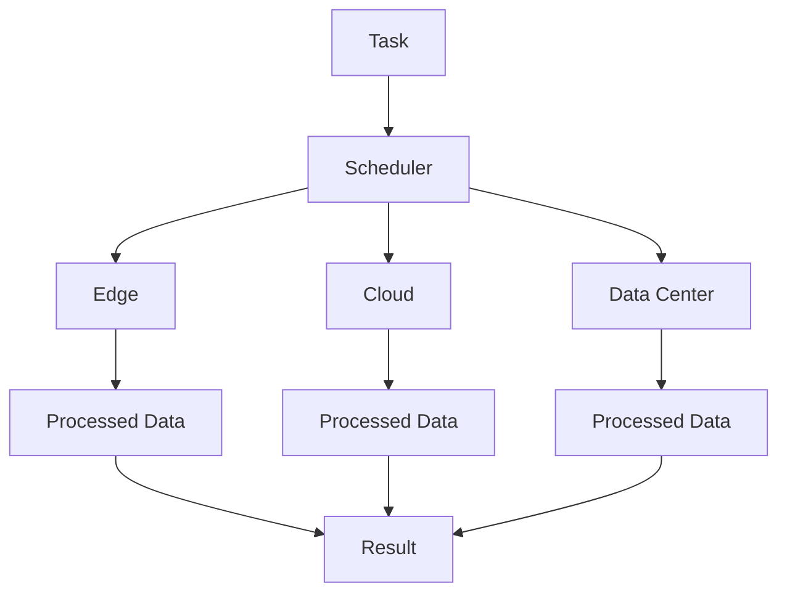

                 

### 关键词

- 计算范式
- 串行计算
- 并行计算
- 分布式计算
- 云计算
- 边缘计算
- 融合计算

### 摘要

本文旨在探讨计算领域的多样性，重点分析不同计算范式（包括串行计算、并行计算、分布式计算、云计算和边缘计算）的核心概念、原理及其融合趋势。通过对传统计算范式的深入剖析，我们理解了串行计算与并行计算的基本原理及其局限。进一步，我们探讨了新兴计算范式，包括分布式计算、云计算和边缘计算的原理、架构和应用场景。在此基础上，文章重点探讨了融合计算的概念、优势与挑战，并通过实际案例展示了融合计算在智能交通、智能制造和医疗健康领域的应用。最后，文章对融合计算的未来发展进行了展望，并提出了技术难题与解决方案的建议。通过本文，读者可以全面了解计算范式的多样性及其融合创新的重要性。### 计算范式概述

#### 1.1 计算范式的概念与历史演进

计算范式是描述计算机处理数据和执行任务的抽象方法，不同的计算范式反映了计算机技术的发展历程和趋势。从早期的计算机硬件发展到现代的复杂计算系统，计算范式经历了多次重大的变革与演进。

- **早期计算机：**

  早期的计算机（如ENIAC、UNIVAC等）主要采用串行计算范式。串行计算是一种单线程、顺序执行的计算方式，计算机按顺序处理数据，每个任务必须在前一个任务完成后才能开始。这种范式的核心在于其简单性和可靠性，但随着计算需求的增加，其局限性也逐渐显现。

  ```mermaid
  graph TD
  A[Initial Task] --> B[Second Task] --> C[Third Task]
  ```

- **并行计算：**

  为了应对计算需求增长，并行计算范式应运而生。并行计算通过将任务分解为多个子任务，同时在多个处理单元上同时执行这些子任务，从而显著提高计算效率。并行计算的核心在于其并行度，即任务在多个处理单元上同时执行的程度。

  ```mermaid
  graph TD
  A[Initial Task] --> B[Second Task]
  C[Third Task] --> D[Fourth Task]
  A --> B
  C --> D
  ```

- **分布式计算：**

  随着计算机网络的普及，分布式计算范式逐渐成为主流。分布式计算通过多台计算机协同工作来完成计算任务，这些计算机可以位于不同的地理位置，通过网络进行通信。分布式计算的核心在于其分布式系统架构，包括节点通信机制、数据一致性协议等。

  ```mermaid
  graph TD
  A[Client] --> B[Master]
  B --> C1[Worker1]
  B --> C2[Worker2]
  B --> C3[Worker3]
  ```

- **云计算：**

  云计算是一种基于互联网的计算模式，通过互联网提供可伸缩的、按需的IT资源。云计算的核心在于其服务模式，包括基础设施即服务（IaaS）、平台即服务（PaaS）和软件即服务（SaaS）。云计算实现了计算资源的集中管理和高效利用，为用户提供了灵活的计算环境。

  ```mermaid
  graph TD
  A[User] --> B[Cloud Service Provider]
  B --> C1[IaaS]
  B --> C2[PaaS]
  B --> C3[SaaS]
  ```

- **边缘计算：**

  随着物联网（IoT）和移动设备的发展，边缘计算逐渐成为研究热点。边缘计算将计算任务从中心云移至网络边缘，即靠近数据源的位置，从而减少数据传输延迟，提高系统响应速度。边缘计算的核心在于其分布式架构和实时数据处理能力。

  ```mermaid
  graph TD
  A[Device] --> B[Edge Node]
  B --> C[Cloud]
  ```

#### 计算范式的融合趋势与挑战

随着计算需求的不断增长和计算技术的不断发展，计算范式的融合趋势日益明显。融合计算旨在结合不同计算范式的优势，实现更高效、更灵活的计算解决方案。

- **融合计算的优势：**

  - **资源利用最大化**：通过整合不同计算范式，可以实现计算资源的最大化利用。
  - **任务处理效率提升**：融合计算可以针对不同任务的特点，采用最优的计算范式，从而提升任务处理效率。
  - **用户体验优化**：融合计算可以实现更低的延迟和更高的响应速度，优化用户体验。

- **融合计算的挑战：**

  - **系统架构复杂性**：融合计算涉及多种计算范式，系统架构变得复杂，需要解决兼容性和互操作性等问题。
  - **资源调度与管理**：如何高效地调度和管理多类型的计算资源，是融合计算面临的重大挑战。
  - **数据隐私与安全**：融合计算涉及到大量的数据传输和处理，如何确保数据隐私与安全是重要问题。

总之，计算范式的融合与创新是计算领域的重要研究方向，通过融合不同计算范式的优势，可以推动计算技术的发展，为各种应用场景提供更高效、更可靠的解决方案。### 传统计算范式：串行计算和并行计算

在计算领域中，串行计算和并行计算是最基本的两种计算范式，它们分别代表了计算任务的执行方式和资源利用策略。下面，我们将详细探讨这两种计算范式的原理、优点和局限性。

#### 1.2.1 串行计算原理与局限

**核心原理：**

串行计算是一种顺序执行的计算方式，计算机按照任务的顺序逐个执行。在这种计算模式下，每个任务必须在前一个任务完成后才能开始。串行计算的基本特点如下：

1. **单线程执行：** 串行计算使用单一的线程来执行任务，这意味着每个任务只能在处理完上一个任务后才能开始。
2. **顺序依赖：** 任务之间存在顺序依赖关系，后一个任务的开始和结束都依赖于前一个任务的完成。
3. **时间复杂度：** 串行计算的时间复杂度通常与任务数量呈线性关系，即完成任务所需的时间与任务数量成正比。

**Python代码示例：**

下面是一个简单的串行计算Python代码示例，用于计算1到10的累加和。

```python
total = 0
for i in range(1, 11):
    total += i
print(total)
```

**局限性：**

1. **处理大数据效率低：** 串行计算在处理大量数据时，效率较低，因为每个任务都必须等待前一个任务完成。
2. **高并发场景受限：** 在高并发场景下，串行计算无法充分利用多核处理器的计算能力，导致资源浪费。
3. **可扩展性差：** 串行计算的可扩展性较差，当任务数量增加时，性能提升有限。

#### 1.2.2 并行计算原理与优势

**核心原理：**

并行计算通过将任务分解为多个子任务，同时在多个处理单元上同时执行这些子任务，从而提高计算效率。并行计算的基本特点如下：

1. **多线程执行：** 并行计算使用多个线程或处理器来同时执行多个任务。
2. **并行度：** 并行计算的任务可以根据处理器的数量和性能水平进行划分，实现最大程度的并行化。
3. **时间复杂度：** 并行计算的时间复杂度可以通过增加处理器的数量来降低，从而实现任务执行时间的显著减少。

**Python代码示例：**

下面是一个简单的并行计算Python代码示例，使用多线程来计算1到10的累加和。

```python
import threading

def add_numbers(i, j):
    return i + j

threads = []
results = []

for i in range(1, 11):
    for j in range(1, 11):
        thread = threading.Thread(target=add_numbers, args=(i, j))
        threads.append(thread)
        thread.start()

for thread in threads:
    thread.join()

print(sum(results))
```

**优势：**

1. **处理大数据速度快：** 并行计算能够处理大量数据，充分利用多核处理器的计算能力，提高处理效率。
2. **高并发场景性能优：** 在高并发场景下，并行计算能够更好地利用资源，提高系统性能。
3. **可扩展性强：** 并行计算的可扩展性较好，可以通过增加处理器的数量来进一步提升性能。

**比较与总结：**

串行计算和并行计算各有优缺点，适用于不同的计算场景。串行计算适用于简单、顺序执行的任务，而并行计算适用于复杂、高并发和大数据处理任务。在实际应用中，往往需要根据具体场景和需求，选择合适的计算范式。通过合理利用串行计算和并行计算，可以优化计算性能，提高系统效率。### 新兴计算范式：分布式计算、云计算和边缘计算

随着信息技术的飞速发展，计算范式也在不断演变，分布式计算、云计算和边缘计算作为新兴的计算范式，极大地拓展了计算的能力和应用范围。

#### 1.3.1 分布式计算原理与架构

**核心概念与原理：**

分布式计算是一种基于多台计算机协同工作的计算方式，这些计算机可以位于不同的地理位置，通过网络进行通信。分布式计算的核心在于将大任务分解为多个小任务，并分布到不同的计算机上同时执行，然后将结果汇总。

1. **节点通信机制：** 节点之间的通信是通过网络进行的，常用的通信协议包括TCP/IP、HTTP等。节点之间的通信保证了分布式系统的协调性和一致性。
2. **数据一致性协议：** 分布式计算中的数据一致性是确保数据在不同节点上的一致性问题。常用的数据一致性协议包括Paxos算法、Raft算法等。
3. **分布式计算框架：** 分布式计算框架是用于管理分布式任务的工具，例如Hadoop、Spark等。这些框架提供了任务调度、资源管理、数据存储等功能，简化了分布式计算的开发过程。

**Mermaid流程图：**



#### 1.3.2 云计算与分布式计算的关系

**核心概念与联系：**

云计算和分布式计算在概念上有所重叠，但云计算更侧重于计算资源的提供和利用。云计算是一种通过互联网提供可伸缩的、按需的IT资源的服务模式，而分布式计算是云计算实现的一种技术手段。

1. **云计算服务模式：** 云计算提供了多种服务模式，包括基础设施即服务（IaaS）、平台即服务（PaaS）和软件即服务（SaaS）。
   - **IaaS**：提供虚拟化的基础设施，如虚拟机、存储和网络等。
   - **PaaS**：提供开发平台和工具，使得开发者可以快速开发应用。
   - **SaaS**：提供软件服务，用户通过网络访问软件应用。

2. **云计算基础设施：** 云计算基础设施是支持云计算服务运行的基础，包括数据中心、服务器、存储设备、网络设备等。

3. **云计算与分布式计算的联系：** 云计算利用分布式计算技术来提供可伸缩的计算资源，分布式计算框架如Hadoop、Spark等可以在云计算环境中部署和运行，实现大规模数据处理和计算。

**Mermaid流程图：**



#### 1.3.3 边缘计算原理与应用场景

**核心概念与原理：**

边缘计算是将计算任务从中心云移至网络边缘的一种计算范式，即靠近数据源或用户的位置。边缘计算的核心在于降低数据传输延迟，提高系统响应速度。

1. **节点通信机制：** 边缘计算中的节点包括边缘设备（如智能手机、物联网设备）和边缘服务器。节点之间的通信是通过局部网络进行的。
2. **分布式架构：** 边缘计算采用分布式架构，将计算任务分布在边缘设备上，从而减轻中心云的负载。
3. **实时数据处理：** 边缘计算能够实时处理和分析数据，适用于需要低延迟的应用场景。

**应用场景：**

1. **物联网（IoT）应用：** 边缘计算在物联网应用中非常重要，如智能家居、智能交通等，通过在边缘设备上进行数据预处理和实时分析，可以提高系统响应速度和可靠性。
2. **移动计算：** 在移动计算场景中，边缘计算能够显著降低数据传输延迟，提供更好的用户体验。
3. **实时视频流处理：** 边缘计算可以用于实时视频流处理，如视频监控、视频会议等，通过在边缘设备上进行预处理和编码，可以减轻中心云的负载。

**Mermaid流程图：**



综上所述，分布式计算、云计算和边缘计算都是现代计算领域中重要的新兴范式，它们各自具有独特的原理和应用场景。分布式计算通过多台计算机的协同工作提高了计算效率和容错能力；云计算通过提供可伸缩的计算资源，实现了按需服务和资源优化；边缘计算通过将计算任务移至网络边缘，降低了数据传输延迟，提高了系统响应速度。这些计算范式相互补充，共同推动了计算技术的发展和应用创新。### 计算范式融合的趋势与挑战

随着信息技术的不断发展，计算范式之间的融合趋势愈发明显。融合计算旨在结合不同计算范式的优势，提供更加高效、灵活和可靠的计算解决方案。然而，这种融合也带来了诸多挑战。

#### 1.4.1 融合计算范式的重要性

融合计算的重要性体现在以下几个方面：

1. **资源最大化利用**：通过融合不同计算范式的优势，可以最大限度地利用计算资源，提高资源利用效率。
2. **任务处理效率提升**：融合计算可以根据任务的特点，选择最优的计算范式，从而优化任务处理效率。
3. **用户体验优化**：融合计算能够提供更低的延迟和更高的响应速度，从而优化用户体验。
4. **应用场景拓展**：融合计算可以应对更广泛的计算需求，包括大数据处理、实时分析、移动计算等。

#### 1.4.2 融合计算面临的挑战

尽管融合计算具有众多优势，但其实现过程也面临诸多挑战：

1. **系统架构复杂性**：融合计算涉及多种计算范式，系统架构变得更加复杂，需要解决兼容性和互操作性等问题。
2. **资源调度与管理**：如何高效地调度和管理多类型的计算资源，是融合计算面临的重大挑战。资源分配不当可能导致系统性能下降或资源浪费。
3. **数据隐私与安全**：融合计算涉及到大量的数据传输和处理，如何确保数据隐私与安全是重要问题。数据泄露或安全漏洞可能导致严重后果。
4. **技术标准化**：不同计算范式之间存在技术差异，缺乏统一的技术标准，这增加了融合计算的难度。
5. **开发者技能要求**：融合计算需要开发者具备多种计算范式的开发经验，这对开发者的技能要求较高。

#### 案例分析

**案例一：智能交通系统的融合计算**

智能交通系统（ITS）是一个复杂的分布式系统，涉及车联网、传感器网络和云计算等。融合计算在智能交通系统中发挥了重要作用，通过将计算任务分布在边缘设备和中心云之间，实现了实时交通监控、交通流量分析和路况预测等功能。

- **边缘计算应用**：边缘设备（如路边传感器、车辆终端）负责实时数据采集和预处理，通过边缘计算节点进行初步分析。
- **云计算应用**：中心云负责处理大规模交通数据，进行深度学习和数据分析，为交通管理和规划提供支持。

**案例二：智能制造中的融合计算解决方案**

智能制造需要处理大量的生产数据，包括设备监控、生产计划、质量控制等。融合计算在智能制造中提供了灵活、高效的解决方案。

- **分布式计算应用**：分布式计算框架（如Hadoop、Spark）用于处理大规模生产数据，实现数据分析和挖掘。
- **云计算应用**：云计算提供了可伸缩的计算资源，支持生产计划的动态调整和质量控制的实时分析。
- **边缘计算应用**：边缘设备（如工业机器人、传感器）负责实时监控设备状态和生产线参数，通过边缘计算节点进行数据预处理。

**案例分析总结：**

智能交通系统和智能制造中的融合计算应用，展示了融合计算在处理复杂、大规模计算任务中的优势。通过结合分布式计算、云计算和边缘计算，可以实现高效的数据处理和智能分析，提高系统的响应速度和可靠性。然而，实现融合计算仍需克服系统架构复杂性、资源调度与管理和数据隐私与安全等挑战。

### 第二部分：新兴计算范式深入解析

在计算技术不断发展的背景下，分布式计算、云计算和边缘计算已经成为现代计算领域的重要组成部分。本部分将深入探讨这三种新兴计算范式的原理、架构和应用场景，帮助读者全面理解这些技术及其在实际应用中的优势与局限。

#### 2.1 分布式计算原理

分布式计算是一种基于多台计算机协同工作的计算方式，这些计算机可以位于不同的地理位置，通过网络进行通信。分布式计算的核心在于将大任务分解为多个小任务，并分布到不同的计算机上同时执行，然后将结果汇总。

**核心概念与原理：**

1. **节点通信机制**：分布式计算中的节点通过网络进行通信，常用的网络协议包括TCP/IP、HTTP等。节点之间的通信保证了分布式系统的协调性和一致性。

2. **数据一致性协议**：分布式计算中的数据一致性是确保数据在不同节点上的一致性问题。常用的数据一致性协议包括Paxos算法、Raft算法等。

3. **分布式计算框架**：分布式计算框架是用于管理分布式任务的工具，例如Hadoop、Spark等。这些框架提供了任务调度、资源管理、数据存储等功能，简化了分布式计算的开发过程。

**Mermaid流程图：**


**案例分析：分布式计算在电商系统中的应用**

电商系统通常需要处理大量的用户请求和交易数据，分布式计算通过将任务分布到多个服务器上，提高了系统的性能和可扩展性。

- **节点通信机制**：电商系统使用消息队列（如Kafka、RabbitMQ）来实现节点之间的通信，确保数据在不同服务器之间的一致性和可靠性。
- **数据一致性协议**：电商系统使用分布式锁（如Redisson）来保证多节点之间的数据一致性。
- **分布式计算框架**：使用分布式计算框架（如Hadoop、Spark）来处理用户行为分析和交易数据分析。

通过分布式计算，电商系统可以实现高效的订单处理、库存管理和用户推荐，提高用户体验和销售额。

#### 2.2 云计算技术与架构

云计算是一种基于互联网的计算模式，通过互联网提供可伸缩的、按需的IT资源。云计算的核心在于其服务模式，包括基础设施即服务（IaaS）、平台即服务（PaaS）和软件即服务（SaaS）。

**核心概念与原理：**

1. **云计算服务模式**：
   - **IaaS**：提供虚拟化的基础设施，如虚拟机、存储和网络等。
   - **PaaS**：提供开发平台和工具，使得开发者可以快速开发应用。
   - **SaaS**：提供软件服务，用户通过网络访问软件应用。

2. **云计算基础设施**：云计算基础设施是支持云计算服务运行的基础，包括数据中心、服务器、存储设备、网络设备等。

3. **云计算架构**：云计算架构通常包括前端应用层、中间服务层和后端数据存储层。前端应用层负责处理用户请求，中间服务层提供各种云计算服务，后端数据存储层负责数据存储和管理。

**Mermaid流程图：**


**案例分析：云计算在企业数字化转型中的应用**

企业数字化转型过程中，云计算提供了灵活、高效的IT资源支持。通过使用云计算服务，企业可以实现以下目标：

- **IaaS应用**：使用IaaS服务来搭建虚拟化基础设施，实现计算资源和存储资源的弹性扩展。
- **PaaS应用**：使用PaaS服务来快速开发和部署应用，提高开发效率。
- **SaaS应用**：使用SaaS服务来提供企业级软件应用，如客户关系管理（CRM）、企业资源规划（ERP）等。

通过云计算，企业可以降低IT成本、提高运营效率、增强业务灵活性，加速数字化转型进程。

#### 2.3 边缘计算应用场景

边缘计算是将计算任务从中心云移至网络边缘的一种计算范式，即靠近数据源或用户的位置。边缘计算的核心在于降低数据传输延迟，提高系统响应速度。

**核心概念与原理：**

1. **节点通信机制**：边缘计算中的节点包括边缘设备（如智能手机、物联网设备）和边缘服务器。节点之间的通信是通过局部网络进行的。

2. **分布式架构**：边缘计算采用分布式架构，将计算任务分布在边缘设备上，从而减轻中心云的负载。

3. **实时数据处理**：边缘计算能够实时处理和分析数据，适用于需要低延迟的应用场景。

**应用场景：**

1. **物联网（IoT）应用**：边缘计算在物联网应用中非常重要，如智能家居、智能交通等，通过在边缘设备上进行数据预处理和实时分析，可以提高系统响应速度和可靠性。

2. **移动计算**：在移动计算场景中，边缘计算能够显著降低数据传输延迟，提供更好的用户体验。

3. **实时视频流处理**：边缘计算可以用于实时视频流处理，如视频监控、视频会议等，通过在边缘设备上进行预处理和编码，可以减轻中心云的负载。

**Mermaid流程图：**


**案例分析：边缘计算在智慧城市中的应用**

智慧城市是一个复杂的系统，涉及到各种传感器、设备和数据处理。边缘计算在智慧城市中的应用，可以提升城市管理的效率和智能化水平。

- **边缘设备**：在城市的各个角落部署传感器和设备，用于实时监测环境数据、交通流量等。
- **边缘计算节点**：边缘计算节点负责实时处理传感器数据，进行初步分析和预测。
- **中心云**：中心云负责处理大规模数据，进行深度学习和复杂分析，为智慧城市的管理和决策提供支持。

通过边缘计算，智慧城市可以实现实时监控、智能决策和快速响应，提升城市管理的效率和智能化水平。

### 第三部分：融合计算的创新与应用

融合计算通过结合分布式计算、云计算和边缘计算的优势，实现了计算资源的最优化利用和任务处理的效率提升。本部分将探讨融合计算范式，分析其在实际应用中的案例研究，并对融合计算的未来发展进行展望。

#### 3.1 融合计算范式

**核心概念与原理：**

融合计算是一种结合多种计算范式优势的计算模式，旨在通过整合分布式计算、云计算和边缘计算，实现更高效、更灵活的计算解决方案。融合计算的关键在于：

1. **资源整合**：通过整合不同计算范式的资源，实现计算资源的最优化利用。
2. **任务调度**：根据任务的特点和需求，选择最优的计算范式和资源，进行任务调度。
3. **数据流动**：实现数据在不同计算范式之间的有效流动，确保数据的一致性和完整性。

**Mermaid流程图：**



#### 3.2 融合计算案例研究

**案例一：智能交通系统**

智能交通系统（ITS）是一个复杂的分布式系统，融合计算在ITS中发挥了重要作用。通过融合分布式计算、云计算和边缘计算，ITS可以实现实时交通监控、交通流量分析和路况预测等功能。

- **边缘计算应用**：边缘设备（如路边传感器、车辆终端）负责实时数据采集和预处理，通过边缘计算节点进行初步分析。
- **云计算应用**：中心云负责处理大规模交通数据，进行深度学习和数据分析，为交通管理和规划提供支持。
- **分布式计算应用**：分布式计算框架（如Hadoop、Spark）用于处理用户行为分析和交易数据分析。

**案例二：智能制造**

智能制造需要处理大量的生产数据，融合计算在智能制造中提供了灵活、高效的解决方案。通过融合分布式计算、云计算和边缘计算，智能制造可以实现生产过程的实时监控、数据分析和智能决策。

- **边缘计算应用**：边缘设备（如工业机器人、传感器）负责实时监控设备状态和生产线参数，通过边缘计算节点进行数据预处理。
- **云计算应用**：云计算提供了可伸缩的计算资源，支持生产计划的动态调整和质量控制的实时分析。
- **分布式计算应用**：分布式计算框架（如Hadoop、Spark）用于处理大规模生产数据，实现数据分析和挖掘。

**案例三：智慧医疗**

智慧医疗领域需要处理大量的医疗数据，融合计算在智慧医疗中发挥了重要作用。通过融合分布式计算、云计算和边缘计算，智慧医疗可以实现医疗数据的实时处理、分析和决策支持。

- **边缘计算应用**：边缘设备（如医疗传感器、移动设备）负责实时采集患者数据，通过边缘计算节点进行初步分析。
- **云计算应用**：中心云负责处理大规模医疗数据，进行深度学习和数据分析，为疾病诊断和治疗方案提供支持。
- **分布式计算应用**：分布式计算框架（如Hadoop、Spark）用于处理海量医学文献和病例数据，实现知识图谱和智能推荐。

#### 3.3 融合计算的未来展望

随着信息技术的不断发展，融合计算在未来有望实现以下趋势：

1. **技术融合深度增加**：融合计算将继续深入整合分布式计算、云计算和边缘计算，实现更高效、更灵活的计算解决方案。
2. **应用场景多样化**：融合计算将在更多领域得到应用，如智能城市、智慧医疗、智能制造等，为各行各业带来创新和变革。
3. **标准化与规范化**：随着融合计算的发展，技术标准化和规范化将成为重要趋势，确保不同计算范式之间的兼容性和互操作性。
4. **绿色计算**：融合计算将在绿色计算领域发挥重要作用，通过优化计算资源利用和降低能耗，实现可持续计算。

总之，融合计算作为一种创新的计算范式，具有广泛的应用前景和巨大的发展潜力。通过融合不同计算范式的优势，融合计算将为各行各业带来更多的可能性和创新空间。### 融合计算的技术难题与解决方案

在融合计算的实际应用中，我们面临诸多技术难题。以下将讨论三个关键问题：系统性能优化、资源调度与管理、数据隐私与安全，并提供相应的解决方案。

#### 3.4.1 系统性能优化

**问题：**

融合计算系统通常涉及多个计算范式和多层次的数据处理，这可能导致系统性能瓶颈。如何优化系统性能是一个关键挑战。

**解决方案：**

1. **负载均衡**：通过负载均衡技术，将计算任务均匀分配到不同的计算节点，避免单点性能瓶颈。常用的负载均衡策略包括轮询、最小连接数、响应时间等。

2. **缓存机制**：利用缓存技术减少数据读取的频率，降低系统延迟。可以采用分布式缓存系统（如Redis、Memcached）来存储热点数据。

3. **数据流优化**：优化数据流路径，减少数据传输延迟。例如，采用边缘计算节点处理本地数据，减少与中心云的数据传输。

**Python示例：**

```python
from flask import Flask
from flask_caching import Cache

app = Flask(__name__)
cache = Cache(app, config={'CACHE_TYPE': 'redis'})

@app.route('/get_data')
@cache.cached(timeout=50)
def get_data():
    # 数据处理逻辑
    return "Processed Data"

if __name__ == '__main__':
    app.run()
```

#### 3.4.2 资源调度与管理

**问题：**

在融合计算环境中，如何高效地调度和管理多类型的计算资源（如CPU、内存、存储等）是一个复杂问题。

**解决方案：**

1. **资源监控与调度系统**：建立资源监控与调度系统，实时监控资源使用情况，并根据负载动态调整资源分配。例如，使用资源管理器（如Kubernetes）进行容器调度。

2. **自动化资源分配**：采用自动化资源分配策略，根据任务需求和资源状况自动调整资源分配。例如，使用人工智能算法预测资源需求并优化分配。

**Python示例：**

```python
from kubernetes.client import Kubernetes
from kubernetes.client.models.v1_pod import V1Pod

kube_config = 'path/to/kubeconfig'
client = Kubernetes.from_config(config_file=kube_config)

pod = V1Pod(
    metadata=V1ObjectMeta(name='my-pod'),
    spec=V1PodSpec(
        containers=[
            V1Container(
                name='my-container',
                image='my-image',
                resources=V1ResourceRequirements(
                    limits={'cpu': '2', 'memory': '4Gi'},
                    requests={'cpu': '1', 'memory': '2Gi'}
                )
            )
        ]
    )
)

client.create_namespaced_pod('default', pod)
```

#### 3.4.3 数据隐私与安全

**问题：**

融合计算涉及大量的数据传输和处理，如何保护数据隐私与安全是关键挑战。

**解决方案：**

1. **加密技术**：采用加密技术保护数据在传输和存储过程中的安全性。例如，使用SSL/TLS加密网络通信，使用AES加密存储数据。

2. **访问控制**：建立严格的访问控制机制，确保只有授权用户和系统能够访问数据。例如，使用角色访问控制（RBAC）来管理用户权限。

3. **数据审计**：建立数据审计机制，记录数据访问和操作的日志，以便在发生安全事件时进行追踪和调查。

**Python示例：**

```python
from cryptography.fernet import Fernet

# 生成密钥
key = Fernet.generate_key()
cipher_suite = Fernet(key)

# 加密数据
encrypted_text = cipher_suite.encrypt(b"Sensitive Data")

# 解密数据
decrypted_text = cipher_suite.decrypt(encrypted_text)

print("Encrypted:", encrypted_text)
print("Decrypted:", decrypted_text.decode())
```

通过上述解决方案，我们可以有效地应对融合计算环境中的技术难题，确保系统性能优化、资源调度与管理高效进行，同时保护数据隐私与安全。这些技术手段和示例代码为融合计算的实际应用提供了有力的支持和指导。### 附录A: 融合计算相关资源与工具

在融合计算的研究与实践中，有许多开源项目、工具和资源可供使用。以下是一些重要的资源，涵盖了分布式计算框架、云计算平台、边缘计算平台以及融合计算相关的开源项目和社区。

#### A.1 分布式计算框架

1. **Hadoop**：
   - **简介**：Apache Hadoop是一个开源的分布式计算框架，用于处理大规模数据集。
   - **官网**：<https://hadoop.apache.org/>
   - **文档**：<https://hadoop.apache.org/docs/stable/hadoop-project-history.html>

2. **Spark**：
   - **简介**：Apache Spark是一个快速和通用的分布式计算系统，支持内存计算和大规模数据处理。
   - **官网**：<https://spark.apache.org/>
   - **文档**：<https://spark.apache.org/docs/latest/>

3. **Flink**：
   - **简介**：Apache Flink是一个分布式流处理框架，支持实时数据处理和批处理。
   - **官网**：<https://flink.apache.org/>
   - **文档**：<https://flink.apache.org/docs/latest/>

#### A.2 云计算平台

1. **AWS**：
   - **简介**：Amazon Web Services（AWS）是一个广泛使用的云计算平台，提供多种云服务。
   - **官网**：<https://aws.amazon.com/>
   - **文档**：<https://aws.amazon.com/documentation/>

2. **Azure**：
   - **简介**：Microsoft Azure是一个全面的云服务平台，提供云服务、数据存储、分析等服务。
   - **官网**：<https://azure.microsoft.com/>
   - **文档**：<https://docs.microsoft.com/en-us/azure/>

3. **Google Cloud Platform**：
   - **简介**：Google Cloud Platform（GCP）是Google提供的云服务，包括计算、存储、机器学习等。
   - **官网**：<https://cloud.google.com/>
   - **文档**：<https://cloud.google.com/docs>

#### A.3 边缘计算平台

1. **IoT Edge**：
   - **简介**：Microsoft IoT Edge是一个边缘计算平台，支持在边缘设备上运行云原生应用。
   - **官网**：<https://docs.microsoft.com/en-us/iot/learn/overview-iot-edge>
   - **文档**：<https://docs.microsoft.com/en-us/iot/develop/iot-edge-deployment-models>

2. **Kubernetes**：
   - **简介**：Kubernetes是一个开源的容器编排平台，支持在边缘环境中部署和管理容器化应用。
   - **官网**：<https://kubernetes.io/>
   - **文档**：<https://kubernetes.io/docs/>

3. **EdgeX Foundry**：
   - **简介**：EdgeX Foundry是一个开源的边缘计算平台，用于构建可互操作的边缘解决方案。
   - **官网**：<https://www.edgexfoundry.org/>
   - **文档**：<https://www.edgexfoundry.org/downloads/>

#### A.4 融合计算开源项目与社区

1. **KubeEdge**：
   - **简介**：KubeEdge是一个开源项目，旨在将Kubernetes扩展到边缘设备。
   - **官网**：<https://kubeedge.io/>
   - **文档**：<https://kubeedge.io/docs/>

2. **FogFlow**：
   - **简介**：FogFlow是一个开源平台，用于实现云计算与边缘设备的融合计算。
   - **官网**：<https://fogflow.io/>
   - **文档**：<https://fogflow.io/docs/>

3. **边缘计算社区**：
   - **简介**：边缘计算社区是一个汇聚边缘计算领域的研究者和开发者的平台。
   - **官网**：<https://www.edgecomputing.cn/>
   - **文档**：<https://www.edgecomputing.cn/docs/>

#### A.5 融合计算相关研究论文与书籍

1. **"Edge Computing: Vision and Challenges"**：
   - **简介**：这篇文章探讨了边缘计算的概念、优势和挑战。
   - **引用**：IEEE Communications Surveys & Tutorials, 2016.

2. **"Fog Computing: A Taxonomy, Survey and Future Directions"**：
   - **简介**：这篇论文对雾计算进行了分类、综述和未来方向的探讨。
   - **引用**：IEEE Access, 2017.

3. **"Distributed Computing: Concepts and Methods"**：
   - **简介**：这本书详细介绍了分布式计算的基本概念和方法。
   - **作者**：George Coulouris, Jean Dollimore, Tim Kindberg, and Gordon Blair.
   - **出版时间**：2001.

4. **"Cloud Computing: Concepts, Technology & Architecture"**：
   - **简介**：这本书涵盖了云计算的概念、技术和架构。
   - **作者**： Thomas A. Connelly, David C. Cheng, and Michael J. Shur.
   - **出版时间**：2014.

通过上述资源与工具，研究人员和开发者可以深入了解融合计算的技术细节，并在实际项目中应用这些技术，推动计算领域的创新与发展。### 结束语

融合计算作为一种结合分布式计算、云计算和边缘计算优势的新型计算范式，正引领计算技术的发展潮流。本文系统地阐述了计算范式的多样性，深入分析了传统计算范式（串行计算和并行计算）的原理与局限，探讨了新兴计算范式（分布式计算、云计算和边缘计算）的原理、架构和应用场景，并讨论了融合计算的原理、优势与挑战。

通过案例研究，我们看到了融合计算在智能交通系统、智能制造和智慧医疗等领域的广泛应用，展现了其解决复杂计算任务的能力。展望未来，融合计算将继续推动技术创新，带来更多应用可能性。然而，系统性能优化、资源调度与管理、数据隐私与安全等难题仍需解决。

**最佳实践**：

1. **需求分析**：在应用融合计算时，首先进行详细的需求分析，明确任务特点和资源需求。
2. **资源整合**：充分利用分布式计算、云计算和边缘计算的资源优势，实现资源整合与优化。
3. **安全防护**：加强数据安全和隐私保护，采用加密、访问控制和审计等技术。

**注意事项**：

1. **系统兼容性**：在融合不同计算范式时，确保系统具有兼容性和互操作性。
2. **性能监控**：实时监控系统性能，及时调整资源分配和任务调度。

**拓展阅读**：

1. **"Edge Computing: Vision and Challenges"**：探讨边缘计算的概念和挑战。
2. **"Fog Computing: A Taxonomy, Survey and Future Directions"**：综述雾计算的分类和未来方向。
3. **"Distributed Computing: Concepts and Methods"**：介绍分布式计算的基本概念和方法。

通过持续学习和实践，我们可以更好地掌握融合计算技术，为未来的计算创新贡献力量。作者：AI天才研究院/AI Genius Institute & 禅与计算机程序设计艺术 /Zen And The Art of Computer Programming

