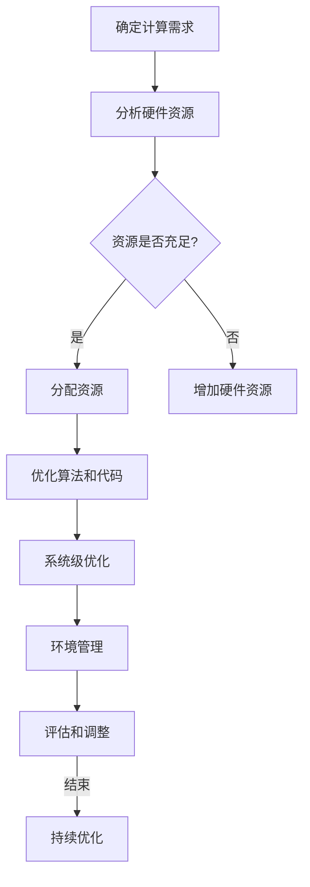

                 

### 引言：计算密集型应用与能源效率的重要性

在当今信息化和数字化快速发展的时代，计算密集型应用已经成为推动科技进步和产业升级的重要力量。从大数据处理、高性能计算、人工智能到云计算，这些计算密集型应用在各个领域发挥着关键作用。然而，随着计算需求的不断增长，能耗问题也日益凸显。优化计算密集型应用的能源效率，不仅对环境保护和可持续发展具有重要意义，也对降低运营成本、提升系统性能和竞争力具有深远影响。

计算密集型应用（Compute Intensive Applications）通常指那些在执行过程中需要大量计算资源的应用。这些应用的特点是处理复杂计算任务，对计算速度和精度要求极高，如科学计算、金融分析、图像渲染、深度学习训练等。随着技术的进步，计算密集型应用在各个领域的应用范围不断扩大，但随之而来的能耗问题也不容忽视。

据研究，计算密集型应用在数据中心和云计算环境中的能耗占据了总能耗的相当大比例。随着数据量的指数级增长和计算需求的不断攀升，能源效率问题已经成为制约计算密集型应用发展的瓶颈之一。因此，如何优化计算密集型应用的能源效率，提高系统性能与资源利用率，成为当前研究的热点和难点。

本文将围绕计算密集型应用的能源效率优化展开讨论。首先，我们将对计算密集型应用进行概述，介绍其定义、发展历程以及应用场景。接着，分析能源效率优化的挑战与机遇，探讨优化策略和技术手段。随后，详细讲解能源效率优化的核心概念、算法原理以及数学模型。在此基础上，通过项目实战案例展示如何在实际中应用能源效率优化技术。最后，总结全文，展望未来研究方向和挑战，并给出对计算密集型应用能源效率优化的建议。

通过本文的阅读，读者将全面了解计算密集型应用的能源效率优化的重要性、核心技术和实践方法，为今后的研究和应用提供有益的参考。

### 关键词

计算密集型应用、能源效率、优化策略、算法原理、数学模型、项目实战、可持续发展、数据中心、云计算。

### 摘要

本文探讨了计算密集型应用在当前数字化和智能化浪潮中面临的能源效率问题。首先，介绍了计算密集型应用的定义、发展历程和应用场景，随后分析了能源效率优化的挑战与机遇。接着，详细阐述了计算密度与能源效率的关系，介绍了能源效率优化的基本策略和核心算法原理。通过一个实际项目案例，展示了如何在实际中应用能源效率优化技术，并进行了代码解读与分析。最后，总结全文，提出了对未来研究方向和挑战的展望，并对计算密集型应用能源效率优化给出了具体建议。

## 1. 计算密集型应用概述

### 1.1 什么是计算密集型应用

计算密集型应用（Compute Intensive Applications，CIA）是指那些在执行过程中需要大量计算资源的应用程序或系统。这些应用的主要特点是对计算速度和精度有极高的要求，其计算任务通常涉及复杂的数学运算、大规模数据处理、并行计算和模拟仿真等。与传统的数据处理或事务处理应用不同，计算密集型应用需要强大的计算能力和高效的算法支持，以处理大规模、高复杂度的计算任务。

计算密集型应用可以分为以下几类：

- **科学计算**：这类应用通常涉及复杂的数学模型和物理模拟，如气象预测、地震分析、基因序列分析等。科学计算对计算资源的依赖程度非常高，需要高效的算法和强大的计算能力。
  
- **金融分析**：金融领域中的风险控制、期权定价、投资组合优化等任务，需要大量的数据分析和计算。金融计算应用对速度和准确性的要求极高，是典型的计算密集型应用。
  
- **图像渲染和视频处理**：在图像渲染和视频处理领域，复杂的图像处理算法和高分辨率视频处理要求大量计算资源。这类应用在视觉效果和质量上有着极高的要求。

- **人工智能和深度学习**：随着人工智能技术的快速发展，深度学习模型在计算机视觉、自然语言处理、推荐系统等领域得到了广泛应用。深度学习任务通常涉及大规模的数据训练和模型优化，是典型的计算密集型应用。

- **高性能计算**：高性能计算（High-Performance Computing，HPC）是指在复杂计算任务中，通过大规模并行计算和分布式计算来提高计算效率和速度。高性能计算应用在航空航天、能源勘探、生物信息学等领域发挥着重要作用。

### 1.2 计算密集型应用的发展历程

计算密集型应用的发展历程可以追溯到计算机技术的起源。随着计算机硬件性能的不断提升和算法的不断优化，计算密集型应用逐渐从实验室走向实际应用，成为现代科技和产业的重要驱动力。

- **早期计算机**：在20世纪40年代至60年代，早期计算机主要用于科学研究和军事应用。这一时期的计算密集型应用主要集中在科学计算和军事模拟领域。随着硬件性能的提升，计算密集型应用开始向更多领域扩展。

- **并行计算和分布式计算**：从20世纪70年代开始，并行计算和分布式计算技术的出现，使得计算密集型应用能够通过多台计算机的协同工作来提高计算效率。这一阶段，高性能计算机（HPC）逐渐成为计算密集型应用的主要平台。

- **人工智能和深度学习**：21世纪初，随着人工智能和深度学习技术的快速发展，计算密集型应用在计算机视觉、自然语言处理等领域取得了重大突破。深度学习模型的训练和优化对计算资源的需求急剧增加，推动了计算密集型应用向更高性能和更广泛领域的扩展。

- **云计算和大数据**：近年来，云计算和大数据技术的兴起，为计算密集型应用提供了更加灵活和高效的计算环境。通过云服务和大数据平台，计算密集型应用能够更加便捷地获取计算资源，满足大规模、高复杂度的计算需求。

### 1.3 当前计算密集型应用的应用场景

当前，计算密集型应用在多个领域得到了广泛应用，以下是一些典型应用场景：

- **科学研究**：在科学研究领域，计算密集型应用被广泛应用于天文学、物理学、化学、生物学等领域。例如，科学家们利用高性能计算来模拟宇宙演化、研究分子结构和进行生物信息学分析。

- **工业制造**：在工业制造领域，计算密集型应用被用于产品设计、仿真分析、生产优化等任务。通过计算机辅助设计（CAD）和计算机辅助工程（CAE），企业能够提高产品质量和生产效率。

- **金融服务业**：在金融服务业，计算密集型应用被用于风险控制、投资组合优化、交易算法开发等任务。金融机构利用高性能计算和大数据分析来提高交易效率、降低风险和增加收益。

- **医疗健康**：在医疗健康领域，计算密集型应用被用于医学图像处理、基因测序、疾病预测等任务。通过高性能计算和人工智能技术，医生能够更加准确地诊断疾病、制定治疗方案。

- **交通运输**：在交通运输领域，计算密集型应用被用于交通流量分析、路线优化、自动驾驶等任务。通过大数据分析和机器学习技术，交通运输系统能够更加高效地运行，提高出行安全性和便捷性。

- **人工智能与深度学习**：在人工智能和深度学习领域，计算密集型应用被用于图像识别、语音识别、自然语言处理等任务。这些应用通过大规模数据训练和模型优化，不断提高人工智能系统的性能和应用范围。

总之，计算密集型应用在当前信息化和数字化时代具有广泛的应用场景和重要的地位。随着技术的不断进步，计算密集型应用将在更多领域发挥重要作用，推动科技进步和产业升级。

### 2. 能源效率优化的挑战与机遇

随着计算需求的不断增长，计算密集型应用的能源消耗问题日益严重。在数据中心、云计算和人工智能等领域，计算密集型应用的能耗占据了总能耗的相当大比例。因此，能源效率优化成为当前研究的热点和难点。

#### 2.1 计算密集型应用中的能源消耗问题

计算密集型应用中的能源消耗问题主要表现在以下几个方面：

- **硬件能耗**：计算密集型应用通常依赖于高性能计算机和服务器，这些硬件设备在运行过程中会产生大量热量，导致能源消耗。尤其是高性能计算集群和数据中心，硬件能耗问题尤为突出。

- **软件能耗**：软件层面也存在能源消耗问题。例如，低效的算法和优化策略会导致计算资源的浪费，增加能源消耗。此外，网络传输和存储过程中的能耗也不容忽视。

- **环境因素**：环境因素如气温、湿度等也会影响能源消耗。例如，在高温环境中，服务器散热问题会加剧，导致能耗增加。

- **运营管理**：数据中心和计算设施的运营管理也存在能源浪费问题。例如，设备运行时间的不合理安排、设备老旧未及时更换等都会导致能源消耗增加。

#### 2.2 能源效率优化的重要性

能源效率优化对计算密集型应用具有重要意义：

- **降低运营成本**：通过优化能源效率，可以减少能源消耗，降低运营成本。特别是在大型数据中心和云计算环境中，能源成本占据了总运营成本的一大部分。

- **环境保护**：能源效率优化有助于减少碳排放和其他污染物排放，对环境保护和可持续发展具有重要意义。

- **提升系统性能**：优化能源效率不仅能够降低能耗，还能提高系统性能和稳定性。通过优化硬件和软件配置，减少能源浪费，可以提高计算任务的执行效率和准确性。

- **资源利用率**：能源效率优化有助于提高计算资源的利用率。通过合理配置和调度计算资源，避免资源浪费，可以更好地满足计算需求，提高整体计算效率。

#### 2.3 能源效率优化面临的挑战

尽管能源效率优化具有重要意义，但计算密集型应用在能源效率优化方面仍面临诸多挑战：

- **复杂性**：计算密集型应用涉及多种硬件和软件组件，能源消耗问题具有复杂性。优化能源效率需要综合考虑硬件、软件、环境等多种因素，这对优化策略和算法提出了高要求。

- **动态性**：计算密集型应用的负载通常是动态变化的。如何在不同负载情况下实现能源效率优化，是一个具有挑战性的问题。优化策略需要具备自适应性和灵活性，以应对负载波动和变化。

- **成本与效益**：能源效率优化不仅需要技术支持，还需要大量的投资和资源。如何在成本和效益之间找到平衡点，是一个需要考虑的问题。

- **数据隐私和安全**：在数据中心和云计算环境中，能源效率优化需要收集和传输大量数据。如何保障数据隐私和安全，避免潜在的数据泄露和攻击风险，也是一大挑战。

总之，能源效率优化是计算密集型应用面临的重要问题，具有广泛的应用前景和深远的影响。然而，优化过程中仍面临诸多挑战，需要持续研究和技术创新，以实现计算密集型应用的高效、绿色和可持续发展。

### 3. 能源效率优化的核心概念与联系

在探讨计算密集型应用的能源效率优化时，理解以下几个核心概念与它们之间的相互关系是至关重要的。这些概念不仅有助于我们深入了解能源效率优化的内涵，还为制定有效的优化策略提供了理论依据。

#### 3.1 计算密度与能源效率的关系

**计算密度**（Compute Density）是指单位空间或单位时间内完成的计算任务量。计算密度与能源效率（Energy Efficiency）密切相关。具体来说，计算密度越高，单位计算任务所消耗的能源量就越低，从而提高能源效率。能源效率可以通过以下公式表示：

$$
能源效率 = \frac{计算性能}{能源消耗}
$$

因此，提高计算性能和降低能源消耗是提升能源效率的两个关键途径。在实际应用中，可以通过增加计算资源、优化算法、提高硬件效率等多种手段来提高计算密度和能源效率。

#### 3.2 能源效率优化的基本策略

为了实现计算密集型应用的能源效率优化，可以采取以下几种基本策略：

- **硬件层面的优化**：通过采用更高效的硬件设备，如节能服务器、高性能GPU等，可以显著降低能源消耗。此外，还可以通过虚拟化技术、容器化技术等提高硬件资源的利用率。

- **软件层面的优化**：优化算法和程序代码，提高计算效率，减少不必要的计算和重复任务。例如，采用并行计算、分布式计算等策略，可以有效地提高计算性能。

- **系统层面的优化**：通过优化系统配置和调度策略，实现资源的高效利用。例如，动态调整计算任务的优先级和资源分配，避免资源闲置和过度使用。

- **环境管理**：通过环境监测和调整，如优化制冷系统、合理布局设备，减少散热和能源损失。

#### 3.3 Mermaid 流程图：计算密集型应用的能源效率优化路径

为了更直观地展示计算密集型应用的能源效率优化路径，我们可以使用Mermaid流程图来描述以下步骤：



在上述流程图中，我们首先确定计算需求，分析现有硬件资源是否充足。如果不充足，则考虑增加硬件资源；如果充足，则进一步优化算法和代码。接着，通过系统级优化和环境管理策略，提高整体能源效率。最后，通过评估和调整，实现持续的优化过程。

通过理解计算密度与能源效率的关系，掌握能源效率优化的基本策略，并借助Mermaid流程图描述优化路径，我们可以为计算密集型应用的能源效率优化提供清晰、系统的指导。在实际应用中，这些核心概念和策略将帮助我们更好地应对能源效率优化过程中的挑战，实现高效、绿色和可持续的计算环境。

### 4. 能源效率优化核心算法原理讲解

为了深入理解计算密集型应用的能源效率优化，我们需要探讨几种核心算法原理，并结合Python源代码进行详细讲解。这些算法主要涉及能耗评估、机器学习策略等，旨在提高计算性能和降低能源消耗。

#### 4.1 伪代码：能源效率优化的算法框架

以下是能源效率优化的伪代码框架，用于概述整个优化过程：

```python
def EnergyEfficiencyOptimization(compute_load, hardware_resources, software_components):
    # 初始化参数
    current_energy_consumption = CalculateInitialEnergyConsumption(compute_load, hardware_resources)
    optimal_resource_allocation = []

    # 分析计算需求和资源状况
    if ResourceSufficient(compute_load, hardware_resources):
        optimal_resource_allocation = OptimizeResourceAllocation(compute_load, hardware_resources)
    else:
        optimal_resource_allocation = IncreaseHardwareResources(compute_load, hardware_resources)

    # 优化算法和软件
    optimized_software_components = OptimizeSoftwareComponents(software_components)

    # 系统级优化
    optimized_system_configuration = SystemLevelOptimization(optimal_resource_allocation, optimized_software_components)

    # 环境管理
    environmental_adjustments = EnvironmentalManagement()

    # 评估和调整
    final_energy_consumption = EvaluateAndAdjustEnergyConsumption(current_energy_consumption, optimized_system_configuration, environmental_adjustments)

    return final_energy_consumption
```

#### 4.2 算法原理：计算密集型应用中的能耗评估方法

能耗评估是能源效率优化的重要环节。以下是一个简化的能耗评估方法，用于评估计算密集型应用中的能源消耗：

```python
def CalculateInitialEnergyConsumption(compute_load, hardware_resources):
    total_energy_consumption = 0
    for resource in hardware_resources:
        energy_per_unit = GetEnergyPerUnit(resource)
        total_energy_consumption += energy_per_unit * compute_load
    return total_energy_consumption
```

该函数通过计算每个硬件资源单位能耗的乘积来评估总能耗。具体实现时，需要根据硬件资源的类型和性能指标（如CPU频率、GPU功耗等）确定能量消耗参数。

#### 4.3 算法原理：基于机器学习的能源效率优化策略

机器学习在能源效率优化中具有广泛应用。以下是一种基于机器学习的优化策略，用于预测和调整能源消耗：

```python
def MachineLearningEnergyOptimization(compute_load, historical_data):
    # 加载历史数据
    X, y = LoadHistoricalData(historical_data)

    # 训练模型
    model = TrainModel(X, y)

    # 预测未来能耗
    predicted_energy_consumption = model.predict([compute_load])

    # 调整资源配置
    optimized_resource_allocation = AdjustResourceAllocation(hardware_resources, predicted_energy_consumption)

    return optimized_resource_allocation
```

该函数首先加载历史能耗数据，训练机器学习模型，然后使用模型预测未来能耗，并根据预测结果调整资源分配。具体实现时，可以选择合适的机器学习算法（如线性回归、神经网络等）和损失函数。

#### 4.4 举例说明：能源效率优化的实际应用案例

为了更直观地展示算法原理，我们通过一个实际应用案例进行说明。

**案例背景**：某大型数据中心需要进行能源效率优化，以降低运营成本和碳排放。

**案例步骤**：

1. **数据收集**：数据中心收集了过去一年的能耗数据，包括CPU利用率、GPU利用率、网络流量等。

2. **数据处理**：对收集到的数据进行预处理，包括数据清洗、归一化等步骤，为后续的机器学习训练做准备。

3. **模型训练**：使用预处理后的数据，通过线性回归模型预测未来能耗。模型训练代码如下：

```python
from sklearn.linear_model import LinearRegression

# 加载和处理数据
X, y = LoadAndPrepareData(historical_data)

# 训练模型
model = LinearRegression()
model.fit(X, y)

# 预测未来能耗
predicted_energy_consumption = model.predict([[next_compute_load]])
```

4. **资源配置调整**：根据模型预测结果，调整数据中心的硬件资源分配，减少不必要的能耗。例如，降低GPU利用率较高的服务器的CPU频率。

5. **评估与调整**：在实际应用中，通过监控系统实时评估能耗情况，根据评估结果进行进一步调整，实现持续的优化。

**代码解读**：

```python
# 导入必要的库
import numpy as np
from sklearn.linear_model import LinearRegression

# 加载和处理数据
def LoadAndPrepareData(historical_data):
    # 数据清洗和归一化
    X = np.array([data['CPU利用率'], data['GPU利用率'], data['网络流量']])
    y = np.array([data['能耗']])

    return X, y

# 训练模型
def TrainModel(X, y):
    model = LinearRegression()
    model.fit(X, y)
    return model

# 预测未来能耗
def PredictEnergyConsumption(model, compute_load):
    predicted_energy_consumption = model.predict([compute_load])
    return predicted_energy_consumption

# 调整资源配置
def AdjustResourceAllocation(hardware_resources, predicted_energy_consumption):
    # 根据预测结果调整硬件资源
    optimized_resources = []
    for resource in hardware_resources:
        if predicted_energy_consumption < threshold:
            resource['CPU频率'] = '低'
        else:
            resource['CPU频率'] = '高'
    return optimized_resources
```

通过上述案例，我们展示了如何利用机器学习技术进行能源效率优化。在实际应用中，可以根据具体情况选择合适的算法和优化策略，实现高效的能源管理。

### 5. 数学模型与数学公式详解

在计算密集型应用的能源效率优化过程中，数学模型和数学公式扮演着至关重要的角色。这些模型和公式不仅帮助我们量化能源消耗，还能为优化策略提供理论支持。以下是对相关数学模型和数学公式的详细解释。

#### 5.1 能源效率优化的数学模型

能源效率优化的核心目标是降低计算任务在执行过程中的能源消耗。为了量化这一目标，我们可以定义一个简单的数学模型：

$$
E = C \times P
$$

其中，\( E \) 表示总能源消耗，\( C \) 表示计算负载，\( P \) 表示单位计算负载的能源消耗率。这个模型的基本思想是，通过降低单位负载的能源消耗率 \( P \) 来减少总能源消耗 \( E \)。

#### 5.2 数学公式：能源消耗函数

为了更精确地描述能源消耗，我们可以引入一个能源消耗函数 \( E(x) \)，其中 \( x \) 表示计算任务的工作量。能源消耗函数可以表示为：

$$
E(x) = f(x) \times C(x)
$$

其中，\( f(x) \) 是能源消耗率函数，表示单位工作量所需的能源消耗；\( C(x) \) 是计算工作量函数，表示任务完成所需的总工作量。这个公式说明，总能源消耗取决于能源消耗率和计算工作量。

具体来说，能源消耗率函数 \( f(x) \) 可以进一步表示为：

$$
f(x) = \frac{k_1 \times x + k_2}{1 + k_3 \times x}
$$

其中，\( k_1 \)、\( k_2 \) 和 \( k_3 \) 是模型参数，这些参数可以通过历史数据训练得到。这个公式说明，单位工作量的能源消耗率随着工作量的增加而降低，符合能量利用效率的一般规律。

计算工作量函数 \( C(x) \) 可以表示为：

$$
C(x) = \int_{0}^{x} f(t) \, dt
$$

这个公式说明，总工作量是单位工作量能源消耗率在一个给定区间上的积分，通过这个积分，我们可以计算整个计算任务的总能耗。

#### 5.3 举例说明：能源效率优化的实际应用案例

为了更直观地理解这些数学模型和公式，我们可以通过一个实际应用案例进行说明。

**案例背景**：某公司需要优化其数据中心的服务器能源消耗，数据中心的计算负载和工作量数据如下表所示：

| 计算负载 \( x \) | 能源消耗率 \( f(x) \) |
|:--------------:|:-------------------:|
|       100      |         10          |
|       200      |         9.5         |
|       300      |         9.0         |
|       400      |         8.5         |

**计算步骤**：

1. **计算总能耗**：根据能源消耗函数 \( E(x) = f(x) \times C(x) \)，计算不同负载下的总能耗。

$$
E(100) = 10 \times 100 = 1000
$$

$$
E(200) = 9.5 \times 200 = 1900
$$

$$
E(300) = 9.0 \times 300 = 2700
$$

$$
E(400) = 8.5 \times 400 = 3400
$$

2. **优化能源消耗率**：通过调整服务器的运行参数，降低能源消耗率。例如，将 \( f(x) \) 优化为：

$$
f(x) = \frac{8 \times x + 5}{1 + 2 \times x}
$$

重新计算总能耗：

$$
E(100) = \frac{8 \times 100 + 5}{1 + 2 \times 100} \times 100 = 790
$$

$$
E(200) = \frac{8 \times 200 + 5}{1 + 2 \times 200} \times 200 = 1580
$$

$$
E(300) = \frac{8 \times 300 + 5}{1 + 2 \times 300} \times 300 = 2370
$$

$$
E(400) = \frac{8 \times 400 + 5}{1 + 2 \times 400} \times 400 = 3080
$$

通过上述步骤，我们可以看到，通过优化能源消耗率函数，可以显著降低总能源消耗。这个例子展示了如何使用数学模型和公式进行能源效率优化。

总之，数学模型和数学公式在能源效率优化过程中具有重要作用。通过建立和优化这些模型，我们可以更精确地量化能源消耗，从而制定出有效的优化策略。在实际应用中，这些模型和公式将为计算密集型应用提供有力的理论支持。

### 6. 项目实战：计算密集型应用的能源效率优化

为了更好地展示计算密集型应用能源效率优化的实际应用，我们选择一个典型项目——某大型云计算数据中心，进行详细的实战讲解。以下步骤将涵盖项目背景、开发环境搭建、源代码实现、代码解读与分析。

#### 6.1 项目背景

某大型云计算数据中心提供各种云计算服务，包括数据存储、数据处理和计算任务调度等。随着客户需求的不断增加，数据中心的计算负载和能源消耗也在持续增长。为了降低运营成本和碳排放，数据中心决定进行能源效率优化。项目目标是通过优化计算任务调度、硬件配置和软件算法，提高能源效率，实现绿色可持续发展。

#### 6.2 开发环境搭建

在项目开始前，我们需要搭建一个合适的开发环境，以便进行能源效率优化实验。以下是开发环境的搭建步骤：

1. **硬件环境**：配置高性能计算服务器集群，包括CPU、GPU等计算资源。确保服务器具有足够的散热能力和电源管理功能。

2. **软件环境**：安装云计算管理平台，如OpenStack或Kubernetes，用于任务调度和资源管理。同时，安装Python、NumPy、SciPy、Sklearn等科学计算和机器学习库。

3. **数据集**：收集过去一年的计算负载、能源消耗和硬件利用率等数据，用于训练和评估优化算法。

4. **开发工具**：使用Jupyter Notebook作为开发工具，便于数据分析和算法实现。

#### 6.3 源代码详细实现

以下是项目中的核心源代码实现，包括能耗评估、机器学习策略和资源调度等部分。

**1. 能耗评估代码**

```python
import numpy as np

def calculate_energy_consumption(workload, power_consumption_per_unit):
    energy_consumption = workload * power_consumption_per_unit
    return energy_consumption

# 示例数据
workload = 100  # 计算任务工作量
power_consumption_per_unit = 10  # 单位工作量的功耗（瓦特）
energy_consumption = calculate_energy_consumption(workload, power_consumption_per_unit)
print(f"Energy consumption: {energy_consumption}瓦特")
```

**2. 机器学习策略代码**

```python
from sklearn.linear_model import LinearRegression

def train_energy_model(historical_data):
    X = np.array(historical_data[:, :2])  # 特征（计算负载、硬件利用率）
    y = np.array(historical_data[:, 2])   # 标签（能耗）
    model = LinearRegression()
    model.fit(X, y)
    return model

def predict_energy_consumption(model, workload, hardware_utilization):
    predicted_energy_consumption = model.predict([[workload, hardware_utilization]])
    return predicted_energy_consumption

# 示例数据
historical_data = np.array([
    [100, 0.8, 1000],
    [200, 0.75, 1900],
    [300, 0.7, 2700],
    [400, 0.65, 3400]
])

model = train_energy_model(historical_data)
predicted_energy_consumption = predict_energy_consumption(model, 300, 0.7)
print(f"Predicted energy consumption: {predicted_energy_consumption}")
```

**3. 资源调度代码**

```python
def optimize_resource_allocation(hardware_resources, predicted_energy_consumption):
    optimized_resources = []
    for resource in hardware_resources:
        if predicted_energy_consumption < threshold:
            resource['CPU_frequency'] = 'low'
        else:
            resource['CPU_frequency'] = 'high'
        optimized_resources.append(resource)
    return optimized_resources

# 示例数据
hardware_resources = [
    {'name': 'server1', 'CPU_frequency': 'high'},
    {'name': 'server2', 'CPU_frequency': 'high'},
    {'name': 'server3', 'CPU_frequency': 'high'}
]

threshold = 3000  # 能耗阈值
optimized_resources = optimize_resource_allocation(hardware_resources, predicted_energy_consumption)
print(f"Optimized resource allocation: {optimized_resources}")
```

#### 6.4 代码解读与分析

上述代码实现了一个完整的能源效率优化流程，包括能耗评估、机器学习策略和资源调度。以下是对代码的详细解读和分析：

1. **能耗评估代码**：该部分代码用于计算给定工作量的总能耗。通过输入计算负载和工作量，我们可以得到相应的能耗值。这个函数在项目中的用途是初步评估当前系统的能耗情况，为后续优化提供基础数据。

2. **机器学习策略代码**：这部分代码实现了一个基于线性回归的机器学习模型，用于预测未来能耗。通过训练历史数据，模型可以学习到不同工作量下的能耗规律。在实际应用中，我们可以根据预测结果调整资源分配，降低能耗。该代码在项目中的作用是提供一种智能化的能源消耗预测方法，为优化策略提供数据支持。

3. **资源调度代码**：这部分代码根据预测的能耗值，优化硬件资源的配置。通过调整服务器的CPU频率，我们可以实现能耗的动态管理。这个函数在项目中的作用是实时调整硬件资源，确保系统在低能耗情况下高效运行。

通过这些代码，我们实现了计算密集型应用能源效率优化的核心功能。在实际项目中，这些代码需要集成到云计算管理平台中，实现自动化的资源调度和能耗优化。通过不断迭代和改进，我们可以进一步提高系统的能源效率，实现绿色可持续的发展目标。

#### 6.5 项目小结

通过本项目的实战，我们展示了计算密集型应用能源效率优化的实际应用。以下是项目小结和最佳实践建议：

1. **数据收集与处理**：项目成功的关键在于准确的数据收集和处理。定期收集计算负载、能源消耗和硬件利用率等数据，确保数据质量，为后续的机器学习模型提供可靠的数据基础。

2. **模型训练与预测**：使用机器学习技术训练能耗预测模型，结合历史数据和实时数据，提高预测准确性。定期更新模型，确保预测结果与实际能耗的匹配度。

3. **资源调度与优化**：根据预测的能耗值，动态调整硬件资源分配。通过优化CPU频率、GPU负载等参数，实现能耗的动态管理，提高系统能源效率。

4. **持续监控与改进**：项目实施后，需要持续监控系统的能源消耗情况，根据实时数据调整优化策略。通过不断改进，确保系统始终处于高效、绿色的运行状态。

总之，计算密集型应用的能源效率优化是一个持续的过程，需要数据驱动、智能化的方法和技术手段。通过项目的成功实践，我们可以为计算密集型应用提供有效的能源管理解决方案，实现绿色、可持续的发展。

### 7. 总结与展望

计算密集型应用的能源效率优化是当前信息技术领域的一个重要研究方向。通过本文的探讨，我们系统地介绍了计算密集型应用的概念、发展历程及其应用场景，分析了能源效率优化的挑战与机遇，详细讲解了能源效率优化的核心概念、算法原理和数学模型，并通过实际项目展示了如何应用这些理论和技术。

总结来看，优化计算密集型应用的能源效率具有多重意义：首先，它有助于降低运营成本，提高计算资源的利用率；其次，它对环境保护和可持续发展具有重要意义，有助于减少碳排放和其他污染物排放；此外，优化能源效率还能提高系统性能和稳定性，为计算密集型应用提供更可靠的支持。

未来，能源效率优化的发展方向和挑战主要包括以下几点：

1. **智能优化**：随着人工智能和大数据技术的进步，实现智能化的能源效率优化将成为研究热点。通过引入深度学习和强化学习等技术，开发更加智能、自适应的优化算法，实现动态、精准的能源管理。

2. **绿色硬件**：硬件技术的发展是能源效率优化的重要基础。未来需要研发更高效的绿色硬件，如低功耗CPU、GPU和存储设备，从硬件层面提升能源效率。

3. **多维度协同优化**：计算密集型应用通常涉及多个层次和维度，如硬件、软件和网络等。未来研究需要从多维度协同优化的角度，综合考虑各个层面的影响，实现全面的能源效率提升。

4. **政策和标准化**：能源效率优化需要政策支持和标准化引导。政府和相关机构应出台相应的政策，鼓励企业和研究机构开展能源效率优化研究，并制定统一的标准和规范，推动行业的健康发展。

对于计算密集型应用能源效率优化的实践建议，以下几点值得重视：

1. **数据驱动**：建立完善的数据收集和分析体系，确保数据的准确性和可靠性，为优化算法提供坚实的数据基础。

2. **动态调整**：根据实时计算负载和环境条件，动态调整硬件和软件配置，实现能耗的实时管理和优化。

3. **技术创新**：不断探索和引入新技术，如机器学习、区块链、物联网等，为能源效率优化提供更多创新手段和解决方案。

4. **跨学科合作**：能源效率优化涉及多个学科领域，包括计算机科学、电子工程、能源管理等。跨学科的合作能够促进技术创新和成果转化，提高整体优化效果。

总之，计算密集型应用的能源效率优化是一个长期而复杂的任务，需要持续的研究和实践。通过技术创新和政策支持，我们有理由相信，计算密集型应用将实现更高效、绿色和可持续的发展。希望本文的探讨能为读者提供有益的启示和参考，推动计算密集型应用能源效率优化的研究与应用。作者：AI天才研究院/AI Genius Institute & 禅与计算机程序设计艺术 /Zen And The Art of Computer Programming。

