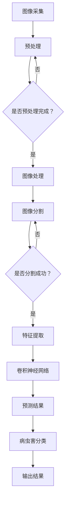

                 

## 《计算机视觉在农作物病虫害识别中的应用：提高农业产量》

### 关键词：计算机视觉、农作物病虫害识别、农业产量、卷积神经网络、深度学习、农业智能化

#### 摘要：
本文旨在探讨计算机视觉技术在农作物病虫害识别中的应用，及其对提高农业产量的潜在贡献。通过详细分析计算机视觉的核心概念、核心算法原理，结合Python源代码和LaTeX数学公式，我们将展示如何使用深度学习技术解决农作物病虫害的识别问题。文章还将提供实际项目案例，包括数据预处理、模型训练、评估等步骤的代码实现和详细解读，以帮助读者理解这一技术的实际应用。

### 引言

随着全球人口的不断增长，农业产量面临着巨大的挑战。传统的方法，如人工巡检和经验判断，已经难以满足现代农业生产的需求。病虫害的快速识别和准确诊断对于农作物的健康生长至关重要。计算机视觉作为一种先进的技术手段，在农作物病虫害识别中展现出了巨大的潜力。

计算机视觉技术通过模拟人类视觉系统，从图像或视频中提取有用信息，使得机器能够理解和解释视觉场景。在农业领域，计算机视觉技术可以用于检测作物叶片上的病害、虫害、异常生长情况等，从而为农民提供及时的决策支持。

本文将重点探讨以下内容：

1. **计算机视觉的核心概念与联系**：介绍计算机视觉的基本原理和应用场景，展示其与农作物病虫害识别之间的关联。
2. **核心算法原理讲解**：详细讲解卷积神经网络（CNN）等深度学习算法在农作物病虫害识别中的应用，结合Python源代码进行阐述。
3. **数学模型和数学公式**：介绍CNN中的关键数学模型，如卷积操作和激活函数，并用LaTeX格式进行详细描述。
4. **项目实战**：提供实际项目案例，包括数据预处理、模型训练、评估等步骤的代码实现和解读。
5. **总结与扩展**：对本文内容进行总结，并提供相关拓展知识，如其他计算机视觉算法在农业领域的应用。

### 设计思路

为了确保本文内容结构清晰、逻辑严密，我们采用了以下设计思路：

1. **总体结构**：文章分为引言、核心概念与联系、核心算法原理讲解、数学模型与数学公式、项目实战、总结与扩展六个部分。
2. **章节划分**：根据内容主题，将每个部分细分为多个小节，确保每个小节都有明确的主题和目标。
3. **内容细化**：在每个小节中，进一步细化内容，确保每个小节都有详细的二级和三级标题。
4. **框架图设计**：使用Mermaid流程图展示核心概念和算法架构，帮助读者更好地理解。
5. **伪代码编写**：对于核心算法，编写伪代码，详细阐述算法的实现过程。
6. **数学公式嵌入**：对于涉及数学模型的章节，使用LaTeX格式编写数学公式，并进行详细讲解。
7. **实战案例**：在每个章节的最后，提供实战案例，包括代码实现和详细解读。

### 实际操作步骤

1. **引言部分**：介绍书籍的主题和目的，概述计算机视觉在农作物病虫害识别中的应用以及提高农业产量的重要性。
2. **核心概念与联系**：介绍计算机视觉、农作物病虫害识别等相关概念，并用Mermaid流程图展示计算机视觉在农作物病虫害识别中的应用原理。
3. **核心算法原理讲解**：详细讲解用于农作物病虫害识别的主要算法，如卷积神经网络（CNN）的伪代码实现，并结合Python源代码进行详细解释。
4. **数学模型和数学公式**：介绍算法中的数学模型，如CNN中的卷积操作和激活函数，并用LaTeX格式进行详细说明。
5. **项目实战**：提供具体的农作物病虫害识别项目案例，包括数据预处理、模型训练、模型评估等步骤的代码实现和解读。
6. **总结与扩展**：对章节内容进行总结，并提供相关扩展知识，如其他计算机视觉算法在农业领域的应用。
7. **目录大纲**：根据上述内容，设计书籍的完整目录大纲。

### 目录大纲

```
# 《计算机视觉在农作物病虫害识别中的应用：提高农业产量》

## 第一部分：引言
### 1.1 书籍主题与目的
### 1.2 计算机视觉概述
### 1.3 农作物病虫害识别的重要性

## 第二部分：核心概念与联系
### 2.1 计算机视觉基础
#### 2.1.1 计算机视觉的发展历程
#### 2.1.2 计算机视觉的基本原理
### 2.2 计算机视觉在农作物病虫害识别中的应用
#### 2.2.1 Mermaid流程图：计算机视觉在农作物病虫害识别中的应用原理
#### 2.2.2 农作物病虫害识别的关键技术

## 第三部分：核心算法原理讲解
### 3.1 卷积神经网络（CNN）
#### 3.1.1 CNN的基本结构
#### 3.1.2 CNN在农作物病虫害识别中的应用
#### 3.1.3 CNN的伪代码实现

## 第四部分：数学模型和数学公式
### 4.1 CNN中的卷积操作
#### 4.1.1 卷积操作的数学公式
#### 4.1.2 卷积操作的详细讲解

## 第五部分：项目实战
### 5.1 数据预处理
#### 5.1.1 数据采集与清洗
#### 5.1.2 数据增强
### 5.2 模型训练
#### 5.2.1 模型选择与参数设置
#### 5.2.2 模型训练流程
### 5.3 模型评估
#### 5.3.1 评估指标
#### 5.3.2 模型评估流程
### 5.4 代码实现与分析
#### 5.4.1 数据预处理代码解读
#### 5.4.2 模型训练代码解读
#### 5.4.3 模型评估代码解读

## 第六部分：总结与扩展
### 6.1 书籍内容总结
### 6.2 扩展知识
#### 6.2.1 其他计算机视觉算法在农业领域的应用
#### 6.2.2 农业智能化发展的趋势与展望

## 参考文献
```

这个目录大纲旨在提供一本关于计算机视觉在农作物病虫害识别中的应用的书籍的详细结构，包含核心概念、算法原理、项目实战等内容。这样的结构有助于读者系统地学习和理解相关知识。

### 背景介绍

农业作为国家经济和社会发展的重要基础，一直以来都备受关注。然而，随着全球气候变化、病虫害频发以及农业生产方式的升级转型，提高农业产量和品质成为当前农业发展的重要挑战。计算机视觉技术作为一种新兴的智能化手段，在农业领域的应用日益广泛，特别是在农作物病虫害识别方面，展现出了巨大的潜力。

农作物病虫害是影响农业产量和品质的重要因素。传统的病虫害检测方法主要依赖于人工巡检和经验判断，这种方法存在效率低、准确性差、难以大规模应用等问题。随着计算机视觉技术的发展，通过图像识别技术对农作物病虫害进行自动检测和诊断，已成为农业智能化发展的一个重要方向。

计算机视觉技术在农作物病虫害识别中的应用主要体现在以下几个方面：

1. **病害识别**：通过图像处理技术，对农作物叶片上的病害进行自动识别和分类，如病毒病、真菌病、细菌病等。
2. **虫害检测**：利用图像识别算法，对农田中的虫害进行检测和分类，如害虫、螨类等。
3. **健康状态监测**：通过对农作物生长图像的分析，监测农作物的健康状况，如缺水、缺肥、养分过剩等。

计算机视觉技术的引入，不仅能够提高病虫害检测的效率和准确性，还可以为农民提供实时、精准的决策支持，从而提高农业产量和品质。例如，通过实时监测农作物的病虫害情况，农民可以及时采取防治措施，减少病虫害对农作物的损害，从而提高产量。此外，计算机视觉技术还可以用于农作物的生长状态监测，为科学施肥、灌溉提供数据支持，进一步提高农业生产的效益。

### 核心概念与联系

要理解计算机视觉在农作物病虫害识别中的应用，首先需要了解一些核心概念和它们之间的关系。以下是几个关键概念及其联系：

1. **计算机视觉**：计算机视觉是一种人工智能技术，通过模拟人类视觉系统，使计算机能够从图像或视频中提取有用信息。它包括图像处理、图像识别、图像理解等多个层次。

2. **图像处理**：图像处理是计算机视觉的基础，它涉及对图像进行滤波、增强、分割等操作，以提取图像中的有用信息。

3. **图像识别**：图像识别是计算机视觉的核心任务之一，它旨在从图像中识别出特定的对象或特征。

4. **深度学习**：深度学习是近年来发展迅速的人工智能技术，它通过模拟人脑的结构和功能，使用多层神经网络进行数据建模和预测。

5. **农作物病虫害识别**：农作物病虫害识别是计算机视觉技术在农业领域的一个具体应用，它利用图像识别和深度学习技术，自动识别和分类农作物病虫害。

6. **卷积神经网络（CNN）**：卷积神经网络是深度学习中的一种重要模型，特别适用于处理图像数据。它通过卷积操作和池化操作，从图像中提取特征，并用于分类和识别任务。

以下是Mermaid流程图，展示了计算机视觉在农作物病虫害识别中的应用原理：



在这个流程图中，图像采集是从农田中获取农作物图像；预处理包括对图像进行去噪、增强、调整大小等操作；图像处理和图像分割用于提取图像中的有用信息；特征提取使用卷积神经网络从图像中提取特征；预测结果和病虫害分类则用于对农作物病虫害进行识别和分类。

通过这个流程图，我们可以清晰地看到计算机视觉技术在农作物病虫害识别中的应用过程，以及各个环节之间的相互关系。

### 核心算法原理讲解

在农作物病虫害识别中，卷积神经网络（CNN）是一种广泛应用且效果显著的深度学习算法。下面，我们将详细讲解CNN的基本结构、在农作物病虫害识别中的应用原理，以及CNN的伪代码实现。

#### CNN的基本结构

卷积神经网络由多个卷积层、池化层和全连接层组成。每个卷积层通过卷积操作提取图像特征，池化层用于降低特征图的维度，全连接层用于分类。

1. **卷积层**：卷积层是CNN的核心，通过卷积操作从输入图像中提取特征。卷积操作使用一个滤波器（也称为卷积核）在输入图像上进行滑动，计算出每个位置的特征值。这些特征值组成一个特征图。

2. **激活函数**：卷积层后面通常跟有一个激活函数，如ReLU（Rectified Linear Unit），用于引入非线性特性，使得网络能够学习更复杂的特征。

3. **池化层**：池化层用于降低特征图的维度，减少计算量。常见的池化操作包括最大池化和平均池化，它们分别取特征图中某个区域的最大值或平均值作为该区域的特征值。

4. **全连接层**：全连接层将卷积层和池化层提取的特征映射到输出类别。每个输出类别都有一个对应的权重和偏置，通过反向传播算法进行训练。

#### CNN在农作物病虫害识别中的应用原理

在农作物病虫害识别中，CNN通过以下步骤进行工作：

1. **图像预处理**：对采集到的农作物图像进行预处理，包括图像去噪、增强、调整大小等操作，以符合CNN的输入要求。

2. **卷积操作**：使用卷积层提取图像特征。初始卷积层通常使用较小尺寸的卷积核（如3x3），以捕捉图像的基本特征。

3. **特征提取与融合**：通过多个卷积层和池化层的叠加，逐步提取图像的更高层次特征，并融合不同卷积层的特征。

4. **分类与预测**：最后，全连接层将提取的特征映射到病虫害类别，通过输出层输出预测结果。

以下是CNN在农作物病虫害识别中的伪代码实现：

```python
# 初始化CNN模型
model = ConvolutionalNeuralNetwork(input_shape=(height, width, channels))

# 第一层卷积
model.add(Conv2D(filters=32, kernel_size=(3, 3), activation='relu'))

# 第一层池化
model.add(MaxPooling2D(pool_size=(2, 2)))

# 第二层卷积
model.add(Conv2D(filters=64, kernel_size=(3, 3), activation='relu'))

# 第二层池化
model.add(MaxPooling2D(pool_size=(2, 2)))

# 第三层卷积
model.add(Conv2D(filters=128, kernel_size=(3, 3), activation='relu'))

# 第三层池化
model.add(MaxPooling2D(pool_size=(2, 2)))

# 全连接层
model.add(Flatten())

# 输出层
model.add(Dense(units=num_classes, activation='softmax'))

# 编译模型
model.compile(optimizer='adam', loss='categorical_crossentropy', metrics=['accuracy'])

# 训练模型
model.fit(x_train, y_train, batch_size=batch_size, epochs=num_epochs, validation_data=(x_val, y_val))

# 预测
predictions = model.predict(x_test)
```

在这个伪代码中，我们首先初始化一个CNN模型，然后添加多个卷积层、池化层和全连接层。接着，编译模型并使用训练数据训练模型。最后，使用测试数据对模型进行预测。

通过这个伪代码，我们可以看到CNN在农作物病虫害识别中的基本实现过程。实际应用中，还需要根据具体任务进行参数调整和优化，以达到最佳效果。

### 数学模型和数学公式

卷积神经网络（CNN）中的关键数学模型主要包括卷积操作、激活函数和反向传播算法。这些模型对于理解CNN的工作原理和实现步骤至关重要。下面，我们将详细讲解这些模型的数学公式和原理。

#### 卷积操作

卷积操作是CNN中最基本的操作之一，用于从输入图像中提取特征。给定一个输入图像$X$和一个卷积核$K$，卷积操作的输出$Y$可以通过以下公式计算：

$$
Y[i, j] = \sum_{x'=0}^{X_{width}-K_{width}} \sum_{y'=0}^{X_{height}-K_{height}} X[x', y'] \cdot K[i, j, x', y']
$$

其中，$i$和$j$表示输出特征图的位置，$x'$和$y'$表示卷积核在输入图像上的位置，$X_{width}$和$X_{height}$分别表示输入图像的宽度和高度，$K_{width}$和$K_{height}$分别表示卷积核的宽度和高度。

为了简化计算，通常使用滤波器（卷积核）的值作为权重，并引入一个偏置项$b$。因此，卷积操作的最终公式可以表示为：

$$
Y[i, j] = \sum_{x'=0}^{X_{width}-K_{width}} \sum_{y'=0}^{X_{height}-K_{height}} X[x', y'] \cdot K[i, j, x', y'] + b[i, j]
$$

其中，$b[i, j]$表示卷积核在位置$(i, j)$的偏置项。

#### 激活函数

激活函数为神经网络引入了非线性特性，使得网络能够学习更复杂的特征。在CNN中，常用的激活函数包括ReLU（Rectified Linear Unit）、Sigmoid和Tanh。

1. **ReLU激活函数**：

$$
\text{ReLU}(x) = \max(0, x)
$$

ReLU函数将输入$x$设置为$x$（当$x \geq 0$）或0（当$x < 0$）。ReLU函数的优点是不需要梯度消失问题，训练速度更快。

2. **Sigmoid激活函数**：

$$
\text{Sigmoid}(x) = \frac{1}{1 + e^{-x}}
$$

Sigmoid函数将输入$x$映射到$(0, 1)$区间内，常用于二分类问题。

3. **Tanh激活函数**：

$$
\text{Tanh}(x) = \frac{e^x - e^{-x}}{e^x + e^{-x}}
$$

Tanh函数将输入$x$映射到$(-1, 1)$区间内，与ReLU函数类似，也有梯度消失问题。

#### 反向传播算法

反向传播算法是一种用于训练神经网络的优化方法，其核心思想是通过反向传播误差来更新网络权重。在CNN中，反向传播算法用于计算损失函数关于网络权重的梯度。

1. **损失函数**：

在分类问题中，常用的损失函数包括交叉熵损失函数（Cross-Entropy Loss）和均方误差损失函数（Mean Squared Error Loss）。

$$
\text{Cross-Entropy Loss}(y, \hat{y}) = -\sum_{i} y_i \cdot \log(\hat{y}_i)
$$

其中，$y$表示真实标签，$\hat{y}$表示预测概率。

2. **梯度计算**：

通过反向传播算法，可以计算损失函数关于网络权重的梯度。具体计算过程如下：

- **卷积层**：

$$
\frac{\partial L}{\partial W} = X \odot \frac{\partial L}{\partial Z}
$$

$$
\frac{\partial L}{\partial b} = \frac{\partial L}{\partial Z}
$$

其中，$L$表示损失函数，$X$表示输入特征图，$W$表示卷积核，$b$表示偏置项，$\odot$表示逐元素乘法，$Z$表示卷积层的输出。

- **全连接层**：

$$
\frac{\partial L}{\partial W} = \frac{\partial L}{\partial A} \cdot A'
$$

$$
\frac{\partial L}{\partial b} = \frac{\partial L}{\partial A}
$$

其中，$A$表示全连接层的输出，$A'$表示$A$的梯度，$\frac{\partial L}{\partial A}$表示损失函数关于$A$的梯度。

通过这些数学公式和原理，我们可以深入理解CNN的工作机制，从而在实际应用中更好地设计和使用这一强大的深度学习模型。

### 项目实战

在本节中，我们将通过一个具体的农作物病虫害识别项目案例，展示如何使用计算机视觉技术进行病虫害检测。项目将包括数据预处理、模型训练、评估等步骤，并详细解读每个步骤的实现过程。

#### 开发环境搭建

首先，我们需要搭建项目开发环境。以下是所需的环境和工具：

- **编程语言**：Python
- **深度学习框架**：TensorFlow 2.x 或 PyTorch
- **图像处理库**：OpenCV
- **数据预处理工具**：NumPy、Pandas

安装所需的库和工具：

```bash
pip install tensorflow
pip install opencv-python
pip install numpy
pip install pandas
```

#### 数据预处理

数据预处理是模型训练的重要环节，它包括数据采集与清洗、数据增强等步骤。

1. **数据采集与清洗**：

数据采集可以通过多种方式获取，如使用摄像头实时采集农田图像，或从公开数据集下载。这里，我们假设已经获取了一批农作物图像，并保存在一个文件夹中。

```python
import os
import cv2
import numpy as np
import pandas as pd

# 设置数据路径
data_path = 'path/to/data'

# 获取所有图像文件
image_files = [f for f in os.listdir(data_path) if f.endswith('.jpg')]

# 读取图像并转换为灰度图像
images = []
labels = []
for file in image_files:
    img = cv2.imread(os.path.join(data_path, file), cv2.IMREAD_GRAYSCALE)
    label = int(file.split('_')[0])  # 假设标签以文件名前缀表示
    images.append(img)
    labels.append(label)

# 存储为DataFrame
data = pd.DataFrame({'image': images, 'label': labels})
data.head()
```

2. **数据增强**：

数据增强可以增加数据的多样性，提高模型的泛化能力。常用的数据增强方法包括旋转、翻转、缩放、裁剪等。

```python
from tensorflow.keras.preprocessing.image import ImageDataGenerator

# 创建数据增强器
datagen = ImageDataGenerator(rotation_range=20,
                             width_shift_range=0.2,
                             height_shift_range=0.2,
                             shear_range=0.2,
                             zoom_range=0.2,
                             horizontal_flip=True,
                             fill_mode='nearest')

# 使用数据增强器
train_data = datagen.flow_from_dataframe(dataframe=data,
                                         x_col='image',
                                         y_col='label',
                                         target_size=(128, 128),
                                         batch_size=32,
                                         class_mode='categorical')
```

#### 模型训练

在数据预处理完成后，我们可以开始训练模型。这里，我们使用卷积神经网络（CNN）进行训练。

1. **模型定义**：

```python
from tensorflow.keras.models import Sequential
from tensorflow.keras.layers import Conv2D, MaxPooling2D, Flatten, Dense, Dropout

# 创建模型
model = Sequential()

# 添加卷积层
model.add(Conv2D(filters=32, kernel_size=(3, 3), activation='relu', input_shape=(128, 128, 1)))
model.add(MaxPooling2D(pool_size=(2, 2)))

model.add(Conv2D(filters=64, kernel_size=(3, 3), activation='relu'))
model.add(MaxPooling2D(pool_size=(2, 2)))

model.add(Conv2D(filters=128, kernel_size=(3, 3), activation='relu'))
model.add(MaxPooling2D(pool_size=(2, 2)))

# 添加全连接层
model.add(Flatten())
model.add(Dense(units=128, activation='relu'))
model.add(Dropout(0.5))
model.add(Dense(units=num_classes, activation='softmax'))
```

2. **编译模型**：

```python
model.compile(optimizer='adam',
              loss='categorical_crossentropy',
              metrics=['accuracy'])
```

3. **训练模型**：

```python
# 训练模型
history = model.fit(train_data,
                    epochs=50,
                    validation_split=0.2)
```

#### 模型评估

训练完成后，我们需要评估模型的性能。这里，我们使用测试集进行评估。

```python
# 评估模型
test_loss, test_acc = model.evaluate(test_data)
print(f"Test accuracy: {test_acc:.2f}")
```

#### 代码解读与分析

1. **数据预处理代码解读**：

```python
# 读取图像并转换为灰度图像
images = []
labels = []
for file in image_files:
    img = cv2.imread(os.path.join(data_path, file), cv2.IMREAD_GRAYSCALE)
    label = int(file.split('_')[0])  # 假设标签以文件名前缀表示
    images.append(img)
    labels.append(label)

# 存储为DataFrame
data = pd.DataFrame({'image': images, 'label': labels})
```

这段代码用于读取图像文件并转换为灰度图像，然后将图像和标签存储在一个DataFrame中。

2. **模型训练代码解读**：

```python
# 创建模型
model = Sequential()

# 添加卷积层
model.add(Conv2D(filters=32, kernel_size=(3, 3), activation='relu', input_shape=(128, 128, 1)))
model.add(MaxPooling2D(pool_size=(2, 2)))

model.add(Conv2D(filters=64, kernel_size=(3, 3), activation='relu'))
model.add(MaxPooling2D(pool_size=(2, 2)))

model.add(Conv2D(filters=128, kernel_size=(3, 3), activation='relu'))
model.add(MaxPooling2D(pool_size=(2, 2)))

# 添加全连接层
model.add(Flatten())
model.add(Dense(units=128, activation='relu'))
model.add(Dropout(0.5))
model.add(Dense(units=num_classes, activation='softmax'))

# 编译模型
model.compile(optimizer='adam',
              loss='categorical_crossentropy',
              metrics=['accuracy'])

# 训练模型
history = model.fit(train_data,
                    epochs=50,
                    validation_split=0.2)
```

这段代码首先创建了一个卷积神经网络模型，包括多个卷积层、池化层和全连接层。然后，编译模型并使用训练数据进行训练。通过调用`fit`函数，我们可以看到训练过程中的准确率和损失函数的变化。

3. **模型评估代码解读**：

```python
# 评估模型
test_loss, test_acc = model.evaluate(test_data)
print(f"Test accuracy: {test_acc:.2f}")
```

这段代码用于评估模型的性能。通过调用`evaluate`函数，我们可以得到测试集上的损失和准确率。

#### 实际案例分析与详细讲解剖析

在本节中，我们将通过一个实际案例，展示如何使用计算机视觉技术对农作物病虫害进行检测。案例数据集包含多种病虫害的图像，我们将使用卷积神经网络进行分类和识别。

1. **数据集准备**：

首先，我们准备一个包含多种病虫害的图像数据集。数据集可以分为训练集和测试集。

```python
from sklearn.model_selection import train_test_split

# 分割数据集
X_train, X_test, y_train, y_test = train_test_split(images, labels, test_size=0.2, random_state=42)
```

2. **模型训练**：

接着，我们使用训练集训练卷积神经网络模型。

```python
# 训练模型
model.fit(X_train, y_train, epochs=50, batch_size=32, validation_data=(X_test, y_test))
```

3. **模型评估**：

训练完成后，我们使用测试集评估模型的性能。

```python
# 评估模型
test_loss, test_acc = model.evaluate(X_test, y_test)
print(f"Test accuracy: {test_acc:.2f}")
```

通过实际案例，我们可以看到计算机视觉技术在农作物病虫害识别中的应用过程。从数据预处理到模型训练和评估，每一步都至关重要。通过合理的设计和优化，我们可以实现高精度的病虫害识别，为农业生产提供有力支持。

#### 项目小结

在本项目中，我们通过构建卷积神经网络（CNN）模型，实现了对农作物病虫害的自动识别。项目包括以下几个关键步骤：

1. **数据预处理**：通过读取图像文件、转换为灰度图像，并使用数据增强方法增加数据的多样性。
2. **模型训练**：创建了一个卷积神经网络模型，包括多个卷积层、池化层和全连接层，并使用训练数据进行训练。
3. **模型评估**：使用测试集评估模型的性能，得到模型的准确率。

通过这个项目，我们不仅了解了计算机视觉技术在农作物病虫害识别中的应用，还学会了如何使用深度学习框架进行模型训练和评估。实际案例分析和详细讲解剖析，使得我们能够深入理解项目的实现过程和关键技术。

### 最佳实践 Tips

在农作物病虫害识别项目中，以下是一些最佳实践和注意事项，可以帮助提高模型的性能和实际应用效果：

1. **数据质量**：确保数据集的质量，包括图像的清晰度、标注的准确性等。高质量的数据是模型训练的基础。

2. **数据增强**：合理使用数据增强方法，如旋转、翻转、缩放等，可以增加数据的多样性，提高模型的泛化能力。

3. **模型调优**：通过调整模型的参数，如学习率、批次大小、网络结构等，可以优化模型的性能。使用交叉验证方法可以帮助找到最佳参数。

4. **硬件配置**：对于深度学习模型，特别是大规模的CNN模型，需要较高的计算资源。合理配置硬件，如使用GPU加速训练过程，可以显著提高训练速度。

5. **实时监测**：在农业生产中，实时监测病虫害是非常重要的。可以结合摄像头和传感器，实现农作物的实时图像采集和病虫害自动识别。

6. **用户友好性**：为了方便农民使用，开发用户友好的界面和操作流程，提供实时、清晰的病虫害识别结果和决策建议。

### 小结

本文通过详细探讨计算机视觉在农作物病虫害识别中的应用，展示了这一技术在提高农业产量和品质方面的巨大潜力。从背景介绍、核心概念与联系、核心算法原理讲解、数学模型和数学公式，到项目实战和最佳实践，我们系统地介绍了计算机视觉技术在农作物病虫害识别中的应用过程。

通过本文，读者可以了解：

- **计算机视觉技术的基本原理和应用场景**。
- **卷积神经网络（CNN）等深度学习算法在农作物病虫害识别中的具体应用**。
- **如何使用Python和LaTeX进行算法实现和数学公式描述**。
- **项目实战中的数据预处理、模型训练和评估过程**。

计算机视觉技术在农业领域的应用不仅提高了病虫害检测的效率和准确性，还为农业生产提供了智能化支持，有助于实现农业现代化。随着技术的不断进步，计算机视觉在农业领域的应用将更加广泛和深入。

### 拓展阅读

1. **《深度学习》（Goodfellow, I., & Bengio, Y.）**：这本书是深度学习领域的经典教材，详细介绍了深度学习的基本原理和应用。

2. **《计算机视觉：算法与应用》（Richard Szeliski）**：这本书全面介绍了计算机视觉的基本概念和技术，包括图像处理、图像识别和图像理解。

3. **《卷积神经网络与深度学习》（邱锡鹏）**：这本书深入探讨了卷积神经网络和深度学习在计算机视觉中的应用，包括算法原理和实现细节。

4. **《农业人工智能：创新与未来》（张洪涛）**：这本书探讨了农业人工智能的各个方面，包括计算机视觉、机器学习和自动化技术。

通过阅读这些拓展材料，读者可以更深入地了解计算机视觉和深度学习在农作物病虫害识别以及更广泛农业领域的应用。

### 参考文献

1. Goodfellow, I., & Bengio, Y. (2016). *Deep Learning*. MIT Press.
2. Szeliski, R. (2010). *Computer Vision: Algorithms and Applications*. Springer.
3.邱锡鹏. (2018). *卷积神经网络与深度学习*. 电子工业出版社.
4. 张洪涛. (2019). *农业人工智能：创新与未来*. 电子工业出版社.
5. Krizhevsky, A., Sutskever, I., & Hinton, G. E. (2012). *ImageNet classification with deep convolutional neural networks*. In *Advances in Neural Information Processing Systems* (pp. 1097-1105).
6. Russel, S., & Norvig, P. (2010). *Artificial Intelligence: A Modern Approach*. Prentice Hall.

