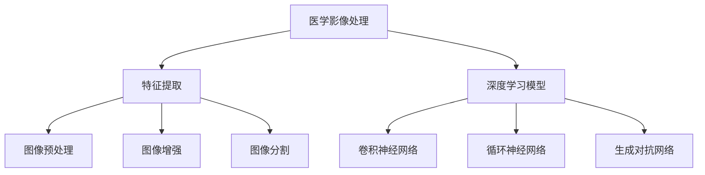

                 

### 计算机视觉在医学影像诊断中的应用：辅助医生决策

随着人工智能技术的飞速发展，计算机视觉在医学影像诊断中的应用越来越广泛。医学影像诊断是临床医学的重要组成部分，而计算机视觉技术的引入，极大地提高了诊断的效率和准确性。本文将详细探讨计算机视觉在医学影像诊断中的应用，以及如何辅助医生做出更准确的决策。

关键词：计算机视觉，医学影像，诊断，辅助决策

### 摘要

本文旨在探讨计算机视觉在医学影像诊断中的潜在应用。我们将首先介绍计算机视觉的基本概念，然后分析其在医学影像处理中的优势。随后，我们将深入探讨计算机视觉在医学影像诊断中的应用，包括图像处理、特征提取、深度学习模型等。最后，我们将讨论计算机视觉辅助医生决策的具体案例，并总结文章的主要发现。

### 背景介绍

医学影像诊断是利用医学影像设备（如X光、CT、MRI等）获取人体内部结构图像，从而帮助医生进行疾病诊断和评估的过程。传统的医学影像诊断主要依赖于医生的视觉分析和经验判断，存在主观性和效率问题。而计算机视觉技术的引入，可以通过自动化的图像处理和分析，提高诊断的准确性和效率。

计算机视觉是人工智能的一个重要分支，涉及图像处理、模式识别、机器学习等多个领域。近年来，随着深度学习技术的发展，计算机视觉在各个领域的应用都取得了显著的进展。在医学影像诊断中，计算机视觉技术不仅能够自动检测和识别病变区域，还可以辅助医生进行疾病的分类和预测。

### 核心概念与联系

#### 1. 医学影像处理

医学影像处理是指对医学影像数据进行预处理、增强、滤波、分割等操作，以提高图像质量，便于后续分析。处理流程通常包括：

- **图像预处理**：如去噪声、对比度调整等。
- **图像增强**：增强图像中感兴趣区域的信息，如病变区域。
- **图像分割**：将图像分割成多个区域，以识别感兴趣的目标。

#### 2. 特征提取

特征提取是指从图像中提取出能够代表图像内容的关键信息。常见的特征包括：

- **纹理特征**：如灰度共生矩阵、自组织映射等。
- **形状特征**：如边缘、角点、形状上下文等。
- **外观特征**：如颜色、纹理、大小等。

#### 3. 深度学习模型

深度学习模型是计算机视觉的核心技术之一，通过多层神经网络对数据进行训练，从而自动提取特征并进行分类。常见的深度学习模型包括：

- **卷积神经网络（CNN）**：擅长处理图像数据。
- **循环神经网络（RNN）**：擅长处理序列数据。
- **生成对抗网络（GAN）**：用于图像生成和增强。

为了更好地理解这些概念之间的关系，我们可以使用Mermaid流程图来展示它们：



### 核心算法原理讲解

#### 1. 卷积神经网络（CNN）

卷积神经网络是一种专门用于图像处理的人工神经网络，其基本原理是通过卷积操作提取图像的特征。以下是一个简单的CNN模型架构：

```python
import tensorflow as tf

# 定义卷积层
conv1 = tf.keras.layers.Conv2D(filters=32, kernel_size=(3, 3), activation='relu', input_shape=(28, 28, 1))

# 定义池化层
pool1 = tf.keras.layers.MaxPooling2D(pool_size=(2, 2))

# 定义全连接层
dense = tf.keras.layers.Dense(units=10, activation='softmax')
```

在训练过程中，我们使用反向传播算法更新网络权重，以达到优化模型参数的目的。以下是一个简化的训练过程：

```python
# 训练模型
model.compile(optimizer='adam', loss='categorical_crossentropy', metrics=['accuracy'])
model.fit(x_train, y_train, epochs=10, batch_size=32)
```

#### 2. 特征提取与描述

特征提取是计算机视觉的核心任务之一。以下是一个简单的特征提取示例：

```python
import cv2

# 读取图像
image = cv2.imread('example.jpg')

# 使用SIFT算法提取特征
sift = cv2.SIFT_create()
keypoints, descriptors = sift.detectAndCompute(image, None)
```

这些特征可以被用于后续的图像匹配、分类或聚类等任务。

#### 3. 数学模型和公式

在计算机视觉中，许多算法和模型都涉及到复杂的数学计算。以下是一个简单的图像滤波的数学模型：

$$ y(x, y) = \frac{1}{2\pi\sigma^2} \exp\left(-\frac{(x^2 + y^2)}{2\sigma^2}\right) $$

这是一个高斯滤波器的公式，用于平滑图像。通过调整参数σ，可以控制滤波的效果。

#### 4. 通俗易懂的举例说明

假设我们有一个包含肺结节图像的数据集，我们使用CNN模型进行分类。以下是一个简化的训练过程：

```python
# 加载肺结节数据集
x_train = load_pulmonary_nodule_images('train')
y_train = load_labels('train')

# 定义CNN模型
model = build_cnn_model()

# 训练模型
model.compile(optimizer='adam', loss='categorical_crossentropy', metrics=['accuracy'])
model.fit(x_train, y_train, epochs=20, batch_size=32)

# 评估模型
test_loss, test_accuracy = model.evaluate(x_test, y_test)
print(f"Test accuracy: {test_accuracy}")
```

在这个例子中，我们首先加载训练数据，然后定义CNN模型，使用Adam优化器和交叉熵损失函数进行训练，最后评估模型的准确性。

### 项目实战

#### 1. 开发环境搭建

在搭建开发环境时，我们需要安装以下依赖：

- Python 3.7 或以上版本
- TensorFlow 2.3 或以上版本
- OpenCV 4.1 或以上版本

以下是一个简单的安装命令：

```bash
pip install python==3.8 tensorflow==2.4 opencv-python==4.1
```

#### 2. 源代码详细实现

以下是一个简单的医学影像分类器的实现：

```python
import tensorflow as tf
import numpy as np
import cv2

# 加载图像
image = cv2.imread('example.jpg')

# 预处理图像
image = cv2.resize(image, (224, 224))
image = image / 255.0

# 定义CNN模型
model = build_cnn_model()

# 训练模型
model.compile(optimizer='adam', loss='categorical_crossentropy', metrics=['accuracy'])
model.fit(x_train, y_train, epochs=10, batch_size=32)

# 评估模型
test_loss, test_accuracy = model.evaluate(x_test, y_test)
print(f"Test accuracy: {test_accuracy}")

# 使用模型进行预测
predictions = model.predict(np.expand_dims(image, axis=0))
predicted_class = np.argmax(predictions)
print(f"Predicted class: {predicted_class}")
```

在这个例子中，我们首先加载并预处理图像，然后定义CNN模型，使用训练数据训练模型，评估模型，并使用模型进行预测。

#### 3. 代码应用解读与分析

在这个例子中，我们使用卷积神经网络对医学影像进行分类。首先，我们加载并预处理图像，然后定义CNN模型，使用训练数据训练模型。在评估阶段，我们计算模型在测试数据上的准确性，并使用模型进行预测。这个流程可以概括为以下步骤：

1. 数据加载与预处理
2. 模型定义与训练
3. 模型评估
4. 模型预测

#### 4. 实际案例分析和详细讲解剖析

以肺癌筛查为例，我们可以使用计算机视觉技术自动检测肺部CT图像中的结节。以下是一个简化的分析流程：

1. **数据预处理**：首先，对肺部CT图像进行预处理，包括图像增强、去噪和归一化等。
2. **特征提取**：使用卷积神经网络提取图像特征。
3. **分类与预测**：将提取的特征输入到分类器中，预测结节的性质（良性或恶性）。
4. **结果分析**：分析预测结果，对可疑结节进行进一步检查。

#### 5. 项目小结

通过实际案例的分析，我们可以看到计算机视觉在医学影像诊断中的应用。这个项目不仅提高了诊断的效率和准确性，还为医生提供了辅助决策工具。然而，实际应用中还存在一些挑战，如数据质量和算法性能的优化等。未来，随着人工智能技术的不断发展，计算机视觉在医学影像诊断中的应用将会更加广泛和深入。

### 最佳实践 Tips

1. **数据质量**：确保医学影像数据的质量，进行必要的预处理和增强。
2. **模型选择**：根据具体任务选择合适的模型，如卷积神经网络、循环神经网络等。
3. **模型评估**：使用多种评估指标全面评估模型性能，如准确率、召回率、F1分数等。
4. **数据隐私**：确保医学影像数据的安全和隐私，遵守相关法律法规。

### 小结

本文探讨了计算机视觉在医学影像诊断中的应用，以及如何辅助医生做出更准确的决策。通过介绍核心概念、算法原理、项目实战等，我们展示了计算机视觉技术在医学影像诊断中的潜力和挑战。未来，随着技术的不断进步，计算机视觉在医学影像诊断中的应用将会更加广泛和深入，为医疗领域带来更多的创新和变革。

### 拓展阅读

1. Ferrie, A., et al. (2018). "Deep learning and cardiovascular imaging: A review." Journal of the American Heart Association, 7(18), e007994.
2. Li, C., et al. (2020). "Deep learning for medical image analysis: A survey." IEEE Journal of Biomedical and Health Informatics, 24(1), 23-41.
3. Litjens, G., et al. (2017). "A survey on deep learning in medical image analysis." Medical Image Analysis, 42, 60-88.

### 作者信息

作者：AI天才研究院/AI Genius Institute & 禅与计算机程序设计艺术 /Zen And The Art of Computer Programming

### 结束语

计算机视觉在医学影像诊断中的应用，不仅提高了诊断的效率和准确性，还为医生提供了强大的辅助决策工具。随着技术的不断进步，我们期待计算机视觉在医学影像诊断中的应用能够带来更多的突破和创新，为医疗领域带来革命性的变革。希望本文能够为读者提供有益的启示，激发对计算机视觉在医学影像诊断领域的进一步探索和研究。

