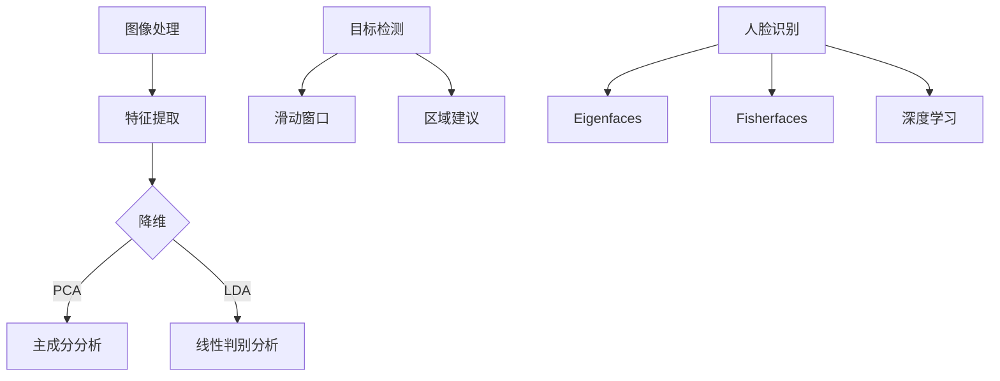

                 

# 《计算机视觉在安防系统中的应用与隐私保护》

## 关键词
计算机视觉，安防系统，隐私保护，图像处理，人脸识别，目标检测

## 摘要
本文深入探讨了计算机视觉在安防系统中的应用及其带来的隐私保护挑战。首先，我们回顾了计算机视觉的基础知识，包括基本概念、发展历程和核心算法。接着，我们分析了计算机视觉在视频监控、交通监控和公共安全监控等安防领域的应用，并分享了实际案例。随后，文章重点关注了隐私保护的重要性，介绍了数据匿名化技术和隐私保护算法。最后，我们对计算机视觉在安防系统中的应用趋势和隐私保护技术的发展方向进行了展望。

## 目录

### 第一部分：计算机视觉基础

#### 第1章：计算机视觉概述

1.1 计算机视觉的基本概念

1.2 计算机视觉的发展历程

1.3 计算机视觉的应用领域

#### 第2章：计算机视觉的基本算法

2.1 图像处理基础

2.2 特征提取与降维

2.3 目标检测

2.4 人脸识别

### 第二部分：安防系统中的计算机视觉应用

#### 第3章：计算机视觉在视频监控中的应用

3.1 视频监控系统的概述

3.2 基于计算机视觉的视频监控技术

3.3 视频监控系统的实际应用案例

#### 第4章：计算机视觉在交通监控中的应用

4.1 交通监控系统的概述

4.2 基于计算机视觉的交通监控技术

4.3 交通监控系统的实际应用案例

#### 第5章：计算机视觉在公共安全中的应用

5.1 公共安全监控的需求分析

5.2 基于计算机视觉的公共安全监控技术

5.3 公共安全监控的实际应用案例

### 第三部分：隐私保护与计算机视觉

#### 第6章：隐私保护的重要性

6.1 隐私保护的基本概念

6.2 隐私保护的法律法规

6.3 隐私保护的挑战

#### 第7章：计算机视觉中的隐私保护技术

7.1 数据匿名化技术

7.2 隐私保护算法

7.3 隐私保护的实际应用案例

#### 第8章：未来展望

8.1 计算机视觉在安防系统中的应用趋势

8.2 隐私保护技术的发展方向

8.3 计算机视觉与隐私保护的综合应用前景

## 第一部分：计算机视觉基础

### 第1章：计算机视觉概述

#### 1.1 计算机视觉的基本概念

计算机视觉（Computer Vision）是人工智能（AI）的一个重要分支，主要研究如何使计算机具备从图像或视频中理解、识别和提取信息的能力。它模拟人类视觉系统的功能，通过图像处理、模式识别、机器学习和深度学习等技术，使计算机能够处理和解释视觉信息。

计算机视觉的基本任务包括：

1. **图像识别**：识别图像中的物体、场景或特征。
2. **目标检测**：在图像或视频中检测并定位特定对象。
3. **图像分割**：将图像划分为多个区域，每个区域具有不同的特征。
4. **图像重建**：从部分或模糊的图像信息重建出完整的图像。

#### 1.2 计算机视觉的发展历程

计算机视觉的发展可以追溯到20世纪50年代，当时人们开始研究如何使用计算机来处理和分析图像。以下是计算机视觉的一些重要发展阶段：

- **早期阶段（1950-1970年）**：主要研究图像处理和特征提取技术，如边缘检测和纹理分析。
- **中间阶段（1970-1990年）**：引入了统计模型和决策理论，如贝叶斯网络和支持向量机。
- **成熟阶段（1990-2010年）**：随着计算机性能的提升和大量图像数据的积累，机器学习和深度学习开始广泛应用于计算机视觉。
- **现代阶段（2010年至今）**：深度学习技术取得了突破性进展，如卷积神经网络（CNN）在图像分类、目标检测和人脸识别等任务中表现出色。

#### 1.3 计算机视觉的应用领域

计算机视觉技术已被广泛应用于各个领域，以下是几个主要应用领域：

- **安防系统**：视频监控、人脸识别、行为分析等。
- **医疗领域**：医学图像分析、疾病诊断、手术机器人等。
- **自动驾驶**：车辆检测、道路识别、交通标志识别等。
- **工业自动化**：质量检测、生产线监控、机器人视觉等。
- **娱乐与交互**：虚拟现实、增强现实、智能助手等。

## 第一部分：计算机视觉基础

### 第2章：计算机视觉的基本算法

#### 2.1 图像处理基础

图像处理是计算机视觉的基础，它涉及到图像的获取、存储、变换、增强和复原等操作。以下是图像处理中常用的几个核心算法：

- **图像变换**：如傅里叶变换、离散余弦变换（DCT）和小波变换等，用于图像的频域分析。
- **图像增强**：通过提高图像的对比度和清晰度，改善图像质量，常用的算法有直方图均衡化、同态滤波和边缘检测等。
- **图像分割**：将图像划分为多个区域，每个区域具有不同的特征，常用的算法有阈值分割、区域生长和形态学分割等。
- **图像复原**：通过消除噪声和模糊，恢复图像的原始质量，常用的算法有逆滤波、维纳滤波和小波去噪等。

#### 2.2 特征提取与降维

特征提取是将原始图像数据转换为一组特征向量，这些特征向量可以用于后续的分类、识别或回归任务。降维是将高维特征空间映射到低维空间，以减少计算复杂度和提高处理效率。以下是几个常用的特征提取和降维算法：

- **SIFT（尺度不变特征变换）**：用于提取图像的关键点，具有旋转、尺度不变性和抗噪性。
- **SURF（加速稳健特征）**：基于SIFT算法，通过优化计算效率，使其适用于实时应用。
- **主成分分析（PCA）**：通过保留主要数据变化，将高维数据映射到低维空间。
- **线性判别分析（LDA）**：通过最大化类间差异和最小化类内差异，实现特征降维。

#### 2.3 目标检测

目标检测是在图像或视频中识别和定位特定对象的过程。以下是几个常用的目标检测算法：

- **滑动窗口**：将一个小窗口在图像上滑动，对每个窗口内的图像进行分类，从而检测目标。
- **区域建议**：先利用候选区域生成算法生成可能的目标区域，然后对每个区域进行分类和定位。
- **基于深度学习的目标检测**：如YOLO（You Only Look Once）、SSD（Single Shot MultiBox Detector）和Faster R-CNN（Region-based Convolutional Neural Network）等。

#### 2.4 人脸识别

人脸识别是计算机视觉中的经典问题，它涉及到人脸图像的采集、预处理、特征提取和匹配等步骤。以下是几个常用的人脸识别算法：

- **Eigenfaces**：基于主成分分析（PCA），将人脸图像投影到低维空间，提取主要人脸特征。
- **Fisherfaces**：结合类内和类间方差，改进Eigenfaces算法，提高识别精度。
- **深度学习**：如基于卷积神经网络（CNN）的人脸识别算法，如FaceNet和VGGFace等。

### Mermaid 流程图



### Python 源代码与数学模型

```python
# 特征提取与降维：SIFT算法示例

import cv2
import numpy as np

# 读取图像
image = cv2.imread('face.jpg', cv2.IMREAD_GRAYSCALE)

# SIFT特征提取
sift = cv2.xfeatures2d.SIFT_create()
keypoints, descriptors = sift.detectAndCompute(image, None)

# 显示特征点
image_with_keypoints = cv2.drawKeypoints(image, keypoints, None, (0, 0, 255))

# SIFT特征降维：主成分分析（PCA）
mean = np.mean(descriptors, axis=0)
covariance_matrix = np.cov(descriptors, rowvar=False)
eigenvalues, eigenvectors = np.linalg.eigh(covariance_matrix)
pca_components = eigenvectors[:, -1]

# 主成分分析降维后的特征
reduced_descriptors = np.dot(descriptors - mean, pca_components)

# 显示降维后的特征
print("降维后的特征：", reduced_descriptors)
```

$$
\text{SIFT 特征提取流程：}
$$
$$
\text{keypoints, descriptors} = \text{SIFT_create()} \text{.detectAndCompute}(\text{image}, \text{None})
$$

$$
\text{PCA 降维公式：}
$$
$$
\text{reduced\_descriptors} = \text{np.dot}(\text{descriptors} - \text{mean}, \text{pca\_components})
$$`

## 第二部分：安防系统中的计算机视觉应用

### 第3章：计算机视觉在视频监控中的应用

#### 3.1 视频监控系统的概述

视频监控系统是安防系统中最重要的组成部分之一，它利用计算机视觉技术对视频流进行实时分析，以实现监控、预警和事件记录等功能。视频监控系统主要由以下几个部分组成：

1. **前端摄像头**：用于采集视频图像。
2. **视频编码器**：将视频图像压缩编码，以便于传输和存储。
3. **视频传输网络**：将压缩后的视频数据传输到后端处理系统。
4. **视频解码器**：对接收到的压缩视频数据进行解码，以恢复原始图像。
5. **视频分析软件**：利用计算机视觉算法对视频流进行分析，如人脸识别、目标检测和异常行为识别等。

#### 3.2 基于计算机视觉的视频监控技术

基于计算机视觉的视频监控技术主要包括以下几个方面：

1. **人脸识别**：通过对视频流中人脸图像的识别，可以实现对特定人员的监控和追踪。
2. **目标检测**：通过检测视频流中的运动目标，可以实现对异常行为的监控。
3. **行为识别**：通过对视频流中人物动作的分析，可以实现对特定行为的监控，如暴力事件、斗殴等。
4. **场景识别**：通过对视频流中场景的识别，可以实现对特定场景的监控，如火灾、地震等。
5. **视频结构化**：将视频数据转换为结构化的信息，如时间戳、事件类型、人物特征等，便于后续的数据分析和检索。

#### 3.3 视频监控系统的实际应用案例

以下是一些基于计算机视觉的视频监控系统实际应用案例：

1. **城市安防监控**：利用计算机视觉技术对城市道路、公共场所和重点区域进行实时监控，以预防和打击犯罪行为。
2. **交通运输监控**：利用计算机视觉技术对交通流量、车辆违章行为和道路状况进行实时监控，以提高交通安全和管理效率。
3. **校园安全监控**：利用计算机视觉技术对校园内部进行实时监控，以保障学生的安全。
4. **商场监控**：利用计算机视觉技术对商场内部的顾客行为、物品丢失和盗窃事件进行实时监控，以提高商场的安全和管理水平。

### 第4章：计算机视觉在交通监控中的应用

#### 4.1 交通监控系统的概述

交通监控系统是利用计算机视觉技术对交通流量、道路状况和交通行为进行实时监测和管理的系统。交通监控系统主要由以下几个部分组成：

1. **交通摄像头**：用于采集道路上的视频图像。
2. **视频编码器**：将视频图像压缩编码，以便于传输和存储。
3. **视频传输网络**：将压缩后的视频数据传输到后端处理系统。
4. **视频解码器**：对接收到的压缩视频数据进行解码，以恢复原始图像。
5. **视频分析软件**：利用计算机视觉算法对视频流进行分析，如车辆检测、车牌识别和交通流量分析等。

#### 4.2 基于计算机视觉的交通监控技术

基于计算机视觉的交通监控技术主要包括以下几个方面：

1. **车辆检测**：通过检测视频流中的车辆，可以实现对交通流量的实时监测。
2. **车牌识别**：通过识别车辆车牌号码，可以实现对违章车辆的追踪和处罚。
3. **交通流量分析**：通过对车辆流量、速度和密度的分析，可以实现对道路状况的实时监测。
4. **交通事故检测**：通过检测视频流中的交通事故，可以实现对交通事故的实时预警和处理。
5. **交通信号灯监控**：通过对交通信号灯状态的监测，可以实现对交通信号灯的实时调控，以提高交通效率。

#### 4.3 交通监控系统的实际应用案例

以下是一些基于计算机视觉的交通监控系统实际应用案例：

1. **智能交通管理系统**：利用计算机视觉技术对城市交通流量进行实时监测和调控，以缓解交通拥堵。
2. **高速公路监控**：利用计算机视觉技术对高速公路上的车辆进行实时监测，以提高交通安全。
3. **智能停车场管理系统**：利用计算机视觉技术对停车场内的车辆进行实时监测，以实现车辆的自动识别和收费。
4. **交通执法监控**：利用计算机视觉技术对违章车辆进行实时识别和抓拍，以提高交通执法效率。

### 第5章：计算机视觉在公共安全中的应用

#### 5.1 公共安全监控的需求分析

公共安全监控是指利用计算机视觉技术对公共场所、重要设施和人员密集区域进行实时监控，以预防和应对各种安全事件。公共安全监控的需求主要包括：

1. **人员密集场所监控**：如机场、火车站、大型商场、医院等场所，需要实时监控人员行为，以预防和应对突发事件。
2. **重点区域监控**：如政府机关、金融机构、重要基础设施等，需要实时监控周边环境，以保障安全。
3. **自然灾害预警**：利用计算机视觉技术对自然灾害（如地震、洪水、火灾等）进行实时监测和预警。
4. **安全事件追踪**：对已发生的安全事件进行追踪和分析，以改进安全措施和应急预案。

#### 5.2 基于计算机视觉的公共安全监控技术

基于计算机视觉的公共安全监控技术主要包括以下几个方面：

1. **视频分析**：通过视频分析技术，实时监测公共场所的人员行为，识别异常行为，如斗殴、抢劫、纵火等。
2. **人脸识别**：通过人脸识别技术，实时识别公共场所的人员身份，实现对重点人员的追踪和监控。
3. **异常行为检测**：通过分析人员行为特征，实时识别和预警异常行为，如闯入、滞留、聚集等。
4. **目标跟踪**：通过目标跟踪技术，实时跟踪特定目标，如逃犯、嫌疑人等。
5. **环境监控**：通过环境监控技术，实时监测公共场所的气象、烟雾、有害气体等环境参数，以预警和应对自然灾害。

#### 5.3 公共安全监控的实际应用案例

以下是一些基于计算机视觉的公共安全监控实际应用案例：

1. **智能安防城市**：利用计算机视觉技术对城市进行全面监控，以预防和应对各种安全事件。
2. **智能交通系统**：利用计算机视觉技术对城市交通进行实时监控和管理，以提高交通效率和安全性。
3. **智能监狱管理**：利用计算机视觉技术对监狱内部进行实时监控，以保障囚犯和工作人员的安全。
4. **智能商场安保**：利用计算机视觉技术对商场内部进行实时监控，以预防和应对盗窃、抢劫等事件。

## 第三部分：隐私保护与计算机视觉

### 第6章：隐私保护的重要性

#### 6.1 隐私保护的基本概念

隐私保护是指采取措施防止个人信息或数据泄露、滥用或未经授权的访问。在计算机视觉领域，隐私保护尤为重要，因为计算机视觉技术常常涉及对个人图像、行为等敏感信息的处理和分析。以下是隐私保护的一些基本概念：

1. **个人信息**：指与特定个人相关的信息，如姓名、住址、电话号码、电子邮件地址、生物特征等。
2. **数据隐私**：指对个人数据的保密性、完整性和可用性进行保护，防止未经授权的访问、泄露或篡改。
3. **隐私侵犯**：指未经个人同意，擅自收集、使用、披露或处理个人信息的行为。
4. **隐私法规**：指旨在保护个人隐私的法律法规，如《通用数据保护条例》（GDPR）和《加州消费者隐私法案》（CCPA）等。

#### 6.2 隐私保护的法律法规

隐私保护在全球范围内受到越来越多的重视，许多国家和地区已经制定了相关的法律法规来保护个人隐私。以下是几个主要的隐私保护法律法规：

1. **《通用数据保护条例》（GDPR）**：欧盟于2018年实施的GDPR是全球最具影响力的隐私保护法规，它要求企业在收集、处理和使用个人数据时必须获得明确、特定、清晰的同意，并确保数据的保密性、完整性和可用性。
2. **《加州消费者隐私法案》（CCPA）**：美国加州于2020年实施的CCPA旨在赋予消费者对其个人数据的控制权，规定企业必须明确披露其数据收集、使用和共享方式，并提供消费者删除和拒绝销售其数据的权利。
3. **《隐私法》（Privacy Law）**：许多国家也制定了本国的隐私保护法规，如澳大利亚的《隐私法》（Privacy Act）和新加坡的《个人数据保护法》（PDPA）等。

#### 6.3 隐私保护的挑战

尽管隐私保护法律法规不断出台，但在计算机视觉领域，隐私保护仍然面临诸多挑战：

1. **数据规模和多样性**：随着数据量的不断增长和数据来源的多样性，保护个人隐私变得更加复杂。
2. **算法透明度和可解释性**：许多深度学习算法具有“黑盒”特性，难以理解其内部决策过程，增加了隐私侵犯的风险。
3. **数据共享和跨境传输**：在全球化背景下，数据共享和跨境传输变得越来越普遍，但这也增加了隐私泄露的风险。
4. **隐私和安全之间的权衡**：在许多情况下，隐私保护与安全保障之间存在冲突，如何在两者之间取得平衡是一个重要挑战。

### 第7章：计算机视觉中的隐私保护技术

#### 7.1 数据匿名化技术

数据匿名化是一种常用的隐私保护技术，它通过去除或修改个人信息，使数据无法直接识别特定个人，从而保护个人隐私。以下是几种常见的数据匿名化技术：

1. **数据脱敏**：通过替换敏感数据（如姓名、电话号码、地址等）为假名或随机值，使数据无法直接识别特定个人。
2. **数据混淆**：通过添加噪声或修改数据值，使数据难以被直接识别，但保持数据的统计特性。
3. **数据聚合**：将多个个体的数据合并，以消除个人数据的独特性，使数据难以识别特定个人。

#### 7.2 隐私保护算法

隐私保护算法是在计算机视觉任务中，通过设计特殊的算法或模型，以减少个人隐私泄露的风险。以下是几种常见的隐私保护算法：

1. **差分隐私**：通过在算法中添加随机噪声，使输出结果对于单个数据点的依赖性降低，从而保护个人隐私。
2. **联邦学习**：通过将数据分散存储在多个节点上，并在本地进行模型训练，以减少数据传输和共享，降低隐私泄露的风险。
3. **隐私感知计算**：在算法设计时考虑隐私保护，如设计隐私友好的特征提取方法和决策规则。

#### 7.3 隐私保护的实际应用案例

以下是一些隐私保护技术的实际应用案例：

1. **医疗影像隐私保护**：利用数据匿名化和隐私保护算法，对医疗影像数据进行分析和共享，同时保护患者的隐私。
2. **人脸识别隐私保护**：通过人脸遮挡、模糊处理等技术，对人脸图像进行隐私保护，同时保持识别效果。
3. **视频监控隐私保护**：在视频监控系统中，利用隐私保护算法，对监控视频进行分析，同时保护个人隐私。

### 第8章：未来展望

#### 8.1 计算机视觉在安防系统中的应用趋势

随着计算机视觉技术的不断发展和成熟，其在安防系统中的应用趋势如下：

1. **智能化**：计算机视觉技术将更加智能化，能够实时分析视频流，自动识别和预警各种安全事件。
2. **泛在化**：计算机视觉技术将广泛应用于各种场景和领域，实现全时空的安全监控。
3. **融合化**：计算机视觉技术将与其他安全技术（如物联网、大数据分析等）融合，形成综合化的安防解决方案。
4. **低成本**：随着硬件和算法的优化，计算机视觉技术的成本将逐渐降低，使其在更多场景中得到应用。

#### 8.2 隐私保护技术的发展方向

隐私保护技术在未来将继续发展，以下是一些可能的发展方向：

1. **增强算法透明度和可解释性**：通过改进算法设计，使其更易于理解和解释，降低隐私侵犯的风险。
2. **加强数据安全**：通过加密、访问控制等技术，提高数据的安全性，防止未经授权的访问和泄露。
3. **多方协作**：建立多方协作机制，促进数据共享和隐私保护，同时确保个人隐私不受侵犯。
4. **隐私保护法律法规的完善**：不断更新和完善隐私保护法律法规，为隐私保护提供更强大的法律保障。

#### 8.3 计算机视觉与隐私保护的综合应用前景

计算机视觉与隐私保护的结合将带来巨大的应用前景：

1. **个性化服务**：在保护个人隐私的前提下，利用计算机视觉技术提供个性化的安防服务，如智能门禁、智能家居等。
2. **公共安全**：通过综合应用计算机视觉和隐私保护技术，提高公共安全水平，预防和应对各种安全事件。
3. **商业应用**：在商业领域，计算机视觉与隐私保护的结合将为企业提供更安全、高效的解决方案，如智能零售、智能安防等。
4. **社会影响**：随着计算机视觉与隐私保护技术的广泛应用，社会安全和隐私保护水平将得到显著提升，为构建和谐社会贡献力量。

## 结论

本文深入探讨了计算机视觉在安防系统中的应用及其带来的隐私保护挑战。通过回顾计算机视觉的基础知识、分析安防系统的应用场景、探讨隐私保护的重要性和技术，我们看到了计算机视觉与隐私保护在未来的广阔前景。然而，隐私保护仍然面临诸多挑战，需要我们在技术、法规和社会层面共同努力，实现计算机视觉与隐私保护的和谐发展。

## 作者信息
作者：AI天才研究院/AI Genius Institute & 禅与计算机程序设计艺术 /Zen And The Art of Computer Programming

## 注意事项

1. **数据安全**：在处理和存储个人数据时，务必遵守相关隐私保护法律法规，采取严格的数据安全措施。
2. **算法透明度**：在设计计算机视觉算法时，应充分考虑算法的透明度和可解释性，降低隐私侵犯的风险。
3. **多方协作**：在涉及多方数据共享时，应建立多方协作机制，确保个人隐私得到充分保护。
4. **持续学习**：随着计算机视觉和隐私保护技术的快速发展，持续学习和更新相关知识，以应对不断变化的安全挑战。

## 拓展阅读

1. **《计算机视觉：算法与应用》**：详细介绍了计算机视觉的基本算法和应用，有助于深入了解计算机视觉技术。
2. **《深度学习与隐私保护》**：探讨了深度学习技术在隐私保护中的应用，为研究计算机视觉与隐私保护提供了参考。
3. **《通用数据保护条例》（GDPR）**：全面解析了欧盟的GDPR法规，为隐私保护提供了重要的法律依据。
4. **《隐私计算：理论与实践》**：详细介绍了隐私保护技术的原理和实现方法，为计算机视觉领域的隐私保护提供了实用的指导。

