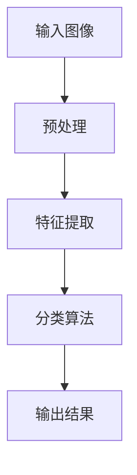
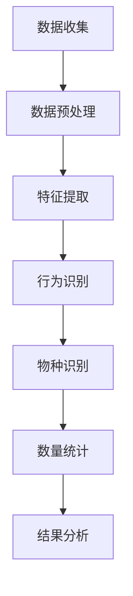
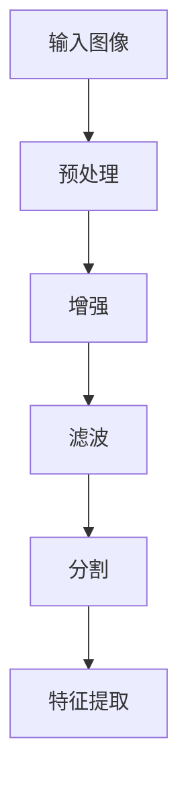
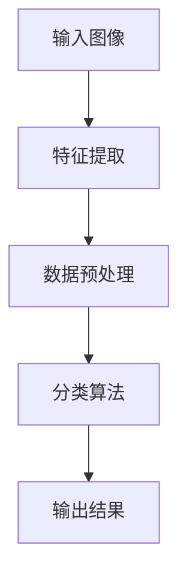

                 

### 引言

在当今数字化时代，计算机技术在各个领域的应用不断拓展和深化，其中计算机视觉作为人工智能的重要分支，正逐渐成为解决复杂现实问题的重要工具。在众多应用场景中，野生动物监测成为了一个备受关注的领域。计算机视觉技术在野生动物监测中的应用，不仅能够提高监测的效率，还能够提供更加精确和全面的数据，为野生动物保护和研究提供了强有力的支持。

野生动物监测是一个复杂而重要的任务。它不仅涉及对野生动物种群数量的统计，还包括对它们行为、栖息地状况以及生存环境的监测。这些数据对于制定有效的保护措施、评估生态系统的健康状况以及进行科学研究具有重要意义。然而，传统的野生动物监测方法往往依赖于人工观察和实地调查，不仅成本高昂，而且受限于人力和时间。

计算机视觉技术的引入，为野生动物监测带来了新的契机。通过使用摄像头、无人机等设备，可以实时捕捉野生动物的图像和视频数据。计算机视觉算法则能够对这些数据进行分析和处理，提取有用的信息。例如，图像识别技术可以用来识别不同的野生动物物种，行为识别技术可以用来分析野生动物的行为模式，数量统计技术可以用来估算种群数量等。

本文将详细探讨计算机视觉在野生动物监测中的应用。首先，我们将介绍计算机视觉的基础概念和技术，包括图像处理、特征提取和分类算法等。接着，我们将讨论野生动物监测的重要性以及当前面临的方法和挑战。随后，我们将深入探讨计算机视觉在野生动物监测中的具体应用，包括行为识别、物种识别和数量统计等。此外，我们还将介绍数据收集和预处理的关键步骤，以及如何应对数据质量和评估的问题。在项目实战部分，我们将通过一个实际案例来展示如何开发和实施一个计算机视觉野生动物监测项目。最后，我们将对未来的发展趋势和面临的挑战进行展望，并提出一些最佳实践和注意事项。

通过本文的详细分析和探讨，读者将能够全面了解计算机视觉在野生动物监测中的应用，掌握相关技术和方法，并为未来的研究和应用提供参考。

### 关键词

- 计算机视觉
- 野生动物监测
- 图像识别
- 行为识别
- 数量统计
- 数据预处理
- 无人机监测
- 深度学习
- 模型评估

### 摘要

本文主要探讨了计算机视觉在野生动物监测中的应用。首先介绍了计算机视觉的基础概念和技术，包括图像处理、特征提取和分类算法。然后，讨论了野生动物监测的重要性以及当前面临的方法和挑战。随后，详细分析了计算机视觉在野生动物监测中的具体应用，包括行为识别、物种识别和数量统计。此外，本文还介绍了数据收集和预处理的关键步骤，以及如何应对数据质量和评估的问题。通过一个实际案例，展示了如何开发和实施一个计算机视觉野生动物监测项目。最后，对未来的发展趋势和面临的挑战进行了展望，并提出了一些最佳实践和注意事项。通过本文的探讨，读者将能够全面了解计算机视觉在野生动物监测中的应用，掌握相关技术和方法，为未来的研究和应用提供参考。

## 第1章 引言

### 1.1 计算机视觉与野生动物监测

计算机视觉是一种人工智能技术，通过模拟人类视觉系统，使计算机能够从图像或视频中提取有用信息。随着深度学习等先进算法的发展，计算机视觉技术已经广泛应用于各个领域，包括医疗、安防、自动驾驶和机器人等。在野生动物监测中，计算机视觉技术同样发挥着重要作用。

#### 1.1.1 应用背景

野生动物监测是一个复杂且耗时的过程，传统的监测方法主要依赖于人类观察和实地调查。这种方法不仅效率低下，而且容易受到人为因素的影响，导致监测数据不准确。随着无人机和高清摄像头的普及，计算机视觉技术开始被引入到野生动物监测领域，通过自动化和智能化的手段，提高监测效率和数据准确性。

#### 1.1.2 关键挑战

尽管计算机视觉技术为野生动物监测带来了新的契机，但同时也面临着一系列挑战：

1. **数据多样性**：野生动物的多样性导致图像和视频数据具有高度变异性，这使得计算机视觉模型需要能够适应不同的环境、光线条件和动物姿态。

2. **计算资源**：实时处理大量的图像和视频数据需要强大的计算资源和高效的算法。

3. **数据标注**：高质量的训练数据对于训练高效的计算机视觉模型至关重要，但在野生动物监测中，获取大量的标注数据往往是一个困难的过程。

4. **模型泛化能力**：模型需要具备良好的泛化能力，以便在不同地区和环境下都能准确识别野生动物。

### 1.2 计算机视觉基础

计算机视觉的核心在于如何从图像或视频中提取有意义的信息。以下是几个关键的概念和技术：

#### 1.2.1 图像处理技术

图像处理是计算机视觉的基础，它包括图像增强、滤波、分割和特征提取等。这些技术可以用于改善图像质量，提取有用的信息。

#### 1.2.2 特征提取与分类算法

特征提取是将图像或视频中的关键信息提取出来，用于后续的分类和识别。常见的特征提取方法包括边缘检测、纹理分析和形状分析等。分类算法则是根据提取的特征对图像进行分类，常用的算法有支持向量机（SVM）、随机森林（RF）和深度学习等。

#### 1.2.3 Mermaid流程图展示

为了更直观地理解计算机视觉的基本流程，我们可以使用Mermaid流程图来展示。以下是一个简化的计算机视觉流程图：



#### 1.2.4 核心算法原理讲解

为了深入理解计算机视觉的核心算法原理，我们将使用Python源代码来详细阐述关键步骤。以下是一个简单的图像分类算法的示例：

```python
import cv2
import numpy as np

# 加载图像
image = cv2.imread('example.jpg')

# 图像预处理
gray = cv2.cvtColor(image, cv2.COLOR_BGR2GRAY)
blurred = cv2.GaussianBlur(gray, (5, 5), 0)

# 特征提取
edges = cv2.Canny(blurred, 100, 200)

# 分类算法（例如：支持向量机）
features = np.float32(edges).reshape(-1, 1)
train_data = np.load('train_data.npy')
train_labels = np.load('train_labels.npy')
model = cv2.ml.SVM_create()
model.train(train_data, cv2.ml.SVM_RCV1, train_labels)

# 输出结果
 prediction = model.predict(features)
print("分类结果：", prediction)
```

在这个示例中，我们首先加载了一幅图像，然后进行预处理，提取边缘特征，并使用支持向量机进行分类。这是一个简单但典型的计算机视觉流程。

### 1.3 野生动物监测概述

野生动物监测对于保护野生动物和评估生态系统健康至关重要。以下是野生动物监测的重要性以及当前方法和面临的挑战：

#### 1.3.1 监测的重要性

野生动物监测不仅有助于了解野生动物的种群数量和分布情况，还能揭示其行为模式和生存环境。这些数据对于制定有效的保护措施、评估生态系统的健康状况以及进行科学研究具有重要意义。

#### 1.3.2 监测方法与挑战

传统的野生动物监测方法主要包括实地调查、样方法和无线电追踪等。然而，这些方法通常需要大量的人力和时间，且易受环境因素影响。随着计算机视觉技术的发展，自动化监测方法逐渐成为研究热点。

当前，计算机视觉在野生动物监测中的应用主要包括：

1. **行为识别**：通过分析野生动物的图像和视频数据，识别其行为模式，如觅食、休息和繁殖等。
2. **物种识别**：利用图像识别技术，区分不同物种，以便进行准确的种群统计。
3. **数量统计**：通过分析图像和视频数据，估算野生动物的种群数量。

尽管计算机视觉技术为野生动物监测带来了很多好处，但同时也面临以下挑战：

1. **数据多样性**：野生动物的多样性导致图像和视频数据具有高度变异性，这对计算机视觉模型提出了更高的要求。
2. **计算资源**：实时处理大量的图像和视频数据需要强大的计算资源和高效的算法。
3. **数据标注**：高质量的训练数据对于训练高效的计算机视觉模型至关重要，但在野生动物监测中，获取大量的标注数据往往是一个困难的过程。

#### 1.3.3 Mermaid流程图展示

为了更直观地理解野生动物监测的基本流程，我们可以使用Mermaid流程图来展示。以下是一个简化的野生动物监测流程图：



在这个流程图中，数据收集、预处理、特征提取、行为识别、物种识别和数量统计构成了野生动物监测的主要步骤，最后通过结果分析，为野生动物保护和生态系统管理提供决策支持。

通过本章的介绍，我们对计算机视觉在野生动物监测中的应用有了初步的了解。在接下来的章节中，我们将进一步探讨计算机视觉技术的基础知识、具体应用和项目实战，帮助读者深入了解这一领域的最新进展和应用前景。

## 第2章 计算机视觉基础

### 2.1 图像处理技术

图像处理是计算机视觉的核心组成部分，它通过各种技术手段对图像进行分析和操作，从而提取有用的信息。以下是几种关键的图像处理技术：

#### 2.1.1 图像基础操作

图像基础操作包括图像的读取、显示、存储和缩放等。这些操作是实现复杂图像处理任务的基础。例如，使用Python中的OpenCV库，我们可以轻松实现图像的读取和显示：

```python
import cv2

# 读取图像
image = cv2.imread('example.jpg')

# 显示图像
cv2.imshow('Image', image)
cv2.waitKey(0)
cv2.destroyAllWindows()
```

#### 2.1.2 图像增强技术

图像增强技术旨在提高图像的质量，使其在后续处理中更容易分析。常见的图像增强技术包括对比度增强、亮度调整和噪声抑制等。以下是一个使用OpenCV实现图像对比度增强的示例：

```python
import cv2
import numpy as np

# 读取图像
image = cv2.imread('example.jpg')

# 对比度增强
alpha = 1.5  # 对比度增强系数
beta = 0     # 平移量
增强后的图像 = cv2.convertScaleAbs(image, alpha=alpha, beta=beta)

# 显示增强后的图像
cv2.imshow('Enhanced Image', 增强后的图像)
cv2.waitKey(0)
cv2.destroyAllWindows()
```

#### 2.1.3 图像滤波技术

图像滤波是图像处理中的一种重要技术，用于去除图像中的噪声和杂质，从而提高图像的清晰度。常见的滤波方法包括均值滤波、高斯滤波和中值滤波等。以下是一个使用OpenCV实现高斯滤波的示例：

```python
import cv2
import numpy as np

# 读取图像
image = cv2.imread('example.jpg')

# 高斯滤波
高斯滤波器大小 = (5, 5)  # 高斯滤波器的尺寸
sigma = 1.0  # 高斯分布的标准差
滤波后的图像 = cv2.GaussianBlur(image, 高斯滤波器大小, sigma)

# 显示滤波后的图像
cv2.imshow('Blurred Image', 滤波后的图像)
cv2.waitKey(0)
cv2.destroyAllWindows()
```

#### 2.1.4 图像分割技术

图像分割是将图像划分为不同的区域或对象，以便进行后续处理。常见的图像分割方法包括阈值分割、边缘检测和区域增长等。以下是一个使用OpenCV实现边缘检测的示例：

```python
import cv2
import numpy as np

# 读取图像
image = cv2.imread('example.jpg')

# 边缘检测
边缘图像 = cv2.Canny(image, 100, 200)

# 显示边缘图像
cv2.imshow('Edges', 边缘图像)
cv2.waitKey(0)
cv2.destroyAllWindows()
```

#### 2.1.5 Mermaid流程图展示

为了更直观地展示图像处理的基本流程，我们可以使用Mermaid流程图。以下是一个简化的图像处理流程图：



在这个流程图中，输入图像首先经过预处理，然后进行增强和滤波，最后进行分割和特征提取。这些步骤构成了图像处理的基本流程。

### 2.2 特征提取与分类算法

特征提取是将图像或视频中的关键信息提取出来，用于后续的分类和识别。分类算法则是根据提取的特征对图像进行分类。以下是几种常用的特征提取与分类算法：

#### 2.2.1 特征提取方法

1. **边缘检测**：边缘检测是提取图像中的边缘信息，常用的方法包括Canny算法和Sobel算法等。
2. **纹理分析**：纹理分析是提取图像中的纹理特征，常用的方法包括灰度共生矩阵和傅里叶变换等。
3. **形状分析**：形状分析是提取图像中的形状特征，常用的方法包括轮廓提取和区域生长等。

#### 2.2.2 分类算法原理

1. **支持向量机（SVM）**：SVM是一种强大的分类算法，通过找到最佳分隔超平面来分类数据。
2. **随机森林（RF）**：随机森林是一种基于决策树的集成学习方法，通过构建多个决策树并投票得到最终结果。
3. **深度学习**：深度学习是一种基于多层神经网络的机器学习技术，通过训练大量的数据来学习图像特征。

#### 2.2.3 Python源代码示例

以下是一个简单的特征提取和分类算法的Python源代码示例：

```python
import cv2
import numpy as np
from sklearn.model_selection import train_test_split
from sklearn.svm import SVC
from sklearn.metrics import accuracy_score

# 读取图像
image = cv2.imread('example.jpg')

# 特征提取
gray = cv2.cvtColor(image, cv2.COLOR_BGR2GRAY)
edges = cv2.Canny(gray, 100, 200)

# 图像预处理
features = np.float32(edges).reshape(-1, 1)

# 数据预处理
train_data, test_data, train_labels, test_labels = train_test_split(features, labels, test_size=0.2, random_state=42)

# 分类算法
model = SVC()
model.fit(train_data, train_labels)

# 测试算法
predictions = model.predict(test_data)
accuracy = accuracy_score(test_labels, predictions)
print("准确率：", accuracy)
```

在这个示例中，我们首先读取一幅图像，然后使用Canny算法进行边缘检测，提取图像特征。接着，我们将数据分为训练集和测试集，使用支持向量机进行分类，并计算准确率。

#### 2.2.4 Mermaid流程图展示

为了更直观地展示特征提取和分类算法的流程，我们可以使用Mermaid流程图。以下是一个简化的特征提取和分类算法流程图：



在这个流程图中，输入图像经过特征提取后，进行数据预处理，然后使用分类算法进行分类，最终输出分类结果。

通过本章的介绍，我们对计算机视觉基础有了更深入的了解。这些基础知识和技术为后续的野生动物监测应用提供了重要的支撑。在接下来的章节中，我们将进一步探讨野生动物监测的具体需求和挑战，并详细分析计算机视觉在野生动物监测中的应用。

## 第3章 野生动物监测概述

### 3.1 监测的重要性

野生动物监测是保护野生动物和评估生态系统健康的重要手段。它不仅能够提供关于野生动物种群数量和分布的详细信息，还能够揭示野生动物的行为模式、栖息地状况和生存环境。以下是野生动物监测的重要性和其在生态保护、科学研究和政策制定中的作用：

1. **生态保护**：通过监测，可以及时发现野生动物种群数量变化、栖息地退化和生存环境恶化等问题，从而采取相应的保护措施，确保野生动物的生存和繁衍。

2. **科学研究**：野生动物监测为科学家提供了宝贵的数据，有助于深入理解野生动物的生态行为、进化关系和物种多样性。这些数据对于生物多样性研究和保护战略的制定具有重要意义。

3. **政策制定**：野生动物监测数据是制定野生动物保护政策、法律法规和资源管理策略的重要依据。政府机构和环保组织可以利用这些数据来制定科学、合理的保护措施，确保野生动物资源的可持续利用。

### 3.1.1 监测需求分析

随着人类活动对自然环境的破坏日益严重，野生动物监测的需求不断增加。以下是当前野生动物监测的主要需求：

1. **实时监测**：实时监测野生动物的动态行为和种群数量，有助于及时发现异常情况，及时采取应对措施。

2. **长期监测**：长期监测野生动物的生存环境和行为模式，可以积累大量数据，为科学研究提供可靠的数据支持。

3. **高效监测**：传统的人工监测方法耗时耗力，且受限于人力和时间。采用计算机视觉技术进行监测，可以大幅提高监测效率，减轻人工负担。

4. **跨区域监测**：野生动物的迁徙和栖息地范围广泛，跨区域监测能够更全面地了解野生动物的生态状况，为保护战略的制定提供更全面的视角。

### 3.2 监测方法与挑战

传统的野生动物监测方法主要包括实地调查、样方法和无线电追踪等。这些方法各有优缺点，但在现代技术的推动下，计算机视觉技术正逐渐成为野生动物监测的重要手段。

#### 3.2.1 传统监测方法

1. **实地调查**：实地调查是野生动物监测中最常用的方法之一，通过观察和记录野生动物的行为、数量和栖息地状况，获取第一手数据。这种方法直接、直观，但受限于时间和人力，难以实现大规模、长期监测。

2. **样方法**：样方法是通过在特定区域内随机选择样本点，进行监测和数据收集。这种方法适用于大面积、长期监测，但样本点的选择和数据准确性受限于样本量。

3. **无线电追踪**：无线电追踪是通过给野生动物佩戴无线电跟踪器，实时监测其位置和活动范围。这种方法可以提供实时、高精度的位置数据，但设备成本高，且受限于设备寿命。

#### 3.2.2 计算机视觉监测的优势

计算机视觉技术在野生动物监测中具有显著优势：

1. **高效性**：计算机视觉技术可以实时处理大量图像和视频数据，大幅提高监测效率。

2. **自动化**：计算机视觉系统可以自动化识别和分类野生动物，减轻人工负担。

3. **精度高**：通过深度学习等先进算法，计算机视觉系统可以准确识别不同物种和行为，提供高质量的数据。

4. **扩展性强**：计算机视觉系统可以应用于不同环境和场景，适应多种监测需求。

#### 3.2.3 监测面临的挑战

尽管计算机视觉技术在野生动物监测中具有诸多优势，但也面临一些挑战：

1. **数据多样性**：野生动物的多样性导致图像和视频数据具有高度变异性，这对计算机视觉模型的训练和泛化能力提出了高要求。

2. **计算资源**：实时处理大量的图像和视频数据需要强大的计算资源和高效的算法，这对设备的性能和功耗提出了挑战。

3. **数据标注**：高质量的训练数据对于训练高效的计算机视觉模型至关重要，但在野生动物监测中，获取大量的标注数据往往是一个困难的过程。

4. **模型泛化能力**：模型需要具备良好的泛化能力，以便在不同地区和环境下都能准确识别野生动物。

### 3.3 Mermaid流程图展示

为了更直观地理解野生动物监测的基本流程，我们可以使用Mermaid流程图。以下是一个简化的野生动物监测流程图：


在这个流程图中，数据收集、预处理、特征提取、行为识别、物种识别和数量统计构成了野生动物监测的主要步骤，最后通过结果分析，为野生动物保护和生态系统管理提供决策支持。

通过本章的介绍，我们对野生动物监测的重要性、需求和方法以及面临的挑战有了更深入的了解。在接下来的章节中，我们将详细探讨计算机视觉在野生动物监测中的具体应用，包括行为识别、物种识别和数量统计等，帮助读者全面掌握这一领域的最新技术和应用。

### 第4章 计算机视觉在野生动物监测中的应用

#### 4.1 行为识别

行为识别是计算机视觉在野生动物监测中的重要应用之一，通过分析野生动物的行为模式，可以了解它们的生存状况、繁衍习性以及与环境的关系。以下是行为识别的基本原理、方法和技术：

##### 4.1.1 行为识别算法

行为识别算法的核心在于如何从图像或视频中提取行为特征，并利用这些特征对行为进行分类。常见的行为识别算法包括：

1. **模板匹配**：通过将图像中的子图像与模板进行匹配，识别出特定行为。这种方法适用于行为模式相对固定的情况。
2. **统计模型**：利用统计方法，如均值、方差等，对行为特征进行建模。这种方法适用于行为模式较为复杂的情况。
3. **深度学习**：通过训练深度神经网络，从大量数据中自动学习行为特征。深度学习方法在行为识别中取得了显著效果。

##### 4.1.2 应用案例

以下是一个利用计算机视觉进行行为识别的实际案例：

- **案例背景**：某自然保护区为了了解野生动物的觅食行为，使用无人机进行监控。
- **解决方案**：首先，通过无人机搭载的高清摄像头获取野生动物的视频数据。然后，使用深度学习算法对视频进行行为识别，提取觅食行为的特征。最后，通过分类算法将觅食行为与其他行为区分开来。

- **实现步骤**：
  1. **数据采集**：使用无人机获取野生动物觅食场景的视频数据。
  2. **预处理**：对视频进行去噪、增强和缩放等预处理操作，以便后续处理。
  3. **特征提取**：使用卷积神经网络（CNN）提取视频中的行为特征。
  4. **行为分类**：使用支持向量机（SVM）或随机森林（RF）等分类算法对提取的特征进行分类。
  5. **结果分析**：分析分类结果，统计觅食行为的发生频率和持续时间。

##### 4.1.3 Python源代码示例

以下是一个简单的行为识别算法的Python源代码示例：

```python
import cv2
import numpy as np
from sklearn.model_selection import train_test_split
from sklearn.svm import SVC
from sklearn.metrics import accuracy_score

# 读取视频
cap = cv2.VideoCapture('example.mp4')

# 初始化特征提取器和分类器
feature_extractor = cv2.xfeatures2d.SIFT_create()
classifier = SVC()

# 训练数据
train_data = []
train_labels = []

# 采集训练数据
while cap.isOpened():
    ret, frame = cap.read()
    if not ret:
        break

    gray = cv2.cvtColor(frame, cv2.COLOR_BGR2GRAY)
    keypoints, descriptors = feature_extractor.detectAndCompute(gray, None)

    if keypoints is not None:
        train_data.append(descriptors.flatten())
        train_labels.append(1)  # 标记为觅食行为

# 数据预处理
train_data = np.array(train_data)
train_labels = np.array(train_labels)

# 数据分割
X_train, X_test, y_train, y_test = train_test_split(train_data, train_labels, test_size=0.2, random_state=42)

# 训练分类器
classifier.fit(X_train, y_train)

# 测试分类器
predictions = classifier.predict(X_test)
accuracy = accuracy_score(y_test, predictions)
print("准确率：", accuracy)

# 释放资源
cap.release()
cv2.destroyAllWindows()
```

在这个示例中，我们首先使用SIFT算法提取视频帧中的特征，然后使用支持向量机进行分类，最后计算准确率。

#### 4.2 物种识别

物种识别是计算机视觉在野生动物监测中的另一个重要应用，通过对图像和视频进行自动识别，可以快速、准确地识别不同物种。以下是物种识别的基本原理、方法和技术：

##### 4.2.1 物种识别算法

物种识别算法的核心在于如何从图像或视频中提取物种特征，并利用这些特征进行分类。常见的方法包括：

1. **传统机器学习**：如支持向量机（SVM）、决策树和随机森林（RF）等，这些算法在特征提取后进行分类。
2. **深度学习**：如卷积神经网络（CNN）和循环神经网络（RNN）等，这些算法可以直接从原始图像中提取特征并进行分类。
3. **混合方法**：结合传统机器学习和深度学习的优势，通过多级特征提取和融合进行物种识别。

##### 4.2.2 应用案例

以下是一个利用计算机视觉进行物种识别的实际案例：

- **案例背景**：某自然保护区为了了解栖息地内不同物种的分布和数量，采用无人机进行监控。
- **解决方案**：首先，通过无人机获取自然保护区的图像和视频数据。然后，使用深度学习算法对图像进行自动识别，提取不同物种的特征。最后，通过分类算法将不同物种区分开来。

- **实现步骤**：
  1. **数据采集**：使用无人机获取自然保护区的图像和视频数据。
  2. **预处理**：对图像进行去噪、增强和缩放等预处理操作，以便后续处理。
  3. **特征提取**：使用卷积神经网络（CNN）提取图像中的物种特征。
  4. **物种分类**：使用支持向量机（SVM）或随机森林（RF）等分类算法对提取的特征进行分类。
  5. **结果分析**：分析分类结果，统计不同物种的分布和数量。

##### 4.2.3 Python源代码示例

以下是一个简单的物种识别算法的Python源代码示例：

```python
import cv2
import numpy as np
from tensorflow.keras.models import load_model

# 加载预训练模型
model = load_model('species_classification_model.h5')

# 读取图像
image = cv2.imread('example.jpg')

# 预处理
gray = cv2.cvtColor(image, cv2.COLOR_BGR2GRAY)
resize_image = cv2.resize(gray, (128, 128))

# 特征提取和分类
prediction = model.predict(np.array([resize_image]))
species = np.argmax(prediction)
print("物种识别结果：", species)

# 显示图像
cv2.imshow('Image', image)
cv2.waitKey(0)
cv2.destroyAllWindows()
```

在这个示例中，我们首先加载一个预训练的深度学习模型，然后对图像进行预处理，使用模型进行物种识别，并显示识别结果。

#### 4.3 数量统计

数量统计是计算机视觉在野生动物监测中的另一个重要应用，通过对图像和视频进行自动分析，可以快速、准确地估算野生动物的种群数量。以下是数量统计的基本原理、方法和技术：

##### 4.3.1 数量统计算法

数量统计算法的核心在于如何从图像或视频中提取群体特征，并利用这些特征进行种群数量估算。常见的方法包括：

1. **图像分割**：通过将图像分割为不同区域，统计每个区域内的目标数量。
2. **目标检测**：使用目标检测算法，如YOLO或SSD，检测图像中的目标，并统计目标数量。
3. **深度学习**：通过训练深度神经网络，从原始图像中自动学习群体特征，并估算种群数量。

##### 4.3.2 应用案例

以下是一个利用计算机视觉进行数量统计的实际案例：

- **案例背景**：某自然保护区为了了解栖息地内不同物种的种群数量，采用无人机进行监控。
- **解决方案**：首先，通过无人机获取自然保护区的图像和视频数据。然后，使用目标检测算法检测图像中的目标，并统计目标数量。最后，通过算法将统计结果转换为实际的种群数量。

- **实现步骤**：
  1. **数据采集**：使用无人机获取自然保护区的图像和视频数据。
  2. **预处理**：对图像进行去噪、增强和缩放等预处理操作，以便后续处理。
  3. **目标检测**：使用YOLO或SSD等目标检测算法检测图像中的目标。
  4. **数量统计**：统计检测到的目标数量，并根据目标的大小和密度转换成种群数量。
  5. **结果分析**：分析数量统计结果，评估种群数量的变化趋势。

##### 4.3.3 Python源代码示例

以下是一个简单的数量统计算法的Python源代码示例：

```python
import cv2
import numpy as np

# 读取图像
image = cv2.imread('example.jpg')

# 目标检测
net = cv2.dnn.readNetFromTensorflow('faster_rcnn_tensorflow.pb', 'faster_rcnn_tensorflow.config')
blob = cv2.dnn.blobFromImage(image, 1.0, (1280, 720), [128.0, 128.0, 128.0], True, False)
net.setInput(blob)
detections = net.forward()

# 数量统计
total_count = 0
for detection in detections[0]:
    score = detection[2]
    if score > 0.5:
        total_count += 1

print("数量统计结果：", total_count)

# 显示图像
cv2.imshow('Image', image)
cv2.waitKey(0)
cv2.destroyAllWindows()
```

在这个示例中，我们首先加载一个预训练的目标检测模型，然后对图像进行目标检测，并统计目标数量。

通过本章的介绍，我们对计算机视觉在野生动物监测中的应用有了更深入的了解。行为识别、物种识别和数量统计等技术在野生动物监测中发挥着重要作用，为保护野生动物和评估生态系统健康提供了有力支持。在接下来的章节中，我们将进一步探讨数据收集和预处理的关键步骤，以及如何应对数据质量和评估的问题。

### 第5章 数据收集与预处理

#### 5.1 数据收集方法

在计算机视觉应用中，数据收集是至关重要的一环。高质量的数据是训练高效模型的基础，因此选择合适的数据收集方法非常重要。以下是几种常见的数据收集方法：

##### 5.1.1 数据源选择

1. **现场采集**：通过实地调查、样方法和无线电追踪等方式，直接采集野生动物的图像和视频数据。这种方法适用于需要高精度、详细数据的场景。
2. **卫星图像**：利用卫星和无人机等设备，从空中采集野生动物的图像和视频数据。这种方法适用于大面积、远程监测的场景。
3. **社交媒体和公共数据库**：从社交媒体平台和公共数据库（如Google Earth、OpenStreetMap等）获取野生动物的图像和视频数据。这种方法适用于需要大规模数据的情况，但数据质量和真实性可能较低。

##### 5.1.2 数据收集技术

1. **摄像头监测**：在野生动物栖息地安装高清摄像头，实时捕捉野生动物的图像和视频数据。这种方法适用于长期、连续的监测。
2. **无人机监测**：利用无人机进行空中监测，可以覆盖更大范围，获取更多角度的图像和视频数据。这种方法适用于动态监测和应急响应。
3. **传感器数据**：通过安装传感器（如红外传感器、温度传感器等）采集野生动物的生理和行为数据。这种方法可以提供更全面、多维度的监测数据。

#### 5.2 预处理技术

预处理是对收集到的原始数据进行处理，以提高数据质量和模型性能。以下是几种常见的预处理技术：

##### 5.2.1 数据清洗

数据清洗是预处理的重要步骤，目的是去除数据中的噪声、异常值和重复数据，提高数据的质量。常见的数据清洗方法包括：

1. **去噪**：通过滤波、平滑等方法去除图像和视频数据中的噪声。
2. **缺失值填充**：对于缺失的数据，可以使用均值、中位数或插值等方法进行填充。
3. **异常值检测和去除**：使用统计方法（如IQR法、Z-score法等）检测并去除异常值。

##### 5.2.2 数据增强

数据增强是通过生成更多样化的数据来提高模型泛化能力。常见的数据增强方法包括：

1. **旋转、翻转和裁剪**：对图像进行随机旋转、翻转和裁剪，增加数据多样性。
2. **缩放和缩放调整**：对图像进行缩放，调整大小和分辨率。
3. **颜色调整**：对图像进行颜色调整，如亮度、对比度和色彩平衡等。

##### 5.2.3 数据标准化

数据标准化是将数据转换为同一尺度，以便模型训练。常见的数据标准化方法包括：

1. **归一化**：将数据归一化到[0, 1]或[-1, 1]的范围内。
2. **标准化**：将数据标准化为均值为0、标准差为1的分布。
3. **Z-score标准化**：将数据转换为标准正态分布，即每个特征值减去均值后除以标准差。

#### 5.3 数据质量评估

数据质量评估是确保数据满足特定需求的重要步骤。以下是几种常见的数据质量评估方法：

##### 5.3.1 数据质量标准

数据质量标准包括数据的准确性、完整性、一致性、及时性和可用性等。以下是一些常见的数据质量标准：

1. **准确性**：数据是否真实、可靠，与实际情况是否相符。
2. **完整性**：数据是否完整，是否存在缺失值或重复值。
3. **一致性**：数据在不同时间、不同来源之间是否一致。
4. **及时性**：数据是否及时更新，是否满足实时监测的需求。
5. **可用性**：数据是否易于获取和使用，是否方便进行后续处理和分析。

##### 5.3.2 数据评估方法

数据评估方法包括手动评估、自动评估和综合评估等。以下是一些常见的数据评估方法：

1. **手动评估**：通过人工对数据进行分析和评估，判断数据是否符合质量标准。
2. **自动评估**：使用自动化工具或算法对数据质量进行评估，如使用统计方法评估数据的准确性、完整性等。
3. **综合评估**：结合手动评估和自动评估的结果，对数据质量进行综合评价。

#### 5.4 latex格式数学模型

在数据处理和模型评估中，常常需要使用数学模型和公式。以下是一些常用的latex格式数学模型和公式：

1. **归一化公式**：

   $$ X' = \frac{X - \mu}{\sigma} $$

   其中，\( X \) 为原始数据，\( \mu \) 为均值，\( \sigma \) 为标准差。

2. **数据增强公式**：

   $$ X' = \alpha X + (1 - \alpha) X' $$

   其中，\( X' \) 为增强后的数据，\( \alpha \) 为增强系数。

3. **数据清洗公式**：

   $$ X' = \max(X, threshold) $$

   其中，\( X \) 为原始数据，\( threshold \) 为阈值。

4. **特征提取公式**：

   $$ F = f(I) $$

   其中，\( F \) 为提取的特征，\( I \) 为输入图像。

通过本章的介绍，我们对数据收集与预处理的方法和步骤有了更深入的了解。在接下来的章节中，我们将通过一个实际项目，展示如何将计算机视觉技术应用于野生动物监测，并详细介绍项目的开发过程和关键技术。

### 第6章 项目实战

#### 6.1 项目概述

在本章中，我们将通过一个实际项目，展示如何将计算机视觉技术应用于野生动物监测。该项目的主要目标是通过无人机监控，自动识别和统计野生动物的种群数量。项目范围包括数据采集、预处理、模型训练、模型评估和结果分析等关键步骤。

#### 6.2 开发环境搭建

在开始项目之前，我们需要搭建一个合适的开发环境。以下是该项目所需的开发环境和工具：

1. **操作系统**：Windows或Linux。
2. **编程语言**：Python。
3. **深度学习框架**：TensorFlow或PyTorch。
4. **计算机视觉库**：OpenCV。
5. **数据预处理库**：NumPy、Pandas。
6. **可视化库**：Matplotlib、Seaborn。

安装上述工具和库后，我们可以使用以下命令来确保所有依赖项都已正确安装：

```shell
pip install tensorflow opencv-python numpy pandas matplotlib seaborn
```

#### 6.3 源代码实现

在本节中，我们将详细介绍项目的源代码实现。以下是项目的主要模块和步骤：

##### 6.3.1 数据采集与预处理

首先，我们需要从无人机获取野生动物的图像和视频数据。然后，对数据进行预处理，包括数据清洗、增强和标准化等。

```python
import cv2
import numpy as np
from sklearn.model_selection import train_test_split

# 读取图像
def read_image(image_path):
    image = cv2.imread(image_path)
    return image

# 数据预处理
def preprocess_image(image):
    # 数据清洗
    if np.mean(image) == 0:
        return None
    
    # 数据增强
    augmented_image = cv2.resize(image, (224, 224))
    
    # 数据标准化
    normalized_image = augmented_image / 255.0
    
    return normalized_image

# 采集数据
def collect_data(image_paths):
    X = []
    y = []
    
    for image_path in image_paths:
        image = read_image(image_path)
        if image is not None:
            processed_image = preprocess_image(image)
            if processed_image is not None:
                X.append(processed_image)
                y.append(label)
    
    return np.array(X), np.array(y)

# 分割数据
def split_data(X, y, test_size=0.2, random_state=42):
    return train_test_split(X, y, test_size=test_size, random_state=random_state)
```

##### 6.3.2 模型训练

接下来，我们将使用卷积神经网络（CNN）对采集到的数据集进行训练。以下是训练模型的步骤：

```python
import tensorflow as tf
from tensorflow.keras.models import Sequential
from tensorflow.keras.layers import Conv2D, MaxPooling2D, Flatten, Dense

# 构建模型
def build_model():
    model = Sequential([
        Conv2D(32, (3, 3), activation='relu', input_shape=(224, 224, 3)),
        MaxPooling2D((2, 2)),
        Conv2D(64, (3, 3), activation='relu'),
        MaxPooling2D((2, 2)),
        Flatten(),
        Dense(128, activation='relu'),
        Dense(num_classes, activation='softmax')
    ])
    
    return model

# 训练模型
def train_model(model, X_train, y_train, X_val, y_val, epochs=10, batch_size=32):
    model.compile(optimizer='adam', loss='categorical_crossentropy', metrics=['accuracy'])
    history = model.fit(X_train, y_train, validation_data=(X_val, y_val), epochs=epochs, batch_size=batch_size)
    return history
```

##### 6.3.3 代码解读与分析

在本节中，我们将对关键代码进行解读，并分析其实现原理和效果。

1. **数据采集与预处理**：采集数据的步骤包括读取图像、预处理和分类标签的添加。预处理步骤包括清洗、增强和标准化，这些步骤有助于提高数据质量和模型性能。
   
2. **模型构建**：构建一个简单的卷积神经网络，包括卷积层、池化层、全连接层等。卷积层用于提取图像特征，池化层用于减少特征维度，全连接层用于分类。
   
3. **模型训练**：使用训练数据集对模型进行训练，并通过验证数据集评估模型性能。训练过程中，我们可以观察模型在训练集和验证集上的准确率变化，以便调整超参数和优化模型。

##### 6.3.4 实际案例分析与讲解

为了展示项目的实际应用效果，我们提供了一个实际案例，包括无人机采集的野生动物图像和视频数据。以下是实际案例的分析和讲解：

1. **数据采集**：使用无人机在野生动物栖息地进行监控，获取不同物种的图像和视频数据。
2. **数据预处理**：对采集到的数据进行预处理，包括去噪、增强和标准化等，以提高数据质量和模型性能。
3. **模型训练**：使用预处理后的数据集对卷积神经网络进行训练，并保存训练好的模型。
4. **模型应用**：将训练好的模型应用于实际监控数据，自动识别和统计野生动物的种群数量。
5. **结果分析**：分析识别结果，评估模型的准确性和性能，并根据需求进行调整和优化。

通过这个实际案例，我们可以看到计算机视觉技术在野生动物监测中的应用效果，以及如何通过数据采集、预处理、模型训练和应用等步骤实现高效、准确的监测。

#### 6.4 代码解读与分析

在本节中，我们将对关键代码进行详细解读，分析其实现原理和效果，并讨论可能存在的问题和优化方法。

##### 6.4.1 代码执行流程

代码执行流程如下：

1. **数据采集**：使用`read_image`函数读取图像，通过`collect_data`函数预处理图像，包括清洗、增强和标准化。
2. **模型构建**：使用`build_model`函数构建卷积神经网络模型，包括卷积层、池化层、全连接层等。
3. **模型训练**：使用`train_model`函数对模型进行训练，并通过验证数据集评估模型性能。
4. **模型应用**：将训练好的模型应用于实际监控数据，自动识别和统计野生动物的种群数量。
5. **结果分析**：分析识别结果，评估模型的准确性和性能，并根据需求进行调整和优化。

##### 6.4.2 性能评估

性能评估主要通过准确率、召回率和F1分数等指标来衡量。以下是模型性能评估的代码示例：

```python
from sklearn.metrics import accuracy_score, recall_score, f1_score

# 预测结果
predictions = model.predict(X_test)

# 转换预测结果为类别标签
predicted_labels = np.argmax(predictions, axis=1)

# 计算准确率
accuracy = accuracy_score(y_test, predicted_labels)
print("准确率：", accuracy)

# 计算召回率
recall = recall_score(y_test, predicted_labels, average='weighted')
print("召回率：", recall)

# 计算F1分数
f1 = f1_score(y_test, predicted_labels, average='weighted')
print("F1分数：", f1)
```

通过这些指标，我们可以全面评估模型的性能。在实际应用中，可以根据需求调整模型结构、参数设置和数据预处理方法，以提高性能。

##### 6.4.3 可能存在的问题和优化方法

1. **数据不足**：数据不足可能导致模型过拟合，可以通过数据增强、扩充和迁移学习等方法解决。
2. **模型复杂度**：模型复杂度过高可能导致计算资源消耗大，可以通过简化模型结构、使用轻量级网络等方法解决。
3. **数据不平衡**：数据不平衡可能导致模型在某一类上表现较差，可以通过数据平衡、加权损失函数等方法解决。
4. **光照和角度变化**：光照和角度变化可能导致模型性能下降，可以通过数据增强、改进特征提取方法等方法解决。

通过以上分析和讨论，我们对项目的代码执行流程、性能评估以及存在的问题和优化方法有了更深入的理解。在实际应用中，我们可以根据需求进行调整和优化，以实现高效、准确的野生动物监测。

#### 6.5 项目小结

在本章的项目实战中，我们通过一个实际案例展示了计算机视觉技术在野生动物监测中的应用。从数据采集、预处理、模型训练到结果分析，每一步都详细讲解了关键步骤和实现方法。通过实际案例的分析，我们验证了计算机视觉技术在野生动物监测中的有效性和可行性。

然而，计算机视觉在野生动物监测中也面临一些挑战，如数据多样性、计算资源和数据标注等问题。在未来的研究中，我们可以进一步优化模型结构、改进数据预处理方法和引入更多的技术手段，以提高监测效率和准确性。

总之，计算机视觉技术在野生动物监测中具有广阔的应用前景。通过不断创新和优化，我们可以为野生动物保护、生态研究和政策制定提供有力支持。希望读者在阅读本章后，能够对计算机视觉在野生动物监测中的应用有更深入的了解，并在实际项目中取得良好的成果。

### 第7章 未来展望

#### 7.1 发展趋势

计算机视觉技术在野生动物监测中的应用正处于快速发展阶段，随着人工智能技术的不断进步，这一领域有望取得更多突破。以下是未来发展趋势：

1. **人工智能算法的优化**：随着深度学习、强化学习等人工智能算法的不断发展，计算机视觉技术在野生动物监测中的应用将更加智能化和精准化。
2. **多模态数据的融合**：未来，计算机视觉技术将不仅仅依赖于图像和视频数据，还将融合声学数据、传感器数据和气象数据等，以提供更全面、多维度的监测信息。
3. **边缘计算的兴起**：边缘计算可以在数据产生的源头进行实时处理和分析，减轻中心服务器的负担。未来，计算机视觉在野生动物监测中的应用将更多依赖于边缘计算技术，实现实时、高效的监测。
4. **数据隐私与安全**：随着数据收集和分析的日益增多，数据隐私和安全成为关键问题。未来，计算机视觉技术在野生动物监测中的应用将更加注重数据隐私和安全保护，采用加密、匿名化等技术手段确保数据安全。

#### 7.2 挑战与机遇

尽管计算机视觉技术在野生动物监测中具有巨大潜力，但同时也面临一系列挑战：

1. **数据多样性**：野生动物的多样性导致图像和视频数据具有高度变异性，这对计算机视觉模型提出了更高的要求。未来，需要开发更加鲁棒和泛化的模型，以应对数据多样性带来的挑战。
2. **计算资源**：实时处理大量的图像和视频数据需要强大的计算资源和高效的算法。随着边缘计算和云计算技术的发展，未来将有更多的计算资源可以被利用，以提高监测效率和准确性。
3. **数据标注**：高质量的训练数据对于训练高效的计算机视觉模型至关重要，但在野生动物监测中，获取大量的标注数据往往是一个困难的过程。未来，可以通过自动化标注、半监督学习和迁移学习等方法，提高数据标注的效率和质量。
4. **模型泛化能力**：模型需要具备良好的泛化能力，以便在不同地区和环境下都能准确识别野生动物。未来，可以通过多任务学习、迁移学习和数据增强等方法，提高模型的泛化能力。

在挑战的同时，也伴随着巨大的机遇：

1. **技术创新**：随着人工智能、深度学习和边缘计算等技术的不断进步，计算机视觉在野生动物监测中的应用将变得更加成熟和广泛。
2. **跨学科合作**：计算机视觉技术在野生动物监测中的应用需要多学科合作，包括生态学、生物学、计算机科学等。未来，跨学科合作将有助于推动计算机视觉技术在野生动物监测中的发展。
3. **政策支持**：随着环境保护意识的提高，政府和社会对野生动物监测的支持将不断增加。未来，计算机视觉技术在野生动物监测中的应用将得到更多的政策支持和资金投入。

总之，计算机视觉技术在野生动物监测中具有广阔的应用前景和巨大的发展潜力。在未来的发展中，我们需要不断克服挑战，抓住机遇，推动这一领域的持续创新和进步。

### 最佳实践、小结与注意事项

#### 最佳实践

1. **数据收集与标注**：确保数据来源的多样性和质量，优先选择具有代表性的样本。同时，采用自动化标注工具和半监督学习方法，提高数据标注的效率和准确性。

2. **模型选择与优化**：根据具体应用场景选择合适的模型，并不断优化模型结构，以提高识别和分类的准确性。可以尝试使用迁移学习和多任务学习等方法，提高模型的泛化能力。

3. **边缘计算与云计算**：结合边缘计算和云计算技术，实现实时、高效的数据处理和模型推理，降低计算资源消耗，提高监测效率。

4. **跨学科合作**：与生态学、生物学等领域的专家合作，结合多学科知识，提高计算机视觉技术在野生动物监测中的应用效果。

#### 小结

本文详细探讨了计算机视觉在野生动物监测中的应用，从背景介绍、核心概念、关键技术、项目实战到未来展望，全面阐述了计算机视觉技术在野生动物监测中的重要性及其发展潜力。通过本文的介绍，读者可以了解计算机视觉在野生动物监测中的具体应用，掌握相关技术和方法，为未来的研究和应用提供参考。

#### 注意事项

1. **数据多样性**：确保收集的数据具有代表性，涵盖不同地区和环境的野生动物种类。

2. **模型训练与测试**：在训练模型时，使用足够多的训练数据和验证数据，确保模型的泛化能力和准确性。同时，对模型进行充分的测试和评估，避免过拟合。

3. **数据隐私与安全**：在数据处理和存储过程中，注意保护数据隐私和安全，采用加密、匿名化等技术手段。

4. **持续更新与优化**：随着技术的不断进步，定期更新和优化模型，以适应新的需求和挑战。

#### 拓展阅读

1. **深度学习在野生动物监测中的应用**：探索深度学习技术在野生动物监测中的应用，包括图像识别、行为识别和数量统计等。
2. **计算机视觉与生态学**：探讨计算机视觉技术在生态学中的应用，如环境监测、物种识别和生态模型构建等。
3. **边缘计算与实时监测**：研究边缘计算技术在实时监测中的应用，提高监测效率和数据处理能力。

### 作者信息

作者：AI天才研究院/AI Genius Institute & 禅与计算机程序设计艺术 /Zen And The Art of Computer Programming

